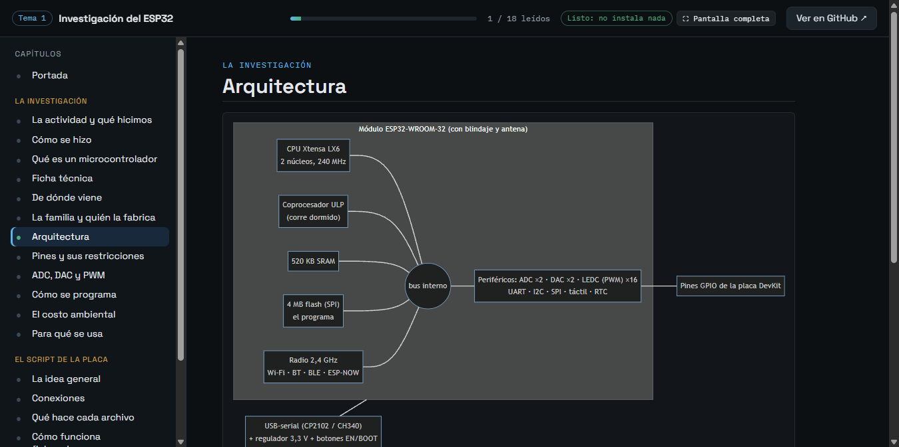
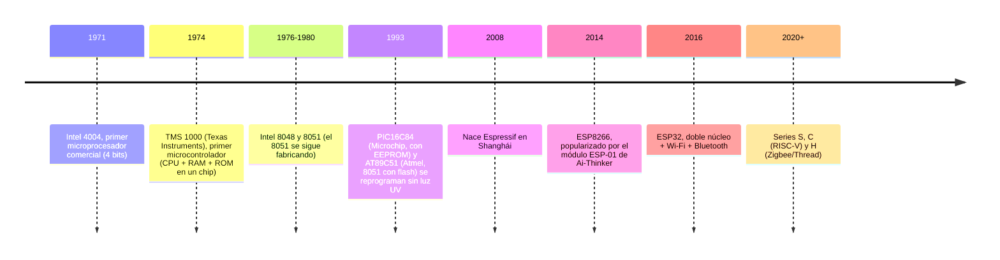
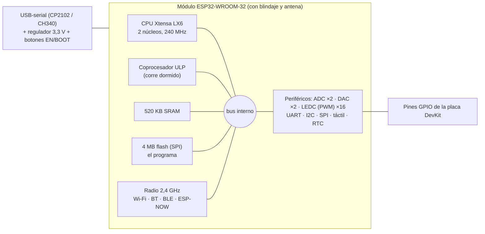
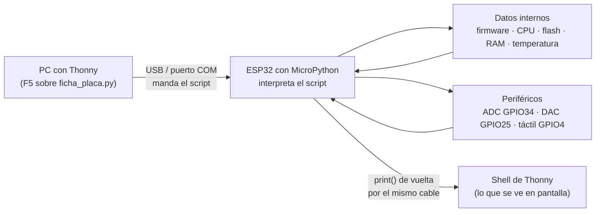
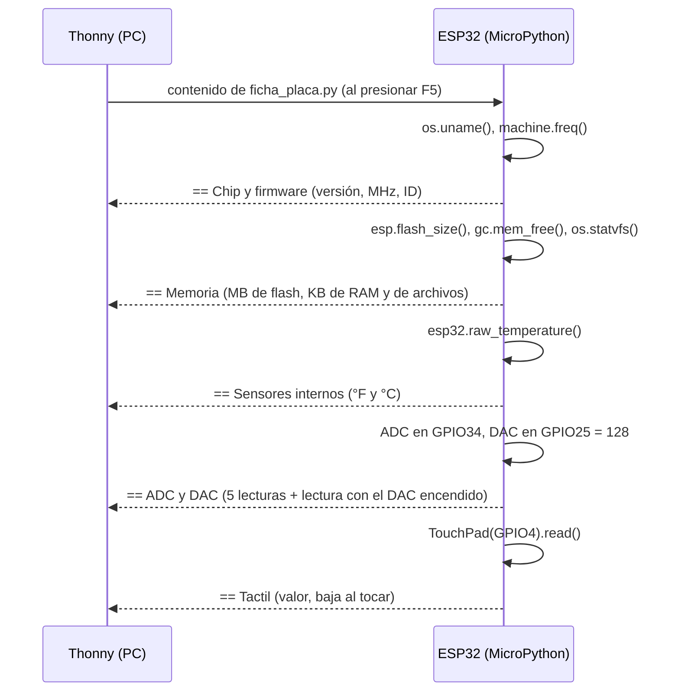

# Investigación del ESP32

Actividad 1 del curso: investigación sobre el microcontrolador que se usa en todos los laboratorios. No sale de una carpeta de U_Militar; el material de instalación que la sigue es el del [tema 2](../2-lenguajes-thonny).

## ¿Quiere probarlo? Aquí está

Doble clic en [`ABRIR.bat`](ABRIR.bat) (en Linux o Mac, `./abrir.sh`). Solo hace falta Python 3.9 o
más nuevo; no se instala nada más y abre en unos segundos. Se abre la app del tema en una ventana
propia: toda esta investigación como un **lector por capítulos** (índice a la izquierda, barra de
progreso de lectura y la lista de lo que pedía la actividad, que se va marcando sola al leer cada
capítulo), más un capítulo extra, **"Córrelo en tu ESP32"**, con el script de la placa listo para
copiar a Thonny, qué se conecta y qué debe salir en la Shell. Los diagramas se dibujan con internet;
sin internet se ve el mismo texto.



Qué hacer en cada parte de la app, botón por botón, está en
[Cómo probarlo con la app, paso a paso](#cómo-probarlo-con-la-app-paso-a-paso).

## ¿Quiere saber cómo funciona? Aquí está todo

**Paso a paso**

- [Cómo se hizo, paso a paso](#cómo-se-hizo-paso-a-paso) (qué se hizo primero, qué después y qué
  problemas se resolvieron)
- [Cómo probarlo con la app, paso a paso](#cómo-probarlo-con-la-app-paso-a-paso) (sección por
  sección y botón por botón)
- [Cómo probarlo sin la app y con el ESP32 real](#cómo-probarlo) (Wokwi, Thonny o `mpremote` por
  consola, y la placa de verdad)

**La investigación**

- [Qué pedía la actividad y qué hicimos](#qué-pedía-la-actividad-y-qué-hicimos)
- [Qué es un microcontrolador](#qué-es-un-microcontrolador) (GPIO, periférico, firmware)
- [Ficha técnica del DevKit V1 con ESP32-WROOM-32](#ficha-técnica-devkit-v1-con-esp32-wroom-32-la-placa-de-los-labs)
- [De dónde viene](#de-dónde-viene) (el microcontrolador y las revoluciones industriales)
- [La familia y quién la fabrica](#la-familia-y-quién-la-fabrica)
- [Arquitectura](#arquitectura)
- [Pines: lo que no se puede hacer con cada uno](#pines-lo-que-no-se-puede-hacer-con-cada-uno)
- [Qué es un ADC, un DAC y el PWM](#qué-es-un-adc-un-dac-y-el-pwm)
- [Cómo se programa](#cómo-se-programa)
- [El costo ambiental de un chip barato](#el-costo-ambiental-de-un-chip-barato)
- [Para qué se usa](#para-qué-se-usa)

**El script que se lo pregunta a la placa (`ficha_placa.py`)**

- [La idea general](#la-idea-general) (diagramas del flujo PC ↔ ESP32)
- [Conexiones](#conexiones)
- [Qué hace cada archivo](#qué-hace-cada-archivo)
- [Cómo funciona `ficha_placa.py` paso a paso](#cómo-funciona-ficha_placapy-paso-a-paso)
- [Qué se usó de todo esto en este repositorio](#qué-se-usó-de-todo-esto-en-este-repositorio)
- [Cómo probarlo](#cómo-probarlo) (sin ESP32 y con ESP32) y [Pendiente](#pendiente)

## Qué pedía la actividad y qué hicimos

La actividad era investigar a fondo el ESP32 antes de empezar a programarlo: de dónde sale la idea
del microcontrolador, quién lo fabrica, cómo está armado por dentro, qué pines y periféricos trae,
cómo se programa, qué costo ambiental tiene y para qué se usa. Todo eso está en las secciones de
abajo.

Como una investigación que solo se lee se queda en el papel, le sumamos un script corto,
[`ficha_placa.py`](ficha_placa.py), que se corre en la placa real y le pregunta al propio chip los
datos de la ficha técnica: frecuencia de la CPU, tamaño de la flash, RAM libre, temperatura interna,
y una lectura de tres periféricos (ADC, DAC y táctil). Así cada número de la tabla se puede
comprobar en vez de creérselo al fabricante. Al final del README está qué periféricos de los que
investigamos terminamos usando en los temas siguientes y en el proyecto final.

## Cómo se hizo, paso a paso

1. **La investigación, primero como texto.** Se armó la lista de lo que pedía la actividad (origen,
   fabricante y familia, arquitectura, pines, programación, costo ambiental, usos) y se escribió una
   sección por punto, más la ficha técnica en una tabla. Fue el primer contenido del repositorio:
   empezó como un repositorio aparte (`esp32-investigacion`) y después pasó a ser esta carpeta
   cuando se creó `Sensores-Teoria` para reunir todos los temas.
2. **Los diagramas.** La línea de tiempo (`timeline`) y la arquitectura del módulo (`flowchart`) se
   hicieron en `mermaid`, que GitHub dibuja directo desde el texto del README.
3. **Los conceptos de base.** Se explicaron aparte las palabras que el resto del repositorio usa
   todo el tiempo (GPIO, periférico, firmware, ADC, DAC, PWM, táctil capacitivo, UART, I2C, SPI,
   ESP-NOW): "Qué es un microcontrolador", "Qué es un ADC, un DAC y el PWM" y la lista de buses,
   para no darlas por sabidas en los temas siguientes.
4. **El script que lo comprueba (`ficha_placa.py`).** Una investigación que solo se lee no se puede
   verificar, así que se escribió un script corto de MicroPython que le pregunta al chip sus propios
   datos. Las decisiones y problemas que se resolvieron en el código:
   - `esp32.raw_temperature()` no existe en todos los firmwares: va dentro de un `try/except
     AttributeError` para que su falta no tumbe el resto de las pruebas.
   - Para la prueba DAC → ADC se eligió **GPIO34** (solo entrada, del ADC1) y no otro pin, para que
     al unirlo con el DAC con un cable no haya riesgo de que los dos queden como salida y choquen.
   - El ADC del ESP32 no es perfectamente lineal: por eso el script y el README dicen "cerca de
     2000" y no un número exacto (la cuenta ideal da 128/255 × 4095 ≈ 2055).
   - El táctil va en **GPIO4** (canal T0) y no en GPIO0, 2, 12 o 15, que también son táctiles pero
     son pines de arranque.
5. **Qué se usó después.** Al avanzar el curso se agregó la tabla
   [Qué se usó de todo esto en este repositorio](#qué-se-usó-de-todo-esto-en-este-repositorio), que
   conecta cada periférico investigado con el tema donde se usó de verdad.
6. **La app.** Se armó un lector por capítulos (`app/`) que lee los títulos `## ` de este mismo
   README, así que cualquier sección nueva aparece sola en la app sin tocar su código. Se le sumó un
   capítulo propio, "Córrelo en tu ESP32", con el script listo para copiar.
7. **Lo que falta.** La captura de la Shell de Thonny con la salida en la placa del laboratorio (ver
   [Pendiente](#pendiente)): no se inventaron valores.

## Cómo probarlo con la app, paso a paso

El tema es de lectura, así que la app no lanza programas en el PC: es un lector de esta
investigación con el script de la placa listo para copiar.

1. **Abrirla.** Doble clic en [`ABRIR.bat`](ABRIR.bat) (en Linux o Mac, `./abrir.sh`). Se abre una
   ventana propia, maximizada, con la pantalla "Abriendo la práctica…" unos segundos. La consola
   negra del `ABRIR.bat` se minimiza sola: no hay que cerrarla mientras se usa la app.
2. **La barra de arriba.** A la izquierda, "Tema 1 · Investigación del ESP32". En el centro, la
   barra de progreso de lectura y el contador "N / 18 leídos" (los capítulos que ya se abrieron). A
   la derecha, el chip verde "Listo: no instala nada" (este tema no necesita entorno de Python), el
   botón **Pantalla completa** (Esc para salir) y **Ver en GitHub ↗**, que abre la carpeta del tema
   en GitHub, donde se ven los diagramas aunque falle la app.
3. **El índice de la izquierda.** "Portada" y los capítulos en dos grupos: *La investigación* y
   *El script de la placa*. Un clic abre ese capítulo; el punto de la izquierda se pone verde cuando
   ya se leyó y el capítulo abierto queda resaltado. Abajo, el enlace "Tema 2: Thonny y MicroPython
   ↗" abre la app del tema 2. En una ventana angosta (menos de 900 px de ancho) el índice se esconde
   y se abre con el botón **☰** de arriba a la izquierda.
4. **La portada.** Dos botones: **Empezar a leer →** abre el primer capítulo e **Ir al script de la
   placa** salta a "Córrelo en tu ESP32". Debajo, la tarjeta **Qué pide la actividad**: cada punto
   del enunciado es un enlace al capítulo que lo responde y su casilla se marca sola al leer ese
   capítulo (también se puede marcar a mano). La tarjeta **Cómo está organizado** dice cuántos
   capítulos tiene cada grupo y por cuál empezar.
5. **Un capítulo.** Es la sección del README con el mismo nombre. Los diagramas `mermaid` se dibujan
   si hay internet (sin internet se ve el texto del diagrama). Los enlaces a otros temas abren la app
   de ese tema, los enlaces a archivos abren GitHub y el enlace a `ficha_placa.py` lleva al capítulo
   de la placa. Las imágenes se amplían con un clic.
6. **"En este capítulo".** En pantallas anchas (desde 1500 px, por ejemplo 1920x1080) aparece a la
   derecha una columna con los subtítulos, tablas y diagramas del capítulo abierto; un clic baja hasta
   ese punto y la lista marca por dónde va la lectura. A 1366x768 no aparece, para no apretar el
   texto.
7. **Moverse entre capítulos.** Abajo de cada capítulo, **← Anterior** y **Siguiente: <nombre> →**
   (en el último dice "Fin"), con "Capítulo N de 18" en el medio. Las flechas ← y → del teclado hacen
   lo mismo. La app recuerda qué se leyó aunque se cierre.
8. **"Córrelo en tu ESP32"** (el capítulo propio de la app, resaltado en azul en el índice): el
   recorrido PC → ESP32 → Shell, los cinco pasos para correr el script en la placa, el botón
   **Instalar MicroPython (tema 2) ↗** (abre la app del tema 2 directo en su paso de instalación),
   qué se conecta, la salida que debe aparecer en la Shell y el código. **Copiar el código** lo deja
   en el portapapeles con el aviso "Código copiado…"; si el navegador no deja copiar, lo selecciona
   y avisa "Texto seleccionado: cópialo con Ctrl+C". **En GitHub ↗** abre el archivo en GitHub. El
   plegado **¿Y sin placa? (Wokwi)** tiene el botón **Abrir Wokwi (MicroPython en ESP32) ↗**, que
   abre un proyecto nuevo de Wokwi en una pestaña.
9. **Si algo falla.** Si un capítulo dice "No se pudo cargar este capítulo", el lanzador se cerró
   (la consola del `ABRIR.bat`): volver a hacer doble clic en `ABRIR.bat`. Si `ABRIR.bat` dice que no
   encuentra Python, instalar Python 3.9 o más nuevo desde python.org marcando "Add python.exe to
   PATH". Si los diagramas salen como texto, falta internet (el contenido es el mismo).

## Qué es un microcontrolador

Un **microprocesador** es solo la CPU: hace cuentas y toma decisiones, pero necesita chips externos
de memoria y de entrada/salida para servir de algo (así es el procesador de un computador). Un
**microcontrolador** mete CPU, memoria y pines en una sola pieza de silicio: con él solo ya se arma
un sistema completo que lee sensores y mueve cosas. El ESP32 es un microcontrolador, y además trae
la radio (Wi-Fi y Bluetooth) dentro del mismo chip, que es lo que lo hizo tan popular.

Tres palabras que aparecen en todo el repositorio:

- **GPIO** (*General Purpose Input/Output*): un pin de propósito general. Por programa se decide si
  es salida (el chip pone 0 V o 3,3 V, por ejemplo para prender un LED) o entrada (el chip lee si
  hay 0 V o 3,3 V, por ejemplo un botón). En el ESP32 casi cualquier GPIO puede además conectarse a
  un periférico interno.
- **Periférico**: un bloque de hardware dentro del chip que hace una tarea sola, sin ocupar la CPU:
  convertir un voltaje en número (ADC), generar PWM, hablar por un bus (UART, I2C, SPI). La CPU solo
  lo configura y le lee o escribe los resultados.
- **Firmware**: el programa que vive grabado en la memoria flash del chip y arranca cada vez que se
  enciende. Puede ser un sketch de Arduino ya compilado o el intérprete de MicroPython (tema 2).

## Ficha técnica (DevKit V1 con ESP32-WROOM-32, la placa de los labs)

| Dato | Valor |
|---|---|
| CPU | Xtensa LX6 de 32 bits, **2 núcleos**, 160-240 MHz (diseño de Tensilica) + coprocesador ULP |
| Memoria | 520 KB de SRAM · 4 MB de flash externa (SPI) |
| Radio | Wi-Fi 802.11 b/g/n 2,4 GHz · Bluetooth clásico y BLE · ESP-NOW (sin router) |
| Voltaje de trabajo | **3,3 V** (la placa regula desde 5 V por USB o VIN) |
| ADC | 2 unidades de 12 bits (4096 niveles): ADC1 (8 canales) y ADC2 (10, **no usar con Wi-Fi activo**) |
| DAC | **solo 2** salidas analógicas reales, de 8 bits (256 niveles): GPIO25 y GPIO26 |
| PWM (LEDC) | 16 canales, hasta 16 bits, frecuencia configurable (casi cualquier GPIO) |
| Buses | 3 UART · 2 I2C · SPI (VSPI y HSPI) |
| Otros | 10 pines táctiles capacitivos · RTC_GPIO que siguen vivos en sueño profundo (~µA) |
| Fabricación | Diseño de Espressif (Shanghái), silicio de TSMC a 40 nm |

Las filas de CPU, flash, RAM, ADC, DAC y táctil son las que `ficha_placa.py` comprueba en la placa
(ver [Cómo funciona `ficha_placa.py`](#cómo-funciona-ficha_placapy-paso-a-paso)).

## De dónde viene

El salto que importa aquí es la **tercera revolución industrial** (electrónica, computadores,
automatización): un sistema que decide con lógica programable y no solo con mecanismos. El ESP32
se vuelve masivo en la **cuarta** (Industria 4.0, Internet de las Cosas), porque es justo el chip
que permite que cualquier objeto barato tenga sensores y se conecte a una red.



**Cómo cambió la forma de programarlos.** La ROM/PROM se grababa una vez. La EPROM se podía borrar,
pero con luz ultravioleta por una ventana de cuarzo. La EEPROM y la flash se borran eléctricamente;
cuando en 1993 llegaron a microcontroladores baratos (PIC16C84, AT89C51), probar un programa pasó de
tomar media hora a unos segundos. El ESP32 usa flash.

**El ESP8266 y el salto al ESP32.** El ESP8266 no se hizo famoso por el marketing de Espressif:
Ai-Thinker sacó el ESP-01, un módulo con Wi-Fi rarísimamente barato que se manejaba con comandos AT
y documentación en chino. La comunidad lo adoptó igual, Espressif liberó sus kits de desarrollo y
aparecieron NodeMCU y WeMos. El ESP32 (6 de septiembre de 2016) corrigió sus carencias: pasó de uno
a dos núcleos, sumó Bluetooth y muchos más periféricos (ADC, DAC, SPI, I2C, UART) y un sueño
profundo de microamperios.

## Arquitectura



Tres niveles distintos que se suelen confundir: el **chip** (ESP32-D0WDQ6, el silicio, casi nunca
se compra suelto), el **módulo** (el chip con antena, flash y blindaje: lo que un fabricante suelda
en su producto) y la **placa de desarrollo** (el módulo con headers, conversor USB-serial, regulador
y botones: lo que se compra para aprender). Con dos núcleos se puede dejar uno para la radio y el
otro para la aplicación, aunque un solo núcleo alcanza para la mayoría de proyectos.

Los dos botones de la placa DevKit se usan todo el tiempo: **EN** reinicia el chip (vuelve a correr
el firmware desde cero) y **BOOT** lo pone en modo de grabación si se mantiene presionado al
arrancar, que es lo que a veces hace falta para instalarle MicroPython (tema 2). El conversor
USB-serial es lo que hace que el PC vea la placa como un puerto COM: por ahí se graba el firmware y
por ahí mismo el ESP32 le habla al PC en casi todos los temas siguientes.

## Pines: lo que no se puede hacer con cada uno

Cada pin del DevKit cumple varias funciones según cómo se configure; por eso el pinout trae varias
etiquetas por pin. Las restricciones que más problemas dan:

| Pines | Restricción | Consecuencia práctica |
|---|---|---|
| GPIO34, 35, 36, 39 | **Solo entrada**, sin pull-up interno | Sirven para sensores (así se usan en el proyecto final), nunca para mover algo |
| ADC2 (GPIO0, 2, 4, 12-15, 25-27) | Comparte hardware con el Wi-Fi | Con Wi-Fi activo la lectura falla: para analógico + Wi-Fi, usar ADC1 |
| GPIO25, 26 | Únicos DAC | Si se usan como DAC, no quedan para otra cosa (tema 5) |
| GPIO0, 2, 12, 15 | Pines de arranque (strapping) | Un módulo que los fuerce al encender puede impedir que la placa arranque |
| GPIO6-11 | Conectados a la flash interna | No se usan nunca |
| 3V3 / VIN / GND / EN | Alimentación y reinicio | El chip trabaja a 3,3 V: un sensor de 5 V necesita divisor (el ECHO del HC-SR04) |

## Qué es un ADC, un DAC y el PWM

El mundo físico es analógico (temperatura, luz, un potenciómetro) y el chip solo entiende ceros y
unos. El **ADC** (convertidor analógico-digital) convierte un voltaje de 0 a 3,3 V en un número de
0 a 4095. El **DAC** (digital-analógico) hace lo contrario, un voltaje real de salida, pero solo en
dos pines y con 8 bits: generar una salida analógica limpia exige más circuitería que leer una. El
**PWM** no es analógico: es una señal digital que se prende y apaga muy rápido y que, promediada por
un motor o un LED, se comporta como si lo fuera. Por eso para brillo o velocidad se usa PWM (hay 16
canales) y el DAC se deja para lo que de verdad necesita una señal analógica, como las figuras en el
osciloscopio del tema 5.

La diferencia de bits se ve en números: el ADC tiene 12 bits, es decir 2¹² = 4096 niveles (0 a
4095), y el DAC 8 bits, 2⁸ = 256 niveles (0 a 255). Los dos cubren el mismo rango de 0 a 3,3 V, así
que un paso del DAC equivale a unos 16 pasos del ADC. Si el DAC saca 128 (la mitad de su escala,
~1,65 V), el ADC que lee ese mismo voltaje debería marcar alrededor de 128/255 × 4095 ≈ 2055. Esa
es justo la prueba del puente GPIO25 → GPIO34 que hace `ficha_placa.py`. En la práctica el ADC del
ESP32 no es perfectamente lineal, así que el número real ronda ese valor sin clavarlo; por eso el
script habla de "cerca de 2000" y no de un valor exacto.

**Qué es el táctil capacitivo.** Diez GPIO del ESP32 pueden medir la capacitancia del pin: el chip
carga y descarga el pin muchas veces y cuenta cuánto tarda. Un dedo encima suma capacitancia (el
cuerpo funciona como una placa de condensador), el ciclo se hace más lento y el número que devuelve
**baja**. Por eso con un simple cable o una lámina de cobre se arma un botón sin partes móviles.

## La idea general

El tema no tiene programa de PC propio: el "lado PC" es Thonny, que manda `ficha_placa.py` a la
placa por el cable USB, y la placa responde imprimiendo los datos que lee de sí misma. Todo el
trabajo lo hace el chip.





## Conexiones

El script está pensado para correr **sin nada conectado**: todo lo que imprime lo lee el propio
chip. Solo hay un cable opcional, para la prueba ADC ↔ DAC, y un pin que se toca con el dedo.

| Qué | Pin del ESP32 | Periférico que usa | Voltaje | ¿Hace falta conectar algo? |
|---|---|---|---|---|
| Lectura analógica | GPIO34 | ADC1, canal 6, atenuación 11 dB (rango ~0-3,3 V) | Entrada de 0 a 3,3 V | No. Suelto "flota" y da números al azar |
| Salida analógica | GPIO25 | DAC 1, 8 bits | Sale 128/255 × 3,3 V ≈ 1,65 V | No |
| Puente de prueba (opcional) | GPIO25 → GPIO34 | DAC → ADC | ~1,65 V | Un cable macho-macho entre los dos pines, sin resistencia |
| Botón táctil | GPIO4 | Touch T0 | — | No: se toca el pin (o un cable pegado a él) con el dedo |
| Alimentación y datos | USB de la placa | Conversor USB-serial + regulador | 5 V del USB, el chip trabaja a 3,3 V | El cable USB al PC |

Por qué esos pines y no otros:

- **GPIO34 para el ADC**: es un pin de solo entrada, así que no hay riesgo de que por error el
  programa lo ponga como salida y choque con el DAC cuando se unen con el cable. Y pertenece al
  ADC1, el que sigue funcionando con el Wi-Fi encendido (el ADC2 no).
- **GPIO25 para el DAC**: no había opción, el DAC solo existe en GPIO25 y GPIO26.
- **GPIO4 para el táctil**: es el canal T0 y no es pin de arranque "peligroso" como GPIO0, 2, 12 o
  15, que también tienen canal táctil pero pueden impedir el arranque si algo los fuerza al
  encender.
- El puente va **sin resistencia** porque GPIO34 es una entrada de alta impedancia: casi no toma
  corriente del DAC.

## Qué hace cada archivo

- **`README.md`**: este documento, la investigación completa.
- **[`ficha_placa.py`](ficha_placa.py)**: script de MicroPython que corre en el ESP32 (no en el PC).
  Se abre en Thonny y se corre con F5, sin grabarlo como `main.py`: es una prueba de una sola vez,
  no un programa que tenga que arrancar solo al encender la placa. Imprime por la Shell de Thonny
  cinco bloques (chip y firmware, memoria, sensores internos, ADC/DAC y táctil) y termina.
- **`ABRIR.bat`** / **`abrir.sh`**, **`probar.json`** y **`app/`**: la app del tema (el lector por
  capítulos de arriba). `probar.json` le dice al lanzador del repo qué pedía la actividad y qué enlaces
  ofrecer; `app/` es la página (HTML, CSS y JS sin librerías que instalar), que arma sus capítulos
  leyendo los títulos de este mismo README.
- **`img/`**: la captura de la app.

No hay entorno de Python (`entorno/`) en este tema porque no hay código que corra en el PC: el
único script vive en la placa y lo ejecuta MicroPython.

## Cómo funciona `ficha_placa.py` paso a paso

El script es una lista de preguntas al chip, en cinco bloques, cada uno con un título `== ...` para
que la salida se lea ordenada en la Shell.

**1. Chip y firmware.** `os.uname()` devuelve qué versión de MicroPython corre y para qué chip se
compiló (así se confirma que el firmware es el del ESP32 y no uno de otra variante, uno de los
problemas del tema 2). Después lee la frecuencia de la CPU y la sube al máximo de la ficha:

```python
print("CPU a", machine.freq() // 1000000, "MHz")
machine.freq(240000000)
print("CPU subida a", machine.freq() // 1000000, "MHz")
```

MicroPython arranca el ESP32 en 160 MHz para gastar menos; `machine.freq()` sin argumento lee la
frecuencia en Hz y con argumento la cambia. Dividir entre 1 000 000 la deja en MHz. El
identificador único sale de `machine.unique_id()`, que es la MAC grabada de fábrica; `hexlify` la
pasa a texto hexadecimal para que se pueda leer.

**2. Memoria.** Tres números distintos que conviene no mezclar:

- `esp.flash_size()`: el tamaño de la flash externa en bytes (4 MB en el WROOM-32). Ahí viven el
  firmware y los archivos `.py`.
- `gc.mem_free()`: cuánta RAM queda libre **para el programa de Python**. Antes se llama a
  `gc.collect()` (el recolector de basura) para que no cuente como ocupada memoria que ya se puede
  liberar. El número sale bastante por debajo de los 520 KB de la ficha, porque el sistema, la pila
  del Wi-Fi y el propio intérprete se quedan con una parte antes de que el programa arranque.
- `os.statvfs("/")`: el sistema de archivos que MicroPython monta dentro de la flash. Devuelve una
  tupla; el índice 0 es el tamaño de bloque, el 2 el total de bloques y el 3 los libres, así que
  bloque × cantidad da los bytes.

**3. Sensores internos.** `esp32.raw_temperature()` lee el sensor de temperatura del chip, que
entrega grados Fahrenheit; el script los pasa a Celsius con `(F - 32) / 1.8`. Va dentro de un
`try/except AttributeError` porque algunas versiones del firmware no traen esa función, y no tiene
sentido que eso tumbe el resto de las pruebas. Es un sensor poco preciso: sirve para ver si el chip
se calienta, no como termómetro del ambiente.

**4. ADC y DAC.**

```python
adc = ADC(Pin(34))
adc.atten(ADC.ATTN_11DB)
print("ADC GPIO34 (0-4095):", [adc.read() for _ in range(5)])
dac = DAC(Pin(25))
dac.write(128)
time.sleep_ms(10)
print("DAC GPIO25 en 128 -> ADC GPIO34 lee:", adc.read(), ...)
```

Sin atenuación el ADC del ESP32 solo mide hasta ~1,1 V; con `ATTN_11DB` el rango llega a ~3,3 V,
que es el voltaje de trabajo de la placa. Se toman cinco lecturas seguidas para que se vea si el
valor es estable (pin conectado a algo) o salta de un lado a otro (pin suelto, "flotando"). Después
el DAC saca 128, la mitad de su escala, se espera 10 ms a que el voltaje se asiente y se vuelve a
leer el ADC. Si el puente GPIO25 → GPIO34 está puesto, esa lectura ronda los 2000; si no, sale
cualquier cosa, y eso también es correcto.

**5. Táctil.** `machine.TouchPad(Pin(4)).read()` devuelve el valor capacitivo del pin. Una sola
lectura no dice mucho sola: la idea es correr el script una vez sin tocar y otra tocando el pin con
el dedo, y comparar. Tocando, el número baja.

La salida tiene esta forma (los valores reales dependen de cada placa y de la versión del
firmware; las `<...>` son lo que cambia):

```
== Chip y firmware
Firmware: <versión> | maquina: <placa y chip>
CPU a 160 MHz
CPU subida a 240 MHz
ID unico: <12 cifras hexadecimales>
== Memoria
Flash: 4 MB
RAM libre para Python: <KB> KB
Sistema de archivos: <KB> KB libres de <KB> KB
== Sensores internos
Temperatura interna: <F> F (~<C> C)
== ADC (12 bits) y DAC (8 bits)
ADC GPIO34 (0-4095): [<5 lecturas>]
DAC GPIO25 en 128 -> ADC GPIO34 lee: <valor> (cerca de 2000 solo si estan unidos)
== Tactil
Tactil GPIO4 (tocar el pin y volver a correr): <valor>
```

## Qué se usó de todo esto en este repositorio

| Periférico | Tema | Para qué |
|---|---|---|
| UART por USB | [3](../3-deteccion-objetos), [4](../4-chatbot-asistente-voz), [6](../6-control-de-led-mediante-gestos), [7](../7-brazo-robotico-urdf), [8](../8-digitos-brazo-y-vision), [9](../9-taller-segundo-corte) | PC ↔ ESP32 con líneas de texto |
| DAC ×2 | [5](../5-parcial-figuras-lissauer) | Dibujar peces en un osciloscopio en modo XY |
| PWM (LEDC) | [6](../6-control-de-led-mediante-gestos), [proyecto final](../proyecto-final) | Brillo de LEDs, pasos de los motores, motores del carro |
| I2C | [8](../8-digitos-brazo-y-vision), [proyecto final](../proyecto-final) | LCD, OLED, PCA9685, láser VL53L0X |
| UART2 + SPI | [8](../8-digitos-brazo-y-vision/punto-2-reconocimiento-oled-spi) | Dos ESP32 hablando entre sí |
| ESP-NOW | [proyecto final](../proyecto-final/firmware) | Radio entre la estación y el carro, sin router |

Qué es cada bus, en una línea, porque aparecen en esa tabla y en los temas siguientes:

- **UART**: comunicación serie por dos cables cruzados (TX de uno al RX del otro), sin reloj
  compartido; los dos lados acuerdan la velocidad (por ejemplo 115200 baudios). Es lo que va por el
  cable USB entre el PC y la placa.
- **I2C**: un bus de dos cables (SDA datos, SCL reloj) donde varios dispositivos comparten los
  mismos cables y el ESP32 le habla a cada uno por su dirección (una LCD suele estar en `0x27`).
- **SPI**: más rápido que I2C, con reloj puesto por el maestro, una línea de datos por sentido y un
  cable extra (`SS`/`CS`) por cada esclavo para elegir con cuál habla.
- **ESP-NOW**: un protocolo de radio propio de Espressif que usa el hardware del Wi-Fi para mandar
  mensajes cortos directo de un ESP32 a otro, sin router ni red.

## La familia y quién la fabrica

| Serie | Núcleo | Para qué |
|---|---|---|
| ESP32 (WROOM-32) | Xtensa LX6 ×2 | Propósito general: el de los labs |
| ESP32-S2 | Xtensa ×1 | Seguridad (motor criptográfico), **sin Bluetooth** |
| ESP32-S3 | Xtensa LX7 ×2 | IA ligera e imagen, más GPIO |
| ESP32-C3 | **RISC-V** (abierto, sin licencia) | Más barato y eficiente |
| ESP32-H2 | RISC-V | Zigbee y Thread (domótica en malla) |

Espressif fabrica sus módulos oficiales, pero como el diseño es relativamente abierto, muchas
marcas (Ai-Thinker, DOIT, AZ-Delivery, HiLetgo) arman sus propias placas. Genérica no significa
mala: muchas usan el módulo original y solo cambian la placa y el conversor USB (CP2102 o CH340).
El riesgo de las más baratas está en el regulador, el conversor USB o una flash de peor calidad.
Frente a un AVR (Arduino clásico), el ESP32 gana por traer la radio integrada a muy bajo precio,
más periféricos y una comunidad enorme.

## Cómo se programa

| | C/C++ (Arduino o ESP-IDF) | MicroPython |
|---|---|---|
| Ejecución | Compilado a instrucciones nativas: máxima velocidad y latencia predecible | Intérprete: más lento, menos predecible en tiempos finos |
| Memoria | Poca RAM en ejecución | El intérprete ocupa RAM (el proyecto final precompila a `.mpy` para ahorrarla) |
| Acceso al hardware | Todo, incluido lo de bajo nivel | La mayoría (`machine`, `espnow`...) pero no todo: no hay SPI esclavo (ver tema 8) |
| Ciclo de prueba | Recompilar y volver a subir todo | Cambiar un archivo y probar al instante en el REPL |
| Errores típicos | Fugas de memoria, desbordes | Casi no existen: memoria automática |
| Herramientas | Arduino IDE, PlatformIO, ESP-IDF | Thonny, mpremote |

En resumen: C cuando hace falta exprimir el chip o controlar el hardware fino; MicroPython cuando
importa iterar rápido y que el código se lea fácil. También hay soporte creciente para Rust (sobre
todo en RISC-V) y JavaScript con firmwares específicos. El detalle de Thonny, cómo se instala
MicroPython y una medición real de la diferencia de velocidad entre los dos lenguajes están en el
[tema 2](../2-lenguajes-thonny). Nosotros elegimos MicroPython para casi todo el repositorio por el
ciclo de prueba: poder cambiar una línea y probarla en segundos pesó más que la velocidad.

## El costo ambiental de un chip barato

Fabricar semiconductores gasta mucha energía, agua y metales difíciles de conseguir de forma
sostenible; que el módulo cueste unos pocos dólares no significa que ese costo no exista, solo que
no aparece en el precio. Al ser tan barato, termina seguido en prototipos abandonados o productos
de poca duración, alimentando la basura electrónica, uno de los residuos que más crece. A favor:
su sueño profundo de microamperios lo hace muy eficiente en proyectos a batería. Diseñar para que
dure, se reutilice o se deseche bien es parte de usar esta tecnología con criterio.

## Para qué se usa

Domótica (es el corazón de ESPHome y Tasmota, y de productos como Shelly o Athom), sensores
remotos industriales que reportan por Wi-Fi, wearables por su bajo consumo, y control de motores y
lazos cerrados en laboratorios de mecatrónica, como los de este repositorio.

## Cómo probarlo

Con la app: [Cómo probarlo con la app, paso a paso](#cómo-probarlo-con-la-app-paso-a-paso). Sin la
app no se pierde nada: todo lo que muestra es este README (en GitHub, con los diagramas dibujados) y
[`ficha_placa.py`](ficha_placa.py). Para abrir la app desde una consola en vez del `ABRIR.bat`, en
la raíz del repositorio: `python _lanzador/lanzador.py --practica 1-esp32-investigacion`.

**Sin ESP32 conectado**

Casi todo este tema es lectura. Para ver los pines y periféricos en acción sin hardware,
[Wokwi](https://wokwi.com) simula un ESP32 DevKit completo en el navegador: se crea un proyecto
"MicroPython on ESP32" y se pega el código. El [tema 2](../2-lenguajes-thonny) trae ejemplos listos
para pegar ahí (tres LEDs y un display de siete segmentos). `ficha_placa.py` también se puede pegar,
pero ojo: un simulador no tiene flash, temperatura ni capacitancia reales, así que lo que devuelva
en esos bloques (o si alguna función no existe en el simulador) no dice nada de la placa. El
objetivo del script es justamente medir el hardware de verdad.

**Con ESP32 conectado**

1. Instalar MicroPython en la placa (los pasos están en el [tema 2](../2-lenguajes-thonny#instalar-micropython-en-el-esp32)).
2. Conectar la placa por USB y en Thonny elegir, abajo a la derecha, el intérprete
   "MicroPython (ESP32)" con su puerto COM. Debe aparecer el `>>>` en la Shell.
3. Abrir [`ficha_placa.py`](ficha_placa.py) en Thonny y presionar F5. La Shell imprime los cinco
   bloques de arriba.
4. Prueba del ADC contra el DAC: poner un cable entre GPIO25 y GPIO34 y volver a presionar F5. La
   línea `DAC GPIO25 en 128 -> ADC GPIO34 lee:` debe marcar alrededor de 2000. Sin el cable, ese
   número sale al azar. Es la prueba más directa de que 8 bits de DAC y 12 bits de ADC no son la
   misma escala.
5. Prueba del táctil: anotar el valor de `Tactil GPIO4`, correr de nuevo con el dedo sobre el pin
   GPIO4 y comparar: tocando, baja.

No hace falta grabarlo como `main.py`: F5 lo ejecuta una vez y la placa queda libre para el
siguiente tema.

Lo mismo por consola, sin Thonny (con Thonny cerrado, porque si no tiene el puerto tomado), con
[`mpremote`](https://docs.micropython.org/en/latest/reference/mpremote.html), la herramienta oficial
de MicroPython:

```
python -m pip install mpremote
python -m mpremote connect COM7 run ficha_placa.py
```

`COM7` es el puerto que nos tocó a nosotros (el de cada placa sale en el Administrador de
dispositivos). `run` manda el archivo a la placa, lo ejecuta sin guardarlo (igual que F5) y muestra
en la consola los cinco bloques de la salida.

## Pendiente

- Captura de la Shell de Thonny con la salida de `ficha_placa.py` en la placa del laboratorio (con
  y sin el puente GPIO25 → GPIO34, y el valor del táctil tocando y sin tocar).
