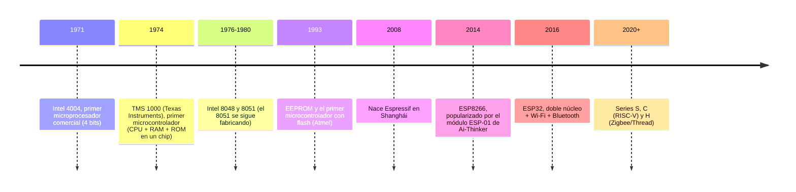
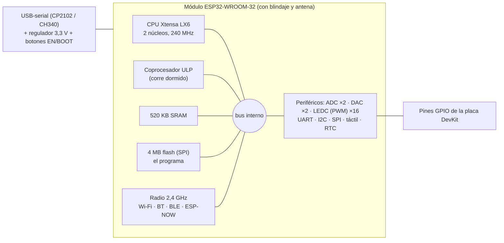

# Investigación del ESP32

## Ficha técnica (DevKit V1 con ESP32-WROOM-32, la placa de los labs)

| Dato | Valor |
|---|---|
| CPU | Xtensa LX6 de 32 bits, **2 núcleos**, 160-240 MHz (diseño de Tensilica) + coprocesador ULP |
| Memoria | 520 KB de SRAM · 4 MB de flash externa (SPI) |
| Radio | Wi-Fi 802.11 b/g/n 2,4 GHz · Bluetooth clásico y BLE · ESP-NOW (sin router) |
| Voltaje de trabajo | **3,3 V** (la placa regula desde 5 V por USB o VIN) |
| ADC | 2 unidades de 12 bits (4096 niveles): ADC1 (8 canales) y ADC2 (10, **no usar con Wi-Fi activo**) |
| DAC | **solo 2** salidas analógicas reales, de 8 bits (256 niveles): GPIO25 y GPIO26 |
| PWM (LEDC) | 16 canales, hasta 16 bits, frecuencia configurable (casi cualquier GPIO) |
| Buses | 3 UART · 2 I2C · SPI (VSPI y HSPI) |
| Otros | 10 pines táctiles capacitivos · RTC_GPIO que siguen vivos en sueño profundo (~µA) |
| Fabricación | Diseño de Espressif (Shanghái), silicio de TSMC a 40 nm |

## De dónde viene

El salto que importa aquí es la **tercera revolución industrial** (electrónica, computadores,
automatización): un sistema que decide con lógica programable y no solo con mecanismos. El ESP32
se vuelve masivo en la **cuarta** (Industria 4.0, Internet de las Cosas), porque es justo el chip
que permite que cualquier objeto barato tenga sensores y se conecte a una red.

**Microprocesador vs. microcontrolador.** Un microprocesador es solo la CPU y necesita chips
externos de memoria y de entrada/salida. Un microcontrolador mete CPU, memoria y pines en una sola
pieza de silicio: con él solo ya se arma un sistema completo.

**Cómo cambió la forma de programarlos.** La ROM/PROM se grababa una vez. La EPROM se podía borrar,
pero con luz ultravioleta por una ventana de cuarzo. La EEPROM y la flash (1993) se borran
eléctricamente, y eso volvió rápido probar programas. El ESP32 usa flash.

**El ESP8266 y el salto al ESP32.** El ESP8266 no se hizo famoso por el marketing de Espressif:
Ai-Thinker sacó el ESP-01, un módulo con Wi-Fi rarísimamente barato que se manejaba con comandos AT
y documentación en chino. La comunidad lo adoptó igual, Espressif liberó sus kits de desarrollo y
aparecieron NodeMCU y WeMos. El ESP32 (6 de septiembre de 2016) corrigió sus carencias: pasó de uno
a dos núcleos, sumó Bluetooth y muchos más periféricos (ADC, DAC, SPI, I2C, UART) y un sueño
profundo de microamperios.

## Arquitectura

Tres niveles distintos que se suelen confundir: el **chip** (ESP32-D0WDQ6, el silicio, casi nunca
se compra suelto), el **módulo** (el chip con antena, flash y blindaje: lo que un fabricante suelda
en su producto) y la **placa de desarrollo** (el módulo con headers, conversor USB-serial, regulador
y botones: lo que se compra para aprender). Con dos núcleos se puede dejar uno para la radio y el
otro para la aplicación, aunque un solo núcleo alcanza para la mayoría de proyectos.

## Pines: lo que no se puede hacer con cada uno

Cada pin del DevKit cumple varias funciones según cómo se configure; por eso el pinout trae varias
etiquetas por pin. Las restricciones que más problemas dan:

| Pines | Restricción | Consecuencia práctica |
|---|---|---|
| GPIO34, 35, 36, 39 | **Solo entrada**, sin pull-up interno | Sirven para sensores (así se usan en el proyecto final), nunca para mover algo |
| ADC2 (GPIO0, 2, 4, 12-15, 25-27) | Comparte hardware con el Wi-Fi | Con Wi-Fi activo la lectura falla: para analógico + Wi-Fi, usar ADC1 |
| GPIO25, 26 | Únicos DAC | Si se usan como DAC, no quedan para otra cosa (tema 5) |
| GPIO0, 2, 12, 15 | Pines de arranque (strapping) | Un módulo que los fuerce al encender puede impedir que la placa arranque |
| GPIO6-11 | Conectados a la flash interna | No se usan nunca |
| 3V3 / VIN / GND / EN | Alimentación y reinicio | El chip trabaja a 3,3 V: un sensor de 5 V necesita divisor (el ECHO del HC-SR04) |

## Analógico: ADC, DAC y PWM

El mundo físico es analógico (temperatura, luz, un potenciómetro) y el chip solo entiende ceros y
unos. El **ADC** convierte un voltaje de 0 a 3,3 V en un número de 0 a 4095. El **DAC** hace lo
contrario, un voltaje real de salida, pero solo en dos pines y con 8 bits: generar una salida
analógica limpia exige más circuitería que leer una. El **PWM** no es analógico: es una señal
digital que se prende y apaga muy rápido y que, promediada por un motor o un LED, se comporta como
si lo fuera. Por eso para brillo o velocidad se usa PWM (hay 16 canales) y el DAC se deja para lo
que de verdad necesita una señal analógica, como las figuras en el osciloscopio del tema 5.

## Qué se usó de todo esto en este repositorio

| Periférico | Tema | Para qué |
|---|---|---|
| UART por USB | [3](../3-deteccion-objetos), [4](../4-chatbot-asistente-voz), [6](../6-control-de-led-mediante-gestos), [7](../7-brazo-robotico-urdf), [8](../8-digitos-brazo-y-vision), [9](../9-taller-segundo-corte) | PC ↔ ESP32 con líneas de texto |
| DAC ×2 | [5](../5-parcial-figuras-lissauer) | Dibujar peces en un osciloscopio en modo XY |
| PWM (LEDC) | [6](../6-control-de-led-mediante-gestos), [proyecto final](../proyecto-final) | Brillo de LEDs, pasos de los motores, motores del carro |
| I2C | [7](../7-brazo-robotico-urdf), [8](../8-digitos-brazo-y-vision), [proyecto final](../proyecto-final) | Teclado, LCD, OLED, PCA9685, láser VL53L0X |
| UART2 + SPI | [8](../8-digitos-brazo-y-vision/punto-2-reconocimiento-oled-spi) | Dos ESP32 hablando entre sí |
| ESP-NOW | [proyecto final](../proyecto-final/firmware) | Radio entre la estación y el carro, sin router |

## La familia y quién la fabrica

| Serie | Núcleo | Para qué |
|---|---|---|
| ESP32 (WROOM-32) | Xtensa LX6 ×2 | Propósito general: el de los labs |
| ESP32-S2 | Xtensa ×1 | Seguridad (motor criptográfico), **sin Bluetooth** |
| ESP32-S3 | Xtensa LX7 ×2 | IA ligera e imagen, más GPIO |
| ESP32-C3 | **RISC-V** (abierto, sin licencia) | Más barato y eficiente |
| ESP32-H2 | RISC-V | Zigbee y Thread (domótica en malla) |

Espressif fabrica sus módulos oficiales, pero como el diseño es relativamente abierto, muchas
marcas (Ai-Thinker, DOIT, AZ-Delivery, HiLetgo) arman sus propias placas. Genérica no significa
mala: muchas usan el módulo original y solo cambian la placa y el conversor USB (CP2102 o CH340).
El riesgo de las más baratas está en el regulador, el conversor USB o una flash de peor calidad.
Frente a un AVR (Arduino clásico), el ESP32 gana por traer la radio integrada a muy bajo precio,
más periféricos y una comunidad enorme.

## Cómo se programa

| | C/C++ (Arduino o ESP-IDF) | MicroPython |
|---|---|---|
| Ejecución | Compilado a instrucciones nativas: máxima velocidad y latencia predecible | Intérprete: más lento, menos predecible en tiempos finos |
| Memoria | Poca RAM en ejecución | El intérprete ocupa RAM (el proyecto final precompila a `.mpy` para ahorrarla) |
| Acceso al hardware | Todo, incluido lo de bajo nivel | La mayoría (`machine`, `espnow`...) pero no todo: no hay SPI esclavo (ver tema 8) |
| Ciclo de prueba | Recompilar y volver a subir todo | Cambiar un archivo y probar al instante en el REPL |
| Errores típicos | Fugas de memoria, desbordes | Casi no existen: memoria automática |
| Herramientas | Arduino IDE, PlatformIO, ESP-IDF | Thonny, mpremote |

En resumen: C cuando hace falta exprimir el chip o controlar el hardware fino; MicroPython cuando
importa iterar rápido y que el código se lea fácil. También hay soporte creciente para Rust (sobre
todo en RISC-V) y JavaScript con firmwares específicos. El detalle de Thonny está en el
[tema 2](../2-lenguajes-thonny).

## El costo ambiental de un chip barato

Fabricar semiconductores gasta mucha energía, agua y metales difíciles de conseguir de forma
sostenible; que el módulo cueste unos pocos dólares no significa que ese costo no exista, solo que
no aparece en el precio. Al ser tan barato, termina seguido en prototipos abandonados o productos
de poca duración, alimentando la basura electrónica, uno de los residuos que más crece. A favor:
su sueño profundo de microamperios lo hace muy eficiente en proyectos a batería. Diseñar para que
dure, se reutilice o se deseche bien es parte de usar esta tecnología con criterio.

## Para qué se usa

Domótica (es el corazón de ESPHome y Tasmota, y de productos como Shelly o Athom), sensores
remotos industriales que reportan por Wi-Fi, wearables por su bajo consumo, y control de motores y
lazos cerrados en laboratorios de mecatrónica, como los de este repositorio.
