# Enjambre de 3 carritos con algoritmo de hormigas (ACO) en ESP32 y gemelo digital en PyBullet

Actividad del segundo corte (en el aula virtual aparece como "Actividad 7"; en este repositorio es el tema 10). Tres carritos, cada uno con un ESP32, buscan la ruta más corta desde un punto A hasta la meta de un laberinto tipo almacén. El algoritmo de optimización por colonia de hormigas (ACO) corre **dentro de cada ESP32**, los tres comparten la feromona por WiFi sin servidor central, y lo que hacen se replica en un gemelo digital en PyBullet que corre dentro de Docker, con tres robots virtuales.

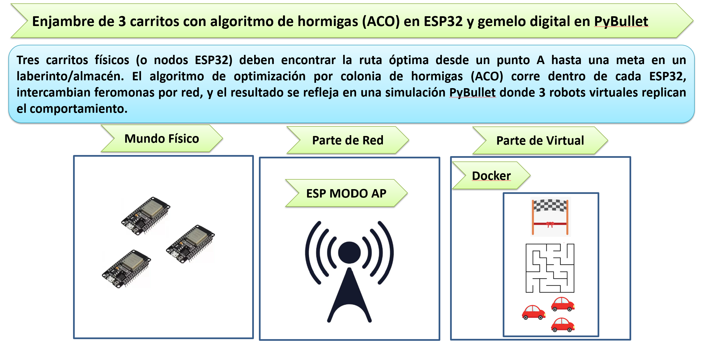

El enunciado define la arquitectura de tres capas (el mundo físico con los tres ESP32, la parte de red con un ESP32 en modo AP y la parte virtual con PyBullet dentro de Docker), pero no da valores numéricos. Los que usamos (cuadrícula de 5 por 5 celdas de 20 cm, red 192.168.4.x, puertos 4210 y 4211, parámetros del ACO) salen del planteamiento complementario que definimos para la actividad. A diferencia de otros temas, el profesor no compartió un ejemplo base en [U_Militar](https://github.com/dialejobv/U_Militar/blob/main/README.md) para este, así que todo está escrito desde cero.

## Lo que hicimos

- **`maze.json`**: el laberinto se escribe una sola vez. De ahí lo leen la simulación y, a través de un encabezado generado, el firmware, así que los dos mundos son idénticos (y cada ESP32 lo comprueba con un CRC).
- **El ACO en C++ para el ESP32 y la misma lógica en Python**, escritas para dar **exactamente** las mismas rutas con la misma semilla. Lo comprobamos compilando el núcleo del firmware en el PC: 48 de 48 casos idénticos, bit a bit.
- **Un solo firmware para los tres carritos** (cambia solo el número de nodo): red AP/estación con IP fija, intercambio de feromona por UDP con una barrera de sincronización, tolerancia a la caída y al reinicio de un nodo, telemetría al PC cada segundo y recorrido de la ruta con un driver TB6612FNG. Compila para los tres nodos.
- **El gemelo digital** en PyBullet (modo DIRECT, sin pantalla): recibe la telemetría, arma el laberinto desde `maze.json`, mueve tres robots virtuales y graba un video mp4 con cámara cenital, más una imagen final de las rutas. Tiene un modo sin hardware que corre el mismo ACO en Python.
- **Dockerfile y docker-compose.yml** para correr el gemelo en un contenedor, con el puerto 4211/udp publicado y la carpeta de resultados montada como volumen.
- **Un emulador de los tres nodos** y **herramientas de red** para probar el protocolo y las mediciones sin los carritos.
- **`preview.html`**: el simulador del enjambre en el navegador, con un modo conectado por Web Serial.
- **Quince pruebas**: las de software corridas con números reales; las de hardware, con la tabla lista para llenar.

### Parámetros y dónde se cambian

| Parámetro | Valor | En el firmware (`config.h`) | En el PC (`aco.py`, `gemelo_digital.py`, `emulador_nodos.py`) |
|---|---|---|---|
| alfa, peso de la feromona | 1 | `ACO_ALFA` | `--alfa` |
| beta, peso de la visibilidad 1/d | 2 | `ACO_BETA` | `--beta` |
| rho, evaporación | 0,5 | `ACO_RHO` | `--rho` |
| Q, constante de depósito | 100 | `ACO_Q` | `--q` |
| hormigas por nodo por iteración | 4 | `ACO_HORMIGAS` | `--hormigas` |
| iteraciones | 30 | `ACO_ITERACIONES` | `--iteraciones` |
| semilla | 12345 | `ACO_SEMILLA` | `--semilla` |
| feromona inicial τ₀ | 1 | `ACO_TAU0` | (`aco.Parametros.tau0`) |
| quiénes depositan | solo la mejor hormiga de cada nodo | `ACO_SOLO_MEJOR` (1; 0 = todas) | `--deposito mejor` (o `todas`) |
| laberinto | `maze.json` | `maze_data.h`, generado con `generar_maze_h.py` | `--maze` |

En `preview.html` están todos en el panel de la izquierda. Si se cambia un valor en `config.h`, hay que pasar el mismo al gemelo en modo hardware (sobre todo `--rho`, porque el gemelo rehace la feromona con su propia cuenta).

## Cómo lo hicimos, paso a paso

1. **Leímos el enunciado y el contexto, y fijamos los números.** El PDF solo da la arquitectura. Fijamos la red, los puertos, el laberinto y los parámetros, y decidimos desde el principio que `maze.json` fuera la única fuente del mapa, para que el firmware y la simulación no pudieran tener mapas distintos.
2. **Diseñamos `maze.json` probando candidatos.** Generamos varios laberintos de 5 por 5 con estanterías y los corrimos con el ACO. Nos quedamos con uno que parece un almacén, no se resuelve yendo derecho (12 pasos en vez de 8) y converge en casi todas las semillas. Después armamos los tres laberintos de las pruebas 6, 7 y 8.
3. **Escribimos primero `aco.py`.** En Python es más fácil probar. Lo escribimos pensando en portarlo a C++: un generador aleatorio propio (xorshift32), un orden fijo de aristas y de vecinos, y una ruleta que gasta un número aleatorio por paso.
4. **Portamos el núcleo a C++ (`aco_core.h`) y comprobamos que fuera idéntico.** Lo compilamos con g++ en el PC y comparamos línea por línea contra Python. Así apareció una diferencia escondida: desde Python 3.12, `sum()` con floats da `2.4000000000000004` donde el C++ da `2.3999999999999999`. Pasamos a sumas a mano, en orden, y quedaron todos los casos iguales.
5. **Definimos el protocolo (`protocolo.py`).** Usamos los mensajes del planteamiento (HELLO, PHER, PATH) y agregamos FIN (para la barrera), TAU (para un nodo reiniciado), ESTADO y los de prueba. Los números van con 17 cifras, los envíos son unicast y los datagramas no pasan de 1200 bytes.
6. **Escribimos el firmware.** `generar_maze_h.py` traduce el mapa; el sketch arma la red AP/estación, la máquina de estados sin bloqueos, la barrera, la caída y el reinicio de un nodo, y los motores con arranque suave. Compila para los tres nodos.
7. **Armamos un emulador de los tres nodos.** Son los mismos mensajes por UDP real en el PC, para probar el protocolo sin hardware. Con sus nodos virtuales la feromona salió idéntica a la de `aco.py`, y además encontró una limitación real del reingreso (más abajo).
8. **Hicimos el gemelo y los archivos de Docker.** Primero el modo sin hardware, después el modo hardware alimentado por el emulador, y al final el Dockerfile con Python 3.11, porque pybullet no tiene rueda para Python 3.14 en Windows.
9. **Hicimos `preview.html`.** Portamos el ACO a JavaScript, lo comprobamos contra Python con node y tomamos las capturas.
10. **Revisamos todo y corrimos las pruebas.** Una revisión del firmware nodo por nodo encontró tres errores de comportamiento, que corregimos: un carrito reiniciado durante el recorrido volvía a buscar solo, la caída del AP partía el enjambre y el carrito frenaba en cada celda recta. La revisión de la medida de convergencia nos llevó a un criterio más estricto. Luego corrimos las pruebas 6 a 11 y las de punta a punta del gemelo; las de hardware quedaron con la tabla lista.
11. **Cambiamos la regla de depósito.** Con la regla original (deposita toda hormiga que llega) la prueba 6 mostró que la colonia se estancaba en rutas largas del laberinto abierto. Probamos dos variantes elitistas, que solo deposite la mejor hormiga de cada nodo o solo la mejor de todo el enjambre, y nos quedamos con la primera, que se comportó mejor (la segunda se aferraba a la primera ruta que encontraba). La cambiamos a la vez en C++, Python y JavaScript, volvimos a comprobar que los tres dan lo mismo bit a bit y repetimos todas las pruebas. La regla original sigue disponible para comparar (`ACO_SOLO_MEJOR 0`, `--deposito todas`).

## Qué es la optimización por colonia de hormigas (ACO)

Las hormigas reales encuentran el camino más corto entre el hormiguero y la comida sin que ninguna conozca el mapa. Cada una deja una sustancia química, la **feromona**, por donde pasa, y prefiere los caminos con más feromona. El truco está en que la feromona se evapora: en un camino corto las hormigas van y vuelven más rápido, lo refuerzan más veces por minuto y se evapora menos entre pasadas, así que ese camino termina más marcado y atrae a más hormigas. Es una memoria colectiva escrita en el suelo.

Marco Dorigo convirtió esa idea en un algoritmo en 1992 (el *Ant System*). El problema se describe como un **grafo**: nodos unidos por aristas con una longitud. Muchas hormigas artificiales lo recorren al azar, pero con un azar sesgado: eligen cada arista con más probabilidad cuanto más feromona tiene y cuanto más corta es. Al final de cada ronda la feromona se evapora un poco y las hormigas depositan feromona en su recorrido, más cuanto más corto fue. Después de unas cuantas rondas, la feromona se concentra en la ruta más corta.

En el *Ant System* original depositan todas las hormigas que llegan. Las versiones posteriores (como el *Ant Colony System* y el *MAX-MIN Ant System*) dejan depositar solo a la mejor hormiga de cada ronda, para que las rutas malas no se refuercen. Nosotros usamos esa variante "elitista": en cada iteración deposita solo la mejor hormiga de cada ESP32.

En nuestro caso el grafo es el laberinto: cada celda es un nodo, y dos celdas vecinas sin pared en medio están unidas por una arista de 20 cm.

## Qué es un enjambre con memoria común sin servidor central

Un **enjambre** es un grupo de robots simples que resuelven juntos algo que uno solo haría peor, sin un jefe que les dé órdenes. Aquí cada ESP32 es una pequeña colonia que suelta sus propias hormigas, y lo que comparten es la feromona. Al final de cada iteración, cada nodo les manda a los otros dos cuánta feromona depositaron sus hormigas en cada arista, y cada uno suma lo de los tres en su propia copia de la tabla. Como los tres parten de la misma tabla y suman exactamente lo mismo en el mismo orden, sus copias quedan idénticas: es como si las hormigas de los tres carritos caminaran sobre el mismo suelo, aunque cada carrito guarda ese suelo en su propia memoria.

Ningún computador central reparte la información, así que si se apaga el carrito 2 o el 3, los otros siguen. Hay un matiz importante: **el algoritmo no tiene centro, pero la red WiFi sí**. El nodo 1 es el punto de acceso, y si se apaga desaparece la red y los otros dos no pueden hablarse (lo que hace el firmware en ese caso está en "El protocolo de red").

## Qué es un gemelo digital

Un **gemelo digital** es una copia virtual de un sistema físico que se alimenta de los datos del sistema real y se comporta igual. Aquí los carritos mandan por WiFi su estado, su mejor ruta y la feromona que depositan; el programa del PC reconstruye con eso la misma feromona que tienen los ESP32 y mueve tres robots virtuales en un laberinto idéntico en PyBullet. Sirve para ver lo que pasa dentro de los ESP32 (la feromona no se ve en el mundo real), para grabarlo y para comparar lo físico contra lo simulado nodo por nodo.

## Qué es Docker y por qué lo usamos aquí

**Docker** empaqueta un programa junto con todo lo que necesita para correr (el intérprete de Python de una versión exacta, las librerías con sus versiones, las fuentes, la configuración) en una **imagen**. Esa imagen se ejecuta como un **contenedor**: un proceso aislado que ve su propio sistema de archivos de Linux, como una máquina virtual muy liviana que comparte el núcleo del sistema operativo en vez de emular un computador completo. La receta de la imagen es el `Dockerfile`, y `docker-compose.yml` describe cómo se corre (puertos, carpetas compartidas, comandos).

Lo usamos por tres razones. La primera, el enunciado lo pide para la capa virtual. La segunda, PyBullet trae problemas de instalación: no publica ruedas para Python 3.14 en Windows (en este PC hubo que compilarlo), y dentro de la imagen se usa Python 3.11 en Linux, donde sí hay rueda oficial, así que cualquiera con Docker corre exactamente lo mismo sin instalar nada más. La tercera, la reproducibilidad: el mismo contenedor con la misma semilla tiene que dar siempre la misma ruta, que es justo lo que mide la prueba 15.

El contenedor no tiene pantalla. Por eso el gemelo usa PyBullet en modo DIRECT, que simula y renderiza sin abrir ventanas, toma cuadros con una cámara cenital y los guarda como video mp4 en una carpeta del PC compartida con el contenedor.

## Qué es UDP y qué es el modo AP

**UDP** es la forma más simple de mandar datos por una red IP: se arma un paquete (datagrama) con la dirección y el puerto del destino y se manda, sin abrir una conexión ni esperar confirmación. Es rápido y liviano, pero un paquete se puede perder sin aviso. Por eso nuestro protocolo cierra cada iteración con un mensaje `FIN` que dice cuántos depósitos se mandaron: quien lo recibe sabe si le llegó todo y, si no, no aplica una iteración a medias.

El ESP32 puede trabajar como **estación** (se conecta a una red WiFi, como un celular) o como **punto de acceso, AP** (crea su propia red, como un router). El nodo 1 crea la red `ENJAMBRE_ACO`; los nodos 2 y 3 y el PC se conectan a ella. Así no hace falta ningún router ni internet: la red existe donde estén los carritos. El nodo 1 hace las dos cosas a la vez: es el AP y también suelta hormigas como los otros dos.

## La idea general

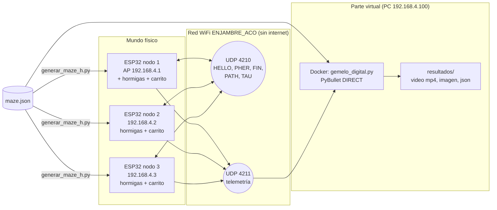

Una iteración del enjambre, vista en la red:

```mermaid
sequenceDiagram
    participant N1 as Nodo 1 (AP)
    participant N2 as Nodo 2
    participant N3 as Nodo 3
    participant PC as Gemelo (PC)
    Note over N1,N3: los tres tienen la misma feromona
    N1->>N1: suelta 4 hormigas
    N2->>N2: suelta 4 hormigas
    N3->>N3: suelta 4 hormigas
    N1->>N2: PHER... + FIN;1;k
    N1->>N3: PHER... + FIN;1;k
    N2->>N1: PHER... + FIN;2;k
    N2->>N3: PHER... + FIN;2;k
    N3->>N1: PHER... + FIN;3;k
    N3->>N2: PHER... + FIN;3;k
    N1-->>PC: copia de PHER, FIN, PATH
    N2-->>PC: copia de PHER, FIN, PATH
    N3-->>PC: copia de PHER, FIN, PATH
    Note over N1,N3: barrera: cada uno espera los FIN de los vivos (máx. 3 s)
    Note over N1,N3: evaporar y sumar en orden nodo 1, 2, 3
    Note over PC: hace la misma cuenta y dibuja la feromona
```

Cuando terminan las 30 iteraciones, cada carrito recorre su mejor ruta, escalonados 8 segundos para no chocar en la salida, y el gemelo mueve su robot virtual con los mismos tiempos.

## El laberinto (`maze.json`)

Una cuadrícula de 5 por 5 celdas de 20 cm (un metro por lado), con el inicio A en la celda (0, 0) y la meta en la (4, 4). La `x` crece hacia la derecha y la `y` hacia arriba. Cada pared se guarda como el par de celdas vecinas que no se pueden cruzar, y las paredes horizontales hacen de estanterías del almacén:

```
y=4   .   . | .   .   M
                 --- ---
y=3   .   .   .   .   .
             --- ---
y=2   .   .   .   . | .
         --- ---
y=1   .   .   .   .   .
     --- ---     ---
y=0   A   .   .   .   .
     x=0 x=1 x=2 x=3 x=4
```

Así lo dibuja el gemelo, con las tres rutas al final de una corrida (la franja violeta es la feromona y los números son el nodo de cada celda, $5y + x$):

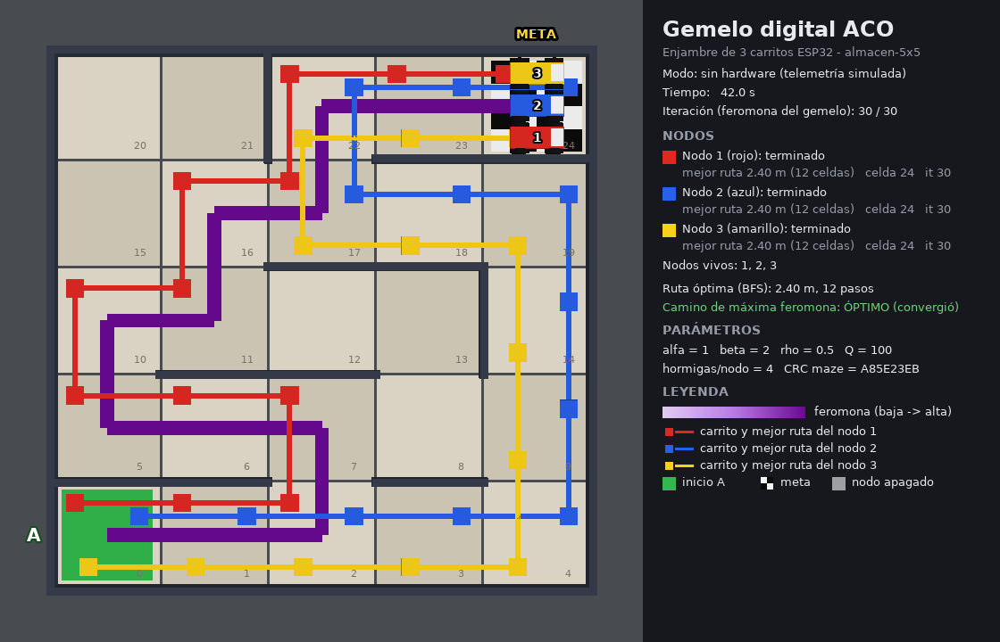

Tiene 29 aristas. La ruta más corta mide **12 pasos, 2,40 m**, y hay cinco rutas distintas con esa longitud. En total hay 17 rutas sin repetir celdas (de 12 a 22 pasos) y varios callejones donde una hormiga puede quedar atrapada. Lo elegimos así, entre varios candidatos generados y probados con el mismo ACO, porque tiene el aspecto de un almacén, no se resuelve yendo derecho a la meta (que serían 8 pasos) y el enjambre converge en casi todas las semillas.

En `laberintos/` están los mapas de las pruebas: `abierto.json` (sin paredes interiores, prueba 6), `unico_camino.json` (un árbol con una sola ruta y cuatro callejones, prueba 7) y `dos_caminos.json` (solo una ruta de 8 pasos y otra de 12, prueba 8).

El firmware no puede leer un archivo del PC, así que `generar_maze_h.py` traduce `maze.json` a `firmware/esp32_aco_nodo/maze_data.h`, con las mismas aristas en el mismo orden, y guarda el CRC32 del mapa. Cada ESP32 manda ese CRC en su `HELLO`; si no coincide con el del `maze.json` del gemelo, el gemelo avisa en la consola y en el video que el carrito se programó con otro mapa.

## La lógica del algoritmo, paso a paso

Los mismos pasos están en `aco.py` (Python) y en `firmware/esp32_aco_nodo/aco_core.h` (C++), en el mismo orden.

**1. El grafo.** Cada celda $(x, y)$ es el nodo $i = 5y + x$. Hay una arista entre dos celdas vecinas si no hay pared. Su longitud es la distancia real entre los centros,

$$d_{ij} = 0{,}20\ \text{m}$$

y su visibilidad es el inverso de esa distancia:

$$\eta_{ij} = \frac{1}{d_{ij}}$$

Toda arista arranca con la misma feromona, $\tau_{ij} = \tau_0 = 1$.

**2. Una hormiga camina.** Sale de A y en cada celda $i$ mira los vecinos a los que puede pasar: los que no tienen pared en medio y que ella todavía no ha pisado (el conjunto $N_i$). Elige el vecino $j$ con probabilidad

$$p_{ij} = \frac{\tau_{ij}^{\,\alpha}\ \eta_{ij}^{\,\beta}}{\displaystyle\sum_{l \in N_i} \tau_{il}^{\,\alpha}\ \eta_{il}^{\,\beta}}, \qquad j \in N_i$$

El exponente $\alpha$ pesa lo que ya marcaron las demás hormigas y $\beta$ pesa lo corta que es la arista. La elección se hace con una ruleta: se tira un número al azar entre 0 y la suma de los pesos y se recorren los vecinos acumulando pesos hasta pasarlo. En `aco.py`:

```python
total = 0.0
for v, e in lab.vecinos[actual]:          # orden fijo: +x, +y, -x, -y
    if not visitado[v]:
        candidatos.append(v)
        pesos.append((self.tau[e] ** p.alfa) * self.eta_beta[e])
        total += pesos[-1]
if not candidatos:
    return None                            # atrapada: se descarta
r = self.rng.uniforme() * total            # un aleatorio por paso, siempre
for v, w in zip(candidatos, pesos):
    acumulado += w
    if r < acumulado:
        elegido = v
        break
```

**3. Hormigas atrapadas.** Si una hormiga llega a una celda sin vecinos permitidos (un callejón, o una zona que ella misma ya recorrió), se descarta y no deposita nada. Así un callejón nunca recibe feromona.

**4. Longitud de la ruta.** Para la hormiga $k$ que llegó a la meta, $L_k$ es la suma de las longitudes de las aristas que cruzó. La ruta más corta de `maze.json` tiene $L = 12 \cdot 0{,}20 = 2{,}40$ m.

**5. Evaporación.** Al final de la iteración, toda la feromona se multiplica por $(1 - \rho)$:

$$\tau_{ij} \leftarrow (1 - \rho)\ \tau_{ij}$$

Con $\rho = 0{,}5$ queda la mitad. Lo que no se refuerza se borra: después de 30 iteraciones, una arista que nunca recibió feromona queda en $0{,}5^{30} \approx 9{,}3 \times 10^{-10}$.

**6. Depósito: solo la mejor hormiga de cada nodo.** De las 4 hormigas que suelta cada nodo en la iteración, se toma la que llegó con la ruta más corta, $k^{*}_n$ (si empatan, la primera que salió). Solo ella deposita, en cada arista de su ruta:

$$\Delta\tau_{ij}^{(n)} = \begin{cases} \dfrac{Q}{L_{k^{*}_n}} & \text{si la arista } (i,j) \text{ está en la ruta de } k^{*}_n \\[2mm] 0 & \text{si no} \end{cases}$$

Con $Q = 100$, una ruta de 2,40 m deja $100 / 2{,}40 \approx 41{,}7$ en cada arista y una de 4,40 m deja $22{,}7$. Si ninguna hormiga del nodo llegó a la meta (todas quedaron atrapadas), ese nodo no deposita nada en esa iteración.

**7. La memoria común.** Cada nodo manda su depósito (`PHER`) a los otros dos, y cada uno suma los de los tres:

$$\tau_{ij} \leftarrow \tau_{ij} + \sum_{n=1}^{3} \Delta\tau_{ij}^{(n)}$$

Así, en cada iteración entran a la memoria común como mucho tres rutas, las mejores que encontró cada carrito. En código, los pasos 5 y 7 son una sola función, la misma que usa el gemelo:

```python
def aplicar_iteracion(self, depositos_por_nodo):
    f = 1.0 - self.p.rho
    self.tau = [t * f for t in self.tau]                       # evaporar
    for n in sorted(depositos_por_nodo):                        # nodo 1, 2, 3
        for e, (_, _, d) in sorted(depositos_por_nodo[n].items()):  # por arista
            self.tau[e] += d                                    # depositar
```

Esto se repite 30 veces. Al final, el camino que sale de seguir siempre la arista con más feromona (sin azar) es la respuesta de la colonia. Decimos que la colonia **convergió** si ese camino es una ruta óptima y en ningún paso hubo empate de feromona; sin esa segunda condición, con la feromona todavía uniforme, el desempate por orden de vecinos caería por casualidad en una ruta óptima de `maze.json` y contaría como aprendido algo que nadie aprendió.

**8. El recorrido.** Cada carrito recorre la mejor ruta que encontraron sus propias hormigas: gira 90 grados en 0,6 s cuando cambia de dirección y avanza una celda (20 cm) en 1 s.

**Por qué deposita solo la mejor y no todas.** Empezamos con la regla del *Ant System* original, en la que toda hormiga que llega deposita. En el laberinto abierto de la prueba 6 eso fallaba: hay 70 rutas óptimas, pero miles de rutas largas sin repetir celda, y como todas las que llegaban depositaban, una ruta larga marcada en las primeras iteraciones se reforzaba y la colonia se quedaba ahí (con la semilla 12345 terminaba en una ruta de 12 pasos). Si solo deposita la mejor de cada nodo, una ruta larga solo recibe feromona cuando ninguna otra hormiga de ese nodo encontró algo más corto. Con eso la semilla 12345 llega a la ruta de 8 pasos y la colonia converge mucho más rápido. A cambio explora menos, y en unas pocas semillas se fija en su primera ruta antes de encontrar la óptima (los números están en las pruebas).

**Un detalle que muestran las pruebas: beta no hace nada en este laberinto.** Como todas las celdas miden lo mismo, $\eta_{ij} = 5$ en todas las aristas y $\eta^{\beta}$ es el mismo número arriba y abajo de la fracción del paso 2, así que se cancela. Con celdas iguales la decisión depende solo de la feromona. Beta empezaría a contar si las aristas tuvieran longitudes distintas, por ejemplo pasillos de distinto largo.

### Por qué el C++ y el Python dan exactamente lo mismo

Para poder comparar nodo por nodo la ruta del carrito físico y la del gemelo, las dos implementaciones tienen que tomar las mismas decisiones con la misma semilla:

- **El azar sale de un xorshift32 escrito igual en los dos lenguajes**, no de `random()` de Arduino ni del `random` de Python, que dan secuencias distintas. Son tres desplazamientos y tres XOR sobre un entero de 32 bits, y el número en [0, 1) se arma con los 24 bits altos, que caben exactos en un double:

  ```cpp
  uint32_t siguiente() { uint32_t x = estado; x ^= x << 13; x ^= x >> 17; x ^= x << 5; return estado = x; }
  double uniforme() { return (double)(siguiente() >> 8) / 16777216.0; }
  ```

- **Las cuentas van en double** (64 bits) en los dos lados.
- **Los depósitos se suman en orden de nodo y de arista**, sin importar el orden en que lleguen los paquetes: sumar en otro orden cambia el último bit de un double.
- **Se mandan con 17 cifras significativas** (`41.666666666666657`), lo mínimo para recuperar el mismo número exacto al leerlo.
- **Las sumas se hacen a mano, de izquierda a derecha.** Esto lo descubrimos comparando: desde Python 3.12, `sum()` de floats hace una suma compensada más exacta, y daba `2.4000000000000004` donde el C++ da `2.3999999999999999`. Las rutas eran iguales, pero el depósito cambiaba en el último bit.

`pruebas/equivalencia/comparar_equivalencia.py` compila el `aco_core.h` del firmware con g++ en el PC y lo corre con 4 laberintos, varias semillas, dos juegos de parámetros y las dos reglas de depósito. Después compara línea por línea contra Python la mejor ruta de cada nodo en cada iteración y la feromona final: **48 de 48 casos idénticos** (`pruebas/resultados/equivalencia_cpp_python.json`). No es el ESP32, pero es el mismo código fuente; en la placa solo podría cambiar el último bit de `pow()`, y con los parámetros por defecto tampoco ($5^2 = 25$ y $\tau^1 = \tau$ son exactos). `comparar_preview.py` hace lo mismo con el JavaScript de `preview.html`: 24 de 24 casos idénticos.

## El protocolo de red

Todos los mensajes son texto con campos separados por punto y coma, una línea por mensaje. Un datagrama UDP puede llevar varias líneas, hasta 1200 bytes, por debajo de la MTU del WiFi, para que nunca se fragmente (los 29 depósitos posibles de un nodo caben en uno). Los envíos entre nodos son **unicast** a la IP fija de cada compañero y no broadcast: en WiFi un broadcast se manda una sola vez, a la velocidad más baja y sin confirmación, mientras que un unicast lo reintenta el propio radio.

| Mensaje | Campos | Quién, a quién | Cuándo |
|---|---|---|---|
| `HELLO` | nodo; CRC del mapa; iteraciones aplicadas; fase | nodo → compañeros y PC | cada segundo |
| `PHER` | nodo; iteración; origen; destino; depósito | nodo → compañeros y PC | al final de cada iteración, uno por arista |
| `FIN` | nodo; iteración; cuántos PHER; hormigas que llegaron; descartadas | nodo → compañeros y PC | cierra los PHER de la iteración |
| `PATH` | nodo; longitud en metros; lista de celdas | nodo → compañeros y PC | cuando mejora y con cada ESTADO |
| `TAU` | nodo; iteración; feromona de las 29 aristas | nodo → nodo reiniciado | cuando un compañero vuelve en plena búsqueda o después |
| `ESTADO` | nodo; fase; iteraciones aplicadas; mejor longitud; celda; RSSI; vivos; uptime | nodo → PC | cada segundo |
| `LOG` | nodo; texto | nodo → PC | avisos (CRC distinto, caída de la red, TAU adoptado…) |
| `PING` / `PONG` | origen; secuencia; marca de tiempo (y RSSI) | nodo ↔ nodo | prueba de latencia |
| `RTT` | nodo; destino; enviados; recibidos; mín; prom; máx; p95; RSSI | nodo → PC | al terminar una prueba de latencia |
| `CMD` | `INICIAR`, `REINICIAR`, `RTT;destino;n;intervalo_ms` | PC → nodo | órdenes del PC |

`HELLO`, `PHER` y `PATH` son los del planteamiento. Agregamos `FIN` (para saber que llegaron todos los depósitos de una iteración), `TAU` (para que un nodo reiniciado retome la memoria común), `ESTADO` (el estado de cada segundo hacia el computador), `LOG` y `PING`/`PONG`/`RTT`/`CMD` para las pruebas. Por ejemplo:

```
HELLO;2;A85E23EB;0;ESPERA
PHER;3;1;3;4;41.666666666666657
FIN;3;1;12;1;3
PATH;1;2.400;0,1,2,7,6,5,10,11,16,17,22,23,24
ESTADO;1;BUSQUEDA;5;2.400;0;-48;1,2,3;12345
```

**Cómo se cuentan las iteraciones.** En `PHER` y `FIN` la iteración se cuenta desde 1: la primera que corre el enjambre es la 1. En `HELLO`, `ESTADO` y `TAU` va el número de iteraciones ya aplicadas, que es 0 al arrancar. Las opciones `--en-iteracion K` del gemelo y del emulador usan esta segunda cuenta: el nodo se apaga después de aplicar K iteraciones, así que su último `FIN` es el de la iteración K y desde la K+1 ya no aporta.

**Sincronización, paso a paso:**

1. Al encender, cada nodo queda en `ESPERA` y manda `HELLO` cada segundo.
2. Empieza a buscar cuando ve a los otros dos con el mismo CRC durante 2 s, cuando el PC manda `CMD;INICIAR`, o a los 30 s con los que haya. Si recibe depósitos de la iteración 1 de un compañero, arranca de inmediato (los otros ya empezaron).
3. En cada iteración suelta sus hormigas y manda sus `PHER` y su `FIN`.
4. Entra en una **barrera**: espera el `FIN` de esa iteración de cada compañero vivo (vivo = se oyó algo de él en los últimos 4 s), como mucho 3 s. Aplica los depósitos de un compañero solo si llegó su `FIN` y el número de `PHER` recibidos coincide; si no, no aplica nada de ese compañero en esa iteración y lo avisa con un `LOG`. Los mensajes de iteraciones viejas se descartan, y los de la siguiente se guardan (un compañero puede ir un poco adelantado).
5. Evapora, suma en orden de nodo y de arista, espera 0,3 s y pasa a la siguiente.

**Si se apaga el nodo 2 o el 3**, los otros dos lo esperan 3 s una sola vez, lo dan por caído y siguen entre ellos, con la misma feromona, porque los dos dejan de recibir lo mismo. Así se hace la prueba 14.

**Si se apaga el nodo 1 (el AP)**, desaparece la red: los nodos 2 y 3 se quedan sin WiFi y no pueden hablarse, porque en modo estación todo pasa por el AP. El firmware congela la barrera mientras no haya red, hasta 15 s; si la red vuelve en ese tiempo, siguen juntos. Pasado ese tope, cada uno termina solo, con su propia feromona, y el PC se queda sin telemetría. Por eso la prueba 14 se hace con el nodo 2 o el 3, no con el AP.

**Si un nodo se reinicia en plena búsqueda**, vuelve en `ESPERA` y lo anuncia con su `HELLO`. El compañero vivo de menor número le manda `TAU` con la feromona completa y la iteración en curso; el reiniciado la adopta y sigue desde la siguiente. Si se reinicia cuando los demás ya terminaron de buscar (por ejemplo, por un brownout al arrancar los motores), adopta la feromona final, pasa a `TERMINADO` sin volver a buscar y no mueve los motores, porque ya no sabe en qué celda quedó.

**Limitación conocida**, que encontramos con el emulador: los `PHER` y `FIN` que los compañeros mandan mientras el reiniciado está sin red se pierden, y en esa iteración las copias de la feromona pueden quedar distintas. En la prueba del emulador la diferencia se anuló sola porque la colonia ya había convergido, pero en un laberinto sin converger quedaría una pequeña diferencia entre nodos. Se corregiría haciendo que el que manda `TAU` reenvíe también sus depósitos de la iteración en curso.

## El firmware por dentro (`esp32_aco_nodo.ino`)

El mismo sketch va en los tres ESP32; lo único que cambia es `NODO_ID` en `config.h`. Todo es **no bloqueante**: `loop()` da una vuelta cada pocos milisegundos y en cada vuelta atiende la red, manda lo periódico y avanza un paso de la fase en que esté. No hay `delay()` largos, así que el carrito puede moverse mientras sigue contestando mensajes.

```cpp
void loop() {
  gestionarRed();                       // AP o estación; reconectar si se cae
  if (redArriba()) atenderUdp();        // leer TODOS los datagramas que haya
  // HELLO y ESTADO cada 1000 ms
  switch (fase) {
    case F_ESPERA:    /* arrancar si están los otros dos, CMD;INICIAR o 30 s */ break;
    case F_BUSQUEDA:  actualizarBusqueda();  break;   // calcular -> barrera -> pausa
    case F_RECORRIDO: actualizarRecorrido(); break;   // escalón, girar, avanzar
    case F_TERMINADO: break;
  }
  // RTT en curso, motores (rampa), LED
}
```

- **Red** (`iniciarWifi`, `gestionarRed`). El nodo 1 arranca el AP con `WiFi.softAP` y después `softAPConfig`, con el reparto de direcciones por DHCP empezando en la .100, para que el PC reciba la 192.168.4.100 y nadie tome la .2 o la .3. Los nodos 2 y 3 ponen su IP fija con `WiFi.config` antes de `WiFi.begin`, reconectan solos y, si siguen desconectados 5 s, reintentan a mano. Al reconectar se reabre el socket UDP y se manda un `HELLO` de inmediato.
- **Búsqueda** (`actualizarBusqueda`). Cada iteración pasa por tres pasos: `PB_CALCULAR` (llama a `iteracionLocal()` del núcleo y manda `PHER` y `FIN`), `PB_BARRERA` (espera los `FIN` o los 3 s) y `PB_PAUSA` (0,3 s). Lo que llega de cada compañero se guarda en una estructura `BufIter` **indexada por arista**, no en el orden de llegada: así se suma siempre en el mismo orden y un `PHER` repetido no cuenta dos veces. Hay dos casillas por compañero (iteración par e impar), porque nunca van más de una iteración desfasados.
- **Empaquetador.** Junta líneas en datagramas de hasta 1200 bytes y los manda por unicast a cada destino de una máscara (bit 0 = PC, bit n = nodo n).
- **Recorrido** (`actualizarRecorrido`). Espera su turno, (NODO_ID − 1) × 8 s, y recorre su mejor ruta tramo por tramo. Si la siguiente celda está en otro rumbo, gira sobre su eje 0,6 s por cada 90 grados; después avanza 1 s. Los instantes se acumulan desde el inicio, para que coincidan con los que calcula `protocolo.tiempo_recorrido` y con el gemelo. En tramos rectos seguidos no frena: si el sentido y la velocidad no cambian, deja los motores como están.
- **Motores** (`moverRuedas`, `actualizarMotores`). PWM con `ledcAttach`/`ledcWrite` a 20 kHz y 8 bits, rampa de 150 ms al arrancar, PWM en 0 antes de cambiar de sentido y STBY en bajo cuando está quieto.
- **Comandos.** `CMD;INICIAR`, `CMD;REINICIAR` (`ESP.restart()`) y `CMD;RTT`, que hace n `PING` al destino sin bloquear y reporta el `RTT` al PC. Cualquier nodo contesta un `PING` en cualquier fase.
- **Telemetría por USB.** Además del UDP, cada línea que va al PC sale por el puerto serie con el prefijo `TEL ` (es lo que lee `preview.html` en modo conectado), primero el UDP y después el eco, con un búfer de 4 KB para no frenar el envío.
- **LED.** Parpadea a 1 Hz en espera, a 5 Hz buscando, queda fijo recorriendo, da un destello cada 2 s al terminar y parpadea a 10 Hz cuando una estación no tiene red.

Una iteración tarda unos 10 a 30 ms de cálculo (el double del ESP32 es por software, pero el laberinto es chico), más la barrera y la pausa: unos 0,4 s por iteración y unos 15 s la búsqueda completa. Compilado ocupa el 70 % de la flash y el 17 % de la RAM en los tres nodos.

## El gemelo digital por dentro (`gemelo_digital.py`)

- **Entrada.** En modo hardware escucha UDP en `0.0.0.0:4211` con un socket no bloqueante y en cada vuelta drena todo lo que haya. Muestra en la consola la última línea cruda recibida (lo más útil cuando "no llega nada") y avisa si en 10 s no llegó nada, recordando la red y el firewall. En modo sin hardware usa `protocolo.flujo_simulado`, que corre el mismo ACO y lo "narra" con los mismos mensajes que mandarían los tres ESP32, y lo consume en tiempo virtual: no espera, solo renderiza cuadros, así que termina más rápido que en tiempo real.
- **Estado.** Los dos modos alimentan el mismo objeto, `EstadoGemelo`. Con los `PHER` y `FIN` rehace la feromona **con la misma función de `aco.py`** (`aplicar_iteracion`), así que la suma da el mismo double que en los nodos. Con `PATH` sabe la mejor ruta de cada nodo y con `ESTADO`, la fase y la celda de cada carrito. Da un nodo por apagado si no se oye nada de él en 4 s o si otro nodo vivo ya lo sacó de su lista de vivos.
- **Escena.** Piso, baldosas de 20 cm, paredes como cajas de 8 cm de alto, la marca verde de A, la bandera a cuadros de la meta, y tres carritos (cuerpo y cuatro ruedas, de 10 cm, en rojo, azul y amarillo). Los carritos se mueven de forma cinemática (`resetBasePositionAndOrientation`): interpolan entre centros de celdas con los mismos tiempos del firmware, y en modo hardware se corrigen con la celda que reporta cada `ESTADO`. La feromona de cada arista es una franja plana cuyo color va de lila pálido a violeta según su valor. Un carrito apagado se ve gris.
- **Imagen.** Cámara cenital con `getCameraImage` y el renderizador por software (`ER_TINY_RENDERER`), que funciona igual en Windows y en Docker sin tarjeta gráfica. `getCameraImage` no captura las líneas ni los textos de depuración de PyBullet, así que todo lo que se ve es geometría real y los textos se escriben con Pillow en un panel a la derecha: iteración, fase y mejor ruta de cada nodo, vivos, parámetros y leyenda.
- **Salidas** (en `resultados/`, o en la carpeta de la variable `RESULTADOS`): `gemelo_<modo>.mp4` (H.264, 1120 × 720, 15 cuadros por segundo), `ruta_final_<modo>.png`, `telemetria_<modo>.jsonl` (cada mensaje con su instante) y `resumen_<modo>.json` (ruta y longitud de cada nodo, ruta óptima, si convergió, feromona final, avisos). La corrida con un nodo apagado agrega `_apagado<N>` al nombre.
- **Fin.** En modo hardware termina cuando todos los nodos que se vieron están en `TERMINADO` y sus carritos terminaron, con `--timeout` (240 s por defecto) o con Ctrl+C; en los tres casos escribe las salidas. Si los carritos tardan en encenderse, conviene subir el `--timeout`.

## Conexiones

Los tres carritos son iguales; cambia solo el número de nodo que se pone en `config.h` antes de programar. El enunciado no fija el hardware del carrito: los componentes de abajo son los que elegimos, todos de los que ya usamos en el laboratorio.

| Carrito | NODO_ID | IP | Papel | Color en el gemelo |
|---|---|---|---|---|
| 1 | 1 | 192.168.4.1 | punto de acceso y hormiga | rojo |
| 2 | 2 | 192.168.4.2 | estación y hormiga | azul |
| 3 | 3 | 192.168.4.3 | estación y hormiga | amarillo |

### Materiales por carrito

| Cantidad | Componente | Para qué |
|---|---|---|
| 1 | ESP32 DevKit de 30 o 38 pines (opcional sobre la placa GVS) | el nodo: ACO, WiFi y control de motores |
| 1 | Driver TB6612FNG | puente H doble para los dos motores |
| 2 | Motor TT 1:48 con rueda de 65 mm | tracción diferencial |
| 1 | Rueda loca de bola | tercer apoyo |
| 1 | Porta 18650 x2 con BMS 2S y dos celdas 18650 iguales y con la misma carga | batería de 7,4 V |
| 1 | Interruptor con fusible de 3 A (KCD11) | apagar todo y proteger contra un corto |
| 1 | Regulador buck LM2596 | baja la batería a 5 V para el ESP32 |
| 1 + 1 | Condensadores electrolíticos de 470 µF y 100 µF (25 V) | absorber los picos de los motores y del WiFi |
| 4 | Condensadores cerámicos de 100 nF | uno junto a cada electrolítico y uno en los bornes de cada motor |
| | Cable 22 AWG (batería, VM, motores) y dupont 26-28 AWG (señales) | |

### Pines del ESP32 al TB6612FNG

| ESP32 | TB6612FNG | Función | Por qué este pin |
|---|---|---|---|
| GPIO 25 | PWMA | velocidad de la rueda izquierda (PWM 20 kHz, 8 bits) | salida libre, sin función de arranque |
| GPIO 26 | AIN1 | sentido de la rueda izquierda | salida libre |
| GPIO 27 | AIN2 | sentido de la rueda izquierda | salida libre |
| GPIO 33 | PWMB | velocidad de la rueda derecha (PWM 20 kHz, 8 bits) | salida libre, sin función de arranque |
| GPIO 14 | BIN1 | sentido de la rueda derecha | al arrancar el ESP32 saca un pulso breve, pero con STBY en bajo el driver lo ignora |
| GPIO 13 | BIN2 | sentido de la rueda derecha | salida libre |
| GPIO 32 | STBY | habilita el puente H | el firmware lo deja en bajo hasta que la red está arriba y mientras el carrito está quieto |
| 3V3 | VCC | lógica del driver | ver abajo por qué 3,3 V y no 5 V |
| GND | GND (lado lógico) | referencia de las señales | |
| | AO1 / AO2 | motor izquierdo | |
| | BO1 / BO2 | motor derecho | |
| | VM y GND (lado de potencia) | batería 7,4 V después del interruptor | cable grueso, directo a la batería |
| GPIO 2 | LED de la placa | estado del nodo (ver el firmware) | |

Algunos detalles de esa tabla:

- **VCC va a 3,3 V, no a 5 V.** El TB6612 reconoce un 1 lógico desde el 70 % de su VCC. Con VCC a 3,3 V basta con 2,3 V y el ESP32 da 3,3 V; con VCC a 5 V harían falta 3,5 V y el driver no respondería a las señales del ESP32.
- **El módulo tiene tres pines GND unidos por dentro.** El que está junto a VM va al negativo de la batería con cable grueso; el del lado lógico va al GND del ESP32.
- **STBY arranca apagado aunque el ESP32 todavía no corra el firmware.** Mientras el ESP32 arranca, GPIO 32 queda al aire, pero el TB6612 tiene resistencias internas a GND en STBY, IN y PWM, así que el puente H no se activa aunque GPIO 14 saque su pulso de arranque.
- **Antes de cambiar el sentido de una rueda, el firmware pone su PWM en 0**, para no invertir el motor girando a plena marcha.
- **GPIO 2** tiene que estar en bajo o al aire para poder programar la placa; el LED con su resistencia a GND lo deja en bajo, así que no molesta. Si la placa no trae LED azul (pasa en varias de 38 pines), se pone un LED con 330 Ω de GPIO 2 a GND.
- **Corriente.** Cada canal del TB6612 da 1,2 A continuos y 3,2 A de pico: alcanza para el arranque de un motor TT, y si una rueda se traba, el apagado térmico del chip lo protege. VM admite hasta 13,5 V.
- El firmware usa `ledcAttach` y `ledcWrite(pin, duty)`, la API del núcleo esp32 3.x de Arduino (en el 2.x se llamaban distinto). Los 20 kHz quedan fuera del rango audible, así que los motores no chillan.

Pines que evitamos a propósito: **GPIO 12**, porque al arrancar fija el voltaje de la memoria flash y, si el driver lo deja en alto, el ESP32 no arranca; **GPIO 0, 2, 5 y 15** para motores, porque son de arranque (*strapping*); **GPIO 34 a 39**, porque solo son de entrada; y **GPIO 6 a 11**, porque van a la flash interna. Todos los pines usados existen en el DevKit de 30 y en el de 38 pines.

### Alimentación

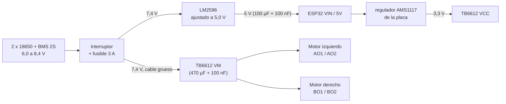

Las dos celdas en serie dan 7,4 V nominales (8,4 V recién cargadas) a través del BMS y el interruptor. De ahí salen dos ramas: una va directo a VM del TB6612 (los motores) y la otra al buck LM2596 ajustado a 5 V, que alimenta el pin VIN/5V del ESP32; el regulador de la propia placa baja esos 5 V a los 3,3 V del chip y de la lógica del driver.

Con PWM de 200/255 los motores ven en promedio 5,8 V con la batería a 7,4 V, pero 6,6 V recién cargada (8,4 V). Es un poco más que los 6 V del motor TT, aceptable en tramos de un segundo; si se calientan, se baja `VEL_AVANCE` a 180.

Cuando la batería baja de 7,0 V (3,5 V por celda) hay que cargarla: el LM2596 necesita 1 a 1,5 V por encima de su salida, así que por debajo de unos 6,4 V ya no sostiene los 5 V y el ESP32 empieza a reiniciarse. Las celdas se cargan en un cargador de 18650, o el paquete en un cargador de 2S que corte en 8,4 V, nunca con un adaptador fijo de 9 o 12 V. El BMS corta por sobrecarga y descarga, pero no siempre equilibra: conviene medir que las dos celdas queden parecidas (±0,05 V).

**Para programar se apaga el interruptor de la batería.** Así el USB del PC y el buck no alimentan a la vez la misma línea de 5 V: algunas placas no traen diodo entre el USB y VIN, y una fuente empujaría a la otra. Con solo el USB conectado, VM no tiene voltaje y los motores no se mueven, que es justo lo que se quiere con `MOVER_CARRITO 0`.

### Tierra común

El negativo de la batería, la tierra del buck, la del TB6612 y la del ESP32 van al mismo punto. Sin tierra común, las señales PWM y de sentido no tienen referencia y el driver no responde o hace cosas raras. El retorno de los motores va directo del GND de potencia del TB6612 al negativo de la batería, sin pasar por la placa del ESP32; entre el ESP32 y el driver va solo un cable fino de referencia. Así la corriente de los motores no pasa por las tierras de la lógica.

### Precauciones con el brownout

El ESP32 se reinicia solo (*brownout*) si su riel de 3,3 V baja de unos 2,43 V, el nivel por defecto del núcleo de Arduino. Cada motor TT pide entre 0,8 y 1,5 A al arrancar o al trabarse, según el modelo, y el WiFi transmite con unos 240 mA (y llega a 400-500 mA en la calibración del arranque; por eso Espressif pide una fuente de al menos 500 mA). Si todo sale de la misma fuente sin cuidado, ese pico hunde el voltaje y el ESP32 se reinicia justo cuando arranca el carrito. Lo que hicimos:

- **Rama separada para los motores**: el buck alimenta solo al ESP32, así que el pico de los motores no pasa por su regulador.
- **Condensadores**: 470 µF (25 V, respetando la franja del negativo) más 100 nF entre VM y GND del TB6612, 100 µF más 100 nF en la entrada de 5 V del ESP32, y un cerámico de 100 nF soldado en los bornes de cada motor, que baja el ruido de las escobillas (si no, le mete ruido al WiFi).
- **Arranque suave en el firmware**: el PWM sube de 0 al valor final en 150 ms cada vez que arranca un tramo.
- **Los motores no se energizan (STBY en bajo) hasta que la red está arriba**: el arranque del WiFi y el de los motores nunca coinciden.
- **Tierra en estrella**, como se explicó arriba.
- **No desactivamos el detector de brownout**: si se reinicia, el problema es de alimentación y hay que corregirlo, no esconderlo. Y si aun así un carrito se reinicia durante el recorrido, el firmware no vuelve a buscar: adopta la feromona final de los otros y se queda quieto (ver "El protocolo de red").

### Antes de encender por primera vez

Con el multímetro, antes de conectar el ESP32:

1. Batería entre 6,0 y 8,4 V, y las dos celdas parecidas.
2. Con el interruptor encendido, la salida del buck sin carga: girar el trimmer hasta 5,0 V. De fábrica suele venir más alto, y es lo más importante de esta lista.
3. Entre VM y GND no debe haber corto, y debe haber continuidad entre todas las tierras.
4. Conectar el ESP32 y comprobar 3,3 V en 3V3 y en VCC del driver, y 0 V en STBY en reposo.
5. Encender primero el carrito 1 (el AP) y después el 2 y el 3.

### Distancias entre los ESP32 en el montaje

El laberinto mide 1 m por 1 m. Durante la búsqueda los tres carritos están junto a la entrada; durante el recorrido se separan como mucho la diagonal del laberinto, 1,4 m. El PC, que también se conecta al AP, va a no más de 3 m del carrito 1, así que el enlace más largo del montaje queda dentro del máximo de 3 m. La antena del ESP32 (el extremo de la placa con la pista en zigzag) va fuera del chasis, sin la batería encima.

En modo AP no hay enlace directo entre estaciones: un paquete del nodo 2 al nodo 3 pasa por el nodo 1. Por eso el RSSI que se mide es siempre el de cada estación hacia el AP, que es el que reporta el `ESTADO`.

| Enlace | Distancia prevista | RSSI esperado | Distancia medida | RSSI medido (dBm) |
|---|---|---|---|---|
| Nodo 1 (AP) y nodo 2 | 0,2 a 1,4 m | -35 a -55 dBm | | |
| Nodo 1 (AP) y nodo 3 | 0,2 a 1,4 m | -35 a -55 dBm | | |
| Nodo 2 y nodo 3 | 0,2 a 1,4 m | sin enlace directo: pasa por el nodo 1 | | no aplica |
| Nodo 1 (AP) y PC | hasta 3 m | -40 a -65 dBm | | |

En la salida los tres no caben en la celda A (cada carrito ocupa casi una celda de 20 cm): los carritos 2 y 3 esperan fuera del laberinto, junto a la entrada, y se ponen en A cuando el anterior la deja; el escalonado de 8 s da el tiempo para hacerlo.

## Qué hace cada archivo

| Archivo | Qué hace |
|---|---|
| `maze.json` | el laberinto de la actividad: tamaño, celda de 20 cm, inicio, meta y paredes |
| `laberintos/*.json` | los laberintos de las pruebas 6, 7 y 8 |
| `aco.py` | el ACO en Python: carga el laberinto, xorshift32, hormigas, evaporación, depósito y el enjambre de tres nodos (`simular_enjambre`) |
| `protocolo.py` | los mensajes UDP (armar y leer), los tiempos del protocolo, `tiempo_recorrido` y `flujo_simulado` (la telemetría que mandarían los tres ESP32, generada sin hardware) |
| `generar_maze_h.py` | traduce `maze.json` a `firmware/esp32_aco_nodo/maze_data.h` (aristas, vecinos y CRC) |
| `firmware/esp32_aco_nodo/esp32_aco_nodo.ino` | el sketch de los tres carritos: red, barrera, telemetría, comandos y motores |
| `firmware/esp32_aco_nodo/aco_core.h` | el núcleo del ACO en C++ puro (se compila igual en el ESP32 y en el PC) |
| `firmware/esp32_aco_nodo/config.h` | número de nodo, parámetros del ACO, red, tiempos y pines |
| `firmware/esp32_aco_nodo/maze_data.h` | generado desde `maze.json`; no se edita a mano |
| `firmware/compilar.ps1` | compila los tres nodos con arduino-cli (y los sube con `-Subir -Puerto COMx`; `-SinMotores` compila con `MOVER_CARRITO 0`) |
| `gemelo_digital.py` | el gemelo en PyBullet: modo hardware (escucha 4211) y modo sin hardware; video, imagen y resúmenes |
| `Dockerfile`, `docker-compose.yml`, `.dockerignore` | la imagen del gemelo y cómo correrla |
| `emulador_nodos.py` | los tres ESP32 virtuales en el PC, con el mismo protocolo por UDP real (127.0.0.1); también simula caídas, reinicios, la caída del AP y pérdida de paquetes |
| `herramientas_red.py` | pruebas de red desde el PC: `escuchar`, `asociacion`, `rtt`, `reinicio` e `iniciar` |
| `preview.html` | simulador del enjambre en el navegador y modo conectado por Web Serial |
| `pruebas/pruebas_algoritmo.py` | pruebas 6 a 11 con números reales |
| `pruebas/graficar_convergencia.py` | la figura de convergencia por rho |
| `pruebas/repetir_gemelo.py` | prueba 15: corre el gemelo varias veces con la semilla fija (nativo o con `--docker`) y compara |
| `pruebas/equivalencia/` | compara el C++ del firmware (`comparar_equivalencia.py`) y el JavaScript del preview (`comparar_preview.py`) contra el Python |
| `pruebas/resultados/` | lo que dejaron las pruebas (json, md); los del emulador llevan el prefijo `emulador_` |
| `resultados/` | lo que deja el gemelo (video, imagen, telemetría); es la carpeta montada en Docker y no se sube al repositorio |
| `img/`, `video/` | las fotos del montaje y las capturas; los videos del gemelo (GIF para verlos en GitHub y mp4 completo) |

## Cómo instalar lo necesario

**Python** (para el gemelo, las pruebas y `aco.py`). Cada tema tiene su propio entorno `entorno/`:

```powershell
python -m venv entorno
entorno\Scripts\python -m pip install pybullet numpy pillow imageio imageio-ffmpeg matplotlib
```

PyBullet no publica rueda para Python 3.14 en Windows: hay que compilarlo (necesita las herramientas de compilación de Visual Studio) o usar Python 3.11 a 3.13, que sí tienen rueda. Docker evita este paso. El emulador (`emulador_nodos.py`) y `herramientas_red.py` solo usan la biblioteca estándar, así que corren también con el Python del sistema.

**Firmware.** El Arduino IDE (o arduino-cli) con el núcleo **esp32 3.x** de Espressif (probado con el 3.3.12); no hace falta ninguna librería extra. `firmware\compilar.ps1` compila los tres nodos con arduino-cli.

**Opcional.** g++ para `comparar_equivalencia.py` (en Windows sirve w64devkit, portable) y node para `comparar_preview.py`.

## Cómo probarlo

**Sin ESP32 conectado**

Todo lo de software corre sin los carritos:

```powershell
entorno\Scripts\python aco.py                                   # el enjambre en consola
entorno\Scripts\python gemelo_digital.py --modo sin-hardware    # video e imagen en resultados\
entorno\Scripts\python gemelo_digital.py --modo sin-hardware --apagar-nodo 3 --en-iteracion 10
entorno\Scripts\python pruebas\pruebas_algoritmo.py             # pruebas 6 a 11
entorno\Scripts\python pruebas\equivalencia\comparar_equivalencia.py
```

El gemelo sin hardware tarda unos 4 minutos en este PC (renderiza cada cuadro por software). Hay que dejarlo terminar o pararlo con Ctrl+C, que cierra el video bien: si se cierra la terminal o se mata el proceso a mitad de camino, el mp4 queda vacío (unos 48 bytes) y no se puede abrir.

Para probar el gemelo en **modo hardware** sin carritos, el emulador hace de los tres ESP32 y manda la telemetría al puerto 4211 del PC por UDP de verdad:

```powershell
entorno\Scripts\python gemelo_digital.py --modo hardware        # en una consola
python emulador_nodos.py --semilla 12345                         # en otra
python emulador_nodos.py --apagar-nodo 3 --en-iteracion 10       # o con una caída
```

`preview.html` se abre con doble clic (más abajo está en "El montaje y la demo").

**Con ESP32 conectado**

*Cargar el firmware en los tres carritos.* El mismo sketch va en los tres; lo único que cambia es el número de nodo. Se programa uno a la vez, con el interruptor de la batería apagado (ver "Alimentación").

1. **Instalar el núcleo del ESP32 una sola vez.** En el Arduino IDE: Archivo → Preferencias → "Gestor de URLs adicionales de tarjetas", agregar `https://espressif.github.io/arduino-esp32/package_esp32_index.json`; después Herramientas → Placa → Gestor de tarjetas, buscar **esp32** de Espressif e instalar una versión 3.x. No hace falta ninguna librería extra.
2. **Si se cambió `maze.json`**, regenerar el encabezado: `entorno\Scripts\python generar_maze_h.py`. Si no se tocó, `maze_data.h` ya está listo.
3. **Abrir** `firmware/esp32_aco_nodo/esp32_aco_nodo.ino`. El IDE abre también `config.h`, `aco_core.h` y `maze_data.h` como pestañas, porque están en la misma carpeta.
4. **Elegir la placa y el puerto**: Herramientas → Placa → esp32 → **ESP32 Dev Module** (o **DOIT ESP32 DEVKIT V1**, que es la que se ve en las fotos; las dos sirven para estas placas), y en Puerto el COM que aparece al enchufar el carrito (si no aparece, falta el driver USB del chip CP2102 o CH340 de la placa).
5. **Poner el número de nodo** en la pestaña `config.h`: `#define NODO_ID 1` para el carrito 1 (el AP), y Subir. Esperar a que diga "Subido".
6. **Repetir con los otros dos**: enchufar el carrito 2, cambiar a `#define NODO_ID 2`, Subir; lo mismo con el 3. Conviene marcar cada carrito con su número.

Lo mismo sin abrir el IDE, desde PowerShell: `firmware\compilar.ps1 -Nodos 1 -Subir -Puerto COM5` (y luego `-Nodos 2` y `-Nodos 3` con el puerto de cada uno). Con `-SinMotores` se compila con `MOVER_CARRITO 0`: todo funciona igual (red, búsqueda, recorrido en el `ESTADO`) pero sin energizar el driver, para probar con las placas solas en la mesa.

*Comprobar cada carrito.* Con el carrito enchufado, el Monitor Serie a 115200 baudios debe mostrar algo así:

```
=== Enjambre ACO - nodo 2 - mapa almacen-5x5 (CRC A85E23EB) ===
ACO: alfa=1.00 beta=2.00 rho=0.50 Q=100.0 hormigas=4 iteraciones=30 semilla=12345 deposita=solo la mejor
Conectando a "ENJAMBRE_ACO" como 192.168.4.2 ...
Fase ESPERA: buscando a los companeros...
```

Las líneas que empiezan con `TEL ` son la misma telemetría que va por UDP al PC. El LED de la placa dice en qué está cada carrito: parpadeo lento (1 Hz) esperando a los otros, rápido (5 Hz) buscando, fijo recorriendo, un destello cada 2 s al terminar, y muy rápido (10 Hz) si una estación no encuentra la red.

*Calibrar el movimiento.* En cada carrito, ajustar `VEL_AVANCE` y `VEL_GIRO` en `config.h` hasta que 1 s de avance recorra 20 cm y 0,6 s de giro sean 90 grados. Los tres carritos no salen iguales de fábrica, así que cada uno puede quedar con sus propios valores (lo demás de `config.h` debe ser igual en los tres).

*Una corrida completa, en orden:*

1. Armar el laberinto de 1 m × 1 m igual a `maze.json` y poner el carrito 1 en la celda A, mirando hacia la derecha (+x). Los carritos 2 y 3 esperan fuera, junto a la entrada.
2. Encender el carrito 1 (crea la red `ENJAMBRE_ACO`), después el 2 y el 3.
3. Conectar el PC a la red `ENJAMBRE_ACO` (clave `hormigas123`) y arrancar el gemelo: `docker compose up gemelo`, o `entorno\Scripts\python gemelo_digital.py` sin Docker. Para ver solo la tabla de cada nodo en vivo, `python herramientas_red.py escuchar`.
4. Cuando los tres se ven durante 2 s, empiezan solos las 30 iteraciones (unos 15 s). Si alguno no aparece, `python herramientas_red.py iniciar` los arranca con los que haya.
5. Al terminar la búsqueda, el carrito 1 recorre su ruta; a los 8 s sale el 2 (hay que ponerlo en A cuando el 1 la deja) y a los 16 s el 3.
6. Cuando los tres llegan, el gemelo escribe en `resultados/` el video, la imagen final, la telemetría y el resumen con la ruta de cada nodo, que es lo que se compara en la prueba 12.

Con un solo carrito enchufado por USB, `preview.html` en modo conectado (Web Serial) también muestra en vivo lo que manda ese carrito.

## Docker paso a paso

### Instalar Docker

**Windows 10 u 11 (64 bits).** Docker Desktop corre los contenedores de Linux dentro de WSL 2, que a su vez necesita la virtualización del procesador.

1. Activar la virtualización en la BIOS si está apagada: reiniciar, entrar a la BIOS (F2 en ASUS, F2, F10 o Supr en otras marcas) y activar **SVM Mode** (AMD) o **Intel Virtualization Technology / VT-x** (Intel). Se comprueba en Windows con `systeminfo`: en "Requisitos Hyper-V" debe decir "Se habilitó la virtualización en el firmware: Sí".
2. En PowerShell como administrador: `wsl --install --no-distribution` (activa la Plataforma de máquina virtual) y reiniciar.
3. Descargar Docker Desktop de https://www.docker.com/products/docker-desktop/ (o `winget install Docker.DockerDesktop`) e instalarlo. Para que no ocupe el disco C:, se puede instalar desde PowerShell como administrador con
   `"Docker Desktop Installer.exe" install --accept-license --installation-dir="D:\Program Files\Docker" --wsl-default-data-root="D:\DockerData"`.
4. Abrir Docker Desktop y esperar a que diga "Engine running".

**macOS.** Descargar Docker Desktop para Mac (versión Apple Silicon o Intel, según el procesador) de la misma página, arrastrarlo a Aplicaciones y abrirlo, o con Homebrew: `brew install --cask docker`. En un Mac con procesador Apple (M1, M2, M3…) la imagen corre como `linux/amd64` emulada con Rosetta, porque pybullet solo publica ruedas de Linux para x86_64; ya está fijado en el `Dockerfile` y en `docker-compose.yml`. Es más lento, pero funciona.

**Linux (Ubuntu, Debian y derivados).** Docker Engine, sin Docker Desktop:

```bash
curl -fsSL https://get.docker.com | sudo sh     # instala docker y el plugin compose
sudo usermod -aG docker $USER                   # usar docker sin sudo (cerrar sesión y volver)
```

### Verificar la instalación

```bash
docker --version
docker compose version
docker run --rm hello-world
```

El último descarga una imagen mínima y debe imprimir "Hello from Docker!". Si en Windows falla con "Docker Desktop is unable to start", casi siempre es la virtualización de la BIOS o que falta el componente "Plataforma de máquina virtual" (ver "WSL y Docker en Windows" más abajo).

### Construir la imagen

Desde la carpeta de este tema, **con internet** (antes de pasarse al WiFi de los carritos, que no tiene internet):

```bash
docker compose build
```

La imagen parte de `python:3.11-slim`, instala la fuente DejaVu para el panel del video y pybullet, numpy, pillow, imageio e imageio-ffmpeg con versiones fijas, y copia solo `aco.py`, `protocolo.py`, `gemelo_digital.py`, `maze.json` y `laberintos/`.

### Correr en modo hardware

1. Encender los tres carritos y conectar el PC a la red WiFi **`ENJAMBRE_ACO`** (clave `hormigas123`). **El PC tiene que estar en esa red para recibir la telemetría.** El nodo 1 le da la IP 192.168.4.100 por DHCP, porque reparte desde la .100 y los nodos 2 y 3 no piden dirección. Si por algo no la recibe, se pone fija a mano: IP 192.168.4.100, máscara 255.255.255.0, sin puerta de enlace.
2. `docker compose up gemelo`
3. El gemelo espera la telemetría por UDP 4211, la muestra en la consola y, al terminar la búsqueda y el recorrido, escribe los resultados. Corta a los 240 s si no terminó (`--timeout`). Se detiene antes con Ctrl+C o con `docker compose stop`, y en los dos casos guarda el video.

### Correr en modo sin hardware

```bash
docker compose run --rm simulacion
docker compose run --rm simulacion --modo sin-hardware --semilla 7 --rho 0.1
docker compose run --rm simulacion --modo sin-hardware --apagar-nodo 3 --en-iteracion 10
```

Lo que va después de `simulacion` reemplaza los argumentos por defecto del servicio, por eso se repite `--modo sin-hardware`.

### Recuperar el video

La carpeta `resultados/` del tema está montada dentro del contenedor como `/app/resultados`, así que el video y la imagen aparecen directamente en el PC al terminar: `resultados/gemelo_sin-hardware.mp4` y `resultados/ruta_final_sin-hardware.png` (y lo mismo con `hardware` en el otro modo), más la telemetría y el resumen en json.

### Problemas típicos

- **El firewall bloquea el UDP.** En Windows, la primera vez que Docker recibe tráfico de la red puede aparecer el aviso del firewall; hay que permitirlo. Si la red `ENJAMBRE_ACO` quedó como "Pública", Windows bloquea más. Se puede abrir el puerto a mano en PowerShell como administrador:
  `New-NetFirewallRule -DisplayName "Enjambre ACO UDP 4211" -Direction Inbound -Protocol UDP -LocalPort 4211 -Action Allow`.
  Para saber si el problema es el firewall o Docker, se corre `python herramientas_red.py escuchar` o el gemelo fuera de Docker: si ahí llegan los mensajes, el problema está en el paso al contenedor.
- **La red del AP no tiene internet.** Es normal: el ESP32 no está conectado a nada más. Windows la marca como "Sin Internet" y a veces se cambia solo a otra red conocida; hay que quitar "Conectar automáticamente" de las demás redes mientras dure la prueba. Tampoco se pueden descargar imágenes en ese momento, así que hay que construir la imagen antes de conectarse.
- **No se puede usar la red host en Docker Desktop.** En Linux, `network_mode: host` le da al contenedor la red del PC directamente. En Docker Desktop (Windows y Mac) el contenedor vive dentro de una máquina virtual y la red host apunta a esa máquina, no a la tarjeta WiFi del PC (en versiones recientes existe como función beta, con limitaciones). Por eso publicamos el puerto con `ports: "4211:4211/udp"`, que funciona igual en los tres sistemas. El `/udp` es obligatorio: sin él, Docker publicaría el 4211 de TCP y los datagramas nunca llegarían.
- **El puerto 4211 solo lo puede usar un programa a la vez.** El gemelo (en Docker o sin él) y `herramientas_red.py escuchar` abren el mismo puerto: si uno ya está corriendo, el otro falla al arrancar ("address already in use" o, en Docker, "port is already allocated"). Se usa uno u otro, no los dos.

### WSL y Docker en Windows

Docker Desktop no corre los contenedores directamente en Windows: los corre en una máquina virtual de Linux manejada por WSL 2. Eso trae unas incompatibilidades que conviene conocer antes del día de la prueba:

- **Hacen falta dos cosas, no una.** La virtualización activada en la BIOS (VT-x o SVM) **y** el componente de Windows "Plataforma de máquina virtual". Si falta el segundo, `wsl --status` dice "WSL2 no es compatible con la configuración actual de la máquina" aunque la BIOS ya esté bien, y Docker Desktop no arranca. Se arregla con `wsl --install --no-distribution` en PowerShell como administrador y reiniciando. Para saber cuál de las dos falta: `(Get-CimInstance Win32_Processor).VirtualizationFirmwareEnabled` dice si la BIOS la tiene activa, y `(Get-CimInstance Win32_ComputerSystem).HypervisorPresent` dice si Windows ya cargó el hipervisor.
- **Otros programas de máquinas virtuales.** Con el hipervisor de Windows encendido, VirtualBox y VMware funcionan más lento (o no arrancan las versiones viejas), y algunos emuladores de Android piden apagarlo. Si se necesita uno de esos programas, se puede volver a apagar el componente, pero entonces Docker deja de funcionar.
- **Los puertos USB no llegan al contenedor ni a WSL.** El contenedor no ve los COM de los carritos. Subir el firmware (Arduino IDE o `firmware\compilar.ps1`), el Monitor Serie y el modo conectado de `preview.html` se hacen siempre desde Windows. El gemelo no los necesita: solo recibe UDP por WiFi.
- **Correr el gemelo dentro de WSL, sin Docker, no sirve tal cual.** Hay dos problemas. El `entorno\` del tema es un entorno de Windows (`Scripts\python.exe`) y en Linux no se puede usar: habría que crear otro dentro de WSL e instalar ahí las librerías. Y, sobre todo, WSL 2 por defecto está detrás de una red NAT propia: los ESP32 mandan la telemetría a 192.168.4.100, que es la tarjeta WiFi de Windows, y esos paquetes no llegan a Linux. Haría falta el modo de red "espejo" (`networkingMode=mirrored` en `%UserProfile%\.wslconfig`, Windows 11) y abrir el firewall de Hyper-V. Docker Desktop ya resuelve ese reenvío con `ports: "4211:4211/udp"`, así que la forma recomendada es Docker o el `entorno\` de Windows, no WSL a mano.
- **El emulador y el gemelo en Docker sí se entienden.** `emulador_nodos.py` corre en Windows y manda a 127.0.0.1:4211; Docker Desktop publica el puerto también en localhost, así que el gemelo dentro del contenedor recibe igual. El gemelo no mira la IP de origen de los paquetes (lee el número de nodo de cada mensaje), por eso no le afecta que Docker cambie esa IP al reenviarlos.
- **Docker Desktop tiene que estar abierto.** Si no lo está, `docker compose` falla con un error del tipo "open //./pipe/dockerDesktopLinuxEngine: The system cannot find the file specified". Hay que abrirlo y esperar "Engine running".
- **Rutas con espacios.** `docker-compose.yml` usa la ruta relativa `./resultados`, así que funciona aunque la carpeta del repositorio tenga espacios. Si se arma a mano un `docker run -v`, la ruta va entre comillas.

## El montaje y la demo

**Las tres placas en la mesa.** Antes de montar los carritos probamos el firmware con los tres ESP32 sueltos, cada uno enchufado por USB al portátil y sin el driver ni los motores. Cada placa va en su base de expansión, que le da los pines con tornillo y la entrada de alimentación.

<table>
<tr>
<td>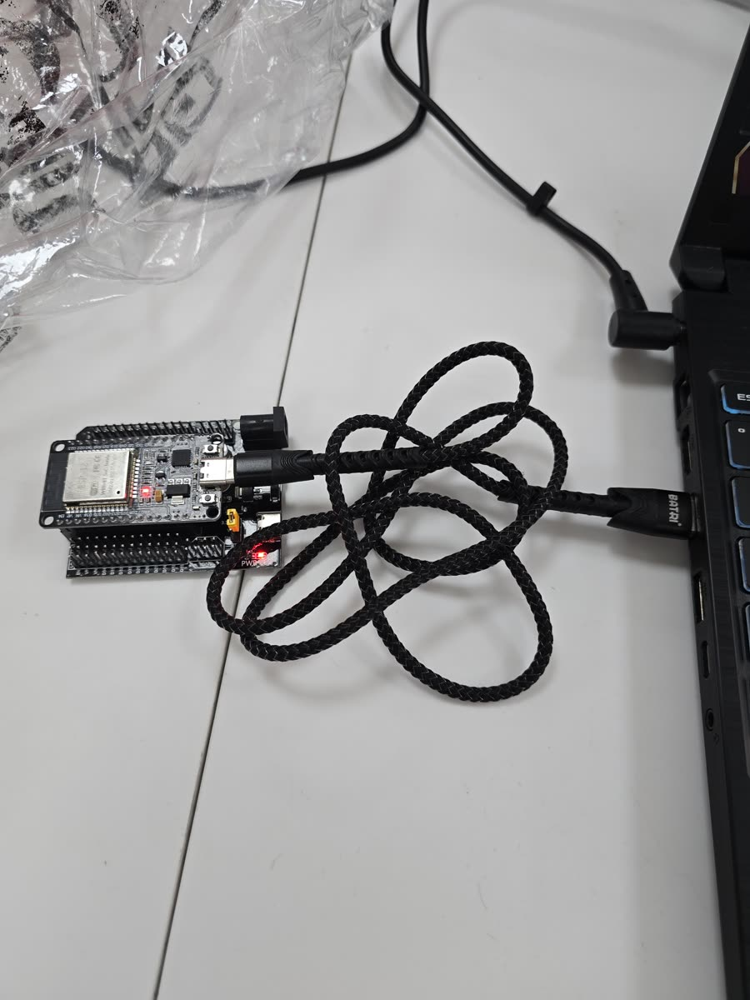</td>
<td>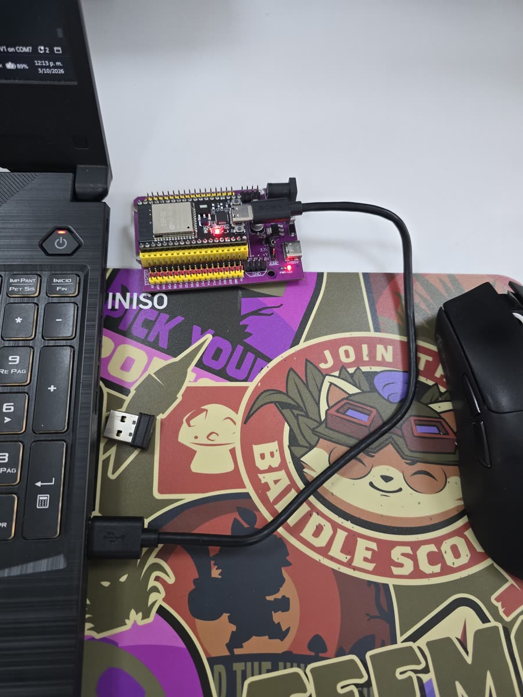</td>
</tr>
<tr>
<td>Un nodo en su base de expansión, alimentado por el USB del portátil.</td>
<td>Otro nodo, en una base de expansión distinta: el firmware es el mismo.</td>
</tr>
</table>

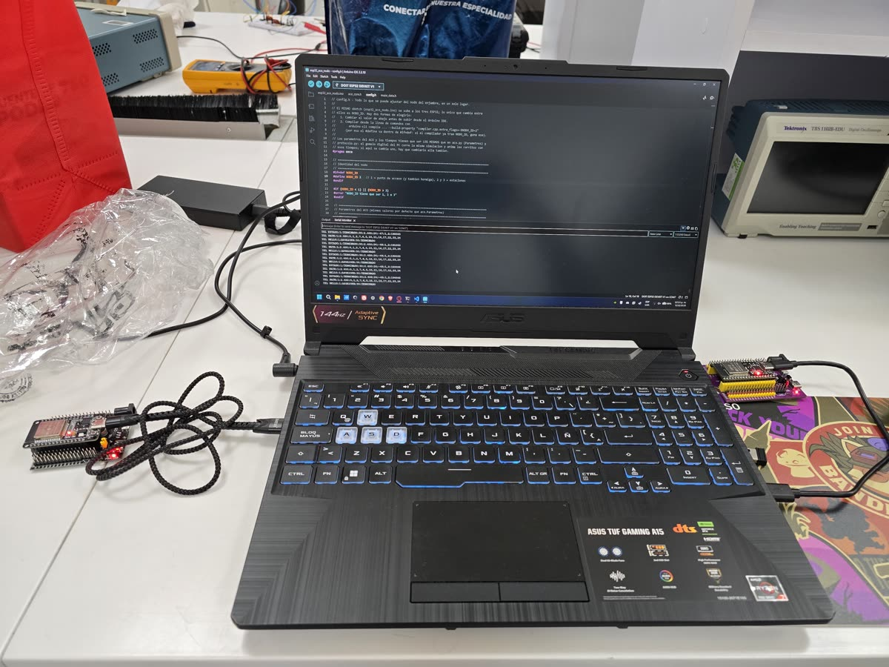

Se programan de a una con el mismo sketch, cambiando solo `NODO_ID` en `config.h`. Aquí se está subiendo el nodo 3 desde el Arduino IDE (placa "DOIT ESP32 DEVKIT V1"):

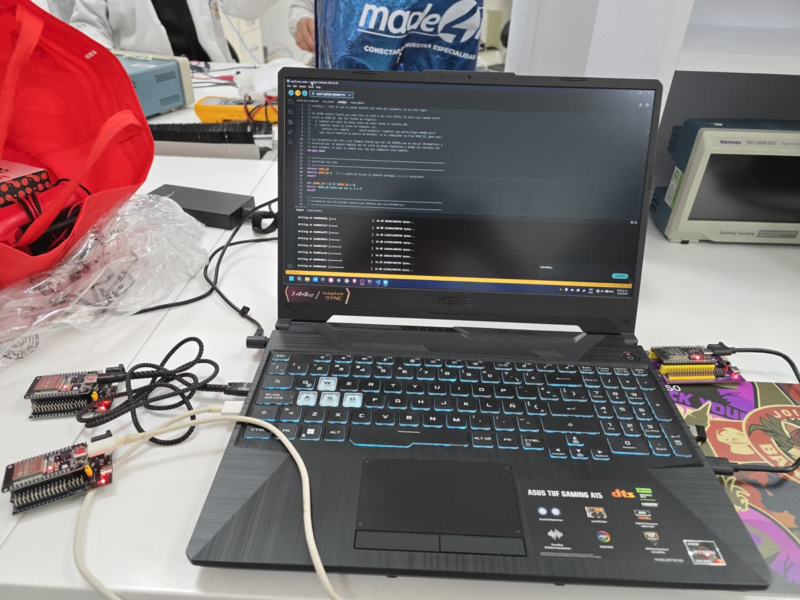

Con los nodos ya programados, el gemelo en modo hardware recibe la telemetría real por WiFi. En la terminal aparecen los `HELLO` de los nodos 1 y 2 con el CRC del mapa (`A85E23EB`) y la fase `TERMINADO`, y el `PATH` del nodo 1: 2,40 m por `0-1-2-7-6-5-10-11-16-17-22-23-24`, la misma ruta que da `aco.py` para el nodo 1 con la semilla 12345. En esa captura el nodo 3 todavía no aparece en la lista de vivos.

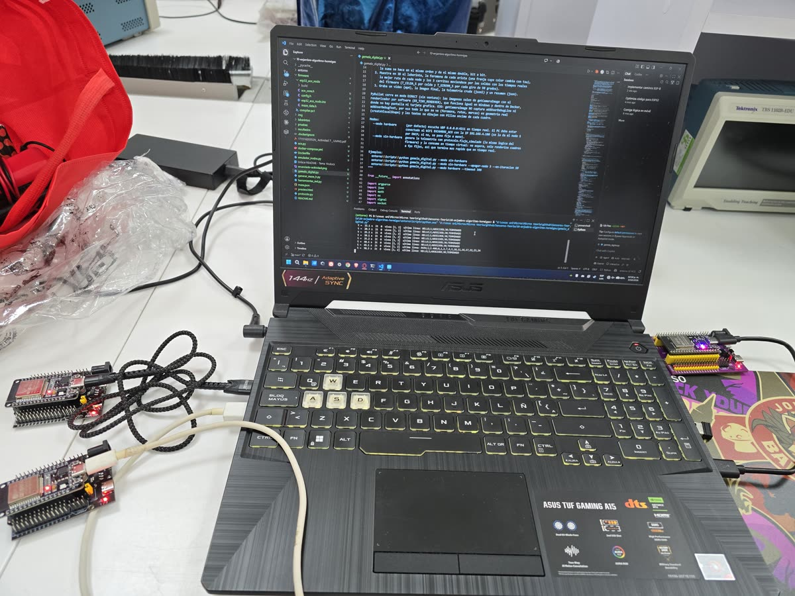

**El gemelo digital** en modo sin hardware: la búsqueda (la feromona violeta se concentra en la ruta corta) y después los tres carritos recorriendo su ruta, escalonados.

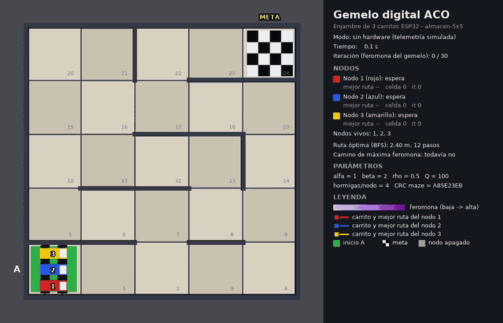

Video completo: [gemelo-sin-hardware.mp4](video/gemelo-sin-hardware.mp4)

**Prueba 14 en el gemelo**: el nodo 3 se apaga después de la iteración 10. Su carrito queda gris en A y los nodos 1 y 2 terminan solos.

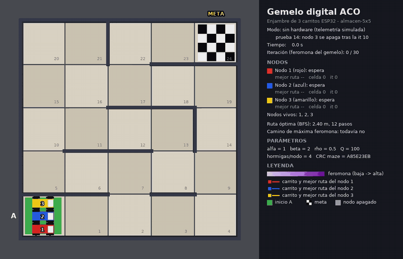

Video completo: [gemelo-apagado-nodo3.mp4](video/gemelo-apagado-nodo3.mp4)

**El gemelo en modo hardware alimentado por el emulador**: los tres ESP32 virtuales de `emulador_nodos.py` mandan la telemetría por UDP real al puerto 4211, y el gemelo la recibe igual que la de los carritos.

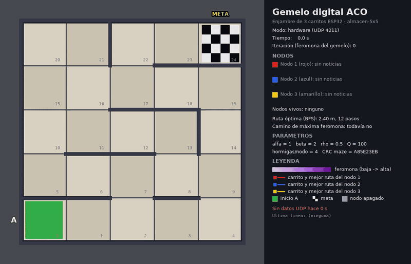

Video completo: [gemelo-hardware-emulador.mp4](video/gemelo-hardware-emulador.mp4)

**`preview.html`**: el mismo ACO portado a JavaScript, para probar sin instalar nada. Se elige el laberinto y los parámetros, se corre de a una iteración o seguido, y los botones de "Fallas en pleno funcionamiento" apagan un nodo como en la prueba 14. La feromona es el grosor verde de cada arista, la mejor ruta de cada nodo va en su color, el camino de máxima feromona va punteado, y abajo a la derecha están las líneas de protocolo que mandaría la red.

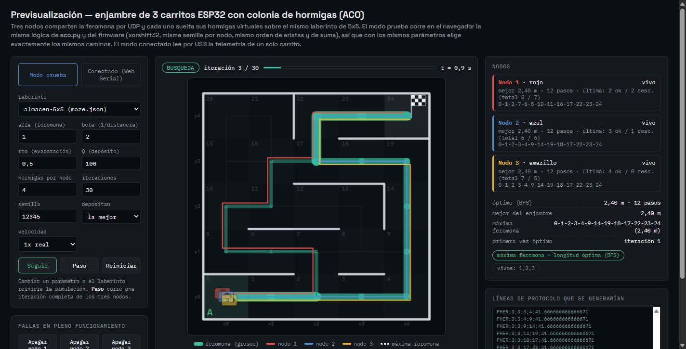

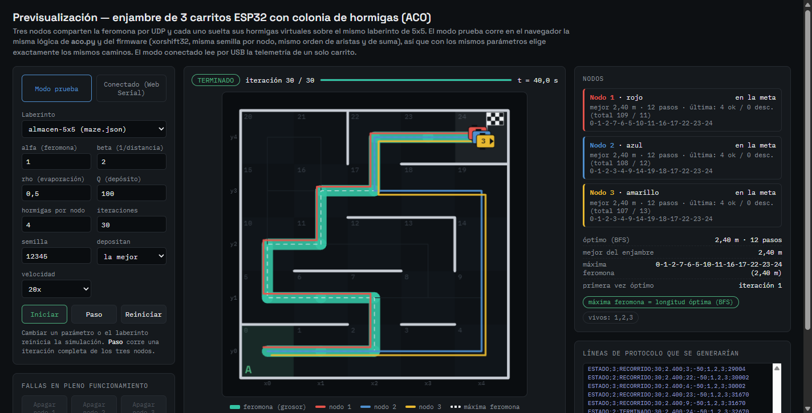

En modo conectado, `preview.html` lee por Web Serial (Chrome o Edge) a un solo carrito enchufado al PC. Como ese carrito solo repite lo suyo, la feromona que se reconstruye es la de sus propios depósitos (la página lo indica); las rutas de los otros nodos las toma de los mensajes de depuración que el firmware ya imprime. El laberinto lo reconoce solo, por el CRC del `HELLO`.

Las fotos y el video de los carritos armados en el laberinto van aquí cuando estén listos (ver "Pendiente").

## Pruebas

Las pruebas de software las corrimos y los números son los que salieron. Las que necesitan los carritos quedan con la casilla de resultado vacía para llenarla en el montaje. Cuando un resultado viene del emulador lo decimos explícitamente: el emulador prueba la lógica del protocolo, no el radio.

### Red y distancia

Herramienta: `herramientas_red.py` con el PC conectado a `ENJAMBRE_ACO`.

| # | Prueba | Método | Criterio de aceptación | Resultado |
|---|---|---|---|---|
| 1 | Los dos nodos estación se asocian al AP y toman su IP fija | Encender los tres; `python herramientas_red.py asociacion --segundos 20` | Los nodos 2 y 3 aparecen desde 192.168.4.2 y 192.168.4.3, con el mismo CRC del mapa | |
| 2 | Latencia de ida y vuelta por UDP, cien paquetes a 1 m | Nodos 1 y 2 a 1 m; `python herramientas_red.py rtt --origen 1 --destino 2 --n 100 --intervalo-ms 50 --distancia "1 m"` | 100 paquetes, pérdida ≤ 2 %, RTT promedio < 20 ms | |
| 3 | Pérdida de paquetes y RSSI a 3 m | Igual que la 2, con los nodos a 3 m (`--distancia "3 m"`) | Pérdida ≤ 5 %, RSSI > -75 dBm | |
| 4 | La misma medición a 5 m con un obstáculo en medio | Igual, a 5 m con un obstáculo (puerta, mueble o persona); anotar cuál | Se registran pérdida y RSSI; se acepta si la pérdida es ≤ 20 % (está fuera del máximo de 3 m del montaje) | |
| 5 | Reconexión automática cuando un nodo se reinicia | En plena búsqueda, `python herramientas_red.py reinicio --nodo 2` (o el botón EN) | El nodo vuelve a aparecer y sigue buscando con TAU en menos de 10 s, y los tres terminan | |

Lo que ya comprobamos con el emulador (no son mediciones del WiFi): los tres nodos virtuales se anunciaron con el mismo CRC; 100 de 100 `PING` respondidos (RTT de 0,28 ms por 127.0.0.1, que no dice nada del radio); un nodo reiniciado en plena búsqueda volvió a aparecer en 1,0 s, adoptó la feromona del nodo 1 con `TAU` y los tres llegaron al final; uno reiniciado durante el recorrido pasó a `TERMINADO` sin volver a buscar; y con la caída del AP los nodos 2 y 3 esperaron el tope y terminaron solos (`pruebas/resultados/emulador_*.json`).

### Algoritmo

Corridas con `pruebas/pruebas_algoritmo.py`: 3 nodos × 4 hormigas × 30 iteraciones = 360 hormigas por corrida, y 20 semillas, de la 1 a la 20, con la regla de depósito actual (solo la mejor hormiga de cada nodo). "Halla" quiere decir que alguna hormiga recorrió una ruta óptima. "Converge" quiere decir que, al terminar, el camino de máxima feromona es óptimo y no depende de ningún empate. Los resultados completos están en `pruebas/resultados/pruebas_algoritmo.json` y `pruebas_algoritmo.md`.

| # | Prueba | Método | Criterio de aceptación | Resultado |
|---|---|---|---|---|
| 6 | Laberinto sin paredes interiores, ruta óptima de 8 pasos | `laberintos/abierto.json`, semilla fija 12345 y 20 semillas | Con la semilla fija el camino de máxima feromona mide 8 pasos, y en al menos 95 % de las semillas se halla una ruta de 8 pasos | **No cumple, por una semilla.** Con la semilla 12345 el camino de máxima feromona mide 8 pasos (la primera parte cumple). En 20 semillas halla una ruta de 8 pasos en 90 % (iteración media 1,8) y converge en 90 % (iteración media 2,4); el criterio pedía 95 % de hallazgo |
| 7 | Laberinto con un único camino | `laberintos/unico_camino.json`, 20 semillas | Halla la única ruta (12 pasos) en todas, las hormigas que entran a un callejón se descartan y los callejones no reciben feromona | **Cumple.** 100 % halla y converge (iteración media 1,4); 16 hormigas descartadas de media; las aristas de los callejones terminan en $0{,}5^{30}$, sin ningún depósito |
| 8 | Dos caminos de distinta longitud, debe converger al más corto | `laberintos/dos_caminos.json`, 20 semillas | El camino de máxima feromona es el corto (8 pasos) con la semilla fija y en al menos 90 % | **Cumple.** Converge al corto en 100 %, ya en la primera iteración. Feromona media final: 375 por arista en el corto contra $9{,}3 \times 10^{-10}$ en el largo (nunca recibió un depósito) |
| 9 | Veinte corridas con semillas distintas | `maze.json`, semillas 1 a 20 | Reportar la tasa de convergencia al óptimo y las iteraciones medias; se acepta con tasa de hallazgo ≥ 90 % | **Cumple.** Halla el óptimo y converge en 95 % (19 de 20); iteración media del hallazgo 1,0 y de convergencia 1,47 |
| 10 | Barrido de rho en 0,1, 0,5 y 0,9 | `maze.json`, 20 semillas por valor | Correr y registrar | Tabla y figura abajo |
| 11 | Barrido de alfa y beta, al menos cuatro combinaciones | `maze.json`, 6 combinaciones, 20 semillas cada una | Correr y registrar | Tabla abajo |

**Antes y después del cambio de regla.** Las mismas pruebas con la regla original (depositan todas las hormigas que llegan) dieron:

| Caso | Regla | Halla el óptimo | Converge | Iteración media de convergencia | Semilla 12345 |
|---|---|---|---|---|---|
| Prueba 6, laberinto abierto | todas depositan | 95 % | 90 % | 10,9 | 12 pasos |
| Prueba 6, laberinto abierto | solo la mejor de cada nodo | 90 % | 90 % | 2,4 | 8 pasos |
| Prueba 9, `maze.json` | todas depositan | 100 % | 95 % | 2,05 | 12 pasos (óptimo) |
| Prueba 9, `maze.json` | solo la mejor de cada nodo | 95 % | 95 % | 1,47 | 12 pasos (óptimo) |

Con la regla nueva la colonia converge igual de seguido y mucho más rápido, y la semilla 12345 del laberinto abierto ya termina en la ruta de 8 pasos. Lo que se pierde es exploración: como entran a la memoria común solo tres rutas por iteración, en una de las 20 semillas la colonia se fija en una ruta larga antes de que alguna hormiga encuentre la óptima. En el laberinto abierto le pasa a 2 semillas de 20, y por eso la prueba 6 queda en 90 % y no en el 95 % del criterio.

Prueba 10, barrido de rho en `maze.json`:

| rho | Halla el óptimo | Iteración media del hallazgo | Converge | Iteración media de convergencia | Hormigas descartadas (de 360) |
|---|---|---|---|---|---|
| 0,1 | 95 % | 1,00 | 95 % | 1,37 | 60,2 |
| 0,5 | 95 % | 1,00 | 95 % | 1,47 | 28,4 |
| 0,9 | 95 % | 1,00 | 95 % | 1,47 | 16,6 |

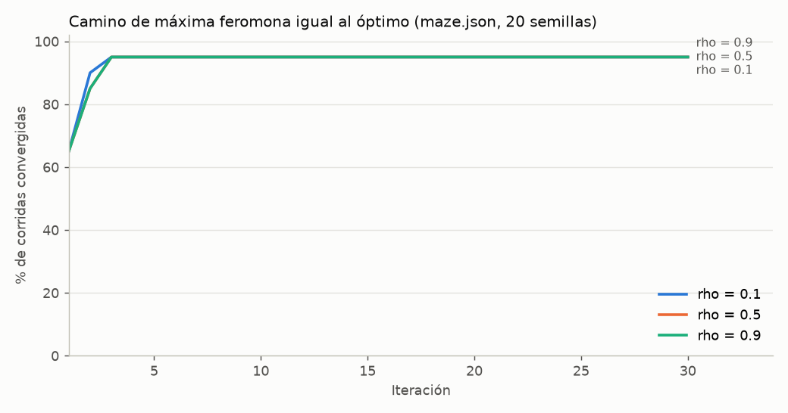

Con solo la mejor hormiga depositando, rho casi no cambia el resultado en este laberinto: los tres valores llegan a 95 % y convergen en una o dos iteraciones. La diferencia está en la exploración: con rho = 0,1 la feromona vieja dura más, el contraste entre la ruta marcada y las demás es menor y las hormigas siguen probando ramas (casi cuatro veces más descartadas que con 0,9). Con rho = 0,9 casi todo lo anterior se borra en cada iteración y la colonia sigue casi solo lo que depositaron las tres mejores hormigas de la última.

Prueba 11, barrido de alfa y beta en `maze.json`:

| alfa | beta | Halla el óptimo | Iteración media del hallazgo | Converge | Iteración media de convergencia | Hormigas descartadas (de 360) |
|---|---|---|---|---|---|---|
| 1,0 | 2,0 | 95 % | 1,00 | 95 % | 1,47 | 28,4 |
| 0,5 | 2,0 | 100 % | 1,10 | 100 % | 1,50 | 87,0 |
| 2,0 | 2,0 | 95 % | 1,00 | 95 % | 1,47 | 12,3 |
| 1,0 | 0,0 | 95 % | 1,00 | 95 % | 1,47 | 28,4 |
| 1,0 | 5,0 | 95 % | 1,00 | 95 % | 1,47 | 28,4 |
| 3,0 | 1,0 | 95 % | 1,00 | 90 % | 1,28 | 9,2 |

Alfa es el que manda. Con alfa bajo (0,5) las hormigas le hacen menos caso a la feromona y exploran más (tres veces más descartadas), y eso es justo lo que le falta a la regla elitista: es la única combinación que halla y converge en las 20 semillas. Con alfa alto (3) se fijan casi de inmediato en la primera ruta marcada y la convergencia baja a 90 %. Beta = 0, 2 y 5 dan **exactamente** el mismo resultado, como explicamos en la lógica: con celdas iguales la visibilidad es la misma en todas las aristas y se cancela.

### Gemelo digital

| # | Prueba | Método | Criterio de aceptación | Resultado |
|---|---|---|---|---|
| 12 | La ruta física y la virtual coinciden nodo por nodo | Con los carritos y el gemelo en modo hardware, comparar el `PATH` final de cada nodo (`resultados/resumen_hardware.json`) con `aco.py` con la misma semilla, y con el recorrido real de cada carrito | Las tres rutas coinciden celda por celda | Hardware: |
| 13 | El contenedor arranca, simula y termina sin errores y produce el video | `docker compose build` y `docker compose run --rm simulacion` | Código de salida 0 y `resultados/gemelo_sin-hardware.mp4` reproducible | Docker: |
| 14 | Se apaga un nodo en pleno funcionamiento y la simulación continúa con los dos restantes | Con los carritos: desconectar la batería del carrito 3 hacia la iteración 10 | Los nodos 1 y 2 lo dan por caído, siguen y terminan; el gemelo muestra el robot 3 detenido y los otros dos siguen | Hardware: |
| 15 | Diez ejecuciones del contenedor con semilla fija dan la misma ruta | `entorno\Scripts\python pruebas\repetir_gemelo.py --docker` (diez veces `docker compose run --rm simulacion`) | Las diez dan la misma ruta en los tres nodos | Docker: |

Lo que ya respalda estas pruebas sin hardware ni Docker:

- **Prueba 12.** El núcleo C++ del firmware y el Python dan las mismas rutas bit a bit (48 de 48 casos). Además corrimos el gemelo en **modo hardware** recibiendo por UDP real los mensajes del emulador de los tres nodos: terminó a los 46,8 s con las rutas de los tres nodos y la feromona idénticas a `aco.py` con la semilla 12345, sin ningún `FIN` incompleto (`pruebas/resultados/integracion/`).
- **Prueba 13**, fuera del contenedor: `gemelo_digital.py --modo sin-hardware` terminó con código 0 (42 s de tiempo virtual, 661 cuadros; entre 220 y 265 s de cálculo con cuatro corridas a la vez) y dejó un mp4 H.264 de 631 KB, la imagen final y los json. La feromona que reconstruyó fue idéntica a la de los nodos. Los archivos de Docker están escritos con versiones que tienen rueda para Linux x86_64, pero falta correrlos.
- **Prueba 14**, con el emulador y el gemelo en modo hardware: con el nodo 3 apagado después de la iteración 10, los nodos 1 y 2 terminaron con sus rutas y la feromona idénticas a `simular_enjambre(caidas={3: 10})`, y el gemelo marcó el nodo 3 como apagado (`pruebas/resultados/integracion_apagado3/`).
- **Prueba 15**, fuera del contenedor: `pruebas/repetir_gemelo.py` corrió el gemelo diez veces con la semilla 12345 (de a cuatro en paralelo, 724 s en total) y **las diez dieron exactamente lo mismo**: la misma ruta en los tres nodos (nodo 1: 0-1-2-7-6-5-10-11-16-17-22-23-24; nodos 2 y 3: 0-1-2-3-4-9-14-19-18-17-22-23-24, todas de 2,40 m), la misma feromona final y la misma convergencia (`pruebas/resultados/repetir_gemelo_nativo.json`). Con Docker se corre igual, agregando `--docker`.

## Pendiente

- Fotos y video de los tres carritos armados (con el driver y los motores), del laberinto y de una corrida completa. Las fotos de las placas sueltas en la mesa ya están en "El montaje y la demo".
- Llenar las pruebas 1 a 5, 12 y 14 con los carritos, y la tabla de distancias y RSSI.
- Correr las pruebas 13 y 15 con Docker. En este PC la virtualización de la BIOS ya está activada y Docker Desktop instalado; falta activar la "Plataforma de máquina virtual" (`wsl --install --no-distribution` como administrador y reiniciar).
- Calibrar `VEL_AVANCE` y `VEL_GIRO` de cada carrito.
