# Zonas virtualizadas (VLAN) con ESP32, PyBullet, Docker y un plano de administración

Actividad del segundo corte (en el aula virtual aparece como "Actividad 8"; en este repositorio es el tema 11). El enunciado pide armar con Docker un laboratorio partido en tres redes aisladas, como tres VLAN: una **Zona Gamer** con un servidor de pista en PyBullet y tres jugadores, una **Zona Robótica** con un Spot, un Pepper y un NAO simulados, y un **Plano de Administración** que mide latencia, jitter y disponibilidad de todo lo demás. Cada jugador y cada robot lo maneja su propia ESP32 maestra, una ESP32 esclava muestra en seis LED el estado de cada contenedor, y un router inter-VLAN deja que la administración vea las dos zonas sin que las zonas se vean entre sí.

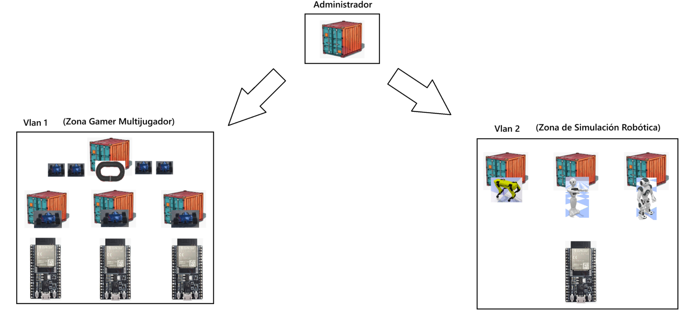

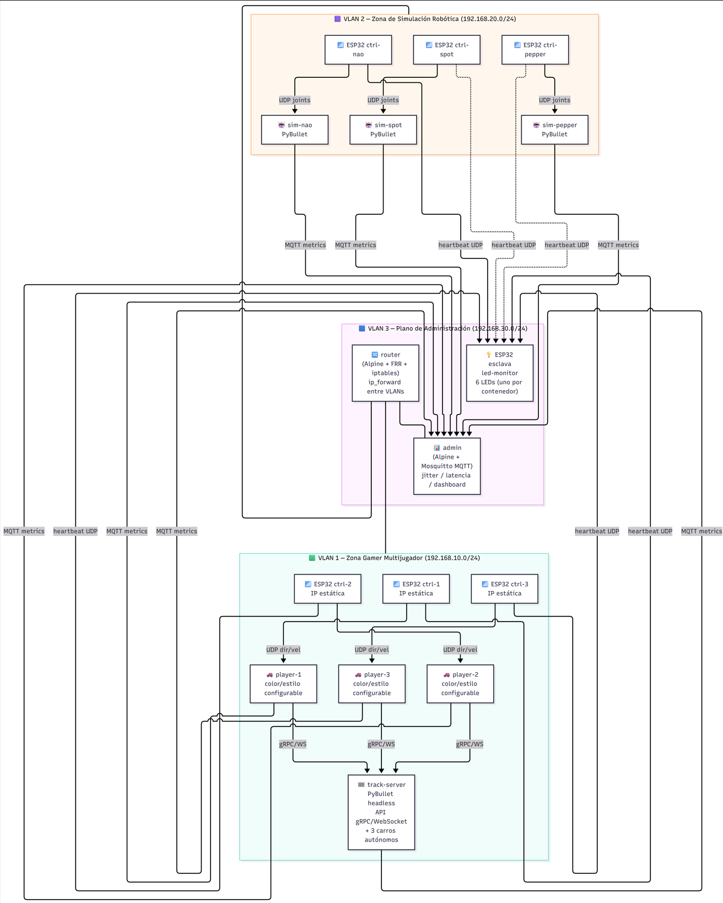

La segunda figura es la arquitectura del enunciado: la VLAN 1 (192.168.10.0/24) con el `track-server` y los `player-1..3`, cada uno con su ESP32 `ctrl-N`; la VLAN 2 (192.168.20.0/24) con `sim-spot`, `sim-pepper` y `sim-nao` y sus ESP32; y la VLAN 3 (192.168.30.0/24) con el router (Alpine + FRR + iptables), el contenedor `admin` (Alpine + Mosquitto) y la ESP32 esclava con los LED. Usamos esas mismas direcciones y esos mismos nombres.

**Basado en** los tres repositorios de referencia del enunciado, de los que tomamos los modelos (no el código de entrenamiento):

- [rl-baselines3-zoo](https://github.com/DLR-RM/rl-baselines3-zoo): entrena, entre otros, el entorno `RacecarBulletEnv-v0` de `pybullet_envs`. Ese entorno usa el carro `racecar` que viene en `pybullet_data` (el MIT RACECAR a escala 1:10). Es el mismo carro que usamos para los seis carros de la pista.
- [rex-gym](https://github.com/nicrusso7/rex-gym): de ahí sale el "pequeño Spot", el Rex (un SpotMicro), con su URDF y sus 13 mallas STL, bajados de un commit fijo al construir la imagen. La cinemática inversa la rehicimos (más abajo explicamos por qué).
- [humanoid-gym](https://github.com/0aqz0/humanoid-gym): entrena humanoides en PyBullet y carga a NAO a través de [qiBullet](https://github.com/softbankrobotics-research/qibullet), el simulador oficial de SoftBank. De qiBullet tomamos los URDF de NAO y de Pepper.

## Lo que hicimos

- **Tres redes de Docker como tres VLAN** (`vlan1_gamer`, `vlan2_robotica`, `vlan3_admin`) y un **router inter-VLAN** en un contenedor Alpine con FRR e iptables: la administración llega a las dos zonas y un paquete de la VLAN 1 a la VLAN 2 (o al revés) se descarta en el router. Lo comprobamos con 45 de 45 casos aprobados.
- **La Zona Gamer**: un servidor de pista en PyBullet sin pantalla, con física a 240 Hz, seis carros (tres de jugadores y tres autónomos que se adelantan y se esquivan), conteo de vueltas, failsafe y un visor por HTTP. Tres contenedores jugador reciben el mando del ESP32 por UDP y se lo pasan al servidor por WebSocket, cada uno con su color y su estilo de carrocería.
- **La Zona Robótica**: una sola imagen para los tres robots (Spot, Pepper y NAO), que siguen en tiempo real los ángulos que manda su ESP32 (real-to-sim) y miden cuánto se separa la simulación de lo pedido.
- **El plano de administración**: Mosquitto (MQTT), un monitor que recibe latidos UDP, hace ping a cada contenedor a través del router, decide OK, LENTO o CAIDO, lo publica por MQTT y lo muestra en un dashboard web.
- **El firmware de los ESP32**: un sketch maestro que sirve para los seis mandos (joystick o potenciómetros) y otro para la esclava de seis LED. Compilan sin advertencias.
- **Un emulador de los siete ESP32** que manda exactamente los mismos mensajes, para correr todo sin hardware. Los mandos de los carros traen un piloto automático que "mira" la pista.
- **`preview.html`**: todo el laboratorio simulado en el navegador, con un modo conectado por Web Serial para una placa real.
- **Pruebas** de protocolo, aislamiento, disponibilidad, latencia y jitter, con los resultados reales del stack completo, y un script que publica las seis imágenes en Docker Hub.

El stack completo son 16 contenedores: router, admin, track-server, player-1..3, sim-spot, sim-pepper, sim-nao y los 7 ESP32 emulados.

Dónde está cada cosa que pide el enunciado:

| Lo que pide | Dónde está |
|---|---|
| Objetivo 1: Zona Gamer (VLAN 1) | "La Zona Gamer (VLAN 1)"; pruebas 2-6 |
| Objetivo 2: Zona Robótica (VLAN 2), real-to-sim | "La Zona Robótica (VLAN 2)"; pruebas 7-9 |
| Objetivo 3: plano de administración y ESP32 esclava | "El plano de administración (VLAN 3)" y "El firmware"; pruebas 10-12 |
| Objetivo 4: router inter-VLAN | "Las tres redes y el router"; pruebas 13-19 |
| Objetivo 5: latencia, jitter y disponibilidad | "Qué son la latencia, el jitter y la disponibilidad"; pruebas 20-26 |
| Repositorio con el paso a paso | "Cómo lo hicimos, paso a paso", "Cómo probarlo" y "Docker paso a paso" |
| Imágenes en Docker Hub | "Docker paso a paso" → "Docker Hub"; prueba 27 |
| Video de la práctica funcionando | "El montaje y la demo" (con los ESP32 emulados; el del montaje físico está en "Pendiente") |
| Explicación | las secciones "Qué es..." y la de cada parte |

## Cómo lo hicimos, paso a paso

1. **Leímos el enunciado y fijamos un contrato común.** Antes de escribir código dejamos por escrito las IP de cada contenedor, los puertos que se publican en el PC para los ESP32 físicos, el formato exacto de cada mensaje (`CTRL`, `JOINTS`, `HB`, `PING`/`PONG`), los tópicos MQTT y los nombres de las imágenes. Con eso, cada parte se pudo hacer por separado sin que después no encajaran. Lo común quedó en `comun/protocolo.py` (armar y leer los mensajes, contar pérdidas por número de secuencia, jitter) y `comun/lab.py` (ruta al router, latido y MQTT).
2. **Armamos la red y el router.** Tres redes bridge con IP fijas y un contenedor Alpine en las tres. El router identifica cada interfaz por su subred y no por su nombre, porque en las pruebas el orden de `eth0`, `eth1` y `eth2` cambió entre corridas. Lo probamos con contenedores de relleno antes de tener las zonas.
3. **Hicimos el servidor de pista.** La pista, el control del racecar, los autónomos con *pure pursuit*, el protocolo WebSocket y un proceso aparte que dibuja, para que el render no frene la física.
4. **Hicimos el jugador y el emulador.** El jugador traduce UDP a WebSocket y mide la red del ESP32. El emulador manda los mismos mensajes que el firmware; contra un servidor falso comprobamos que el jugador contaba exactamente los paquetes que el emulador no mandaba.
5. **Hicimos los robots.** Buscamos los modelos reales de los repositorios del enunciado, resolvimos la instalación de las mallas de SoftBank (más abajo, en "Las licencias") y escribimos el mapeo de cada ángulo, la cinemática inversa del Spot y su trote.
6. **Hicimos el plano de administración.** Mosquitto, el monitor, las reglas OK/LENTO/CAIDO y el dashboard, probados primero solos, con un script que hacía de todos los demás.
7. **Escribimos el firmware**, compilamos los seis roles y la esclava, y comprobamos en el PC que las líneas que arma el ESP32 son idénticas, carácter por carácter, a las de `comun/protocolo.py`.
8. **Hicimos `preview.html`** y las pruebas (`pruebas/`).
9. **Integramos.** Levantamos los 16 contenedores, corregimos lo que no encajaba (los rangos de grados de cada robot, que el emulador entendiera la línea central que manda el servidor, la licencia de SoftBank por defecto en `no`) y corrimos las pruebas de aislamiento y disponibilidad con el stack real. La de disponibilidad encontró un error del monitor, que corregimos (lo contamos en "Plano de administración").
10. **Medimos latencia, jitter y disponibilidad** en tres escenarios (base, retardo artificial y carga), grabamos el video de la demo y publicamos las imágenes.

## Qué es una VLAN

Una **red local (LAN)** es un grupo de equipos conectados al mismo switch que se hablan directamente: cuando uno manda un mensaje "a todos" (un *broadcast*, como la pregunta ARP "¿quién tiene la IP 192.168.10.10?"), les llega a todos los conectados. Ese conjunto de equipos que recibe los broadcast de los demás se llama **dominio de broadcast**.

Una **VLAN** (*Virtual LAN*, red local virtual) parte un mismo switch físico en varias redes locales separadas, como si fueran switches distintos. Los equipos de la VLAN 10 no reciben los broadcast de la VLAN 20 ni pueden mandarles nada directamente, aunque estén enchufados al mismo aparato. Sirve para separar por función (en una empresa: contabilidad, invitados, cámaras) sin comprar un switch por grupo, y para que un problema o un intruso en una red no alcance a las otras.

El estándar es el **IEEE 802.1Q**. Cuando una trama tiene que viajar por un cable que lleva varias VLAN a la vez (un enlace *troncal* entre dos switches, o entre el switch y un router), el switch le agrega 4 bytes, la **etiqueta**: un identificador `0x8100` que avisa que la trama viene etiquetada, 3 bits de prioridad, 1 bit que marca si la trama se puede descartar primero (DEI) y 12 bits con el **número de VLAN** (de 1 a 4094). El switch del otro lado lee el número, quita la etiqueta y entrega la trama solo a los puertos de esa VLAN. Los equipos finales casi nunca ven la etiqueta: su puerto es de *acceso* a una sola VLAN.

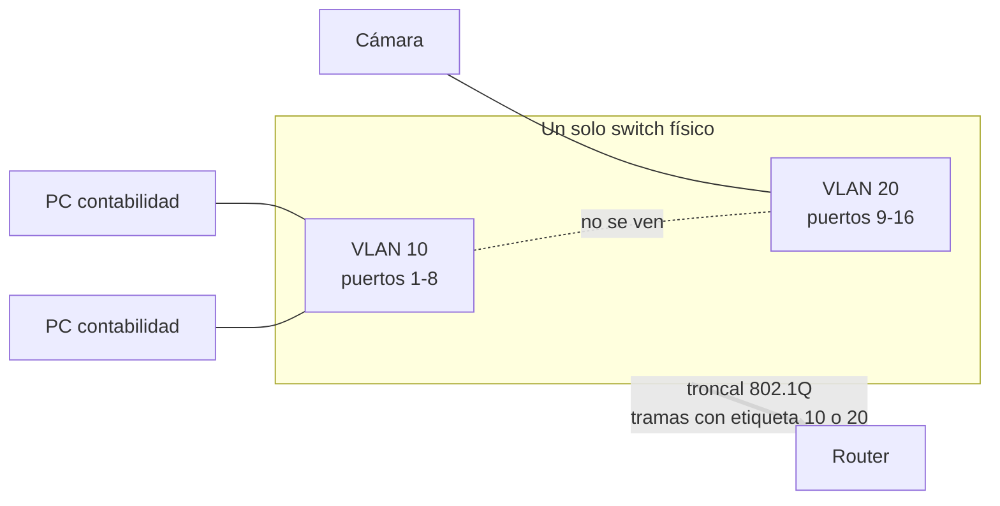
```mermaid
flowchart LR
    subgraph SW["Un solo switch físico"]
        direction TB
        V10["VLAN 10<br/>puertos 1-8"]
        V20["VLAN 20<br/>puertos 9-16"]
    end
    PC1["PC contabilidad"] --- V10
    PC2["PC contabilidad"] --- V10
    CAM["Cámara"] --- V20
    V10 -. "no se ven" .- V20
    SW == "troncal 802.1Q<br/>tramas con etiqueta 10 o 20" ==> R["Router"]
```

Un ejemplo: en un colegio, los computadores de los estudiantes van en la VLAN 10 y las cámaras de seguridad en la VLAN 20. Un estudiante que escanee su red no encuentra las cámaras: solo podría llegar a ellas a través de un router, y el router no lo deja.

En esta práctica hay tres VLAN: la **Zona Gamer** (VLAN 1, 192.168.10.0/24), la **Zona Robótica** (VLAN 2, 192.168.20.0/24) y el **Plano de Administración** (VLAN 3, 192.168.30.0/24). Las dos zonas no se deben ver entre sí, y el plano de administración debe ver a las dos.

## Qué es un router inter-VLAN (FRR e iptables)

Si las VLAN están aisladas, ¿cómo se comunican cuando sí hace falta? Con un **router**: un equipo que tiene una pata en cada red y pasa paquetes de una a otra según su dirección IP de destino. Para cada equipo de una VLAN, el router es la puerta hacia las otras redes (su *puerta de enlace*). Como todo lo que cruza de una VLAN a otra pasa por el router, ahí es donde se decide **qué** puede cruzar: ahí va el cortafuegos.

Hay dos formas típicas de armarlo:

- **Router-on-a-stick** ("router en un palo"): un router con un solo cable al switch, configurado como troncal 802.1Q. En el router se crean subinterfaces, una por VLAN (`eth0.10`, `eth0.20`, `eth0.30`), cada una con la IP de puerta de enlace de su red. Es lo que se haría con un switch administrable y un router físico.
- **Router en un contenedor** (lo que hicimos): un contenedor Alpine conectado a las tres redes de Docker a la vez, con una interfaz en cada una (`192.168.10.254`, `192.168.20.254`, `192.168.30.254`). No hacen falta etiquetas, porque cada red llega por su propia interfaz.

Para que ese contenedor funcione como router se necesitan tres piezas:

1. **`ip_forward = 1`**. Por defecto, Linux descarta un paquete que le llega y no es para él. Con `net.ipv4.ip_forward=1` (en el compose, con `sysctls`) lo reenvía por la interfaz que corresponda según su tabla de rutas. Esto solo ya convierte el contenedor en router. Afecta solo al espacio de red del contenedor, no al PC.
2. **FRR** (*Free Range Routing*), el software de enrutamiento que usan muchos routers de verdad. Usamos **zebra**, que administra la tabla de rutas del núcleo de Linux, y **staticd** (FRR 9 también pide **mgmtd**). Se consulta como en un router Cisco, con `vtysh -c "show ip route"`. Con las tres redes conectadas directamente el router ya sabe llegar a todas; FRR deja la tabla visible y quedaría listo para un protocolo dinámico (OSPF, BGP) si se agregaran más routers.
3. **`iptables`, cadena `FORWARD`**. El cortafuegos de Linux tiene varias cadenas de reglas; `FORWARD` es la que revisa los paquetes que **pasan a través** del equipo (no los que van dirigidos a él). La política por defecto es `DROP` (descartar todo), y encima se permiten solo los cruces que queremos: la VLAN 3 hacia la 1 y hacia la 2, sus respuestas, y nada entre la 1 y la 2. Cada regla lleva un contador de paquetes, que es lo que lee la prueba de aislamiento para mostrar que el router de verdad descartó los intentos.

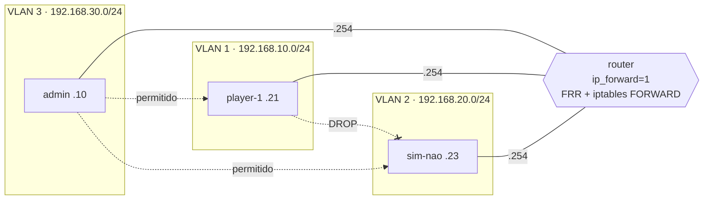
```mermaid
flowchart LR
    subgraph V1["VLAN 1 · 192.168.10.0/24"]
        P1["player-1 .21"]
    end
    subgraph V2["VLAN 2 · 192.168.20.0/24"]
        NAO["sim-nao .23"]
    end
    subgraph V3["VLAN 3 · 192.168.30.0/24"]
        ADM["admin .10"]
    end
    R{{"router<br/>ip_forward=1<br/>FRR + iptables FORWARD"}}
    P1 -- ".254" --- R
    NAO -- ".254" --- R
    ADM -- ".254" --- R
    ADM -. "permitido" .-> P1
    ADM -. "permitido" .-> NAO
    P1 -. "DROP" .-x NAO
```

Hay un detalle que hay que entender: cada contenedor tiene como puerta de enlace por defecto la `.1` de su red, que pone Docker, no nuestro router. Por eso al arrancar cada uno agrega una ruta: "para llegar a 192.168.30.0/24, ve por 192.168.10.254" (`ip route replace`). Si no, el paquete se iría por Docker y nunca pasaría por el router.

## Qué es un contenedor, y Docker Compose con varias redes

Un **contenedor** es un programa empaquetado con todo lo que necesita (su versión de Python, sus librerías, sus archivos) que corre aislado del resto del sistema, como una máquina virtual muy liviana que comparte el núcleo del sistema operativo en vez de emular un computador completo. La receta para fabricarlo es el `Dockerfile` y el resultado es una **imagen**; cada vez que se arranca una imagen se obtiene un contenedor. En el tema 10 usamos uno; aquí hay 16.

Cada contenedor tiene además su **propia pila de red**: sus interfaces, sus IP, su tabla de rutas y su cortafuegos, separados de los del PC y de los demás contenedores. Por eso cada uno se comporta como un equipo independiente conectado a una red.

**Docker Compose** describe todo el conjunto en un solo archivo, `docker-compose.yml`: qué contenedores hay, de qué imagen sale cada uno, qué variables de entorno reciben, qué puertos del PC se abren hacia ellos y **a qué redes se conectan, con qué IP fija**. Con `docker compose up -d` se levanta todo y con `docker compose down` se baja.

Una **red bridge** de Docker es un switch virtual dentro del PC (un *bridge* de Linux): los contenedores conectados a ella se ven entre sí como si estuvieran en el mismo switch. Docker crea un bridge distinto por cada red declarada en el compose y **no deja pasar tráfico de un bridge a otro**: tiene reglas propias en el cortafuegos (las cadenas `DOCKER-ISOLATION`) que lo descartan. Así que tres redes bridge se comportan como tres VLAN: tres dominios de broadcast separados que solo se tocan a través de un contenedor conectado a varias de ellas, el router.

| Concepto de red | Equipo físico | En esta práctica |
|---|---|---|
| Switch | aparato con puertos | un bridge de Linux por red de Docker |
| VLAN | número 802.1Q en el switch | una red del compose (`vlan1_gamer`, `vlan2_robotica`, `vlan3_admin`) |
| Aislamiento entre VLAN | el switch no mezcla VLAN | reglas `DOCKER-ISOLATION` de Docker y el `DROP` del router |
| Router inter-VLAN | router con subinterfaces | contenedor `router` conectado a las tres redes |
| Cable de cada equipo | patch cord | interfaz virtual (`veth`) del contenedor |

**Por qué redes bridge y no VLAN 802.1Q de verdad.** En Docker Desktop (Windows) los contenedores viven dentro de una máquina virtual Linux que no ve la tarjeta de red física, así que no hay un enlace troncal 802.1Q al que colgarse. Lo que sí hay son bridges, y dan el mismo efecto que pide el enunciado: redes separadas que solo se cruzan por un router controlado. Dicho con honestidad, aquí no viaja ninguna etiqueta 802.1Q por ningún cable. Para un Linux con un switch administrable dejamos `docker-compose.vlan-real.yml`, que cambia las tres redes por redes `macvlan` sobre las subinterfaces `eth0.10`, `eth0.20` y `eth0.30`. **No lo probamos**: en este PC no se puede, y solo comprobamos que el archivo es válido con `docker compose -f docker-compose.yml -f docker-compose.vlan-real.yml config`.

Los ESP32 físicos no se pueden conectar a un bridge de Docker (están en el WiFi): entran por la IP del PC, y Docker reenvía los puertos publicados (por ejemplo, el UDP 5001 del PC al puerto 5000 del player-1).

## Qué es Docker Hub

**Docker Hub** es un **registro** de imágenes: un sitio en internet donde se guardan imágenes de Docker para que cualquiera las descargue, igual que GitHub guarda código. De ahí salen las imágenes base que usamos (`python:3.11-slim` y `alpine:3.20`).

- Una **imagen** es la plantilla de solo lectura (sistema de archivos, programa y configuración) de la que salen los contenedores. Está hecha de **capas** apiladas: cada instrucción del `Dockerfile` agrega una. Si dos imágenes comparten la base, comparten esas capas y no se descargan dos veces.
- Su nombre completo es `usuario/repositorio:etiqueta`, por ejemplo `dathinel/zonas-esp32-robot:1.0`. La **etiqueta** (*tag*) distingue versiones: `1.0` es una versión fija y `latest` es, por convención, la más reciente.
- **`docker push`** sube una imagen al registro (hace falta haber iniciado sesión con `docker login`) y **`docker pull`** la baja. Solo viajan las capas que el otro lado todavía no tiene.

Con las imágenes en Docker Hub, otra persona levanta todo el laboratorio sin construir nada, con `docker compose pull` y `docker compose up -d`. Las seis imágenes y sus enlaces están en "Docker paso a paso".

## Qué es MQTT

**MQTT** es un protocolo de mensajería muy liviano, pensado para dispositivos pequeños como el ESP32. En vez de que cada equipo hable directamente con cada otro, todos se conectan a un servidor central, el **broker** (aquí, Mosquitto dentro del contenedor admin), y se usa el modelo **publicar/suscribir**:

- Un equipo **publica** un mensaje en un **tópico**, que es un nombre jerárquico con barras, como `lab/estado/player-1`.
- Los equipos que estén **suscritos** a ese tópico lo reciben. Quien publica no sabe quién escucha ni cuántos son.
- Las suscripciones aceptan comodines: `lab/estado/+` recibe el estado de todos los servicios (`+` reemplaza un nivel) y `lab/#` recibe todo lo que empiece por `lab/` (`#` reemplaza cualquier cantidad de niveles).

Así la ESP32 esclava solo se suscribe al estado de los seis servicios y prende sus LED, sin saber nada de los contenedores.

Otros cuatro conceptos que usamos:

- **QoS** (calidad de servicio), el nivel de garantía de entrega: **0** = se manda una vez y ya (si se pierde, se pierde; lo usamos para las métricas, que llegan cada 2 s); **1** = se reenvía hasta que el otro confirma, así que llega al menos una vez (lo usamos para los estados y para `vivo`); **2** = llega exactamente una vez, con cuatro mensajes de intercambio (no lo necesitamos).
- **Mensaje retenido** (*retained*): el broker guarda el último mensaje de ese tópico y se lo entrega de inmediato a quien se suscriba después. Por eso, si la ESP32 esclava se reinicia, en cuanto se conecta recibe el estado actual de los seis servicios sin esperar a que cambie algo.
- **Testamento** (*Last Will and Testament*, LWT): al conectarse, cada cliente le deja al broker un mensaje para publicar "si me muero sin despedirme". Cada contenedor deja `lab/vivo/<servicio>` = `0`.
- **Keepalive**: el cliente se compromete a mandar algo cada tantos segundos (5 s aquí); si el broker pasa 1,5 veces ese tiempo sin oír nada, da la conexión por muerta y publica el testamento.

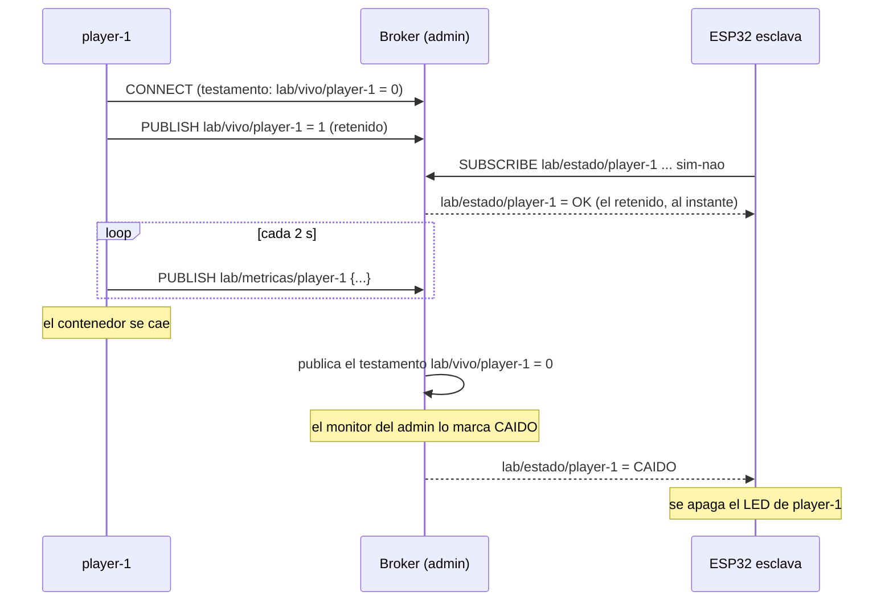
```mermaid
sequenceDiagram
    participant P as player-1
    participant B as Broker (admin)
    participant E as ESP32 esclava
    P->>B: CONNECT (testamento: lab/vivo/player-1 = 0)
    P->>B: PUBLISH lab/vivo/player-1 = 1 (retenido)
    E->>B: SUBSCRIBE lab/estado/player-1 ... sim-nao
    B-->>E: lab/estado/player-1 = OK (el retenido, al instante)
    loop cada 2 s
        P->>B: PUBLISH lab/metricas/player-1 {...}
    end
    Note over P: el contenedor se cae
    B->>B: publica el testamento lab/vivo/player-1 = 0
    Note over B: el monitor del admin lo marca CAIDO
    B-->>E: lab/estado/player-1 = CAIDO
    Note over E: se apaga el LED de player-1
```

Los tópicos que usa la práctica:

| Tópico | Quién publica | Contenido |
|---|---|---|
| `lab/vivo/<servicio>` | cada contenedor (y su testamento) | `1` / `0`, retenido |
| `lab/metricas/<servicio>` | cada contenedor, cada 2 s | JSON con lo que mida (fps de física, paquetes recibidos y perdidos, jitter, error real-to-sim...) |
| `lab/estado/<servicio>` | el admin, al cambiar y cada 10 s | `OK` / `LENTO` / `CAIDO`, retenido |
| `lab/admin/resumen` | el admin, cada 2 s | JSON con la tabla de latencia, jitter y disponibilidad |

El broker acepta clientes sin usuario y sin TLS a propósito: es un laboratorio aislado y solo viajan métricas de prueba. En producción se pondría `allow_anonymous false` con un usuario por dispositivo, una lista de permisos para que solo el admin escriba en `lab/estado/#` (así un dispositivo comprometido no puede cambiar el LED de otro) y TLS en el puerto 8883.

## Qué son la latencia, el jitter y la disponibilidad

Son las tres medidas que pide el objetivo 5 del enunciado.

**Latencia** es cuánto tarda un paquete en llegar. Medirla en un solo sentido exige que los relojes del emisor y del receptor estén sincronizados al milisegundo, y un ESP32 y un contenedor no lo están. Por eso casi siempre se mide la **latencia de ida y vuelta** (RTT, *round-trip time*): se manda un mensaje, el otro lo devuelve tal cual y el mismo equipo mide con su propio reloj cuánto tardó en volver. Es lo que hacen `ping` y nuestros `PING`/`PONG`. No basta con el promedio: reportamos también el **percentil 95** (p95, el valor por debajo del cual queda el 95 % de las mediciones) y el **máximo**, porque para manejar un carro en vivo importan más los peores casos.

**Jitter** es cuánto **varía** la latencia de un paquete al siguiente. Una red que tarda siempre 30 ms se siente fluida; una que alterna entre 5 y 55 ms se siente a tirones, aunque su promedio también sea 30 ms: dos órdenes del joystick llegan casi juntas y luego hay un hueco. Usamos la fórmula del **RFC 3550** (la de RTP, el protocolo de voz y video en internet), que no necesita relojes sincronizados porque solo resta tiempos medidos con el mismo reloj. Para cada par de paquetes seguidos:

$$D = (\text{llegada}_i - \text{llegada}_{i-1}) - (\text{envío}_i - \text{envío}_{i-1})$$

$D$ dice cuánto más (o menos) tardó el paquete $i$ que el anterior. El jitter es un promedio móvil de $|D|$ con peso 1/16:

$$J \leftarrow J + \frac{|D| - J}{16}$$

El 1/16 hace que un solo paquete raro casi no mueva el valor, pero que un cambio sostenido se note en unos 16 paquetes.

Un ejemplo: un ESP32 manda un paquete cada 20 ms según su reloj, y el contenedor los ve llegar según el suyo.

| Paquete | Envío (reloj del ESP32) | Llegada (reloj del contenedor) | Δ llegada − Δ envío = D | J después |
|---|---|---|---|---|
| 1 | 0 ms | 100 ms | — | 0 |
| 2 | 20 ms | 121 ms | 21 − 20 = 1 | 0 + (1 − 0)/16 = 0,0625 |
| 3 | 40 ms | 139 ms | 18 − 20 = −2 | 0,0625 + (2 − 0,0625)/16 = 0,1836 |
| 4 | 60 ms | 165 ms | 26 − 20 = 6 | 0,1836 + (6 − 0,1836)/16 = 0,5471 |

El 100 de la primera llegada no importa (los relojes no están sincronizados y solo se usan diferencias). El jitter queda en 0,55 ms. Este mismo caso es una de las pruebas unitarias (`pruebas/test_protocolo.py`), y la clase `Jitter` de `comun/protocolo.py` es la que usan los jugadores, los robots, el admin y las pruebas.

**Disponibilidad** es la fracción del tiempo en que un servicio estuvo funcionando: tiempo arriba dividido entre tiempo total. Un 99 % en 5 minutos equivale a 3 segundos caído. La medimos de dos formas: por pings respondidos y por la fracción del tiempo en que el admin publicó `OK` para ese servicio. La prueba de disponibilidad mide además cuánto tarda en **detectarse** una caída y cuánto en **recuperarse**: un sistema que se cae poco pero tarda un minuto en darse cuenta tampoco sirve.

## Qué es el patrón maestro-esclavo de este laboratorio

En un sistema **maestro-esclavo** un equipo decide y los otros obedecen sin tomar decisiones propias. Aquí aparece dos veces, en sentidos opuestos:

- **ESP32 maestras → contenedores**: cada ESP32 de las zonas lee su joystick o sus potenciómetros y manda órdenes por UDP (`CTRL` a un jugador, `JOINTS` a un robot). El contenedor obedece: mueve su carro o su robot como dice su ESP32 y, si deja de oírla durante 1 s, se detiene (*failsafe*).
- **Admin → ESP32 esclava**: el admin decide el estado de cada servicio (`OK`, `LENTO`, `CAIDO`) y lo publica por MQTT; la ESP32 esclava solo lo refleja en sus seis LED. No mide nada por su cuenta. Si mañana cambia el criterio de "LENTO", se cambia en el admin y la placa no se toca.

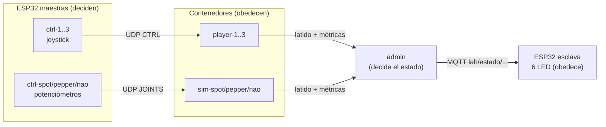
```mermaid
flowchart LR
    subgraph Maestras["ESP32 maestras (deciden)"]
        C1["ctrl-1..3<br/>joystick"]
        CR["ctrl-spot/pepper/nao<br/>potenciómetros"]
    end
    subgraph Contenedores["Contenedores (obedecen)"]
        PL["player-1..3"]
        SR["sim-spot/pepper/nao"]
    end
    ADM["admin<br/>(decide el estado)"]
    ESC["ESP32 esclava<br/>6 LED (obedece)"]
    C1 -- "UDP CTRL" --> PL
    CR -- "UDP JOINTS" --> SR
    PL -- "latido + métricas" --> ADM
    SR -- "latido + métricas" --> ADM
    ADM -- "MQTT lab/estado/..." --> ESC
```

La ventaja es que cada pieza tiene una sola responsabilidad y es fácil saber dónde está un error: si el LED del player-2 se apaga, el problema está entre el player-2 y el admin, no en la esclava.

## Qué es real-to-sim (y sim-to-real)

Son los dos sentidos en que se puede conectar un sistema físico con una simulación:

- **Sim-to-real** (de la simulación a lo real) es el camino más común en robótica: se entrena o se prueba un controlador en simulación y después se pasa al robot físico. Es lo que hacen los repositorios del enunciado: **rex-gym** entrena la caminata del Rex con aprendizaje por refuerzo en PyBullet y **humanoid-gym** la de humanoides; son millones de intentos que en un robot real tardarían años y lo romperían. El problema central es la **brecha de realidad** (*reality gap*): la simulación nunca es exacta (fricción, masas, holguras, retardos de los motores), y lo que funciona perfecto en la simulación puede fallar en el robot.
- **Real-to-sim** (de lo real a la simulación) es el camino de esta práctica: lo que pasa en el mundo real se copia en la simulación en tiempo real. Lo "real" son las articulaciones que el usuario mueve con la mano (potenciómetros o un joystick en el ESP32 de cada robot); el ESP32 las pasa a grados y las manda por UDP a su contenedor, que las convierte en objetivos de las articulaciones del modelo. Es la base de un **gemelo digital** (como el del tema 10) y de la teleoperación: un operador mueve un "maestro" y el robot copia.

Lo que medimos es justamente esa brecha: el **error real-to-sim**, cuánto se separa el ángulo que tiene la simulación del que pidió la articulación real (por inercia, torque limitado de los motores, gravedad y límites del robot). La ESP32 esclava es un caso pequeño del sentido contrario: el estado del mundo virtual (qué contenedores están vivos) se refleja en algo físico (los LED).

## Qué son WebSocket y gRPC

El enunciado pide que los jugadores hablen con el servidor de la pista por **gRPC o WebSocket**. Las dos opciones dan lo mismo (una conexión permanente por la que cliente y servidor se mandan mensajes en los dos sentidos), pero son muy distintas:

- **WebSocket** empieza como una petición HTTP normal que pide "actualizar" la conexión (*upgrade*). A partir de ahí queda un canal TCP abierto en los dos sentidos por el que cualquiera de los dos manda mensajes cuando quiera. No impone ningún formato: nosotros mandamos JSON (`{"tipo":"control","jugador":1,"dir":-40,...}`). Lo entiende cualquier navegador sin instalar nada.
- **gRPC** es un sistema de llamadas a procedimientos remotos de Google que viaja sobre **HTTP/2** y codifica los mensajes con **Protocol Buffers**, un formato binario. Primero se escribe un contrato en un archivo `.proto` (qué servicios hay, qué campos tiene cada mensaje y de qué tipo) y una herramienta genera el código del cliente y del servidor en cada lenguaje.

| | WebSocket (lo que usamos) | gRPC |
|---|---|---|
| Transporte | TCP, arranca como HTTP/1.1 | HTTP/2 |
| Formato de los mensajes | libre (aquí JSON, texto legible) | protobuf (binario, más compacto) |
| Contrato | por convención (documentado aquí) | obligatorio, archivo `.proto` con tipos |
| Código generado | no hace falta | sí (`grpcio-tools`) |
| Desde un navegador | directo | necesita gRPC-Web y un intermediario |
| Depurar | se lee el JSON tal cual | hay que decodificar el binario |

Elegimos **WebSocket** por razones concretas: el patrón es un canal de ida y vuelta permanente (el servidor empuja el estado a 20 Hz y cada jugador empuja su mando); los mensajes se leen tal cual en los registros y desde cualquier script o navegador; un microcontrolador también podría hablarlo, y gRPC sobre HTTP/2 no es práctico en un ESP32; y el volumen es mínimo (un estado de seis carros pesa unos 1,7 kB, unos 35 kB/s por cliente a 20 Hz), así que la eficiencia binaria de gRPC no cambia nada. Lo que se pierde es que el contrato no lo verifica un compilador: si un cliente manda un campo mal escrito, el servidor lo ignora o lo cuenta como inválido. Para compensarlo, el servidor manda la forma de la pista y sus límites en el primer mensaje y valida y recorta todo lo que recibe. gRPC sería la elección natural si la pista tuviera que servir a otros microservicios.

## La idea general

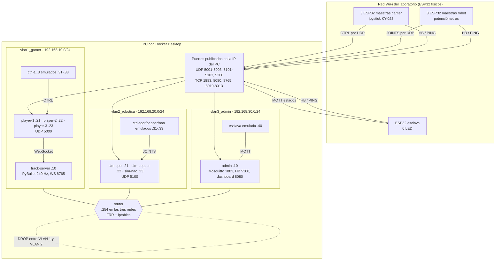
```mermaid
flowchart TB
    subgraph WIFI["Red WiFi del laboratorio (ESP32 físicos)"]
        EG["3 ESP32 maestras gamer<br/>joystick KY-023"]
        ER["3 ESP32 maestras robot<br/>potenciómetros"]
        EE["ESP32 esclava<br/>6 LED"]
    end
    subgraph PC["PC con Docker Desktop"]
        PUB["Puertos publicados en la IP del PC<br/>UDP 5001-5003, 5101-5103, 5300<br/>TCP 1883, 8080, 8765, 8010-8013"]
        subgraph V1["vlan1_gamer · 192.168.10.0/24"]
            TS["track-server .10<br/>PyBullet 240 Hz, WS 8765"]
            PL["player-1 .21 · player-2 .22 · player-3 .23<br/>UDP 5000"]
            EMG["ctrl-1..3 emulados .31-.33"]
        end
        subgraph V2["vlan2_robotica · 192.168.20.0/24"]
            SIM["sim-spot .21 · sim-pepper .22 · sim-nao .23<br/>UDP 5100"]
            EMR["ctrl-spot/pepper/nao emulados .31-.33"]
        end
        subgraph V3["vlan3_admin · 192.168.30.0/24"]
            ADM["admin .10<br/>Mosquitto 1883, HB 5300, dashboard 8080"]
            EME["esclava emulada .40"]
        end
        RT{{"router<br/>.254 en las tres redes<br/>FRR + iptables"}}
    end
    EG -- "CTRL por UDP" --> PUB
    ER -- "JOINTS por UDP" --> PUB
    EG & ER & EE -- "HB / PING" --> PUB
    PUB -- "MQTT estados" --> EE
    PUB --> PL & SIM & ADM
    EMG -- "CTRL" --> PL
    EMR -- "JOINTS" --> SIM
    PL -- "WebSocket" --> TS
    V1 --- RT
    V2 --- RT
    V3 --- RT
    RT -. "DROP entre VLAN 1 y VLAN 2" .- RT
    EME -- "MQTT" --- ADM
```

Cada rol de ESP32 existe en dos versiones intercambiables: la placa física, que entra por WiFi a la IP del PC y Docker la reenvía al contenedor, o el emulador, que corre dentro de la misma VLAN que su contenedor. Se usa una u otra para cada rol, nunca las dos a la vez.

El camino de una orden del joystick hasta el carro, y del estado del carro hasta el LED:

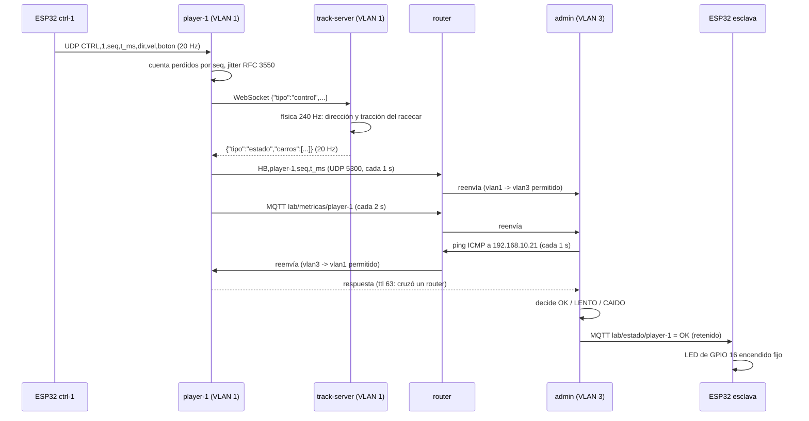
```mermaid
sequenceDiagram
    participant E as ESP32 ctrl-1
    participant P as player-1 (VLAN 1)
    participant T as track-server (VLAN 1)
    participant R as router
    participant A as admin (VLAN 3)
    participant S as ESP32 esclava
    E->>P: UDP CTRL,1,seq,t_ms,dir,vel,boton (20 Hz)
    P->>P: cuenta perdidos por seq, jitter RFC 3550
    P->>T: WebSocket {"tipo":"control",...}
    T->>T: física 240 Hz: dirección y tracción del racecar
    T-->>P: {"tipo":"estado","carros":[...]} (20 Hz)
    P->>R: HB,player-1,seq,t_ms (UDP 5300, cada 1 s)
    R->>A: reenvía (vlan1 -> vlan3 permitido)
    P->>R: MQTT lab/metricas/player-1 (cada 2 s)
    R->>A: reenvía
    A->>R: ping ICMP a 192.168.10.21 (cada 1 s)
    R->>P: reenvía (vlan3 -> vlan1 permitido)
    P-->>A: respuesta (ttl 63: cruzó un router)
    A->>A: decide OK / LENTO / CAIDO
    A->>S: MQTT lab/estado/player-1 = OK (retenido)
    S->>S: LED de GPIO 16 encendido fijo
```

## Las tres redes y el router

| Red (VLAN) | Subred | Router | Contenedores (IP fija) |
|---|---|---|---|
| `vlan1_gamer` (Zona Gamer) | 192.168.10.0/24 | .254 | track-server .10, player-1/2/3 .21-.23, ESP32 emulados ctrl-1..3 .31-.33 |
| `vlan2_robotica` (Zona Robótica) | 192.168.20.0/24 | .254 | sim-spot/pepper/nao .21-.23, ESP32 emulados ctrl-spot/pepper/nao .31-.33 |
| `vlan3_admin` (Plano de Administración) | 192.168.30.0/24 | .254 | admin .10 (MQTT 1883, latidos UDP 5300, dashboard 8080), esclava emulada .40 |

Los contenedores de la VLAN 1 y la VLAN 2 agregan al arrancar la ruta `192.168.30.0/24 via <su .254>` (lo hace `comun/lab.py` con las variables `ROUTER_IP` y `RUTAS` del compose, y por eso necesitan `cap_add: [NET_ADMIN]`). El admin agrega las dos rutas inversas. Nadie tiene ruta de la VLAN 1 a la VLAN 2.

Las redes **no** son `internal`: una red interna no tiene salida al PC y Docker no publicaría los puertos por los que entran los ESP32 físicos. El aislamiento no depende de eso: lo dan los bridges separados y el cortafuegos del router.

**El router** (`router/Dockerfile`, Alpine 3.20, 47,6 MB, sin Python). Al arrancar, `router/arrancar.sh`:

1. **Identifica cada interfaz por su subred**, no por su nombre. En las pruebas el orden cambió: `vlan1=eth1, vlan2=eth2, vlan3=eth0` en una corrida, `eth0/eth1/eth2` en otra y `eth2/eth0/eth1` después de un `docker restart`. Si las reglas dijeran "eth1 = gamer" a ciegas, el aislamiento podría quedar aplicado a la red equivocada.
2. **Reenvía paquetes** con `ip_forward=1`, y `rp_filter=0` para no descartar respuestas que vuelven por otra interfaz que la de la puerta por defecto.
3. **Arranca FRR** (zebra, mgmtd y staticd), que muestra las tres redes conectadas (`C>*`) con `vtysh -c "show ip route"`. FRR 9 pide la capacidad `SYS_ADMIN` (sin ella zebra no arranca: `privs_init: initial cap_set_proc failed`), por eso el compose le da `cap_add: [NET_ADMIN, NET_RAW, SYS_ADMIN]` en vez de `privileged: true`, que daría acceso a todos los dispositivos del PC.
4. **Pone el cortafuegos** en la cadena `FORWARD`:

| # | Regla | Por qué |
|---|---|---|
| — | Política por defecto `DROP` | Lista blanca: lo que no esté permitido abajo no pasa |
| 1 | VLAN 1 → VLAN 2 ⇒ cadena `AISLAR_V1_V2` (LOG limitado + DROP) | El aislamiento entre zonas; la cadena propia cuenta exactamente lo bloqueado |
| 2 | VLAN 2 → VLAN 1 ⇒ `AISLAR_V1_V2` | Lo mismo en el otro sentido. Van antes de la regla 3 para que nada cruce |
| 3 | `ESTABLISHED,RELATED` ⇒ ACCEPT | Las respuestas de conversaciones ya permitidas |
| 4 | VLAN 1 → VLAN 3 ⇒ ACCEPT | Latidos y MQTT de la zona gamer al admin |
| 5 | VLAN 3 → VLAN 1 ⇒ ACCEPT | El admin puede hacer ping a la zona gamer |
| 6 | VLAN 2 → VLAN 3 ⇒ ACCEPT | Latidos y MQTT de la zona robótica al admin |
| 7 | VLAN 3 → VLAN 2 ⇒ ACCEPT | El admin observa la zona robótica |

   Las reglas 4 a 7 exigen la interfaz **y** la subred de origen y destino, para que un contenedor que se ponga una IP falsa no pase. El `LOG` queda puesto, pero Docker Desktop no muestra el registro del núcleo de otros espacios de red; la prueba se apoya en los **contadores**, que siempre funcionan.
5. **Manda su propio latido** (`HB,router,...` al admin cada 1 s, con el `nc` de busybox, `router/latido.sh`).
6. **Healthcheck**: comprueba `ip_forward=1`, que exista la cadena `AISLAR_V1_V2` y que `vtysh` responda.

Comandos útiles con el stack corriendo:

```powershell
docker compose exec router vtysh -c "show ip route"
docker compose exec router iptables -n -v --line-numbers -L FORWARD
docker compose exec router iptables -n -v -L AISLAR_V1_V2     # paquetes VLAN 1 <-> VLAN 2 bloqueados
```

## La Zona Gamer (VLAN 1)

### El servidor de pista (`zona-gamer/servidor-pista/`)

El `track-server` (192.168.10.10) es el mundo compartido de la zona: una pista ovalada en PyBullet sin ventana (modo `DIRECT`), con seis carros:

- **player-1..3**: los manejan los contenedores jugador, que a su vez obedecen a su ESP32.
- **auto-1..3**: autónomos, grises. Siguen la línea central con *pure pursuit* a 1,75, 2,0 y 2,25 m/s, en carriles distintos, así que se alcanzan, se adelantan y esquivan a los jugadores.

Además cuenta vueltas (solo al cruzar la meta hacia adelante y habiendo pasado por la mitad de la pista) y ordena las posiciones; frena el carro de un jugador que lleva 1 s sin mandar control (**failsafe**); si un jugador se desconecta y vuelve, **conserva su carro** con su posición y sus vueltas; un carro volcado (1 s), atascado (2,5 s) o fuera de la pista reaparece en el centro de la pista en el mismo punto del recorrido (el jugador también puede pedirlo manteniendo el botón 1,5 s); y publica su salud al admin.

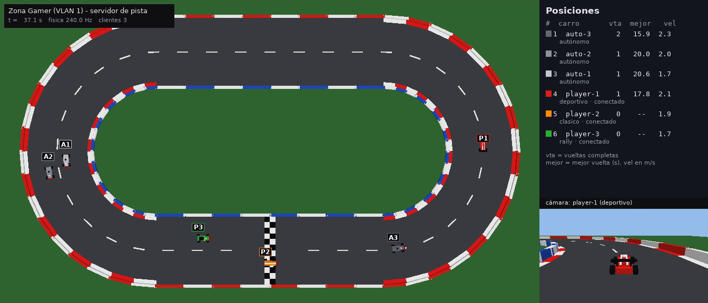

En esa captura (prueba con clientes de prueba, de ahí que el player-2 salga naranja en vez de azul: el cliente pidió ese color) se ven la vista cenital con la etiqueta de cada carro, la tabla de posiciones con vueltas, mejor vuelta y velocidad, y abajo a la derecha la cámara de persecución, que rota entre los seis carros cada 4 s y deja ver el estilo de cada carrocería.

**La pista.** Un "estadio", como un óvalo de NASCAR: dos rectas de 8 m unidas por dos medias circunferencias de 3,5 m de radio (sobre la línea central), 2,4 m de ancho, muros a los dos lados, pianos en las curvas y la meta a cuadros. Se recorre en sentido antihorario y una vuelta mide 38 m. Las medidas salen del carro: el `racecar` mide 0,45 m de largo y 0,29 m de ancho, así que con 2,4 m caben tres lado a lado, y con 3,5 m de radio a 2,5 m/s la aceleración lateral es $v^2/R = 1{,}8$ m/s², muy lejos del límite de agarre: no derrapa. Todo se describe en coordenadas de pista $(s, d)$: $s$ son los metros recorridos desde la meta sobre la línea central y $d$ el desplazamiento lateral. Con eso contar vueltas, ordenar posiciones, el piloto automático y reaparecer un carro son cuentas de una línea.

**Cómo se maneja un racecar en PyBullet.** El URDF tiene 12 juntas; las que importan son:

| Juntas | Qué son | Cómo se controlan |
|---|---|---|
| 2, 3 | ruedas traseras | **tracción**: `VELOCITY_CONTROL` con velocidad objetivo $v/0{,}05$ rad/s y fuerza máxima 6 N·m (velocidad 0 con fuerza = freno) |
| 4, 6 | bisagras de dirección | **dirección**: `POSITION_CONTROL` al ángulo pedido (máximo ±0,5 rad) |
| 5, 7 | ruedas delanteras | libres: se apaga su motor por defecto, si no, frenan |

El mapeo desde el protocolo: `dir` de −100 a 100 (+ = derecha) da un ángulo de $-\text{dir}/100 \cdot 0{,}5$ rad (el signo menos es porque en PyBullet un ángulo positivo gira a la izquierda); `vel` de −100 a 100 da $v = \text{vel}/100 \cdot 2{,}5$ m/s, y el botón apretado multiplica por 1,25 (turbo). Al URDF le hicimos dos cambios sobre una copia: una caja de colisión en el chasis (el original solo tiene colisión en las ruedas y el lidar, y dos carros podían quedar uno dentro del otro) y una versión liviana solo para la cámara, con ~11 000 triángulos menos por carro. El entorno `RacecarBulletEnv-v0` del zoo usa el mismo carro en su versión con diferencial; aquí usamos el `racecar.urdf` simple, más liviano para seis carros a 240 Hz.

**Los autónomos: *pure pursuit*.** Es el seguidor de trayectorias más usado en carros autónomos: se mira un punto de la trayectoria a una distancia $L_d$ por delante y se calcula el arco de circunferencia que lleva desde el eje trasero hasta él. Con $\alpha$ el ángulo de ese punto visto desde el carro y $W_b = 0{,}325$ m la distancia entre ejes:

$$\delta = \arctan\left(\frac{2\, W_b \sin\alpha}{L_d}\right), \qquad L_d = 0{,}6 + 0{,}4\,|v| \ \ (\text{mínimo } 0{,}7 \text{ m})$$

$L_d$ crece con la velocidad: mirar lejos a alta velocidad evita el zigzag y mirar cerca en las curvas las sigue mejor. Para no chocar, si hay otro carro entre 0 y 2 m adelante en su carril, el autónomo pasa por el lado libre (dentro del asfalto), y vuelve a su carril solo cuando está libre desde 0,8 m atrás hasta 2 m adelante.

**Que nada frene a la física.** El servidor tiene tres trabajadores:

| Trabajador | Qué hace | Por qué separado |
|---|---|---|
| hilo de **física** | `stepSimulation` a 240 Hz contra el reloj; cada 4 pasos (60 Hz) lee los mandos y cada 12 (20 Hz) arma el `estado` | un cliente lento o una ráfaga de mensajes no cambia el paso de la física |
| hilo **asyncio** | las conexiones WebSocket, el envío del estado y las métricas | nunca llama a PyBullet: deja los mandos en un diccionario que la física lee |
| **proceso** camarógrafo (`render_pista.py`) | recibe las poses y dibuja con su propia copia de PyBullet | el render por software ocupa decenas de ms por cuadro; en otro proceso usa otro núcleo |

El render con `ER_TINY_RENDERER` (el único que funciona sin pantalla ni tarjeta gráfica) tardaba unos 250 ms por la vista cenital dentro de Docker. Como la pista no se mueve, el fondo se renderiza una vez al arrancar y en cada cuadro solo se renderiza un recorte de 56 × 56 px alrededor de cada carro, con la misma cámara, y se pega sobre el fondo usando la máscara de segmentación. Comprobamos que la imagen es idéntica (diferencia 0) y baja de 250 a 11 ms; el cuadro completo, con el panel y la cámara de persecución, sale en unos 45 ms.

El visor está en `http://localhost:8010/` (puerto 8000 dentro del contenedor), y con la variable `GRABAR_S` el servidor graba un video.

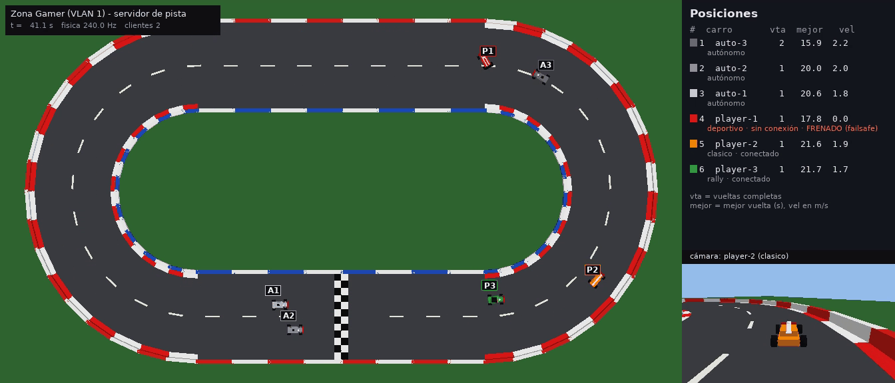

### El protocolo WebSocket (`ws://192.168.10.10:8765`)

Mensajes JSON, uno por mensaje de WebSocket.

| Sentido | Mensaje | Cuándo |
|---|---|---|
| servidor → cliente | `{"tipo":"pista", "linea_central":[[x,y],...], "ancho", "perimetro", "giro_max_rad":0.5, "vel_max_ms":2.5, "dir_positivo":"derecha", ...}` | una vez, apenas se conecta un cliente (152 puntos, cada 0,25 m) |
| servidor → cliente | `{"tipo":"bienvenida", "id", "color", "estilo", "vuelta"}` | respuesta a `hola` (si reconecta, trae la vuelta que llevaba) o a `observador` |
| servidor → todos | `{"tipo":"estado","t":s,"carros":[{"id","x","y","yaw","vel","vuelta","posicion",...}]}` | 20 Hz |
| servidor → cliente | `{"tipo":"pong","t_ms":...}` | respuesta a `ping`, con el mismo `t_ms` |
| cliente → servidor | `{"tipo":"hola","jugador":1,"nombre":"...","color":[r,g,b],"estilo":"..."}` | al conectar: toma el carro `player-N`. Si otro cliente ya lo tenía, gana el último |
| cliente → servidor | `{"tipo":"control","jugador":1,"dir":..,"vel":..,"boton":0,"seq":n,"t_ms":..}` | cada mando (−100 a 100) |
| cliente → servidor | `{"tipo":"ping","t_ms":..}` | cada 1 s, para medir el RTT en el cliente |
| cliente → servidor | `{"tipo":"observador"}` | recibe `pista` y `estado` pero no maneja nada (lo usa el piloto del emulador) |

Los estilos cambian la carrocería: `deportivo` = cabina baja, dos franjas y alerón (player-1, rojo); `clasico` = cabina tipo sedán y una franja blanca (player-2, azul); `rally` = cabina alta, parrilla en el techo y barra de cuatro faros (player-3, verde).

### El contenedor jugador (`zona-gamer/jugador/`)

Cada jugador es un contenedor propio (`player-1..3`, 192.168.10.21 a .23) que hace de puente entre su ESP32 y el servidor de pista. ¿Por qué un contenedor en medio y no la ESP32 hablando directo con el servidor? Porque la ESP32 usa UDP, que es lo más liviano para un microcontrolador (un `snprintf` y un `sendto`, sin conexión ni reintentos), y el servidor prefiere WebSocket. El jugador traduce, le da a cada uno su identidad (nombre, color y estilo) y es el lugar natural para medir la red del ESP32 sin cargar al servidor de física. Si un jugador se cae, solo ese carro frena y solo su LED se apaga.

1. Al arrancar agrega la ruta al admin por el router, empieza a mandar su latido cada 1 s y publica `lab/vivo/player-N = 1`.
2. Escucha UDP 5000. Cada `CTRL` se valida con `comun/protocolo.leer`; si trae otro número de jugador se descarta y se cuenta como "ajeno", para que una ESP32 mal configurada no maneje el carro de otro.
3. Se conecta al servidor por WebSocket y le reenvía cada `CTRL` como `control`. Si el servidor no está, reintenta con espera creciente (1, 2, 4, 8 y 10 s) y mientras tanto sigue midiendo y publicando: **no se cae**.
4. **Failsafe**: si en 1 s no llega ningún `CTRL`, manda `vel 0` (marcado con `"failsafe": true`). Cuando vuelve el `CTRL`, sigue normal.
5. Cada 2 s publica `lab/metricas/player-N` (recibidos, perdidos por número de secuencia, jitter del ESP32, RTT con el servidor, IP de la placa, posición del carro) y escribe en la consola la **última línea cruda recibida**, que es lo más útil cuando "no llega nada". Si en 5 s no llegó nada, imprime una ayuda: la IP del PC en `config.h`, el puerto publicado, el firewall y la red WiFi.

La pérdida se cuenta por número de secuencia: la ESP32 numera cada `CTRL`, y si llega el 7 y después el 10, se perdieron 2. En una prueba sin el stack, el emulador descartó a propósito 102 de 1202 mensajes y el jugador contó exactamente 102 perdidos (8,5 %).

Con el stack completo, el servidor de pista recibe el control de los tres jugadores a 20 Hz con 0 perdidos y el RTT de cada jugador con el servidor es de 1 ms (promedio 0,9 ms), como se ve en el dashboard de "El montaje y la demo".

## La Zona Robótica (VLAN 2)

Una sola imagen para los tres robots (`zona-robotica/`); cuál se simula lo elige la variable `ROBOT=spot|pepper|nao`. Cada contenedor recibe `JOINTS,<robot>,<seq>,<t_ms>,<j1>,<j2>,<j3>,<boton>` por UDP 5100, 20 veces por segundo, recorta los ángulos a los límites del robot (y cuenta los recortes), los sigue con `POSITION_CONTROL` (un controlador PD dentro de PyBullet, con el torque y la velocidad máximos del URDF) y mide el error real-to-sim.

### Los modelos y sus licencias

| Robot | De dónde | Cómo se baja | Licencia |
|---|---|---|---|
| "Pequeño Spot" = **Rex** (SpotMicro) | [rex-gym](https://github.com/nicrusso7/rex-gym): `rex.urdf` y 13 mallas STL (7,5 MB) | `zona-robotica/descargar_modelos.py`, desde el commit fijo `2666304` | URDF: Apache-2.0; mallas: CC BY 3.0, SpotMicro de Deok-yeon Kim (KDY0523) |
| **NAO** y **Pepper** (SoftBank Robotics) | [qiBullet](https://github.com/softbankrobotics-research/qibullet) 1.4.6, el que usa humanoid-gym | `zona-robotica/instalar_mallas_softbank.py` corre el instalador oficial de qiBullet | URDF: Apache-2.0; mallas: licencia de SoftBank y CC BY-NC-ND 4.0 (no comercial, sin modificarlas, sin redistribuirlas) |

Los modelos no se suben al repositorio: se bajan al construir la imagen.

**La licencia de SoftBank.** qiBullet trae las mallas de NAO y Pepper cifradas y un instalador que solo las extrae si quien lo corre acepta la licencia. Decidimos que **por defecto la imagen se construye sin esas mallas** (`ACEPTO_LICENCIA_SOFTBANK=no`): la licencia la tiene que aceptar cada usuario, no nosotros en su nombre. Esa es también la imagen que va a Docker Hub, porque subir las mallas sería redistribuirlas, y la licencia lo prohíbe; `publicar_dockerhub.ps1` fuerza `no` aunque en la consola se haya puesto `si`. Quien quiera verlas con sus mallas, **solo en su PC**, acepta la licencia al construir:

```powershell
$env:ACEPTO_LICENCIA_SOFTBANK = "si"; docker compose build      # PowerShell
ACEPTO_LICENCIA_SOFTBANK=si docker compose build                # bash
```

El texto completo de la licencia queda impreso en el registro de la construcción. Esa imagen no se debe subir a ningún registro. El Rex va siempre completo, porque CC BY 3.0 permite redistribuirlo citando al autor.

Hubo un detalle técnico: el instalador de qiBullet existe solo hasta Python 3.9, y la imagen usa Python 3.11 (la versión con rueda de pybullet 3.2.7). Lo resolvimos con una construcción en dos etapas: una etapa `python:3.9-slim` instala qiBullet y corre el instalador, y la imagen final solo copia los URDF y las mallas ya extraídas. No se descifra nada a mano.

**Sin las mallas, NAO y Pepper se dibujan como un esqueleto.** El proceso que dibuja carga el **mismo URDF** (los mismos links y articulaciones, en el mismo orden) y cambia solo la parte visual: huesos cilíndricos entre una articulación y la siguiente (las medidas salen del propio URDF), torso y pies como cajas, cabeza, hombros, codos y manos como esferas, y la tableta y la base con ruedas de Pepper. El brazo derecho, el que mueven j1 y j2, va en celeste con las articulaciones azules, para que se vea de un vistazo qué copia el real-to-sim. La física y la cinemática son las mismas con o sin mallas: el error medido no depende de cómo se dibuja.

<table>
<tr>
<td>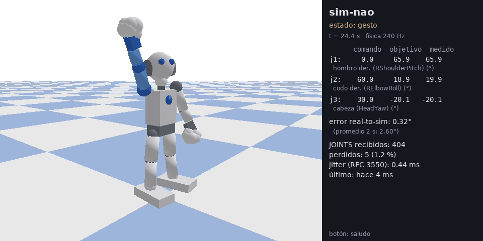</td>
<td>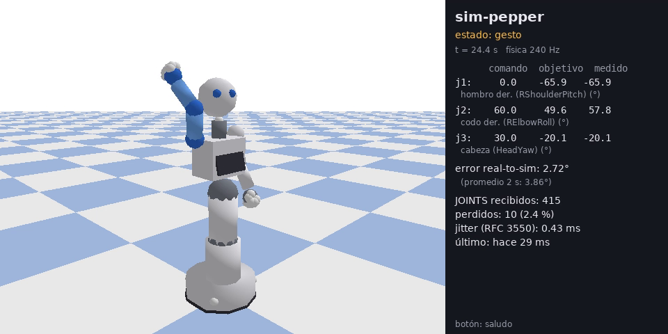</td>
</tr>
<tr>
<td>NAO sin las mallas (la imagen por defecto), en pleno saludo: el panel muestra comando, objetivo y medido de cada articulación, el error real-to-sim y el jitter.</td>
<td>Pepper sin las mallas, también saludando. El codo (j2) todavía va camino al objetivo: por eso el error instantáneo es de 2,7°.</td>
</tr>
<tr>
<td>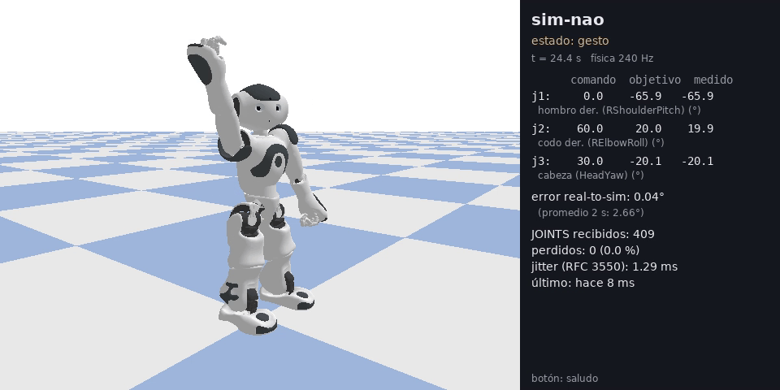</td>
<td>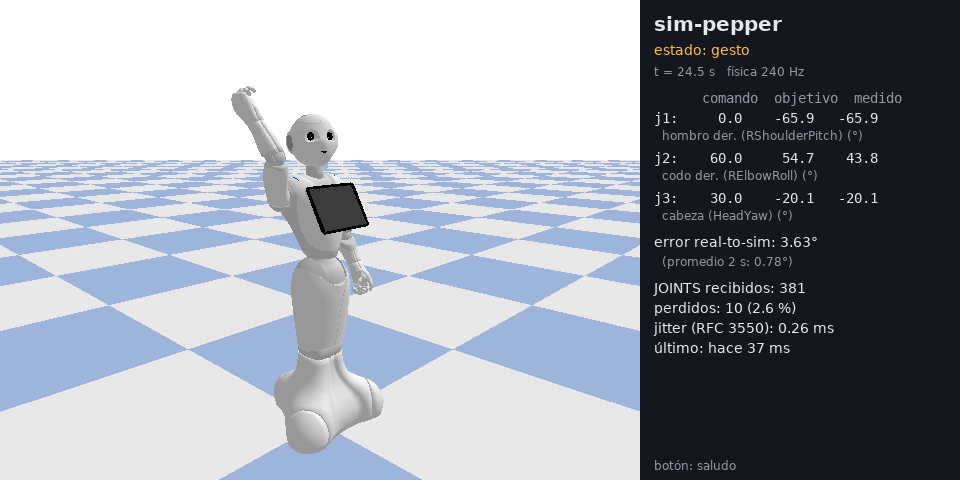</td>
</tr>
<tr>
<td>NAO con sus mallas, construido en local aceptando la licencia.</td>
<td>Pepper con sus mallas, igual.</td>
</tr>
</table>

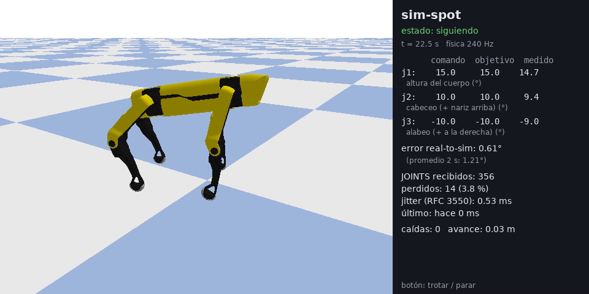

### Qué mueve cada ángulo

| j | NAO y Pepper (articulación del URDF) | Rango del ESP32 | Spot (pose del cuerpo) | Rango del ESP32 |
|---|---|---|---|---|
| j1 | hombro derecho, `RShoulderPitch` (0 = brazo al frente, + baja) | −90 a 90° | altura de las caderas: 190 mm + 1,5 mm por grado | −20 a 20 (160 a 220 mm) |
| j2 | codo derecho, `RElbowRoll` (+ dobla) | 0 a 88° | cabeceo del cuerpo (+ nariz arriba) | −20 a 20° |
| j3 | giro de cabeza, `HeadYaw` | −90 a 90° | alabeo del cuerpo (+ se inclina a la derecha) | −20 a 20° |
| botón | **saludo** de 2,5 s | flanco 0 → 1 | **trotar o parar** | flanco 0 → 1 |

El rango de cada ESP32 está en su `config.h` y coincide con lo que acepta el robot, para que el giro completo del potenciómetro sirva (el codo solo dobla hacia un lado, por eso va de 0 a 88). El robot reacciona al **flanco** del botón, no a cada mensaje con `1`, porque el ESP32 lo repite a 20 Hz mientras está apretado. Si no llega `JOINTS` durante 1 s, el robot vuelve despacio a la pose de reposo y deja de trotar (failsafe).

**Por qué NAO y Pepper van con la base fija.** NAO es un bípedo de 58 cm sin control de equilibrio (el de verdad lo trae el software del robot físico). Suelto, cada movimiento del hombro cambia su centro de masa, se tambalea o se cae, y el error medido sería el de la caída y no el del seguimiento. qiBullet hace lo mismo: al cargar a NAO le pone una restricción fija al torso, y a Pepper, que se mueve con ruedas, otra a la base.

**Por qué en el Spot los tres ángulos mueven la pose del cuerpo.** Tiene 12 motores y solo hay tres potenciómetros; mover un motor suelto de una pata lo desequilibra. Como en el entorno de poses de rex-gym, la altura, el cabeceo y el alabeo pedidos pasan por **cinemática inversa** y las 12 articulaciones se reparten el movimiento con los pies quietos en el piso. La cinemática inversa de rex-gym usa medidas distintas a las de su propio URDF (al pedir +30 mm el cuerpo subía 55 mm), así que la rehicimos con las medidas reales y comprobamos ida y vuelta. El botón lo pone a **trotar** con un generador central de patrones (patas diagonales en fase opuesta); elegimos los parámetros con un barrido de 64 combinaciones, porque las de 2 Hz con zancada larga lo volcaban: quedó en 3 Hz, zancada de 15 mm y alzada de 15 mm.

**El render, en otro proceso.** El render por software cuesta unos 135 ms por cuadro de NAO; en el mismo bucle bajaba la física a 100-160 Hz y atrasaba la lectura del UDP (aparecía un jitter falso de 77 ms). Ahora la física corre sola a 240 Hz, un hilo aparte lee el UDP y anota la hora exacta de llegada, y otro proceso tiene una copia visual del robot a la que se le copian la pose y los ángulos 10 veces por segundo.

### Cómo se mide el error real-to-sim

En cada paso de la física: error = |objetivo − medido| de cada ángulo, y se promedian los tres. En NAO y Pepper el objetivo es el ángulo pedido ya recortado a los límites y lo medido es el ángulo de la articulación. En el Spot el objetivo es la pose pedida y lo medido es la pose de la base como la daría la IMU del robot real, o sea la pose **conseguida** por el cuerpo entero.

Se publica cada 2 s en `lab/metricas/sim-<robot>`: recibidos, perdidos, jitter, `error_realsim_deg`, su máximo y el de cada ángulo, fps de la física, estado (`reposo`, `siguiendo`, `gesto`, `trotando`) y recortes. El visor de cada robot está en `http://localhost:8011/` (Spot), `8012` (Pepper) y `8013` (NAO).

Probamos cada robot por separado con `zona-robotica/probar_joints.py`, que hace de ESP32 con un guion de 40 s (reposo, barrido de cada ángulo, pose quieta, botón y corte para el failsafe) y se salta el 2 % de los mensajes a propósito:

| | NAO | Pepper | Spot |
|---|---|---|---|
| física | 240 Hz | 240 Hz | 240 Hz |
| error en reposo (medio / p95) | 0,006° / 0,006° | 0,002° / 0,002° | 0,08° / 0,10° |
| error con el comando quieto | 0,00° | 0,00° | 0,61° |
| error siguiendo barridos (medio / p95, incluye el retardo de los motores) | 1,19° / 3,2° | 1,34° / 3,5° | 0,35° / 0,65° |
| error en saludo o trote (medio / p95) | 3,5° / 8,1° | 3,7° / 12,3° | 2,1° / 4,5° |
| mensajes saltados a propósito / perdidos contados | 10 / 10 | 15 / 15 | 21 / 21 |
| caídas | — (base fija) | — (base fija) | 0 |
| failsafe | vuelve a reposo, error 0,01° | vuelve a reposo, 0,00° | vuelve a reposo, 0,04° |

En el Spot, 12 s de trote fueron 0,8 m sin caerse, y en una prueba de estrés de 10 ciclos de trotar y parar con alturas extremas no se cayó ninguna vez. Con el stack completo y los ESP32 emulados (senos lentos que recorren casi todo el rango), los tres robots siguieron a 240 Hz con 0 perdidos; en los 5 min del escenario base de las pruebas de red, el error real-to-sim (promedio de cada ventana de 2 s) promedió 1,34° (Spot), 1,76° (Pepper) y 1,66° (NAO) (`pruebas/resultados/red_base.json`). En el instante de la captura del dashboard de "El montaje y la demo" marcaba 0,40°, 0,70° y 0,87°.

## El plano de administración (VLAN 3)

El contenedor `admin` (192.168.30.10) es una imagen `alpine:3.20` de 79,2 MB (`plano-admin/admin/`) con tres cosas, todas instaladas con `apk`:

| Pieza | Puerto | Para qué |
|---|---|---|
| Mosquitto 2.0.18 (broker MQTT) | TCP 1883 | los contenedores publican si están vivos y sus métricas; el admin publica el estado de cada uno; la esclava lo sigue |
| `monitor.py` | UDP 5300 | recibe los latidos `HB` y contesta cada `PING` con un `PONG` |
| el mismo `monitor.py` | TCP 8080 | dashboard web y `/api/resumen.json` |

`arrancar.sh` lanza los dos programas y, si **cualquiera** de los dos muere, termina el contenedor con código 1 para que Docker lo reinicie (`restart: unless-stopped`).

**Qué mide el monitor.** Recibe los latidos de todos (cada contenedor, el router y cada ESP32 manda `HB,<origen>,<seq>,<t_ms>` cada 1 s) y con ellos calcula, por origen, la pérdida por número de secuencia y el jitter RFC 3550. Además hace un `ping` ICMP cada 1 s a cada contenedor de las zonas y al router. Ese ping **sale de la VLAN 3, cruza el router y vuelve**: es la prueba de que el admin observa ambas zonas (si el router o la ruta fallan, el ping falla aunque el contenedor esté sano). Del ping guarda el último RTT, el promedio, el p95, el máximo, el jitter y la disponibilidad, en una ventana de 60 s y desde el arranque. Todo queda también en `resultados/admin_metricas.csv`, una fila por servicio cada 2 s, con la hora local (el compose le pasa `TZ=America/Bogota`).

### Cómo decide OK, LENTO o CAIDO

Cada 0,5 s, para cada uno de los seis servicios con LED (y para el track-server y el router, que solo salen en el dashboard):

- **CAIDO** si el servicio dijo `vivo=0` por MQTT (se despidió o saltó su testamento), **o** si no hay latido fresco (más de 3 s sin `HB`) **y además** el ping falla (2 seguidos sin respuesta, o nunca respondió). Se piden las dos cosas porque cada una sola puede fallar sin que el servicio esté caído.
- **LENTO** si está vivo pero el RTT p95 pasa de 20 ms, el jitter (del ping o de los latidos) pasa de 10 ms, la pérdida del último minuto pasa del 5 %, o responde al ping pero su latido se cortó.
- **OK** en otro caso.

Por qué esos umbrales (se cambian con las variables `HB_TIMEOUT_S`, `UMBRAL_RTT_P95_MS`, `UMBRAL_JITTER_MS` y `UMBRAL_PERDIDA_PCT`):

- **3 s sin latido**: los latidos salen cada 1 s; perder tres seguidos por azar con un 1 % de pérdida pasa una vez en un millón, así que es una caída real, y todavía se ve "en vivo" en el LED.
- **20 ms de RTT p95 y 10 ms de jitter**: el control va a 20 Hz, un paquete cada 50 ms. 10 ms de retardo o de variación son un 20 % de ese período: a partir de ahí el control se nota tarde o a tirones. Entre contenedores del mismo PC, aun cruzando el router, el RTT es de décimas de milisegundo, así que pasar de 20 ms significa algo saturado.
- **5 % de pérdida**: en una red local sana es 0 %. Se mide en una ventana de 60 s para que un corte viejo no deje el servicio en LENTO para siempre, y solo cuando la ventana ya tiene 20 muestras o más.

**Una lección de la prueba de disponibilidad.** La primera vez que detuvimos un contenedor y lo volvimos a arrancar, el admin lo marcó CAIDO enseguida, pero al volver tardó **57 s** en pasar a OK: los pings que fallaron durante la caída seguían en la ventana de 60 s, la pérdida pasaba del 5 % y lo dejaba en LENTO, aunque ya respondía perfecto. Esos fallos eran la propia caída, que ya se había informado como CAIDO. Lo corregimos en `monitor.py`: cuando un servicio pasa de CAIDO a otro estado, se olvidan los pings fallidos y se reinicia la ventana de pérdida de sus latidos (la disponibilidad total desde el arranque sí los conserva). Con eso la vuelta a OK bajó a 1 s.

**Al arrancar el stack.** Todos empiezan en `?`. Un servicio cuyo contenedor todavía no existe pasa a CAIDO ("nunca mandó latido y no responde al ping"), y cuando aparece, la misma corrección olvida los pings fallidos, así que pasa directo a OK. Quedaba un caso: un ping que fallara justo después (por ejemplo, porque el contenedor todavía no había agregado su ruta hacia el router). Con pocas muestras en la ventana, un solo fallo ya pasaba del 5 % (1 de 10 es 10 %) y lo dejaba unos 20 s en LENTO. Por eso la pérdida solo se juzga con al menos 20 muestras en la ventana (`MIN_MUESTRAS_PERDIDA`): con 20, un fallo es justo 5 % y no alcanza; dos fallos, 10 %, sí.

**Si se cae el router.** El admin queda ciego: no le llegan los latidos ni le responden los pings de ninguna zona, así que marca los ocho servicios CAIDO y la esclava apaga los seis LED, aunque las zonas sigan simulando por dentro (cada una sigue funcionando aislada). Lo probamos deteniendo el router 10 s: todo pasó a CAIDO y, 5 s después de arrancarlo, los ocho estaban otra vez en OK. Para que el salto de secuencia de los latidos (que siguieron saliendo durante el corte y se perdieron) no cuente como pérdida al volver, la ventana de pérdida se reinicia con el primer latido que llega después de la caída.

### El dashboard

`http://localhost:8080`: las tres VLAN con cada contenedor, su estado y por qué, el RTT, p95, jitter y disponibilidad del ping, la edad, el jitter y la pérdida de los latidos, una mini gráfica del RTT de los últimos 60 s, las métricas que publica cada contenedor, los seis "LED" como en la ESP32 esclava y la tabla de los ESP32 que mandan latidos, con su IP. No usa librerías: pide `/api/resumen.json` cada segundo. La captura con el stack completo está en "El montaje y la demo".

Antes de integrar probamos el admin solo, con `plano-admin/admin/probar_admin.py` haciendo de todos los demás desde Windows, para ver los tres estados a la vez:

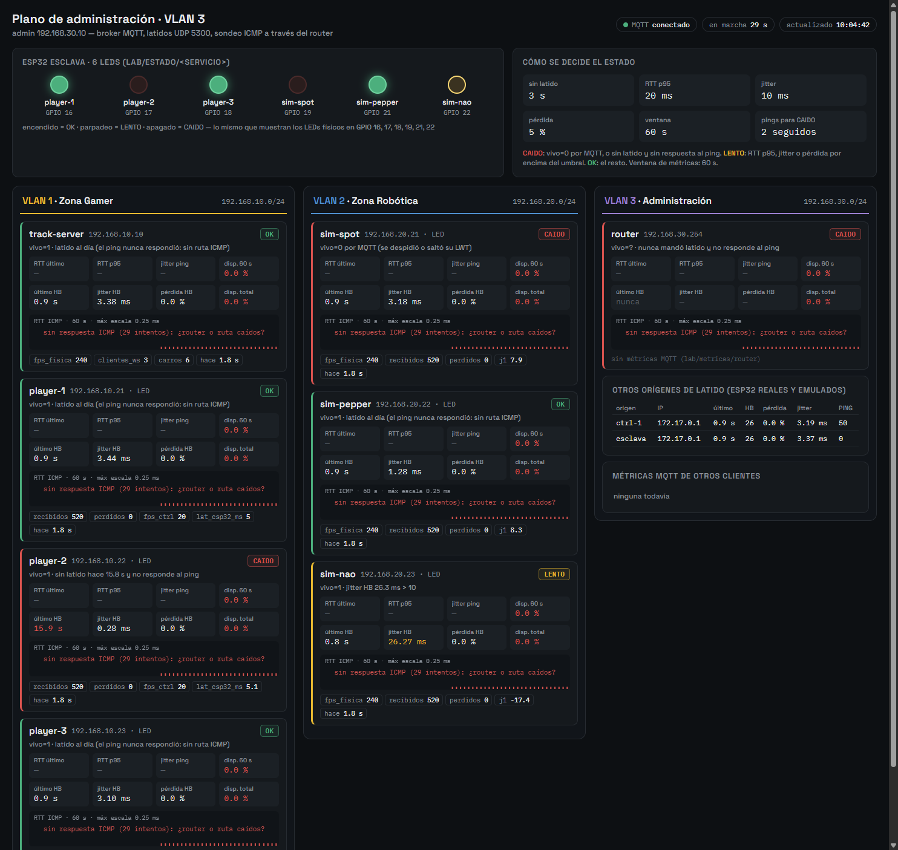

En esa captura el player-2 está CAIDO (sin latido), el sim-spot CAIDO (`vivo=0`), el sim-nao LENTO (se le metió un retardo aleatorio de 0 a 120 ms en cada latido y el jitter pasó de 10 ms) y el resto OK; los pings a las zonas no responden porque en esa prueba no había router. En la prueba aislada, 50 de 50 `PING` recibieron su `PONG`, el player-2 pasó a CAIDO 2,68 s después de dejar de latir, el sim-nao a LENTO a los 2,99 s y el sim-spot a CAIDO 0,51 s después de publicar `vivo=0`.

## El protocolo

Todos los mensajes por UDP son texto ASCII, una línea por datagrama. `comun/protocolo.py` los arma y los lee (y el firmware los arma idénticos).

| Mensaje | Por dónde | Quién → a quién | Cuándo |
|---|---|---|---|
| `CTRL,<id 1-3>,<seq>,<t_ms>,<dir>,<vel>,<boton>` | UDP 5000 del jugador (5001-5003 en el PC) | ESP32 gamer → player-N | 20 Hz |
| `JOINTS,<spot\|pepper\|nao>,<seq>,<t_ms>,<j1>,<j2>,<j3>,<boton>` | UDP 5100 del robot (5101-5103 en el PC) | ESP32 robot → sim-robot | 20 Hz |
| `HB,<origen>,<seq>,<t_ms>` | UDP 5300 del admin | todos → admin | cada 1 s |
| `PING,<origen>,<seq>,<t_ms>` / `PONG,...` | UDP 5300 del admin | ESP32 → admin, y el eco de vuelta | cada 2 s; el ESP32 mide el RTT con su reloj |
| `hola`, `control`, `ping`, `observador` / `pista`, `bienvenida`, `estado`, `pong` | WebSocket JSON, TCP 8765 | player ↔ track-server | ver "El protocolo WebSocket" |
| `lab/vivo/+`, `lab/metricas/+`, `lab/estado/+`, `lab/admin/resumen` | MQTT, TCP 1883 | contenedores y admin → broker → esclava | ver "Qué es MQTT" |
| `ENVIADO,<datagrama>`, `RTT,<ms>`, `ESTADO,<rol>,<ip>,<rssi>,<wifi>` | serie USB, 115200 | maestra → PC | 5 Hz, con cada PONG, cada 2 s |
| `MANUAL,<a>,<b>,<c>,<boton>` / `MANUAL,OFF` | serie USB | PC (`preview.html`) → maestra | reemplaza el ADC durante 2 s |
| `LEDS,<p1>,<p2>,<p3>,<spot>,<pepper>,<nao>`, `ESTADO,esclava,<ip>,<rssi>,<mqtt>` | serie USB | esclava → PC | al cambiar algo y cada 2 s |

`dir`, `vel` y las entradas de `MANUAL` van de −100 a 100; `j1` a `j3` van en grados, ya mapeados por el ESP32. `seq` sube en cada envío, y con él el receptor cuenta los perdidos; `t_ms` es el reloj del emisor (`millis()`), que sirve para el jitter sin sincronizar relojes. Por ejemplo:

```
CTRL,1,937,46856,-40,60,0
JOINTS,nao,404,20211,0.0,60.0,30.0,1
HB,player-1,128,2795495
```

## El firmware

### Conexiones

El montaje completo lleva **siete ESP32**: seis maestras (tres mandos de carros y tres de robots) y una esclava con seis LED. Ninguna placa se conecta a otra: todas entran por WiFi a la red del PC y hablan con Docker por los puertos publicados. El enunciado no fija qué sensor usa cada mando; elegimos joystick para los carros (dos ejes: girar y acelerar) y potenciómetros para los robots (cada perilla es un ángulo, lo más parecido a "mover la articulación real" del real-to-sim). Todo es hardware que ya teníamos en el laboratorio.

| Placa | `ROL` en `config.h` | Manda | A (UDP en el PC) | Origen en HB y PING | IP fija sugerida (red 192.168.1.0/24) |
|---|---|---|---|---|---|
| Maestra 1 | `CTRL_1` | `CTRL,1,...` | 5001 → player-1 | `ctrl-1` | 192.168.1.201 |
| Maestra 2 | `CTRL_2` | `CTRL,2,...` | 5002 → player-2 | `ctrl-2` | 192.168.1.202 |
| Maestra 3 | `CTRL_3` | `CTRL,3,...` | 5003 → player-3 | `ctrl-3` | 192.168.1.203 |
| Maestra Spot | `CTRL_SPOT` | `JOINTS,spot,...` | 5101 → sim-spot | `ctrl-spot` | 192.168.1.211 |
| Maestra Pepper | `CTRL_PEPPER` | `JOINTS,pepper,...` | 5102 → sim-pepper | `ctrl-pepper` | 192.168.1.212 |
| Maestra NAO | `CTRL_NAO` | `JOINTS,nao,...` | 5103 → sim-nao | `ctrl-nao` | 192.168.1.213 |
| Esclava | (sketch aparte) | solo `HB` | MQTT 1883 y HB 5300 → admin | `esclava` | 192.168.1.220 |

**Por qué la IP del PC y no la de los contenedores.** Las tres VLAN existen solo dentro del PC. El ESP32 está en la red WiFi real (la de la casa, el laboratorio o el hotspot del celular), donde el único equipo de "ese mundo" que se ve es el PC. Por eso cada placa manda todo a la IP del PC en un puerto publicado, y Docker reenvía ese puerto al contenedor.

**IP fija** (opcional, `USAR_IP_FIJA 1`). La figura del enunciado marca IP estática en los ESP32 de la zona gamer; el firmware la trae para las siete placas. Funciona igual con DHCP, porque el admin identifica a cada placa por el campo `origen` del mensaje y no por su IP, así que por defecto viene apagada. Si se activa, la IP tiene que estar **en la subred del WiFi real**, la misma del PC (poner la 192.168.10.31 del emulado no sirve: la placa le mandaría todo al router WiFi, que no sabe nada de las redes de Docker), y **fuera del rango que reparte el DHCP del router**, para que ningún otro equipo reciba la misma. Por eso la tabla sugiere .201 a .220.

### Materiales

Por cada maestra de la zona gamer (×3):

| Cantidad | Componente | Para qué |
|---|---|---|
| 1 | ESP32 DevKit de 30 o 38 pines (módulo WROOM-32) | lee el joystick y manda por WiFi |
| 1 | Joystick KY-023 | VRx = dirección, VRy = velocidad, SW = botón (turbo, o reaparecer si se mantiene) |
| 5 | Cables dupont hembra-macho | joystick a la placa |
| 1 | Cable USB de datos | alimentación y monitor serie |

Por cada maestra de la zona robótica (×3):

| Cantidad | Componente | Para qué |
|---|---|---|
| 1 | ESP32 DevKit de 30 o 38 pines | lee las perillas y manda por WiFi |
| 2 o 3 | Potenciómetros lineales de 10 kΩ (B10K) | j1, j2 y (opcional) j3 |
| 1 | Pulsador | saludo en NAO y Pepper, trotar o parar en el Spot |
| 2 o 3 | Condensadores cerámicos de 100 nF (opcionales) | del cursor de cada potenciómetro a GND: bajan el ruido del ADC |
| 1 | Protoboard y cables dupont | |
| 1 | Cable USB de datos | |

La esclava (×1):

| Cantidad | Componente | Para qué |
|---|---|---|
| 1 | ESP32 DevKit de 30 o 38 pines (WROOM-32) | sigue los estados por MQTT |
| 6 | LED de 5 mm rojos, amarillos o verdes (no azules ni blancos) | uno por contenedor |
| 6 | Resistencias de 220 Ω (o 330 Ω) | limitan la corriente de cada LED |
| 1 | Protoboard y cables dupont | |
| 1 | Cable USB de datos | |

Con un joystick también se puede armar una maestra de robot (con `CALIBRAR_CENTRO 1`), y sin nada cableado cualquier placa funciona en `MODO_DEMO`.

### Pines de una maestra

| ESP32 | Gamer (KY-023) | Robot | Por qué este pin |
|---|---|---|---|
| GPIO 34 | VRx (dirección) | cursor del potenciómetro 1 (j1) | ADC1, solo entrada |
| GPIO 35 | VRy (velocidad) | cursor del potenciómetro 2 (j2) | ADC1, solo entrada |
| GPIO 39 (VN) | — | cursor del potenciómetro 3 (j3, opcional) | ADC1, solo entrada |
| GPIO 32 | SW | pulsador (la otra pata a GND) | tiene pull-up interno |
| 3V3 | +5V del módulo (¡a 3,3 V!) | un extremo de cada potenciómetro | ver abajo |
| GND | GND | el otro extremo de cada potenciómetro y el pulsador | |
| GPIO 2 | LED de la placa | LED de la placa | estado del WiFi |

- **ADC1 y no ADC2.** El ESP32 tiene dos convertidores. El ADC2 (GPIO 0, 2, 4, 12 a 15 y 25 a 27) lo usa el driver del WiFi: con el WiFi encendido, `analogRead()` en un pin del ADC2 falla o devuelve basura. Como estas placas viven conectadas al WiFi, las tres entradas analógicas van en el ADC1.
- **GPIO 34, 35 y 39 son solo de entrada** (sin salida ni resistencias internas). Para un potenciómetro es perfecto: no hay forma de configurarlos como salida por error y hacer un corto contra el cursor. El 39 viene rotulado **VN**.
- **GPIO 32 para el botón**, porque el botón necesita pull-up y del 34 al 39 no lo tienen. Con `INPUT_PULLUP` el pin está en 1 suelto y en 0 apretado; el firmware lo invierte y le aplica un antirrebote de 30 ms.
- **El joystick y los potenciómetros se alimentan con 3,3 V, nunca con 5 V.** Aunque el KY-023 diga "+5V", es solo un par de potenciómetros: con 5 V su salida llegaría a 5 V, y los pines del ESP32 no toleran más de 3,6 V.
- **Atenuación de 11 dB**, para medir de 0 a ~3,1 V (con 0 dB solo llegaría a ~1 V).
- **Pines evitados**: GPIO 0, 2, 5, 12 y 15 (de arranque), 6 a 11 (van a la flash) y todo el ADC2.

### Pines de la esclava

| ESP32 | LED (ánodo; cátodo → 220 Ω → GND) | Servicio |
|---|---|---|
| GPIO 16 | LED 1 | player-1 |
| GPIO 17 | LED 2 | player-2 |
| GPIO 18 | LED 3 | player-3 |
| GPIO 19 | LED 4 | sim-spot |
| GPIO 21 | LED 5 | sim-pepper |
| GPIO 22 | LED 6 | sim-nao |
| GPIO 2 | LED de la placa | conectada al broker |
| GND | las seis resistencias | |

Son salidas tranquilas: no son de arranque, no van a la flash y existen en las placas de 30 y de 38 pines. Están seguidas en el mismo costado (el GPIO 20 no existe), así que los seis LED quedan en fila en el mismo orden del dashboard. En las placas con módulo **WROVER** (las que traen PSRAM) los GPIO 16 y 17 están ocupados; ahí se cambian los dos primeros LED a GPIO 25 y 26 en `PINES_LEDS` del `config.h`.

**Cálculo de la resistencia.** Un pin en 1 da unos 3,3 V y un LED rojo, amarillo o verde cae unos 2,0 V:

$$I = \frac{3{,}3\ \text{V} - 2{,}0\ \text{V}}{220\ \Omega} \approx 5{,}9\ \text{mA} \qquad (\text{con } 330\ \Omega: \approx 3{,}9\ \text{mA})$$

Un LED de 5 mm se ve bien desde 2-3 mA, y está lejos de los 20 mA que Espressif recomienda como máximo por pin. Los LED azules y blancos caen ~3,0 V: con 3,3 V les quedan 0,3 V y se verían muy tenues, por eso no los usamos.

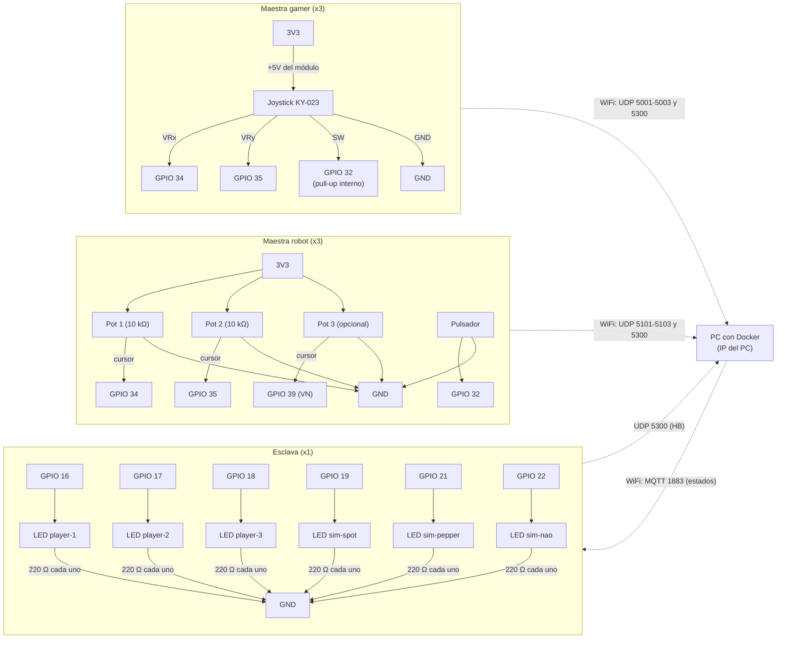
```mermaid
flowchart LR
    subgraph G["Maestra gamer (x3)"]
        J["Joystick KY-023"] -->|"VRx"| G34["GPIO 34"]
        J -->|"VRy"| G35["GPIO 35"]
        J -->|"SW"| G32["GPIO 32<br/>(pull-up interno)"]
        V1["3V3"] -->|"+5V del módulo"| J
        J -->|"GND"| T1["GND"]
    end
    subgraph R["Maestra robot (x3)"]
        P1["Pot 1 (10 kΩ)"] -->|"cursor"| R34["GPIO 34"]
        P2["Pot 2 (10 kΩ)"] -->|"cursor"| R35["GPIO 35"]
        P3["Pot 3 (opcional)"] -->|"cursor"| R39["GPIO 39 (VN)"]
        B["Pulsador"] --> R32["GPIO 32"]
        V2["3V3"] --> P1 & P2 & P3
        P1 & P2 & P3 & B --> T2["GND"]
    end
    subgraph E["Esclava (x1)"]
        E16["GPIO 16"] --> L1["LED player-1"]
        E17["GPIO 17"] --> L2["LED player-2"]
        E18["GPIO 18"] --> L3["LED player-3"]
        E19["GPIO 19"] --> L4["LED sim-spot"]
        E21["GPIO 21"] --> L5["LED sim-pepper"]
        E22["GPIO 22"] --> L6["LED sim-nao"]
        L1 & L2 & L3 & L4 & L5 & L6 -->|"220 Ω cada uno"| T3["GND"]
    end
    G -. "WiFi: UDP 5001-5003 y 5300" .-> PC["PC con Docker<br/>(IP del PC)"]
    R -. "WiFi: UDP 5101-5103 y 5300" .-> PC
    PC -. "WiFi: MQTT 1883 (estados)" .-> E
    E -. "UDP 5300 (HB)" .-> PC
```

### Alimentación

Cada placa se alimenta por su **cable USB** (5 V del PC, de un cargador de celular o de un hub con fuente propia); el regulador de la placa baja a 3,3 V para el chip, el joystick, los potenciómetros y los LED. El consumo es el del ESP32 con WiFi (80-120 mA de media, picos de ~240 mA al transmitir y hasta 400-500 mA un instante al arrancar el radio) más menos de 40 mA de LED. Si se cuelgan varias placas de un hub USB **sin fuente**, puede que no dé los picos de siete ESP32 a la vez y alguna se reinicie al conectarse al WiFi (el monitor serie muestra "Brownout detector was triggered"): se arregla con un hub con fuente o repartiendo las placas. No hace falta tierra común entre placas: solo se hablan por WiFi.

### Antes de encender

1. Joystick y potenciómetros a **3V3**, no a 5V ni a VIN (medir 3,3 V entre su + y GND).
2. Con el multímetro en continuidad, que ningún cursor de potenciómetro esté en corto con 3V3 o con GND en ninguna posición (pasa si se invierte el orden de las patas: el cursor es la del medio).
3. LED con la pata larga (ánodo) hacia el GPIO y la resistencia del lado de GND.
4. Editar `WIFI_SSID`, `WIFI_CLAVE` e `IP_PC_0..3` en los dos `config.h` **antes** de subir.
5. El firewall de Windows tiene que dejar entrar UDP 5001-5003, 5101-5103 y 5300 y TCP 1883 (ver "Cómo probarlo").

### La maestra por dentro (`firmware/esp32_maestra/`)

El mismo sketch va en las seis maestras; lo que cambia es `ROL`, y de él salen en `config.h` el tipo de mensaje, el número de jugador o el nombre del robot, el origen y el puerto de destino. Todo es **no bloqueante**:

```cpp
void loop() {
  gestionarWifi();            // detecta caídas; si lleva 5 s sin red, vuelve a llamar a begin()
  atenderSerie();             // MANUAL,a,b,c,boton / MANUAL,OFF
  atenderUdp();               // PONG propio -> RTT,<ms> por serie
  cada 5 ms:    muestrear();  // ADC a 200 Hz + filtro exponencial
  leerBoton();                // antirrebote de 30 ms
  cada 50 ms:   CTRL o JOINTS al puerto del contenedor (20 Hz); ENVIADO por serie 1 de cada 4
  cada 1 s:     HB al admin
  cada 2 s:     PING al admin; ESTADO por serie
  actualizarLed();
}
```

- **Lectura y filtro.** El ADC se lee a 200 Hz con un filtro exponencial ($y \leftarrow y + 0{,}25\,(x - y)$, unos 17 ms de constante de tiempo): el ADC del ESP32 salta 10 a 20 cuentas con el joystick quieto y sin filtro el carro "tiembla". Se manda a 20 Hz, así que entre envío y envío el filtro promedia unas cuatro lecturas sin agregar un retraso que se note.
- **Calibración del centro** (solo con joystick). Al encender promedia 64 lecturas de cada eje con el joystick suelto: el centro casi nunca cae en 2048 (suele quedar entre 1750 y 1950), y cada mitad del recorrido se escala por separado para que los dos topes den ±100.
- **Zona muerta** del 8 % alrededor del centro: un joystick nunca vuelve exacto al centro, y sin esto el carro se arrastraría solo.
- **Mapeo.** Gamer: eje A = `dir`, eje B = `vel`. Robot: cada entrada se lleva lineal al rango en grados de `config.h` (−20 a 20 en el Spot; −90 a 90, 0 a 88 y −90 a 90 en NAO y Pepper).
- **`seq` sube aunque no haya WiFi**: los que no salieron, el receptor los cuenta como perdidos, que es lo honesto (el mando no llegó).
- **Un solo socket UDP** (puerto local 5400) para mandar todo y recibir el `PONG`: el admin contesta a la dirección y al puerto de origen del `PING`. El RTT es `millis()` menos el `t_ms` que vuelve, así que usa un solo reloj.
- **Períodos contra un reloj fijo** (`t += período`, no `t = ahora`): una vuelta lenta no corre todos los envíos siguientes y el mando no agrega un jitter propio que el admin confundiría con el de la red.
- **WiFi sin ahorro de energía** (`WiFi.setSleep(false)`): con el radio dormido cada paquete puede esperar hasta ~100 ms, y el RTT medido sería el del ahorro de energía, no el de la red.
- **LED de la placa**: parpadeo rápido (5 Hz) = sin WiFi; lento (1 Hz) = con WiFi pero el admin no contesta los `PING` desde hace 5 s (Docker apagado, IP del PC mal o firewall); fijo = todo bien. Así se sabe en qué paso está el problema sin abrir el monitor serie.

### La esclava por dentro (`firmware/esp32_esclava_leds/`)

| LED | Significa |
|---|---|
| encendido fijo | OK |
| parpadeo a 2 Hz | LENTO |
| apagado | CAIDO |
| destello corto cada segundo | `?`: todavía no llegó el estado de ese servicio |
| una luz que recorre los seis de un lado a otro | **sin broker hace más de 5 s** |
| LED de la placa fijo / 1 Hz / 5 Hz | conectada al broker / WiFi sin broker / sin WiFi |

**Por qué un patrón en movimiento sin broker.** Ninguna combinación de estados produce una luz que se desplaza, así que nadie confunde "no sé nada" con "todo caído" (todo apagado) o con "todo bien" (todo prendido). El error peligroso de un panel de monitoreo es mostrar como vigente un estado viejo. Los primeros 5 s sin broker se sigue mostrando lo último, para que un corte cortito del WiFi no borre el panel; al volver el broker, los mensajes retenidos reponen el estado real al instante.

La esclava usa PubSubClient con el client id `esclava-esp32` (distinto del de la emulada), keepalive de 5 s, testamento `lab/vivo/esclava = 0`, una suscripción por servicio y su propio latido. Al encender prende cada LED 150 ms en orden: si uno no prende o el orden no es el del dashboard, está mal conectado.

### Compilar y subir

Con `arduino-cli`, desde PowerShell:

```powershell
cd firmware
.\compilar.ps1                                                    # los seis roles de la maestra y la esclava
.\compilar.ps1 -Demo                                              # maestras en MODO_DEMO
.\compilar.ps1 -Roles CTRL_SPOT -SinEsclava -Puerto COM5 -Subir   # compila y sube la maestra del Spot
.\compilar.ps1 -SoloEsclava -Puerto COM6 -Subir                   # compila y sube la esclava
```

El script instala **PubSubClient** si falta, pasa el rol al compilador con `-DROL=CTRL_x` (así el mismo sketch sirve para las seis placas sin editar `config.h`) y deja los binarios en `firmware/build/`. Con el Arduino IDE: placa **"ESP32 Dev Module"** (núcleo esp32 de Espressif 3.x), instalar **PubSubClient** (de Nick O'Leary) desde el gestor de librerías, abrir `esp32_maestra.ino`, cambiar `ROL` en `config.h`, subir y repetir con cada placa. Monitor serie a 115200.

Cada maestra ocupa el 68 % de la flash (903 KB) y la esclava el 69 % (907 KB), con un 14 % de RAM; casi todo es la pila de WiFi del núcleo. Compilan sin advertencias.

**El formato, comprobado sin placas.** `firmware/prueba_formato/` compila en el PC (con el `cl.exe` de Visual Studio) el mismo `logica.h` que va al ESP32 y compara cada línea con `comun/protocolo.py`: 81 casos de `CTRL`, 1809 de `JOINTS`, `HB`, `PING`, la zona muerta y los lectores de `MANUAL` y `PONG`. Todas salen idénticas carácter por carácter.

```powershell
entorno\Scripts\python.exe firmware\prueba_formato\prueba_formato.py
```

## El emulador de ESP32 (`emulador/emulador_esp32.py`)

Reemplaza a las placas que falten. Manda **exactamente** los mismos mensajes que el firmware (`CTRL`, `JOINTS`, `HB`, `PING`) y escribe por la consola las mismas líneas que la ESP32 por su puerto serie (`ENVIADO`, `RTT`, `ESTADO`, y `LEDS` en la esclava). Las líneas que empiezan con `#` son comentarios del emulador.

| Argumento | Qué hace |
|---|---|
| `--rol` | una o varias placas: `ctrl-1..3`, `ctrl-spot`, `ctrl-pepper`, `ctrl-nao`, `esclava` |
| `--destino` | `ip:puerto` a donde van `CTRL`/`JOINTS`. Solo `ip` = el puerto publicado de ese rol en el PC (5001-5003, 5101-5103) |
| `--admin` | IP del admin: latidos y `PING` a su UDP 5300; para la esclava, también el broker |
| `--hz` | frecuencia de `CTRL`/`JOINTS` (20, como el firmware) |
| `--perdida` | porcentaje de mensajes que **no** se mandan (el `seq` avanza igual: el receptor lo ve como pérdida real) |
| `--piloto`, `--pista` | ctrl-N: maneja solo, mirando la pista por el WebSocket del servidor |
| `--duracion`, `--semilla`, `--resumen` | duración, semilla de la pérdida, resumen en JSON al terminar |

- **ctrl-N sin piloto**: dirección $60 \sin(2\pi \cdot 0{,}1\, t)$ y acelerador entre 40 y 80, con un toque de botón cada 15 s.
- **ctrl-N con `--piloto`** (como en el compose): se conecta al servidor de pista **solo para mirar**, con `{"tipo":"observador"}` (un `hola` metería otro carro en la pista), toma la línea central que manda el servidor y calcula `dir` y `vel` con *pure pursuit*, con un filtro de 0,15 s y un poco de ruido, como un pulgar en el joystick. El control sigue el camino normal: `CTRL` por UDP al jugador, y del jugador al servidor. Es como alguien que maneja mirando la pantalla.
- **ctrl-spot/pepper/nao**: tres senos lentos (0,07 a 0,15 Hz) dentro del rango de cada robot y el botón medio segundo cada 12 s.
- **esclava**: se suscribe a los estados, imprime `LEDS,...` y dibuja la fila de LED en la consola (`●` OK, `◐` LENTO, `○` CAIDO, `·` sin dato).

En el compose cada ESP32 emulado es un contenedor de la imagen `dathinel/zonas-esp32-emulador:1.0` **dentro de la misma VLAN que su contenedor** (192.168.10.31-33, 192.168.20.31-33 y 192.168.30.40), como un ESP32 enchufado al mismo switch; sus latidos al admin cruzan el router. También se puede correr en Windows, contra los puertos publicados:

```powershell
entorno\Scripts\python.exe emulador\emulador_esp32.py --rol ctrl-1 --destino 127.0.0.1:5001
entorno\Scripts\python.exe emulador\emulador_esp32.py --rol ctrl-spot ctrl-pepper ctrl-nao --destino 127.0.0.1 --admin 127.0.0.1
entorno\Scripts\python.exe emulador\emulador_esp32.py --rol esclava --admin 127.0.0.1
entorno\Scripts\python.exe emulador\emulador_esp32.py --rol ctrl-2 --destino 127.0.0.1:5002 --perdida 10 --duracion 60
```

## Qué hace cada archivo

| Archivo | Qué hace |
|---|---|
| `docker-compose.yml` | las tres redes, los 16 servicios con su IP fija, los puertos publicados y el perfil `emulado` |
| `docker-compose.vlan-real.yml` | opcional, no probado: las tres redes como `macvlan` sobre VLAN 802.1Q de verdad |
| `.dockerignore` | deja fuera de las imágenes el firmware, las pruebas, las imágenes, los videos y el entorno |
| `comun/protocolo.py` | armar y leer los mensajes, `ContadorSecuencia` (perdidos por `seq`) y `Jitter` (RFC 3550) |
| `comun/lab.py` | `configurar_rutas()` (ruta al router), `Latido` (HB cada 1 s) y `Metricas` (MQTT con testamento) |
| `router/` | `Dockerfile`, `arrancar.sh` (interfaces, FRR, iptables), `latido.sh` y la configuración de FRR |
| `zona-gamer/servidor-pista/` | `servidor_pista.py` (física, WebSocket, HTTP, métricas), `pista.py` (geometría y carro), `render_pista.py` (proceso que dibuja y graba), `cliente_prueba.py` y su `Dockerfile` |
| `zona-gamer/jugador/` | `jugador.py` (UDP a WebSocket, failsafe, métricas) y su `Dockerfile` |
| `zona-robotica/` | `sim_robot.py` (bucle de física, UDP, métricas, visor), `robots.py` (los tres robots, mapeo, IK del Spot, esqueletos), `descargar_modelos.py`, `instalar_mallas_softbank.py`, `probar_joints.py` y el `Dockerfile` |
| `plano-admin/admin/` | `monitor.py` (latidos, pings, OK/LENTO/CAIDO, dashboard), `dashboard.html`, `mosquitto.conf`, `arrancar.sh`, `probar_admin.py` y el `Dockerfile` |
| `emulador/` | `emulador_esp32.py` (los siete roles) y su `Dockerfile`; `pruebas_locales/servidor_ws_falso.py` para probar sin el servidor real |
| `firmware/esp32_maestra/` | el sketch de las seis maestras: `esp32_maestra.ino`, `config.h` (rol, WiFi, IP del PC, pines, rangos) y `logica.h` (armado de mensajes) |
| `firmware/esp32_esclava_leds/` | el sketch de la esclava y su `config.h` |
| `firmware/compilar.ps1` | compila y sube con arduino-cli |
| `firmware/prueba_formato/` | compara en el PC las líneas del firmware con las de `comun/protocolo.py` |
| `preview.html` | el laboratorio simulado en el navegador, con modo conectado por Web Serial |
| `pruebas/test_protocolo.py` | 40 pruebas unitarias del protocolo |
| `pruebas/prueba_aislamiento.py` | pings, TCP, contadores del router y traceroute entre VLAN, contra el stack real |
| `pruebas/prueba_disponibilidad.py` | detiene y arranca contenedores y mide detección y recuperación |
| `pruebas/medir_red.py` | latencia, jitter y disponibilidad en los escenarios base, retardo y carga |
| `pruebas/grabar_demo.py` | arma el video de la demo con los visores de los contenedores y los estados por MQTT |
| `pruebas/lab_pruebas.py` | piezas comunes de las pruebas: encuentra los contenedores del stack y corre `ping`/`traceroute` dentro de la red de cada uno |
| `pruebas/correr_todo.ps1` | corre todas las pruebas en orden |
| `pruebas/red/` | la prueba de aislamiento del router solo, con contenedores de relleno |
| `pruebas/resultados/` | los json y las gráficas de las pruebas |
| `publicar_dockerhub.ps1` | construye las seis imágenes y las sube a Docker Hub con `1.0` y `latest` |
| `img/`, `video/` | capturas y video de la demo |
| `resultados/` | lo que dejan los contenedores (CSV del admin, videos); no se sube al repositorio |

## Cómo instalar lo necesario

**Docker Desktop** (lo único imprescindible para correr el laboratorio). Los pasos detallados para Windows, macOS y Linux, la virtualización en la BIOS y los problemas típicos de WSL están en el [README del tema 10](../10-enjambre-algoritmo-hormigas/README.md#docker-paso-a-paso); son los mismos aquí. Hace falta que `docker compose version` responda.

**Python** (para las pruebas, el emulador fuera de Docker y la prueba de formato). El tema tiene su propio entorno `entorno/`:

```powershell
python -m venv entorno
entorno\Scripts\python -m pip install paho-mqtt websockets numpy matplotlib pyserial pillow imageio imageio-ffmpeg
```

No hace falta PyBullet en Windows: solo corre dentro de las imágenes, con Python 3.11 en Linux.

**Firmware.** Arduino IDE o `arduino-cli` con el núcleo **esp32 3.x** de Espressif (probado con el 3.3.12) y la librería **PubSubClient** (solo la esclava; `compilar.ps1` la instala si falta).

## Cómo probarlo

**Sin ESP32 conectado**

*Todo el laboratorio en Docker, con los siete ESP32 emulados.* Desde la carpeta del tema:

```powershell
docker compose --profile emulado up -d --build
docker compose ps
```

La primera construcción tarda varios minutos (baja PyBullet y los modelos de los robots). Después se levantan los 16 contenedores. Los robots tardan unos segundos en cargar; luego:

- `http://localhost:8080`: el dashboard del admin, con los seis servicios en OK.
- `http://localhost:8010`: la pista, con los tres jugadores manejados por el piloto de sus emuladores y los tres autónomos.
- `http://localhost:8011`, `8012`, `8013`: el Spot, el Pepper y el NAO siguiendo a sus emuladores.
- `docker compose logs -f esclava-emulada`: las líneas `LEDS,...` y la fila de LED de la esclava.

Para ver una caída: `docker compose stop sim-pepper`. En menos de un segundo el admin lo marca CAIDO y el LED de sim-pepper se apaga, mientras todo lo demás sigue igual. Con `docker compose start sim-pepper` vuelve a OK en un segundo.

*Sin Docker, en el navegador.* `preview.html` se abre con doble clic (Chrome o Edge) y simula todo el laboratorio: las tres VLAN con el router y sus contadores, la pista con un joystick virtual, los tres robots con sus deslizadores, el admin con las reglas OK/LENTO/CAIDO y los seis LED de la esclava. Para probar:

1. Mover el joystick virtual (o flechas/WASD y espacio) y ver cómo responde el carro elegido; los `CTRL` aparecen en el monitor de mensajes.
2. En la zona robótica, elegir un robot, mover j1 a j3 y apretar el botón (trotar o saludar). Si un deslizador pasa el rango del robot, el número se pone amarillo y el medido se queda en el límite.
3. En "Meter fallas", subir el retardo de una zona a ~120 ms: en unos segundos se marca LENTO y sus LED parpadean. Con pérdida al 100 %, CAIDO.
4. "detener" en la tabla del admin: el LED de ese contenedor se apaga y la zona sigue.
5. "ping de player-1 a sim-nao" (lo descarta el router y sube el contador DROP) y "ping de admin a sim-nao" (responde con `ttl=63`).

Los números de latencia de `preview.html` son de un modelo (la latencia de un bridge de Docker más ruido y lo que se meta con los deslizadores), no medidos: los medidos están en "Pruebas".

**Con ESP32 conectado**

1. **Configurar la placa.** En `firmware/esp32_maestra/config.h` (y en el de la esclava): `WIFI_SSID` y `WIFI_CLAVE` de una red de 2,4 GHz, e `IP_PC_0..3` con la IP del PC en esa red (`ipconfig`, "Dirección IPv4" del adaptador WiFi). El PC y las placas tienen que estar en la misma red.
2. **Compilar y subir** con `firmware\compilar.ps1` (ver "Compilar y subir"), una placa a la vez, con su rol.
3. **Levantar el stack sin el emulado de los roles que tienen placa física.** Nunca deben estar a la vez la placa y el emulado del mismo rol: los dos mandarían `HB,ctrl-1,...` con secuencias distintas y el admin contaría pérdidas que no existen (y el jugador recibiría dos mandos peleándose). Por ejemplo, con las tres placas de los carros físicas y lo demás emulado:

   ```powershell
   docker compose up -d --build                     # router, admin y las dos zonas, sin emulados
   docker compose --profile emulado up -d ctrl-spot ctrl-pepper ctrl-nao esclava-emulada
   ```

   O, con el stack completo ya arriba, `docker compose stop ctrl-1` antes de encender la placa de `ctrl-1`. Si la esclava es física, se detiene `esclava-emulada`.
4. **Abrir el firewall de Windows** para los puertos que reciben a las placas (PowerShell como administrador). Docker Desktop suele pedir permiso la primera vez que publica un puerto; si no:

   ```powershell
   New-NetFirewallRule -DisplayName "Tema 11 ESP32 UDP" -Direction Inbound -Protocol UDP -LocalPort 5001-5003,5101-5103,5300 -Action Allow
   New-NetFirewallRule -DisplayName "Tema 11 MQTT" -Direction Inbound -Protocol TCP -LocalPort 1883 -Action Allow
   ```

   Si la red WiFi quedó marcada como "Pública", Windows bloquea más: conviene cambiarla a "Privada".
5. **Comprobar.** El LED de la maestra debe quedar fijo (WiFi y admin contestando). En el monitor serie a 115200 salen `ENVIADO,...`, `RTT,<ms>` y `ESTADO,...`. En el dashboard, la placa aparece en "otros orígenes de latido" con la IP del WiFi, y `docker compose logs player-1` muestra la última línea cruda recibida. Si la placa tiene WiFi pero el admin no la ve, lo primero que hay que revisar es el firewall y la IP del PC.

Con una sola placa enchufada por USB, `preview.html` en modo conectado (Web Serial) muestra lo que manda: `ENVIADO,CTRL` mueve en la pista el carro de ese jugador, `ENVIADO,JOINTS` mueve el robot y `LEDS` prende los LED de la página igual que los físicos. Con "mandar MANUAL a 5 Hz" la página hace de joystick o de potenciómetros de la placa (`MANUAL,a,b,c,boton`), útil si todavía no hay nada cableado. Sin nada cableado también sirve `MODO_DEMO 1` (`compilar.ps1 -Demo`): la maestra mueve sola sus tres ejes con senos lentos.

## Docker paso a paso

### Construir y levantar

```powershell
docker compose --profile emulado build                 # las seis imágenes (sin mallas de SoftBank); sin el perfil no construye la del emulador
docker compose up -d                                   # router, admin y las dos zonas (para ESP32 físicos)
docker compose --profile emulado up -d --build         # lo mismo + los 7 ESP32 emulados
docker compose ps                                      # estado y healthchecks
docker compose logs -f player-1                        # lo que recibe player-1
docker compose down                                    # apaga todo y borra las tres redes
```

Todas las imágenes se construyen con el contexto en la carpeta del tema, para que cada `Dockerfile` pueda copiar `comun/`. Las de Python parten de `python:3.11-slim` con `--platform=linux/amd64`, porque pybullet 3.2.7 solo tiene rueda para Linux x86_64 (en un Mac con procesador Apple corren emuladas, más lentas); el router y el admin parten de `alpine:3.20`.

**Perfiles.** Los ESP32 emulados están en el perfil `emulado`: `docker compose up` no los levanta (con placas físicas sobrarían) y `--profile emulado` sí. La prueba de carga recrea los emuladores con `EMU_HZ=100` para que manden a 100 Hz en vez de 20.

**Resultados.** La carpeta `resultados/` del tema está montada en los contenedores como `/app/resultados`: ahí quedan el CSV del admin y los videos que se graben con `GRABAR_S`.

### Las imágenes

| Servicio | Imagen | Tamaño | Base |
|---|---|---|---|
| router | `dathinel/zonas-esp32-router:1.0` | 47,6 MB | alpine:3.20 + FRR + iptables |
| admin | `dathinel/zonas-esp32-admin:1.0` | 79,2 MB | alpine:3.20 + Mosquitto + Python |
| track-server | `dathinel/zonas-esp32-servidor-pista:1.0` | 890 MB | python:3.11-slim + pybullet |
| player-1..3 | `dathinel/zonas-esp32-jugador:1.0` | 230 MB | python:3.11-slim |
| sim-spot, sim-pepper, sim-nao | `dathinel/zonas-esp32-robot:1.0` | 898 MB | python:3.11-slim + pybullet + modelos |
| los 7 ESP32 emulados | `dathinel/zonas-esp32-emulador:1.0` | 228 MB | python:3.11-slim |

Los tres jugadores comparten una imagen, igual que los tres robots y los siete emulados: lo que cambia entre ellos son las variables de entorno y los argumentos del compose.

### Docker Hub

Las seis imágenes están publicadas con las etiquetas `1.0` y `latest`:

- [dathinel/zonas-esp32-router](https://hub.docker.com/r/dathinel/zonas-esp32-router)
- [dathinel/zonas-esp32-admin](https://hub.docker.com/r/dathinel/zonas-esp32-admin)
- [dathinel/zonas-esp32-servidor-pista](https://hub.docker.com/r/dathinel/zonas-esp32-servidor-pista)
- [dathinel/zonas-esp32-jugador](https://hub.docker.com/r/dathinel/zonas-esp32-jugador)
- [dathinel/zonas-esp32-robot](https://hub.docker.com/r/dathinel/zonas-esp32-robot) (sin las mallas de SoftBank)
- [dathinel/zonas-esp32-emulador](https://hub.docker.com/r/dathinel/zonas-esp32-emulador)

**Para usarlas sin construir nada**, con este repositorio clonado (el compose y la estructura de redes están aquí):

```powershell
docker compose --profile emulado pull
docker compose --profile emulado up -d
```

**Para publicarlas** (o publicarlas en otra cuenta), primero se inicia sesión una vez con `docker login` y después:

```powershell
powershell -ExecutionPolicy Bypass -File publicar_dockerhub.ps1
$env:DOCKERHUB_USUARIO = "otro_usuario"; powershell -ExecutionPolicy Bypass -File publicar_dockerhub.ps1
```

El script construye las seis imágenes, les pone también la etiqueta `latest` y las sube. No pide ni guarda contraseñas, y fuerza `ACEPTO_LICENCIA_SOFTBANK=no` para que la imagen del robot que se publica nunca lleve las mallas de SoftBank. El compose nombra las imágenes `${DOCKERHUB_USUARIO:-dathinel}/zonas-esp32-<servicio>:1.0`, así que con esa variable (o un archivo `.env`) se usa otra cuenta sin tocar nada.

### La licencia de SoftBank al construir

Por defecto (`ACEPTO_LICENCIA_SOFTBANK=no`) NAO y Pepper se ven como esqueletos. Para verlos con sus mallas en local se acepta la licencia al construir solo la imagen del robot y se recrean los tres robots:

```powershell
$env:ACEPTO_LICENCIA_SOFTBANK = "si"
docker compose build sim-nao
docker compose up -d sim-spot sim-pepper sim-nao
```

Esa imagen local no se debe subir. Si después se quiere publicar, `publicar_dockerhub.ps1` la reconstruye sin las mallas (no usar su opción `-SinConstruir` en ese caso).

### Problemas típicos

- **Un contenedor de prueba suelto desconecta al real.** Si con el stack corriendo se lanza a mano un contenedor de la misma imagen con el mismo nombre de servicio (por ejemplo, `docker run ... -e ROBOT=nao` para probar algo), ese contenedor llega al broker del admin con el mismo `client_id` (`sim-nao`) que el de verdad, el broker desconecta al real, el suelto manda latidos con su nombre y al salir deja `vivo=0`. Nos pasó durante la integración. Para pruebas sueltas con el stack arriba hay que agregar `-e ADMIN_IP=127.0.0.1`, para que no hable con el admin.
- **Las subredes 192.168.10/20/30.0/24 ya existen.** `docker compose up` falla con "Pool overlaps with other one on this address space" si otro proyecto de Docker usa esas subredes (por ejemplo, `pruebas/red/` dejado arriba con `--no-bajar`). Se baja el otro proyecto primero.
- **Los puertos ya están ocupados.** El 1883 lo puede tener un Mosquitto instalado en Windows, y el 8080 otro servidor web: "port is already allocated". Se detiene el otro programa.
- **`/udp` en los puertos.** En el compose, `"5001:5000/udp"`: sin `/udp`, Docker publicaría TCP y los datagramas nunca llegarían.
- **Docker Desktop tiene que estar abierto** ("Engine running"); si no, `docker compose` falla con un error de `dockerDesktopLinuxEngine`.

## El montaje y la demo

**El stack completo, visto desde el plano de administración.** Con los 16 contenedores arriba, el admin ve las dos zonas a través del router: los seis servicios en OK, con un RTT de 0,17 a 0,26 ms (p95 menor a 0,35 ms) y un 100 % de disponibilidad en el último minuto. El track-server simula a 240 Hz con 6 clientes conectados (los tres jugadores y, como 3 observadores, los pilotos de los emuladores), recibe el control de los tres jugadores a 20 Hz y lleva 0 perdidos. A la derecha se ven los latidos de los siete ESP32 emulados, cada uno con su IP dentro de su VLAN.

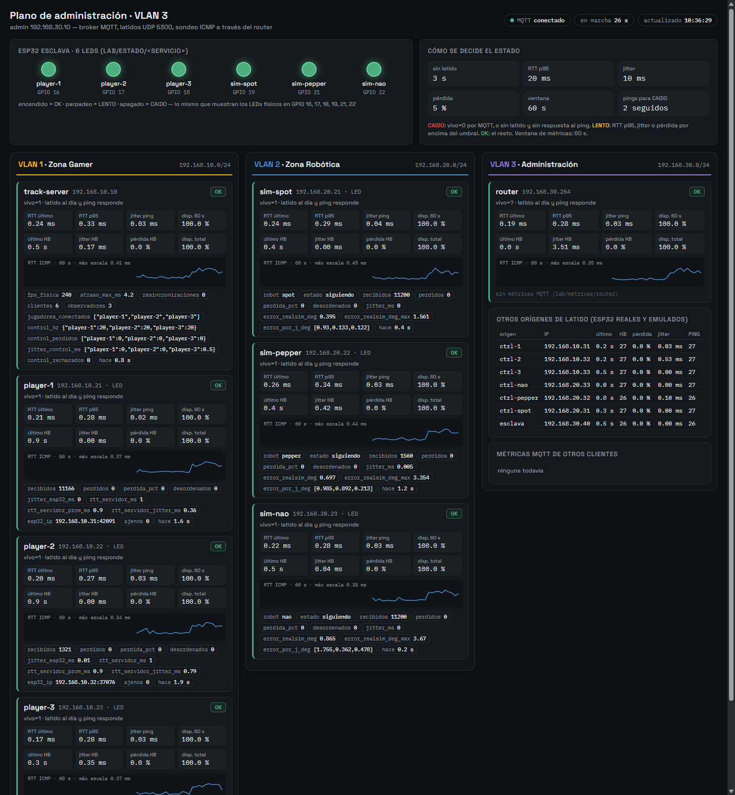

**El video de la demo.** Arriba la pista, abajo los tres robots, y una barra con los seis LED de la esclava y la latencia de cada servicio leídos por MQTT. A mitad del video se detiene `sim-pepper`: el admin lo marca CAIDO, su LED se apaga y las demás zonas siguen; al volver a arrancarlo, regresa a OK. Lo arma `pruebas/grabar_demo.py` con los cuadros que renderizan los propios contenedores, no con una grabación de pantalla.

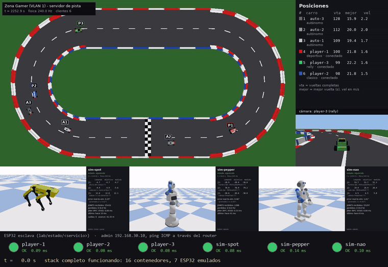

Video completo: [demo-stack.mp4](video/demo-stack.mp4)

**`preview.html`.** El mapa de las tres VLAN con el router y los contadores de sus reglas, la pista con el joystick virtual y los tres robots:

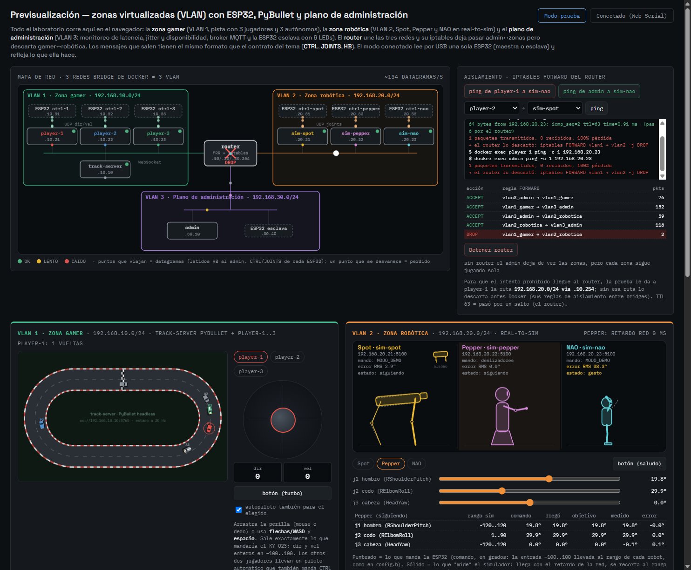

Con la zona gamer degradada (120 ms de retardo, 30 ms de jitter y 15 % de pérdida) y sim-pepper detenido: la zona gamer queda LENTO con sus LED parpadeando y el LED de sim-pepper se apaga.

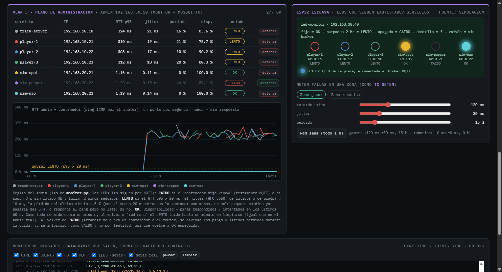

La demostración del aislamiento: el ping de player-1 a sim-nao muere en el router (DROP) y el del admin a sim-nao vuelve con `ttl=63`.

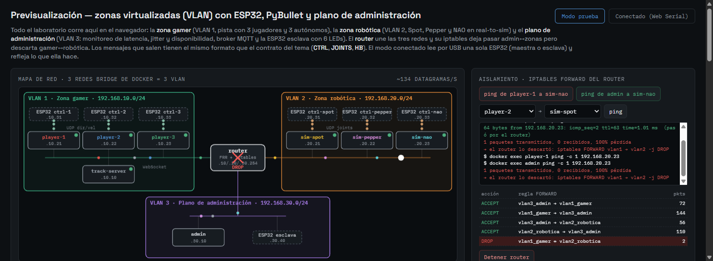

Las fotos y el video del montaje con las siete placas van aquí cuando estén listos (ver "Pendiente").

## Pruebas

Las pruebas de software y de red las corrimos contra el stack completo con los ESP32 emulados (`docker compose --profile emulado up -d`), el 2026-10-05, en Docker Desktop sobre Windows 11, y los números son los que salieron. Las que necesitan las placas quedan como "Pendiente (hardware)". Cuando un resultado viene del emulador lo decimos: el emulador prueba la lógica y la red entre contenedores, no el WiFi.

Todo se corre en orden con `pruebas\correr_todo.ps1`, y cada script deja su json (y sus gráficas) en `pruebas/resultados/`.

### Protocolo

| # | Prueba | Método | Criterio de aceptación | Resultado |
|---|---|---|---|---|
| 1 | Los mensajes `CTRL`, `JOINTS`, `HB`, `PING`/`PONG` se arman y se leen igual, con sus límites | `entorno\Scripts\python -m unittest pruebas.test_protocolo -v` (ida y vuelta, recorte a −100..100, id 1-3, robots válidos, basura, `ContadorSecuencia`, jitter calculado a mano) | Todos los casos pasan; ningún dato basura lanza excepción | **Aprobada.** 40 de 40 casos |

### Objetivo 1: Zona Gamer (VLAN 1)

| # | Prueba | Método | Criterio de aceptación | Resultado |
|---|---|---|---|---|
| 2 | El servidor de pista corre sin pantalla con los 3 carros autónomos | `docker compose logs track-server`; visor en `http://localhost:8010` | Arranca sin errores, simula a 240 Hz y los 3 `auto-*` dan vueltas | **Aprobada.** Física a 240 Hz, atraso máximo del bucle 4,2 ms, 0 resincronizaciones; en la prueba aislada los autónomos dieron 5 a 7 vueltas en 90 s sin ninguna reaparición |
| 3 | Cada player se conecta por WebSocket con su color y estilo | Métricas del track-server y visor | Aparecen `player-1` rojo/deportivo, `player-2` azul/clásico y `player-3` verde/rally | **Aprobada.** El servidor reporta los tres jugadores conectados (6 clientes en total, de los cuales 3 son los pilotos observadores de los emuladores) |
| 4 | El ESP32 (emulado) maneja su carro por UDP | Emuladores `ctrl-1..3` con piloto, mandando `CTRL` a 20 Hz | El carro se mueve según dir/vel; recibidos subiendo y perdidos ≈ 0 | **Aprobada (emulador).** Control a 20 Hz en los tres jugadores, 0 perdidos (player-1: 11 166 recibidos), jitter ESP32 → jugador de 0 a 0,01 ms |
| 5 | Failsafe: sin ESP32 el carro se detiene | Cortar el emulador | En ≤ 1 s el jugador manda vel 0 y el carro frena | **Aprobada, fuera del stack**: el jugador manda vel 0 al pasar 1 s sin `CTRL`, y el servidor marcó el carro como frenado 1,02 a 1,05 s después de cortar el control. En el stack completo no se repitió por separado |
| 6 | Con el ESP32 físico | ESP32 con joystick y la IP del PC en `config.h`, a UDP 5001 | El carro responde al joystick; `RTT,<ms>` por serie | Pendiente (hardware) |

### Objetivo 2: Zona Robótica (VLAN 2)

| # | Prueba | Método | Criterio de aceptación | Resultado |
|---|---|---|---|---|
| 7 | Los 3 robots siguen las articulaciones que llegan por UDP (real-to-sim) | Emuladores `ctrl-spot/pepper/nao` con senos lentos; visores 8011-8013 | Cada robot sigue `JOINTS`; perdidos ≈ 0 | **Aprobada (emulador).** 0 perdidos en los tres y física a 240 Hz; en 5 min, error real-to-sim promedio de 1,34° (Spot), 1,76° (Pepper) y 1,66° (NAO) (`red_base.json`). Por separado, con 2 % de pérdida a propósito, cada robot contó exactamente los mensajes saltados |
| 8 | Un `JOINTS` de otro robot o con basura se ignora | Mandar `JOINTS,atlas,...` y texto cualquiera al puerto 5101 | El contenedor no se cae y no mueve nada | **Cubierta en el código**: `sim_robot.py` cuenta y descarta los `JOINTS` de otro robot (`ajenos`) y las líneas que no se pueden leer (`basura`), y la prueba 1 comprueba que la basura no lanza excepción. No la mandamos a mano al contenedor |
| 9 | Con los potenciómetros físicos | ESP32 maestra con 2-3 potenciómetros, a UDP 5101 | Girar un potenciómetro mueve la articulación correspondiente en el visor | Pendiente (hardware) |

### Objetivo 3: Plano de Administración (VLAN 3)

| # | Prueba | Método | Criterio de aceptación | Resultado |
|---|---|---|---|---|
| 10 | El admin ve los 6 servicios y publica su estado | Dashboard `http://localhost:8080` y `lab/estado/+` | Los 6 en `OK` con el stack sano | **Aprobada.** Los 6 en OK, RTT de 0,17 a 0,26 ms y 100 % de disponibilidad (captura en "El montaje y la demo") |
| 11 | La ESP32 esclava (emulada) sigue los estados | Registro del emulador `esclava` (`LEDS,...`) | La línea `LEDS` coincide con `lab/estado/+` | **Aprobada (emulador).** En el stack, la esclava emulada late sin pérdidas; en la prueba aislada su línea `LEDS` cambió al cambiar `lab/estado/player-2`. En el stack no la comparamos línea por línea |
| 12 | La ESP32 esclava física prende sus 6 LED | Placa con 6 LED en GPIO 16-22 conectada al broker | Encendido = OK, parpadeo = LENTO, apagado = CAIDO; el de la placa encendido = conectada | Pendiente (hardware) |

### Objetivo 4: Router inter-VLAN y aislamiento

`pruebas/prueba_aislamiento.py`, contra el stack real (`pruebas/resultados/aislamiento.json`): **45 de 45 casos aprobados**. Cada intento VLAN 1 ↔ VLAN 2 se hace dos veces: tal como está (el contenedor no tiene ruta, así que lo descarta Docker) y **con una ruta forzada por el router**, como alguien que agrega la ruta a mano: entonces el paquete llega al router y lo que lo detiene es su política `iptables FORWARD`, que es lo que de verdad se quiere probar.

| # | Prueba | Método | Criterio de aceptación | Resultado |
|---|---|---|---|---|
| 13 | La Zona Gamer no alcanza a la Zona Robótica | `ping` desde player-1 a los 3 robots y los 3 ESP32 emulados de la VLAN 2, sin ruta y con ruta forzada por 192.168.10.254 | 0 respuestas en todos los casos | **Aprobada.** 0 respuestas en los 8 casos |
| 14 | La Zona Robótica no alcanza a la Zona Gamer, tampoco por TCP | `ping` sim-spot → track-server y player-1; conexión TCP sim-spot → track-server:8765 con ruta forzada | 0 respuestas y la conexión no se abre | **Aprobada.** 0 respuestas y la conexión TCP no se abrió |
| 15 | Quien bloquea es el router | Contadores de la cadena `AISLAR_V1_V2` antes y después de los intentos con ruta forzada | Suben al menos 9 paquetes | **Aprobada.** De 0 a 12 paquetes descartados; el tráfico permitido no sumó nada |
| 16 | Dentro de una zona sí hay comunicación | Conexión TCP player-1 → track-server:8765 | Conecta | **Aprobada** |
| 17 | El admin alcanza todas las zonas, pasando por el router | `ping` admin → los 7 contenedores de las zonas y los 6 ESP32 emulados | Todos responden con `ttl=63` (64 − 1 salto) | **Aprobada.** Los 13 responden con `ttl=63`, RTT de 0,09 a 0,48 ms |
| 18 | Las zonas alcanzan al admin | `ping` player-1, sim-nao y track-server → 192.168.30.10 | Responden | **Aprobada** (`ttl=63`) |
| 19 | El camino pasa por el router | `traceroute -n` del admin a sim-nao y a player-1 | Salto 1 = 192.168.30.254, salto 2 = el destino | **Aprobada.** `1 192.168.30.254`, `2 192.168.20.23` (y `192.168.10.21`) |

Antes, con el router solo y contenedores de relleno (`pruebas/red/probar_aislamiento.py`), los contadores subieron de 0 a 11, exactamente los 3 + 3 + 5 intentos de esa prueba, y un intento por la `.1` de Docker, sin pasar por el router, tampoco llegó (lo bloquea Docker).

### Objetivo 5: Validación experimental (latencia, jitter, disponibilidad)

`pruebas/medir_red.py` mide por tres caminos: ping ICMP desde el admin a cada servicio cada 0,5 s (cruza el router), la tabla que publica el propio admin en `lab/admin/resumen` (hecha con los latidos UDP) y la fracción del tiempo con `lab/estado/<svc>` = `OK`. El jitter es el del RFC 3550 en los tres. El escenario de retardo mete con `tc netem` en el router 30 ± 10 ms en los dos sentidos, solo al tráfico de la VLAN 2, y deja la VLAN 1 como grupo de control.

| # | Prueba | Método | Criterio de aceptación | Resultado |
|---|---|---|---|---|
| 20 | Latencia y jitter de referencia | `medir_red.py --escenario base --minutos 5` | Registrar promedio, p95, máximo y jitter por servicio; se espera RTT entre VLAN < 5 ms, jitter < 1 ms, pérdida 0 % y disponibilidad 100 % | **Aprobada.** 5 min, ping cada 0,5 s (600 por servicio): RTT promedio de 0,21 a 0,26 ms, p95 de 0,27 a 0,32 ms, máximo 0,53 ms, jitter de 0,02 a 0,06 ms, 0 % de pérdida y los 6 servicios con LED en OK el 100 % del tiempo (`pruebas/resultados/red_base.json`) |
| 21 | Latencia y jitter con retardo artificial en la VLAN 2 | `medir_red.py --escenario retardo --minutos 3` | RTT admin → robots sube unos 60 ms con jitter de varios ms; la VLAN 1 no cambia; el admin no marca CAIDO a los robots | **Aprobada.** Los tres robots subieron a unos 60 ms de RTT promedio (59,97 a 60,71 ms; p95 de 73 a 75 ms; jitter de 7,7 a 10,0 ms): son 30 ms en cada sentido. La VLAN 1 siguió en 0,24 a 0,26 ms. 0 % de pérdida. El admin marcó a los tres robots LENTO durante todo el escenario (RTT p95 > 20 ms), nunca CAIDO, y a la VLAN 1 OK (`red_retardo.json`) |
| 22 | Latencia y jitter con carga | `medir_red.py --escenario carga --minutos 3 --hz-carga 100` (emuladores de 20 a 100 Hz) | La tasa de recepción sube a ≈ 100 Hz; registrar cuánto cambian latencia, jitter y pérdida | **Aprobada.** Con los 6 emuladores a 100 Hz, cada jugador y cada robot recibió 100 mensajes/s con 0 perdidos, y el jitter ESP32 → contenedor promedió entre 0 y 0,37 ms. El RTT del admin no cambió (promedio de 0,20 a 0,24 ms, p95 de 0,25 a 0,30 ms) y los 6 siguieron en OK el 100 % del tiempo (`red_carga.json`) |
| 23 | Detección y recuperación de la caída de un robot | `prueba_disponibilidad.py`: `docker stop sim-pepper`, esperar CAIDO, `docker start` | CAIDO en ≤ 10 s, OK otra vez en ≤ 60 s; los otros 5 siguen en OK y publicando | **Aprobada.** CAIDO publicado 0,50 s después de la orden de detener (el `vivo=0` llegó a los 0,12 s); OK otra vez 1,02 s después del `docker start`; los otros 5 siguieron en OK y publicando métricas |
| 24 | Detección y recuperación de la caída de un jugador | Igual con `player-2` | Igual que la 23 | **Aprobada.** CAIDO a los 0,43 s, OK 1,02 s después del `docker start`; los otros 5 en OK |
| 25 | Las zonas siguen funcionando sin el admin | `docker stop admin` 30 s, revisando `docker inspect`, los registros y los visores; `docker start admin` | Ninguna zona se cae ni se reinicia; al volver el admin, las métricas reaparecen solas y los 6 vuelven a OK en ≤ 60 s | **Aprobada.** Los 7 contenedores de las zonas siguieron corriendo, sin reinicios y con actividad, y los visores respondieron durante los 30 s. Al volver el admin, el broker respondió a los 1,40 s, los 6 estaban en OK a los 2,11 s (por los latidos UDP) y las métricas MQTT de todos reaparecieron entre 5,4 y 7,2 s (cada cliente reintenta la conexión con una espera de hasta 5 s) |
| 26 | Latencia real ESP32 ↔ admin por WiFi | ESP32 maestra mandando `PING` a UDP 5300 y leyendo `RTT,<ms>` por serie | Registrar RTT promedio, p95 y pérdida a 1 m y a 5 m del router WiFi | Pendiente (hardware) |

Así se ven el escenario base y el de retardo (las gráficas las hace `medir_red.py`):

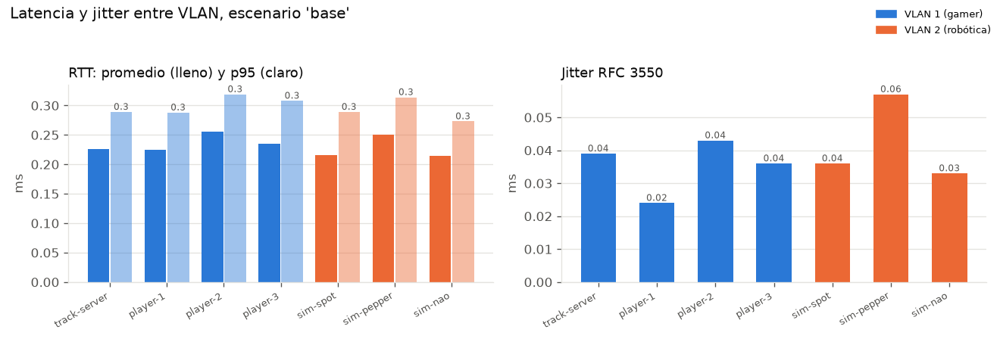

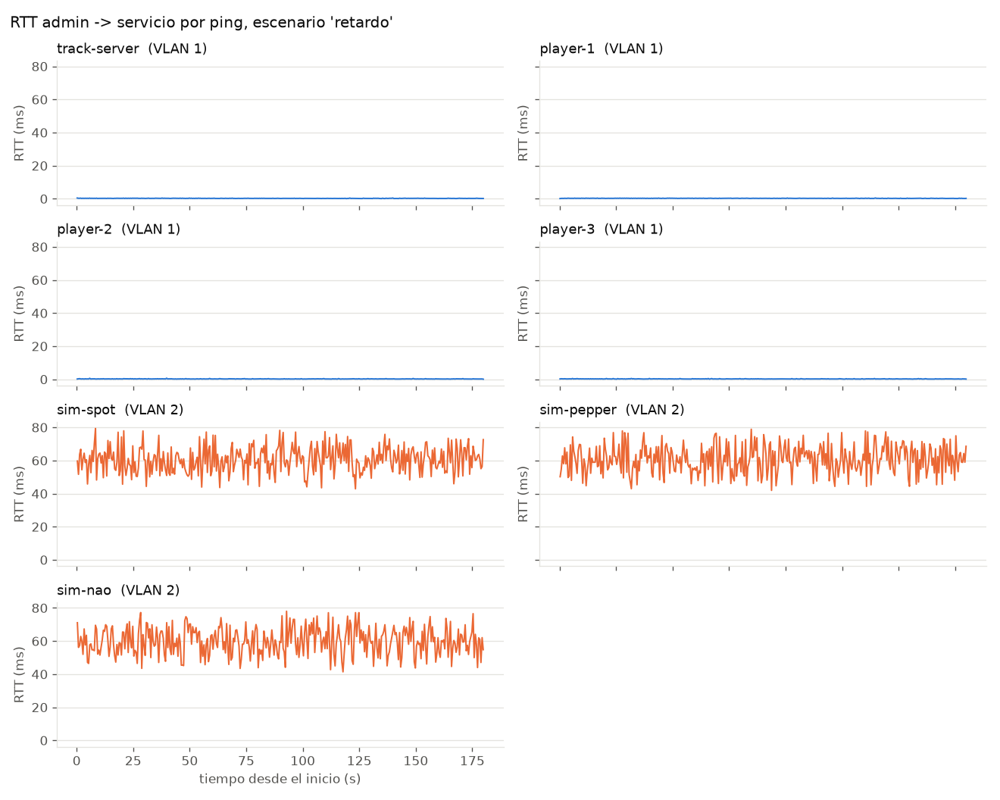

Dos cosas que aprendimos al medir. La primera vez que corrimos los tres escenarios seguidos, la carga dio un 78,6 % de tiempo en OK para los robots: no era la carga, sino que los primeros 38 s todavía tenían en la ventana de 60 s del admin los RTT de 60 ms del escenario de retardo. La repetimos sola, con un minuto de separación, y dio 100 %. Y una de las corridas se arruinó porque un contenedor de prueba suelto, con el mismo nombre que `sim-pepper`, se conectó al broker con el mismo `client_id` y desconectó al real: por eso las pruebas sueltas se corren con `-e ADMIN_IP=127.0.0.1`.

En la prueba 23, la primera vez que la corrimos la vuelta a OK tardó 57 s, por los pings fallidos de la caída que seguían en la ventana de 60 s; es la corrección del monitor que contamos en "El plano de administración". Los números de la tabla son los de después de corregirlo (`pruebas/resultados/disponibilidad.json`).

### Entregables

| # | Prueba | Método | Criterio de aceptación | Resultado |
|---|---|---|---|---|
| 27 | Las imágenes están en Docker Hub y se pueden bajar | `publicar_dockerhub.ps1`; después, `docker compose --profile emulado pull` | Las 6 imágenes `dathinel/zonas-esp32-*:1.0` se bajan y el stack arranca igual | **Aprobada.** `publicar_dockerhub.ps1` subió las 6 imágenes con las etiquetas `1.0` y `latest` (12 en total) a la cuenta `dathinel`, y `docker manifest inspect` las encuentra en Docker Hub. La imagen `robot` publicada trae solo los URDF de NAO y Pepper y el texto de la licencia, sin las mallas de SoftBank (lo comprobamos buscando mallas dentro de la imagen) |

## Pendiente

- El montaje físico de las siete placas: tres maestras con joystick KY-023, tres con potenciómetros y la esclava con seis LED.
- Fotos y video del montaje funcionando con las placas.
- Las pruebas 6, 9, 12 y 26 con los ESP32 físicos por WiFi, comprobando que los datagramas llegan por los puertos publicados del PC y que el firewall de Windows los deja pasar.
- Probar `docker-compose.vlan-real.yml` (VLAN 802.1Q con `macvlan`) en un Linux con un switch administrable.
