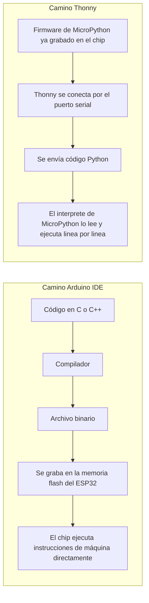

# Lenguajes: por qué Thonny

## Qué es Thonny

Thonny es un entorno de desarrollo pensado originalmente para enseñar Python a gente que nunca había programado antes. Lo creó Aivar Annamaa en la Universidad de Tartu, en Estonia, y salió como versión estable en 2015, después de que su creador pasara varios años dando clases de Python a principiantes y viendo de primera mano en qué se atascaban. Por eso Thonny trae cosas como un depurador visual que muestra paso a paso cómo cambian las variables mientras el programa corre, algo pensado para quien recién está entendiendo cómo funciona el flujo de un programa.

El soporte para MicroPython llegó después, primero como un plugin para la placa BBC micro:bit y luego, ya en la versión 3.0 de Thonny, como soporte general para cualquier placa que corra MicroPython, entre ellas el ESP32, el ESP8266 y la Raspberry Pi Pico. Esto convirtió a Thonny en una puerta de entrada bastante natural para pasar de programar en la computadora a programar microcontroladores, sin cambiar de herramienta ni de lenguaje.

## Cómo se relaciona esto con Arduino y con C++

La diferencia entre usar el Arduino IDE y usar Thonny no es una simple cuestión de gustos, es una diferencia de fondo en cómo el chip termina ejecutando el código.

En el camino de Arduino, el código en C o C++ se compila por completo antes de tocar el chip, se convierte en instrucciones de máquina y ese binario queda grabado en la memoria flash. El ESP32 arranca y ejecuta directamente esas instrucciones, sin ningún interprete de por medio, lo que lo hace muy rápido y muy eficiente en el uso de memoria.

En el camino de Thonny, lo primero que tiene que pasar es que el ESP32 tenga instalado el firmware de MicroPython, que en la práctica es un programa en C compilado que actúa como interprete de Python dentro del chip. Una vez ese firmware está instalado, Thonny se conecta al chip por el mismo puerto serial que usaría el Arduino IDE, pero en lugar de mandar un binario compilado manda el código Python tal cual, línea por línea si se quiere, y ese interprete dentro del chip lo va leyendo y ejecutando al vuelo.

Por eso no tiene sentido preguntarse por qué usar Arduino y no Thonny como si fueran dos programas que compiten por lo mismo, porque en el fondo apuntan a dos formas distintas de trabajar con el mismo chip. El ESP32 solo puede tener un firmware corriendo a la vez, así que instalar MicroPython para usar Thonny reemplaza por completo el firmware que el Arduino IDE necesita para funcionar, y viceversa. La elección real está entre programar con un lenguaje compilado que se convierte en instrucciones nativas, o programar con un lenguaje interpretado que corre dentro de un intérprete ya instalado en el chip.

## Por qué MicroPython y no Python normal

Python normal, el que corre en una computadora, necesita un sistema operativo completo detrás, con varios megabytes de memoria disponibles y un procesador bastante más potente que el de un microcontrolador. El ESP32 tiene apenas algunos cientos de kilobytes de RAM, así que instalar el Python de una computadora tal cual no es una opción.

MicroPython es una reimplementación del lenguaje Python, escrita desde cero por Damien George y publicada por primera vez en 2014, pensada específicamente para correr con esas limitaciones de memoria y sin sistema operativo debajo. Mantiene la mayor parte de la sintaxis y de la forma de escribir código de Python, así que quien ya sabe Python puede empezar a escribir para un microcontrolador casi sin curva de aprendizaje adicional, pero por dentro es un intérprete mucho más liviano, que deja por fuera buena parte de las librerías estándar de Python y las reemplaza por módulos propios pensados para hablar directamente con los pines, los buses de comunicación y los periféricos del chip.

## Por qué MicroPython y no C++

Acá la comparación sí es directa, porque ambos corren en el mismo tipo de hardware.

| Aspecto | C o C++ vía Arduino o ESP-IDF | MicroPython vía Thonny |
|---|---|---|
| Cómo se ejecuta | Se compila a instrucciones de máquina nativas | Se interpreta línea por línea dentro del chip |
| Velocidad de ejecución | Mucho más rápido, ideal para tareas con tiempos críticos | Más lento, suficiente para la mayoría de proyectos de aprendizaje |
| Uso de memoria | Muy eficiente | Consume más RAM porque el propio intérprete ocupa espacio |
| Velocidad para probar cambios | Hay que compilar y grabar todo de nuevo cada vez | Se puede escribir y probar código directamente en el chip en segundos |
| Curva de aprendizaje | Más exigente, hay que manejar punteros, tipos de datos, compilación | Más suave, sintaxis simple y errores más fáciles de entender |
| Caso de uso típico | Proyectos donde el tiempo de respuesta importa mucho, o donde se necesita exprimir al máximo el chip | Aprendizaje, prototipado rápido, proyectos donde la velocidad de desarrollo importa más que la eficiencia bruta |

En resumen, C++ le exige más al chip pero saca más rendimiento de él, mientras que MicroPython le pide al chip que cargue con el peso de un intérprete pero a cambio permite escribir, probar y corregir código muchísimo más rápido, algo especialmente útil al momento de aprender cómo funciona un sensor o un periférico nuevo sin perder tiempo compilando cada intento.
