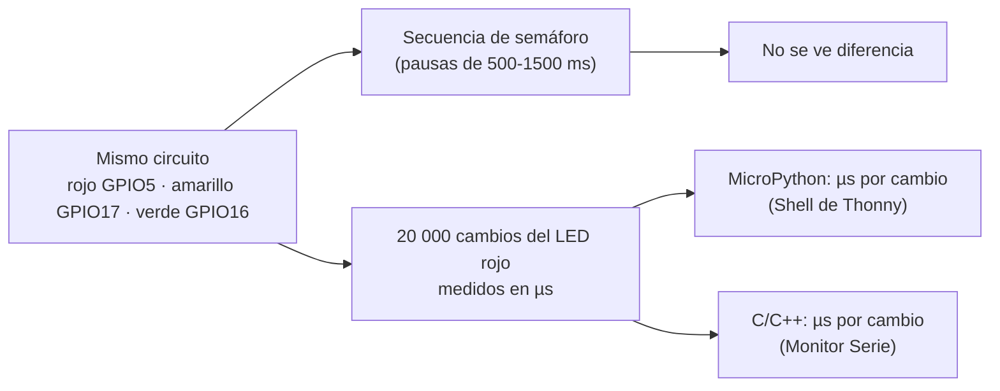

# Lenguajes: por qué Thonny

Basado en [Instalación de Thonny — NODEMCU V3 ESP8266](https://github.com/dialejobv/U_Militar/blob/main/1%29%20Instalaci%C3%B3n%20Thonny/NODEMCU%20V3%20ESP8266.md) (U_Militar, carpeta `1) Instalación Thonny`).

## Qué es Thonny

Thonny es un entorno de desarrollo pensado originalmente para enseñar Python a gente que nunca había programado antes. Lo creó Aivar Annamaa en la Universidad de Tartu, en Estonia, y salió como versión estable en 2015, después de que su creador pasara varios años dando clases de Python a principiantes y viendo de primera mano en qué se atascaban. Por eso Thonny trae cosas como un depurador visual que muestra paso a paso cómo cambian las variables mientras el programa corre, algo pensado para quien recién está entendiendo cómo funciona el flujo de un programa.

El soporte para MicroPython llegó después, primero como un plugin para la placa BBC micro:bit y luego, ya en la versión 3.0 de Thonny, como soporte general para cualquier placa que corra MicroPython, entre ellas el ESP32, el ESP8266 y la Raspberry Pi Pico. Esto convirtió a Thonny en una puerta de entrada bastante natural para pasar de programar en la computadora a programar microcontroladores, sin cambiar de herramienta ni de lenguaje.

## Cómo se relaciona esto con Arduino y con C++

La diferencia entre usar el Arduino IDE y usar Thonny no es una simple cuestión de gustos, es una diferencia de fondo en cómo el chip termina ejecutando el código.


```mermaid
flowchart LR
    subgraph Arduino[Camino Arduino IDE]
        A1[Código en C o C++] --> A2[Compilador]
        A2 --> A3[Archivo binario]
        A3 --> A4[Se graba en la memoria flash del ESP32]
        A4 --> A5[El chip ejecuta instrucciones de máquina directamente]
    end

    subgraph Thonny[Camino Thonny]
        B1[Firmware de MicroPython ya grabado en el chip] --> B2[Thonny se conecta por el puerto serial]
        B2 --> B3[Se envía código Python]
        B3 --> B4[El interprete de MicroPython lo lee y ejecuta linea por linea]
    end
```

En el camino de Arduino, el código en C o C++ se compila por completo antes de tocar el chip, se convierte en instrucciones de máquina y ese binario queda grabado en la memoria flash. El ESP32 arranca y ejecuta directamente esas instrucciones, sin ningún interprete de por medio, lo que lo hace muy rápido y muy eficiente en el uso de memoria.

En el camino de Thonny, lo primero que tiene que pasar es que el ESP32 tenga instalado el firmware de MicroPython, que en la práctica es un programa en C compilado que actúa como interprete de Python dentro del chip. Una vez ese firmware está instalado, Thonny se conecta al chip por el mismo puerto serial que usaría el Arduino IDE, pero en lugar de mandar un binario compilado manda el código Python tal cual, línea por línea si se quiere, y ese interprete dentro del chip lo va leyendo y ejecutando al vuelo.

Por eso no tiene sentido preguntarse por qué usar Arduino y no Thonny como si fueran dos programas que compiten por lo mismo, porque en el fondo apuntan a dos formas distintas de trabajar con el mismo chip. El ESP32 solo puede tener un firmware corriendo a la vez, así que instalar MicroPython para usar Thonny reemplaza por completo el firmware que el Arduino IDE necesita para funcionar, y viceversa. La elección real está entre programar con un lenguaje compilado que se convierte en instrucciones nativas, o programar con un lenguaje interpretado que corre dentro de un intérprete ya instalado en el chip.

## Instalar MicroPython en el ESP32

La guía del profesor graba el firmware en un ESP8266; en el ESP32 los pasos son los mismos con dos diferencias: se elige el firmware del ESP32 y la dirección donde empieza es `0x1000` en vez de `0`. Hay dos caminos:

- **Desde Thonny** (el más corto): Herramientas → Opciones → Intérprete → "MicroPython (ESP32)" → "Instalar o actualizar MicroPython (esptool)". Se elige el puerto, la familia `ESP32` y la variante `Espressif • ESP32 / WROOM`, y Thonny descarga y graba el firmware solo.
- **Con `esptool` por consola** (lo que hace la guía original), después de `pip install esptool` y de bajar el `.bin` de [micropython.org/download/ESP32_GENERIC](https://micropython.org/download/ESP32_GENERIC/):

```
esptool --chip esp32 --port COM7 erase_flash
esptool --chip esp32 --port COM7 --baud 460800 write_flash -z 0x1000 ESP32_GENERIC-<version>.bin
```

`erase_flash` borra todo (incluido un sketch de Arduino o un MicroPython viejo) y `write_flash` graba el intérprete. Si `esptool` no logra conectarse, se mantiene presionado el botón BOOT de la placa mientras empieza a escribir. Al terminar, en Thonny se elige el intérprete "MicroPython (ESP32)" con ese puerto y debe aparecer el `>>>` del REPL.

## Por qué MicroPython y no Python normal

Python normal, el que corre en una computadora, necesita un sistema operativo completo detrás, con varios megabytes de memoria disponibles y un procesador bastante más potente que el de un microcontrolador. El ESP32 tiene apenas algunos cientos de kilobytes de RAM, así que instalar el Python de una computadora tal cual no es una opción.

MicroPython es una reimplementación del lenguaje Python, escrita desde cero por Damien George y publicada por primera vez en 2014, pensada específicamente para correr con esas limitaciones de memoria y sin sistema operativo debajo. Mantiene la mayor parte de la sintaxis y de la forma de escribir código de Python, así que quien ya sabe Python puede empezar a escribir para un microcontrolador casi sin curva de aprendizaje adicional, pero por dentro es un intérprete mucho más liviano, que deja por fuera buena parte de las librerías estándar de Python y las reemplaza por módulos propios pensados para hablar directamente con los pines, los buses de comunicación y los periféricos del chip.

## Por qué MicroPython y no C++

Acá la comparación sí es directa, porque ambos corren en el mismo tipo de hardware.

| Aspecto | C o C++ vía Arduino o ESP-IDF | MicroPython vía Thonny |
|---|---|---|
| Cómo se ejecuta | Se compila a instrucciones de máquina nativas | Se interpreta línea por línea dentro del chip |
| Velocidad de ejecución | Mucho más rápido, ideal para tareas con tiempos críticos | Más lento, suficiente para la mayoría de proyectos de aprendizaje |
| Uso de memoria | Muy eficiente | Consume más RAM porque el propio intérprete ocupa espacio |
| Velocidad para probar cambios | Hay que compilar y grabar todo de nuevo cada vez | Se puede escribir y probar código directamente en el chip en segundos |
| Curva de aprendizaje | Más exigente, hay que manejar punteros, tipos de datos, compilación | Más suave, sintaxis simple y errores más fáciles de entender |
| Caso de uso típico | Proyectos donde el tiempo de respuesta importa mucho, o donde se necesita exprimir al máximo el chip | Aprendizaje, prototipado rápido, proyectos donde la velocidad de desarrollo importa más que la eficiencia bruta |

En resumen, C++ le exige más al chip pero saca más rendimiento de él, mientras que MicroPython le pide al chip que cargue con el peso de un intérprete pero a cambio permite escribir, probar y corregir código muchísimo más rápido, algo especialmente útil al momento de aprender cómo funciona un sensor o un periférico nuevo sin perder tiempo compilando cada intento.

Para ver esta diferencia de velocidad en la práctica basta un montaje simple: tres LEDs conectados al ESP32, el rojo en GPIO5, el amarillo en GPIO17 y el verde en GPIO16, cada uno con su resistencia de 220 Ω hacia GND (en Wokwi se pueden omitir, en la protoboard no).


Una secuencia de semáforo con pausas de medio segundo se ve igual en los dos lenguajes: el intérprete tarda microsegundos por instrucción, mil veces menos que la pausa, así que a simple vista no hay diferencia. La diferencia aparece cuando se mide. Por eso [`semaforo_velocidad.py`](semaforo_velocidad.py) (MicroPython) y [`semaforo_velocidad/semaforo_velocidad.ino`](semaforo_velocidad/semaforo_velocidad.ino) (Arduino) hacen lo mismo en dos partes: primero la secuencia visible del semáforo y después cambian el LED rojo 20 000 veces lo más rápido posible, midiendo el tiempo con el reloj de microsegundos del chip (`time.ticks_us()` en un caso, `micros()` en el otro), e imprimen cuántos microsegundos cuesta cada cambio. El mismo proceso, el mismo hardware y el mismo pin: lo único que cambia es el lenguaje.


```mermaid
flowchart LR
    A["Mismo circuito<br/>rojo GPIO5 · amarillo GPIO17 · verde GPIO16"] --> B["Secuencia de semáforo<br/>(pausas de 500-1500 ms)"]
    B --> C["No se ve diferencia"]
    A --> D["20 000 cambios del LED rojo<br/>medidos en µs"]
    D --> E["MicroPython: µs por cambio<br/>(Shell de Thonny)"]
    D --> F["C/C++: µs por cambio<br/>(Monitor Serie)"]
```

La versión de MicroPython mide además una variante que guarda el método del pin en una variable local antes del bucle: parte del costo del intérprete no es mover el pin sino buscar el nombre `ROJO.value` en cada vuelta, y esa variante lo deja a la vista.

## El mismo circuito en Wokwi: C/C++ contra MicroPython

Para ver la diferencia de sintaxis lado a lado, sin depender de tener el hardware físico a mano, [Wokwi](https://wokwi.com) permite simular un ESP32 completo en el navegador, cableado incluido. El montaje de referencia es un display de siete segmentos, con sus siete resistencias de por medio, conectado a siete pines GPIO del ESP32 (17, 16, 32, 33, 25, 14 y 12), uno por cada segmento del display.

Escribiendo exactamente la misma lógica, encender los segmentos necesarios para dibujar el número dos (segmentos a, b, g, e y d encendidos; c y f apagados), en los dos lenguajes que ya se compararon arriba, la diferencia de sintaxis salta a la vista. El código de las dos capturas está en [`siete_segmentos.py`](siete_segmentos.py) y [`siete_segmentos/siete_segmentos.ino`](siete_segmentos/siete_segmentos.ino), comentado, para pegarlo en Wokwi o grabarlo en la placa:


En C/C++ vía Arduino cada pin se declara como una constante con `const int`, se configura como salida dentro de `setup()` con `pinMode(pin, OUTPUT)`, y se escribe con `digitalWrite(pin, HIGH)` o `digitalWrite(pin, LOW)`. Todo ese código se compila una sola vez y el resultado corre dentro de `loop()`, que el propio Arduino ya se encarga de repetir sin que haga falta escribir un bucle explícito.


En MicroPython cada pin se declara directamente como un objeto `Pin(numero, Pin.OUT)` importado desde el módulo `machine`, y se escribe con `.value(1)` o `.value(0)` en vez de una función aparte como `digitalWrite`. Como no hay compilación previa que repita el código por su cuenta, hace falta un `while True:` explícito para que el estado de los segmentos se siga manteniendo en el tiempo. Es la misma idea de fondo, prender y apagar pines digitales, pero se nota de inmediato que MicroPython pide menos ceremonia para declarar cada pin y que el control del bucle principal queda en manos de quien escribe el código en vez de quedar oculto dentro del framework de Arduino.

## Qué se modificó frente al material original

La guía enlazada desde el [README principal del repositorio](../README.md) es una guía de instalación para el NodeMCU V3, una placa con chip ESP8266, y se limita a los pasos de línea de comandos para borrar la flash y grabar el firmware de MicroPython con `esptool`, sin entrar en comparaciones de lenguajes ni en código de ejemplo. A partir de esa base, este README cambia el enfoque de varias formas:

- Se generalizó el procedimiento del ESP8266 de la guía original al ESP32, que es el chip que se usa en el resto de este repositorio y que tiene más memoria y más periféricos que el ESP8266.
- Se agregó toda la parte conceptual que la guía original no cubre: qué es Thonny, de dónde viene, por qué existe MicroPython como reimplementación de Python y no el Python normal de una computadora.
- Se agregó la comparación directa contra programar en C/C++ vía Arduino, con el diagrama de los dos caminos posibles y la tabla de ventajas y desventajas de cada uno, algo que la guía original no menciona porque solo se ocupa de dejar el firmware instalado.
- Se armó el montaje físico de los tres LEDs y se documentó como ejemplo práctico de la diferencia de velocidad entre ambos lenguajes, algo que tampoco existe en el material original.
- Se escribió la medición de velocidad (`semaforo_velocidad.py` y su versión `.ino`), para que la comparación sea con números y no a ojo.
- Se agregó una simulación en Wokwi de un display de siete segmentos, con el mismo circuito programado una vez en C/C++ vía Arduino y otra vez en MicroPython, para mostrar la diferencia de sintaxis lado a lado sin depender del hardware físico.

En resumen, la guía original resuelve un problema puntual, dejar MicroPython grabado en una placa distinta; este README parte de ahí para explicar el porqué detrás de esa elección y para generalizarla al ESP32.

## Problemas de compatibilidad

- **El chip necesita un driver USB-a-serial para que Windows lo reconozca como puerto COM.** La mayoría de placas ESP32 usan un chip CP2102 o CH340 para el puerto USB, y si Windows no tiene el driver correspondiente instalado, el ESP32 no aparece en el Administrador de dispositivos ni en la lista de puertos de Thonny, aunque el cable y la placa estén perfectamente bien.
- **El soporte de MicroPython en Thonny requiere la versión 3.0 o más nueva del programa.** Versiones más viejas de Thonny, pensadas solo para Python de escritorio, no muestran la opción de intérprete de MicroPython en el menú Ejecutar, así que hay que actualizar Thonny antes de intentar conectarse a la placa.
- **El firmware tiene que corresponder al modelo exacto de chip.** Si el firmware de MicroPython grabado en el chip no corresponde al modelo exacto de ESP32 (por ejemplo un firmware genérico de ESP32 en una variante S2 o S3), Thonny puede conectarse al puerto pero fallar al intentar hablarle al intérprete, o mostrar errores extraños apenas se corre cualquier código. La velocidad del puerto, en cambio, no hay que configurarla: MicroPython usa 115200 baudios por USB y Thonny ya la usa sola.
- **Grabar un sketch desde el Arduino IDE borra MicroPython**, y al revés: después de probar `semaforo_velocidad.ino` hay que reinstalar el firmware (sección de instalación) para volver a Thonny.
- **Thonny tiene el puerto tomado mientras está conectado**: si el Arduino IDE o cualquier otro programa no puede abrir el COM, primero hay que desconectar Thonny (botón Stop o cerrar el programa).

## Cómo probarlo

**Sin ESP32 conectado**

En [Wokwi](https://wokwi.com) se crea un proyecto "ESP32" (para C/C++) o "MicroPython on ESP32", se arma el circuito (tres LEDs en GPIO5, 17 y 16, o el display de siete segmentos en 17, 16, 32, 33, 25, 14 y 12) y se pega el código de este tema. El siete segmentos debe mostrar un "2". La medición de velocidad también corre en Wokwi, pero sus números no valen para comparar: el simulador no reproduce los tiempos reales del chip.

**Con ESP32 conectado**

1. Con MicroPython instalado, abrir `semaforo_velocidad.py` en Thonny y correrlo con F5: el semáforo hace tres ciclos y la Shell imprime los microsegundos por cambio.
2. Grabar `semaforo_velocidad/semaforo_velocidad.ino` desde el Arduino IDE (placa "ESP32 Dev Module"), abrir el Monitor Serie a 115200 baudios y presionar EN para ver su medición.
3. Comparar los dos números. Al terminar, reinstalar MicroPython para seguir con los demás temas.

## Pendiente

- Anotar aquí los microsegundos por cambio medidos en la placa real con cada lenguaje (los dos scripts los imprimen; no se inventaron valores).
- Foto o video del montaje físico de los tres LEDs en la protoboard.
