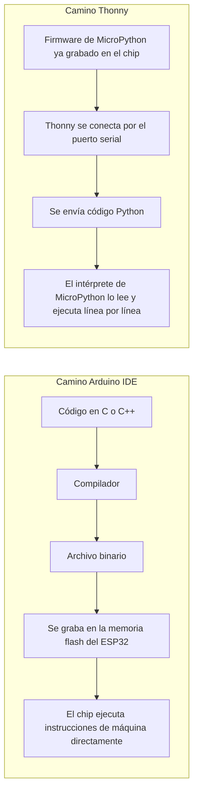
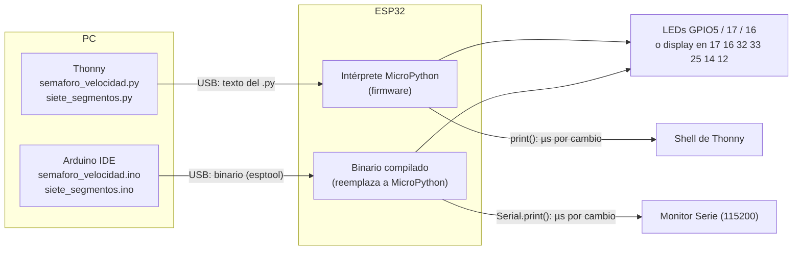
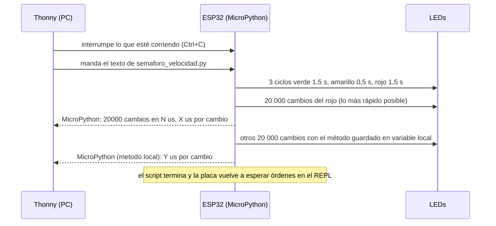
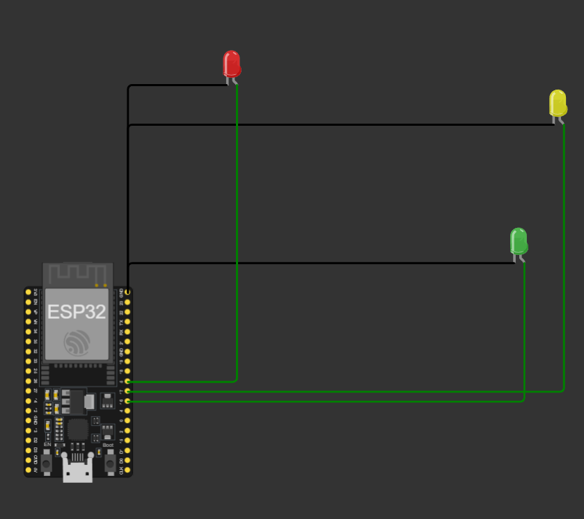
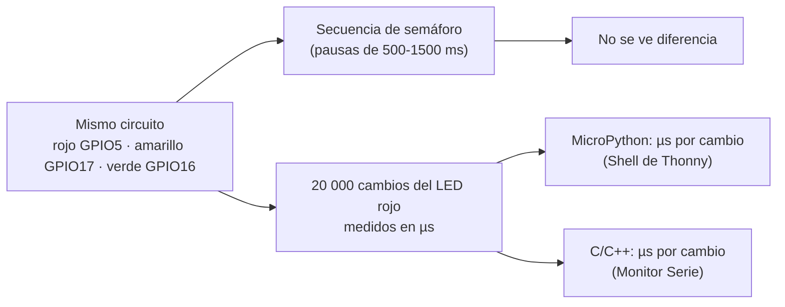
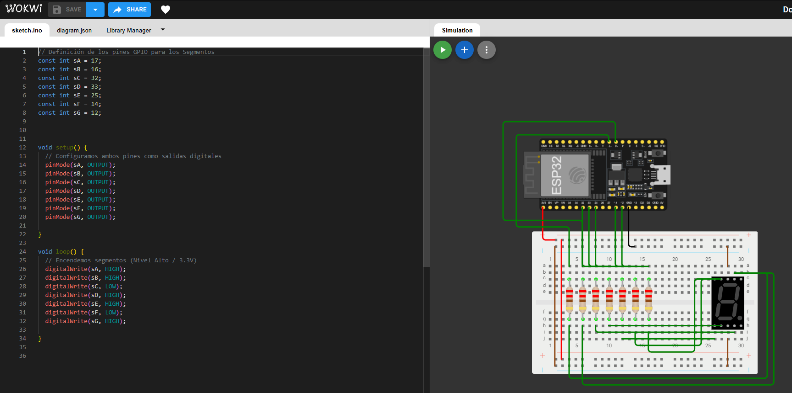
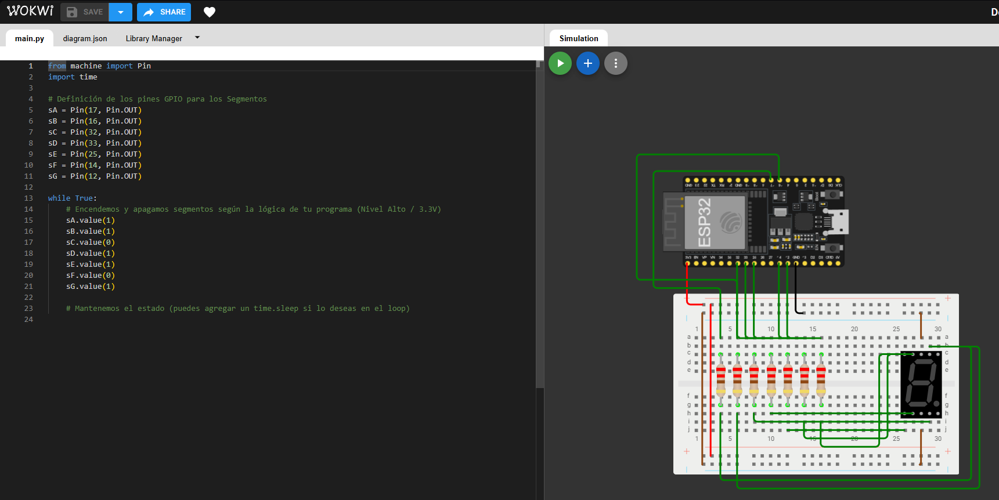

# Lenguajes: por qué Thonny

Basado en [Instalación de Thonny — NODEMCU V3 ESP8266](https://github.com/dialejobv/U_Militar/blob/main/1%29%20Instalaci%C3%B3n%20Thonny/NODEMCU%20V3%20ESP8266.md) (U_Militar, carpeta `1) Instalación Thonny`).

## Qué pedía la actividad y qué hicimos

La guía del profesor explica cómo grabar MicroPython en un NodeMCU V3 (ESP8266) para poder
programarlo desde Thonny. La actividad era entender esa elección: qué es Thonny, qué es
MicroPython, y por qué programar el ESP32 así en vez de con C/C++ desde el Arduino IDE.

Lo que hicimos, en tres partes:

1. **La instalación**, pasada del ESP8266 de la guía al ESP32 que usamos en todo el curso (cambian
   el firmware y la dirección de grabación).
2. **La comparación con números**: un semáforo de tres LEDs escrito en los dos lenguajes, que
   además de la secuencia visible mide cuántos microsegundos tarda cada lenguaje en cambiar un pin.
   El mismo circuito, el mismo pin y la misma medición; lo único que cambia es el lenguaje.
3. **La comparación de sintaxis**: un display de siete segmentos que muestra un "2", simulado en
   Wokwi con el mismo circuito programado una vez en C/C++ y otra en MicroPython, con las dos
   capturas lado a lado.

## Qué es Thonny

Thonny es un entorno de desarrollo pensado originalmente para enseñar Python a gente que nunca había programado antes. Lo creó Aivar Annamaa en la Universidad de Tartu, en Estonia, y salió como versión estable en 2015, después de que su creador pasara varios años dando clases de Python a principiantes y viendo de primera mano en qué se atascaban. Por eso Thonny trae cosas como un depurador visual que muestra paso a paso cómo cambian las variables mientras el programa corre, algo pensado para quien recién está entendiendo cómo funciona el flujo de un programa.

El soporte para MicroPython llegó después, primero como un plugin para la placa BBC micro:bit y luego, ya en la versión 3.0 de Thonny, como soporte general para cualquier placa que corra MicroPython, entre ellas el ESP32, el ESP8266 y la Raspberry Pi Pico. Esto convirtió a Thonny en una puerta de entrada bastante natural para pasar de programar en la computadora a programar microcontroladores, sin cambiar de herramienta ni de lenguaje.

En la práctica, conectado a un ESP32, Thonny tiene tres partes que usamos todo el tiempo:

- **El editor**, donde se escribe el `.py`. Con F5 el archivo se manda a la placa y se ejecuta ahí,
  no en el PC.
- **La Shell**, abajo: es el **REPL** del ESP32 (*Read-Eval-Print Loop*, "leer, evaluar, imprimir,
  repetir"). Muestra el `>>>` del intérprete que corre dentro del chip: lo que se escribe ahí lo
  ejecuta la placa al instante, y todo `print()` de un programa aparece ahí.
- **El panel de archivos** (Ver → Archivos): muestra lo que hay guardado en la flash de la placa.
  Un archivo guardado como `main.py` en la placa arranca solo cada vez que se enciende; lo que se
  corre con F5 sin guardarlo solo corre esa vez.

## Qué es MicroPython (y qué es un firmware)

El **firmware** es el programa grabado en la memoria flash del chip, el que arranca cada vez que la
placa se enciende. Un ESP32 recién comprado suele traer un firmware de fábrica (o el último sketch
de Arduino que alguien le grabó). **MicroPython** es un firmware especial: un intérprete de Python
escrito en C, compilado para el ESP32. Una vez grabado, el chip ya no ejecuta "un programa fijo"
sino que queda esperando código Python, por el puerto USB o desde archivos `.py` guardados en su
propia flash.

### Por qué MicroPython y no Python normal

Python normal, el que corre en una computadora, necesita un sistema operativo completo detrás, con varios megabytes de memoria disponibles y un procesador bastante más potente que el de un microcontrolador. El ESP32 tiene apenas algunos cientos de kilobytes de RAM, así que instalar el Python de una computadora tal cual no es una opción.

MicroPython es una reimplementación del lenguaje Python, escrita desde cero por Damien George y publicada por primera vez en 2014, pensada específicamente para correr con esas limitaciones de memoria y sin sistema operativo debajo. Mantiene la mayor parte de la sintaxis y de la forma de escribir código de Python, así que quien ya sabe Python puede empezar a escribir para un microcontrolador casi sin curva de aprendizaje adicional, pero por dentro es un intérprete mucho más liviano, que deja por fuera buena parte de las librerías estándar de Python y las reemplaza por módulos propios pensados para hablar directamente con los pines, los buses de comunicación y los periféricos del chip. El más importante es `machine`: de ahí sale `Pin`, que es todo lo que usan los dos programas de este tema.

## Qué es compilar y qué es interpretar

Es la diferencia de fondo entre Arduino y Thonny, así que vale la pena explicarla antes de
compararlos. **Compilar** es traducir todo el programa de una vez, antes de ejecutarlo, a las
instrucciones de máquina que entiende el procesador (ceros y unos específicos de ese chip). El
resultado es un binario que corre directo, sin nadie de por medio. **Interpretar** es que otro
programa (el intérprete) vaya leyendo el código fuente mientras corre y ejecutando cada instrucción
en el momento. Es más flexible (se puede cambiar el código y probar al instante), pero cada línea
paga el costo de que el intérprete la lea, busque los nombres y decida qué hacer.

## Cómo se relaciona esto con Arduino y con C++

La diferencia entre usar el Arduino IDE y usar Thonny no es una simple cuestión de gustos, es una diferencia de fondo en cómo el chip termina ejecutando el código.


```mermaid
flowchart LR
    subgraph Arduino["Camino Arduino IDE"]
        A1["Código en C o C++"] --> A2["Compilador"]
        A2 --> A3["Archivo binario"]
        A3 --> A4["Se graba en la memoria flash del ESP32"]
        A4 --> A5["El chip ejecuta instrucciones de máquina directamente"]
    end

    subgraph Thonny["Camino Thonny"]
        B1["Firmware de MicroPython ya grabado en el chip"] --> B2["Thonny se conecta por el puerto serial"]
        B2 --> B3["Se envía código Python"]
        B3 --> B4["El intérprete de MicroPython lo lee y ejecuta línea por línea"]
    end
```

En el camino de Arduino, el código en C o C++ se compila por completo antes de tocar el chip, se convierte en instrucciones de máquina y ese binario queda grabado en la memoria flash. El ESP32 arranca y ejecuta directamente esas instrucciones, sin ningún intérprete de por medio, lo que lo hace muy rápido y muy eficiente en el uso de memoria.

En el camino de Thonny, lo primero que tiene que pasar es que el ESP32 tenga instalado el firmware de MicroPython, que en la práctica es un programa en C compilado que actúa como intérprete de Python dentro del chip. Una vez ese firmware está instalado, Thonny se conecta al chip por el mismo puerto serial que usaría el Arduino IDE, pero en lugar de mandar un binario compilado manda el código Python tal cual, línea por línea si se quiere, y ese intérprete dentro del chip lo va leyendo y ejecutando al vuelo.

Por eso no tiene sentido preguntarse por qué usar Arduino y no Thonny como si fueran dos programas que compiten por lo mismo, porque en el fondo apuntan a dos formas distintas de trabajar con el mismo chip. El ESP32 solo puede tener un firmware corriendo a la vez, así que instalar MicroPython para usar Thonny reemplaza por completo el firmware que el Arduino IDE necesita para funcionar, y viceversa. La elección real está entre programar con un lenguaje compilado que se convierte en instrucciones nativas, o programar con un lenguaje interpretado que corre dentro de un intérprete ya instalado en el chip.

## La idea general

Así viaja el código y así vuelve el resultado en cada camino, con los archivos de este tema:


```mermaid
flowchart LR
    subgraph PC["PC"]
        TH["Thonny<br/>semaforo_velocidad.py<br/>siete_segmentos.py"]
        AR["Arduino IDE<br/>semaforo_velocidad.ino<br/>siete_segmentos.ino"]
    end
    subgraph ESP["ESP32"]
        MP["Intérprete MicroPython<br/>(firmware)"]
        BIN["Binario compilado<br/>(reemplaza a MicroPython)"]
    end
    TH -- "USB: texto del .py" --> MP
    AR -- "USB: binario (esptool)" --> BIN
    MP --> LED["LEDs GPIO5 / 17 / 16<br/>o display en 17 16 32 33 25 14 12"]
    BIN --> LED
    MP -- "print(): µs por cambio" --> SH["Shell de Thonny"]
    BIN -- "Serial.print(): µs por cambio" --> MON["Monitor Serie (115200)"]
```

Qué pasa cuando se presiona F5 en Thonny con `semaforo_velocidad.py` abierto:


```mermaid
sequenceDiagram
    participant T as Thonny (PC)
    participant E as ESP32 (MicroPython)
    participant L as LEDs
    T->>E: interrumpe lo que esté corriendo (Ctrl+C)
    T->>E: manda el texto de semaforo_velocidad.py
    E->>L: 3 ciclos verde 1,5 s, amarillo 0,5 s, rojo 1,5 s
    E->>L: 20 000 cambios del rojo (lo más rápido posible)
    E-->>T: MicroPython: 20000 cambios en N us, X us por cambio
    E->>L: otros 20 000 cambios con el método guardado en variable local
    E-->>T: MicroPython (metodo local): Y us por cambio
    Note over E: el script termina y la placa vuelve a esperar órdenes en el REPL
```

En el camino de Arduino no hay nada de ida y vuelta mientras corre: el IDE compila, graba el
binario con `esptool`, reinicia la placa, y el sketch imprime su resultado una sola vez por el
Monitor Serie.

## Instalar MicroPython en el ESP32

La guía del profesor graba el firmware en un ESP8266; en el ESP32 los pasos son los mismos con dos diferencias: se elige el firmware del ESP32 y la dirección donde empieza es `0x1000` en vez de `0`. Hay dos caminos:

- **Desde Thonny** (el más corto): Herramientas → Opciones → Intérprete → "MicroPython (ESP32)" → "Instalar o actualizar MicroPython (esptool)". Se elige el puerto, la familia `ESP32` y la variante `Espressif • ESP32 / WROOM`, y Thonny descarga y graba el firmware solo.
- **Con `esptool` por consola** (lo que hace la guía original), después de `pip install esptool` y de bajar el `.bin` de [micropython.org/download/ESP32_GENERIC](https://micropython.org/download/ESP32_GENERIC/):

```
esptool --chip esp32 --port COM7 erase_flash
esptool --chip esp32 --port COM7 --baud 460800 write_flash -z 0x1000 ESP32_GENERIC-<version>.bin
```

`erase_flash` borra todo (incluido un sketch de Arduino o un MicroPython viejo) y `write_flash` graba el intérprete. `COM7` es el puerto que nos tocó a nosotros; el de cada placa se ve en el Administrador de dispositivos de Windows (sección "Puertos (COM y LPT)"). `--baud 460800` es solo la velocidad de grabación, más rápida que la normal para que tarde menos; `-z` comprime el archivo mientras lo manda. La dirección `0x1000` es porque en el ESP32 los primeros 4 KB de la flash quedan reservados y el firmware empieza después; en el ESP8266 empieza en `0`. Si `esptool` no logra conectarse, se mantiene presionado el botón BOOT de la placa mientras empieza a escribir. Al terminar, en Thonny se elige el intérprete "MicroPython (ESP32)" con ese puerto y debe aparecer el `>>>` del REPL.

## Por qué MicroPython y no C++

Acá la comparación sí es directa, porque ambos corren en el mismo tipo de hardware.

| Aspecto | C o C++ vía Arduino o ESP-IDF | MicroPython vía Thonny |
|---|---|---|
| Cómo se ejecuta | Se compila a instrucciones de máquina nativas | Se interpreta línea por línea dentro del chip |
| Velocidad de ejecución | Mucho más rápido, ideal para tareas con tiempos críticos | Más lento, suficiente para la mayoría de proyectos de aprendizaje |
| Uso de memoria | Muy eficiente | Consume más RAM porque el propio intérprete ocupa espacio |
| Velocidad para probar cambios | Hay que compilar y grabar todo de nuevo cada vez | Se puede escribir y probar código directamente en el chip en segundos |
| Curva de aprendizaje | Más exigente, hay que manejar punteros, tipos de datos, compilación | Más suave, sintaxis simple y errores más fáciles de entender |
| Caso de uso típico | Proyectos donde el tiempo de respuesta importa mucho, o donde se necesita exprimir al máximo el chip | Aprendizaje, prototipado rápido, proyectos donde la velocidad de desarrollo importa más que la eficiencia bruta |

En resumen, C++ le exige más al chip pero saca más rendimiento de él, mientras que MicroPython le pide al chip que cargue con el peso de un intérprete pero a cambio permite escribir, probar y corregir código muchísimo más rápido, algo especialmente útil al momento de aprender cómo funciona un sensor o un periférico nuevo sin perder tiempo compilando cada intento.

## Primera comparación: el semáforo que mide su propia velocidad

Para ver esta diferencia de velocidad en la práctica basta un montaje simple: tres LEDs conectados al ESP32, el rojo en GPIO5, el amarillo en GPIO17 y el verde en GPIO16, cada uno con su resistencia de 220 Ω hacia GND (en Wokwi se pueden omitir, en la protoboard no).



### Qué es un LED y por qué lleva resistencia

Un LED es un diodo que emite luz: deja pasar corriente en un solo sentido (del ánodo, la pata
larga, al cátodo, la pata corta) y, una vez encendido, la tensión entre sus patas se queda casi fija
(alrededor de 2 V para un LED rojo, algo más para uno verde). Si se conecta directo a un pin de
3,3 V, no hay nada que limite la corriente y el LED o el pin del ESP32 se dañan. La resistencia en
serie se queda con la diferencia de voltaje y fija la corriente: con un LED rojo, (3,3 V − 2 V) /
220 Ω ≈ 6 mA, que alcanza para verlo bien encendido y está muy por debajo de lo que aguanta un GPIO
del ESP32. Wokwi deja omitirla porque sus LEDs simulados no se queman; en la protoboard real va
siempre.

### Conexiones del semáforo

| Componente | Pata | Va a | Resistencia | Voltaje con el pin en 1 |
|---|---|---|---|---|
| LED rojo | Ánodo (pata larga) | GPIO5 (a través de la resistencia) | 220 Ω | 3,3 V en el pin |
| LED amarillo | Ánodo | GPIO17 (a través de la resistencia) | 220 Ω | 3,3 V en el pin |
| LED verde | Ánodo | GPIO16 (a través de la resistencia) | 220 Ω | 3,3 V en el pin |
| Los tres LEDs | Cátodo (pata corta) | GND de la placa | — | 0 V |
| Placa | USB | PC | — | 5 V del USB, regulados a 3,3 V |

La resistencia puede ir de cualquiera de los dos lados del LED (entre el pin y el ánodo, o entre el
cátodo y GND); en serie da igual. Por qué esos pines: GPIO16 y GPIO17 son salidas normales en el
WROOM-32, sin ninguna función de arranque. GPIO5 sí es un pin de arranque, pero solo configura un
detalle de tiempos de la interfaz SDIO, y un LED con su resistencia hacia GND no le impide arrancar
a la placa. Ninguno de los tres es de los que solo sirven como entrada (34-39), que no podrían
prender un LED.

### Qué hace el código

Una secuencia de semáforo con pausas de medio segundo o más se ve igual en los dos lenguajes: el intérprete tarda microsegundos por instrucción, mil veces menos que la pausa, así que a simple vista no hay diferencia. La diferencia aparece cuando se mide. Por eso [`semaforo_velocidad.py`](semaforo_velocidad.py) (MicroPython) y [`semaforo_velocidad/semaforo_velocidad.ino`](semaforo_velocidad/semaforo_velocidad.ino) (Arduino) hacen lo mismo en dos partes: primero la secuencia visible del semáforo y después cambian el LED rojo 20 000 veces lo más rápido posible, midiendo el tiempo con el reloj de microsegundos del chip (`time.ticks_us()` en un caso, `micros()` en el otro), e imprimen cuántos microsegundos cuesta cada cambio. El mismo proceso, el mismo hardware y el mismo pin: lo único que cambia es el lenguaje.


```mermaid
flowchart LR
    A["Mismo circuito<br/>rojo GPIO5 · amarillo GPIO17 · verde GPIO16"] --> B["Secuencia de semáforo<br/>(pausas de 500-1500 ms)"]
    B --> C["No se ve diferencia"]
    A --> D["20 000 cambios del LED rojo<br/>medidos en µs"]
    D --> E["MicroPython: µs por cambio<br/>(Shell de Thonny)"]
    D --> F["C/C++: µs por cambio<br/>(Monitor Serie)"]
```

Paso a paso, en la versión de MicroPython:

**1. Pines.** Cada LED es un objeto `Pin(numero, Pin.OUT)`. Se guardan también en una tupla `LEDS`
para poder apagarlos todos con un `for` al empezar (si la placa venía de otro programa, algún LED
podía quedar prendido).

**2. Secuencia visible.** Tres ciclos de verde 1500 ms, amarillo 500 ms y rojo 1500 ms. Los pares
(LED, pausa) van en una tupla para que el ciclo sea un solo `for` en vez de nueve líneas repetidas:

```python
for _ in range(3):
    for led, pausa_ms in ((VERDE, 1500), (AMARILLO, 500), (ROJO, 1500)):
        led.value(1)
        time.sleep_ms(pausa_ms)
        led.value(0)
```

**3. Medición.** Se prende y apaga el rojo 10 000 veces (`REPETICIONES = 10000`); como cada vuelta
hace dos cambios, son 20 000 cambios en total. Son suficientes para que el tiempo total se mida en
milisegundos y el promedio no dependa de un caso raro.

```python
inicio = time.ticks_us()
for _ in range(REPETICIONES):
    ROJO.value(1)
    ROJO.value(0)
total_us = time.ticks_diff(time.ticks_us(), inicio)
```

`time.ticks_us()` es un contador de microsegundos que en algún momento llega a su máximo y vuelve a
cero. Por eso la diferencia no se saca restando a mano sino con `time.ticks_diff()`, que calcula
bien el tiempo transcurrido aunque el contador haya dado la vuelta en medio de la medición. El
resultado se divide entre 20 000 y se imprime con dos decimales. Ese tiempo incluye lo que cuesta
el propio `for`, igual que en la versión de C/C++, así que la comparación es pareja.

**4. La variante "método local".** En MicroPython, cada vez que se escribe `ROJO.value(1)` el
intérprete tiene que buscar el nombre `ROJO` y después buscar `value` dentro de él, en cada vuelta.
La variante guarda los métodos antes del bucle:

```python
encender = ROJO.on
apagar = ROJO.off
```

y el bucle solo llama `encender()` y `apagar()`. Si esta variante sale más rápida, la diferencia es
tiempo que el intérprete gastaba buscando nombres, no moviendo el pin. Es un truco típico de
MicroPython y muestra de dónde viene parte de su costo.

En la versión de Arduino el orden es el mismo, con dos diferencias que vale la pena notar:

- Todo pasa dentro de `setup()`, que corre una sola vez al arrancar, y `loop()` queda vacío. Así la
  medición se hace una vez y el resultado queda quieto en el Monitor Serie; para repetirla se
  presiona EN (reinicio).
- `micros()` devuelve un `unsigned long`. La resta `micros() - inicio` entre dos números sin signo
  da el resultado correcto aunque el contador haya dado la vuelta, que es el mismo problema que en
  MicroPython resuelve `ticks_diff`.

Lo que imprime cada uno (N, X, Y son los números medidos en la placa):

```
MicroPython: 20000 cambios en N us -> X us por cambio
MicroPython (metodo local): Y us por cambio
```

```
C/C++: 20000 cambios en N us -> X us por cambio
```

## Segunda comparación: el mismo circuito en Wokwi, C/C++ contra MicroPython

Para ver la diferencia de sintaxis lado a lado, sin depender de tener el hardware físico a mano, [Wokwi](https://wokwi.com) permite simular un ESP32 completo en el navegador, cableado incluido. El montaje de referencia es un display de siete segmentos, con sus siete resistencias de por medio, conectado a siete pines GPIO del ESP32 (17, 16, 32, 33, 25, 14 y 12), uno por cada segmento del display.

### Qué es un display de siete segmentos

Son siete LEDs alargados dentro de una misma pieza, acomodados en forma de "8", y cada uno se
nombra con una letra:

```
 aaa
f   b
 ggg
e   c
 ddd
```

Prendiendo solo algunos se dibuja cada número: para el "2" van a, b, g, e y d, y quedan apagados c
y f. Como son LEDs, cada segmento necesita su resistencia. Hay dos tipos: en el de **cátodo común**
todos los cátodos van juntos a GND y un segmento se prende poniendo su pin en 1 (3,3 V); en el de
**ánodo común** todos los ánodos van a 3,3 V y un segmento se prende poniendo su pin en 0. El que
usamos (en Wokwi y en el código) es de **cátodo común**: el pin común va a GND y cada segmento se
prende con un 1. Con uno de ánodo común habría que invertir todos los 1 y 0.

### Conexiones del display

Sacadas del código (`siete_segmentos.py` y `siete_segmentos.ino` usan exactamente los mismos
pines):

| Segmento | Posición en el "8" | GPIO del ESP32 | Resistencia | Estado para dibujar "2" |
|---|---|---|---|---|
| a | arriba | GPIO17 | 220 Ω | encendido (1) |
| b | arriba a la derecha | GPIO16 | 220 Ω | encendido (1) |
| c | abajo a la derecha | GPIO32 | 220 Ω | apagado (0) |
| d | abajo | GPIO33 | 220 Ω | encendido (1) |
| e | abajo a la izquierda | GPIO25 | 220 Ω | encendido (1) |
| f | arriba a la izquierda | GPIO14 | 220 Ω | apagado (0) |
| g | centro | GPIO12 | 220 Ω | encendido (1) |
| común | — | GND (cátodo común) | — | — |

Sobre los pines: GPIO25 es uno de los dos DAC, pero aquí se usa como salida digital normal (0 o
3,3 V), que también puede. GPIO12 es el pin de arranque más delicado del ESP32: si está en 1 al
encender, el chip configura la flash a 1,8 V y no arranca. Con un segmento de cátodo común y su
resistencia hacia GND, el pin queda más bien tirado hacia 0 al encender, así que no molesta; lo
dejamos anotado en el propio código por si alguien cambia el circuito. GPIO14 saca unos pulsos
durante el arranque, que a lo sumo hacen parpadear el segmento f un instante.

### Las dos versiones lado a lado

Escribiendo exactamente la misma lógica, encender los segmentos necesarios para dibujar el número dos, en los dos lenguajes que ya se compararon arriba, la diferencia de sintaxis salta a la vista. El código de las dos capturas está en [`siete_segmentos.py`](siete_segmentos.py) y [`siete_segmentos/siete_segmentos.ino`](siete_segmentos/siete_segmentos.ino), comentado, para pegarlo en Wokwi o grabarlo en la placa:



En C/C++ vía Arduino cada pin se declara como una constante con `const int`, se configura como salida dentro de `setup()` con `pinMode(pin, OUTPUT)`, y se escribe con `digitalWrite(pin, HIGH)` o `digitalWrite(pin, LOW)`. Todo ese código se compila una sola vez y el resultado corre dentro de `loop()`, que el propio Arduino ya se encarga de repetir sin que haga falta escribir un bucle explícito.



En MicroPython cada pin se declara directamente como un objeto `Pin(numero, Pin.OUT)` importado desde el módulo `machine`, y se escribe con `.value(1)` o `.value(0)` en vez de una función aparte como `digitalWrite`. Como no hay compilación previa que repita el código por su cuenta, hace falta un `while True:` explícito para que el estado de los segmentos se siga manteniendo en el tiempo. Es la misma idea de fondo, prender y apagar pines digitales, pero se nota de inmediato que MicroPython pide menos ceremonia para declarar cada pin y que el control del bucle principal queda en manos de quien escribe el código en vez de quedar oculto dentro del framework de Arduino.

La equivalencia, instrucción por instrucción:

| Qué se hace | C/C++ (Arduino) | MicroPython |
|---|---|---|
| Traer lo necesario | nada: el framework ya lo trae | `from machine import Pin` |
| Declarar el pin del segmento a | `const int sA = 17;` | `sA = Pin(17, Pin.OUT)` |
| Configurarlo como salida | `pinMode(sA, OUTPUT);` en `setup()` | ya incluido en `Pin(..., Pin.OUT)` |
| Prenderlo | `digitalWrite(sA, HIGH);` | `sA.value(1)` |
| Repetir para siempre | `loop()`, lo repite el framework | `while True:` escrito a mano |

Una diferencia pequeña entre el archivo `.py` del repositorio y la captura: el archivo agrega un
`time.sleep_ms(100)` al final del `while True`. No cambia lo que se ve (el "2" sigue fijo), pero
sin esa pausa el bucle reescribe los mismos valores sin parar, ocupa todo el procesador y la Shell
de Thonny se pone lenta para detenerlo. La versión de Arduino no la necesita, porque ahí no hay una
Shell que atender.

## Qué hace cada archivo

- **[`semaforo_velocidad.py`](semaforo_velocidad.py)**: MicroPython, se corre en el ESP32 desde
  Thonny (F5). Secuencia de semáforo de tres ciclos y medición de microsegundos por cambio de pin,
  normal y con el método guardado en variable local. Imprime dos líneas en la Shell.
- **[`semaforo_velocidad/semaforo_velocidad.ino`](semaforo_velocidad/semaforo_velocidad.ino)**: la
  misma secuencia y la misma medición en C/C++, para el Arduino IDE. Va en una carpeta con su mismo
  nombre porque el Arduino IDE exige que cada sketch viva en una carpeta que se llame igual que él.
  Imprime una línea por el Monitor Serie a 115200 baudios. Grabarlo borra MicroPython.
- **[`siete_segmentos.py`](siete_segmentos.py)**: MicroPython, dibuja un "2" en el display de siete
  segmentos (cátodo común) y lo mantiene con un `while True`. Es el código de la captura
  `wokwi-micropython.png`, con comentarios y la pausa de 100 ms.
- **[`siete_segmentos/siete_segmentos.ino`](siete_segmentos/siete_segmentos.ino)**: lo mismo en
  C/C++, el código de la captura `wokwi-arduino-c.png`.
- **`circuito-comparacion-leds.png`**: el circuito de los tres LEDs armado en Wokwi.
- **`wokwi-arduino-c.png`** y **`wokwi-micropython.png`**: las capturas del display de siete
  segmentos en Wokwi con cada lenguaje.

No hay `entorno/` de Python en este tema: ninguno de los programas corre en el PC. Los `.py` los
ejecuta MicroPython dentro del ESP32 y los `.ino` los compila el Arduino IDE.

## Qué se modificó frente al material original

La guía enlazada desde el [README principal del repositorio](../README.md) es una guía de instalación para el NodeMCU V3, una placa con chip ESP8266, y se limita a los pasos de línea de comandos para borrar la flash y grabar el firmware de MicroPython con `esptool`, sin entrar en comparaciones de lenguajes ni en código de ejemplo. A partir de esa base, este README cambia el enfoque de varias formas:

- Se generalizó el procedimiento del ESP8266 de la guía original al ESP32, que es el chip que se usa en el resto de este repositorio y que tiene más memoria y más periféricos que el ESP8266.
- Se agregó toda la parte conceptual que la guía original no cubre: qué es Thonny, de dónde viene, por qué existe MicroPython como reimplementación de Python y no el Python normal de una computadora.
- Se agregó la comparación directa contra programar en C/C++ vía Arduino, con el diagrama de los dos caminos posibles y la tabla de ventajas y desventajas de cada uno, algo que la guía original no menciona porque solo se ocupa de dejar el firmware instalado.
- Se armó el montaje físico de los tres LEDs y se documentó como ejemplo práctico de la diferencia de velocidad entre ambos lenguajes, algo que tampoco existe en el material original.
- Se escribió la medición de velocidad (`semaforo_velocidad.py` y su versión `.ino`), para que la comparación sea con números y no a ojo.
- Se agregó una simulación en Wokwi de un display de siete segmentos, con el mismo circuito programado una vez en C/C++ vía Arduino y otra vez en MicroPython, para mostrar la diferencia de sintaxis lado a lado sin depender del hardware físico.

En resumen, la guía original resuelve un problema puntual, dejar MicroPython grabado en una placa distinta; este README parte de ahí para explicar el porqué detrás de esa elección y para generalizarla al ESP32.

## Problemas de compatibilidad

- **El chip necesita un driver USB-a-serial para que Windows lo reconozca como puerto COM.** La mayoría de placas ESP32 usan un chip CP2102 o CH340 para el puerto USB, y si Windows no tiene el driver correspondiente instalado, el ESP32 no aparece en el Administrador de dispositivos ni en la lista de puertos de Thonny, aunque el cable y la placa estén perfectamente bien. También pasa con cables USB que solo cargan y no tienen los hilos de datos: si la placa prende pero no aparece ningún puerto, lo primero es probar otro cable.
- **El soporte de MicroPython en Thonny requiere la versión 3.0 o más nueva del programa.** Versiones más viejas de Thonny, pensadas solo para Python de escritorio, no muestran la opción de intérprete de MicroPython en el menú Ejecutar, así que hay que actualizar Thonny antes de intentar conectarse a la placa.
- **El firmware tiene que corresponder al modelo exacto de chip.** Si el firmware de MicroPython grabado en el chip no corresponde al modelo exacto de ESP32 (por ejemplo un firmware genérico de ESP32 en una variante S2 o S3), Thonny puede conectarse al puerto pero fallar al intentar hablarle al intérprete, o mostrar errores extraños apenas se corre cualquier código. La velocidad del puerto, en cambio, no hay que configurarla: MicroPython usa 115200 baudios por USB y Thonny ya la usa sola.
- **Grabar un sketch desde el Arduino IDE borra MicroPython**, y al revés: después de probar `semaforo_velocidad.ino` hay que reinstalar el firmware (sección de instalación) para volver a Thonny.
- **Thonny tiene el puerto tomado mientras está conectado**: si el Arduino IDE o cualquier otro programa no puede abrir el COM, primero hay que desconectar Thonny (botón Stop o cerrar el programa).

## Cómo probarlo

**Sin ESP32 conectado**

Todo el tema se puede probar en [Wokwi](https://wokwi.com), sin instalar nada:

1. Crear un proyecto nuevo "ESP32" (para C/C++) o "MicroPython on ESP32".
2. Armar el circuito con el botón "+": tres LEDs con el ánodo en GPIO5 (rojo), GPIO17 (amarillo) y
   GPIO16 (verde) y el cátodo a GND, como en `circuito-comparacion-leds.png`; o un display de siete
   segmentos de cátodo común con sus siete resistencias hacia los GPIO 17, 16, 32, 33, 25, 14 y 12
   (segmentos a a g, en ese orden) y el común a GND, como en las capturas de arriba.
3. Pegar el código del archivo correspondiente (`.py` en `main.py`, `.ino` en `sketch.ino`) y darle
   al botón verde de simular.

El siete segmentos debe mostrar un "2". El semáforo hace sus tres ciclos y después imprime la
medición en la consola de Wokwi, pero esos números no valen para comparar lenguajes: el simulador
no reproduce los tiempos reales del chip.

**Con ESP32 conectado**

1. Armar los tres LEDs en la protoboard según la tabla de conexiones (cada uno con su 220 Ω).
2. Con MicroPython instalado, abrir `semaforo_velocidad.py` en Thonny, elegir el intérprete
   "MicroPython (ESP32)" con el puerto de la placa y correrlo con F5: el semáforo hace tres ciclos
   (unos 10 segundos) y la Shell imprime los microsegundos por cambio, en las dos variantes.
3. Presionar Stop en Thonny para soltar el puerto. En el Arduino IDE, instalar si hace falta el
   soporte de placas "esp32" de Espressif (Herramientas → Placa → Gestor de tarjetas), elegir la
   placa "ESP32 Dev Module" y el mismo puerto, y subir `semaforo_velocidad/semaforo_velocidad.ino`.
4. Abrir el Monitor Serie a 115200 baudios y presionar EN en la placa: se repite el semáforo y sale
   la línea `C/C++: ...`.
5. Comparar los dos números de microsegundos por cambio.
6. Para el siete segmentos, el mismo procedimiento con `siete_segmentos.py` (Thonny) o
   `siete_segmentos/siete_segmentos.ino` (Arduino IDE) y el display cableado según su tabla.
7. Al terminar, reinstalar MicroPython (sección de instalación) para seguir con los demás temas.

## Pendiente

- Anotar aquí los microsegundos por cambio medidos en la placa real con cada lenguaje (los dos scripts los imprimen; no se inventaron valores).
- Foto o video del montaje físico de los tres LEDs en la protoboard.
