# Detección de objetos

Basado en [Explicación de la arquitectura YOLO](https://github.com/dialejobv/U_Militar/blob/main/2%29%20Yolo/Explicaci%C3%B3n_Arq_YOLO.md) (U_Militar, carpeta `2) Yolo`).

## ¿Quiere probarlo? Aquí está

Doble clic en **`ABRIR.bat`** (en Linux/Mac, `abrir.sh`). Se abre la app de esta práctica en una ventana propia, con un menú a la izquierda (tipo Docker Desktop): Inicio, Cómo funciona, **Ver a YOLO**, Con tu cámara, Simulador, Montaje y ESP32, Resultados.

- **Ver a YOLO** (no necesita cámara ni ESP32): un botón corre `deteccion_pc.py` de verdad sobre tres fotos de ejemplo, una cada 3 s, y la app muestra lo que ve YOLO: la foto con sus cajas, la confianza de cada objeto (y si cuenta o no, con el umbral de 0,4), el mensaje que recibiría el ESP32 (`10`, `01`, `11`) y los dos LEDs encendiéndose. Arrancar tarda 10-30 s (carga PyTorch) y la app lo muestra con una barra y las fases reales del arranque; la primera vez instala PyTorch (unos minutos) y descarga el modelo `yolov8n.pt` (6 MB). El selector cambia a la directiva carro/moto.
- **Con tu cámara**: lo mismo en vivo, con la ventana de OpenCV y su resumen dentro de la app.
- **Simulador**: el `preview.html` sin instalar nada, para ver el protocolo y el apagado de seguridad.

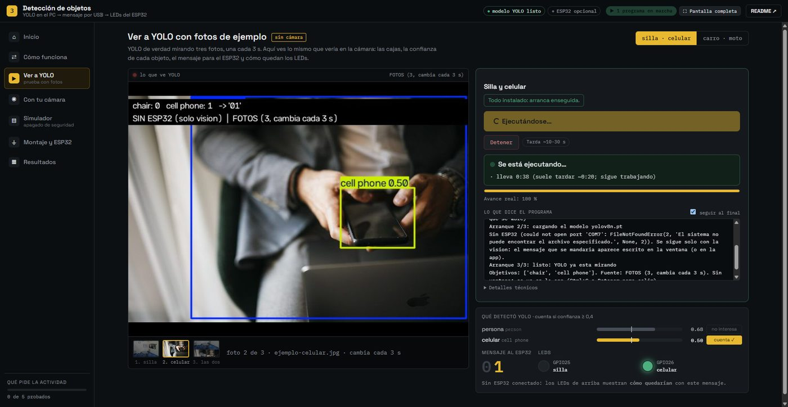

## ¿Quiere saber cómo funciona? Aquí está todo

1. [Qué pedía la actividad y qué quedó](#qué-pedía-la-actividad-y-qué-quedó)
2. Conceptos: [qué es la detección de objetos](#qué-es-la-detección-de-objetos), [qué es YOLO](#qué-es-yolo), [qué es COCO](#qué-es-coco-y-por-qué-no-tuvimos-que-entrenar-nada) y [la comunicación serial](#qué-es-la-comunicación-serial-y-cómo-la-usa-el-esp32)
3. [La idea general](#la-idea-general) (diagramas PC ↔ ESP32) y [conexiones](#conexiones)
4. [Qué hace cada archivo](#qué-hace-cada-archivo) y [el protocolo por serial](#el-protocolo-por-serial-con-los-mensajes-reales)
5. [La lógica del código, paso a paso](#la-lógica-del-código-paso-a-paso) y [datos clave](#datos-clave)
6. [Qué se modificó frente al código original de YOLO](#qué-se-modificó-frente-al-código-original-de-yolo) y [la directiva del carro y la moto](#sobre-la-directiva-de-detectar-un-carro-y-una-moto-de-juguete)
7. [Preparar el entorno](#preparar-el-entorno-en-la-computadora), [cómo probarlo](#cómo-probarlo) (sin ESP32 / con ESP32) y [problemas de compatibilidad](#problemas-de-compatibilidad)
8. [Demostración en funcionamiento](#demostración-en-funcionamiento), [pendiente](#pendiente) y [créditos de las fotos](#créditos-de-las-fotos-de-ejemplo)

## Qué pedía la actividad y qué quedó

El material del profesor explica cómo funciona YOLO y deja un script corto que abre la cámara, corre YOLOv8 sobre cada fotograma y muestra la ventana con las cajas de lo que reconoce. Ahí termina: todo se queda en la pantalla. La actividad era llevar eso al mundo físico, es decir, que lo que la cámara detecta haga algo en un circuito real con el ESP32.

Lo que armamos: la computadora corre YOLO sobre la cámara web, y cuando ve una **silla** o un **celular** le avisa al ESP32 por el mismo cable USB con el que se programa, y el ESP32 prende el LED de ese objeto en la protoboard. Cuando el objeto sale del cuadro, el LED se apaga. Si el script de la computadora se cierra o el cable se desconecta, el ESP32 apaga todo por su cuenta a los dos segundos. Además, con la opción `--carro-moto` el mismo programa detecta un carro y una moto de juguete, que era una directiva alternativa de la misma actividad (más abajo explicamos por qué la demo quedó con silla y celular).

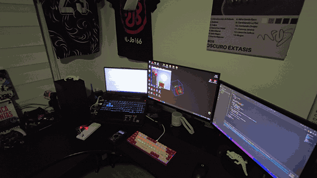

## Qué es la detección de objetos

En visión por computadora hay varias tareas que suenan parecido pero no son lo mismo:

- **Clasificar** una imagen es decir *qué hay* en ella como un todo ("esta foto es de un gato"). Da una sola respuesta por imagen.
- **Detectar objetos** es decir *qué hay y dónde está*: por cada objeto encontrado, el modelo devuelve una **caja** (un rectángulo con sus coordenadas en píxeles), una **clase** (qué es: silla, persona, celular...) y una **confianza** (un número de 0 a 1 que dice qué tan seguro está). En una misma imagen puede haber cero, uno o muchos objetos.

Para este proyecto la detección es justo lo que hace falta: no nos interesa describir la escena completa, sino saber si *entre todo lo que hay* aparece una silla o un celular. De cada fotograma solo usamos la clase y la confianza de cada caja; la posición de la caja la dibuja la ventana, pero no se le manda al ESP32.

## Qué es YOLO

YOLO, cuyas siglas vienen de You Only Look Once, es una familia de modelos de red neuronal pensada para detectar objetos dentro de una imagen o un video en tiempo real. La idea que lo hizo diferente cuando apareció en 2015, de la mano de Joseph Redmon y Ali Farhadi, fue tratar la detección como un solo problema de regresión, es decir el modelo mira la imagen completa una única vez y en esa misma pasada calcula al mismo tiempo dónde están los objetos y qué son, en lugar de primero buscar posibles regiones con objetos y después clasificarlas por separado, que era como funcionaban los detectores anteriores basados en dos etapas, como R-CNN. Esa diferencia es la que le da a YOLO su velocidad, siendo capaz de procesar decenas de fotogramas por segundo incluso en hardware modesto.

Internamente el proceso funciona dividiendo la imagen de entrada en una cuadrícula, donde cada celda de esa cuadrícula queda a cargo de predecir posibles objetos cuyo centro caiga dentro de ella. Para cada objeto candidato el modelo predice las coordenadas del cuadro que lo delimita, una puntuación de qué tan seguro está de que ahí realmente hay algo, y las probabilidades de a qué clase pertenece ese objeto, por ejemplo una silla o un celular. Como este proceso genera muchas predicciones superpuestas para el mismo objeto, al final se aplica una técnica llamada supresión no máxima, que se encarga de quedarse solo con la predicción más confiable de cada objeto y descartar las repetidas.

Desde esa primera versión la familia fue evolucionando mucho. Las versiones intermedias mejoraron la precisión y la capacidad de detectar objetos pequeños, y en 2020 Ultralytics lanzó YOLOv5, implementado en PyTorch, lo que lo hizo mucho más fácil de instalar y usar y terminó convirtiéndolo en el estándar de facto para la mayoría de proyectos aplicados. Las versiones más recientes, incluida la usada en este proyecto (YOLOv8), siguen esa misma línea de facilidad de uso, empaquetadas dentro de la librería `ultralytics` de Python.

Cada versión de YOLOv8 viene en varios tamaños: `n` (nano), `s`, `m`, `l` y `x`. Entre más grande, más precisa pero más lenta. Usamos la **nano** (`yolov8n.pt`, unos 6 MB), la única que corre fluida en una laptop sin tarjeta de video dedicada.

## Qué es COCO y por qué no tuvimos que entrenar nada

Un modelo de detección solo reconoce las clases con las que fue entrenado. El `yolov8n.pt` que trae Ultralytics viene entrenado con **COCO** (*Common Objects in Context*), un conjunto de datos público con miles de fotos etiquetadas a mano en **80 clases** de objetos cotidianos: persona, bicicleta, carro, moto, silla, mesa, celular, taza, etc. Cada clase tiene un número y un nombre en inglés, y el modelo guarda esa tabla en `model.names`.

Como `"chair"`, `"cell phone"`, `"car"` y `"motorcycle"` ya están entre esas 80 clases, no hizo falta juntar fotos ni entrenar nada: basta con decirle al programa cuáles de esos nombres nos importan. Por eso cambiar de silla y celular a carro y moto es cambiar dos palabras en una lista, no un modelo nuevo.

## Qué es la comunicación serial y cómo la usa el ESP32

Un puerto serial manda datos **un bit detrás de otro** por un solo cable, a una velocidad que los dos extremos acuerdan de antemano (los **baudios**; aquí 115200, es decir 115 200 bits por segundo). El ESP32 trae un chip conversor USB-serial, así que cuando lo conectamos a la computadora aparece como un puerto `COM` en Windows (en el nuestro, `COM7`). Es el mismo canal que usa Thonny para mandar código y mostrar la consola.

En MicroPython ese puerto es a la vez la consola del ESP32: lo que llega por el cable se lee desde `sys.stdin`, como si alguien lo escribiera en un teclado, y todo lo que el programa hace con `print(...)` sale por el mismo cable hacia la computadora. Eso nos permite tener comunicación de ida (la PC le dice qué LEDs prender) y de vuelta (el ESP32 confirma lo que hizo) sin WiFi, sin Bluetooth y sin cables extra: solo el USB. En la computadora, la librería `pyserial` es la que abre ese puerto desde Python.

## La idea general

La idea central es cerrar el círculo entre visión artificial y electrónica física. La computadora corre el modelo de YOLO leyendo la cámara en vivo, y cuando reconoce alguno de los objetos que nos interesan le avisa al ESP32 a través del cable USB, y el ESP32 enciende el LED correspondiente. Cuando el objeto deja de estar en cuadro, el LED se apaga.

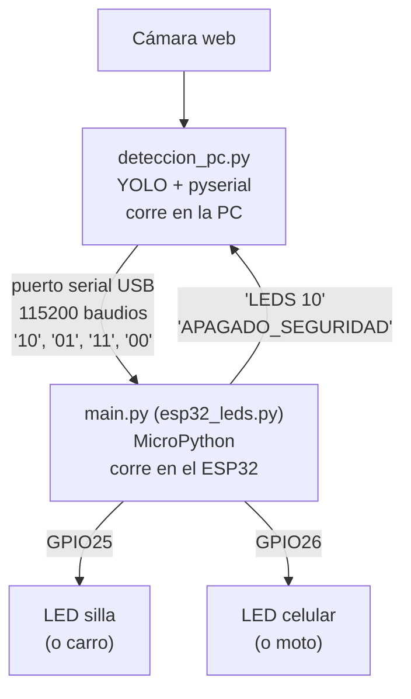

El protocolo de comunicación se mantuvo lo más simple posible a propósito. La computadora envía dos caracteres seguidos de un salto de línea: el primero indica si la silla está presente con un uno o un cero, y el segundo hace lo mismo con el celular. Por ejemplo `10` significa que se ve la silla pero no el celular, y `01` sería lo contrario. El ESP32 lee esa línea, prende o apaga cada LED según corresponda y contesta `LEDS 10` (o el mensaje que haya aplicado) para que la computadora sepa que llegó. La línea se manda en cuanto cambia el estado, para que el LED reaccione al instante, y además se repite cada medio segundo aunque no cambie nada. Esa repetición es la que hace compatible el envío con el apagado de seguridad: sin ella, una silla quieta frente a la cámara no generaría mensajes nuevos y su LED se apagaría a los dos segundos aunque la silla siguiera ahí. Y si la computadora deja de mandar mensajes por más de dos segundos, por ejemplo porque el script se cerró o el cable se desconectó, el ESP32 apaga los dos LEDs por su cuenta, para que no se queden encendidos de forma indefinida por accidente.

Vista de forma dinámica, así se comportan la cámara, el script y el ESP32 a lo largo del tiempo, incluyendo el caso en el que el cable se desconecta y actúa el apagado de seguridad:

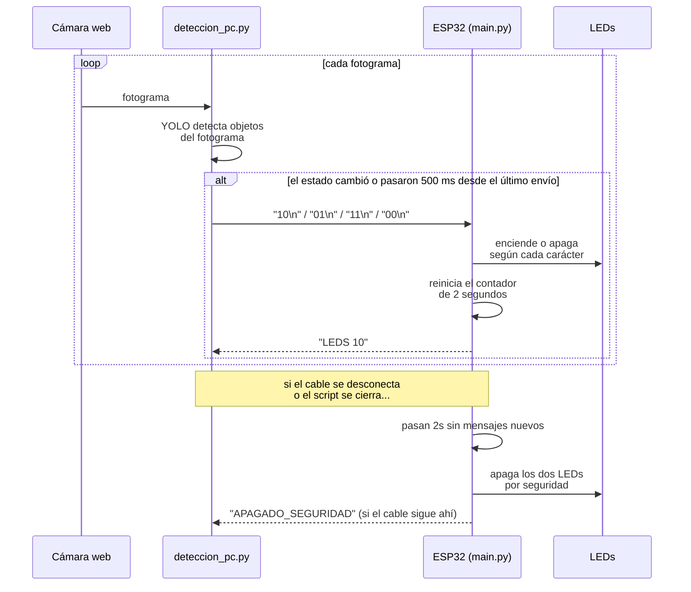

## Conexiones

Se necesitan el ESP32, dos LEDs, dos resistencias de 220 Ω, una protoboard, algunos cables (macho a macho o macho a hembra según la protoboard) y el cable USB de datos. Los pines salen directamente de `esp32_leds.py` (`Pin(25, Pin.OUT)` y `Pin(26, Pin.OUT)`):

| Componente | Pata del componente | Se conecta a | Voltaje | Resistencia |
|---|---|---|---|---|
| LED silla (o carro, LED rojo con `--carro-moto`) | Ánodo (pata larga) | GPIO25 del ESP32, a través de la resistencia | 3,3 V cuando el pin está en alto | 220 Ω en serie |
| LED silla | Cátodo (pata corta) | GND del ESP32 | 0 V | — |
| LED celular (o moto, LED verde con `--carro-moto`) | Ánodo (pata larga) | GPIO26 del ESP32, a través de la resistencia | 3,3 V cuando el pin está en alto | 220 Ω en serie |
| LED celular | Cátodo (pata corta) | GND del ESP32 (el mismo GND compartido) | 0 V | — |
| ESP32 | Conector micro-USB | Puerto USB de la computadora | 5 V de entrada (el regulador de la placa baja a 3,3 V) | — |

**Por qué GPIO25 y GPIO26.** Son pines de propósito general del ESP32 que no tienen ninguna función especial al arrancar. El ESP32 tiene algunos pines llamados *strapping* (0, 2, 5, 12 y 15) cuyo nivel en el momento del encendido decide cómo arranca el chip; si uno les cuelga un LED puede terminar impidiendo que arranque bien. Y los pines 6 a 11 están conectados internamente a la memoria flash, así que no se pueden usar. El 25 y el 26 no tienen ninguno de esos problemas, además de estar uno al lado del otro en la placa, lo que deja el cableado ordenado.

**Por qué 220 Ω.** El valor sale de calcular cuánta corriente puede pasar sin forzar ni al LED ni al pin del ESP32. El chip trabaja a 3,3 V, y un LED típico cae alrededor de 2 V cuando está encendido, así que quedan aproximadamente 1,3 V en la resistencia. Por la ley de Ohm, I = V / R = 1,3 V / 220 Ω ≈ 6 mA, un valor bajo y seguro tanto para el LED como para el pin, que en el ESP32 no debería superar los 20 mA de forma sostenida. La resistencia puede ir antes o después del LED dentro de esa misma línea: están en serie, así que el orden no cambia nada.

### Alimentación

Todo el circuito se alimenta desde el mismo cable USB que lleva los datos: la computadora le manda 5 V al ESP32 por ese cable, y el regulador que trae la placa integrado los convierte a los 3,3 V con los que en realidad trabaja el chip por dentro. No hace falta ninguna fuente externa ni batería, porque tanto el ESP32 como los dos LEDs, que consumen apenas unos miliamperios cada uno, quedan cómodamente dentro de lo que el puerto USB de cualquier computadora puede entregar. Los LEDs no se alimentan desde una fuente aparte, sino directamente desde los pines GPIO25 y GPIO26 del ESP32 puestos en alto.

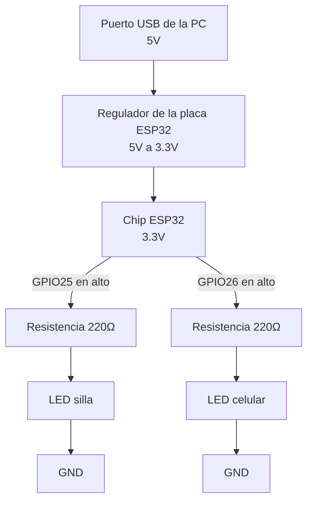

## Qué hace cada archivo

- **`deteccion_pc.py`**: el programa de la computadora. Abre la cámara, corre YOLO en cada fotograma, decide si se ve cada uno de los dos objetos, le manda el estado al ESP32 por serial y muestra la ventana con las cajas y una franja de texto con el estado, el modo (con o sin ESP32) y la última respuesta del ESP32. Se corre cada vez que se quiere usar el proyecto, con o sin la opción `--carro-moto`.
- **`esp32_leds.py`**: el firmware del ESP32, en MicroPython. Se guarda **una sola vez** en el ESP32 con el nombre `main.py` (desde Thonny) y desde ahí arranca solo cada vez que la placa recibe energía. Escucha el puerto serial, prende o apaga los LEDs de GPIO25 y GPIO26, contesta lo que hizo y aplica el apagado de seguridad.
- **`yolov8n.pt`**: los pesos del modelo YOLOv8 nano ya entrenado con COCO (6 MB). **No se sube al repositorio** (está en el `.gitignore` del tema): la primera vez que se corre, `deteccion_pc.py` lo pide con `YOLO(".../yolov8n.pt")` y `ultralytics` lo descarga solo desde sus *releases* de GitHub a esta misma carpeta (eso sí necesita internet); desde ahí se usa el archivo ya descargado.
- **`preview.html`**: una página que se abre con doble clic en el navegador (sin instalar nada) y simula el sistema completo: botones que hacen de "YOLO vio la silla / el celular", un ESP32 simulado con la misma lógica que `esp32_leds.py` (LEDs, respuesta `LEDS xy` y apagado de seguridad) y un monitor serial. Con el ESP32 de verdad, el botón **Conectar ESP32 (Web Serial)** le habla al puerto con el mismo protocolo (Chrome o Edge).
- **`img/ejemplos/`**: seis fotos pequeñas para probar la detección sin cámara web (`--imagen`): silla, celular, silla y celular, carro, moto, carro y moto. Los créditos están al final de este README.
- **`img/diagrama-circuito-carro-moto.png`**: el esquema de referencia de la directiva del carro y la moto (Wokwi), que se explica más abajo.
- **`img/demo-*.gif`**: las grabaciones de la demostración (re-codificadas a menos colores y fotogramas para que pesen menos de la mitad, sin perder lo que se ve).
- **`app/`, `probar.json`, `ABRIR.bat`/`abrir.sh`**: la app de la práctica (ver «¿Quiere probarlo?» arriba). `probar.json` dice qué acciones tiene (fotos, cámara, simulador...) y con qué argumentos se corre `deteccion_pc.py`.
- **`salida-app/`** (no se sube): ahí deja `deteccion_pc.py --vista salida-app` el último cuadro procesado (`ultimo.jpg`) y un `estado.json` con lo que vio YOLO; la app los lee para mostrar la detección dentro de la página.
- **`entorno/`**: el entorno virtual de Python de este tema, con `ultralytics`, `opencv-python` y `pyserial`. No se sube al repositorio (tiene su propio `.gitignore` con `*`).

## El protocolo por serial, con los mensajes reales

Todo lo que viaja por el cable son líneas de texto cortas terminadas en salto de línea (`\n`). Estas son todas las que existen:

| Dirección | Línea | Qué significa |
|---|---|---|
| PC → ESP32 | `10` | se ve el primer objetivo (silla, o carro) y no el segundo |
| PC → ESP32 | `01` | se ve el segundo objetivo (celular, o moto) y no el primero |
| PC → ESP32 | `11` | se ven los dos |
| PC → ESP32 | `00` | no se ve ninguno (también se manda al salir con `q`) |
| ESP32 → PC | `Esperando datos de deteccion por serial...` | el ESP32 acaba de arrancar `main.py` |
| ESP32 → PC | `LEDS 10` (o `LEDS 01`, `LEDS 11`, `LEDS 00`) | recibió esa línea y ya la aplicó a los pines |
| ESP32 → PC | `APAGADO_SEGURIDAD` | pasaron 2 s sin mensajes y apagó todo (se avisa una sola vez por corte) |

Por ejemplo, si ponemos un celular frente a la cámara con la silla ya en cuadro, por el cable pasa esto: la PC venía mandando `10` cada medio segundo y el ESP32 contestando `LEDS 10`; en el fotograma en que YOLO ve también el celular, la PC manda `11` de inmediato (sin esperar el medio segundo) y el ESP32 contesta `LEDS 11` con los dos LEDs ya prendidos. Cualquier línea que no sea exactamente dos caracteres `0`/`1`, por ejemplo una línea que llegó cortada, el ESP32 la ignora sin tocar los pines.

## La lógica del código, paso a paso

### `deteccion_pc.py`, en la computadora

El script no está dividido en funciones porque es corto y todo pasa dentro de un mismo bucle, pero se lee por bloques, y cada bloque trae comentarios en el propio código explicando el porqué.

**1. Configuración.** Arriba están las cosas que alguien tendría que tocar para adaptar el proyecto: `PUERTO_SERIAL` (`"COM7"` en nuestra computadora), `BAUDIOS`, `OBJETIVOS`, `CONFIANZA_MINIMA` y `REENVIO_S`. `OBJETIVOS` depende de la opción con la que se corra el script:

```python
if "--carro-moto" in sys.argv:
    OBJETIVOS = ["car", "motorcycle"]
else:
    OBJETIVOS = ["chair", "cell phone"]
```

Son los nombres exactos de COCO, y el **orden importa**: el primer elemento de la lista es el primer carácter del mensaje (LED de GPIO25) y el segundo es el segundo carácter (GPIO26). `CONFIANZA_MINIMA = 0.4` descarta las cajas de las que YOLO no está seguro, que son las que harían parpadear un LED por una sombra o un reflejo.

**2. Carga del modelo.** `model = YOLO(str(MODELO))`, con `MODELO` = `yolov8n.pt` en la carpeta del script, carga la versión nano (si el archivo no está, `ultralytics` lo descarga ahí mismo la primera vez). Antes de esto el script ya leyó los argumentos e imprimió `Arranque 1/3...`: las librerías pesadas (`cv2`, `ultralytics`, que trae PyTorch) se importan **después** de leer los argumentos, para que un error de argumentos responda al instante y la app pueda mostrar en qué fase va el arranque (importar PyTorch, cargar o descargar el modelo, listo). Elegimos esta y no una más grande porque el proyecto corre en tiempo real sobre una laptop común, sin GPU, y la ganancia de precisión de un modelo más pesado no compensa la pérdida de velocidad para reconocer solo dos clases.

**3. Puerto serial, con respaldo si no hay ESP32.** Este es el patrón que usamos en todos los temas para poder probar sin el hardware:

```python
try:
    ser = serial.Serial(PUERTO_SERIAL, BAUDIOS, timeout=0)
    time.sleep(2)
except serial.SerialException as error:
    ser = None
```

Si el ESP32 no está conectado, o Thonny tiene el puerto tomado, `serial.Serial` lanza la excepción y en vez de cerrarse el script sigue con `ser = None`: la cámara y YOLO funcionan igual y el mensaje que se habría mandado se ve escrito en la ventana. El `time.sleep(2)` está porque abrir el puerto reinicia al ESP32 (la línea DTR del USB está cableada a su pin EN) y el chip necesita ese tiempo para arrancar y dejar `main.py` escuchando. `timeout=0` hace que las lecturas nunca se queden esperando.

**4. Cámara (o fotos, o video).** Por defecto, `cv2.VideoCapture(0)` abre la cámara y se fija la resolución a 640×480, la misma del ejemplo del profesor. YOLO reescala internamente cada imagen a 640 píxeles de lado, así que pedirle más resolución a la cámara solo gasta tiempo capturando y dibujando sin mejorar la detección (la primera versión pedía por error 1902×1080). Con `--imagen` las fotos se leen con `cv2.imread` y se pasa a la siguiente cada `SEGUNDOS_POR_IMAGEN` (3 s); como una foto no cambia, YOLO se corre una sola vez por foto y el resultado se reutiliza. Con `--video` se usa `cv2.VideoCapture(archivo)` y, al llegar al final, vuelve al primer fotograma. El resto del bucle es idéntico en los tres casos.

**5. El bucle principal.** Por cada fotograma pasa esto, en orden:

- Se corre el modelo una sola vez sobre la imagen (`results = model(frame, verbose=False)`) y `results[0].plot()` devuelve una copia del fotograma con las cajas ya dibujadas.
- Se recorren todas las cajas y se guardan en un conjunto solo las que son de `OBJETIVOS` y pasan la confianza mínima. Se usa un `set` para que dos sillas en cuadro cuenten como "hay silla" una sola vez:

  ```python
  for box in results[0].boxes:
      clase = model.names[int(box.cls[0])]
      if clase in OBJETIVOS and float(box.conf[0]) >= CONFIANZA_MINIMA:
          detectados.add(clase)
  ```

  `box.cls[0]` es el número de la clase en COCO y `model.names` lo traduce a su nombre; `box.conf[0]` es la confianza.
- Se arma el mensaje de dos caracteres recorriendo `OBJETIVOS` en orden: `estado = "".join("1" if objetivo in detectados else "0" for objetivo in OBJETIVOS)`.
- Se decide si mandarlo: **en cuanto cambia**, para que el LED reaccione al instante, **o si pasaron `REENVIO_S` (0,5 s)** desde el último envío aunque no haya cambiado:

  ```python
  if estado != estado_anterior or ahora - ultimo_envio >= REENVIO_S:
      ser.write((estado + "\n").encode())
  ```

  Mandar en cada fotograma sería tráfico de más, pero mandar solo en los cambios choca con el apagado de seguridad del ESP32: una silla quieta dejaría de generar mensajes y su LED se apagaría a los 2 s. La primera versión tenía justo ese problema. Repitiendo cada 500 ms llegan cuatro mensajes dentro de la ventana de 2 s, que sigue siendo muy poco tráfico. Si el cable se desconecta a mitad de camino, el `write` falla, se atrapa la excepción y el script sigue solo con la cámara.
- Se lee lo que haya contestado el ESP32, vaciando **todo** el buffer pero solo si hay algo esperando (`while ser.in_waiting > 0: ...`). Un `readline()` a secas se quedaría esperando datos y congelaría la cámara. La última línea cruda se guarda para mostrarla.
- Se escriben en la ventana, sobre una franja negra para que se lean siempre, tres líneas: el estado de cada objetivo con el mensaje (`chair: 1   cell phone: 0   -> '10'`), el modo (`ESP32 en COM7` o `SIN ESP32 (solo vision)`) junto con la fuente de las imágenes (`CAMARA`, `FOTOS` o `VIDEO`) y `ESP32 dice: ...` con la última respuesta. Esa última línea es la herramienta de diagnóstico: si se queda en `(nada todavia)`, el ESP32 no está recibiendo o no tiene `main.py` corriendo; si cambia pero no es lo esperado, el problema es de formato y no de cable.

**6. Para la app (`--vista` y `--sin-ventana`).** Si se corre con `--vista CARPETA`, cada cierto tiempo (4 veces por segundo con la cámara; con fotos, al cambiar de foto) guarda el cuadro con las cajas en `ultimo.jpg` y un `estado.json` con la fase, las detecciones con su confianza, el mensaje y lo que contestó el ESP32. Los escribe con otro nombre y los reemplaza de golpe (`os.replace`) para que la app nunca lea un archivo a medias. Con `--sin-ventana` no abre la ventana de OpenCV (todo se ve en la app) y se sale con Ctrl+C o con el botón Detener. Sin esas dos opciones el programa se comporta exactamente igual que antes.

**7. Al salir con `q`** (o Ctrl+C). Manda `00` para apagar los LEDs de una vez en vez de esperar los 2 s del apagado de seguridad, y libera cámara, ventana y puerto.

### `esp32_leds.py`, guardado como `main.py` en el ESP32

Tampoco usa funciones propias, corre de arriba a abajo como firmware.

**1. Pines.** `Pin(25, Pin.OUT)` y `Pin(26, Pin.OUT)` declaran los dos GPIO como salidas digitales, y se apagan de entrada con `.value(0)` para que los LEDs no queden en un estado indefinido justo después de arrancar.

**2. Escuchar sin quedarse pegado.** En vez de llamar a `sys.stdin.readline()` a secas, que bloquearía el programa esperando datos y no le dejaría revisar el reloj del apagado de seguridad, se usa `select.poll()`:

```python
sondeo = select.poll()
sondeo.register(sys.stdin, select.POLLIN)
...
eventos = sondeo.poll(100)
```

`poll(100)` pregunta "¿hay algo para leer?" y espera como máximo 100 ms; si no llegó nada, sigue de largo. Así el bucle da unas diez vueltas por segundo, y en cada una puede tanto leer como vigilar el tiempo.

**3. Validar antes de tocar un pin.** Solo se acepta una línea de exactamente dos caracteres que sean `0` o `1`:

```python
if len(linea) == 2 and linea[0] in "01" and linea[1] in "01":
    LED_SILLA.value(int(linea[0]))
    LED_CELULAR.value(int(linea[1]))
    ultimo_mensaje = time.ticks_ms()
    print("LEDS", linea)
```

Cualquier mensaje corrupto o incompleto se ignora en vez de hacer que el programa truene. Al aplicar uno válido se guarda el momento en `ultimo_mensaje` y se contesta `LEDS xy` por el mismo cable.

**4. El apagado de seguridad.** En cada vuelta se compara la hora actual con `ultimo_mensaje`. Si pasaron más de `TIEMPO_LIMITE_MS` (2000 ms) sin ningún mensaje válido, el ESP32 asume que la computadora dejó de hablarle (script cerrado, cable suelto, cámara caída) y apaga los dos LEDs. La bandera `apagado_avisado` hace que `APAGADO_SEGURIDAD` se imprima una sola vez por corte y no diez veces por segundo. Para medir el tiempo se usa `time.ticks_diff(time.ticks_ms(), ultimo_mensaje)` y no una resta común, porque el contador de milisegundos del chip da la vuelta y vuelve a cero cada cierto tiempo, y `ticks_diff` calcula bien la diferencia incluso cuando eso pasa.

## Datos clave

| Dato | Valor | Dónde |
|---|---|---|
| Modelo | YOLOv8 nano (`yolov8n.pt`, 80 clases de COCO) | `deteccion_pc.py` |
| Objetivos por defecto | `"chair"` (1.er carácter, GPIO25) y `"cell phone"` (2.º carácter, GPIO26) | `OBJETIVOS` |
| Objetivos con `--carro-moto` | `"car"` (GPIO25, LED rojo) y `"motorcycle"` (GPIO26, LED verde) | `OBJETIVOS` |
| Cámara | 640×480 | `deteccion_pc.py` |
| Sin cámara | `--imagen` (fotos de `img/ejemplos/`, una cada 3 s) o `--video archivo` (en bucle) | `SEGUNDOS_POR_IMAGEN` |
| Confianza mínima | 0,4 (por debajo se ignora la caja) | `CONFIANZA_MINIMA` |
| Serial | 115200 baudios; un mensaje en cuanto cambia algo y, además, cada 500 ms | `BAUDIOS`, `REENVIO_S` |
| Apagado de seguridad | 2000 ms sin mensajes → los dos LEDs se apagan | `esp32_leds.py` (`TIEMPO_LIMITE_MS`) |

## Qué se modificó frente al código original de YOLO

El script base del profesor, el que aparece en la [explicación de la arquitectura de YOLO](https://github.com/dialejobv/U_Militar/blob/main/2%29%20Yolo/Explicaci%C3%B3n_Arq_YOLO.md), solo abre la cámara a 640×480, corre YOLOv8 nano sobre cada fotograma y muestra la ventana con las cajas dibujadas encima. Esas líneas siguen siendo el esqueleto de `deteccion_pc.py`; a partir de ahí agregamos todo lo que conecta la detección con el mundo físico:

- El `import serial` y la apertura del puerto (`PUERTO_SERIAL`, `BAUDIOS`) para hablar con el ESP32, algo que el código original no hacía porque solo mostraba resultados en pantalla.
- La lista `OBJETIVOS` para filtrar, de las 80 clases que YOLO puede reconocer, solo las dos que le importan a este proyecto, y el umbral de confianza para no reaccionar a detecciones dudosas.
- El seguimiento de `estado_anterior` y el envío por serial en cada cambio más una repetición cada 500 ms, para no saturar el puerto y a la vez no disparar el apagado de seguridad.
- El modo sin ESP32 (el script sigue con la cámara si no hay puerto), la lectura de las respuestas del ESP32 y el texto de estado sobre la imagen.
- El firmware `esp32_leds.py`, escrito desde cero porque no existe en el material original, encargado de recibir esos mensajes, mover los pines físicos y aplicar el apagado de seguridad si la comunicación se corta.
- El circuito físico (elección de pines, resistencias y su valor), que tampoco forma parte del material original, centrado únicamente en la parte de visión artificial.

En resumen, el original se queda en "ver y mostrar en pantalla"; este proyecto le agrega la mitad de "avisar y actuar" sobre hardware real.

## Sobre la directiva de detectar un carro y una moto de juguete

Además de la explicación de YOLO usada como base, existe otra guía del mismo estilo, la [explicación de arquitectura YOLO del repositorio aplicacion_sistemas_embebidos](https://github.com/dialejobv/aplicacion_sistemas_embebidos/blob/main/2%29%20LABORATORIO/Explicaci%C3%B3n_Arq_YOLO.md), acompañada de esta directiva puntual: integrar YOLO con la detección de un carro de juguete y una moto de juguete, de modo que al detectar el carro se encienda un LED rojo y al detectar la moto se encienda un LED verde.

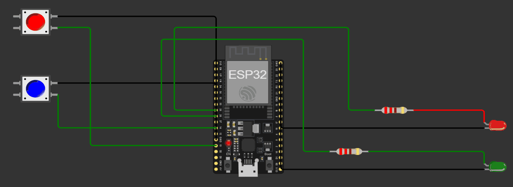

El circuito de arriba es el esquema de referencia que acompaña esa directiva, pensado para simular en Wokwi la salida de cada detección con un LED rojo y uno verde (cada uno con su resistencia de 220 Ω, bandas rojo-rojo-marrón), apoyado en dos pulsadores para probar cada estado manualmente sin depender de la cámara. Como COCO ya trae las clases `"car"` y `"motorcycle"`, la directiva no necesita entrenar nada: basta con cambiar `OBJETIVOS`. Por eso `deteccion_pc.py` acepta la opción `--carro-moto`, que detecta carro (primer carácter, GPIO25: ahí va el LED rojo) y moto (segundo carácter, GPIO26: el LED verde) con el mismo protocolo y el mismo `esp32_leds.py`, sin tocar el circuito más allá de poner LEDs de esos colores en las mismas posiciones:

```
entorno\Scripts\python deteccion_pc.py --carro-moto
```

Los dos pulsadores del esquema de Wokwi no se agregaron: su función, probar cada estado sin cámara, la cumple el modo sin ESP32 del propio script. Aun así, la demostración grabada se hizo con silla y celular, y esa sigue siendo la opción por defecto. La razón es la cámara y la iluminación que de verdad teníamos para grabar: un carro y una moto de juguete son objetos pequeños, y el modelo nano de YOLOv8 (elegido, como se explica más arriba, para poder correr en tiempo real sin GPU dedicada) pierde confianza de detección con objetos así de chicos apenas la luz del cuarto baja un poco o la webcam pierde foco, algo que pasa seguido con una cámara integrada de laptop y luz ambiente no controlada. Además, el modelo aprendió "carro" y "moto" con fotos de vehículos reales, y un juguete no siempre se les parece lo suficiente. La silla y el celular ocupan mucho más espacio en el cuadro y tienen bastante más contraste contra el fondo, así que el modelo los reconoce de forma confiable bajo las mismas condiciones, en vez de arriesgar detecciones inconsistentes por perseguir un objeto más fiel a la directiva pero más difícil de detectar con el equipo disponible.

## Preparar el entorno en la computadora

Todo el tema vive en esta carpeta, `3-deteccion-objetos`, con su propio entorno virtual de Python llamado `entorno`, para mantener sus librerías separadas de cualquier otra cosa instalada en el sistema. Desde PowerShell, parado dentro de la carpeta:

```
python -m venv entorno
entorno\Scripts\python -m pip install ultralytics opencv-python pyserial
```

Nosotros lo creamos con Python 3.14 y las tres librerías se instalaron sin problema; también se probó desde cero con Python 3.13 y estas versiones: `ultralytics==8.4.121` (con `torch==2.14.1` y `torchvision==0.29.1`), `opencv-python==5.0.0.93` y `pyserial==3.5`. La descarga de PyTorch pesa varios cientos de MB y el script tarda unos 10-30 s en arrancar (lo que más demora es cargar PyTorch), así que no es que se haya colgado. `ultralytics` trae el modelo de YOLO listo para usarse (e instala PyTorch como dependencia), `opencv-python` maneja la cámara y la ventana, y `pyserial` es la que permite que el script de Python hable con el ESP32 por el puerto serial. Usamos siempre `entorno\Scripts\python -m ...` en vez de activar el entorno o llamar a `pip.exe` directamente, porque así funciona aunque la carpeta se haya movido de lugar.

## Cómo probarlo

Todos los comandos se corren desde la carpeta `3-deteccion-objetos`.

**Sin ESP32 conectado**

```
entorno\Scripts\python deteccion_pc.py
```

(o con `--carro-moto` al final). Si no encuentra el puerto, avisa en la consola con `Sin ESP32 (...). Se sigue solo con la vision` y sigue: la ventana muestra la cámara con las cajas de YOLO y, arriba, el estado de cada objetivo, el mensaje de dos caracteres que se le mandaría al ESP32 (`'10'`, `'01'`...) y el modo `SIN ESP32 (solo vision)`. Así se comprueba toda la parte de visión, incluido qué tan bien reconoce el modelo cada objeto con la luz del cuarto, sin tener la protoboard armada. Se sale con `q` sobre la ventana.

*Sin cámara web.* El mismo programa puede leer fotos o un video en vez de la cámara; todo lo demás (YOLO, el mensaje, el envío por serial si hay ESP32) funciona igual:

```
entorno\Scripts\python deteccion_pc.py --imagen
entorno\Scripts\python deteccion_pc.py --carro-moto --imagen
entorno\Scripts\python deteccion_pc.py --imagen foto1.jpg foto2.jpg
entorno\Scripts\python deteccion_pc.py --video grabacion.mp4
entorno\Scripts\python deteccion_pc.py --imagen --vista salida-app --sin-ventana
```

La última línea es la que usa la app («Ver a YOLO»): sin ventana, y con el último cuadro y el estado guardados en `salida-app/` para mostrarlos en la página.

`--imagen` sin archivos usa las fotos de `img/ejemplos/`, que van en un orden pensado para ver el mensaje cambiar cada 3 s: solo el primer objetivo (`'10'`), solo el segundo (`'01'`) y los dos (`'11'`). Así se ve con `--carro-moto`, en la foto que tiene los dos objetivos:

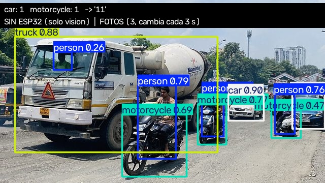

*Sin instalar nada: `preview.html`.* Abriéndolo con doble clic en el navegador se prueba la lógica completa del protocolo sin Python ni ESP32: los botones **silla en cuadro** / **celular en cuadro** hacen de YOLO, el ESP32 de la derecha está simulado con la misma lógica que `esp32_leds.py` y el monitor muestra cada línea que va (`→ 11`) y vuelve (`← LEDS 11`), con el reenvío cada 500 ms. El selector de arriba cambia a carro y moto, y **Usar cámara (COCO-SSD)** corre en el navegador un detector entrenado con las mismas 80 clases de COCO (no es YOLO, pero sirve para ver la idea con la webcam).

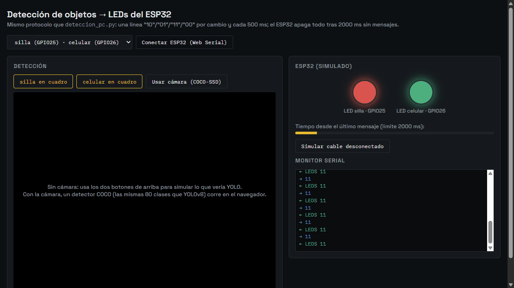

Con **Simular cable desconectado** la página deja de mandar y, a los 2 s, el ESP32 simulado apaga los LEDs y contesta `APAGADO_SEGURIDAD`, igual que el firmware real:

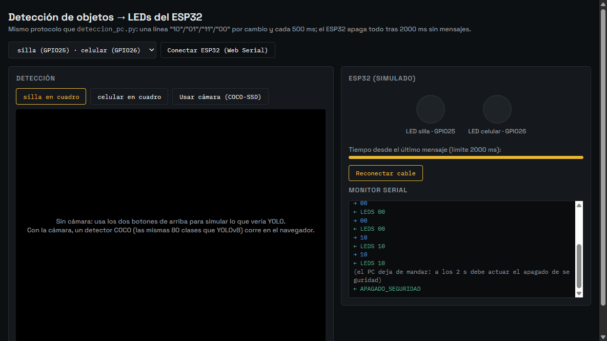

**Con ESP32 conectado**

1. Armar el circuito según la tabla de conexiones.
2. En Thonny, con el ESP32 conectado, abrir `esp32_leds.py` y guardarlo directamente en el ESP32 con el nombre `main.py` (opción de guardar en el dispositivo MicroPython, no en la computadora). Al llamarse `main.py`, el ESP32 lo ejecuta solo cada vez que se reinicia o recibe energía, sin depender de Thonny.
3. Cerrar la conexión de Thonny con la placa (detener el intérprete o cerrar Thonny): el puerto serial solo lo puede tener abierto un programa a la vez.
4. Revisar en el Administrador de dispositivos, sección Puertos (COM y LPT), qué número de puerto tiene el ESP32, y ponerlo en `PUERTO_SERIAL` dentro de `deteccion_pc.py` si no es `COM7`.
5. Correr:

   ```
   entorno\Scripts\python deteccion_pc.py
   ```

La consola dice `ESP32 conectado en COM7.` y se abre la ventana con la cámara. En cuanto aparezca una silla o un celular, el LED correspondiente se enciende casi al instante y se queda encendido mientras el objeto siga en cuadro. La línea `ESP32 dice:` de la ventana muestra la última respuesta cruda (`LEDS 10`, por ejemplo); si se queda en `(nada todavia)`, el ESP32 no está recibiendo o no tiene `main.py` corriendo. Al cerrar el script con `q` los LEDs se apagan de inmediato (se manda `00`), y si en cambio se desconecta el cable o se mata el script, se apagan solos en menos de dos segundos.

## Problemas de compatibilidad

Estas son las trabas más probables al repetir este proyecto en Windows:

- **Ultralytics instala PyTorch como dependencia**, y ese paquete pesa varios cientos de megabytes, así que la primera instalación tarda bastante y puede fallar a mitad de camino con una conexión lenta o inestable; si eso pasa, basta con volver a correr el mismo `pip install` para que retome la descarga.
- **`yolov8n.pt` se descarga solo la primera vez** que se corre el script si el archivo no está en la carpeta, así que esa primera ejecución necesita internet aunque las detecciones posteriores no. El archivo no se sube al repositorio (pesa 6 MB y `ultralytics` lo baja solo, idéntico): queda en la carpeta tras la primera ejecución y el `.gitignore` del tema lo excluye.
- **Versiones muy nuevas de Python** pueden no tener todavía wheels precompilados de alguna librería, igual que le pasó a pyaudio en el tema del chatbot con Python 3.14. A nosotros PyTorch sí se nos instaló con 3.14, pero si `pip install ultralytics` intenta compilar algo desde código fuente en vez de bajar un wheel ya armado, es señal de que conviene crear el entorno con una versión un poco más antigua y probada, como 3.12 (`py -3.12 -m venv entorno`).
- **`cv2.VideoCapture(0)` puede abrir la cámara equivocada** en computadoras con más de una cámara (por ejemplo una integrada y una USB), o puede tardar varios segundos en inicializar en Windows; si la ventana no aparece o aparece en negro, vale la pena probar con otro índice (`1`) o con `cv2.VideoCapture(0, cv2.CAP_DSHOW)` para forzar el backend DirectShow.
- **El puerto serial solo lo puede tener abierto un programa a la vez**: si Thonny se queda con la conexión activa al ESP32, `serial.Serial(...)` falla con un error de acceso denegado aunque el puerto elegido sea el correcto (el script entonces sigue en modo sin ESP32 y lo avisa).
- **Carpetas sincronizadas por OneDrive**: cuando este repositorio vivía dentro de OneDrive, la sincronización en tiempo real interfería con instalaciones de pip que escriben muchos archivos pequeños de golpe (nos pasó instalando las librerías del chatbot) y dejaba algún paquete a medio instalar. Si aparece un `ModuleNotFoundError` de algo que se acaba de instalar, reinstalar ese paquete suele bastar; lo que lo resolvió de fondo fue sacar el proyecto de OneDrive.

## Demostración en funcionamiento

Además del gif del principio, así se ve el montaje desde otro ángulo, con la computadora reconociendo el teléfono y los LEDs encendiéndose en la protoboard:

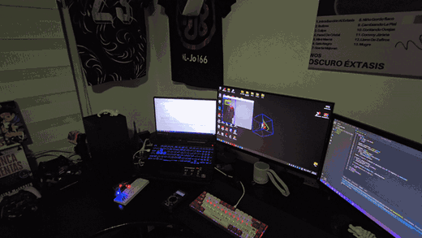

La ventana de detección marcando los objetos que YOLO reconoce frente a la cámara, junto con la puntuación de confianza de cada uno, reconociendo la silla y el teléfono:

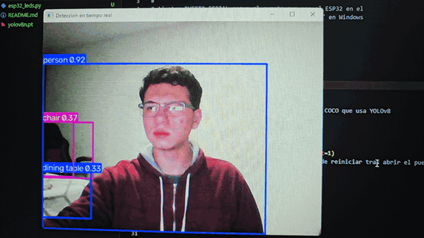

La protoboard en reposo, reconociendo la silla con una sensibilidad muy alta:

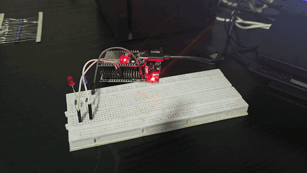

Y la protoboard con los LEDs encendidos en el momento en que la cámara reconoce alguno de los objetos configurados:

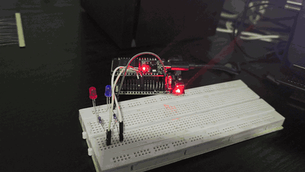

## Pendiente

- Los gifs de arriba son de la versión que mandaba el estado solo al cambiar. Falta grabar un video corto con la versión actual (repetición cada 500 ms), donde se vea el LED quedarse encendido con la silla quieta más de dos segundos y apagarse solo al cerrar el script.
- Falta un video con `--carro-moto` usando un carro y una moto de juguete, con el LED rojo en GPIO25 y el verde en GPIO26.

## Créditos de las fotos de ejemplo

Las fotos de `img/ejemplos/` vienen de Wikimedia Commons, reducidas a 640 px o menos para que pesen poco y quepan en la pantalla (la de silla y celular es la unión de dos de ellas):

- `ejemplo-silla.jpg`: [Japanese police interrogation room - movie set - October 2014](https://commons.wikimedia.org/wiki/File:Japanese_police_interrogation_room_-_movie_set_-_October_2014.jpg), de nesnad, [CC BY 3.0](https://creativecommons.org/licenses/by/3.0/).
- `ejemplo-celular.jpg`: [Businessman holds smartphone while sitting with a laptop closeup](https://commons.wikimedia.org/wiki/File:Businessman_holds_smartphone_while_sitting_with_a_laptop_closeup.jpg), de Shixart1985, [CC BY 2.0](https://creativecommons.org/licenses/by/2.0/).
- `ejemplo-silla-y-celular.jpg`: las dos anteriores, una encima de la otra (mismas licencias).
- `ejemplo-carro.jpg`: [20250123 174548 Car accident from West in Dali, Taichung](https://commons.wikimedia.org/wiki/File:20250123_174548_Car_accident_from_West_in_Dali,_Taichung.jpg), de Saimmx, CC0.
- `ejemplo-moto.jpg`: [GD Zhongshan Dong District XingZheng Road police motorbike parking August 2024 R12S 01](https://commons.wikimedia.org/wiki/File:GD_%E5%BB%A3%E6%9D%B1_ZS_%E4%B8%AD%E5%B1%B1%E5%B8%82_Zhongshan_%E6%9D%B1%E5%8D%80_Dong_District_%E8%88%88%E6%94%BF%E8%B7%AF_XingZheng_Road_police_motorbike_parking_August_2024_R12S_01.jpg), de HHAFOL Moratim LUNG, CC0.
- `ejemplo-carro-y-moto.jpg`: [Mix of traffic on Pune roads](https://commons.wikimedia.org/wiki/File:Mix_of_traffic_on_Pune_roads.jpg), de Ganesh Dhamodkar, [CC BY 4.0](https://creativecommons.org/licenses/by/4.0/).
