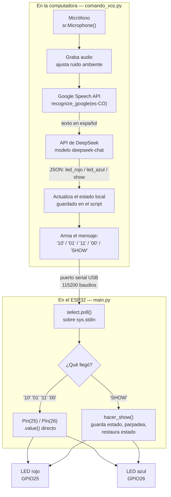
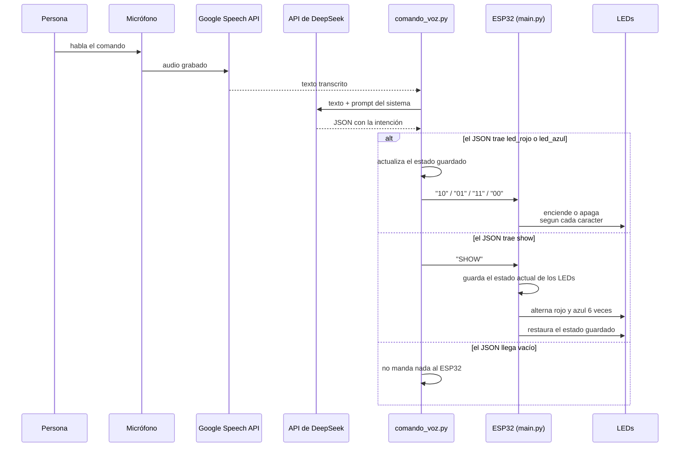
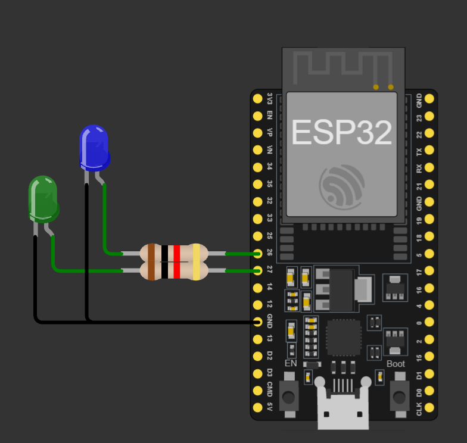
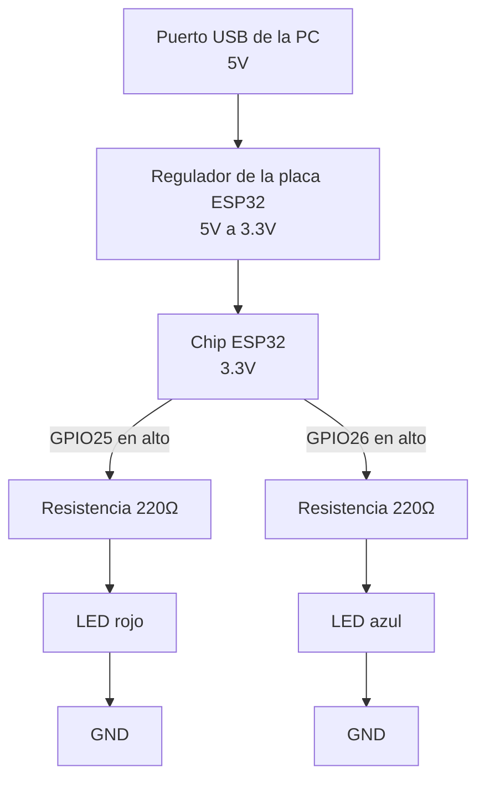

# Chatbot: asistente de voz

Basado en [chatbot.py](https://github.com/dialejobv/U_Militar/blob/main/3%29%20chatbot/chatbot.py), un cliente básico de línea de comandos para la API de DeepSeek. La instrucción sobre esa base fue: teniendo presente ese repositorio, generar un chatbot domótico orientado a encender y apagar un LED por medio de comandos de voz. Este proyecto extiende esa idea original a dos LEDs sobre un ESP32, agregando reconocimiento de voz, interpretación de intención en JSON y un show de luces como comando adicional.

## La idea general

Este proyecto enciende y apaga dos LEDs conectados a un ESP32 a partir de comandos hablados. Una persona habla frente al micrófono de la computadora, lo que dice se transcribe a texto, ese texto se le manda a un modelo de lenguaje a través de la API de DeepSeek, el modelo interpreta qué se le está pidiendo, y la computadora traduce esa interpretación en una orden concreta que le manda al ESP32 por cable USB.



Vista de forma dinámica, así se comporta un comando de voz típico a lo largo del tiempo, incluyendo la rama donde el comando pedido es el show de luces:



La API de DeepSeek vive en un servidor en la nube, así que llamarla siempre necesita internet en ese momento puntual. El ESP32 en cambio no necesita ninguna conexión inalámbrica propia, se queda escuchando el cable USB todo el tiempo sin saber ni necesitar saber de dónde viene la orden que recibe.

## El armado físico

Se necesitan dos LEDs, dos resistencias de 220 ohmios, una protoboard, el propio ESP32 y algunos cables macho a macho o macho a hembra según el tipo de protoboard que se use.



El diagrama de arriba es un esquema genérico del tipo de circuito, dos LEDs con su resistencia en serie yendo hacia un par de pines del ESP32 y GND compartido. En el armado real de este proyecto los pines usados y los colores de LED son los que muestra la tabla siguiente, no los del diagrama.

| Pin del ESP32 | Va hacia | A través de | Qué controla |
|---|---|---|---|
| GPIO25 | Ánodo (pata larga) del LED rojo | Resistencia de 220 Ω | `LED_ROJO` en `esp32_voz.py` |
| GPIO26 | Ánodo (pata larga) del LED azul | Resistencia de 220 Ω | `LED_AZUL` en `esp32_voz.py` |
| GND | Cátodo (pata corta) de ambos LEDs | Directo, sin resistencia | Retorno común de la corriente |
| USB | — | Cable de datos y de energía | Alimentación del chip y comunicación serial con la PC |

Ambos GPIO son pines de propósito general del ESP32, sin restricciones especiales de arranque ni de memoria flash, así que son una elección segura para esta clase de proyecto. En cada LED, la pata larga, el ánodo, va conectada a través de su resistencia hacia el pin del ESP32 correspondiente, y la pata corta, el cátodo, va directamente a GND. La resistencia puede ir antes o después del LED dentro de esa misma línea, el orden no afecta el resultado porque están en serie.

El valor de 220 ohmios sale de calcular cuánta corriente puede pasar sin forzar ni al LED ni al pin del ESP32. El chip trabaja a 3.3 voltios, un LED típico cae alrededor de 2 voltios cuando está encendido, así que quedan aproximadamente 1.3 voltios por repartir en la resistencia, y con esa resistencia la corriente resultante queda cerca de los 6 miliamperios, un valor bajo y seguro tanto para el LED como para el pin, que en el ESP32 no debería superar los 20 miliamperios de forma sostenida.

### Alimentación

Todo el circuito se alimenta desde el mismo cable USB que lleva los comandos: la computadora le manda 5 voltios al ESP32 por ese cable, y el regulador que trae integrado la placa los convierte a los 3.3 voltios con los que en realidad trabaja el chip por dentro. No hace falta ninguna fuente externa ni batería, porque tanto el ESP32 como los dos LEDs, que consumen apenas unos miliamperios cada uno, quedan cómodamente dentro de lo que cualquier puerto USB puede entregar. Los LEDs no se alimentan desde una fuente aparte, sino directamente desde los pines GPIO25 y GPIO26 puestos en alto por el propio ESP32.



## Por qué usar un modelo de lenguaje en vez de simplemente buscar palabras clave

Se podría resolver esto revisando si el texto transcrito contiene la palabra encender o apagar junto con el color mencionado, pero ese enfoque se rompe apenas alguien cambia ligeramente la forma de pedirlo. Prende el rojo, activa la luz roja, dale al led rojo, enciéndeme el de color rojo, todas esas frases significan exactamente lo mismo pero ninguna coincide con las otras palabra por palabra, y escribir reglas para cubrir cada variación posible del lenguaje hablado es una tarea que crece sin fin. Delegarle esa interpretación a un modelo de lenguaje como el de DeepSeek resuelve ese problema de raíz, porque el modelo entiende la intención sin importar cómo esté formulada la frase, y además distingue cuándo la persona está pidiendo algo sobre los LEDs de cuando está diciendo algo completamente distinto que no debería activar nada.

El detalle técnico que hace que esto funcione de forma confiable es no dejar que el modelo responda con una frase libre en lenguaje natural, porque un programa no puede interpretar de forma segura una respuesta como listo, ya prendí el rojo para ti. En vez de eso, la petición a la API se hace pidiéndole explícitamente que devuelva un objeto en formato JSON, usando el parámetro response_format que ofrece la API para forzar ese comportamiento, con instrucciones precisas sobre qué claves puede incluir y qué significa cada una. El script en la computadora nunca necesita entender lenguaje natural por su cuenta, solo lee ese JSON estructurado y actúa según lo que diga.

Otro detalle importante del diseño es que el modelo solo incluye en su respuesta las claves que el comando menciona explícitamente. Si alguien dice enciende el rojo, la respuesta trae únicamente la clave del LED rojo, sin mencionar el azul para nada, y el script en la computadora mantiene por su cuenta un estado guardado de cómo está cada LED, actualizando solo la parte que cambió. Esto evita que el modelo asuma por error que hay que apagar algo que la persona nunca mencionó, simplemente porque no lo nombró en esa frase.

## El show de luces

Si el comando de voz incluye algo como haz un show de luces o pon un espectáculo, el modelo devuelve la clave show en vez de las claves de los LEDs individuales, y el script en la computadora le manda al ESP32 la palabra SHOW en vez de las dos cifras que normalmente indican el estado de cada LED.

Del lado del ESP32, antes de arrancar la secuencia de parpadeo, el programa guarda en qué estado estaba cada LED en ese momento. Después hace alternar el LED rojo y el azul varias veces seguidas, con una pequeña pausa entre cada cambio, y al terminar la secuencia devuelve ambos LEDs exactamente al estado en el que estaban antes del show, en vez de dejarlos apagados. Esto importa porque si el rojo ya estaba encendido antes de pedir el show, se espera que siga encendido después de que termine el espectáculo, no que se apague solo porque el show terminó.

## El código, paso a paso

### El único puerto que se usa: el serial

Todo el proyecto habla por un solo puerto, el serial que expone el cable USB del ESP32 (`PUERTO_SERIAL = "COM7"` en `comando_voz.py`, aunque en cada computadora puede tocar otro número, y `BAUDIOS = 115200` en ambos lados para que hablen a la misma velocidad). No hay ningún otro puerto ni protocolo de por medio entre la computadora y el ESP32: no hay WiFi, Bluetooth ni un servidor corriendo en el chip. La única conexión de red del proyecto es la que hace la computadora hacia afuera, primero hacia los servidores de reconocimiento de voz de Google y después hacia la API de DeepSeek; el ESP32 nunca sabe que esos servicios existen, solo recibe texto corto por ese puerto serial.

### Las tres claves posibles del JSON que devuelve DeepSeek

El modelo solo puede responder con un objeto JSON que incluya, como máximo, estas tres claves, cada una opcional:

| Clave | Cuándo aparece | Qué hace el script con ella |
|---|---|---|
| `led_rojo` | El comando menciona el LED rojo | Actualiza `estado["led_rojo"]` a `true` o `false` según pida encenderlo o apagarlo |
| `led_azul` | El comando menciona el LED azul | Actualiza `estado["led_azul"]` a `true` o `false` de la misma forma |
| `show` | El comando pide un show de luces | Si viene en `true`, se ignoran las otras claves y se manda directamente `"SHOW"` al ESP32 |

Si ninguna de las tres aparece, la respuesta es un JSON vacío, `aplicar_comando` no encuentra nada que hacer y el script sigue esperando el siguiente comando sin tocar el puerto serial.

### `comando_voz.py`, función por función

- **`escuchar_comando()`**: abre el micrófono con `sr.Microphone()`, ajusta el umbral de ruido ambiente con `adjust_for_ambient_noise` y graba con `listen()` hasta que detecta que la persona dejó de hablar. Manda ese audio a `recognize_google(audio, language="es-CO")`, que lo transcribe usando el servicio gratuito de Google. Si no logra entender nada devuelve `None`, y si el servicio no responde por falta de conexión, también.
- **`interpretar_comando(texto)`**: arma la petición a la API de DeepSeek con dos mensajes, el `PROMPT_SISTEMA` fijo que define las reglas del JSON y el texto transcrito como mensaje del usuario, usando `response_format={"type": "json_object"}` para forzar una respuesta en JSON válido. Devuelve ese JSON ya convertido a diccionario de Python con `json.loads`.
- **`aplicar_comando(datos)`**: revisa primero si vino `show`; si sí, manda `"SHOW"` y termina ahí. Si no, actualiza el diccionario `estado` solo con las claves que sí llegaron, arma la línea de dos caracteres a partir de ese estado completo y la manda por el puerto serial.
- **El bucle en `if __name__ == "__main__"`**: queda esperando que se presione Enter para grabar, permite escribir `salir` para terminar, y encadena las tres funciones anteriores una detrás de otra en cada vuelta.

### `esp32_voz.py`, guardado como `main.py` en el ESP32

- **Configuración de pines** (`Pin(25, Pin.OUT)`, `Pin(26, Pin.OUT)`): declara los dos GPIO como salidas y los apaga de entrada, para no arrancar con un estado indefinido.
- **`select.poll()` sobre `sys.stdin`**: igual que revisar un buzón sin quedarse pegado esperando, `sondeo.poll(100)` pregunta cada 100 milisegundos si llegó algo nuevo por el puerto serial, sin bloquear el resto del programa mientras no hay nada.
- **`hacer_show()`**: lee el valor actual de cada pin con `.value()` y lo guarda, alterna rojo y azul seis veces con una pausa de 0.2 segundos entre cada cambio usando `time.sleep(0.2)`, y al final vuelve a poner cada pin en el valor que tenía guardado, para no perder el estado previo.
- **El bucle principal**: por cada línea que llega revisa primero si es exactamente `"SHOW"`, y si no, si tiene el formato de dos caracteres `"0"`/`"1"` esperado; cualquier otra cosa se ignora en silencio, sin intentar interpretar mensajes corruptos o incompletos.

## Preparar el entorno

Todo esto va en su propia carpeta, con su propio entorno virtual de Python, para mantener sus librerías separadas de cualquier otra cosa instalada en el sistema. Un detalle importante antes de crear ese entorno, tiene que ser con Python 3.12 y no con una versión más nueva como 3.13 o 3.14, por una razón concreta que se explica más abajo en la sección de problemas, así que el comando para crear el entorno queda apuntando a esa versión específica:

```
py -3.12 -m venv entorno
.\entorno\Scripts\Activate
pip install openai pyserial SpeechRecognition pyaudio python-dotenv
```

Cada una de estas librerías cubre una parte distinta del proceso. La librería openai es la que habla con la API de DeepSeek, y funciona porque DeepSeek diseñó su API para ser compatible con el mismo formato que usa OpenAI, así que el mismo cliente sirve para ambas, solo cambiando la dirección del servidor al que apunta y la clave que usa para autenticarse. SpeechRecognition maneja la parte de convertir audio en texto, y cuando se usa su función recognize_google, manda el audio grabado a los servidores de reconocimiento de voz de Google de forma gratuita, sin necesitar una clave de API propia para eso, lo cual significa que esa parte también depende de tener conexión a internet en el momento de hablar. pyaudio es la librería que le da a Python acceso directo al micrófono del sistema operativo, y python-dotenv es la que permite cargar la clave de la API de DeepSeek desde un archivo aparte en vez de dejarla escrita directamente dentro del código fuente.

La clave de la API nunca debe quedar escrita dentro de un archivo que se vaya a subir a GitHub, porque el repositorio es público y cualquiera podría copiarla y empezar a hacer llamadas a la API a nombre tuyo, consumiendo el saldo de tu cuenta sin que lo sepas. Para evitar eso, la clave se guarda en un archivo llamado .env, dentro de esta misma carpeta, con una sola línea así:

```
DEEPSEEK_API_KEY=tu_clave_aqui
```

Ese archivo .env no se sube nunca al repositorio, y para eso hay que agregar la línea .env al archivo .gitignore de la raíz del repositorio, así git lo ignora automáticamente sin importar en qué carpeta aparezca. El archivo .env.example que sí viene incluido en esta carpeta sirve como plantilla, mostrando qué formato debe tener el archivo real sin exponer ninguna clave verdadera.

En Windows, instalar pyaudio a veces falla directamente con pip porque el paquete necesita compilar código nativo en el sistema, algo para lo que normalmente hace falta tener herramientas de compilación instaladas que la mayoría de computadoras no traen por defecto. Si eso pasa, la alternativa más simple es instalar una versión ya compilada del paquete con:

```
pip install pipwin
pipwin install pyaudio
```

## Cómo correrlo

Con el ESP32 conectado por USB, se abre el archivo esp32_voz.py de esta carpeta en Thonny y se guarda directamente en el dispositivo con el nombre main.py, para que se ejecute automáticamente cada vez que el ESP32 se reinicie o se conecte a la energía. Guardado ese archivo, hay que cerrar la conexión de Thonny con el dispositivo, porque el puerto serial solo puede estar abierto por un programa a la vez, y el siguiente paso necesita ese mismo puerto libre para la computadora.

Del lado de la computadora, con el entorno virtual activado y el archivo .env ya con la clave puesta, se revisa que el número de puerto serial dentro de comando_voz.py corresponda al que muestra el Administrador de dispositivos, y se corre con:

```
python comando_voz.py
```

El script queda esperando a que se presione Enter para empezar a escuchar por el micrófono. Al decir el comando en voz alta, en cuanto se detecta que la persona dejó de hablar la grabación se corta sola y arranca el proceso completo, primero la transcripción, después la consulta a la API de DeepSeek, y finalmente el envío de la orden resultante al ESP32. Todo ese recorrido toma normalmente uno o dos segundos, la mayor parte del tiempo consumida por la respuesta de la API, así que el encendido del LED no es instantáneo pero sí bastante rápido para tratarse de una cadena que pasa por dos servicios en internet antes de llegar al chip.

## Problemas encontrados

Poner esto a funcionar en Windows tomó varias vueltas, y vale la pena dejarlas anotadas porque cualquiera que repita el proyecto probablemente se va a topar con las mismas.

La primera fue correr el script con el Python global del sistema en vez del que vive dentro del entorno virtual del proyecto. Aunque las librerías ya estaban instaladas dentro de entorno, al lanzar el script apuntando directamente a un intérprete distinto, como el de una instalación global de Python en otra carpeta, ese intérprete no tiene ni idea de que esas librerías existen, y el script revienta apenas intenta importar la primera de ellas.

La segunda fue una instalación parcial de las cinco librerías necesarias. Al instalarlas todas en una sola línea con pip, si una de ellas falla a mitad de camino, como pyaudio compilando desde código fuente, pip puede cortar el resto de la lista antes de llegar a instalar las que faltaban, dejando el entorno con solo una parte de lo necesario sin que sea evidente a simple vista.

La tercera fue confundir el archivo .env.example con el archivo .env real. python-dotenv por defecto solo lee un archivo que se llame exactamente .env, así que tener nada más la plantilla de ejemplo en la carpeta hace que la clave nunca se cargue, y el script truena con un KeyError al intentar leer la variable de entorno que nunca quedó definida.

La cuarta fue un error de edición donde terminó pegado el valor real de la clave de la API en el lugar del código donde debía ir el nombre de la variable de entorno, dentro de os.environ. Python entonces intenta buscar una variable de entorno que se llame literalmente igual a la clave, no la encuentra porque eso no es un nombre de variable sino un valor, y truena con el mismo tipo de KeyError. Esto además dejó la clave real expuesta por fuera del archivo .env, así que tocó revocarla y generar una nueva.

La quinta, y la más profunda, fue que pyaudio no lograba instalarse en el entorno creado con Python 3.14. En PyPI, PyAudio 0.2.14 todavía no tiene wheels precompilados para Python 3.14 por ser una versión demasiado nueva, así que pip intenta compilarlo desde el código fuente, y esa compilación necesita el header portaudio.h de la librería PortAudio instalada en el sistema, que no está presente, así que la instalación termina en un error de compilador sin encontrar ese archivo. La solución fue crear el entorno virtual del proyecto apuntando explícitamente a una versión de Python donde sí existen esos wheels ya compilados, en este caso Python 3.12, dejando la instalación global de Python 3.14 intacta para todo lo demás.

La sexta fue un ModuleNotFoundError sobre pydantic_core, la parte binaria compilada de la que depende pydantic y, a través de ella, la librería openai. La carpeta del proyecto vivía dentro de OneDrive, y la sincronización en tiempo real de OneDrive puede interferir justo cuando pip está escribiendo muchos archivos pequeños de golpe durante una instalación, dejando algún archivo binario a medias o movido en mal momento. Reinstalar el paquete forzando una descarga limpia, y sacar la carpeta del proyecto de OneDrive hacia una ruta local normal, resolvió el problema de fondo.

## Demostración en funcionamiento

Con todo lo anterior resuelto, esta es una corrida real dando los comandos por voz uno detrás de otro, prender el rojo, prender también el azul, pedir el show de luces, y apagar los dos al final.


