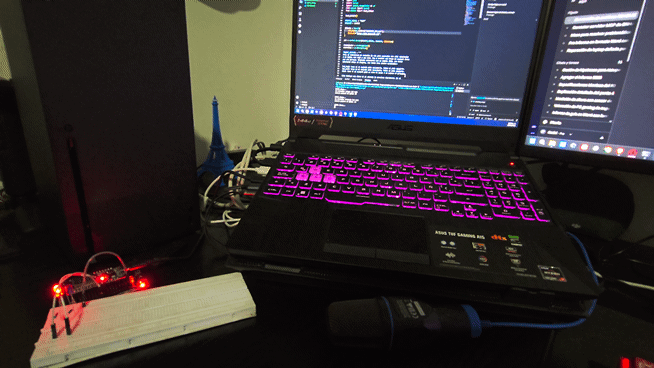
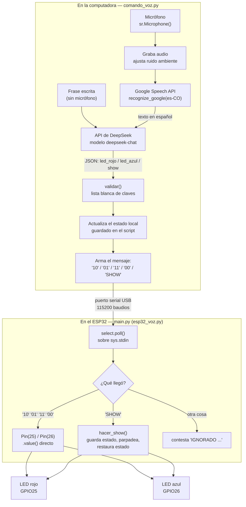
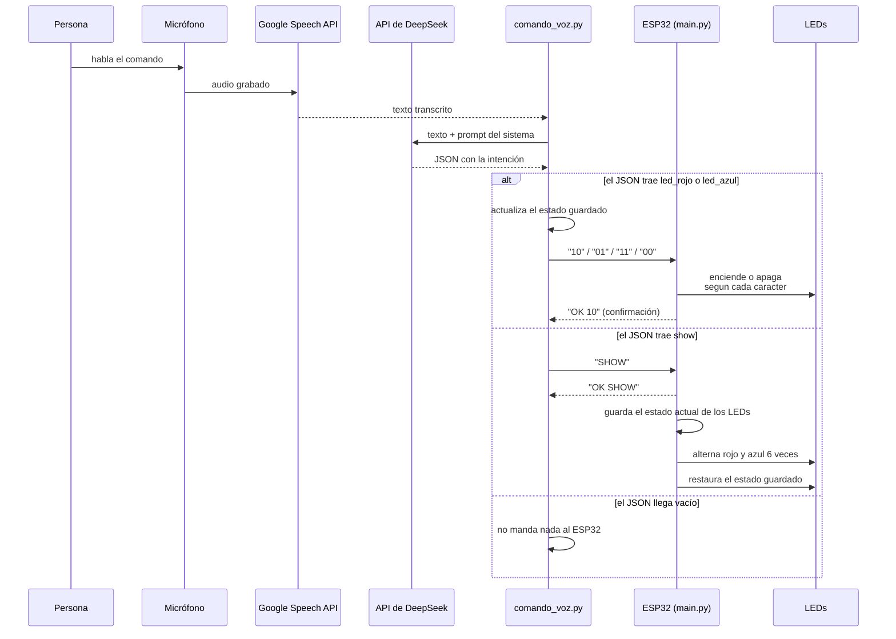
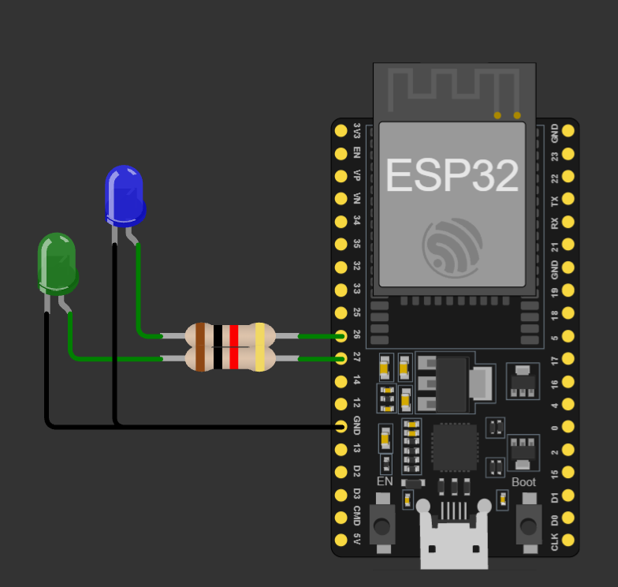
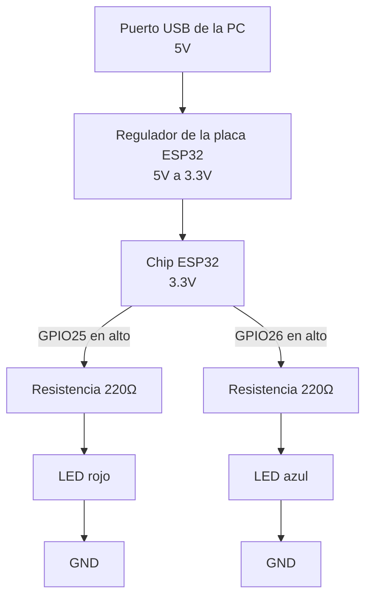
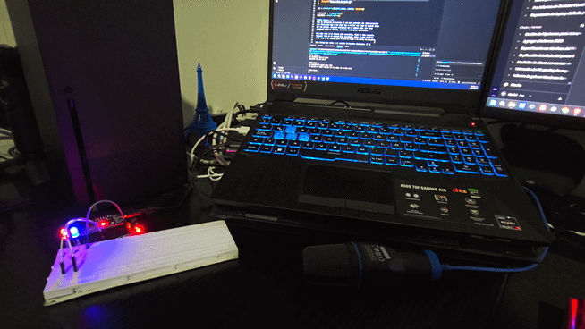
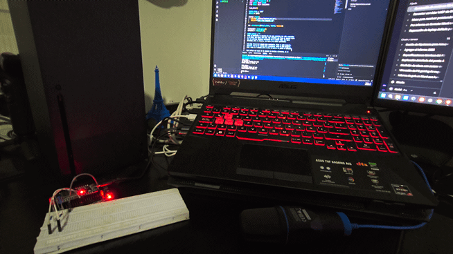
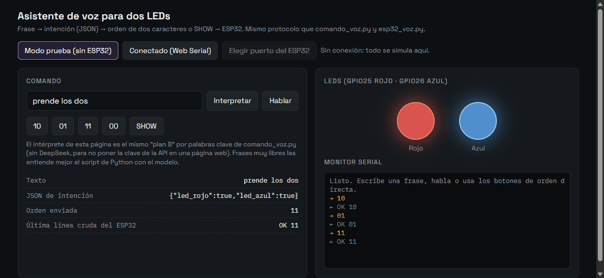
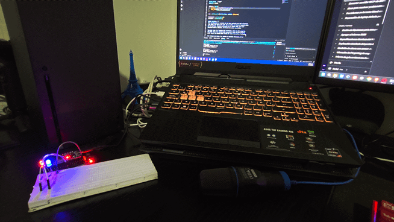

# Chatbot: asistente de voz

Basado en [chatbot.py](https://github.com/dialejobv/U_Militar/blob/main/3%29%20chatbot/chatbot.py), un cliente básico de línea de comandos para la API de DeepSeek.

## Qué pedía la actividad y qué quedó

El `chatbot.py` del profesor es un chat de consola: uno escribe una pregunta, el script se la manda a la API de DeepSeek y muestra la respuesta en texto. La instrucción sobre esa base fue: teniendo presente ese repositorio, generar un chatbot domótico orientado a encender y apagar un LED por medio de comandos de voz.

Lo que armamos controla **dos LEDs** (uno rojo y uno azul) conectados a un ESP32. Uno le habla al micrófono de la computadora ("enciende el rojo", "prende los dos", "apaga el azul"), la frase se transcribe a texto, un modelo de lenguaje de DeepSeek entiende qué se pidió y lo devuelve como datos estructurados, y la computadora le manda la orden al ESP32 por el cable USB. El ESP32 prende o apaga los LEDs y contesta `OK` para confirmar. Agregamos además un comando extra, **el show de luces**, que hace parpadear los dos LEDs alternados y después los deja como estaban.



El asistente responde con acciones (los LEDs) y con texto en la consola; no habla de vuelta, es decir, no hay síntesis de voz: la voz solo se usa como entrada.

## Qué es el reconocimiento de voz

El reconocimiento de voz (en inglés *speech-to-text*) es convertir audio hablado en texto escrito. Por dentro, un modelo entrenado con miles de horas de grabaciones con su transcripción aprende a asociar los sonidos del idioma con palabras, y usa el contexto de la frase para decidir entre palabras que suenan parecido. Es lo mismo que hace el teclado del celular cuando uno le dicta.

En este proyecto no corremos ese modelo en la computadora: la librería `SpeechRecognition` graba el audio del micrófono y, con su función `recognize_google`, lo manda a los servidores de reconocimiento de voz de Google, que son gratuitos para este uso y no piden clave. Le pedimos el idioma `es-CO` (español de Colombia) para que entienda mejor nuestro acento. La consecuencia práctica es que esta parte **necesita internet** en el momento de hablar. La librería también se encarga de algo que parece menor pero es clave: saber cuándo empezó y cuándo terminó la frase, midiendo el ruido de fondo y cortando la grabación sola cuando detecta silencio.

## Qué es un LLM y qué es DeepSeek

Un LLM, o modelo de lenguaje grande, es una red neuronal entrenada con cantidades enormes de texto para predecir, palabra por palabra, cuál es la continuación más probable de una frase. De ese entrenamiento tan masivo surge, casi como efecto secundario, la capacidad de entender la intención detrás de una instrucción escrita en lenguaje natural, sin que nadie tenga que programar a mano reglas gramaticales ni listas de sinónimos. Es la misma familia de tecnología detrás de asistentes como ChatGPT, solo que aquí se usa un modelo distinto, más barato de consultar por API, para resolver un problema mucho más acotado que sostener una conversación libre: decidir si una frase pide encender o apagar un LED.

DeepSeek es una compañía china que desarrolla sus propios LLM y los expone a través de una API de pago por uso, con un diseño deliberadamente compatible con el mismo formato de peticiones que usa la API de OpenAI. Gracias a eso, este proyecto puede usar la librería oficial `openai` sin modificarla, apuntándola a la dirección del servidor de DeepSeek y a una clave de API de DeepSeek en vez de una de OpenAI, y todo lo demás, los mensajes, los roles, el formato de la respuesta, funciona exactamente igual. El modelo puntual usado aquí es `deepseek-chat`, sin necesidad de correr nada de forma local ni de tener una GPU propia, porque todo el cómputo pesado ocurre en los servidores de DeepSeek y la computadora del proyecto solo manda una petición HTTP y espera la respuesta.

## Qué es una API, una clave de API y el archivo `.env`

Una **API** es una puerta que un servicio deja abierta para que otros programas lo usen: en vez de entrar a una página web y escribir en un cuadro de texto, nuestro script le manda por internet un mensaje con un formato acordado y recibe la respuesta en otro formato acordado. Una **clave de API** es como la contraseña de esa puerta: identifica a quién se le cobra cada consulta. Por eso nunca puede quedar escrita dentro del código que se sube a GitHub; el repositorio es público y cualquiera podría copiarla y gastar el saldo de la cuenta.

La clave se guarda en un archivo aparte llamado `.env`, en esta misma carpeta, con una sola línea `DEEPSEEK_API_KEY=...`. La librería `python-dotenv` lee ese archivo al arrancar (`load_dotenv()`) y copia la línea a las variables de entorno del proceso, de donde el script la toma con `os.environ.get("DEEPSEEK_API_KEY")`. El `.env` está en el `.gitignore` de la raíz del repositorio, así que git lo ignora siempre; lo que sí se sube es `.env.example`, una plantilla con el valor de relleno `tu_api_key_aqui` que muestra el formato sin exponer ninguna clave real.

## Qué es JSON y el prompt de sistema

**JSON** es un formato de texto para escribir datos con estructura, con pares de clave y valor entre llaves, por ejemplo `{"led_rojo": true}`. Cualquier lenguaje lo sabe leer: en Python, `json.loads` lo convierte en un diccionario. Es lo contrario a una frase libre como "listo, ya prendí el rojo", que un programa no puede interpretar de forma segura.

Cuando se le escribe a un LLM por API, se le pueden mandar mensajes con distintos **roles**. El mensaje con rol `user` es lo que dijo la persona; el mensaje con rol `system`, el **prompt de sistema**, son las reglas del juego que el modelo debe seguir en toda la conversación. Nuestro prompt de sistema le dice que es un intérprete de comandos para dos LEDs y que responda **únicamente** con un JSON de hasta tres claves (`led_rojo`, `led_azul`, `show`), o un JSON vacío si la frase no tiene nada que ver. Además la petición lleva `response_format={"type": "json_object"}`, una opción de la API que obliga al modelo a devolver JSON válido.

## La idea general

Este proyecto enciende y apaga dos LEDs conectados a un ESP32 a partir de comandos hablados. Una persona habla frente al micrófono de la computadora, lo que dice se transcribe a texto, ese texto se le manda a un modelo de lenguaje a través de la API de DeepSeek, el modelo interpreta qué se le está pidiendo, y la computadora traduce esa interpretación en una orden concreta que le manda al ESP32 por cable USB.


```mermaid
flowchart TD
    subgraph PC["En la computadora — comando_voz.py"]
        Mic["Micrófono<br/>sr.Microphone()"] --> Graba["Graba audio<br/>ajusta ruido ambiente"]
        Teclado["Frase escrita<br/>(sin micrófono)"] --> DeepSeek
        Graba --> STT["Google Speech API<br/>recognize_google(es-CO)"]
        STT -->|"texto en español"| DeepSeek["API de DeepSeek<br/>modelo deepseek-chat"]
        DeepSeek -->|"JSON: led_rojo / led_azul / show"| Valida["validar()<br/>lista blanca de claves"]
        Valida --> Estado["Actualiza el estado local<br/>guardado en el script"]
        Estado --> Armado["Arma el mensaje:<br/>'10' / '01' / '11' / '00' / 'SHOW'"]
    end

    Armado -->|"puerto serial USB<br/>115200 baudios"| Escucha

    subgraph ESP["En el ESP32 — main.py (esp32_voz.py)"]
        Escucha["select.poll()<br/>sobre sys.stdin"] --> Decide{"¿Qué llegó?"}
        Decide -->|"'10' '01' '11' '00'"| Pines["Pin(25) / Pin(26)<br/>.value() directo"]
        Decide -->|"'SHOW'"| Show["hacer_show()<br/>guarda estado, parpadea,<br/>restaura estado"]
        Decide -->|"otra cosa"| Ignora["contesta 'IGNORADO ...'"]
    end

    Pines --> LedRojo["LED rojo<br/>GPIO25"]
    Pines --> LedAzul["LED azul<br/>GPIO26"]
    Show --> LedRojo
    Show --> LedAzul
```

Vista de forma dinámica, así se comporta un comando de voz típico a lo largo del tiempo, incluyendo la rama donde el comando pedido es el show de luces:


```mermaid
sequenceDiagram
    participant P as Persona
    participant Mic as Micrófono
    participant G as Google Speech API
    participant DS as API de DeepSeek
    participant PC as comando_voz.py
    participant ESP as ESP32 (main.py)
    participant LEDs as LEDs

    P->>Mic: habla el comando
    Mic->>G: audio grabado
    G-->>PC: texto transcrito
    PC->>DS: texto + prompt del sistema
    DS-->>PC: JSON con la intención

    alt el JSON trae led_rojo o led_azul
        PC->>PC: actualiza el estado guardado
        PC->>ESP: "10" / "01" / "11" / "00"
        ESP->>LEDs: enciende o apaga<br/>segun cada caracter
        ESP-->>PC: "OK 10" (confirmación)
    else el JSON trae show
        PC->>ESP: "SHOW"
        ESP-->>PC: "OK SHOW"
        ESP->>ESP: guarda el estado actual de los LEDs
        ESP->>LEDs: alterna rojo y azul 6 veces
        ESP->>LEDs: restaura el estado guardado
    else el JSON llega vacío
        PC->>PC: no manda nada al ESP32
    end
```

La API de DeepSeek y el reconocimiento de Google viven en servidores en la nube, así que la computadora necesita internet en el momento de cada comando. El ESP32 en cambio no necesita ninguna conexión inalámbrica propia: se queda escuchando el cable USB todo el tiempo sin saber ni necesitar saber de dónde viene la orden que recibe.

## Conexiones

Se necesitan el ESP32, dos LEDs (rojo y azul), dos resistencias de 220 Ω, una protoboard, algunos cables y el cable USB de datos. Los pines salen directamente de `esp32_voz.py` (`LED_ROJO = Pin(25, Pin.OUT)` y `LED_AZUL = Pin(26, Pin.OUT)`):

| Componente | Pata del componente | Se conecta a | Voltaje | Resistencia |
|---|---|---|---|---|
| LED rojo | Ánodo (pata larga) | GPIO25 del ESP32, a través de la resistencia | 3,3 V cuando el pin está en alto | 220 Ω en serie |
| LED rojo | Cátodo (pata corta) | GND del ESP32 | 0 V | — |
| LED azul | Ánodo (pata larga) | GPIO26 del ESP32, a través de la resistencia | 3,3 V cuando el pin está en alto | 220 Ω en serie |
| LED azul | Cátodo (pata corta) | GND del ESP32 (el mismo GND compartido) | 0 V | — |
| ESP32 | Conector micro-USB | Puerto USB de la computadora | 5 V de entrada (el regulador de la placa baja a 3,3 V) | — |



El diagrama de arriba es el esquema de referencia en Wokwi del mismo tipo de circuito: dos LEDs, cada uno con su resistencia en serie hacia un pin del ESP32, y los cátodos a un GND compartido. No es idéntico a lo que montamos, y las tres diferencias tienen su razón:

| En el diagrama de Wokwi | En el montaje (y en el código) | Por qué cambió |
|---|---|---|
| LEDs verde y azul | LEDs **rojo** y azul | El asistente entiende órdenes por **color** ("enciende el rojo"): el prompt de DeepSeek, las reglas y el firmware hablan de `led_rojo` y `led_azul`. El LED físico tiene que ser del color que se nombra, si no la demo no tiene sentido. |
| GPIO27 y GPIO26 | **GPIO25** y GPIO26 | Son los pines que manda el código (`Pin(25)` y `Pin(26)`). 25 y 26 quedan uno al lado del otro en la placa, así el cableado del montaje es más corto y ordenado. El 27 también habría servido: ninguno de los tres es pin de arranque. |
| Resistencias de 1 kΩ | **220 Ω** | Con 1 kΩ el LED rojo recibe (3,3 − 1,8) / 1000 ≈ 1,5 mA y se ve tenue, sobre todo en video. Con 220 Ω sube a ≈ 6,8 mA: brilla bien y sigue muy lejos de lo máximo que aguanta un pin del ESP32 (~20 mA recomendado). El azul (caída de ~3 V) pasa de 0,3 a 1,4 mA. |

La forma del circuito, que es lo que muestra el diagrama, es la misma; lo que cambió son valores que no alteran cómo funciona.

**Por qué GPIO25 y GPIO26.** Son pines de propósito general del ESP32 sin ninguna función especial al arrancar. Algunos pines (0, 2, 5, 12 y 15, los llamados *strapping*) deciden con su nivel cómo arranca el chip, y colgarles un LED puede impedir que arranque bien; los pines 6 a 11 están conectados a la memoria flash y no se pueden usar. El 25 y el 26 no tienen ninguno de esos problemas y están uno al lado del otro en la placa. Son además los mismos que usamos en el tema de [detección de objetos](../3-deteccion-objetos), así que la misma protoboard sirve para los dos.

**Por qué 220 Ω.** El chip trabaja a 3,3 V y un LED típico cae alrededor de 2 V encendido, así que quedan aproximadamente 1,3 V en la resistencia. Por la ley de Ohm, I = 1,3 V / 220 Ω ≈ 6 mA, un valor bajo y seguro tanto para el LED como para el pin, que en el ESP32 no debería superar los 20 mA de forma sostenida. La resistencia puede ir antes o después del LED dentro de la misma línea: están en serie, así que el orden no cambia nada.

### Alimentación

Todo el circuito se alimenta desde el mismo cable USB que lleva los comandos: la computadora le manda 5 V al ESP32 por ese cable, y el regulador que trae integrado la placa los convierte a los 3,3 V con los que en realidad trabaja el chip. No hace falta ninguna fuente externa ni batería, porque tanto el ESP32 como los dos LEDs, que consumen apenas unos miliamperios cada uno, quedan cómodamente dentro de lo que cualquier puerto USB puede entregar. Los LEDs se alimentan directamente desde los pines GPIO25 y GPIO26 puestos en alto por el propio ESP32.


```mermaid
flowchart TD
    USB["Puerto USB de la PC<br/>5V"] --> REG["Regulador de la placa ESP32<br/>5V a 3.3V"]
    REG --> ESP["Chip ESP32<br/>3.3V"]
    ESP -->|"GPIO25 en alto"| R1["Resistencia 220Ω"]
    R1 --> L1["LED rojo"]
    L1 --> GND1["GND"]
    ESP -->|"GPIO26 en alto"| R2["Resistencia 220Ω"]
    R2 --> L2["LED azul"]
    L2 --> GND2["GND"]
```

## Qué hace cada archivo

- **`comando_voz.py`**: el programa de la computadora. Escucha el micrófono (o lee una frase escrita), transcribe, le pregunta a DeepSeek la intención, valida el JSON, guarda el estado de los LEDs, le manda la orden al ESP32 y muestra lo que el ESP32 contesta. Es el que se corre cada vez que se quiere usar el asistente.
- **`esp32_voz.py`**: el firmware del ESP32, en MicroPython. Se guarda **una sola vez** en la placa con el nombre `main.py` desde Thonny, y desde ahí arranca solo cada vez que el ESP32 recibe energía. Escucha el puerto serial, mueve los pines 25 y 26, hace el show de luces y contesta `OK ...` o `IGNORADO ...`.
- **`.env.example`**: plantilla del archivo de la clave. Se copia como `.env` y se reemplaza `tu_api_key_aqui` por la clave real de DeepSeek.
- **`.env`**: el archivo real con la clave. Existe solo en la computadora de cada uno y nunca se sube (está en el `.gitignore` de la raíz).
- **`preview.html`**: una página suelta (HTML + JavaScript, sin instalar nada) para probar el asistente en el navegador: el mismo intérprete por palabras clave, el ESP32 simulado con los dos LEDs y un modo conectado por Web Serial. Ver "Cómo probarlo".
- **`probar.json`**: la receta que usa el lanzador `probar.py` de la raíz del repositorio para abrir este tema con un clic (qué entorno crear y qué se puede probar).
- **`diagrama-circuito.png`**: el esquema de referencia del circuito en Wokwi.
- **`img/preview-modo-prueba.png`**: captura de `preview.html` en modo prueba.
- **`demo-*.gif`**: las grabaciones de la demostración.
- **`entorno/`**: el entorno virtual de Python 3.12 de este tema, con `openai`, `pyserial`, `SpeechRecognition`, `pyaudio` y `python-dotenv`. No se sube (tiene su propio `.gitignore` con `*`).

## El protocolo por serial, con los mensajes reales

Igual que en el tema de detección de objetos, todo viaja como líneas de texto cortas terminadas en `\n`, a 115200 baudios, por el USB del ESP32 (que en MicroPython es a la vez `sys.stdin` para leer y la salida de `print` para contestar):

| Dirección | Línea | Qué significa |
|---|---|---|
| PC → ESP32 | `10` | rojo encendido, azul apagado |
| PC → ESP32 | `01` | rojo apagado, azul encendido |
| PC → ESP32 | `11` | los dos encendidos |
| PC → ESP32 | `00` | los dos apagados |
| PC → ESP32 | `SHOW` | correr el show de luces y volver al estado anterior |
| ESP32 → PC | `Esperando comandos de voz por serial...` | el ESP32 acaba de arrancar `main.py` |
| ESP32 → PC | `OK 10` (o `OK 01`, `OK 11`, `OK 00`) | aplicó esa orden a los pines |
| ESP32 → PC | `OK SHOW` | recibió el show; lo contesta antes de empezar a parpadear |
| ESP32 → PC | `IGNORADO <línea>` | llegó algo que no es ninguna de las órdenes de arriba |

A diferencia del tema de YOLO, aquí **no hay apagado de seguridad**: los LEDs mantienen su estado hasta la siguiente orden. Tiene sentido porque el control es por comandos puntuales ("prende el rojo" y listo), no por una cámara que está mirando todo el tiempo, así que la PC no tiene nada que repetir y el LED no debería apagarse solo.

Fíjense que la PC siempre manda el estado **completo** de los dos LEDs, aunque la frase solo haya hablado de uno. Si el rojo está prendido y uno dice "prende el azul", el modelo responde solo `{"led_azul": true}`, el script lo combina con lo que ya sabía y manda `11`, no `01`.

Esta es una corrida real del script, sin ESP32 conectado y sin clave de DeepSeek (por eso usa el intérprete por palabras clave), escribiendo las frases en vez de hablarlas. Para asegurar que no encontrara ninguna placa, en esa corrida el puerto se cambió a `COM99` (en el código queda `PUERTO_SERIAL = "COM7"`, el de nuestro montaje):

```
No se pudo abrir COM99 -> could not open port 'COM99': FileNotFoundError(2, 'El sistema no puede encontrar el archivo especificado.', None, 2)
Se sigue SIN ESP32: las ordenes solo se muestran en pantalla.
No hay DEEPSEEK_API_KEY en el .env: se usara el interprete por palabras clave.
Enter = hablar | escribir una frase = usarla como comando | salir = terminar
> enciende el rojo
(interprete por palabras clave, sin DeepSeek)
[sin ESP32] se habria enviado: 10
Estado enviado al ESP32: 10
> prende los dos
(interprete por palabras clave, sin DeepSeek)
[sin ESP32] se habria enviado: 11
Estado enviado al ESP32: 11
> haz un show de luces
(interprete por palabras clave, sin DeepSeek)
[sin ESP32] se habria enviado: SHOW
Enviando show de luces
> apaga el azul
(interprete por palabras clave, sin DeepSeek)
[sin ESP32] se habria enviado: 10
Estado enviado al ESP32: 10
> que hora es
(interprete por palabras clave, sin DeepSeek)
El comando no tenia relacion con los LEDs, no se hizo nada.
```

Con el ESP32 conectado, en lugar de `[sin ESP32] se habria enviado: 10` la orden sale por el cable y aparece debajo la confirmación, `  ESP32 dice: OK 10`. Con la clave puesta, en vez de `(interprete por palabras clave...)` aparece el JSON crudo que devolvió el modelo, por ejemplo `DeepSeek respondio: {"led_rojo": true}`.

## Por qué usar un modelo de lenguaje en vez de simplemente buscar palabras clave

Se podría resolver esto revisando si el texto transcrito contiene la palabra encender o apagar junto con el color mencionado, pero ese enfoque se rompe apenas alguien cambia ligeramente la forma de pedirlo. Prende el rojo, activa la luz roja, dale al led rojo, enciéndeme el de color rojo, todas esas frases significan exactamente lo mismo pero ninguna coincide con las otras palabra por palabra, y escribir reglas para cubrir cada variación posible del lenguaje hablado es una tarea que crece sin fin. Delegarle esa interpretación a un modelo de lenguaje como el de DeepSeek resuelve ese problema de raíz, porque el modelo entiende la intención sin importar cómo esté formulada la frase, y además distingue cuándo la persona está pidiendo algo sobre los LEDs de cuando está diciendo algo completamente distinto que no debería activar nada.

De hecho el script trae un intérprete por palabras clave como plan B (para cuando no hay clave o no hay internet), y ahí se ven sus límites. Lee la frase por partes, separadas por "y", "e", comas, "pero", "luego" o "después", y cada verbo manda sobre los colores que vienen después: "enciende el rojo y apaga el azul" da `{"led_rojo": true, "led_azul": false}`, "apaga todo" apaga los dos ("todo", "todas", "ambos" o "los dos" valen para los dos LEDs), y "apaga el rojo pero deja el azul" solo apaga el rojo ("deja" o "mantén" significan no tocarlo). Una primera versión buscaba un solo verbo en toda la frase y esa misma orden apagaba los dos LEDs; así se ve por qué el modelo es mejor para frases libres: él entiende las dos órdenes sin que nadie tenga que prever cómo se separan.

El detalle técnico que hace que esto funcione de forma confiable es no dejar que el modelo responda con una frase libre en lenguaje natural. La petición a la API se hace pidiéndole explícitamente que devuelva un objeto JSON, con `response_format` y con instrucciones precisas sobre qué claves puede incluir y qué significa cada una. El script en la computadora nunca necesita entender lenguaje natural por su cuenta, solo lee ese JSON estructurado y actúa según lo que diga.

Otro detalle importante del diseño es que el modelo solo incluye en su respuesta las claves que el comando menciona explícitamente. Si alguien dice enciende el rojo, la respuesta trae únicamente la clave del LED rojo, sin mencionar el azul para nada, y el script mantiene por su cuenta el estado de cada LED, actualizando solo la parte que cambió. Esto evita que el modelo asuma por error que hay que apagar algo que la persona nunca mencionó.

### Las tres claves posibles del JSON que devuelve DeepSeek

| Clave | Cuándo aparece | Qué hace el script con ella |
|---|---|---|
| `led_rojo` | El comando menciona el LED rojo | Actualiza `estado["led_rojo"]` a `true` o `false` según pida encenderlo o apagarlo |
| `led_azul` | El comando menciona el LED azul | Actualiza `estado["led_azul"]` a `true` o `false` de la misma forma |
| `show` | El comando pide un show de luces | Si viene en `true`, se ignoran las otras claves y se manda directamente `"SHOW"` al ESP32 |

Si ninguna de las tres aparece, la respuesta es un JSON vacío `{}`, el script dice "El comando no tenia relacion con los LEDs, no se hizo nada." y no toca el puerto serial.

## La lógica del código, paso a paso

### `comando_voz.py`, en la computadora

**1. Arranque: tres piezas opcionales.** El script está pensado para poder probarse aunque falte alguna pieza, así que al arrancar intenta preparar cada una y, si falla, sigue sin ella:

- **El ESP32**: abre el puerto dentro de un `try/except serial.SerialException`. Si el ESP32 no está conectado (o Thonny tiene el puerto abierto), queda `ser = None` y cada orden solo se imprime como `[sin ESP32] se habria enviado: ...`.
- **DeepSeek**: si en el `.env` hay una clave de verdad (no vacía y distinta del relleno `tu_api_key_aqui`), crea el cliente apuntando al servidor de DeepSeek:

  ```python
  cliente = OpenAI(api_key=CLAVE_DEEPSEEK, base_url="https://api.deepseek.com")
  ```

  Si no, deja `cliente = None` y avisa que usará el intérprete por palabras clave. Se usa `os.environ.get(...)` y no `os.environ[...]` justamente para que la falta del `.env` no tumbe el script con un `KeyError` (nos pasó, ver "Problemas encontrados").
- **El micrófono**: `sr.Microphone()` necesita `pyaudio`. Si no está instalado o no hay micrófono, se captura el error y se pasa a escribir los comandos con el teclado.

**2. El bucle principal.** Está en el bloque `if __name__ == "__main__"`. En cada vuelta:

- Lee lo que el ESP32 haya contestado mientras tanto.
- Espera una entrada con `input("> ")`: **Enter vacío** graba por el micrófono, **una frase escrita** se usa tal cual como si fuera la transcripción (sirve sin micrófono o en un salón ruidoso), y **`salir`** termina.
- Encadena los tres pasos: `datos = validar(interpretar_comando(texto))`. Si `datos` queda vacío, avisa y vuelve a empezar.
- Llama a `aplicar_comando(datos)`, espera 0,3 s a que el ESP32 conteste y muestra la respuesta. Si hay ESP32 conectado y nunca ha contestado nada, avisa que hay que revisar que `main.py` esté corriendo.

**3. `escuchar_comando()`.** Abre el micrófono, mide el ruido de fondo con `adjust_for_ambient_noise` para fijar a partir de qué volumen se considera que alguien empezó a hablar, imprime `Habla ahora...` y graba con `listen()`, que corta sola cuando detecta silencio. Después manda el audio a `recognize_google(audio, language="es-CO")`. Si Google no entiende nada (`UnknownValueError`) o no hay conexión (`RequestError`), devuelve `None` y el bucle simplemente espera el siguiente comando.

**4. `interpretar_comando(texto)`.** Si no hay cliente, pasa directo a las reglas. Si lo hay, arma la petición con dos mensajes, el prompt de sistema y la frase:

```python
respuesta = cliente.chat.completions.create(
    model="deepseek-chat",
    messages=[
        {"role": "system", "content": PROMPT_SISTEMA},
        {"role": "user", "content": texto},
    ],
    response_format={"type": "json_object"},
)
```

Imprime el JSON crudo (`DeepSeek respondio: ...`) y lo convierte en diccionario con `json.loads`. Todo va dentro de un `try`: si la consulta falla por cualquier motivo (sin internet, clave revocada, JSON roto), avisa y cae al intérprete por reglas en vez de cerrarse.

**5. `interpretar_por_reglas(texto)`.** El plan B. Pasa la frase a minúsculas y busca pedazos de palabras: si aparece `show`, `espectaculo`, `parpade` o `fiesta`, es un show; si no, parte la frase en pedazos (`re.split` por "y", comas, "pero", "luego", "después") y en cada pedazo busca un verbo de apagar (`apaga`, `desactiva`, `quita`; se revisa antes que encender porque "desactiva" contiene "activa"), de encender (`enciend`, `prend`, `activa`, `pon`, `dale`) o de no tocar (`deja`, `mantén`), y después los colores (`roj`, `azul`) o "los dos"/"ambos"/"todos". Un pedazo sin verbo hereda el del anterior: "prende el rojo y el azul" prende los dos. Busca raíces y no palabras completas para que "enciende", "enciéndeme" y "encender" coincidan todas con `enciend`. Devuelve un diccionario con el mismo formato que el JSON del modelo, así que el resto del programa no nota la diferencia.

**6. `validar(datos)`.** La lista blanca. Un modelo de lenguaje puede equivocarse de formato (devolver `"si"`, `"on"` o `1` en vez de `true`, o inventarse una clave), y nada de eso debe llegar a mover un pin:

```python
return {c: datos[c] for c in CLAVES_VALIDAS if isinstance(datos.get(c), bool)}
```

Solo pasan `led_rojo`, `led_azul` y `show`, y solo si su valor es un booleano de verdad.

**7. `aplicar_comando(datos)`.** Si viene `show`, manda `SHOW` y termina ahí, sin tocar el estado guardado (el ESP32 restaura solo los LEDs al terminar). Si no, actualiza el diccionario `estado` solo con las claves que llegaron y arma la línea con el estado completo, primero el rojo y después el azul:

```python
linea = ("1" if estado["led_rojo"] else "0") + ("1" if estado["led_azul"] else "0")
```

**8. `enviar(linea)` y `leer_respuestas_esp32()`.** `enviar` escribe la orden con su `\n` final, obligatorio porque el ESP32 lee con `readline()`, o solo la muestra si no hay ESP32. `leer_respuestas_esp32` vacía **todo** lo que el ESP32 haya mandado, pero solo mientras `ser.in_waiting > 0`, así nunca se queda esperando, y muestra cada línea como `  ESP32 dice: OK 10`. La última línea cruda es el diagnóstico más útil cuando "no pasa nada": si nunca aparece, el ESP32 no está corriendo `main.py` o el puerto es otro; si aparece `IGNORADO`, el cable está bien y el problema es de formato.

### `esp32_voz.py`, guardado como `main.py` en el ESP32

**1. Pines.** `Pin(25, Pin.OUT)` y `Pin(26, Pin.OUT)` declaran los dos GPIO como salidas y se apagan de entrada con `.value(0)`, para no arrancar con un estado indefinido.

**2. Escuchar sin quedarse pegado.** Igual que revisar un buzón sin quedarse parado esperando al cartero, `sondeo.poll(100)` (con `select.poll()` registrado sobre `sys.stdin`) pregunta cada 100 ms si llegó algo nuevo por el puerto serial y, si no, sigue de largo.

**3. Decidir qué hacer con cada línea.** Por cada línea que llega:

```python
if linea == "SHOW":
    print("OK SHOW")
    hacer_show()
elif len(linea) == 2 and linea[0] in "01" and linea[1] in "01":
    LED_ROJO.value(int(linea[0]))
    LED_AZUL.value(int(linea[1]))
    print("OK " + linea)
elif linea:
    print("IGNORADO " + linea)
```

Primero se revisa si es exactamente `SHOW`; si no, si tiene el formato de dos caracteres `0`/`1`. Cualquier otra cosa no se intenta adivinar: se ignora, pero se avisa con `IGNORADO` para poder diagnosticar. El `OK SHOW` se contesta **antes** del show para que la PC no tenga que esperar los 2,4 s que dura.

**4. `hacer_show()`.** Lee el valor actual de cada pin con `.value()` y lo guarda, alterna rojo y azul `VUELTAS_SHOW = 6` veces con una pausa de `PASO_SHOW_S = 0.2` s entre cada cambio (6 vueltas × 2 pasos × 0,2 s = 2,4 s), y al final vuelve a poner cada pin en el valor guardado. Esto importa porque si el rojo ya estaba encendido antes de pedir el show, se espera que siga encendido después, no que se apague solo porque el show terminó.

## El show de luces

Si el comando de voz incluye algo como "haz un show de luces" o "pon un espectáculo", el modelo devuelve la clave `show` en vez de las claves de los LEDs individuales, y el script le manda al ESP32 la palabra `SHOW` en vez de las dos cifras que normalmente indican el estado de cada LED. Del lado del ESP32, antes de arrancar la secuencia de parpadeo, el programa guarda en qué estado estaba cada LED, hace alternar el rojo y el azul seis veces seguidas, y al terminar devuelve ambos LEDs exactamente al estado en el que estaban antes del show, en vez de dejarlos apagados.





## Qué se modificó frente al material original

El script base, [chatbot.py](https://github.com/dialejobv/U_Militar/blob/main/3%29%20chatbot/chatbot.py), es un cliente de línea de comandos que arma manualmente la petición HTTP a la API de DeepSeek con la librería `requests`, recibe una respuesta en texto libre y la imprime tal cual, sin ningún hardware de por medio. A partir de esa base, este proyecto cambia casi todo menos la idea de fondo de hablar con la API de DeepSeek:

- Se reemplazó `requests` a mano por la librería oficial `openai`, aprovechando que la API de DeepSeek es compatible con ese mismo formato, para no tener que armar ni parsear el JSON de la petición manualmente. El modelo sigue siendo el mismo, `deepseek-chat`.
- La clave dejó de ir escrita en el código (en el original es `API_KEY = ''` para llenar a mano) y pasó al archivo `.env`.
- Se agregó reconocimiento de voz con `SpeechRecognition` y `pyaudio`, así que la entrada ya no es solo texto escrito con `input()` sino audio capturado del micrófono y transcrito con la API gratuita de Google (la entrada escrita se conservó como alternativa).
- Se forzó la respuesta del modelo a un JSON estructurado con `response_format={"type": "json_object"}` y un prompt de sistema que define exactamente qué claves puede devolver, en vez de aceptar una respuesta en lenguaje natural libre como hace el script original, y se agregó la validación con lista blanca antes de actuar.
- Se agregó el estado guardado (`estado["led_rojo"]`, `estado["led_azul"]`) para que el script recuerde cómo quedó cada LED entre un comando y el siguiente, algo que no existe en el original porque ahí cada respuesta es independiente.
- Se agregó por completo la comunicación serial hacia el ESP32 y el firmware `esp32_voz.py`, que no existen en el material original, encargados de traducir ese estado en algo que de verdad prenda o apague un LED.
- Se agregaron los modos de respaldo (sin ESP32, sin micrófono, sin clave o sin internet) y el comando adicional de show de luces.

En resumen, el original se queda en "preguntarle algo a la API y mostrar la respuesta en texto"; este proyecto le agrega la voz como entrada, una salida restringida a JSON en vez de texto libre, y hardware real reaccionando del otro lado.

## Preparar el entorno

Todo va en esta carpeta, con su propio entorno virtual `entorno`. Un detalle importante antes de crearlo: tiene que ser con **Python 3.12 o 3.13** y no con 3.14, por una razón concreta que se explica más abajo en "Problemas encontrados" (pyaudio). Nosotros lo armamos con 3.12; en 3.13 también se probó (PyAudio 0.2.14 trae wheel para las dos). Desde PowerShell, parado dentro de `4-chatbot-asistente-voz`:

```
py -3.12 -m venv entorno
entorno\Scripts\python -m pip install openai pyserial SpeechRecognition pyaudio python-dotenv
```

Cada una de estas librerías cubre una parte distinta del proceso. `openai` es la que habla con la API de DeepSeek (el mismo cliente sirve para las dos, cambiando la dirección del servidor y la clave). `SpeechRecognition` maneja la parte de convertir audio en texto con `recognize_google`. `pyaudio` le da a Python acceso directo al micrófono del sistema operativo. `pyserial` abre el puerto del ESP32. Y `python-dotenv` carga la clave desde el `.env`.

Después se crea el `.env` a partir de la plantilla y se pone la clave real de DeepSeek en lugar de `tu_api_key_aqui`:

```
copy .env.example .env
```

En Windows, instalar pyaudio a veces falla con pip porque el paquete necesita compilar código nativo si no encuentra una versión ya compilada (un *wheel*) para la versión de Python que se está usando. Lo que nos funcionó a nosotros fue usar Python 3.12, para el que sí existe ese wheel (también existe para 3.13, no para 3.14). Otra alternativa que se suele recomendar es `pipwin install pyaudio`, que instala una versión precompilada.

## Cómo probarlo

Todos los comandos se corren desde la carpeta `4-chatbot-asistente-voz`.

**Sin ESP32 conectado**

```
entorno\Scripts\python comando_voz.py
```

Arranca igual aunque no haya nada en el puerto: avisa que no pudo abrir el puerto serial y desde ahí muestra en pantalla la orden que habría mandado. Se puede escribir la frase directamente (`enciende el rojo`, `prende los dos`, `haz un show de luces`, `apaga el azul`) en vez de hablar, o presionar Enter y decirla al micrófono. Si todavía no hay clave de DeepSeek en el `.env`, el script lo dice y usa el intérprete por palabras clave. Así se prueba toda la cadena frase → JSON → orden sin el hardware (la corrida de ejemplo de más arriba es exactamente esto), y con la clave puesta, también la parte del modelo de lenguaje. Se termina escribiendo `salir`.

Tres opciones sirven para forzar un modo aunque el PC sí tenga micrófono o el `.env` sí tenga clave: `--texto` no abre el micrófono, `--sin-clave` usa el intérprete por palabras clave sin consultar DeepSeek, y `--puerto COMx` cambia el puerto sin editar el código. Por ejemplo, la corrida de arriba sale igual con:

```
entorno\Scripts\python comando_voz.py --texto --sin-clave --puerto COM99
```

Sin Python también se puede probar con `preview.html` (abrirlo con doble clic, mejor en Chrome o Edge). En **Modo prueba** se escribe la frase (o se pulsa *Hablar*, que usa el reconocimiento de voz del navegador) y la página muestra el texto, el JSON de intención, la orden que saldría (`10`, `01`, `11`, `00` o `SHOW`) y la respuesta de un ESP32 simulado con la misma lógica de `esp32_voz.py`, incluido el show de 2,4 s que deja los LEDs como estaban. Los botones `10`…`SHOW` mandan la orden directa, sin pasar por el intérprete. El intérprete es el mismo plan B por palabras clave del script (la página no usa DeepSeek para no poner la clave en una página web).



**Con ESP32 conectado**

1. Armar el circuito según la tabla de conexiones.
2. En Thonny, con el ESP32 conectado por USB, abrir `esp32_voz.py` y guardarlo directamente en el dispositivo con el nombre `main.py`, para que se ejecute solo cada vez que el ESP32 se reinicie o reciba energía.
3. Cerrar la conexión de Thonny con la placa, porque el puerto serial solo puede estar abierto por un programa a la vez.
4. Revisar en el Administrador de dispositivos, sección Puertos (COM y LPT), el número de puerto del ESP32, y ponerlo en `PUERTO_SERIAL` dentro de `comando_voz.py` si no es `COM7`.
5. Con el `.env` ya con la clave, correr:

   ```
   entorno\Scripts\python comando_voz.py
   ```

Desde el navegador también sirve `preview.html` en modo **Conectado (Web Serial)**: con Thonny cerrado, *Elegir puerto del ESP32* abre el puerto a 115200 y las órdenes van a la placa de verdad; el monitor muestra las líneas crudas (`OK 10`, `IGNORADO ...`) y los LEDs de la página siguen lo que el ESP32 confirma.

La consola dice `ESP32 conectado en COM7` y queda esperando. Al presionar Enter aparece `Habla ahora...`; en cuanto se detecta que la persona dejó de hablar la grabación se corta sola y arranca el proceso completo: la transcripción (`Se entendio: ...`), la consulta a DeepSeek (`DeepSeek respondio: {...}`) y el envío de la orden al ESP32, que contesta con `OK 10`, `OK SHOW` o `IGNORADO ...` y el script lo muestra como `ESP32 dice: ...`. Todo ese recorrido toma normalmente uno o dos segundos, la mayor parte consumida por la respuesta de la API, así que el encendido del LED no es instantáneo pero sí bastante rápido para tratarse de una cadena que pasa por dos servicios en internet antes de llegar al chip.

## Problemas encontrados

Poner esto a funcionar en Windows tomó varias vueltas, y vale la pena dejarlas anotadas porque cualquiera que repita el proyecto probablemente se va a topar con las mismas.

La primera fue correr el script con el Python global del sistema en vez del que vive dentro del entorno virtual del proyecto. Aunque las librerías ya estaban instaladas dentro de `entorno`, al lanzar el script con un intérprete distinto, como el de una instalación global de Python en otra carpeta, ese intérprete no tiene ni idea de que esas librerías existen, y el script revienta apenas intenta importar la primera. Por eso en esta guía todo se corre con `entorno\Scripts\python`.

La segunda fue una instalación parcial de las cinco librerías necesarias. Al instalarlas todas en una sola línea con pip, si una de ellas falla a mitad de camino, como pyaudio compilando desde código fuente, pip puede cortar el resto de la lista antes de llegar a instalar las que faltaban, dejando el entorno con solo una parte de lo necesario sin que sea evidente a simple vista.

La tercera fue confundir el archivo `.env.example` con el archivo `.env` real. python-dotenv por defecto solo lee un archivo que se llame exactamente `.env`, así que tener nada más la plantilla en la carpeta hace que la clave nunca se cargue. En la primera versión el script leía la clave con `os.environ[...]` y tronaba con un `KeyError`; ahora usa `os.environ.get(...)` y, si no la encuentra, pasa al intérprete por palabras clave avisando en pantalla.

La cuarta fue un error de edición donde terminó pegado el valor real de la clave de la API en el lugar del código donde debía ir el nombre de la variable de entorno, dentro de `os.environ`. Python entonces intenta buscar una variable de entorno que se llame literalmente igual a la clave, no la encuentra porque eso no es un nombre de variable sino un valor, y truena con el mismo tipo de `KeyError`. Esto además dejó la clave real expuesta por fuera del archivo `.env`, así que tocó revocarla y generar una nueva.

La quinta, y la más profunda, fue que pyaudio no lograba instalarse en el entorno creado con Python 3.14. En PyPI, PyAudio 0.2.14 todavía no tiene wheels precompilados para Python 3.14 por ser una versión demasiado nueva, así que pip intenta compilarlo desde el código fuente, y esa compilación necesita el header `portaudio.h` de la librería PortAudio instalada en el sistema, que no está presente, así que la instalación termina en un error de compilador. La solución fue crear el entorno virtual apuntando explícitamente a Python 3.12, donde sí existen esos wheels ya compilados, dejando la instalación global de Python 3.14 intacta para todo lo demás.

La sexta fue un `ModuleNotFoundError` sobre `pydantic_core`, la parte binaria compilada de la que depende pydantic y, a través de ella, la librería openai. La carpeta del proyecto vivía dentro de OneDrive, y la sincronización en tiempo real de OneDrive puede interferir justo cuando pip está escribiendo muchos archivos pequeños de golpe durante una instalación, dejando algún archivo binario a medias o movido en mal momento. Reinstalar el paquete forzando una descarga limpia, y sacar la carpeta del proyecto de OneDrive hacia una ruta local normal, resolvió el problema de fondo.

## Demostración en funcionamiento

Con todo lo anterior resuelto, esta es una corrida real dando los comandos por voz uno detrás de otro: prender el rojo (el gif del principio), prender también el azul, pedir el show de luces (los dos gifs de la sección del show) y apagar los dos al final.



## Dónde se reutilizó

La misma lógica (frase → DeepSeek → JSON de intención → validar → actuar) es la del asistente del [proyecto final](../proyecto-final/app/asistente.py): ahí el JSON trae una respuesta con los datos de la planta y órdenes para el carro, y pasa por una lista blanca antes de ejecutar nada.

## Pendiente

Nada del montaje físico: los gifs de la demostración ya están arriba. Se hicieron pruebas adicionales del flujo completo (frase, intención, orden y respuesta del ESP32) sin el hardware conectado.
