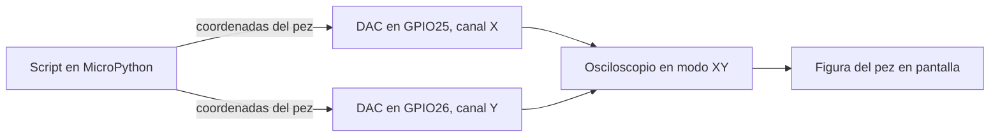
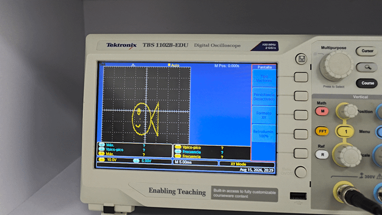
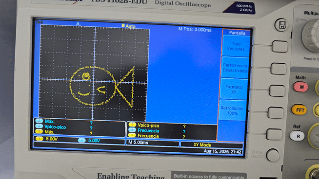
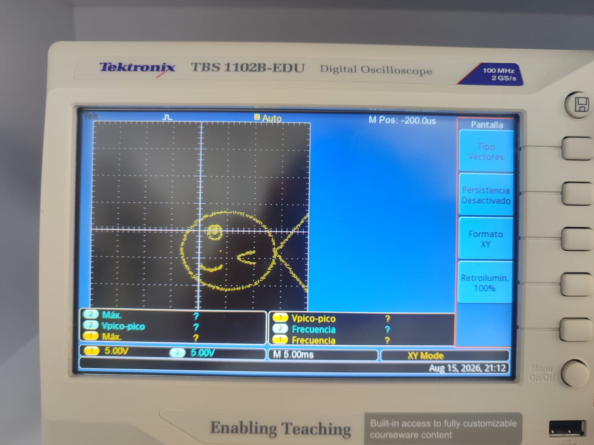
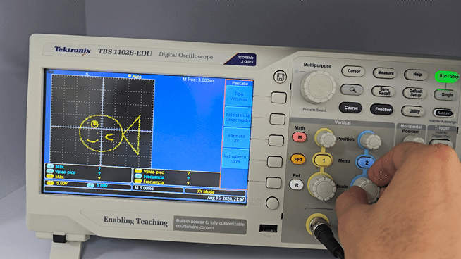
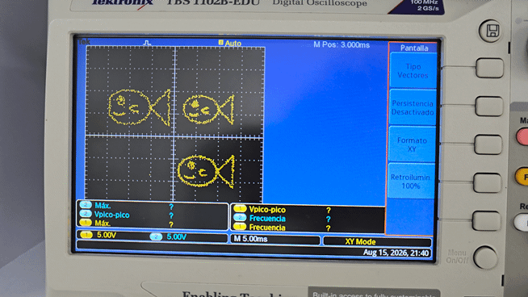

# Peces dibujados en el osciloscopio con el ESP32

## La idea general

Un osciloscopio normalmente dibuja voltaje contra tiempo, una señal que sube y baja mientras la pantalla se va llenando de izquierda a derecha. Este proyecto se aprovecha de un modo distinto que traen la mayoría de osciloscopios, el modo XY, donde en vez de graficar cada canal contra el tiempo, uno de los canales se convierte en la posición horizontal del punto en pantalla y el otro canal en la posición vertical. Si a esos dos canales se les manda una secuencia de voltajes bien calculada en vez de una señal cualquiera, el punto que se mueve por la pantalla deja de verse como una onda y empieza a trazar una figura, en este caso un pez.

El ESP32 tiene dos salidas de conversor digital a analógico, los pines GPIO25 y GPIO26, cada uno capaz de sacar un voltaje continuo controlado por software en vez de solo encender o apagar como un pin digital normal. El script en MicroPython calcula miles de puntos que forman el contorno del pez, y por cada punto le dice a esos dos DAC qué voltaje sacar, uno para la coordenada X y otro para la Y. El osciloscopio, conectado a esos dos pines y puesto en modo XY, simplemente va dibujando cada uno de esos puntos según llegan.

## Por qué se ve como una figura sólida y no como puntos sueltos

Los DAC del ESP32 no dibujan nada de golpe, van punto por punto, y entre un punto y el siguiente hay una pausa mínima antes de pasar al de después. Lo que hace que el ojo humano vea una figura completa en vez de un punto brincando por la pantalla es la persistencia de la visión, el mismo principio detrás del cine o de una bombilla que parpadea demasiado rápido para notarlo. El script recorre todos los puntos del pez una y otra vez dentro de un bucle infinito, y mientras ese recorrido sea lo bastante rápido, el ojo funde todos esos puntos en una sola forma continua.

Por eso el osciloscopio, en las capturas que muestran el menú de Pantalla, tiene la persistencia del propio equipo desactivada. Esa persistencia es una función distinta, donde el osciloscopio deja rastro de las señales anteriores en pantalla, y aquí no hace falta porque la ilusión de figura sólida ya la está generando por su cuenta la velocidad del bucle en el ESP32, no una función de la pantalla.

## Cómo está construida la figura del pez

En vez de dibujar el pez a mano punto por punto, el script arma la figura combinando unas pocas formas geométricas básicas, cada una generada por una función que calcula sus propios puntos.

Una función crea elipses, dado un centro y dos radios, y sirve tanto para el cuerpo ovalado como para el ojo, la pupila y la boca, esta última usando solo un arco de la elipse en vez del óvalo completo. Otra función crea líneas rectas entre dos puntos, usada para armar los tres lados de la cola triangular. Y una tercera función crea curvas Bezier cuadráticas, que permiten una curva suave entre dos puntos con un tercer punto de control que jala la curva hacia un lado, usada para las dos mitades de la aleta.

Cada una de esas piezas, cuerpo, cola, ojo, pupila, boca y aleta, se genera por separado como una lista de coordenadas, y la función que arma el pez completo simplemente las dibuja una detrás de otra en ese orden, moviendo el punto del osciloscopio de una pieza a la siguiente antes de volver a empezar todo el ciclo desde el cuerpo.

## Las dos versiones del script

Hay dos archivos porque representan dos formas distintas de resolver el mismo problema, un pez solo contra varios peces repetidos.

| | pez3_esp32.py | pez5_esp32.py |
|---|---|---|
| Cuántos peces dibuja | Uno solo | Tres, en distintas posiciones y tamaños |
| Cómo están definidas las coordenadas | Directamente en el rango final que usa el osciloscopio, de 0 a 1 | En un modelo base centrado en el origen, sin posición ni tamaño fijo todavía |
| Cómo se ubica el pez en pantalla | Con un desplazamiento global que mueve toda la figura | Con una función transformar que escala y traslada el modelo base a la posición de cada pez |
| Qué tan fácil es agregar otro pez | Tocaría repetir y ajustar a mano todas las coordenadas de cada pieza | Solo hay que llamar de nuevo a crear_pez con un nuevo centro y una nueva escala |

La versión de un solo pez, pez3_esp32.py, calcula cada pieza ya ubicada en su posición final, así que el cuerpo, la cola, el ojo y todo lo demás tienen sus coordenadas pensadas directamente para el lugar exacto donde va a aparecer el pez en la pantalla. Ajustar la posición completa de la figura se hace con las variables DESPLAZAMIENTO_X y DESPLAZAMIENTO_Y, que se suman a cada coordenada antes de convertirla al rango del DAC.

La versión de tres peces, pez5_esp32.py, en cambio, define un único pez base con coordenadas centradas en cero, sin pensar todavía en dónde va a quedar ni de qué tamaño va a salir. La función transformar toma esas coordenadas base y les aplica una escala y un desplazamiento hacia un centro específico, y la función crear_pez arma un pez completo aplicando esa transformación a las seis piezas al mismo tiempo. Así, dibujar los tres peces de la práctica es cuestión de llamar tres veces a crear_pez con un centro y una escala distintos cada vez, reutilizando exactamente la misma forma base en vez de tener que recalcular las coordenadas de cada pieza para cada pez.

## Los límites del rango del DAC

Los DAC del ESP32 trabajan con 8 bits, así que solo aceptan valores enteros entre 0 y 255. En vez de usar ese rango completo, el script lo recorta entre DAC_MIN en 10 y DAC_MAX en 245, dejando un margen a cada extremo. Ese margen evita que la figura quede pegada justo al borde de la pantalla del osciloscopio, donde suele haber algo de recorte o distorsión, y deja el pez centrado con un poco de aire alrededor.

Todas las coordenadas del pez se manejan primero en un rango normalizado de 0 a 1, y solo al final, justo antes de mandarlas al DAC, se convierten a ese rango recortado de 10 a 245. Esa normalización previa es la que permite que las variables de desplazamiento y la función transformar trabajen con números simples y predecibles, sin tener que pensar en el rango final del DAC hasta el último paso.

## Cómo correrlo

Con el ESP32 conectado por USB, se abre el archivo correspondiente, pez3_esp32.py para un solo pez o pez5_esp32.py para los tres, y se guarda en el dispositivo desde Thonny con el nombre main.py, para que arranque solo apenas el ESP32 tenga energía, sin depender de que Thonny siga conectado.

El cableado hacia el osciloscopio va así, el pin GPIO25 del ESP32 a la punta del canal 1, usado como eje X, el pin GPIO26 a la punta del canal 2, usado como eje Y, y el GND del ESP32 a cualquiera de las referencias de tierra del osciloscopio. Con las dos puntas conectadas, el osciloscopio necesita quedar puesto en modo XY en vez de su modo normal contra el tiempo, algo que en el menú de Pantalla del equipo aparece como la opción Formato, alternando entre YT, el modo normal, y XY. Sin ese cambio de modo, lo único que se ve en pantalla son dos señales normales subiendo y bajando, no la figura.

## Problemas de compatibilidad

- **El módulo `DAC` de MicroPython solo existe en el ESP32 "clásico"**, el mismo que se usa en el resto de este repositorio. Variantes más nuevas como el ESP32-S3, el ESP32-C3 o el ESP32-C6 no traen conversor digital a analógico en el silicio, así que `from machine import DAC` directamente no existe ahí y el script no puede correr sin cambios en esas placas. Antes de reutilizar este código en otra placa conviene confirmar en la hoja de datos que tenga DAC.
- **Los pines del DAC están fijos en GPIO25 y GPIO26** en el ESP32 clásico, no se pueden mover a otro pin como sí pasa con la mayoría de periféricos digitales del chip, así que el cableado hacia el osciloscopio tiene que respetar exactamente esos dos pines.
- **La velocidad del bucle depende del firmware de MicroPython instalado**, no solo del código: versiones más viejas del firmware pueden ejecutar `dac.write()` más lento, lo que se nota como una figura más titilante o con más ruido en el trazo. Si el pez se ve inestable, vale la pena confirmar que el firmware esté razonablemente actualizado antes de sospechar del script.
- **`utime.sleep_us` no garantiza precisión de microsegundos exacta**, porque MicroPython sigue teniendo que atender otras tareas internas del intérprete entre instrucción e instrucción; con `DRAW_US` en 1 esto no suele notarse a simple vista, pero en osciloscopios más exigentes o con la persistencia de pantalla activada sí puede verse como un trazo ligeramente irregular.

## Demostración en funcionamiento

Este fue uno de los primeros intentos, todavía sin la figura bien resuelta, mientras se ajustaba la escala y el desplazamiento.

Ya con la figura resuelta, el pez individual del script pez3_esp32.py dibujado en el osciloscopio.

De cerca, se nota bien el trazo del cuerpo, la cola, el ojo y la boca.

Ajustando en vivo los controles verticales del osciloscopio mientras la figura sigue dibujándose.

Y la versión completa del script pez5_esp32.py, con los tres peces dibujados al mismo tiempo en distintas posiciones y tamaños.

