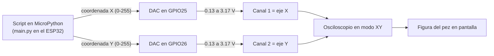
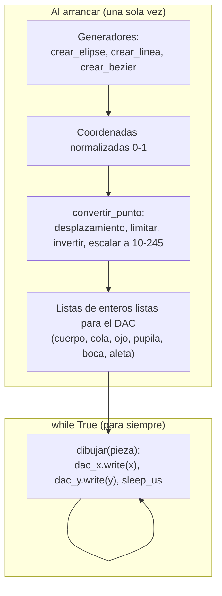
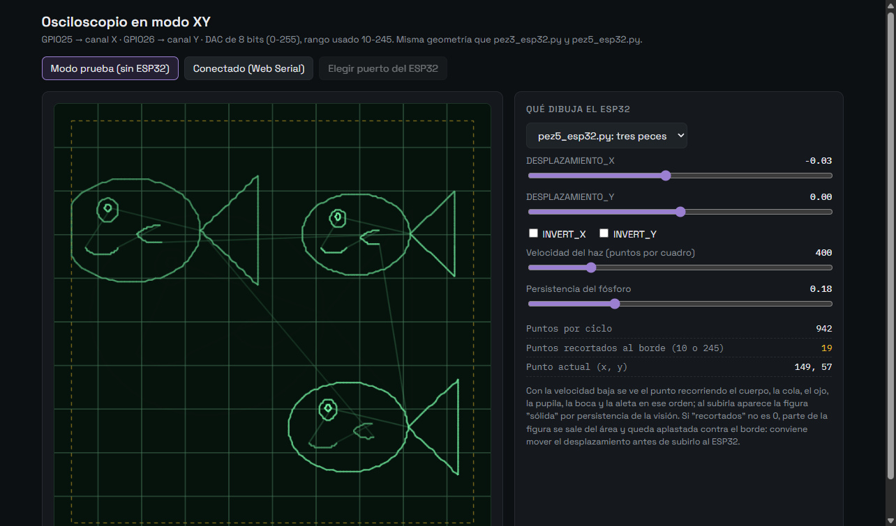
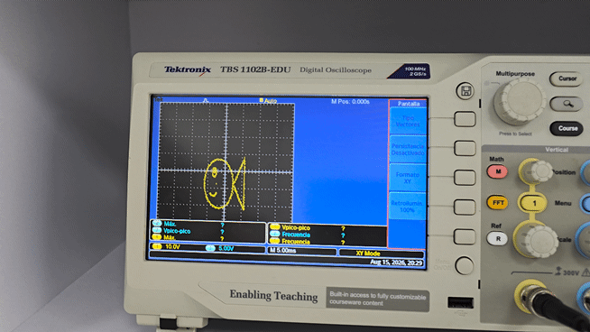
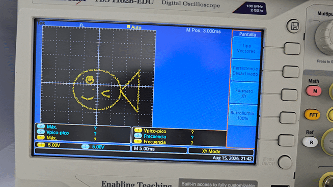
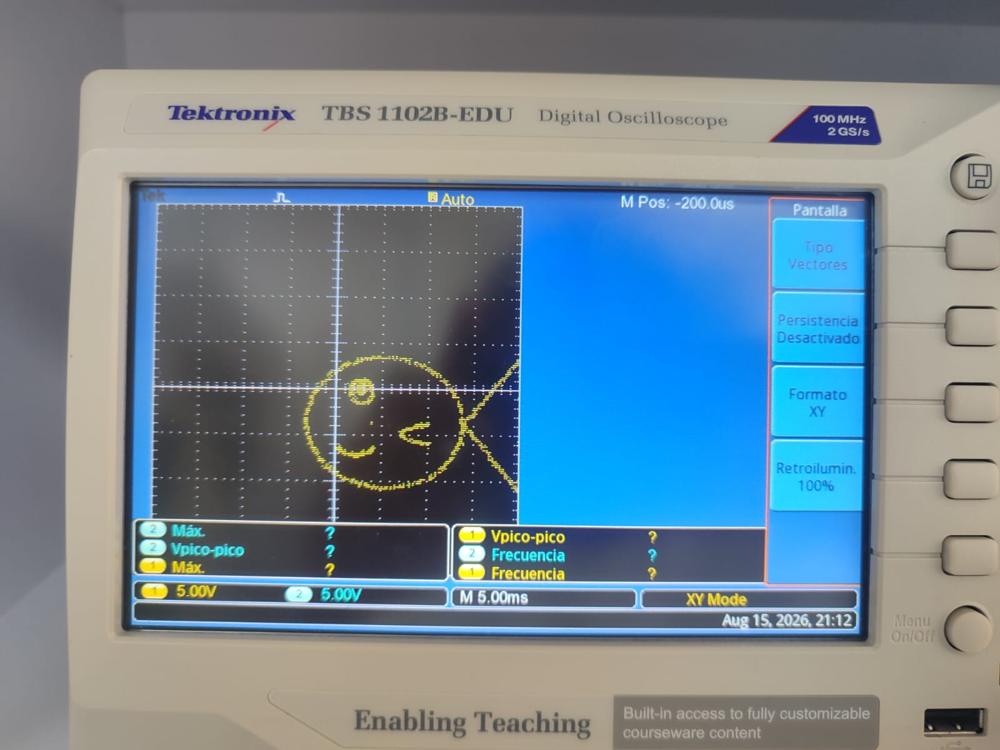
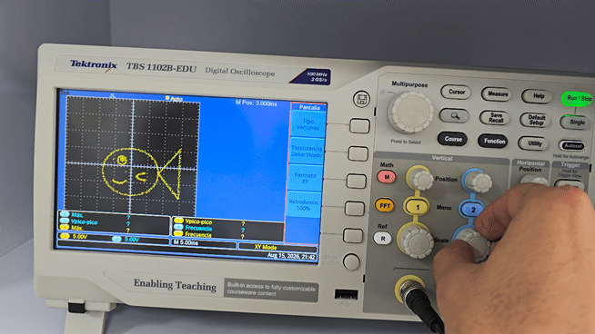
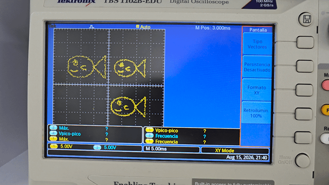

# Peces dibujados en el osciloscopio con el ESP32

Parcial del primer corte: dibujar una figura propia en un osciloscopio usando el ESP32, a partir de la idea de las figuras de Lissajous vista en clase.

## Qué pedía el parcial y qué hicimos

En clase se vio que un osciloscopio en modo XY dibuja figuras de Lissajous cuando a sus dos canales les llegan dos senoidales. El parcial pedía ir un paso más allá: usar el ESP32 como generador de señales y conseguir que en la pantalla del osciloscopio apareciera una figura propia, no solo los patrones clásicos.

Nosotros elegimos un pez. El resultado final son dos scripts de MicroPython que corren solos en el ESP32 (sin computador de por medio una vez cargados):

- `pez3_esp32.py` dibuja **un pez** grande, con cuerpo, cola, ojo, pupila, boca y aleta.
- `pez5_esp32.py` dibuja **tres peces** a la vez, en distintas posiciones y tamaños, reutilizando una sola forma base.

Cada pez son 314 puntos que el ESP32 saca por sus dos DAC una y otra vez; la versión de tres peces recorre 942 puntos por vuelta. Los gifs del final muestran cómo quedó en el osciloscopio del laboratorio, desde el primer intento hasta los tres peces.

## Qué es un DAC

Un pin digital normal del ESP32 solo sabe estar en 0 voltios o en 3.3 voltios, apagado o encendido. Un DAC, conversor digital a analógico, es un circuito que recibe un número y lo convierte en un voltaje intermedio proporcional a ese número. Los del ESP32 clásico son de 8 bits, así que aceptan números del 0 al 255: `dac.write(0)` saca unos 0 voltios, `dac.write(255)` unos 3.3 voltios, y `dac.write(128)` más o menos la mitad, 1.65 voltios. Son 256 escalones posibles, de unos 13 milivoltios cada uno (3.3 V / 255), lo que en la pantalla del osciloscopio se traduce en una cuadrícula de 256 × 256 posiciones posibles para el punto.

Es lo contrario de un ADC, el conversor analógico a digital que usa un sensor como un potenciómetro para convertir un voltaje en un número. Aquí el camino va al revés: el programa decide un número y el DAC lo convierte en voltaje.

## Qué es el modo XY de un osciloscopio

Un osciloscopio normalmente dibuja voltaje contra tiempo (modo YT): una señal que sube y baja mientras la pantalla se va llenando de izquierda a derecha. La mayoría de osciloscopios traen además el modo XY, donde el tiempo desaparece de la pantalla: el voltaje del canal 1 decide qué tan a la derecha está el punto y el voltaje del canal 2 qué tan arriba. El osciloscopio se convierte así en una especie de "pantalla de dibujo" de un solo punto que se mueve según los dos voltajes que le lleguen.

Si a esos dos canales se les manda una secuencia de voltajes bien calculada en vez de una señal cualquiera, el punto que se mueve por la pantalla deja de verse como una onda y empieza a trazar una figura, en este caso un pez.

## Qué son las figuras de Lissajous, y de ahí a una figura libre

El modo XY de un osciloscopio es precisamente el que hace posible las figuras de Lissajous, descritas por primera vez por el físico francés Jules Antoine Lissajous en 1857, y que resultan de mandar una onda senoidal pura a cada canal. Cuando las dos frecuencias son iguales el resultado es una línea diagonal o una elipse, según la diferencia de fase entre ambas, y cuando las frecuencias son distintas, sobre todo si guardan una proporción sencilla entre sí como 2:3 o 3:4, aparecen patrones entrelazados cada vez más complejos. Antes de que existieran los osciloscopios digitales, comparar la figura resultante en pantalla contra patrones ya conocidos era un método real para medir con precisión la relación entre dos frecuencias sin más instrumental que un osciloscopio.

Una forma de verlo que nos sirvió: la elipse del cuerpo del pez **es** una Lissajous. `x = cx + rx·cos(t)` y `y = cy + ry·sin(t)` son dos senoidales de la misma frecuencia desfasadas 90°, exactamente lo que da una elipse en modo XY. La diferencia es que nosotros no la generamos con dos generadores de señal sino calculando los puntos en el ESP32.

Este proyecto usa el mismo modo XY y el mismo principio de fondo, dos señales continuas moviendo un punto en dos ejes a la vez, pero no se queda en dos senoidales puras. Calcula de antemano la lista completa de coordenadas que forman el contorno de un pez y se las entrega al DAC punto por punto, así que la figura completa no es una Lissajous en el sentido estricto del término, no nace de combinar dos frecuencias, sino que aprovecha el mismo hardware y el mismo modo del osciloscopio para trazar una forma arbitraria en vez de limitarse a los patrones que produce una onda senoidal.

## La idea general

El ESP32 tiene dos salidas de conversor digital a analógico, los pines GPIO25 y GPIO26, cada uno capaz de sacar un voltaje continuo controlado por software en vez de solo encender o apagar como un pin digital normal. El script en MicroPython calcula todos los puntos que forman el contorno del pez al arrancar, y por cada punto le dice a esos dos DAC qué voltaje sacar, uno para la coordenada X y otro para la Y. El osciloscopio, conectado a esos dos pines y puesto en modo XY, simplemente va dibujando cada uno de esos puntos según llegan.


```mermaid
flowchart LR
    Script["Script en MicroPython<br/>(main.py en el ESP32)"] -->|"coordenada X (0-255)"| DacX["DAC en GPIO25"]
    Script -->|"coordenada Y (0-255)"| DacY["DAC en GPIO26"]
    DacX -->|"0.13 a 3.17 V"| CH1["Canal 1 = eje X"]
    DacY -->|"0.13 a 3.17 V"| CH2["Canal 2 = eje Y"]
    CH1 --> Osciloscopio["Osciloscopio en modo XY"]
    CH2 --> Osciloscopio
    Osciloscopio --> Figura["Figura del pez en pantalla"]
```

Por dentro, el script tiene dos momentos muy distintos: **al arrancar** arma todas las listas de puntos (una sola vez, porque calcular senos y cosenos en MicroPython es lento), y **después** se queda para siempre en un bucle que solo recorre esas listas y escribe en los DAC, que es lo más rápido que puede hacer.


```mermaid
flowchart TD
    subgraph Arranque["Al arrancar (una sola vez)"]
        G["Generadores:<br/>crear_elipse, crear_linea, crear_bezier"] --> N["Coordenadas normalizadas 0-1"]
        N --> C["convertir_punto:<br/>desplazamiento, limitar, invertir, escalar a 10-245"]
        C --> L["Listas de enteros listas para el DAC<br/>(cuerpo, cola, ojo, pupila, boca, aleta)"]
    end
    subgraph Bucle["while True (para siempre)"]
        D["dibujar(pieza):<br/>dac_x.write(x), dac_y.write(y), sleep_us"] --> D
    end
    L --> D
```

En `pez5_esp32.py` hay un paso más en medio: los generadores devuelven un pez base centrado en (0, 0), y `transformar` lo escala y lo mueve a la posición de cada uno de los tres peces antes de convertirlo.

## Conexiones

No hay componentes extra: solo el ESP32 y las dos puntas del osciloscopio. Los pines salen del propio código (`DAC(Pin(25))` y `DAC(Pin(26))`).

| Del ESP32 | Va a | Qué lleva | Por qué ese pin |
|---|---|---|---|
| GPIO25 (DAC1) | Punta del canal 1 del osciloscopio | Coordenada X, entre 0.13 V (valor 10) y 3.17 V (valor 245) | Es uno de los dos únicos pines con DAC del ESP32 clásico |
| GPIO26 (DAC2) | Punta del canal 2 del osciloscopio | Coordenada Y, mismo rango | El otro pin con DAC; no hay alternativa |
| GND | Pinza de tierra de las dos puntas | Referencia común | Sin tierra común los voltajes medidos flotan y la figura no se sostiene |

No lleva resistencias ni ningún otro componente: la entrada del osciloscopio tiene una impedancia muy alta (del orden de 1 MΩ), así que prácticamente no le pide corriente al DAC. El ESP32 se alimenta por el mismo cable USB con el que se carga el programa (o por un cargador USB cualquiera, porque una vez guardado como `main.py` no necesita el computador).

En el osciloscopio: los dos canales con la misma escala de voltios por división (si no, el pez sale estirado en un eje) y el menú Pantalla, opción Formato, en XY en vez de YT.

## Qué hace cada archivo

- **`pez3_esp32.py`**: el script de un solo pez. Define cada pieza ya en su posición final dentro de la pantalla y la mueve entera con `DESPLAZAMIENTO_X = -0.08`. Es el que se usa para mostrar el pez grande y bien definido. Se guarda en el ESP32 como `main.py`.
- **`pez5_esp32.py`**: el script de tres peces. Define un pez base centrado en el origen y lo reutiliza tres veces con distinto centro y tamaño (`crear_pez`). Es la versión final de la entrega. También se guarda como `main.py` (uno u otro, no los dos a la vez).
- **[`preview.html`](preview.html)**: un osciloscopio XY simulado en el navegador (se abre con doble clic, no instala nada). En "Modo prueba" recalcula en JavaScript exactamente la misma geometría de los dos scripts (mismas funciones, mismos números, mismo rango 10-245) y la dibuja punto por punto con un "fósforo" que se desvanece, con los mismos controles `DESPLAZAMIENTO_X/Y` e `INVERT_X/Y` y un contador de puntos recortados contra el borde; trae además una Lissajous de dos senos puros para comparar. En "Conectado" usa Web Serial (Chrome o Edge) para pintar los puntos `x y` que el ESP32 imprime con `ENVIAR_SERIAL = True`, con la última línea cruda recibida para diagnosticar. Captura en "Cómo probarlo".
- **`demo-*.gif` y `demo-primer-pez-cerca.jpg`**: las grabaciones del osciloscopio, que están incrustadas más abajo en "Demostración en funcionamiento". **`preview-modo-prueba.png`**: la captura de `preview.html`.

Los dos scripts comparten la mayor parte del código (configuración del DAC, conversión, generadores y la función `dibujar`); lo que cambia es cómo se ubica cada pez, explicado en "Las dos versiones del script".

## Por qué se ve como una figura sólida y no como puntos sueltos

Los DAC del ESP32 no dibujan nada de golpe, van punto por punto, y entre un punto y el siguiente hay una pausa mínima antes de pasar al de después. Lo que hace que el ojo humano vea una figura completa en vez de un punto brincando por la pantalla es la persistencia de la visión, el mismo principio detrás del cine o de una bombilla que parpadea demasiado rápido para notarlo. El script recorre todos los puntos del pez una y otra vez dentro de un bucle infinito, y mientras ese recorrido sea lo bastante rápido, el ojo funde todos esos puntos en una sola forma continua.

Por eso el osciloscopio, en las capturas que muestran el menú de Pantalla, tiene la persistencia del propio equipo desactivada. Esa persistencia es una función distinta, donde el osciloscopio deja rastro de las señales anteriores en pantalla, y aquí no hace falta porque la ilusión de figura sólida ya la está generando por su cuenta la velocidad del bucle en el ESP32, no una función de la pantalla.

De ahí sale el compromiso que más tuvimos que ajustar: **más puntos por pieza dan un trazo más liso, pero alargan cada vuelta y la figura parpadea más**. Tres peces son el triple de puntos que uno, por eso en `pez5_esp32.py` la pupila tiene una espera mucho menor que en `pez3_esp32.py` (40 µs contra 180 µs).

## Cómo está construida la figura del pez

En vez de dibujar el pez a mano punto por punto, el script arma la figura combinando unas pocas formas geométricas básicas, cada una generada por una función que calcula sus propios puntos.

Una función crea elipses, dado un centro y dos radios, y sirve tanto para el cuerpo ovalado como para el ojo, la pupila y la boca, esta última usando solo un arco de la elipse (de 200° a 340°, la parte de abajo, como una sonrisa) en vez del óvalo completo. Otra función crea líneas rectas entre dos puntos, usada para armar los tres lados de la cola triangular. Y una tercera función crea curvas Bezier cuadráticas, que permiten una curva suave entre dos puntos con un tercer punto de control que jala la curva hacia un lado, usada para las dos mitades de la aleta (una forma de "<").

Cada una de esas piezas se genera por separado como una lista de coordenadas, y la función que arma el pez completo simplemente las dibuja una detrás de otra en ese orden, moviendo el punto del osciloscopio de una pieza a la siguiente antes de volver a empezar todo el ciclo desde el cuerpo. Estos son los puntos de cada pieza (los generadores devuelven `puntos + 1` para cerrar la figura):

| Pieza | Forma | Puntos |
|---|---|---|
| Cuerpo | Elipse completa | 111 |
| Cola | Tres líneas (25 + 35 + 25 tramos) | 88 |
| Ojo | Elipse completa | 31 |
| Pupila | Elipse chiquita | 15 |
| Boca | Arco de elipse de 200° a 340° | 31 |
| Aleta | Dos curvas Bezier | 38 |
| **Total por pez** | | **314** |

La cola nace justo del borde derecho del cuerpo: su primer vértice es `CUERPO_CX + CUERPO_RX`, el extremo de la elipse, así que no queda ni hueco ni una línea metida dentro del cuerpo.

## La lógica del código, paso a paso

### 1. Todo se piensa en un espacio de 0 a 1

Todas las piezas se describen con números entre 0 y 1 (0 es el borde izquierdo o inferior, 1 el derecho o superior). Recién al final, en `convertir_x` y `convertir_y`, esos números pasan a enteros del DAC:

```python
def convertir_x(x):
    x = x + DESPLAZAMIENTO_X          # mover toda la figura
    x = limitar(x)                    # que no se salga de 0-1
    if INVERT_X:
        x = 1.0 - x                   # espejar si las puntas quedaron al revés
    return int(DAC_MIN + x * (DAC_MAX - DAC_MIN))   # 0-1 -> 10-245
```

Con un ejemplo real: el primer punto del cuerpo en `pez3_esp32.py` está en x = 0.42 + 0.29 = 0.71. Se le suma el desplazamiento de -0.08 y queda 0.63; convertido, `10 + 0.63 × 235 = 158`. Y en y = 0.52 queda `10 + 0.52 × 235 = 132`. Ese punto se escribe en los DAC como `dac_x.write(158)` y `dac_y.write(132)`, es decir, unos 2.04 V en el canal 1 y 1.71 V en el canal 2.

Pensarlo así tiene una ventaja práctica: mover la figura es sumar un número chico (como -0.08) y agrandarla es multiplicar, sin estar pensando en el rango del DAC en cada pieza.

### 2. Los generadores

```python
def crear_elipse(cx, cy, rx, ry, puntos, angulo_inicio=0, angulo_final=360):
    ...
    for i in range(puntos + 1):
        t = inicio + (final - inicio) * i / puntos
        x = cx + rx * math.cos(t)
        y = cy + ry * math.sin(t)
```

`crear_linea` interpola de un extremo al otro con `t` de 0 a 1, y `crear_bezier` usa la fórmula de la Bezier cuadrática, `B(t) = (1-t)²·P0 + 2(1-t)t·P1 + t²·P2`: sale de P0, llega a P2, y P1 la jala hacia su lado sin que la curva pase por él.

### 3. Dibujar

```python
def dibujar(trayectoria, velocidad=DRAW_US):
    x, y = trayectoria[0]
    if ESCRIBIR_DAC:
        dac_x.write(x)
        dac_y.write(y)
    ...
    for i in range(1, len(trayectoria)):
        x, y = trayectoria[i]
        dac_x.write(x); dac_y.write(y)
        utime.sleep_us(velocidad)
```

`DRAW_US = 1` es casi nada de espera: en la práctica el límite real es lo que tarda MicroPython en ejecutar cada `dac.write()`. El primer punto de cada pieza se escribe sin esperar antes, porque esa espera representa el tiempo que tarda el trazo en llegar al siguiente punto, no en aparecer el primero. Entre una pieza y otra (del cuerpo a la cola, por ejemplo) el haz salta y deja un trazo de salto muy tenue, porque ese recorrido dura un solo punto y el ojo casi no lo registra.

### 4. El bucle

```python
while True:
    dibujar_pez()            # pez3_esp32.py
    # dibujar_tres_peces()   # pez5_esp32.py
```

Ninguno de los dos scripts corta ese ciclo por su cuenta, así que la figura se mantiene en pantalla mientras el ESP32 tenga energía.

## El código, función por función

- **Los objetos DAC** (`dac_x = DAC(Pin(25))`, `dac_y = DAC(Pin(26))`): envuelven los dos pines DAC fijos del ESP32 clásico, y su método `.write(valor)` espera siempre un entero entre 0 y 255.
- **Las banderas de configuración**: `DRAW_US` (espera entre puntos), `DAC_MIN`/`DAC_MAX` (el rango usado del DAC), `INVERT_X`/`INVERT_Y` (espejar un eje en software en vez de recablear), `DESPLAZAMIENTO_X`/`DESPLAZAMIENTO_Y` (mover toda la figura), `ESCRIBIR_DAC` y `ENVIAR_SERIAL` (a dónde van los puntos, ver "Cómo probarlo").
- **`limitar(valor)`**: recorta cualquier coordenada normalizada para que se quede entre 0 y 1, evitando que un punto que se pase un poco del contorno calculado termine mandando al DAC un valor fuera de rango.
- **`convertir_x`, `convertir_y` y `convertir_punto`**: aplican en orden el desplazamiento global de la figura, el recorte de `limitar`, la inversión de eje opcional, y por último reescalan ese valor de 0-1 al rango recortado de `DAC_MIN` a `DAC_MAX`. Es el único lugar del script donde una coordenada deja el mundo normalizado 0-1 para convertirse en el número real que entiende el DAC.
- **`crear_elipse`, `crear_linea` y `crear_bezier`**: los tres generadores geométricos. Cada uno recorre `puntos + 1` pasos de un parámetro `t` entre 0 y 1 (o entre dos ángulos, en el caso de la elipse) y devuelve la lista de coordenadas resultante, ya convertida al rango del DAC en `pez3_esp32.py`, o todavía en el modelo base sin convertir en `pez5_esp32.py`, donde esa conversión se pospone hasta `transformar`.
- **`transformar(trayectoria, centro_x, centro_y, escala)`**, solo en `pez5_esp32.py`: toma una trayectoria del modelo base sin posición fija, la escala y la traslada hacia un centro dado, y ahí sí llama a `convertir_punto` para dejarla lista para el DAC. El orden importa: primero se multiplica por la escala (el pez crece alrededor de su propio centro) y después se suma el centro; al revés, la escala también agrandaría la distancia al origen y el pez terminaría en otro lado.
- **`crear_pez(centro_x, centro_y, escala)`**, solo en `pez5_esp32.py`: aplica `transformar` a las seis piezas base y devuelve un diccionario con ellas (`pez["cuerpo"]`, `pez["cola"]`, ...). Es la función que permite reutilizar la misma forma para los tres peces.
- **`dibujar(trayectoria, velocidad)`**: recorre una lista de puntos ya convertidos, escribiendo cada coordenada en `dac_x` y `dac_y` y esperando `velocidad` microsegundos entre punto y punto con `utime.sleep_us`. Si `ENVIAR_SERIAL` está en `True`, además imprime cada punto como una línea `x y` (dos enteros de 0 a 255) por el USB, lo que permite reconstruir la figura en la computadora sin osciloscopio; imprimir es mucho más lento que escribir en el DAC, así que para la demostración real se deja en `False`.
- **`dibujar_pez()` en `pez3_esp32.py` y `dibujar_un_pez(pez)` en `pez5_esp32.py`**: dibujan las seis piezas de un pez en el mismo orden fijo, cuerpo, cola, ojo, pupila, boca y aleta, llamando a `dibujar` una vez por pieza. La pupila se dibuja con una velocidad distinta a la del resto (180 en `pez3_esp32.py`, 40 en `pez5_esp32.py`) porque al ser la pieza más pequeña, con solo 15 puntos, el haz pasaría por ella tan rápido que se vería más débil que las demás piezas dentro del mismo ciclo; esperando más en cada punto, brilla parecido al resto.
- **`dibujar_tres_peces()`**, solo en `pez5_esp32.py`: dibuja `pez1`, `pez2` y `pez3` uno detrás de otro.
- **El bucle `while True` final**: en `pez3_esp32.py` llama una y otra vez a `dibujar_pez()`; en `pez5_esp32.py` llama a `dibujar_tres_peces()`.

## Las dos versiones del script

Hay dos archivos porque representan dos formas distintas de resolver el mismo problema, un pez solo contra varios peces repetidos.

| | pez3_esp32.py | pez5_esp32.py |
|---|---|---|
| Cuántos peces dibuja | Uno solo | Tres, en distintas posiciones y tamaños |
| Puntos por vuelta | 314 | 942 |
| Cómo están definidas las coordenadas | Directamente en el rango final que usa el osciloscopio, de 0 a 1 | En un modelo base centrado en el origen, sin posición ni tamaño fijo todavía |
| Cómo se ubica el pez en pantalla | Con un desplazamiento global que mueve toda la figura | Con una función transformar que escala y traslada el modelo base a la posición de cada pez |
| Qué tan fácil es agregar otro pez | Tocaría repetir y ajustar a mano todas las coordenadas de cada pieza | Solo hay que llamar de nuevo a crear_pez con un nuevo centro y una nueva escala |

La versión de un solo pez, pez3_esp32.py, calcula cada pieza ya ubicada en su posición final, así que el cuerpo, la cola, el ojo y todo lo demás tienen sus coordenadas pensadas directamente para el lugar exacto donde va a aparecer el pez en la pantalla. Ajustar la posición completa de la figura se hace con las variables DESPLAZAMIENTO_X y DESPLAZAMIENTO_Y, que se suman a cada coordenada antes de convertirla al rango del DAC.

La versión de tres peces, pez5_esp32.py, en cambio, define un único pez base con coordenadas centradas en cero, sin pensar todavía en dónde va a quedar ni de qué tamaño va a salir. La función transformar toma esas coordenadas base y les aplica una escala y un desplazamiento hacia un centro específico, y la función crear_pez arma un pez completo aplicando esa transformación a las seis piezas al mismo tiempo. Así, dibujar los tres peces de la práctica es cuestión de llamar tres veces a crear_pez con un centro y una escala distintos cada vez, reutilizando exactamente la misma forma base en vez de tener que recalcular las coordenadas de cada pieza para cada pez:

| Pez | Centro (x, y) | Escala | Dónde queda |
|---|---|---|---|
| `pez1` | (0.18, 0.73) | 0.72 | Grande, arriba a la izquierda |
| `pez2` | (0.74, 0.72) | 0.56 | Chico, arriba a la derecha |
| `pez3` | (0.72, 0.24) | 0.62 | Mediano, abajo a la derecha |

A los tres se les suma además el desplazamiento global `DESPLAZAMIENTO_X = -0.03`.

## Los límites del rango del DAC

Los DAC del ESP32 trabajan con 8 bits, así que solo aceptan valores enteros entre 0 y 255. En vez de usar ese rango completo, el script lo recorta entre DAC_MIN en 10 y DAC_MAX en 245, dejando un margen a cada extremo. Ese margen evita que la figura quede pegada justo al borde de la pantalla del osciloscopio, donde suele haber algo de recorte o distorsión, y deja el pez centrado con un poco de aire alrededor.

Si una coordenada se sale del rango 0 a 1, `limitar` la deja pegada al borde en vez de mandarle al DAC un valor inválido. En `pez5_esp32.py` esto pasa de verdad con el pez grande de arriba a la izquierda: con su centro en 0.18, su escala de 0.72 y el desplazamiento global de -0.03, el extremo izquierdo del cuerpo queda un poco por debajo de 0 (0.18 − 0.24 × 0.72 − 0.03 ≈ −0.02), así que 19 de sus 314 puntos se quedan en el valor 10 y esa parte del óvalo se ve ligeramente aplanada. Mover ese pez un par de centésimas a la derecha lo corregiría. En `pez3_esp32.py` ningún punto se recorta: los valores van de 21 a 209 en X y de 71 a 193 en Y.

Todas las coordenadas del pez se manejan primero en un rango normalizado de 0 a 1, y solo al final, justo antes de mandarlas al DAC, se convierten a ese rango recortado de 10 a 245. Esa normalización previa es la que permite que las variables de desplazamiento y la función transformar trabajen con números simples y predecibles, sin tener que pensar en el rango final del DAC hasta el último paso.

## Cómo probarlo

**Sin ESP32 conectado**

Los dos scripts son MicroPython y usan `machine.DAC`, que solo existe dentro del ESP32, así que no corren en la computadora tal cual. Para verlos sin placa ni osciloscopio está [`preview.html`](preview.html): se abre con doble clic y en "Modo prueba" dibuja la misma figura que sacarían los DAC.

1. En "Qué dibuja el ESP32" elegir `pez3_esp32.py` (un pez) o `pez5_esp32.py` (tres peces). Los deslizadores arrancan con el desplazamiento de cada archivo (-0.08 y -0.03).
2. Bajar "Velocidad del haz" a 10-30 puntos por cuadro: se ve el punto recorriendo el cuerpo, la cola, el ojo, la pupila, la boca y la aleta, en el orden de `dibujar_pez()`. Subirla otra vez y la figura se ve "sólida", que es la persistencia de la visión explicada arriba.
3. Mirar "Puntos por ciclo" (314 y 942, como en la tabla) y "Puntos recortados": con tres peces marca 19, el pez grande aplastado contra el borde izquierdo del que habla "Los límites del rango del DAC". Mover `DESPLAZAMIENTO_X` hasta que marque 0 es probar el arreglo antes de tocar el script.
4. `INVERT_X`/`INVERT_Y` espejan la figura igual que en el script, y la opción "Lissajous" muestra las figuras clásicas de dos senos (por ejemplo 3:2 con 90° de desfase) para comparar.



**Con ESP32 conectado pero sin osciloscopio**

Se puede revisar la geometría que de verdad calcula la placa antes de ir al laboratorio:

1. En el script, poner `ENVIAR_SERIAL = True`, y `ESCRIBIR_DAC = False` si no hay nada conectado a los pines.
2. Correrlo desde Thonny (botón Run, sin guardarlo como `main.py`).
3. En la consola de Thonny van saliendo los puntos, uno por línea, como `x y`. Con `pez3_esp32.py` las primeras líneas son `158 132`, `157 135`, `157 138`..., el borde derecho del cuerpo.
4. Para verlos dibujados en vez de leerlos: guardar el script (con `ENVIAR_SERIAL = True`) en la placa como `main.py`, cerrar Thonny para que suelte el puerto, abrir `preview.html`, pasar a "Conectado (Web Serial)", "Elegir puerto del ESP32" y presionar EN en la placa. `main.py` arranca solo y los puntos se van pintando (despacio, porque imprimir es lento); "Última línea cruda" muestra lo que llega tal cual, para saber si el problema es que no llega nada o que llega en otro formato.

La figura sale exactamente de las mismas funciones `crear_elipse`, `crear_linea`, `crear_bezier` y `transformar`, así que cualquier cambio de posición, escala o desplazamiento se puede comprobar antes de llevarlo al osciloscopio. Lo que hay que mirar es que ningún punto quede recortado contra el borde (valores 10 o 245 repetidos) y que las piezas no se salgan del pez. Antes de la demo real hay que volver a dejar `ENVIAR_SERIAL = False` y `ESCRIBIR_DAC = True`, porque imprimir por USB es mucho más lento que escribir en el DAC y el pez parpadearía.

**Con ESP32 conectado y el osciloscopio**

1. Con el ESP32 conectado por USB, abrir en Thonny `pez3_esp32.py` (un pez) o `pez5_esp32.py` (tres peces) y guardarlo en el dispositivo con el nombre `main.py`, para que arranque solo apenas el ESP32 tenga energía, sin depender de que Thonny siga conectado.
2. Cablear según la tabla de conexiones: GPIO25 a la punta del canal 1 (eje X), GPIO26 a la punta del canal 2 (eje Y) y GND a las pinzas de tierra.
3. En el osciloscopio, menú Pantalla, opción Formato: cambiar de YT (el modo normal) a XY. Sin ese cambio lo único que se ve son dos señales normales subiendo y bajando, no la figura.
4. Ajustar los voltios por división de los dos canales (iguales en ambos) y la posición vertical hasta que el pez quede centrado; es lo que se ve en el gif de "ajustando en vivo".
5. Si el pez sale espejado, cambiar `INVERT_X` o `INVERT_Y` a `True` en vez de recablear.

## Problemas de compatibilidad

- **El módulo `DAC` de MicroPython solo existe en el ESP32 "clásico"**, el mismo que se usa en el resto de este repositorio. Variantes más nuevas como el ESP32-S3, el ESP32-C3 o el ESP32-C6 no traen conversor digital a analógico en el silicio, así que `from machine import DAC` directamente no existe ahí y el script no puede correr sin cambios en esas placas. Antes de reutilizar este código en otra placa conviene confirmar en la hoja de datos que tenga DAC.
- **Los pines del DAC están fijos en GPIO25 y GPIO26** en el ESP32 clásico, no se pueden mover a otro pin como sí pasa con la mayoría de periféricos digitales del chip, así que el cableado hacia el osciloscopio tiene que respetar exactamente esos dos pines.
- **La velocidad del bucle depende del firmware de MicroPython instalado**, no solo del código: versiones más viejas del firmware pueden ejecutar `dac.write()` más lento, lo que se nota como una figura más titilante o con más ruido en el trazo. Si el pez se ve inestable, vale la pena confirmar que el firmware esté razonablemente actualizado antes de sospechar del script.
- **`utime.sleep_us` no garantiza precisión de microsegundos exacta**, porque MicroPython sigue teniendo que atender otras tareas internas del intérprete entre instrucción e instrucción; con `DRAW_US` en 1 esto no suele notarse a simple vista, pero en osciloscopios más exigentes o con la persistencia de pantalla activada sí puede verse como un trazo ligeramente irregular.

## Demostración en funcionamiento

Este fue uno de los primeros intentos, todavía sin la figura bien resuelta, mientras se ajustaba la escala y el desplazamiento.



Ya con la figura resuelta, el pez individual del script pez3_esp32.py dibujado en el osciloscopio.



De cerca, se nota bien el trazo del cuerpo, la cola, el ojo y la boca.



Ajustando en vivo los controles verticales del osciloscopio mientras la figura sigue dibujándose.



Y la versión completa del script pez5_esp32.py, con los tres peces dibujados al mismo tiempo en distintas posiciones y tamaños.



## Pendiente

Las grabaciones del osciloscopio ya están arriba. Falta una foto del montaje completo (el ESP32 con las dos puntas conectadas a GPIO25, GPIO26 y GND), que se agrega aquí cuando esté. Se hicieron pruebas adicionales de la geometría (rango de los valores enviados al DAC y puntos recortados) sin el hardware conectado.
