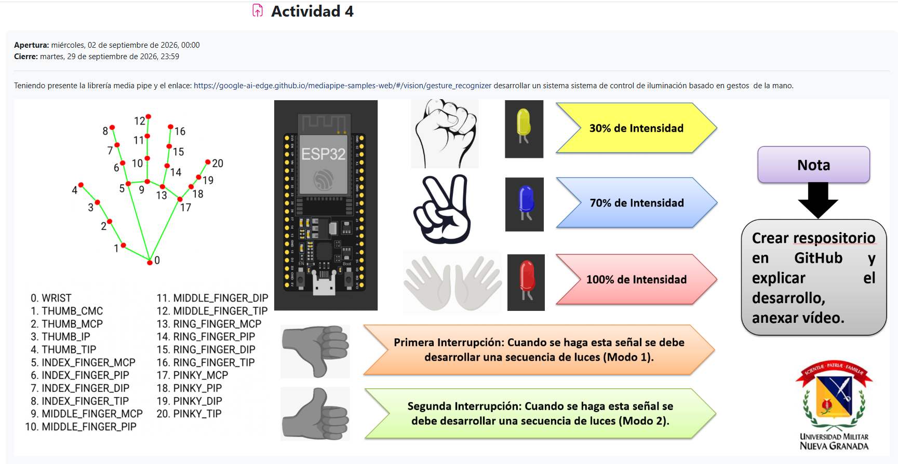
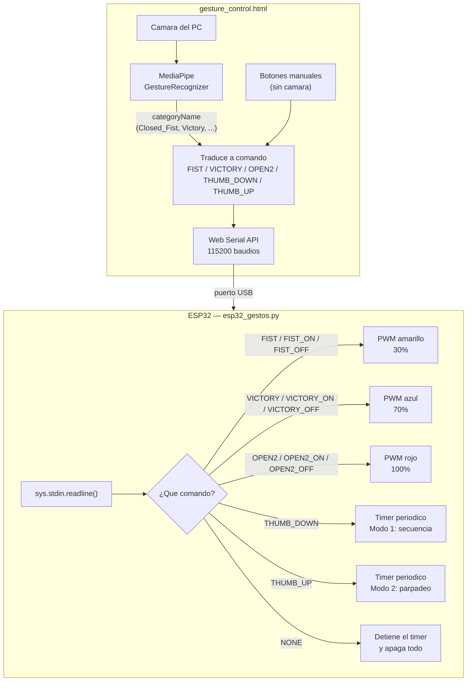

# Control de iluminación por gestos

Actividad asignada por la cátedra (Actividad 4): usando la librería [MediaPipe Gesture Recognizer](https://google-ai-edge.github.io/mediapipe-samples-web/#/vision/gesture_recognizer), desarrollar un sistema de control de iluminación basado en gestos de la mano.

## Qué es MediaPipe y qué es Web Serial

MediaPipe es un conjunto de modelos de visión por computador de Google, ya entrenados y optimizados para correr en tiempo real incluso en el navegador, sin instalar nada ni tener GPU propia. El `GestureRecognizer` en particular ya trae aprendida la ubicación de 21 puntos de referencia de la mano (la muñeca y las articulaciones de los 5 dedos) y una clasificación de gestos comunes (puño cerrado, señal de victoria, pulgar arriba, etc.) a partir de esos puntos — acá no se entrena nada, se consume el modelo ya hecho, publicado como un archivo `.task` que la página descarga la primera vez que se abre.

El otro concepto nuevo es **Web Serial API**: hasta hace pocos años, para hablar con un microcontrolador por USB desde una página web hacía falta una aplicación nativa aparte (o una extensión). Web Serial le da al JavaScript del navegador acceso directo al puerto serial, con permiso explícito del usuario (el navegador pregunta qué puerto autorizar), así que `gesture_control.html` puede correr el reconocimiento Y mandarle comandos al ESP32 sin ningún backend ni instalar nada del lado del PC. Solo funciona en navegadores basados en Chromium (Chrome, Edge); Firefox y Safari no lo implementan.

## La idea general

`gesture_control.html` es una página autocontenida (sin backend, corre directo en el navegador) que usa la cámara del computador y MediaPipe para reconocer gestos de la mano en vivo, y el [Web Serial API](https://developer.mozilla.org/en-US/docs/Web/API/Web_Serial_API) del navegador para mandarle el comando correspondiente al ESP32 por USB, a 115200 baudios. El ESP32 (`esp32_gestos.py`) controla tres LEDs por PWM según el comando que reciba.

| Gesto | LED | Intensidad |
|---|---|---|
| Puño cerrado (Closed_Fist) | Amarillo | 30% |
| Señal de victoria (Victory) | Azul | 70% |
| Ambas manos abiertas (Open_Palm x2) | Rojo | 100% |
| Pulgar abajo (Thumb_Down) | — | Modo 1: barrido secuencial amarillo → azul → rojo |
| Pulgar arriba (Thumb_Up) | — | Modo 2: parpadeo sincronizado de los tres LEDs |

Cada LED revisa su propio estado real en el PWM antes de decidir si prender o apagar, así que alternar uno no afecta a los otros dos. Los gestos de un solo disparo (`Thumb_Down`, `Thumb_Up`) no vuelven a dispararse mientras seguís haciendo el mismo gesto; hay que soltarlo y repetirlo.

La página también trae botones manuales para cada gesto (`FIST`, `VICTORY`, `OPEN2`, los dos modos), pensados para poder probar el reconocimiento y la interfaz sin depender de que la cámara detecte bien el gesto — solo hace falta conectar el ESP32 por Web Serial para que el comando llegue de verdad.

## Cómo probarlo

**Sin ESP32 conectado** (solo para probar el reconocimiento de gestos): abrir `gesture_control.html` en Chrome o Edge (necesita Web Serial, no funciona en Firefox) y dar permiso de cámara. La página reconoce los gestos y muestra en pantalla qué comando dispararía, sin necesidad de conectar nada por USB.

**Con ESP32 conectado:**
1. Guardar `esp32_gestos.py` como `main.py` en el ESP32, con los 3 LEDs en los pines definidos ahí (GPIO25 amarillo, GPIO26 azul, GPIO27 rojo).
2. Abrir `gesture_control.html` y usar el botón de conectar para elegir el puerto del ESP32 por Web Serial.
3. Hacer los gestos frente a la cámara (o usar los botones manuales) y ver los LEDs responder en tiempo real.

## Pendiente

Fotos del montaje físico y video de la demo funcionando — se agregan aquí antes de subir el tema al repositorio.
