# Control de iluminación por gestos

Actividad asignada por la cátedra (Actividad 4): usando la librería [MediaPipe Gesture Recognizer](https://google-ai-edge.github.io/mediapipe-samples-web/#/vision/gesture_recognizer), desarrollar un sistema de control de iluminación basado en gestos de la mano.

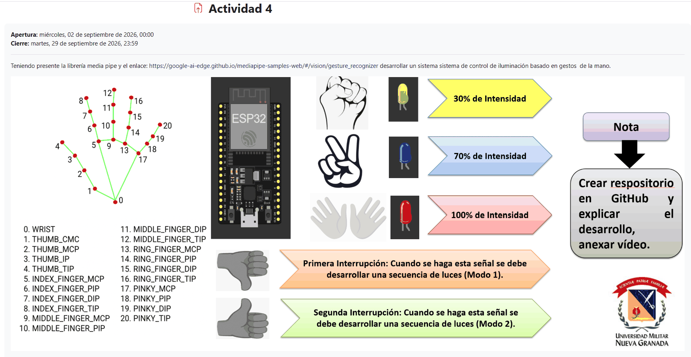

## ¿Quiere probarlo? → aquí está

Doble clic en **[`ABRIR.bat`](ABRIR.bat)** (en Linux o Mac, `./abrir.sh`). Solo hace falta Python 3.9 o más nuevo para el lanzador: no se instala nada más, y **no hace falta ni el ESP32 ni la cámara**. Se abre una app (una ventana tipo programa, con un menú lateral como el de Docker Desktop) que recorre el tema paso a paso:

1. **Gestos → LEDs**: se toca un gesto y la orden recorre la cadena entera, iluminando cada etapa (cámara → MediaPipe con su confianza → el filtro de 15 cuadros llenándose → la palabra `FIST`/`VICTORY`… → el cable USB → el ESP32 que contesta `OK`), hasta los tres LEDs simulados con la misma lógica de `esp32_gestos.py` y un monitor de lo que pasaría por el cable.
2. **Cómo funciona** y **cómo se conecta** (el montaje 3D y la tabla de pines).
3. **El reconocedor real** ([`gesture_control.html`](gesture_control.html)) dentro de la app, con una barra que muestra la descarga de MediaPipe (página → motor WebAssembly → modelo de gestos → listo) y cuánto lleva; sin cámara, sus botones de Control manual hacen lo mismo que los gestos.
4. **Con el ESP32 real** (el firmware para copiar a Thonny) y los **resultados**.

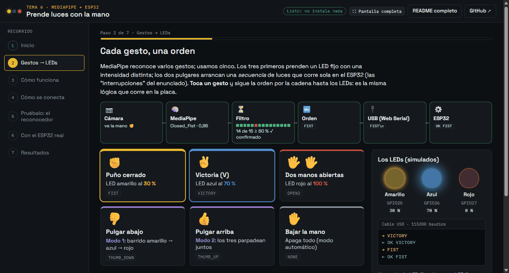

## ¿Quiere saber cómo funciona? → aquí está todo

- [Qué pedía la actividad y qué hicimos](#qué-pedía-la-actividad-y-qué-hicimos)
- Conceptos: [MediaPipe](#qué-es-mediapipe) · [landmarks de la mano](#qué-son-los-landmarks-de-la-mano) · [clasificar un gesto](#qué-es-clasificar-un-gesto) · [Web Serial](#qué-es-web-serial) · [PWM (30 % / 70 % / 100 %)](#qué-es-pwm-y-por-qué-da-el-30--70--100) · [interrupción por Timer](#qué-es-una-interrupción-por-timer-los-modos-1-y-2)
- [Cómo se evita que el LED "tiemble"](#cómo-se-evita-que-el-led-tiemble-con-cada-frame) (los filtros)
- [La idea general](#la-idea-general) (diagramas) y [conexiones](#conexiones)
- [Qué hace cada archivo](#qué-hace-cada-archivo)
- [La lógica del código, paso a paso](#la-lógica-del-código-paso-a-paso): [en la página](#en-la-página-gesture_controlhtml), [en el ESP32](#en-el-esp32-esp32_gestospy) y [el protocolo con mensajes reales](#el-protocolo-con-mensajes-reales)
- [Cómo probarlo](#cómo-probarlo) y [el circuito funcionando](#el-circuito-funcionando)

## Qué pedía la actividad y qué hicimos

El enunciado pide tres LEDs controlados por un ESP32 según el gesto que haga la mano frente a la cámara:

- puño cerrado: LED amarillo al 30% de intensidad;
- señal de victoria: LED azul al 70%;
- las dos manos abiertas: LED rojo al 100%;
- pulgar abajo: "primera interrupción", una secuencia de luces (Modo 1);
- pulgar arriba: "segunda interrupción", otra secuencia de luces (Modo 2).

Lo que hicimos son dos piezas que se hablan por el cable USB:

- **`gesture_control.html`**, una página web que corre directo en el navegador (Chrome o Edge). Usa la cámara del computador y MediaPipe para reconocer el gesto, lo filtra para no reaccionar a errores de un solo frame, y le manda al ESP32 una palabra por línea (`FIST`, `VICTORY`, `OPEN2`, `THUMB_DOWN`, `THUMB_UP`...) por Web Serial.
- **`esp32_gestos.py`**, el programa en MicroPython del ESP32. Lee esas palabras, prende cada LED con PWM a la intensidad pedida, y corre las dos secuencias con un Timer por hardware, que es la "interrupción" del enunciado.

No hace falta instalar nada en el computador: ni Python, ni entorno, ni servidor. Por eso este tema no tiene carpeta `entorno/`.

## Qué es MediaPipe

MediaPipe es un conjunto de modelos de visión por computador de Google, ya entrenados y optimizados para correr en tiempo real incluso en el navegador, sin instalar nada ni tener GPU propia. Aquí no se entrena nada: se consume un modelo ya hecho, el `GestureRecognizer`, publicado como un archivo `gesture_recognizer.task` que la página descarga la primera vez que se abre (por eso la primera vez necesita internet).

El modelo corre en el navegador gracias a **WebAssembly** (el "runtime WASM" que muestra la página): código compilado que el navegador ejecuta casi a la velocidad de un programa nativo. La página usa la versión `tasks-vision 0.10.14`, con el modelo en precisión `float16`, en modo `VIDEO` (pensado para frames seguidos de una cámara, no fotos sueltas) y con `numHands: 2`, porque el gesto de las dos manos abiertas necesita ver las dos manos a la vez.

## Qué son los landmarks de la mano

Antes de decidir qué gesto es, MediaPipe ubica en la imagen **21 puntos de referencia** (landmarks) de cada mano: la muñeca (punto 0) y cuatro articulaciones por dedo, desde la base hasta la punta. Es el diagrama que trae el propio enunciado: 1 a 4 el pulgar (`THUMB_CMC` hasta `THUMB_TIP`), 5 a 8 el índice, 9 a 12 el medio, 13 a 16 el anular y 17 a 20 el meñique.

Cada landmark llega en dos versiones:

- `landmarks`: la posición en la imagen, normalizada de 0 a 1 (0,0 es la esquina de arriba a la izquierda). Es lo que la página dibuja encima del video con el botón **Landmarks**.
- `worldLandmarks`: la posición en 3D, en metros y centrada en la muñeca de cada mano. Es lo que la página usa en la vista **Cámara + 3D**, donde el esqueleto de la mano gira solo para que se vea que el modelo de verdad estima profundidad.

Para dibujar el esqueleto, la página une esos puntos con la lista `CONEXIONES_MANO` (muñeca con la base de cada dedo, y cada articulación con la siguiente), igual que en el diagrama del enunciado.

## Qué es clasificar un gesto

Con los 21 puntos ya ubicados, la segunda parte del modelo mira la forma que hacen (qué dedos están estirados, hacia dónde apunta el pulgar) y devuelve, para cada mano, una lista de categorías con su **confianza** (`score`, de 0 a 1). El modelo de Google ya viene entrenado con un conjunto fijo de gestos: `Closed_Fist`, `Open_Palm`, `Pointing_Up`, `Thumb_Down`, `Thumb_Up`, `Victory`, `ILoveYou` y `None` (ningún gesto reconocido). De esos usamos cinco; `Pointing_Up` e `ILoveYou` no tienen comando y la página los ignora.

Un ejemplo de lo que devuelve el modelo para un frame con una sola mano haciendo la V: `gestures[0][0] = { categoryName: "Victory", score: 0.87 }`. Si hay dos manos, `gestures` trae dos listas, una por mano, y `handedness` dice cuál es la izquierda y cuál la derecha.

El gesto de "ambas manos abiertas" no existe en el modelo: es una regla nuestra. Si en el mismo frame hay dos manos y las dos son `Open_Palm` con al menos 65% de confianza, la página lo trata como un gesto propio, `Open_Palm_2`, con la confianza de la mano menos segura de las dos.

## Qué es Web Serial

Hasta hace pocos años, para hablar con un microcontrolador por USB desde una página web hacía falta una aplicación nativa aparte (o una extensión). **Web Serial API** le da al JavaScript del navegador acceso directo al puerto serial, con permiso explícito del usuario (el navegador pregunta qué puerto autorizar), así que `gesture_control.html` puede correr el reconocimiento Y mandarle comandos al ESP32 sin ningún backend. Solo funciona en navegadores basados en Chromium (Chrome, Edge); Firefox y Safari no lo implementan, y la página lo avisa si se abre en uno de ellos.

Del lado del ESP32 no hay nada especial: lo que el navegador escribe en el puerto le llega a MicroPython como si alguien lo tecleara, por `sys.stdin`, y lo que el ESP32 imprime con `print` vuelve al navegador. Se usa la misma velocidad de la consola USB de MicroPython, 115200 baudios.

## Qué es PWM (y por qué da el 30% / 70% / 100%)

Un pin digital del ESP32 solo sabe estar en 0 V o en 3.3 V: no puede dar "30% de voltaje". **PWM** (*modulación por ancho de pulso*) lo resuelve prendiendo y apagando el pin miles de veces por segundo (5000 Hz en `esp32_gestos.py`): si pasa prendido el 30% de cada ciclo, el ojo, que no alcanza a ver parpadeos tan rápidos (se notan por debajo de unos 60 Hz), percibe el LED a un 30% de brillo. Esa fracción es el *duty* (ciclo de trabajo); en MicroPython para ESP32 va de 0 a 1023 (10 bits), así que 30% = 306, 70% = 716 y 100% = 1023.

```python
DUTY_MAX = 1023
INT_30 = int(0.30 * DUTY_MAX)   # 306
INT_70 = int(0.70 * DUTY_MAX)   # 716
INT_100 = DUTY_MAX
```

## Qué es una interrupción por Timer (los Modos 1 y 2)

El enunciado llama "interrupciones" a los dos modos de secuencia. Una interrupción es una función que el microcontrolador ejecuta por su cuenta cuando pasa algo (un pin cambia, se cumple un tiempo), cortando momentáneamente lo que estaba haciendo el programa principal.

El problema que resuelve aquí es concreto: el bucle principal del ESP32 pasa casi todo el tiempo bloqueado en `sys.stdin.readline()`, esperando la siguiente palabra del navegador. Si la secuencia de luces viviera en ese bucle, se congelaría mientras no llegue nada. Con un `Timer` por hardware configurado en modo periódico, el ESP32 llama a la función del modo cada 200 ms pase lo que pase en el bucle:

```python
timer_modo.init(period=PERIODO_MODO_MS, mode=Timer.PERIODIC, callback=callback)
```

- **Modo 1 (pulgar abajo)**: barrido secuencial. En cada disparo del timer se apaga todo y se prende uno solo al 100%: amarillo, azul, rojo, y vuelve a empezar (`paso_secuencia % 3`).
- **Modo 2 (pulgar arriba)**: parpadeo sincronizado. Los pasos pares prenden los tres al 100% y los impares los apagan, así que parpadean 2.5 veces por segundo.

Cualquier gesto de LED fijo (puño, victoria, manos abiertas) detiene el modo que esté corriendo con `timer_modo.deinit()`; si no, el timer volvería a pisar el LED recién encendido en su siguiente paso.

## Cómo se evita que el LED "tiemble" con cada frame

MediaPipe clasifica cada frame de la cámara por separado, y frame a frame se equivoca a menudo (un puño que por un instante parece "victoria", una mano que se pierde un frame). Si cada frame mandara un comando, los LEDs parpadearían solos. La página filtra en tres pasos antes de mandar nada:

1. **Confianza mínima por frame (65%)**: un frame cuyo mejor gesto tenga menos confianza cuenta como "nada" (`None`), no como ese gesto.
2. **Ventana deslizante de los últimos 15 frames** (medio segundo aproximadamente).
3. **Proporción mínima del 80%**: el gesto solo se *confirma* si ocupa al menos 12 de esos 15 frames. No alcanza con ser el más votado: un 40% de votos no es un gesto claro.

Los tres números se ven en vivo en el panel "Lectura en vivo" (gesto crudo, confianza del frame, dominio en la ventana, confianza promedio y gesto confirmado). Este mismo patrón lo reutilizamos después en el tema 8 para confirmar los dígitos de la CNN.

## La idea general

`gesture_control.html` es una página autocontenida (sin backend, corre directo en el navegador) que usa la cámara del computador y MediaPipe para reconocer gestos de la mano en vivo, y el [Web Serial API](https://developer.mozilla.org/en-US/docs/Web/API/Web_Serial_API) del navegador para mandarle el comando correspondiente al ESP32 por USB, a 115200 baudios. El ESP32 (`esp32_gestos.py`) controla tres LEDs por PWM según el comando que reciba.

| Gesto | Nombre en MediaPipe | Comando | LED | Intensidad |
|---|---|---|---|---|
| Puño cerrado | `Closed_Fist` | `FIST` | Amarillo (GPIO25) | 30% |
| Señal de victoria | `Victory` | `VICTORY` | Azul (GPIO26) | 70% |
| Ambas manos abiertas | `Open_Palm` x2 (regla propia) | `OPEN2` | Rojo (GPIO27) | 100% |
| Pulgar abajo | `Thumb_Down` | `THUMB_DOWN` | Los tres | Modo 1: barrido amarillo → azul → rojo |
| Pulgar arriba | `Thumb_Up` | `THUMB_UP` | Los tres | Modo 2: parpadeo sincronizado |
| Sin gesto / mano abajo | `None` | `NONE` (solo en modo automático) | Los tres | Apaga todo y detiene el modo |

Cada LED revisa su propio estado real en el PWM antes de decidir si prender o apagar, así que alternar uno no afecta a los otros dos. Los gestos de un solo disparo (`Thumb_Down`, `Thumb_Up`) no vuelven a dispararse mientras sigues haciendo el mismo gesto; hay que soltarlo (que se confirme otro gesto o ninguno) y repetirlo.

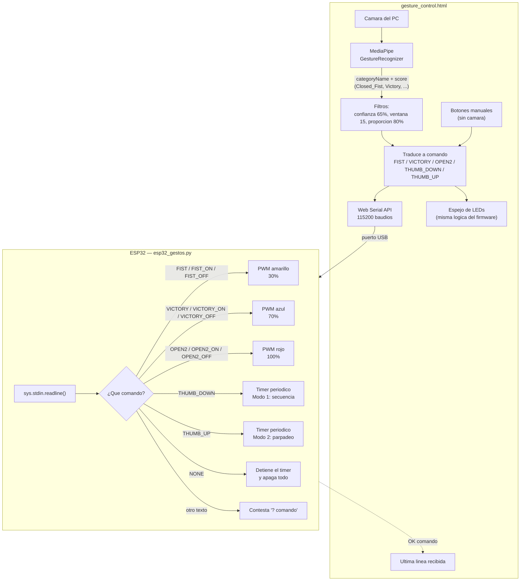
```mermaid
flowchart TD
    subgraph Navegador["gesture_control.html"]
        Cam["Camara del PC"] --> MP["MediaPipe<br/>GestureRecognizer"]
        MP -->|"categoryName + score<br/>(Closed_Fist, Victory, ...)"| Filtro["Filtros:<br/>confianza 65%, ventana 15, proporcion 80%"]
        Filtro --> Traduce["Traduce a comando<br/>FIST / VICTORY / OPEN2 / THUMB_DOWN / THUMB_UP"]
        BotonManual["Botones manuales<br/>(sin camara)"] --> Traduce
        Traduce --> Serial["Web Serial API<br/>115200 baudios"]
        Traduce --> Espejo["Espejo de LEDs<br/>(misma logica del firmware)"]
        Ultima["Ultima linea recibida"]
    end

    Serial -->|"puerto USB"| ESP
    ESP -.->|"OK comando"| Ultima

    subgraph ESP["ESP32 — esp32_gestos.py"]
        Recibe["sys.stdin.readline()"] --> Comando{"¿Que comando?"}
        Comando -->|"FIST / FIST_ON / FIST_OFF"| Amarillo["PWM amarillo<br/>30%"]
        Comando -->|"VICTORY / VICTORY_ON / VICTORY_OFF"| Azul["PWM azul<br/>70%"]
        Comando -->|"OPEN2 / OPEN2_ON / OPEN2_OFF"| Rojo["PWM rojo<br/>100%"]
        Comando -->|"THUMB_DOWN"| Modo1["Timer periodico<br/>Modo 1: secuencia"]
        Comando -->|"THUMB_UP"| Modo2["Timer periodico<br/>Modo 2: parpadeo"]
        Comando -->|"NONE"| Detener["Detiene el timer<br/>y apaga todo"]
        Comando -->|"otro texto"| Desconocido["Contesta '? comando'"]
    end
```

Así se ve una ida y vuelta completa, desde que la mano hace el puño hasta que el LED se prende y la página recibe la confirmación:

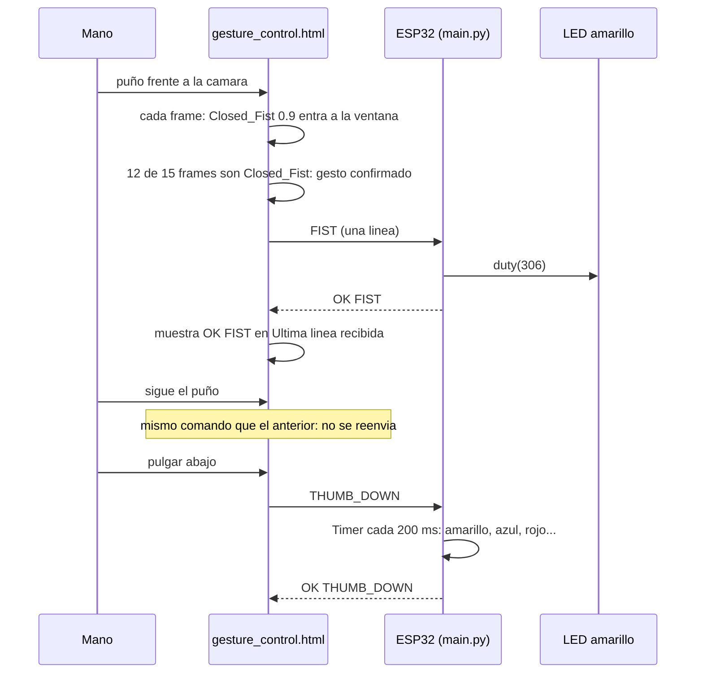
```mermaid
sequenceDiagram
    participant Mano
    participant Pagina as gesture_control.html
    participant ESP as ESP32 (main.py)
    participant LED as LED amarillo
    Mano->>Pagina: puño frente a la camara
    Pagina->>Pagina: cada frame: Closed_Fist 0.9 entra a la ventana
    Pagina->>Pagina: 12 de 15 frames son Closed_Fist: gesto confirmado
    Pagina->>ESP: FIST (una linea)
    ESP->>LED: duty(306)
    ESP-->>Pagina: OK FIST
    Pagina->>Pagina: muestra OK FIST en Ultima linea recibida
    Mano->>Pagina: sigue el puño
    Note over Pagina: mismo comando que el anterior: no se reenvia
    Mano->>Pagina: pulgar abajo
    Pagina->>ESP: THUMB_DOWN
    ESP->>ESP: Timer cada 200 ms: amarillo, azul, rojo...
    ESP-->>Pagina: OK THUMB_DOWN
```

## Conexiones

Tres LEDs, cada uno con su resistencia, a tres GPIO con PWM. Los pines salen del código (`PIN_AMARILLO = 25`, `PIN_AZUL = 26`, `PIN_ROJO = 27` en `esp32_gestos.py`).

| Componente | Pin del componente | Conexión en el ESP32 | Voltaje | Notas |
|---|---|---|---|---|
| LED amarillo | Ánodo (pata larga) | GPIO25, a través de 330 Ω | PWM 0-3.3 V, duty 306 (30%) | Puño cerrado |
| LED amarillo | Cátodo (pata corta) | GND | 0 V | |
| LED azul | Ánodo | GPIO26, a través de 330 Ω | PWM 0-3.3 V, duty 716 (70%) | Victoria |
| LED azul | Cátodo | GND | 0 V | |
| LED rojo | Ánodo | GPIO27, a través de 330 Ω | PWM 0-3.3 V, duty 1023 (100%) | Dos manos abiertas |
| LED rojo | Cátodo | GND | 0 V | |
| ESP32 | Puerto micro USB | PC | 5 V del USB | Alimentación y datos (Web Serial) por el mismo cable |

Cada LED lleva una resistencia de **330 Ω** en serie, entre el GPIO y el ánodo. Sin ella el LED pediría más corriente de la que un pin del ESP32 debería dar (se recomienda no pasar de unos 20 mA por pin). Con el duty al 100 %, la corriente es I = (3,3 V − V_LED) / 330 Ω:

| LED | Caída típica del LED | Corriente con 330 Ω |
|---|---|---|
| Amarillo | ~2,0 V | (3,3 − 2,0) / 330 ≈ 3,9 mA |
| Rojo | ~1,8 V | (3,3 − 1,8) / 330 ≈ 4,5 mA |
| Azul | ~3,0 V | (3,3 − 3,0) / 330 ≈ 0,9 mA |

Todas quedan muy lejos del límite del pin. El azul es el que menos brilla, porque su caída es casi los 3,3 V del pin: por eso se nota más tenue que los otros aunque su duty (70 %) sea mayor que el del amarillo (30 %).

Por qué esos pines: GPIO25, 26 y 27 están uno al lado del otro en el mismo costado de la placa, lo que deja el cableado ordenado en la protoboard, y son pines de propósito general sin ninguna función especial al arrancar (no son pines de *strapping* como el 0, 2, 12 o 15, que si tienen algo conectado pueden impedir que el ESP32 bootee). En el ESP32 cualquier GPIO de salida puede sacar PWM, así que no hacía falta ninguno en particular.

## Qué hace cada archivo

- **`gesture_control.html`**: la interfaz real del tema. Una sola página, HTML y JavaScript puro, que carga MediaPipe desde internet (jsdelivr y el modelo desde Google). Tiene la cámara con los landmarks y la vista 3D, el botón **Conectar ESP32**, el selector de modo de apagado (persistente o automático), los botones de **Control manual**, el panel **LEDs (espejo del firmware)**, el estado de la conexión con MediaPipe, la **Lectura en vivo** con los filtros y el **Registro de comandos enviados**. Se abre con doble clic en Chrome o Edge; no necesita servidor.
- **`esp32_gestos.py`**: el firmware del ESP32 en MicroPython. Configura los tres PWM y el Timer, espera palabras por `sys.stdin` y contesta `OK <comando>` o `? <comando>`. Se guarda en el ESP32 como `main.py` para que arranque solo al conectarlo.
- **`img/enunciado-actividad.png`**: la captura del enunciado de la Actividad 4, incrustada arriba.
- **`img/`**: el montaje en 3D, los tres estados de los LEDs (JPG), la animación de la sección "El circuito funcionando", las capturas de la página y la de la app (`app-gestos-leds.png`). Se recomprimieron para que el tema pese menos (de 6,9 MB a 2,5 MB) sin cambiar lo que se ve.
- **`ABRIR.bat` / `abrir.sh`, `probar.json` y `app/`**: la app del tema (ver "¿Quiere probarlo?" arriba). `probar.json` es la receta que usa el lanzador de la raíz del repo para probar este tema sin hardware (la página y las imágenes del montaje); `app/gestos.js` repite la lógica de `manejar_comando()` del firmware para los LEDs simulados y lee el estado de MediaPipe del reconocedor para la barra de carga.

## La lógica del código, paso a paso

### En la página (`gesture_control.html`)

**1. Arranque.** Al abrir la página se cargan, en este orden, el runtime WebAssembly de MediaPipe (`FilesetResolver.forVisionTasks`), el modelo (`GestureRecognizer.createFromOptions`) y la cámara (`getUserMedia`, pidiendo 480 × 360). Si falla el modelo (sin internet) o la cámara (permiso negado, sin webcam), la página no se queda muerta: lo avisa en el estado y los botones manuales, el espejo de LEDs y Web Serial siguen funcionando.

**2. Un frame.** `procesarFrame()` se llama con `requestAnimationFrame`, es decir, una vez por cada refresco de pantalla. En cada llamada: le pasa el frame al modelo con `recognizeForVideo`, mide la latencia y los FPS, dibuja la cámara y los landmarks, y pasa el resultado por los filtros.

**3. Clasificar el frame** (`clasificarFrame`): primero revisa la regla de las dos manos abiertas; si no aplica, se queda con el gesto de mayor confianza entre las manos detectadas, y si esa confianza es menor a `UMBRAL_CONFIANZA = 0.65` devuelve `None`.

```javascript
if (mejorScore < UMBRAL_CONFIANZA) return { gesto: "None", score: mejorScore };
return { gesto: mejorGesto, score: mejorScore };
```

**4. La ventana** (`actualizarVentana`): mete el gesto del frame en una lista de los últimos `TAM_VENTANA = 15`, cuenta cuántas veces aparece cada uno y solo confirma al ganador si su proporción llega a `UMBRAL_CONFIRMACION = 0.8`:

```javascript
gestoConfirmado: mejorProporcion >= UMBRAL_CONFIRMACION ? mejorGesto : null,
```

**5. Traducir** (`mapearAComando`): `Closed_Fist` → `FIST`, `Victory` → `VICTORY`, `Open_Palm_2` → `OPEN2`, `Thumb_Down` → `THUMB_DOWN`, `Thumb_Up` → `THUMB_UP`, `None` → `NONE`. Cualquier otro gesto (`Pointing_Up`, `ILoveYou`, o una sola mano abierta) no produce comando.

**6. Decidir si mandar** (`enviarComando`). El gesto confirmado se repite en cada frame mientras la mano siga igual, pero el comando se manda una sola vez:

- Los pulgares son de **un solo disparo**: después de dispararse quedan "desarmados" hasta que se confirme otro gesto distinto, y además hay un enfriamiento de `COOLDOWN_MS = 2500` ms como segunda protección, por si la confirmación parpadea entre el pulgar y otra cosa.
- Los gestos de LED solo se mandan cuando **cambian** respecto al último (`ultimoComandoContinuo`). Cuando se dispara un pulgar, `ultimoComandoContinuo` vuelve a `NONE`: el modo de secuencia reemplaza lo que hacían los LEDs, así que el gesto siguiente cuenta como nuevo aunque sea el mismo de antes (así puño → pulgar → puño, sin bajar la mano, sí vuelve a mandar `FIST`).

**7. Persistente o automático.** A la izquierda de la página se elige cómo se apagan los LEDs con la cámara:

- **Persistente**: el gesto *alterna* su LED (manda `FIST`, `VICTORY`, `OPEN2`). Bajar la mano no manda nada; repetir el mismo gesto lo apaga. Así se pueden dejar varios LEDs prendidos a la vez.
- **Automático**: el LED está prendido *solo mientras se sostiene el gesto* (manda `FIST_ON` al confirmarlo, `FIST_OFF` si se pasa directo a otro gesto, y `NONE` al bajar la mano, que apaga todo y detiene cualquier modo). Se usan `_ON`/`_OFF` en vez del alternar para que el resultado no dependa de cómo había quedado el LED antes: con el alternar, un LED que ya estaba prendido se apagaría justo al hacer su gesto.

**8. Escribir por Web Serial** (`escribirEnSerial`): le agrega `"\n"` al comando y lo escribe en el puerto. Antes de eso actualiza siempre el espejo de LEDs, haya o no ESP32 conectado. Si la escritura falla (típico: se desenchufó el cable), marca la conexión como perdida y pide volver a conectar, en vez de dejar un error por cada comando siguiente.

**9. Leer respuestas** (`leerRespuestas`): un bucle que lee lo que llega del puerto, lo junta en un búfer hasta encontrar un `"\n"` (los datos por USB pueden llegar partidos a mitad de una línea) y muestra la última línea completa en "Última línea recibida".

**10. El espejo del firmware** (`simularFirmware`): una copia en JavaScript de `manejar_comando()` del ESP32, con las mismas intensidades (0.30, 0.70, 1.0), el mismo alternar y los mismos modos con un `setInterval` de 200 ms. Es lo que permite ver qué deberían estar mostrando los LEDs sin tener la placa.

**11. Botones manuales.** Siguen el modo elegido: en persistente, un clic manda el comando de alternar; en automático, el botón se mantiene presionado (manda `FIST_ON` al presionar y `FIST_OFF` al soltar; los de modo mandan `NONE` al soltar). **Detener todo** siempre manda `NONE` de un solo clic.

### En el ESP32 (`esp32_gestos.py`)

**1. Configuración.** Tres `PWM(Pin(n), freq=5000, duty=0)`, arrancando apagados, y un `Timer(0)` para los modos.

**2. El bucle principal**, bloqueado en la lectura: aquí bloquear no es problema, porque el ESP32 no tiene nada más que hacer mientras tanto y las animaciones corren aparte, en el Timer.

```python
while True:
    linea = sys.stdin.readline()
    if linea:
        comando = linea.strip()
        if not comando:
            continue
        reconocido = manejar_comando(comando)
        print(("OK " if reconocido else "? ") + comando)
```

**3. `manejar_comando`**: una cadena de `if/elif` por cada palabra. Los comandos que prenden un LED fijo llaman antes a `parar_secuencia_si_activa()`; los `_OFF` no, porque apagar un LED no necesita detener una animación.

**4. `alternar_led`**: decide mirando el estado real del PWM, no una variable aparte, así que nunca puede quedar desincronizado de lo que de verdad muestra el pin:

```python
def alternar_led(pwm_objetivo, valor):
    if pwm_objetivo.duty() > 0:
        pwm_objetivo.duty(0)
    else:
        pwm_objetivo.duty(valor)
```

**5. `iniciar_modo`**: apaga todo, reinicia el contador de pasos y hace `timer_modo.init(...)` con la función del modo. Llamar `init()` sobre un timer que ya está corriendo lo reconfigura, así que pasar directo del Modo 1 al Modo 2 no deja dos timers activos.

### El protocolo, con mensajes reales

Todo es texto, una palabra por línea, terminada en `\n`.

| La página manda | El ESP32 hace | El ESP32 contesta |
|---|---|---|
| `FIST` | Alterna el amarillo (0 ↔ 306) | `OK FIST` |
| `FIST_ON` / `FIST_OFF` | Prende / apaga el amarillo | `OK FIST_ON` / `OK FIST_OFF` |
| `VICTORY` | Alterna el azul (0 ↔ 716) | `OK VICTORY` |
| `VICTORY_ON` / `VICTORY_OFF` | Prende / apaga el azul | `OK VICTORY_ON` / `OK VICTORY_OFF` |
| `OPEN2` | Alterna el rojo (0 ↔ 1023) | `OK OPEN2` |
| `OPEN2_ON` / `OPEN2_OFF` | Prende / apaga el rojo | `OK OPEN2_ON` / `OK OPEN2_OFF` |
| `THUMB_DOWN` | Arranca el Modo 1 (barrido) | `OK THUMB_DOWN` |
| `THUMB_UP` | Arranca el Modo 2 (parpadeo) | `OK THUMB_UP` |
| `NONE` | Detiene el timer y apaga todo | `OK NONE` |
| cualquier otra cosa, p. ej. `HOLA` | Nada | `? HOLA` |

Esa respuesta es la herramienta de diagnóstico más útil: si en "Última línea recibida" nunca aparece nada, el ESP32 no está corriendo `main.py` o Thonny tiene el puerto abierto; si aparece `?`, el problema es el texto enviado, no el cable.

## Cómo probarlo

**Sin ESP32 conectado**

1. Abrir `gesture_control.html` en Chrome o Edge (doble clic sobre el archivo). La primera vez necesita internet para descargar MediaPipe y el modelo.
2. Dar permiso de cámara cuando el navegador lo pida. En "Conexión con MediaPipe" los puntos del runtime WASM y del modelo deben quedar en "cargado".
3. Hacer los gestos frente a la cámara. En "Lectura en vivo" se ve el gesto crudo de cada frame, su confianza y cuánto domina en la ventana; cuando llega al 80% aparece como "Gesto confirmado".
4. Cada comando que se mandaría queda anotado en "Registro de comandos enviados", y el panel "LEDs (espejo del firmware)" se prende igual que lo harían los LEDs reales: amarillo al 30% con el puño, azul al 70% con la V, rojo al 100% con las dos manos abiertas, y las dos secuencias con los pulgares.
5. Sin cámara (o si se niega el permiso), la página lo avisa y los botones de "Control manual" siguen funcionando igual, así que se puede probar todo el flujo sin cámara y sin ESP32. Conviene probar los dos modos de apagado: en persistente un clic alterna; en automático hay que mantener presionado.

**Con ESP32 conectado**

1. Armar el circuito de la tabla de conexiones: LED amarillo en GPIO25, azul en GPIO26 y rojo en GPIO27, cada uno con su resistencia de 330 Ω, cátodos a GND.
2. Abrir `esp32_gestos.py` en Thonny y guardarlo en el ESP32 con el nombre `main.py`.
3. Cerrar Thonny (o por lo menos desconectarlo del puerto): dos programas no pueden tener abierto el mismo puerto a la vez. Si al cerrar la placa quedó en el REPL, desconectar y volver a conectar el USB para que arranque `main.py`.
4. Abrir `gesture_control.html`, presionar **Conectar ESP32** y elegir el puerto de la placa en el diálogo del navegador. El panel "Puerto serial ESP32" debe pasar a "conectado" y mostrar el Vendor/Product ID y 115200 baudios.
5. Hacer los gestos frente a la cámara (o usar los botones manuales) y ver los LEDs responder en tiempo real. En "Última línea recibida" debe aparecer `OK FIST`, `OK VICTORY`, etc.; los LEDs reales deben coincidir con el espejo de la página.

## El circuito funcionando

El montaje está representado en 3D con los modelos de nuestra biblioteca de componentes de Blender (el mismo ESP32 DevKit, protoboard, LEDs de 5 mm y resistencias de 330 Ω de la tabla de conexiones), con cada cable en el pin que usa `esp32_gestos.py`. Los LEDs encendidos tienen el brillo proporcional al duty de cada gesto.

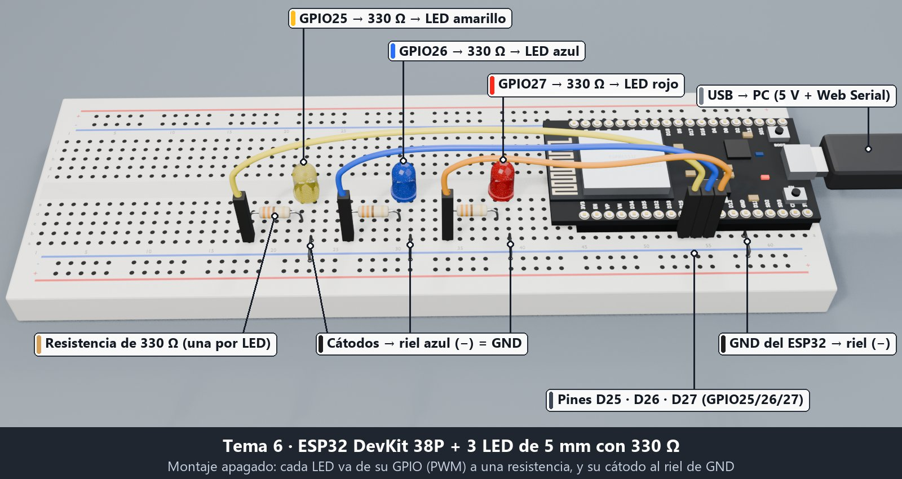

El ESP32 DevKit va clavado en la protoboard. De `GPIO25`, `GPIO26` y `GPIO27` sale un cable a una resistencia de 330 Ω cada uno, y de ahí al ánodo del LED amarillo, azul y rojo; los tres cátodos van al riel azul (−), que está unido al `GND` del ESP32. El cable USB va al PC y da a la vez la alimentación y el Web Serial.

Lo que pasa en cada gesto, con el comando que manda la página y el duty que pone el ESP32:

| Puño cerrado → `FIST` | Victoria → `VICTORY` | Dos manos abiertas → `OPEN2` |
|---|---|---|
| 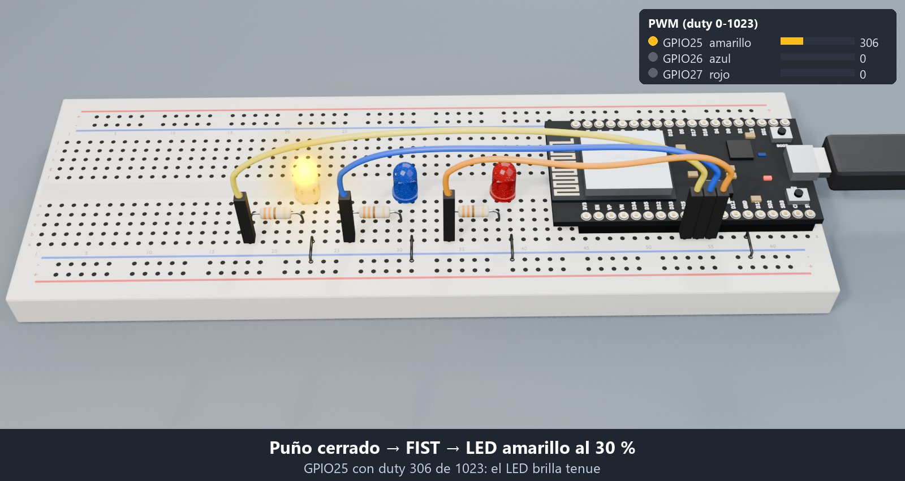 | 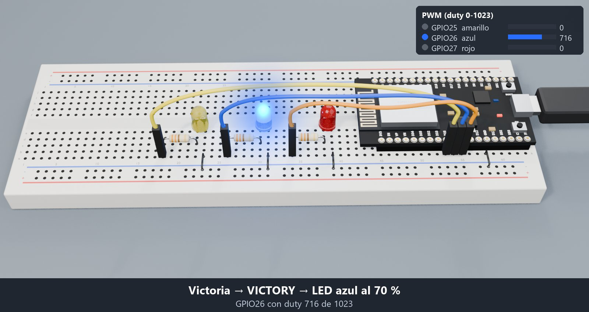 | 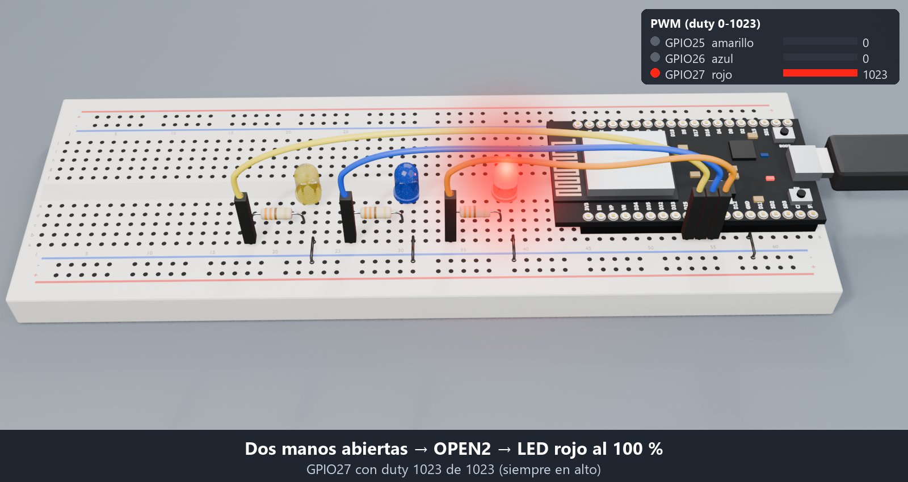 |
| `GPIO25`, duty 306 de 1023 (30 %) | `GPIO26`, duty 716 (70 %) | `GPIO27`, duty 1023 (100 %) |

Y la secuencia completa, incluidas las dos "interrupciones" por Timer: sin gesto (`NONE`, todo apagado), puño, victoria, dos manos, pulgar abajo (`THUMB_DOWN`, Modo 1: barrido amarillo → azul → rojo, 200 ms cada uno) y pulgar arriba (`THUMB_UP`, Modo 2: los tres parpadean juntos, 200 ms prendidos y 200 ms apagados). Los tiempos y los duty salen tal cual de `esp32_gestos.py`:

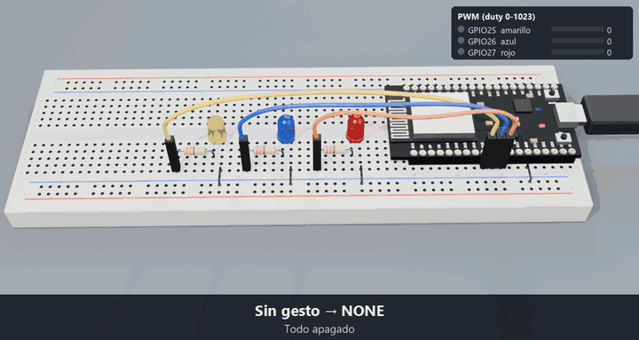

**La página en el navegador** (`gesture_control.html`). Sin cámara ni ESP32 la página igual arranca: avisa que los botones manuales siguen funcionando, y el panel "LEDs (espejo del firmware)" replica la misma lógica de `esp32_gestos.py` para ver qué haría cada LED:

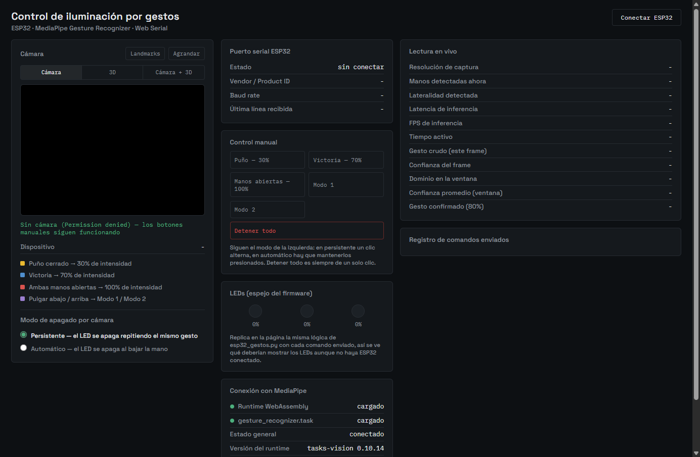

| Victoria (manual): LED azul al 70 % | Modo 1 corriendo: el barrido va por el LED azul |
|---|---|
| 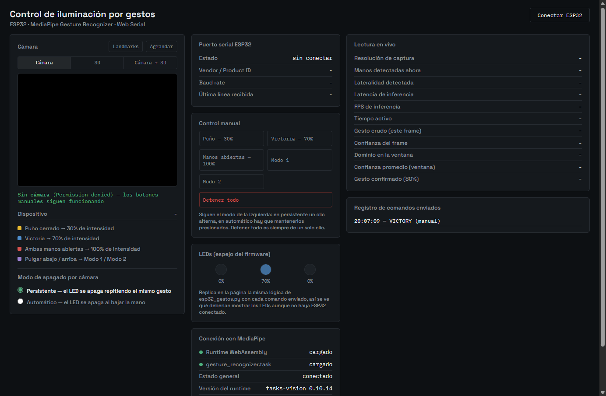 |  |
