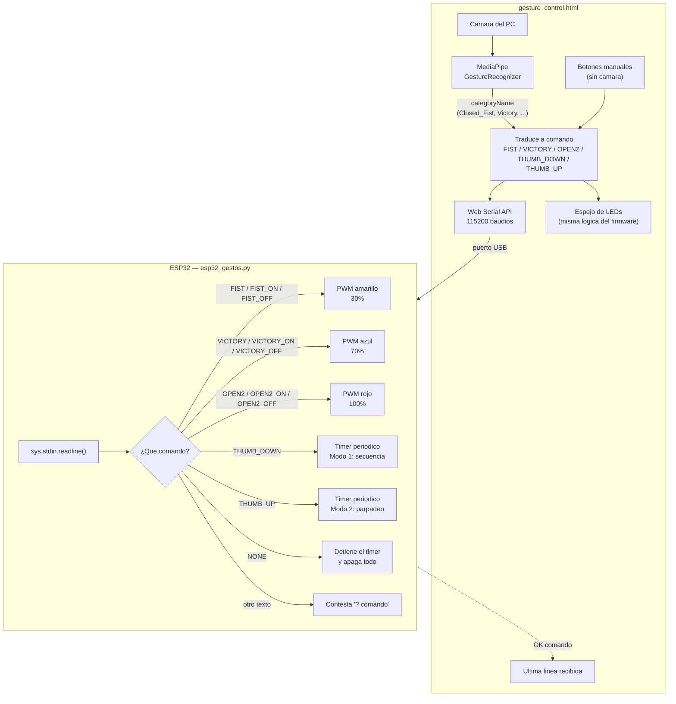

# Control de iluminación por gestos

Actividad asignada por la cátedra (Actividad 4): usando la librería [MediaPipe Gesture Recognizer](https://google-ai-edge.github.io/mediapipe-samples-web/#/vision/gesture_recognizer), desarrollar un sistema de control de iluminación basado en gestos de la mano.

## Qué es MediaPipe y qué es Web Serial

MediaPipe es un conjunto de modelos de visión por computador de Google, ya entrenados y optimizados para correr en tiempo real incluso en el navegador, sin instalar nada ni tener GPU propia. El `GestureRecognizer` en particular ya trae aprendida la ubicación de 21 puntos de referencia de la mano (la muñeca y las articulaciones de los 5 dedos) y una clasificación de gestos comunes (puño cerrado, señal de victoria, pulgar arriba, etc.) a partir de esos puntos — acá no se entrena nada, se consume el modelo ya hecho, publicado como un archivo `.task` que la página descarga la primera vez que se abre.

El otro concepto nuevo es **Web Serial API**: hasta hace pocos años, para hablar con un microcontrolador por USB desde una página web hacía falta una aplicación nativa aparte (o una extensión). Web Serial le da al JavaScript del navegador acceso directo al puerto serial, con permiso explícito del usuario (el navegador pregunta qué puerto autorizar), así que `gesture_control.html` puede correr el reconocimiento Y mandarle comandos al ESP32 sin ningún backend ni instalar nada del lado del PC. Solo funciona en navegadores basados en Chromium (Chrome, Edge); Firefox y Safari no lo implementan.

## Qué es PWM (y por qué da el 30% / 70% / 100%)

Un pin digital del ESP32 solo sabe estar en 0 V o en 3.3 V: no puede dar "30% de voltaje". **PWM** (*modulación por ancho de pulso*) lo resuelve prendiendo y apagando el pin miles de veces por segundo (5000 Hz en `esp32_gestos.py`): si pasa prendido el 30% de cada ciclo, el ojo —que no alcanza a ver parpadeos tan rápidos— percibe el LED a un 30% de brillo. Esa fracción es el *duty* (ciclo de trabajo); en MicroPython para ESP32 va de 0 a 1023, así que 30% = 306, 70% = 716 y 100% = 1023.

## Cómo se evita que el LED "tiemble" con cada frame

MediaPipe clasifica cada frame de la cámara por separado, y frame a frame se equivoca a menudo (un puño que por un instante parece "victoria", una mano que se pierde un frame). Si cada frame mandara un comando, los LEDs parpadearían solos. La página filtra en tres pasos antes de mandar nada:

1. **Confianza mínima por frame (65%)**: un frame cuyo mejor gesto tenga menos confianza cuenta como "nada", no como ese gesto.
2. **Ventana deslizante de los últimos 15 frames** (medio segundo aproximadamente).
3. **Proporción mínima del 80%**: el gesto solo se *confirma* si ocupa al menos 12 de esos 15 frames. No alcanza con ser el más votado: un 40% de votos no es un gesto claro.

Los tres números se ven en vivo en el panel "Lectura en vivo" (gesto crudo, confianza del frame, dominio en la ventana y gesto confirmado).

## La idea general

`gesture_control.html` es una página autocontenida (sin backend, corre directo en el navegador) que usa la cámara del computador y MediaPipe para reconocer gestos de la mano en vivo, y el [Web Serial API](https://developer.mozilla.org/en-US/docs/Web/API/Web_Serial_API) del navegador para mandarle el comando correspondiente al ESP32 por USB, a 115200 baudios. El ESP32 (`esp32_gestos.py`) controla tres LEDs por PWM según el comando que reciba.

| Gesto | LED | Intensidad |
|---|---|---|
| Puño cerrado (Closed_Fist) | Amarillo | 30% |
| Señal de victoria (Victory) | Azul | 70% |
| Ambas manos abiertas (Open_Palm x2) | Rojo | 100% |
| Pulgar abajo (Thumb_Down) | — | Modo 1: barrido secuencial amarillo → azul → rojo |
| Pulgar arriba (Thumb_Up) | — | Modo 2: parpadeo sincronizado de los tres LEDs |

Cada LED revisa su propio estado real en el PWM antes de decidir si prender o apagar, así que alternar uno no afecta a los otros dos. Los modos 1 y 2 son las "interrupciones" del enunciado: un `Timer` por hardware del ESP32 anima los LEDs cada 200 ms por su cuenta, sin depender del bucle que espera comandos; cualquier gesto de LED fijo detiene el modo que esté corriendo. Los gestos de un solo disparo (`Thumb_Down`, `Thumb_Up`) no vuelven a dispararse mientras sigues haciendo el mismo gesto; hay que soltarlo (que se confirme otro gesto o ninguno) y repetirlo.

La página tiene dos formas de apagar un LED con la cámara, elegibles a la izquierda:

- **Persistente**: el gesto *alterna* su LED (manda `FIST`, `VICTORY`, `OPEN2`). Bajar la mano no cambia nada; repetir el mismo gesto lo apaga. Así se pueden dejar varios LEDs prendidos a la vez.
- **Automático**: el LED está prendido *solo mientras se sostiene el gesto* (manda `FIST_ON` al confirmarlo, `FIST_OFF` si se pasa directo a otro gesto, y `NONE` al bajar la mano, que apaga todo). Se usan `_ON`/`_OFF` en vez del alternar para que el resultado no dependa de cómo había quedado el LED antes.

Por cada comando, el ESP32 contesta `OK <comando>` (o `? <comando>` si no lo reconoce), y la página muestra esa respuesta como "Última línea recibida": si nunca aparece nada, el ESP32 no está corriendo `main.py` o Thonny tiene el puerto abierto; si aparece `?`, el problema es el texto enviado, no el cable.

La página también trae botones manuales para cada gesto (`FIST`, `VICTORY`, `OPEN2`, los dos modos), pensados para poder probar el reconocimiento y la interfaz sin depender de que la cámara detecte bien el gesto — solo hace falta conectar el ESP32 por Web Serial para que el comando llegue de verdad.

```mermaid
flowchart TD
    subgraph Navegador["gesture_control.html"]
        Cam["Camara del PC"] --> MP["MediaPipe<br/>GestureRecognizer"]
        MP -->|"categoryName<br/>(Closed_Fist, Victory, ...)"| Traduce["Traduce a comando<br/>FIST / VICTORY / OPEN2 / THUMB_DOWN / THUMB_UP"]
        BotonManual["Botones manuales<br/>(sin camara)"] --> Traduce
        Traduce --> Serial["Web Serial API<br/>115200 baudios"]
        Traduce --> Espejo["Espejo de LEDs<br/>(misma logica del firmware)"]
        Ultima["Ultima linea recibida"]
    end

    Serial -->|"puerto USB"| ESP
    ESP -.->|"OK comando"| Ultima

    subgraph ESP["ESP32 — esp32_gestos.py"]
        Recibe["sys.stdin.readline()"] --> Comando{"¿Que comando?"}
        Comando -->|"FIST / FIST_ON / FIST_OFF"| Amarillo["PWM amarillo<br/>30%"]
        Comando -->|"VICTORY / VICTORY_ON / VICTORY_OFF"| Azul["PWM azul<br/>70%"]
        Comando -->|"OPEN2 / OPEN2_ON / OPEN2_OFF"| Rojo["PWM rojo<br/>100%"]
        Comando -->|"THUMB_DOWN"| Modo1["Timer periodico<br/>Modo 1: secuencia"]
        Comando -->|"THUMB_UP"| Modo2["Timer periodico<br/>Modo 2: parpadeo"]
        Comando -->|"NONE"| Detener["Detiene el timer<br/>y apaga todo"]
        Comando -->|"otro texto"| Desconocido["Contesta '? comando'"]
    end
```

## Cómo probarlo

**Sin ESP32 conectado**: abrir `gesture_control.html` en Chrome o Edge (necesita Web Serial, no funciona en Firefox) y dar permiso de cámara. La página reconoce los gestos, anota en "Registro de comandos enviados" qué comando mandaría y enciende el panel "LEDs (espejo del firmware)", que reproduce la misma lógica de `esp32_gestos.py` (intensidades, alternar, los dos modos animados). Si no hay cámara o se niega el permiso, la página lo avisa y los botones de "Control manual" siguen funcionando igual, así que se puede probar todo el flujo sin cámara y sin ESP32. La primera vez necesita internet para descargar MediaPipe y el modelo.

**Con ESP32 conectado:**
1. Guardar `esp32_gestos.py` como `main.py` en el ESP32, con los 3 LEDs en los pines definidos ahí (GPIO25 amarillo, GPIO26 azul, GPIO27 rojo).
2. Cerrar Thonny (dos programas no pueden tener abierto el mismo puerto), abrir `gesture_control.html` y usar el botón de conectar para elegir el puerto del ESP32 por Web Serial.
3. Hacer los gestos frente a la cámara (o usar los botones manuales) y ver los LEDs responder en tiempo real. En "Última línea recibida" debe aparecer `OK FIST`, `OK VICTORY`, etc.; los LEDs reales deben coincidir con el espejo de la página.

## Pendiente

Fotos del montaje físico y video de la demo funcionando: se agregan aquí cuando estén.
