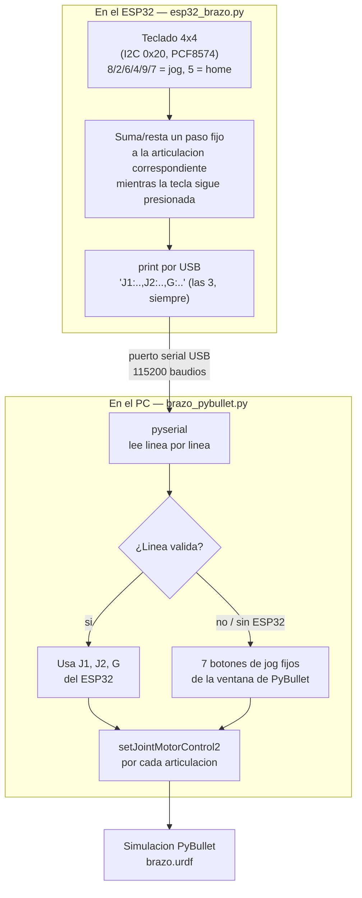
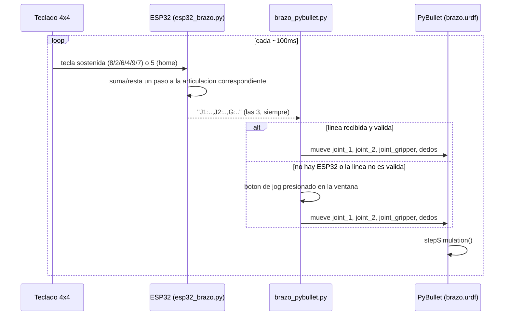

# Brazo robótico: control por teclado (jog) + simulación URDF

Basado en el archivo compartido por la cátedra [brazo.urdf](https://github.com/dialejobv/U_Militar/blob/main/8%29%20Brazo_URDF/brazo.urdf), que define un brazo de 2 grados de libertad con pinza de dos dedos. La actividad asignada (ver `enunciado-actividad.png`) pide: programar el ESP32 para leer sensores y enviar los datos, desarrollar un script en Python que reciba esos datos por UART y controle el robot, probar el movimiento de las articulaciones y la apertura/cierre de la pinza, y validar la comunicación en tiempo real.

## Qué es un URDF y qué es PyBullet

Un URDF (*Unified Robot Description Format*) es un archivo XML que describe un robot como un árbol de piezas rígidas (**links**, con su forma, tamaño y color) conectadas por **joints**: bisagras (`revolute`, giran entre un ángulo mínimo y máximo, como `joint_1` y `joint_2`) o rieles (`prismatic`, se deslizan en línea recta entre dos posiciones, como `joint_gripper`). Es el mismo formato que usa ROS (el framework de robótica más usado) para describir robots reales, así que un URDF hecho para aprender sirve igual de bien para simular un robot real más adelante.

PyBullet es un motor de físicas de código abierto (gravedad, colisiones, fricción) con enlaces a Python, pensado justamente para cargar URDFs y simularlos: cuando este script le pide `setJointMotorControl2(..., targetPosition=x)` a una articulación, PyBullet calcula las fuerzas necesarias para que el joint llegue a esa posición de forma físicamente plausible, no solo la "teletransporta" ahí. Por eso sirve para probar el comportamiento del brazo (¿la pinza choca con algo al cerrarse? ¿el codo se pasa de su límite?) sin necesidad de tener el robot físico armado.

## La idea general

El control es solo con teclado — **sin ningún sensor analógico** — tipo mando de jog (como los "teach pendant" con los que se maneja un brazo industrial a mano): mantener presionada una tecla mueve una articulación mientras se sostiene, y se suelta cuando llega a la posición deseada. Igual que las flechas de un teclado numérico:

| Tecla | Efecto |
|---|---|
| `8` / `2` | `joint_1` (base) + / − |
| `6` / `4` | `joint_2` (codo) + / − |
| `9` / `7` | pinza + / − |
| `5` | vuelve las 3 articulaciones a 0 (home) |

(Antes esto se probó con 3 potenciómetros fijos, uno por articulación, y después con un teclado + 1 potenciómetro compartido; se terminó quitando el potenciómetro por completo porque no hacía falta — el teclado ya alcanza para todo el control, y reutiliza el mismo módulo I2C que ya se usa en el tema 8, sin ningún componente analógico de por medio.)

El ESP32 manda por serial las 3 articulaciones siempre (`"J1:..,J2:..,G:.."`, el protocolo no cambió), así que `brazo_pybullet.py` no necesita saber nada del teclado — solo lee la línea. En el PC, si no hay ESP32 conectado, la ventana de PyBullet trae los mismos 7 botones de jog para poder probar sin hardware (son botones fijos, no un slider: un slider dinámico se probó primero y tenía un bug — PyBullet no borraba bien los sliders viejos al recrearlos, se iban acumulando en el panel — así que se descartó ese diseño).

## Conexiones (paso a paso)

Solo el teclado matricial va al ESP32 — no hace falta ningún otro sensor ni componente.

1. **Teclado matricial 4x4 → expansor I2C PCF8574 → ESP32.** El teclado normalmente ya viene soldado o se conecta a un módulo PCF8574 dedicado (8 pines: las 4 filas + las 4 columnas del teclado). Del módulo PCF8574 al ESP32 van 4 cables:
   - `VCC` del módulo → `3V3` del ESP32
   - `GND` del módulo → `GND` del ESP32
   - `SDA` del módulo → `GPIO21` del ESP32
   - `SCL` del módulo → `GPIO22` del ESP32
   - Dirección I2C del módulo: `0x20` (de fábrica, con los 3 jumpers/pines de dirección sin soldar o en GND — si el teclado no responde, revisar esto primero).
2. **ESP32 → PC**: un solo cable USB, el mismo que se usa para programarlo. Ese mismo puerto es el que usa `pyserial` del lado del PC — revisar en el Administrador de dispositivos de Windows qué número de puerto COM le asignó (por ejemplo `COM7`) y ponerlo en `PUERTO_SERIAL` dentro de `brazo_pybullet.py`.

No hace falta ninguna otra fuente de alimentación: el ESP32 alimenta el teclado con su propio pin de `3V3`.

## Cómo probarlo

**Sin ESP32 conectado** (solo para probar la simulación y el movimiento de articulaciones/pinza):
1. Activar el entorno virtual: `entorno\Scripts\activate` (Windows) o `source entorno/bin/activate` (Linux/Mac). Ya trae instalados `pybullet` y `pyserial`.
2. `python brazo_pybullet.py`. Al no encontrar el ESP32 en `PUERTO_SERIAL`, el script avisa por consola y abre la ventana de PyBullet con los 7 botones de jog. La ventana también trae un texto fijo arriba recordando qué tecla hace qué, para no tener que memorizarlas ni volver a este README.

**Con ESP32 conectado:**
1. Guardar `esp32_brazo.py` como `main.py` en el ESP32 (con Thonny, por ejemplo) y armar las conexiones de arriba.
2. Ajustar `PUERTO_SERIAL` en `brazo_pybullet.py` según el puerto COM que aparezca en el Administrador de dispositivos al conectar el ESP32 por USB.
3. `python brazo_pybullet.py`. Mantener presionada una tecla del teclado (8/2/6/4/9/7) para mover la articulación correspondiente, o `5` para volver a home — el brazo simulado sigue el movimiento en tiempo real.

## Pendiente

Se hicieron pruebas adicionales de la comunicación serial antes del montaje físico. Fotos del montaje físico y video de la demo funcionando — se agregan aquí antes de subir el tema al repositorio.
