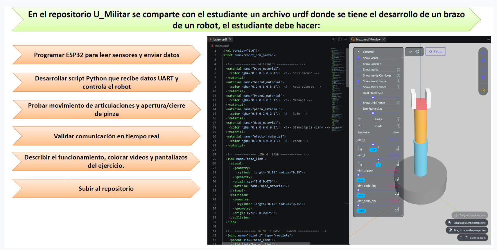
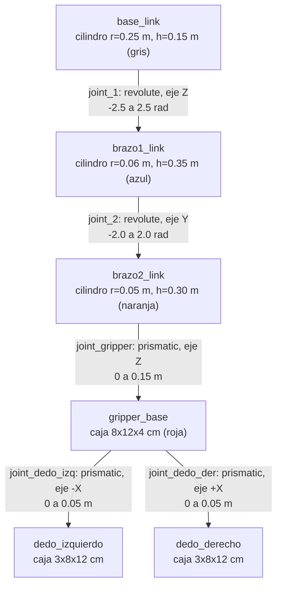
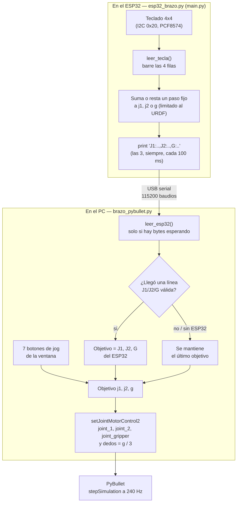
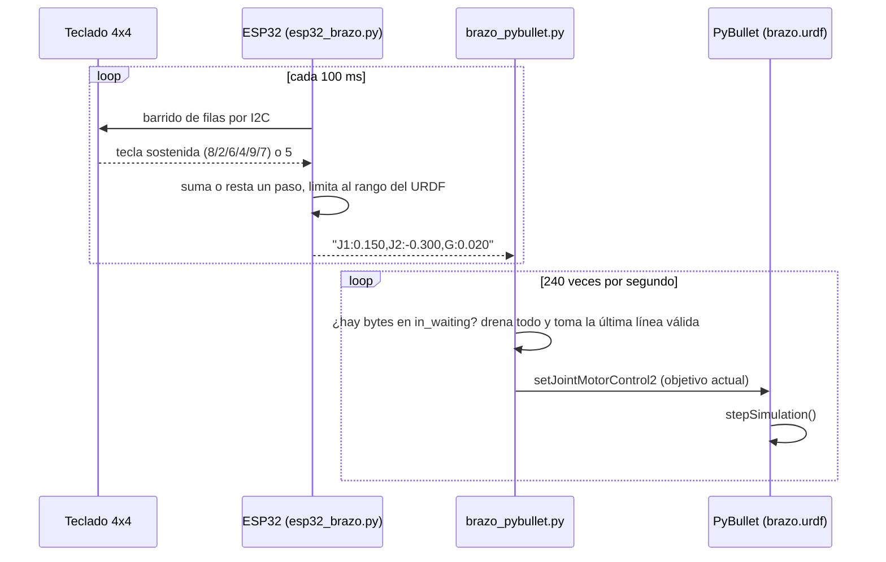

# Brazo robótico: control por teclado (jog) + simulación URDF

Basado en el archivo compartido por la cátedra [brazo.urdf](https://github.com/dialejobv/U_Militar/blob/main/8%29%20Brazo_URDF/brazo.urdf) (y su `main.py`, que solo carga el brazo en PyBullet y lista sus articulaciones). El URDF define un brazo con giro de base, codo y una pinza de dos dedos.



La actividad pedía cinco cosas: programar el ESP32 para leer sensores y enviar datos, hacer un script de Python que reciba esos datos por UART y controle el robot, probar el movimiento de las articulaciones y la apertura/cierre de la pinza, validar la comunicación en tiempo real, y documentarlo. Lo que quedó:

- El ESP32 lee un **teclado matricial 4x4** (por I2C, con un expansor PCF8574) y lo usa como un mando de *jog*: mientras se mantiene una tecla, la articulación correspondiente se mueve un paso fijo cada 100 ms. Diez veces por segundo manda la posición de las tres articulaciones al PC en una línea de texto (`J1:0.150,J2:-0.300,G:0.020`).
- `brazo_pybullet.py` carga el mismo `brazo.urdf` del profesor en PyBullet, lee esas líneas sin frenar la simulación y mueve los motores de cada articulación hacia la posición recibida. La pinza sube a lo largo del segundo tramo y sus dos dedos se abren a la vez.
- Si no hay ESP32 conectado, la ventana de PyBullet trae 7 botones con el mismo esquema de jog, así que la simulación se puede mostrar sin nada de hardware.

## Qué es un URDF

Un URDF (*Unified Robot Description Format*) es un archivo XML que describe un robot como un **árbol de piezas rígidas** unidas por articulaciones. Es el formato que usa ROS (el framework de robótica más usado) para describir robots reales, así que no es un formato "de juguete": el mismo archivo sirve para simular, para visualizar y para planear movimientos.

Tiene dos tipos de elementos:

- **`<link>`**: una pieza rígida. Trae su forma visual (`<visual>`: cilindro, caja, esfera o una malla 3D), su forma de choque (`<collision>`, normalmente la misma) y un color (`<material>`). Un link no se mueve solo: se mueve porque cuelga de otro.
- **`<joint>`**: la unión entre un link padre y un link hijo. Dice dónde está la unión (`<origin>`, medido desde el padre), alrededor de qué eje se mueve (`<axis>`), de qué tipo es y entre qué valores puede moverse (`<limit lower upper>`), con qué fuerza máxima (`effort`) y a qué velocidad máxima (`velocity`). Los tipos que usa este brazo son:
  - `revolute`: una bisagra que gira entre un ángulo mínimo y uno máximo (en radianes).
  - `prismatic`: un riel que se desliza en línea recta entre dos posiciones (en metros).

Como cada joint se mide desde su padre, al girar la base giran con ella todos los links que cuelgan de ella: eso es la **cinemática directa** (a partir de los ángulos de cada articulación, saber dónde queda cada pieza), y PyBullet la calcula sola.

### El árbol de este brazo


```mermaid
flowchart TD
    B["base_link<br/>cilindro r=0.25 m, h=0.15 m (gris)"] -->|"joint_1: revolute, eje Z<br/>-2.5 a 2.5 rad"| A1["brazo1_link<br/>cilindro r=0.06 m, h=0.35 m (azul)"]
    A1 -->|"joint_2: revolute, eje Y<br/>-2.0 a 2.0 rad"| A2["brazo2_link<br/>cilindro r=0.05 m, h=0.30 m (naranja)"]
    A2 -->|"joint_gripper: prismatic, eje Z<br/>0 a 0.15 m"| G["gripper_base<br/>caja 8x12x4 cm (roja)"]
    G -->|"joint_dedo_izq: prismatic, eje -X<br/>0 a 0.05 m"| DI["dedo_izquierdo<br/>caja 3x8x12 cm"]
    G -->|"joint_dedo_der: prismatic, eje +X<br/>0 a 0.05 m"| DD["dedo_derecho<br/>caja 3x8x12 cm"]
```

| Joint | Tipo | Eje | Límites | Qué hace en la práctica |
|---|---|---|---|---|
| `joint_1` | revolute | Z (vertical) | −2.5 a 2.5 rad (±143°) | gira todo el brazo sobre la base, como una torreta |
| `joint_2` | revolute | Y | −2.0 a 2.0 rad (±115°) | dobla el codo hacia adelante o hacia atrás |
| `joint_gripper` | prismatic | Z del segundo tramo | 0 a 0.15 m | **sube** la pinza a lo largo del segundo tramo |
| `joint_dedo_izq` / `joint_dedo_der` | prismatic | −X / +X | 0 a 0.05 m cada uno | separan los dedos (abren la pinza) |

Una aclaración que nos costó entender al principio: en el URDF, `joint_gripper` tiene el comentario "PINZA (APERTURA)", pero en realidad no abre nada, es un riel que extiende la pinza hacia arriba. Los que abren son los dedos. Para no tener cinco controles distintos, el script mueve los dos dedos en proporción a `joint_gripper`: el máximo de cada dedo (0.05 m) es justo un tercio del máximo de `joint_gripper` (0.15 m), así que con `dedo = g / 3` una sola variable lleva la pinza de "recogida y cerrada" a "extendida y abierta". Por eso en el teclado hay una sola tecla de "pinza +" y una de "pinza −".

El enunciado muestra el URDF abierto con un visor dentro del editor (con sliders por articulación). Ese visor sirve para mirar el robot, pero no puede recibir datos de un puerto serial; por eso lo simulamos en PyBullet.

## Qué es PyBullet

PyBullet es un motor de física de código abierto (gravedad, colisiones, fricción, motores) que se maneja desde Python y que carga URDFs directamente con `p.loadURDF(...)`. Lo importante para este tema es **cómo se mueve una articulación**: en vez de "teletransportar" el link a un ángulo, se le da a cada joint un motor con una posición objetivo:

```python
p.setJointMotorControl2(robot_id, indices["joint_1"], p.POSITION_CONTROL, targetPosition=j1)
```

En modo `POSITION_CONTROL`, PyBullet calcula en cada paso de la simulación la fuerza necesaria para acercar el joint a ese objetivo, limitada por el `effort` del URDF. Por eso el brazo se ve moverse con inercia en vez de saltar, y por eso tampoco puede pasarse de los `<limit>` del archivo. La simulación avanza de a un paso con `p.stepSimulation()`; el paso por defecto es 1/240 s, así que llamándolo 240 veces por segundo la simulación va en tiempo real.

Otra cosa de PyBullet que usamos: los controles de la ventana (`addUserDebugParameter`) pueden ser sliders o botones. Si se crea con el mínimo mayor que el máximo (`addUserDebugParameter("pinza +", 1, 0, 0)`), PyBullet lo dibuja como **botón**, y su "valor" es un contador que sube en 1 con cada click.

## Qué es I2C y el expansor PCF8574

El teclado 4x4 tiene 8 cables (4 filas y 4 columnas). Conectarlo directo al ESP32 gasta 8 pines. **I2C** es un bus de solo 2 cables compartidos: `SDA` (datos) y `SCL` (reloj). El ESP32 hace de *maestro*: genera el reloj y habla con cada dispositivo del bus por su **dirección** de 7 bits, como un número de casa en la misma calle. Varios chips pueden colgar de los mismos dos cables siempre que tengan direcciones distintas. En reposo las dos líneas quedan en alto gracias a resistencias *pull-up* (los módulos suelen traerlas soldadas), y los dispositivos solo las bajan a 0 para comunicar.

El **PCF8574** es un expansor de pines que vive en ese bus, en la dirección `0x20` (con sus tres pines de dirección A0-A2 a GND). Tiene 8 pines digitales, P0 a P7, y funciona con un solo byte:

- Si el ESP32 le **escribe** un byte, cada bit pone un pin en 0 o en 1.
- Si el ESP32 le **lee** un byte, cada bit dice cómo está cada pin.

Un pin del PCF8574 escrito en 1 no queda en alto "a la fuerza": queda con una pull-up débil interna, así que algo externo lo puede bajar a 0. Así es como este chip hace de entrada: se escribe un 1 en el pin y después se lee si alguien lo bajó.

## Qué es un teclado matricial y cómo se barre

Cada tecla del 4x4 es solo un contacto que, al apretarse, une una fila con una columna. Por eso no se pueden leer 16 teclas "una por una": hay que **barrer** la matriz.

En este tema las filas van a los pines P4-P7 del PCF8574 y las columnas a P0-P3. `leer_tecla()` hace esto cuatro veces, una por fila:

1. Escribe un byte donde solo **una fila** está en 0 y las otras tres en 1, y las 4 columnas en 1 (para que queden como entradas con pull-up).
2. Lee el byte de vuelta y mira los 4 bits bajos (las columnas).
3. Si alguna columna volvió en 0, es porque hay una tecla apretada uniendo esa columna con la fila que está en 0: el cruce fila/columna dice cuál es (`MAPA_TECLAS[fila][col]`).

```python
for fila in range(4):
    filas = 0x0F & ~(1 << fila)          # p. ej. fila 1 -> 0b1101
    byte_salida = (filas << 4) | 0x0F     # filas arriba, columnas en 1 abajo
    i2c.writeto(DIR_TECLADO, bytes([byte_salida]))
    columnas = i2c.readfrom(DIR_TECLADO, 1)[0] & 0x0F
    if columnas != 0x0F:                  # alguna columna bajó a 0
        ...
```

Si se bajaran las cuatro filas a la vez se sabría la columna pero no cuál de las cuatro filas la bajó: por eso va de una en una. Las cuatro vueltas toman muy poco, así que para quien aprieta es instantáneo.

## Qué es UART y cómo llega el dato al PC

UART es la comunicación serial más simple: dos cables (TX transmite, RX recibe), sin reloj compartido, donde los dos lados se ponen de acuerdo de antemano en la velocidad (los **baudios**, bits por segundo). Acá la UART va por el mismo cable USB con el que se programa el ESP32: la placa trae un chip conversor USB-serial, y en MicroPython todo lo que se imprime con `print()` sale por ahí a 115200 baudios. En el PC ese mismo puerto aparece como un `COMx` y se lee con `pyserial`. Así que el "protocolo" del ESP32 es simplemente imprimir una línea de texto por cada dato.

## La idea general

El control es solo con teclado, tipo mando de jog (como el *teach pendant* con el que se maneja a mano un brazo industrial): mantener presionada una tecla mueve una articulación y se suelta cuando llega a donde se quiere. El esquema de teclas es el de las flechas de un teclado numérico:

| Tecla | Efecto | Paso por tick (100 ms) |
|---|---|---|
| `8` / `2` | `joint_1` (base) + / − | 0.05 rad (~2.9°) |
| `6` / `4` | `joint_2` (codo) + / − | 0.05 rad (~2.9°) |
| `9` / `7` | pinza + / − (extiende y abre / recoge y cierra) | 0.005 m (5 mm) |
| `5` | vuelve las 3 articulaciones a 0 (home) | — |

Con esos pasos, sostener una tecla de articulación mueve unos 29° por segundo y la pinza recorre su carrera completa (15 cm) en 3 segundos: rápido, pero todavía se puede parar donde uno quiere. Las demás teclas (`1`, `3`, `0`, `A`-`D`, `*`, `#`) no hacen nada.

Antes de llegar a esto probamos con 3 potenciómetros fijos (uno por articulación) y después con teclado más un potenciómetro compartido. Terminamos quitando el potenciómetro del todo: el teclado solo ya alcanza para mover todo, y reutiliza el mismo módulo I2C que se usa en otros temas, sin ningún componente analógico.


```mermaid
flowchart TD
    subgraph ESP["En el ESP32 — esp32_brazo.py (main.py)"]
        Teclado["Teclado 4x4<br/>(I2C 0x20, PCF8574)"] --> Barre["leer_tecla()<br/>barre las 4 filas"]
        Barre --> Actualiza["Suma o resta un paso fijo<br/>a j1, j2 o g (limitado al URDF)"]
        Actualiza --> Envia["print 'J1:..,J2:..,G:..'<br/>(las 3, siempre, cada 100 ms)"]
    end

    Envia -->|"USB serial<br/>115200 baudios"| Recibe

    subgraph PC["En el PC — brazo_pybullet.py"]
        Recibe["leer_esp32()<br/>solo si hay bytes esperando"] --> Valido{"¿Llegó una línea<br/>J1/J2/G válida?"}
        Valido -->|"sí"| UsaESP["Objetivo = J1, J2, G<br/>del ESP32"]
        Valido -->|"no / sin ESP32"| Mantiene["Se mantiene<br/>el último objetivo"]
        Botones["7 botones de jog<br/>de la ventana"] --> Objetivo
        UsaESP --> Objetivo["Objetivo j1, j2, g"]
        Mantiene --> Objetivo
        Objetivo --> Mueve["setJointMotorControl2<br/>joint_1, joint_2, joint_gripper<br/>y dedos = g / 3"]
    end

    Mueve --> Sim["PyBullet<br/>stepSimulation a 240 Hz"]
```


```mermaid
sequenceDiagram
    participant T as Teclado 4x4
    participant E as ESP32 (esp32_brazo.py)
    participant P as brazo_pybullet.py
    participant S as PyBullet (brazo.urdf)

    loop cada 100 ms
        E->>T: barrido de filas por I2C
        T-->>E: tecla sostenida (8/2/6/4/9/7) o 5
        E->>E: suma o resta un paso, limita al rango del URDF
        E-->>P: "J1:0.150,J2:-0.300,G:0.020"
    end
    loop 240 veces por segundo
        P->>P: ¿hay bytes en in_waiting? drena todo y toma la última línea válida
        P->>S: setJointMotorControl2 (objetivo actual)
        S->>S: stepSimulation()
    end
```

La simulación da unos 24 pasos por cada línea que manda el ESP32 (240 pasos por segundo contra 10 líneas por segundo). Por eso es tan importante que la lectura serial no espere: ver "La lógica del código" más abajo.

## Conexiones

Solo va el teclado al ESP32; no hace falta ningún otro sensor ni fuente, el ESP32 alimenta el módulo con su propio `3V3`.

**Del módulo PCF8574 al ESP32** (4 cables):

| Módulo PCF8574 | ESP32 | Voltaje | Por qué ese pin |
|---|---|---|---|
| `VCC` | `3V3` | 3.3 V | el PCF8574 funciona de 2.5 a 6 V; a 3.3 V los niveles de SDA/SCL quedan iguales a los del ESP32 |
| `GND` | `GND` | 0 V | referencia común |
| `SDA` | `GPIO21` | 3.3 V lógico | pin I2C por defecto del ESP32 (`I2C_SDA = 21` en el código) |
| `SCL` | `GPIO22` | 3.3 V lógico | pin I2C por defecto del ESP32 (`I2C_SCL = 22`) |
| `A0`, `A1`, `A2` | a GND (jumpers del módulo) | — | dejan la dirección en `0x20` (`DIR_TECLADO` en el código) |

**Del teclado al PCF8574** (8 cables; en muchos módulos ya viene en un conector de 8 pines en este mismo orden):

| Teclado | PCF8574 | Rol en `leer_tecla()` |
|---|---|---|
| Columna C1 (`1 4 7 *`) | `P0` | entrada (bit 0) |
| Columna C2 (`2 5 8 0`) | `P1` | entrada (bit 1) |
| Columna C3 (`3 6 9 #`) | `P2` | entrada (bit 2) |
| Columna C4 (`A B C D`) | `P3` | entrada (bit 3) |
| Fila R1 (`1 2 3 A`) | `P4` | salida (bit 4) |
| Fila R2 (`4 5 6 B`) | `P5` | salida (bit 5) |
| Fila R3 (`7 8 9 C`) | `P6` | salida (bit 6) |
| Fila R4 (`* 0 # D`) | `P7` | salida (bit 7) |

No hace falta ninguna resistencia externa para el teclado: las pull-up de las columnas las pone el propio PCF8574. Si al apretar una tecla sale otra distinta, el teclado tiene sus pines en otro orden y basta con intercambiar cables (o filas/columnas en `MAPA_TECLAS`).

**ESP32 → PC**: un cable USB, el mismo que se usa para programarlo. En el Administrador de dispositivos de Windows se ve qué `COM` le asignó (por ejemplo `COM7`); ese va en `PUERTO_SERIAL` dentro de `brazo_pybullet.py`.

## Qué hace cada archivo

- **`brazo.urdf`**: el brazo del profesor, tal cual viene en U_Militar (5 links y 5 joints, ver el árbol de arriba). No lo modificamos; `brazo_pybullet.py` lee de él los nombres, índices y límites de cada articulación.
- **`esp32_brazo.py`**: el firmware del ESP32 en MicroPython. Se guarda en la placa como `main.py`. Barre el teclado por I2C, actualiza las tres posiciones con los pasos de jog y las imprime cada 100 ms.
- **`brazo_pybullet.py`**: el programa del PC. Abre el puerto serial si puede, carga el URDF en PyBullet, crea los botones de jog y en un bucle lee el serial, aplica los botones, mueve los motores y avanza la simulación.
- **`enunciado-actividad.png`**: la captura del enunciado de la actividad.
- **`entorno/`**: el entorno virtual de Python del tema, con `pybullet` y `pyserial` ya instalados. No se sube a GitHub (tiene su propio `.gitignore` con `*`).
  Para crearlo en otro PC (Python 3.14), dentro de esta carpeta: `py -3.14 -m venv entorno` y `entorno\Scripts\python -m pip install pybullet pyserial`.

## La lógica del código

### En el ESP32 (`esp32_brazo.py`)

Arranca con `j1 = j2 = g = 0` y entra a un bucle infinito que en cada vuelta:

1. Llama a `leer_tecla()` (el barrido de arriba) dentro de un `try`. Si el PCF8574 no contesta (cable suelto, otra dirección, sin alimentación), `writeto`/`readfrom` lanzan `OSError`. En vez de dejar que `main.py` se caiga, se imprime **una sola vez** un aviso que empieza con `#`, se sigue mandando la última posición, y si el teclado vuelve a responder se avisa también:

   ```
   # ERROR: el teclado I2C (0x20) no responde, revisar SDA=21/SCL=22
   # teclado I2C de nuevo respondiendo
   ```

   Empieza con `#` para que no se confunda con una línea de datos: el PC la muestra como "última línea cruda" y así se sabe que el problema es el teclado, no el cable USB.
2. Según la tecla, suma o resta el paso a la variable que toca y la pasa por `limitar()`, que la deja dentro de los mismos `<limit>` del URDF (`LIM_J1 = (-2.5, 2.5)`, `LIM_J2 = (-2.0, 2.0)`, `LIM_G = (0.0, 0.15)`). La tecla `5` pone las tres en 0.
3. Imprime siempre las tres posiciones, con 3 decimales, y duerme 100 ms:

   ```python
   print("J1:{:.3f},J2:{:.3f},G:{:.3f}".format(j1, j2, g))
   time.sleep(0.1)
   ```

Mandar siempre las tres (y no solo la que cambió) hace que cada línea sea autosuficiente: si el PC se pierde una, la siguiente ya trae la posición completa. Y como la línea sale cada 100 ms aunque no se apriete nada, la tecla "sostenida" es simplemente que el barrido la sigue viendo en cada vuelta y cada vuelta suma un paso. Por el USB se ve algo así mientras se sostiene el `8`:

```
J1:0.000,J2:0.000,G:0.000
J1:0.050,J2:0.000,G:0.000
J1:0.100,J2:0.000,G:0.000
J1:0.150,J2:0.000,G:0.000
```

### En el PC (`brazo_pybullet.py`)

**1. Patrón "sin necesidad de estar conectado".** El puerto se abre dentro de un `try/except serial.SerialException`. Si falla (no hay ESP32, otro COM, o Thonny tiene el puerto abierto), `ser` queda en `None`, se avisa por consola y todo lo demás funciona igual con los botones de la ventana. Si abre bien, espera 2 segundos y vacía el buffer: abrir el puerto mueve la línea DTR del conversor USB-serial y eso **reinicia** el ESP32, así que hay que darle tiempo a que arranque `main.py` y descartar el texto de arranque de MicroPython.

**2. Leer los límites del propio URDF.** En vez de copiar los números a mano, recorre las articulaciones con `p.getJointInfo()` y guarda el índice de cada una (por nombre) y sus límites (`info[8]` e `info[9]`). Si el URDF cambia, el script se adapta solo.

**3. Lectura serial que no frena la simulación.** Esta fue la decisión más importante del tema. La simulación corre a 240 pasos por segundo y el ESP32 manda 10 líneas por segundo. Si dentro del bucle se hiciera un `ser.readline()` que espera a que llegue una línea, toda la ventana quedaría atada al ritmo del ESP32 y el brazo se vería trabado. Por eso `leer_esp32()`:

- sale de inmediato si `ser.in_waiting == 0` (no hay bytes esperando),
- si hay, lee **todo** lo acumulado de una vez, lo parte por `\n` y guarda el pedazo incompleto para la próxima vuelta (una línea puede llegar partida en dos lecturas),
- revisa cada línea completa con una expresión regular y se queda solo con la **última válida**, que es la posición actual del jog:

```python
PATRON_LINEA = re.compile(r"J1:(-?[\d.]+),J2:(-?[\d.]+),G:(-?[\d.]+)")
```

Si solo se leyera una línea por vuelta, las líneas se irían apilando y el brazo reaccionaría con cada vez más retraso respecto al teclado.

**4. Diagnóstico en la ventana.** La última línea **cruda** que llegó (sea o no válida) se muestra arriba en la ventana, en verde, como `Serial: ...`. Es la herramienta más útil cuando "no pasa nada": si nunca cambia de `(sin datos todavia)`, el ESP32 no está mandando nada; si cambia pero no es `J1:..`, el problema es de formato o del teclado (por ejemplo el aviso `# ERROR: ...`). El texto solo se reescribe cuando cambia (`replaceItemUniqueId`), porque recrearlo 240 veces por segundo lo haría parpadear.

**5. Botones de jog.** Siete botones fijos (`joint_1 (base) +`, `joint_1 (base) -`, `joint_2 (codo) +`, `joint_2 (codo) -`, `pinza +`, `pinza -`, `Home (0, 0, 0)`) con los mismos pasos que el ESP32 (`PASO_LOCAL = {"j1": 0.05, "j2": 0.05, "g": 0.005}`). Como un botón de PyBullet es un contador, `leer_botones()` compara cada contador con el de la vuelta anterior y aplica la diferencia (si hubo dos clicks entre dos vueltas, se aplican los dos). Funcionan también con el ESP32 conectado.

   Primero probamos un solo slider cuyo rango cambiaba según la articulación elegida (borrarlo y crear uno nuevo). No funcionó: `p.removeUserDebugItem()` no borra de forma confiable los sliders ya creados y los viejos se iban quedando pegados en el panel. Por eso quedaron botones fijos, creados una sola vez, que nunca se recrean.

**6. Una sola posición objetivo.** Tanto las líneas del ESP32 como los botones escriben sobre el mismo diccionario `valores = {"j1", "j2", "g"}`. Cuando el ESP32 manda algo, su posición reemplaza a la local; en las vueltas en que no llega nada, el brazo mantiene la última posición (no vuelve a 0). Así el brazo nunca "salta" entre dos fuentes.

**7. Mover y avanzar.** En cada vuelta se manda el objetivo a los cinco motores (los dos dedos con `g / 3`), se llama a `p.stepSimulation()` y se duerme 1/240 s. El bucle es `while p.isConnected()`, así que al cerrar la ventana el script termina limpio, y en el `finally` se cierra el puerto para que Thonny lo pueda volver a abrir.

## Cómo probarlo

Todos los comandos se corren desde la carpeta `7-brazo-robotico-urdf`, con el entorno del tema (ya trae `pybullet` y `pyserial`).

**Sin ESP32 conectado:**

1. `entorno\Scripts\python -m pip list` para comprobar que el entorno está bien (deben aparecer `pybullet` y `pyserial`).
2. `entorno\Scripts\python brazo_pybullet.py`. En la consola aparece `No se encontro el ESP32 en COM7: se usan los botones de jog de PyBullet.` y se abre la ventana.
3. En el panel de la derecha, hacer click en los botones de jog: cada click mueve la articulación ~2.9° (o la pinza 5 mm). Con `pinza +` se ve cómo la pinza sube y los dedos se separan a la vez; `Home (0, 0, 0)` lo devuelve todo a cero. Arriba, la línea de estado dice `Serial: sin ESP32 (modo botones)`.

**Con ESP32 conectado:**

1. Armar las conexiones de arriba.
2. Con Thonny, guardar `esp32_brazo.py` en la placa con el nombre `main.py`. Antes de seguir, **cerrar Thonny** (o darle Stop y desconectarlo): Windows deja abrir un puerto COM a un solo programa a la vez.
3. Poner en `PUERTO_SERIAL` (arriba de `brazo_pybullet.py`) el COM que se ve en el Administrador de dispositivos.
4. `entorno\Scripts\python brazo_pybullet.py`. En la consola debe salir `ESP32 conectado en COM7: usando los datos reales del teclado.`
5. Mantener presionadas las teclas `8/2/6/4/9/7` y el brazo simulado se mueve en tiempo real; `5` lo lleva a home. Arriba de la ventana, `Serial: J1:..,J2:..,G:..` tiene que ir cambiando mientras se sostiene la tecla.
6. Si algo no anda: si la línea `Serial:` se queda en `(sin datos todavia)`, el ESP32 no está mandando (revisar que el archivo se llame `main.py` en la placa y que Thonny no tenga el puerto); si muestra `# ERROR: el teclado I2C (0x20) no responde...`, el USB está bien y el problema es el cableado del PCF8574 o su dirección.

## Pendiente

- Fotos del montaje físico (ESP32 + teclado con su módulo PCF8574).
- Video de la demo con el teclado real moviendo el brazo simulado.
- Se hicieron pruebas adicionales de la comunicación serial antes del montaje físico.
