# Brazo robótico: control por teclado (jog) + simulación URDF

## ¿Quiere probarlo? → aquí está

Doble clic en [`ABRIR.bat`](ABRIR.bat) (en Linux o Mac, `sh abrir.sh`). Se abre la app de la práctica en una ventana propia, con una barra lateral por secciones:

- **Pruébalo**: un botón que abre la simulación real en PyBullet (`brazo_pybullet.py`), con sus 7 botones de jog si no hay ESP32. La primera vez la app prepara el entorno sola y **compila PyBullet (~10 min**, con las Build Tools de C++ de Visual Studio; la barra muestra el avance); después abre en segundos.
- **El teclado**: el mismo teclado 4x4 del ESP32, clicable, con el brazo dibujado de lado y desde arriba y la línea `J1:..,J2:..,G:..` que mandaría por el USB. Funciona al instante, sin instalar nada.
- **En el navegador**: `preview.html` (vista 3D sin física, modo prueba o conectado al ESP32 real por Web Serial).
- **Cómo funciona**, **Conexiones**, **Con el ESP32** y **Resultados**: lo mismo de este README, resumido y con las fotos.

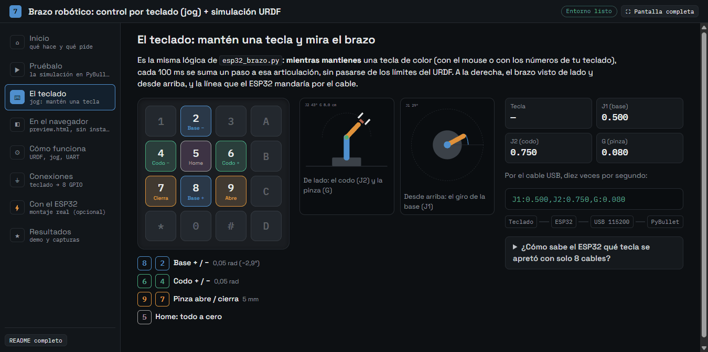

**Paso a paso de todo:**

1. [Cómo se hizo, paso a paso](#cómo-se-hizo-paso-a-paso): qué se hizo primero, qué después, qué falló y cómo se arregló.
2. [Cómo probarlo con la app, sección por sección](#con-la-app-sección-por-sección): qué ver y qué botón pulsar en cada sección, y qué hacer si algo falla.
3. [Cómo probarlo sin la app](#sin-la-app-desde-la-consola) (con comandos) y [con el ESP32 y el teclado reales](#con-el-esp32-y-el-teclado-reales).

Todo se puede probar sin hardware (la simulación de PyBullet con sus botones, el teclado de la app y `preview.html`). El montaje real, el teclado 4x4 cableado directo al ESP32, está en las [fotos](#el-montaje-y-la-demo) y se prueba con los pasos de "con el ESP32 y el teclado reales".

## ¿Quiere saber cómo funciona? → aquí está todo

[Qué es un URDF](#qué-es-un-urdf) (y [el árbol de este brazo](#el-árbol-de-este-brazo)) · [Qué es PyBullet](#qué-es-pybullet) · [El teclado matricial y su barrido](#qué-es-un-teclado-matricial-y-cómo-se-barre) · [UART](#qué-es-uart-y-cómo-llega-el-dato-al-pc) · [La idea general](#la-idea-general) · [Conexiones](#conexiones) · [Qué hace cada archivo](#qué-hace-cada-archivo) · [La lógica del código](#la-lógica-del-código) ([ESP32](#en-el-esp32-esp32_brazopy), [PC](#en-el-pc-brazo_pybulletpy)) · [Cómo probarlo](#cómo-probarlo) · [El montaje y la demo](#el-montaje-y-la-demo) · [Cómo se hizo](#cómo-se-hizo-paso-a-paso)

---

Basado en el archivo compartido por la cátedra [brazo.urdf](https://github.com/dialejobv/U_Militar/blob/main/8%29%20Brazo_URDF/brazo.urdf) (y su `main.py`, que solo carga el brazo en PyBullet y lista sus articulaciones). El URDF define un brazo con giro de base, codo y una pinza de dos dedos.

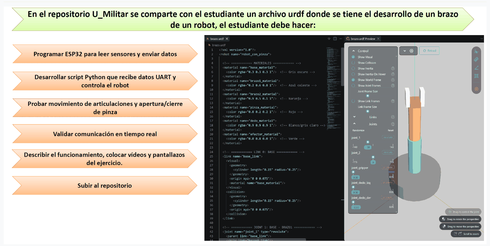

La actividad pedía cinco cosas: programar el ESP32 para leer sensores y enviar datos, hacer un script de Python que reciba esos datos por UART y controle el robot, probar el movimiento de las articulaciones y la apertura/cierre de la pinza, validar la comunicación en tiempo real, y documentarlo. Lo que quedó:

- El ESP32 lee un **teclado matricial 4x4**, conectado directo a 8 de sus GPIO con la cinta de 8 cables del propio teclado, y lo usa como un mando de *jog*: mientras se mantiene una tecla, la articulación correspondiente se mueve un paso fijo cada 100 ms. Diez veces por segundo manda la posición de las tres articulaciones al PC en una línea de texto (`J1:0.150,J2:-0.300,G:0.020`).
- `brazo_pybullet.py` carga el mismo `brazo.urdf` del profesor en PyBullet, lee esas líneas sin frenar la simulación y mueve los motores de cada articulación hacia la posición recibida. La pinza sube a lo largo del segundo tramo y sus dos dedos se abren a la vez.
- Si no hay ESP32 conectado, la ventana de PyBullet trae 7 botones con el mismo esquema de jog, así que la simulación se puede mostrar sin nada de hardware.

## Qué es un URDF

Un URDF (*Unified Robot Description Format*) es un archivo XML que describe un robot como un **árbol de piezas rígidas** unidas por articulaciones. Es el formato que usa ROS (el framework de robótica más usado) para describir robots reales, así que no es un formato "de juguete": el mismo archivo sirve para simular, para visualizar y para planear movimientos.

Tiene dos tipos de elementos:

- **`<link>`**: una pieza rígida. Trae su forma visual (`<visual>`: cilindro, caja, esfera o una malla 3D), su forma de choque (`<collision>`, normalmente la misma) y un color (`<material>`). Un link no se mueve solo: se mueve porque cuelga de otro.
- **`<joint>`**: la unión entre un link padre y un link hijo. Dice dónde está la unión (`<origin>`, medido desde el padre), alrededor de qué eje se mueve (`<axis>`), de qué tipo es y entre qué valores puede moverse (`<limit lower upper>`), con qué fuerza máxima (`effort`) y a qué velocidad máxima (`velocity`). Los tipos que usa este brazo son:
  - `revolute`: una bisagra que gira entre un ángulo mínimo y uno máximo (en radianes).
  - `prismatic`: un riel que se desliza en línea recta entre dos posiciones (en metros).

Como cada joint se mide desde su padre, al girar la base giran con ella todos los links que cuelgan de ella: eso es la **cinemática directa** (a partir de los ángulos de cada articulación, saber dónde queda cada pieza), y PyBullet la calcula sola.

### El árbol de este brazo

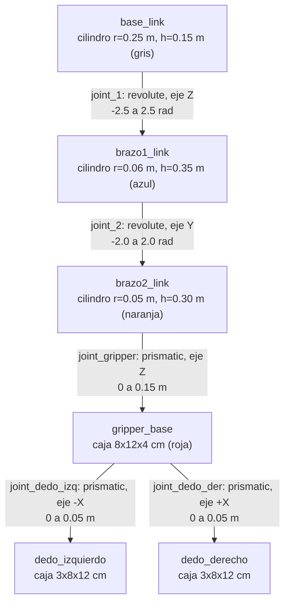
```mermaid
flowchart TD
    B["base_link<br/>cilindro r=0.25 m, h=0.15 m (gris)"] -->|"joint_1: revolute, eje Z<br/>-2.5 a 2.5 rad"| A1["brazo1_link<br/>cilindro r=0.06 m, h=0.35 m (azul)"]
    A1 -->|"joint_2: revolute, eje Y<br/>-2.0 a 2.0 rad"| A2["brazo2_link<br/>cilindro r=0.05 m, h=0.30 m (naranja)"]
    A2 -->|"joint_gripper: prismatic, eje Z<br/>0 a 0.15 m"| G["gripper_base<br/>caja 8x12x4 cm (roja)"]
    G -->|"joint_dedo_izq: prismatic, eje -X<br/>0 a 0.05 m"| DI["dedo_izquierdo<br/>caja 3x8x12 cm"]
    G -->|"joint_dedo_der: prismatic, eje +X<br/>0 a 0.05 m"| DD["dedo_derecho<br/>caja 3x8x12 cm"]
```

| Joint | Tipo | Eje | Límites | Qué hace en la práctica |
|---|---|---|---|---|
| `joint_1` | revolute | Z (vertical) | −2.5 a 2.5 rad (±143°) | gira todo el brazo sobre la base, como una torreta |
| `joint_2` | revolute | Y | −2.0 a 2.0 rad (±115°) | dobla el codo hacia adelante o hacia atrás |
| `joint_gripper` | prismatic | Z del segundo tramo | 0 a 0.15 m | **sube** la pinza a lo largo del segundo tramo |
| `joint_dedo_izq` / `joint_dedo_der` | prismatic | −X / +X | 0 a 0.05 m cada uno | separan los dedos (abren la pinza) |

Una aclaración que nos costó entender al principio: en el URDF, `joint_gripper` tiene el comentario "PINZA (APERTURA)", pero en realidad no abre nada, es un riel que extiende la pinza hacia arriba. Los que abren son los dedos. Para no tener cinco controles distintos, el script mueve los dos dedos en proporción a `joint_gripper`: el máximo de cada dedo (0.05 m) es justo un tercio del máximo de `joint_gripper` (0.15 m), así que con `dedo = g / 3` una sola variable lleva la pinza de "recogida y cerrada" a "extendida y abierta". Por eso en el teclado hay una sola tecla de "pinza +" y una de "pinza −".

El enunciado muestra el URDF abierto con un visor dentro del editor (con sliders por articulación). Ese visor sirve para mirar el robot, pero no puede recibir datos de un puerto serial; por eso lo simulamos en PyBullet.

## Qué es PyBullet

PyBullet es un motor de física de código abierto (gravedad, colisiones, fricción, motores) que se maneja desde Python y que carga URDFs directamente con `p.loadURDF(...)`. Lo importante para este tema es **cómo se mueve una articulación**: en vez de "teletransportar" el link a un ángulo, se le da a cada joint un motor con una posición objetivo:

```python
p.setJointMotorControl2(robot_id, indices["joint_1"], p.POSITION_CONTROL, targetPosition=j1)
```

En modo `POSITION_CONTROL`, PyBullet calcula en cada paso de la simulación la fuerza necesaria para acercar el joint a ese objetivo, limitada por el `effort` del URDF. Por eso el brazo se ve moverse con inercia en vez de saltar, y por eso tampoco puede pasarse de los `<limit>` del archivo. La simulación avanza de a un paso con `p.stepSimulation()`; el paso por defecto es 1/240 s, así que llamándolo 240 veces por segundo la simulación va en tiempo real.

Otra cosa de PyBullet que usamos: los controles de la ventana (`addUserDebugParameter`) pueden ser sliders o botones. Si se crea con el mínimo mayor que el máximo (`addUserDebugParameter("pinza +", 1, 0, 0)`), PyBullet lo dibuja como **botón**, y su "valor" es un contador que sube en 1 con cada click.

## Qué es un teclado matricial y cómo se barre

El teclado 4x4 trae 16 teclas pero solo 8 cables: 4 **filas** (R1-R4) y 4 **columnas** (C1-C4). Cada tecla es solo un contacto que, al apretarse, une una fila con una columna; no pone ningún voltaje por sí misma. Por eso no se pueden leer 16 teclas "una por una": hay que **barrer** la matriz.

Los 8 cables van directo a 8 GPIO del ESP32 (los mismos pines que el tema 8 punto 1 y el taller, así el mismo montaje sirve para los tres):

- Las 4 filas son **salidas** y en reposo quedan en 1.
- Las 4 columnas son **entradas con pull-up interna**: la resistencia interna del ESP32 las mantiene en 1 mientras nadie las baje. Sin ella, una columna sin tecla apretada quedaría "flotando" y leería ruido.

`leer_tecla()` hace esto cuatro veces, una por fila:

1. Baja a 0 **una sola fila** (las otras tres quedan en 1) y espera unos microsegundos a que la señal se asiente.
2. Lee las 4 columnas.
3. Si alguna columna está en 0, es porque hay una tecla apretada uniendo esa columna con la fila que está en 0: el cruce fila/columna dice cuál es (`MAPA_TECLAS[i][j]`). Antes de salir vuelve a subir la fila.

```python
ROW_PINS = [14, 27, 26, 25]   # R1..R4
COL_PINS = [33, 32, 18, 19]   # C1..C4
filas = [Pin(p, Pin.OUT, value=1) for p in ROW_PINS]
columnas = [Pin(p, Pin.IN, Pin.PULL_UP) for p in COL_PINS]

for i, fila in enumerate(filas):
    fila.value(0)                     # solo esta fila en bajo
    time.sleep_us(10)
    for j, col in enumerate(columnas):
        if col.value() == 0:          # esta columna bajó con la fila i
            fila.value(1)
            return MAPA_TECLAS[i][j]
    fila.value(1)
```

Si se bajaran las cuatro filas a la vez se sabría la columna pero no cuál de las cuatro filas la bajó: por eso va de una en una. Las cuatro vueltas toman muy poco, así que para quien aprieta es instantáneo.

## Qué es UART y cómo llega el dato al PC

UART es la comunicación serial más simple: dos cables (TX transmite, RX recibe), sin reloj compartido, donde los dos lados se ponen de acuerdo de antemano en la velocidad (los **baudios**, bits por segundo). Acá la UART va por el mismo cable USB con el que se programa el ESP32: la placa trae un chip conversor USB-serial, y en MicroPython todo lo que se imprime con `print()` sale por ahí a 115200 baudios. En el PC ese mismo puerto aparece como un `COMx` y se lee con `pyserial`. Así que el "protocolo" del ESP32 es simplemente imprimir una línea de texto por cada dato.

## La idea general

El control es solo con teclado, tipo mando de jog (como el *teach pendant* con el que se maneja a mano un brazo industrial): mantener presionada una tecla mueve una articulación y se suelta cuando llega a donde se quiere. El esquema de teclas es el de las flechas de un teclado numérico:

| Tecla | Efecto | Paso por tick (100 ms) |
|---|---|---|
| `8` / `2` | `joint_1` (base) + / − | 0.05 rad (~2.9°) |
| `6` / `4` | `joint_2` (codo) + / − | 0.05 rad (~2.9°) |
| `9` / `7` | pinza + / − (extiende y abre / recoge y cierra) | 0.005 m (5 mm) |
| `5` | vuelve las 3 articulaciones a 0 (home) | — |

Con esos pasos, sostener una tecla de articulación mueve unos 29° por segundo y la pinza recorre su carrera completa (15 cm) en 3 segundos: rápido, pero todavía se puede parar donde uno quiere. Las demás teclas (`1`, `3`, `0`, `A`-`D`, `*`, `#`) no hacen nada.

Antes de llegar a esto probamos con 3 potenciómetros fijos (uno por articulación) y después con teclado más un potenciómetro compartido. Terminamos quitando el potenciómetro del todo: el teclado solo ya alcanza para mover todo, y es el mismo teclado (con los mismos pines) que se usa en el tema 8 y en el taller, sin ningún componente analógico.

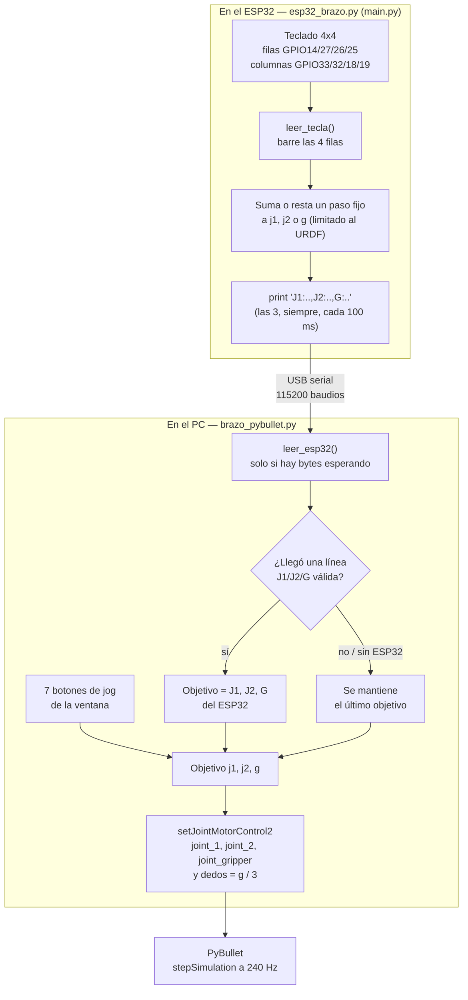
```mermaid
flowchart TD
    subgraph ESP["En el ESP32 — esp32_brazo.py (main.py)"]
        Teclado["Teclado 4x4<br/>filas GPIO14/27/26/25<br/>columnas GPIO33/32/18/19"] --> Barre["leer_tecla()<br/>barre las 4 filas"]
        Barre --> Actualiza["Suma o resta un paso fijo<br/>a j1, j2 o g (limitado al URDF)"]
        Actualiza --> Envia["print 'J1:..,J2:..,G:..'<br/>(las 3, siempre, cada 100 ms)"]
    end

    Envia -->|"USB serial<br/>115200 baudios"| Recibe

    subgraph PC["En el PC — brazo_pybullet.py"]
        Recibe["leer_esp32()<br/>solo si hay bytes esperando"] --> Valido{"¿Llegó una línea<br/>J1/J2/G válida?"}
        Valido -->|"sí"| UsaESP["Objetivo = J1, J2, G<br/>del ESP32"]
        Valido -->|"no / sin ESP32"| Mantiene["Se mantiene<br/>el último objetivo"]
        Botones["7 botones de jog<br/>de la ventana"] --> Objetivo
        UsaESP --> Objetivo["Objetivo j1, j2, g"]
        Mantiene --> Objetivo
        Objetivo --> Mueve["setJointMotorControl2<br/>joint_1, joint_2, joint_gripper<br/>y dedos = g / 3"]
    end

    Mueve --> Sim["PyBullet<br/>stepSimulation a 240 Hz"]
```

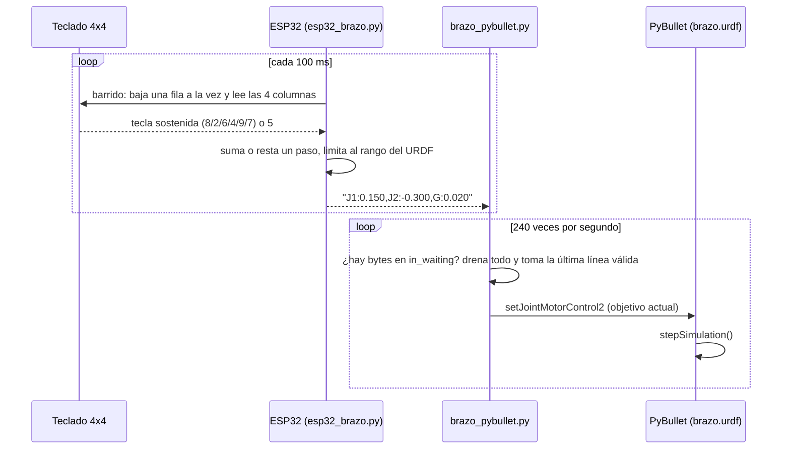
```mermaid
sequenceDiagram
    participant T as Teclado 4x4
    participant E as ESP32 (esp32_brazo.py)
    participant P as brazo_pybullet.py
    participant S as PyBullet (brazo.urdf)

    loop cada 100 ms
        E->>T: barrido: baja una fila a la vez y lee las 4 columnas
        T-->>E: tecla sostenida (8/2/6/4/9/7) o 5
        E->>E: suma o resta un paso, limita al rango del URDF
        E-->>P: "J1:0.150,J2:-0.300,G:0.020"
    end
    loop 240 veces por segundo
        P->>P: ¿hay bytes en in_waiting? drena todo y toma la última línea válida
        P->>S: setJointMotorControl2 (objetivo actual)
        S->>S: stepSimulation()
    end
```

La simulación da unos 24 pasos por cada línea que manda el ESP32 (240 pasos por segundo contra 10 líneas por segundo). Por eso es tan importante que la lectura serial no espere: ver "La lógica del código" más abajo.

## Conexiones

Solo va el teclado al ESP32, con los 8 cables de su cinta directo a 8 GPIO; no hace falta ningún otro sensor, fuente ni resistencia. Mirando el teclado de frente, los 8 pines de la cinta van, de izquierda a derecha, R1 R2 R3 R4 C1 C2 C3 C4.

| Cable del teclado | Qué teclas une | ESP32 | En el firmware | Modo |
|---|---|---|---|---|
| Fila R1 | `1 2 3 A` | `GPIO14` | `ROW_PINS[0]` | salida, reposo en 1 |
| Fila R2 | `4 5 6 B` | `GPIO27` | `ROW_PINS[1]` | salida, reposo en 1 |
| Fila R3 | `7 8 9 C` | `GPIO26` | `ROW_PINS[2]` | salida, reposo en 1 |
| Fila R4 | `* 0 # D` | `GPIO25` | `ROW_PINS[3]` | salida, reposo en 1 |
| Columna C1 | `1 4 7 *` | `GPIO33` | `COL_PINS[0]` | entrada con pull-up interna |
| Columna C2 | `2 5 8 0` | `GPIO32` | `COL_PINS[1]` | entrada con pull-up interna |
| Columna C3 | `3 6 9 #` | `GPIO18` | `COL_PINS[2]` | entrada con pull-up interna |
| Columna C4 | `A B C D` | `GPIO19` | `COL_PINS[3]` | entrada con pull-up interna |

Por qué esos pines: son GPIO de uso general que no tienen función especial al arrancar. Se evitan los GPIO 34 a 39 para las columnas porque son solo de entrada y **no tienen pull-up interna** (el barrido no funcionaría sin resistencias externas), los GPIO 6 a 11 porque están conectados a la memoria flash, y los pines de *strapping* (0, 2, 12, 15), que deciden cómo arranca la placa. Son exactamente los mismos del tema 8 punto 1 y del taller, así que el teclado se arma una vez y sirve para todo.

Si al apretar una tecla sale otra distinta, el teclado tiene sus pines en otro orden: basta con intercambiar cables (o las listas `ROW_PINS`/`COL_PINS` en el código).

**ESP32 → PC**: un cable USB, el mismo que se usa para programarlo. En el Administrador de dispositivos de Windows se ve qué `COM` le asignó (por ejemplo `COM7`); ese va en `PUERTO_SERIAL` dentro de `brazo_pybullet.py`.

## Qué hace cada archivo

- **`brazo.urdf`**: el brazo del profesor, tal cual viene en U_Militar (6 links y 5 joints, ver el árbol de arriba). No lo modificamos; `brazo_pybullet.py` lee de él los nombres, índices y límites de cada articulación.
- **`esp32_brazo.py`**: el firmware del ESP32 en MicroPython. Se guarda en la placa como `main.py`. Barre el teclado (8 GPIO), actualiza las tres posiciones con los pasos de jog y las imprime cada 100 ms.
- **`brazo_pybullet.py`**: el programa del PC. Abre el puerto serial si puede, carga el URDF en PyBullet, crea los botones de jog y en un bucle lee el serial, aplica los botones, mueve los motores y avanza la simulación. Si el ESP32 se desenchufa a mitad de camino, sigue con los botones y reintenta abrir el puerto cada 3 s.
- **`img/enunciado-actividad.png`**: la captura del enunciado de la actividad.
- **`img/`**: las fotos del montaje real, el montaje en 3D y las animaciones de la sección "El montaje y la demo".
- **`entorno/`**: el entorno virtual de Python del tema, con `pybullet` y `pyserial` ya instalados. No se sube a GitHub (tiene su propio `.gitignore` con `*`).
  Para crearlo en otro PC (Python 3.14), dentro de esta carpeta: `py -3.14 -m venv entorno` y `entorno\Scripts\python -m pip install pybullet==3.2.7 pyserial==3.5`. PyBullet no publica paquetes ya compilados para Windows, así que pip lo compila desde el código fuente: hace falta tener instalado Visual Studio 2022 (o las *Build Tools*) con la carga de trabajo de C++, y la primera instalación tarda unos 10 minutos (probado con Python 3.14 y 3.13). Si falla con `Unable to find a compatible Visual Studio installation` teniendo las Build Tools instaladas, es que `vswhere.exe` no está en el PATH: antes de instalar, `set PATH=C:\Program Files (x86)\Microsoft Visual Studio\Installer;%PATH%` en la misma consola.
- **`probar.json`**: la receta que usa la app (el lanzador `_lanzador/` de la raíz del repo) para probar este tema sin hardware: la simulación, `preview.html` y las imágenes.
- **`ABRIR.bat`** / **`abrir.sh`** y **`app/`**: abren la app de la práctica (ver arriba, "¿Quiere probarlo?"). `app/` es la página: `index.html`, `brazo.js` (el teclado con la misma lógica de `esp32_brazo.py` y el brazo de lado y desde arriba con la cinemática de `brazo.urdf`) y `brazo.css`.

## La lógica del código

### En el ESP32 (`esp32_brazo.py`)

Arranca con `j1 = j2 = g = 0` y entra a un bucle infinito que en cada vuelta:

1. Llama a `leer_tecla()` (el barrido de arriba). Como el teclado va directo a los GPIO, no hay nada que "no conteste": con un cable suelto la tecla simplemente no se detecta y el ESP32 sigue mandando la última posición, sin que `main.py` se caiga.
2. Según la tecla, suma o resta el paso a la variable que toca y la pasa por `limitar()`, que la deja dentro de los mismos `<limit>` del URDF (`LIM_J1 = (-2.5, 2.5)`, `LIM_J2 = (-2.0, 2.0)`, `LIM_G = (0.0, 0.15)`). La tecla `5` pone las tres en 0.
3. Imprime siempre las tres posiciones, con 3 decimales, y duerme 100 ms:

   ```python
   print("J1:{:.3f},J2:{:.3f},G:{:.3f}".format(j1, j2, g))
   time.sleep(0.1)
   ```

Mandar siempre las tres (y no solo la que cambió) hace que cada línea sea autosuficiente: si el PC se pierde una, la siguiente ya trae la posición completa. Y como la línea sale cada 100 ms aunque no se apriete nada, la tecla "sostenida" es simplemente que el barrido la sigue viendo en cada vuelta y cada vuelta suma un paso. Por el USB se ve algo así mientras se sostiene el `8`:

```
J1:0.000,J2:0.000,G:0.000
J1:0.050,J2:0.000,G:0.000
J1:0.100,J2:0.000,G:0.000
J1:0.150,J2:0.000,G:0.000
```

### En el PC (`brazo_pybullet.py`)

**1. Patrón "sin necesidad de estar conectado".** El puerto (`PUERTO_SERIAL`, `COM7` salvo que se pase otro como argumento: `python brazo_pybullet.py COM5`) se abre dentro de un `try/except serial.SerialException`. Si falla (no hay ESP32, otro COM, o Thonny tiene el puerto abierto), `ser` queda en `None`, se avisa por consola y todo lo demás funciona igual con los botones de la ventana. Si abre bien, espera 2 segundos y vacía el buffer: abrir el puerto mueve la línea DTR del conversor USB-serial y eso **reinicia** el ESP32, así que hay que darle tiempo a que arranque `main.py` y descartar el texto de arranque de MicroPython.

**2. Leer los límites del propio URDF.** En vez de copiar los números a mano, recorre las articulaciones con `p.getJointInfo()` y guarda el índice de cada una (por nombre) y sus límites (`info[8]` e `info[9]`). Si el URDF cambia, el script se adapta solo.

**3. Lectura serial que no frena la simulación.** Esta fue la decisión más importante del tema. La simulación corre a 240 pasos por segundo y el ESP32 manda 10 líneas por segundo. Si dentro del bucle se hiciera un `ser.readline()` que espera a que llegue una línea, toda la ventana quedaría atada al ritmo del ESP32 y el brazo se vería trabado. Por eso `leer_esp32()`:

- sale de inmediato si `ser.in_waiting == 0` (no hay bytes esperando),
- si hay, lee **todo** lo acumulado de una vez, lo parte por `\n` y guarda el pedazo incompleto para la próxima vuelta (una línea puede llegar partida en dos lecturas),
- revisa cada línea completa con una expresión regular y se queda solo con la **última válida**, que es la posición actual del jog:

```python
PATRON_LINEA = re.compile(r"J1:(-?[\d.]+),J2:(-?[\d.]+),G:(-?[\d.]+)")
```

Si solo se leyera una línea por vuelta, las líneas se irían apilando y el brazo reaccionaría con cada vez más retraso respecto al teclado.

**4. Diagnóstico en la ventana.** La última línea **cruda** que llegó (sea o no válida) se muestra arriba en la ventana, en verde, como `Serial: ...`. Es la herramienta más útil cuando "no pasa nada": si nunca cambia de `(sin datos todavia)`, el ESP32 no está mandando nada; si cambia pero no es `J1:..`, el problema es de formato (por ejemplo, otro programa en la placa en vez de `esp32_brazo.py`). El texto solo se reescribe cuando cambia (`replaceItemUniqueId`), porque recrearlo 240 veces por segundo lo haría parpadear.

**5. Botones de jog.** Siete botones fijos (`joint_1 (base) +`, `joint_1 (base) -`, `joint_2 (codo) +`, `joint_2 (codo) -`, `pinza +`, `pinza -`, `Home (0, 0, 0)`) con los mismos pasos que el ESP32 (`PASO_LOCAL = {"j1": 0.05, "j2": 0.05, "g": 0.005}`). Como un botón de PyBullet es un contador, `leer_botones()` compara cada contador con el de la vuelta anterior y aplica la diferencia (si hubo dos clicks entre dos vueltas, se aplican los dos). Funcionan también con el ESP32 conectado, aunque ahí la siguiente línea del ESP32 (a los 100 ms) vuelve a poner la posición del teclado.

   Primero probamos un solo slider cuyo rango cambiaba según la articulación elegida (borrarlo y crear uno nuevo). No funcionó: `p.removeUserDebugItem()` no borra de forma confiable los sliders ya creados y los viejos se iban quedando pegados en el panel. Por eso quedaron botones fijos, creados una sola vez, que nunca se recrean.

**6. Una sola posición objetivo.** Tanto las líneas del ESP32 como los botones escriben sobre el mismo diccionario `valores = {"j1", "j2", "g"}`. Cuando el ESP32 manda algo, su posición reemplaza a la local; en las vueltas en que no llega nada, el brazo mantiene la última posición (no vuelve a 0). Así el brazo nunca "salta" entre dos fuentes.

**7. Mover y avanzar.** En cada vuelta se manda el objetivo a los cinco motores (los dos dedos con `g / 3`), se llama a `p.stepSimulation()` y se duerme 1/240 s. El bucle es `while p.isConnected()`, así que al cerrar la ventana el script termina limpio (si la ventana se cierra justo a mitad de una vuelta, la siguiente llamada a PyBullet tira `pybullet.error`; el script lo reconoce como "se cerró la ventana" y no muestra ningún error), y en el `finally` se cierra el puerto para que Thonny lo pueda volver a abrir. Al final imprime `Simulacion terminada.`

**8. Si el ESP32 se desenchufa a mitad de la simulación.** Con el puerto ya abierto, desenchufar la placa hace que la siguiente consulta a `ser.in_waiting` (o `ser.read`) tire `SerialException`. Antes eso tumbaba el script con un traceback; ahora `leer_esp32()` lo atrapa y llama a `perder_esp32()`, que cierra el puerto, pone `ser = None`, avisa por consola (`Se perdio el ESP32 en COM7 ...`) y escribe en la línea verde `Serial: ESP32 desconectado: modo botones (reintentando COM7)`. El brazo se queda en la última posición recibida y los botones siguen funcionando. Cada 3 s (`REINTENTO_S`), `intentar_reconectar()` prueba a abrir el puerto otra vez; abrir un COM que no existe falla en milisegundos, así que no frena la simulación. Al volver a enchufarlo dice `ESP32 reconectado en COM7` y sigue con los datos del teclado; como abrir el puerto reinicia la placa (DTR), el ESP32 vuelve a empezar en `0, 0, 0` y el brazo vuelve a home. Esto solo pasa si el ESP32 estaba conectado al empezar: si se arrancó sin él, el script no vuelve a tocar el puerto (el modo "solo botones" queda exactamente igual).

## Cómo probarlo

Hay tres formas, de la más fácil a la más completa: con la app (doble clic, sin escribir comandos), sin la app (desde la consola) y con el ESP32 y el teclado reales.

### Con la app, sección por sección

1. **Abrirla.** Doble clic en [`ABRIR.bat`](ABRIR.bat) (en Linux o Mac, `sh abrir.sh`). Sale una consola que dice `Abriendo la app de 7-brazo-robotico-urdf...` y se minimiza sola: es la que mantiene la app funcionando, no hay que cerrarla mientras se usa. Se abre una ventana tipo programa con la pantalla "Abriendo la práctica…" y después la app, con la barra lateral a la izquierda. Arriba a la derecha están el estado del entorno (`Entorno listo`, o `Entorno: se prepara al iniciar` la primera vez) y el botón **Pantalla completa** (Esc para salir). Abajo de la barra lateral, **README completo** abre este README dentro de la app. Si el `ABRIR.bat` dice que no encuentra Python, hay que instalar Python 3.9 o más nuevo (el mismo mensaje dice cómo) y volver a hacer doble clic.
2. **Inicio.** Qué hace la práctica en una frase y el GIF del jog. **Probar la simulación** lleva a "Pruébalo" y **Mover el brazo aquí mismo** lleva a "El teclado". Abajo, cuánto tarda cada cosa y la lista **Qué pide la actividad** (los 5 puntos del enunciado, cada uno con la prueba que lo cubre); las casillas se marcan solas cuando termina bien una prueba que cubre ese punto.
3. **Pruébalo** (la simulación real). Pulsar **Iniciar la simulación**. La primera vez la app crea el entorno e instala `pybullet` y `pyserial`: PyBullet se compila (~10 min, necesita las Build Tools de C++ de Visual Studio; si faltan, el panel lo avisa con el comando para instalarlas) y la barra muestra el avance; las siguientes veces abre en unos 5 s. Mientras arranca, el botón dice "Ejecutándose…", aparece **Detener** y una barra "Abriendo PyBullet…". En "Lo que dice el programa" debe salir `No se encontro el ESP32 en COM7: se usan los botones de jog de PyBullet.` (es lo normal sin placa), varios avisos `No inertial data for link, using mass=1` (normales: el URDF del profesor no trae masas) y `Ventana de PyBullet abierta...`. La ventana de PyBullet puede quedar detrás de la app: buscarla en la barra de tareas. En su panel derecho, cada clic en `joint_1 (base) +`/`-` gira la base ~2,9°, `joint_2 (codo) +`/`-` dobla el codo, `pinza +`/`-` sube la pinza 5 mm y abre los dedos a la vez, y `Home (0, 0, 0)` lo devuelve todo a cero. Arriba, en verde, `Serial: sin ESP32 (modo botones)`. Para terminar: cerrar la ventana de PyBullet o pulsar **Detener**; al cerrar la ventana, la salida termina con `Simulacion terminada.` Si falla, el panel muestra un resumen y las últimas líneas; "Detalles técnicos" (plegado) tiene el comando exacto.
4. **El teclado.** El mismo teclado 4x4 del ESP32, clicable, sin instalar nada. Mantener presionada una tecla de color con el mouse (o con los números del teclado del PC): `8`/`2` giran la base, `6`/`4` doblan el codo, `9`/`7` abren y cierran la pinza, `5` vuelve a home; las teclas grises no hacen nada, igual que en el firmware. Mientras se sostiene, cada 100 ms suma un paso: se ven cambiar las lecturas J1/J2/G, el brazo de lado y desde arriba, y la línea `J1:..,J2:..,G:..` que mandaría el ESP32 por el USB (por ejemplo, 1 s sostenido el `8` deja `J1:0.550`: el primer paso se aplica al apretar y después uno cada 100 ms). El desplegable "¿Cómo sabe el ESP32 qué tecla se apretó con solo 8 cables?" explica el barrido.
5. **En el navegador.** `preview.html` dentro de la app: el teclado clicable y la vista 3D del brazo arriba, y debajo los modos y el monitor. En **Modo prueba** la página hace de ESP32: mantener `8/2/6/4/9/7/5` mueve el brazo y el monitor muestra 10 líneas por segundo. **Conectado (Web Serial)** muestra el botón **Conectar por USB**, que pide elegir el puerto del ESP32 (solo Chrome o Edge) y desde ahí el brazo sigue al teclado real. **Abrir en su propia pestaña** abre la misma página a pantalla completa.
6. **Cómo funciona.** El flujo teclado → ESP32 → USB → `brazo_pybullet.py` → PyBullet, las tres articulaciones y, en desplegables, los trozos de este README (qué es un URDF, qué es PyBullet, la lógica del código).
7. **Conexiones.** El montaje en 3D, la cinta de 8 pines con su GPIO y la tabla de conexiones, y las fotos del montaje real. Las imágenes se amplían con un clic.
8. **Con el ESP32.** Los pasos del montaje real (los mismos de [más abajo](#con-el-esp32-y-el-teclado-reales)), qué revisar "si no pasa nada", el programa del ESP32 completo (desplegable "Ver el programa del ESP32") y "Detalles técnicos" (puerto, versiones, cómo compilar PyBullet).
9. **Resultados.** El GIF del jog, el montaje y las capturas de `preview.html`; el enlace lleva a esta carpeta en GitHub.

Si algo falla: si la app dice "El lanzador se cerró", se cerró la consola del `ABRIR.bat` (volver a hacer doble clic); si la ventana de PyBullet no aparece, mirar la salida del panel "Pruébalo" (el error está ahí) y la barra de tareas; si la compilación de PyBullet falla con `Unable to find a compatible Visual Studio installation`, ver la nota de `entorno/` en [Qué hace cada archivo](#qué-hace-cada-archivo).

### Sin la app (desde la consola)

Todos los comandos se corren desde la carpeta `7-brazo-robotico-urdf`, con el entorno del tema (ya trae `pybullet` y `pyserial`; para crearlo en otro PC, ver `entorno/` en [Qué hace cada archivo](#qué-hace-cada-archivo)).

**Sin ESP32 conectado:**

1. `entorno\Scripts\python -m pip list` para comprobar que el entorno está bien (deben aparecer `pybullet` y `pyserial`).
2. `entorno\Scripts\python brazo_pybullet.py`. En la consola aparece `No se encontro el ESP32 en COM7: se usan los botones de jog de PyBullet.` y se abre la ventana. Los avisos `No inertial data for link, using mass=1` que salen antes son normales: el URDF del profesor no trae `<inertial>` y PyBullet le pone 1 kg a cada pieza.
3. En el panel de la derecha, hacer click en los botones de jog: cada click mueve la articulación ~2.9° (o la pinza 5 mm). Con `pinza +` se ve cómo la pinza sube y los dedos se separan a la vez; `Home (0, 0, 0)` lo devuelve todo a cero. Arriba, la línea de estado dice `Serial: sin ESP32 (modo botones)`.
4. Cerrar la ventana (o `Ctrl+C` en la consola): sale `Simulacion terminada.` sin ningún error.
5. `preview.html` también se abre sin la app: doble clic en el archivo (Chrome o Edge) y funciona igual que en la sección "En el navegador" de la app.

### Con el ESP32 y el teclado reales

**Con ESP32 conectado:**

1. Armar las conexiones de arriba (los 8 cables de la cinta del teclado a `GPIO14/27/26/25` y `GPIO33/32/18/19`) y conectar el ESP32 al PC por USB.
2. Con Thonny, guardar `esp32_brazo.py` en la placa con el nombre `main.py`. Antes de seguir, **cerrar Thonny** (o darle Stop y desconectarlo): Windows deja abrir un puerto COM a un solo programa a la vez.
3. Comprobación rápida, sin PyBullet: en `preview.html` (o en la sección "En el navegador" de la app), **Conectado (Web Serial)** → **Conectar por USB** → elegir el puerto del ESP32. El monitor debe mostrar `J1:0.000,J2:0.000,G:0.000` diez veces por segundo y, al sostener una tecla física, los números y el brazo de la página deben cambiar. Después cerrar esa página (o recargarla) para liberar el puerto.
4. Ver en el Administrador de dispositivos (Puertos COM y LPT) qué `COM` tiene la placa. Si no es `COM7`, cambiar `PUERTO_SERIAL` arriba de `brazo_pybullet.py`, o pasarlo al correrlo: `entorno\Scripts\python brazo_pybullet.py COM5`. (La app usa siempre `PUERTO_SERIAL`.)
5. `entorno\Scripts\python brazo_pybullet.py` (o **Iniciar la simulación** en la app). Tarda 2 s más que sin placa, porque abrir el puerto reinicia el ESP32 y hay que esperar a que arranque; en la consola debe salir `ESP32 conectado en COM7: usando los datos reales del teclado.`
6. Mantener presionadas las teclas `8/2/6/4/9/7` y el brazo simulado se mueve en tiempo real; `5` lo lleva a home. Arriba de la ventana, `Serial: J1:..,J2:..,G:..` tiene que ir cambiando mientras se sostiene la tecla. Los botones de la ventana también funcionan, pero la siguiente línea del ESP32 (100 ms después) vuelve a poner la posición del teclado: con la placa conectada manda el teclado.
7. Si se desenchufa el USB con la simulación abierta, no se cae: la consola dice `Se perdio el ESP32 en COM7 ...`, la línea verde pasa a `ESP32 desconectado: modo botones (reintentando COM7)` y quedan los botones. Al volver a enchufarlo, en unos 3 s dice `ESP32 reconectado en COM7`, el brazo vuelve a home (la placa se reinició) y sigue al teclado.
8. Si algo no anda: si la línea `Serial:` se queda en `(sin datos todavia)`, el ESP32 no está mandando (revisar que el archivo se llame `main.py` en la placa y que Thonny no tenga el puerto); si las líneas `J1:..` llegan pero no cambian al apretar, el USB está bien y el problema es el cableado del teclado (revisar la tabla de conexiones: una fila o columna suelta deja sin respuesta a sus 4 teclas); si al apretar una tecla se mueve otra articulación, el teclado trae los pines en otro orden (intercambiar cables o las listas `ROW_PINS`/`COL_PINS`).

## El montaje y la demo

**El montaje real.** El teclado de membrana con su cinta de 8 cables va directo a los pines del ESP32, sin ningún módulo en el medio:

| El teclado 4x4 | Su cinta directo al ESP32 |
|---|---|
| 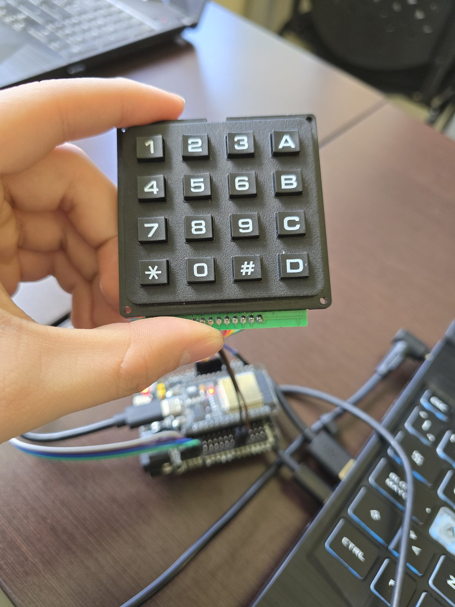 | 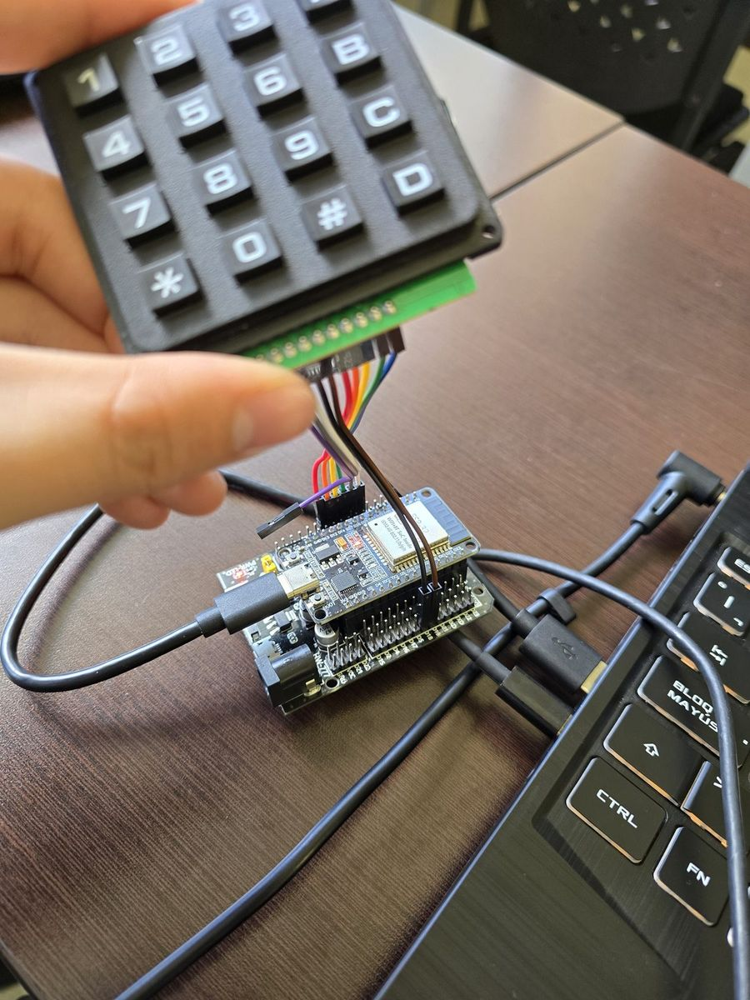 |

**El mismo montaje en 3D**, con el nombre de cada conexión (las filas R1-R4 a `GPIO14/27/26/25` y las columnas C1-C4 a `GPIO33/32/18/19`):

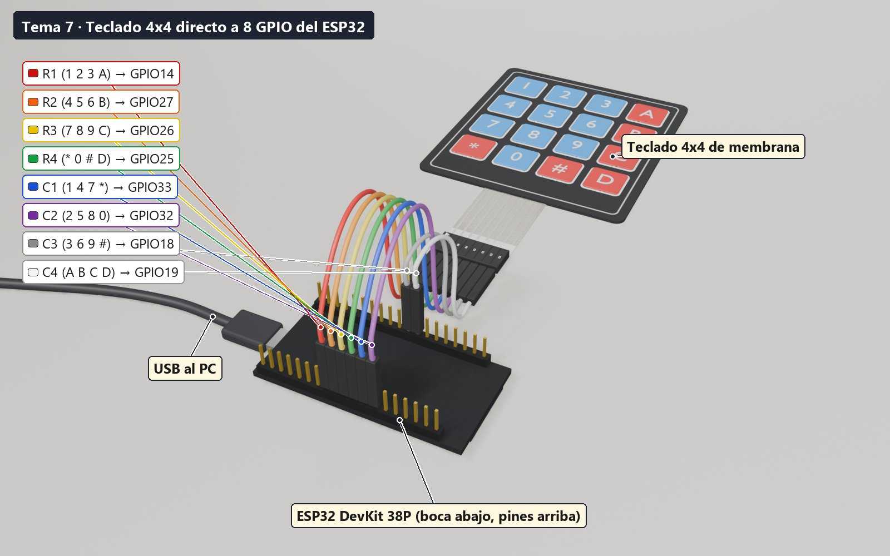

**La demo.** El jog con el teclado, sobre la simulación real (`brazo.urdf` en PyBullet, los mismos motores y pasos de física que `brazo_pybullet.py`): se sostiene `8` (base), `6` (codo), `9` (abre la pinza), `4`, `2` y `7`, y el `5` lo vuelve a home. A la izquierda se resalta la tecla sostenida y abajo va la línea que el ESP32 manda por serial cada 100 ms:


Tres poses en el camino:

| Base y codo (`8` y `6`) | Pinza extendida y abierta (`9`) | Al otro lado (`4` y `2`) |
|---|---|---|
| 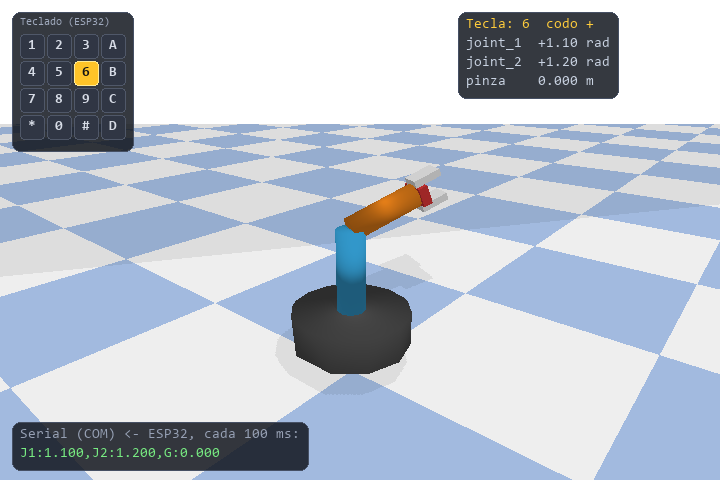 | 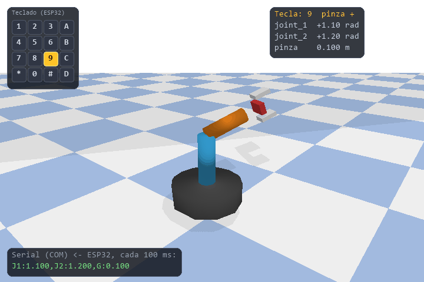 | 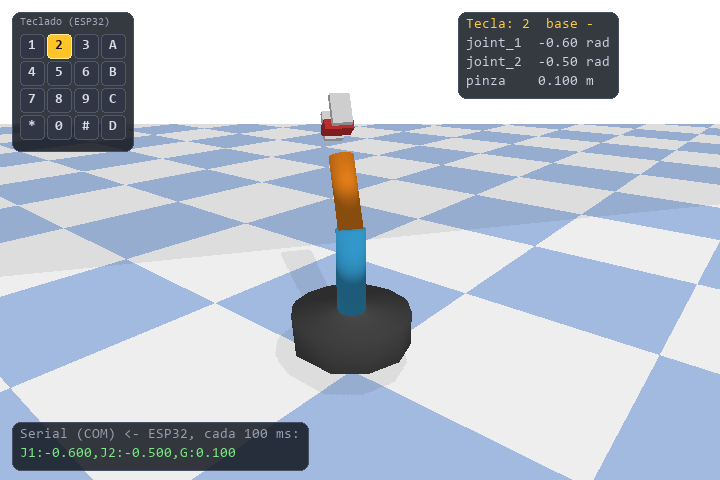 |
| `J1:1.100,J2:1.200,G:0.000` | la pinza sube 0,10 m y los dedos se abren `g / 3` | `J1:-0.600,J2:-0.500`, pinza todavía abierta |

**La previsualización en el navegador** (`preview.html`, se abre con doble clic en Chrome o Edge). Es una vista 3D simplificada del mismo brazo (cinemática directa de `brazo.urdf`, sin física) con el mismo teclado 4x4 clicable y el mismo jog del firmware. En "Modo prueba" la página se comporta como el ESP32 y manda 10 líneas por segundo al monitor; en "Conectado" lee las líneas reales del ESP32 por Web Serial:

| Recién abierta: brazo en home | Jog con `8`, `9` y `6` sostenido |
|---|---|
| 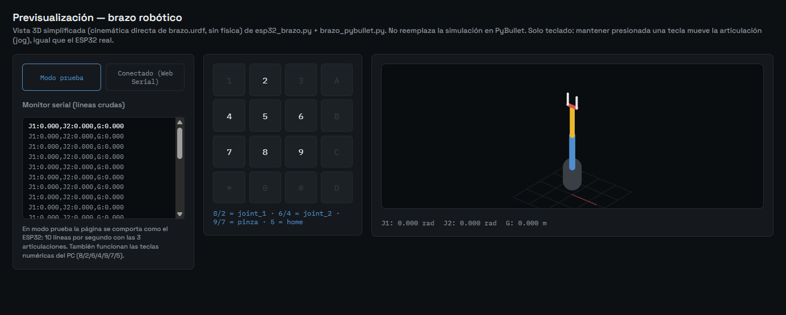 | 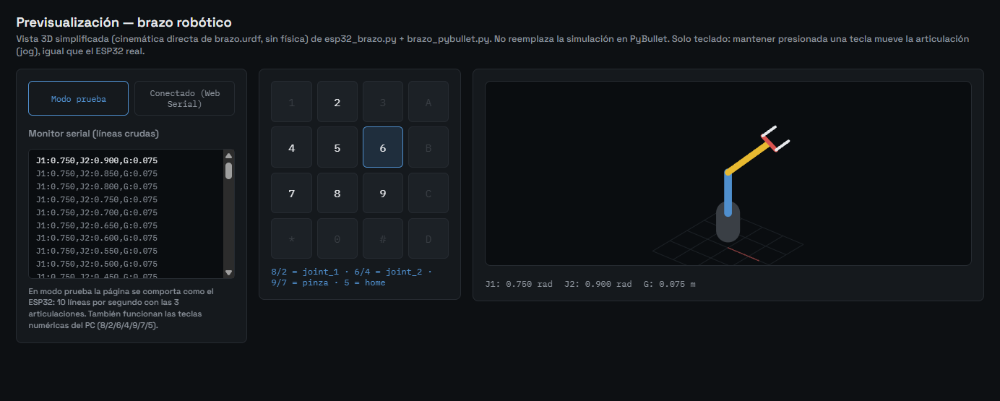 |

## Cómo se hizo, paso a paso

La historia técnica del tema, en el orden en que se fue armando (los detalles de cada pieza están en las secciones de arriba):

1. **Partir del ejemplo de la cátedra.** El [brazo.urdf](https://github.com/dialejobv/U_Militar/blob/main/8%29%20Brazo_URDF/brazo.urdf) de U_Militar y su `main.py`, que solo cargaba el brazo en PyBullet y listaba sus articulaciones. El URDF se dejó sin modificar; lo primero fue leerlo y dibujar [su árbol](#el-árbol-de-este-brazo) (6 links, 5 joints, con sus límites).
2. **Entender qué mueve cada joint.** `joint_gripper` dice "PINZA (APERTURA)" en el comentario del URDF, pero en realidad es un riel que **sube** la pinza; los que abren son los dos dedos. Para no tener cinco controles se unió todo en una variable: dedos = `g / 3` (0,05 m es un tercio de 0,15 m).
3. **Primer control en la ventana: un slider por articulación elegida.** Un solo slider cuyo rango cambiaba según la articulación (borrarlo y crear otro). No funcionó: `p.removeUserDebugItem()` no borra bien los sliders y los viejos se quedaban pegados en el panel. Se cambió a **7 botones fijos de jog** (cada clic suma o resta un paso fijo), creados una sola vez.
4. **El ESP32: de potenciómetros al teclado solo.** Primero 3 potenciómetros fijos (uno por articulación); después el teclado más un potenciómetro compartido; al final se quitó el potenciómetro: el teclado solo, como mando de jog (*teach pendant*), alcanza para mover todo y es el mismo teclado, con los mismos pines, que el tema 8 punto 1 y el taller. Se eligieron GPIO sin función especial al arrancar y con pull-up interna para las columnas (ver [Conexiones](#conexiones)).
5. **El protocolo.** Una línea de texto `J1:..,J2:..,G:..` cada 100 ms con las tres posiciones siempre (no solo la que cambió), para que cada línea sea autosuficiente; los límites del URDF se aplican ya en el ESP32.
6. **La lectura serial que trababa la simulación.** Un `readline()` dentro del bucle de PyBullet ataba los 240 pasos/s de la física a las 10 líneas/s del ESP32 y el brazo se veía trabado. Arreglo: leer solo si `in_waiting > 0`, drenar todo lo acumulado y quedarse con la última línea válida (y `timeout=0` por si acaso).
7. **El reinicio al abrir el puerto.** Abrir el COM mueve DTR y reinicia el ESP32: se agregó la espera de 2 s y el `reset_input_buffer()` para descartar el texto de arranque de MicroPython.
8. **Diagnóstico.** La última línea **cruda** en verde arriba de la ventana (`Serial: ...`), para distinguir "no llega nada" de "llega con otro formato".
9. **Sin hardware: `preview.html`.** Una página suelta con el mismo teclado 4x4 clicable, el mismo jog y la cinemática directa del URDF, con "Modo prueba" y "Conectado" por Web Serial; después la demo animada y las capturas.
10. **La app.** `ABRIR.bat` + `app/` sobre el lanzador común del repo (`_lanzador/`): la simulación con un botón, el teclado clicable con el brazo de lado y desde arriba, y `preview.html` embebido. Para que el script funcione lanzado desde otra carpeta, el URDF se carga con ruta absoluta.
11. **Revisión (2026-10-06).** Se encontró que desenchufar el ESP32 con la simulación abierta tumbaba el script (`SerialException` en `ser.in_waiting`): ahora pasa a modo botones y reintenta abrir el puerto cada 3 s ([punto 8 de la lógica del PC](#en-el-pc-brazo_pybulletpy)). También: cerrar la ventana justo a mitad de una vuelta ya no deja un `pybullet.error`, el puerto se puede pasar como argumento (`python brazo_pybullet.py COM5`), en `preview.html` se puede volver a pulsar "Conectar" tras perder la conexión (antes el puerto quedaba abierto y fallaba) y, dentro de la app a 1366 px, el teclado y el brazo quedan lado a lado arriba. En el README se corrigió "5 links" por 6 y se agregó este paso a paso.
