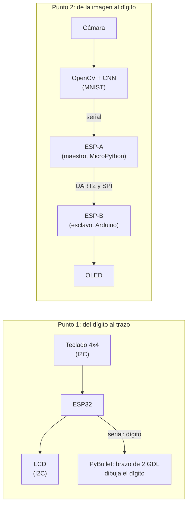

# Dígitos: brazo que dibuja + visión que reconoce

Actividad de dos puntos independientes, los dos alrededor de los dígitos del 0 al 9. La base es el
`brazo.urdf` y el ejemplo de OpenCV del repositorio
[U_Militar](https://github.com/dialejobv/U_Militar/blob/main/README.md). El primer punto va del
dígito al movimiento (un teclado elige, el brazo dibuja); el segundo va de la imagen al dígito (la
cámara ve, una CNN reconoce, dos ESP32 lo llevan a una pantalla).

| | [Punto 1: teclado + brazo dibujando](./punto-1-teclado-brazo-dibujando) | [Punto 2: reconocimiento + OLED](./punto-2-reconocimiento-oled-spi) |
|---|---|---|
| Entrada | Tecla 0-9 del teclado matricial | Dígito escrito a mano frente a la cámara |
| Bus nuevo | I2C: teclado y LCD en el mismo bus, con direcciones distintas | UART2 y SPI entre dos ESP32 |
| Lo difícil | Un brazo de 2 GDL solo alcanza una esfera, no un plano: rango de 20-40° alrededor de una pose con el codo doblado y 8 puntos intermedios por tramo | Una CNN que "duda" frame a frame: filtro de ventana de 15 frames, confianza ≥ 60 % y el ganador con ≥ 80 % de la ventana |
| Salida | Trazo en la ventana de PyBullet + dígito en la LCD | Dígito en la OLED + confirmación `OLED:n` por USB |
| Sin hardware | Botones en la ventana de PyBullet | Página `preview.html` con modo prueba |

**La CNN del punto 2** (en `entrenar_modelo.py`, entrenada una sola vez: 10 pasadas por las 60 000
imágenes de MNIST): Conv2D 32 → MaxPool → Conv2D 64 → MaxPool → Dense 128 → Dropout 0,5 →
Dense 10 (softmax). Cada imagen de la cámara se centra por su centro de masa y se lleva a 28×28,
como las de MNIST, antes de pasar por la red.

**Por qué el esclavo está en Arduino/C++.** MicroPython no tiene modo SPI esclavo en el ESP32 (solo
maestro). El maestro sigue en MicroPython y manda por **UART2 y por SPI al mismo tiempo**; el esclavo
escucha los dos caminos en el mismo `loop()` y reacciona al que le llegue. El detalle está en el
README del punto 2.
