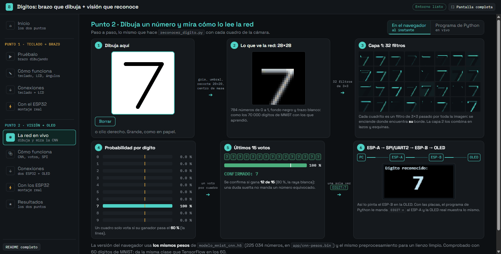
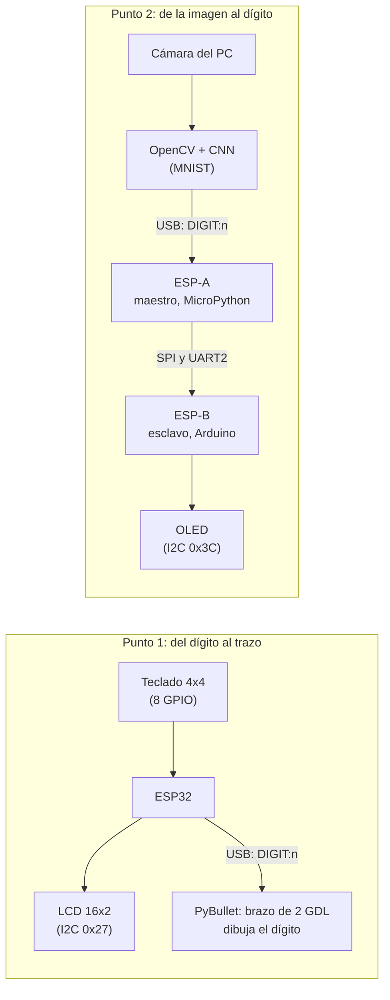
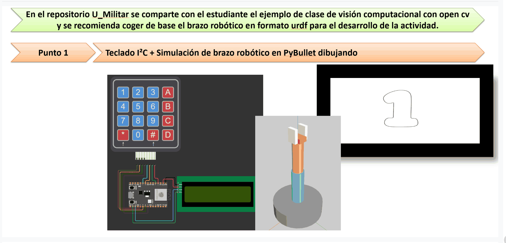
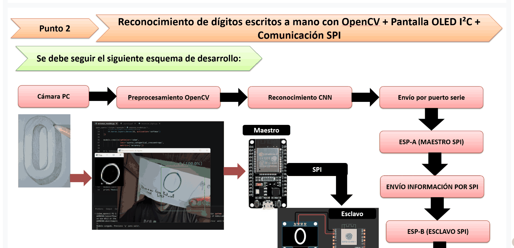

# Dígitos: brazo que dibuja + visión que reconoce

## ¿Quiere probarlo? → aquí está

Doble clic en [`ABRIR.bat`](ABRIR.bat) (en Linux o Mac, `sh abrir.sh`). Se abre la app del tema en una ventana propia, con una barra lateral agrupada por punto:

- **Punto 2 · La red en vivo** (al instante, sin instalar nada): se dibuja un dígito con el mouse y se ve, paso a paso, lo que hace `reconocer_digito.py`: la imagen preprocesada de 28×28, los 32 filtros de la primera capa de la CNN, la probabilidad de cada dígito, la ventana de 15 votos (12 de 15 para confirmar) y el `DIGIT:n` que llegaría a la OLED. Corre en el navegador con **los mismos pesos** de `modelo_mnist_cnn.h5`. Con *Programa de Python* abre el programa real (lienzo del mouse o cámara; tarda ~20-60 s en cargar TensorFlow) y la página dibuja en vivo lo que el programa ve.
- **Punto 1 · Pruébalo**: abre el brazo de PyBullet que dibuja los dígitos (la primera vez se compila PyBullet, ~10 min), con la trayectoria de cada dígito dibujada en la página mientras tanto, y el teclado + LCD simulados.
- **Cómo funciona**, **Conexiones** y **Con el ESP32** de cada punto, y **Resultados**: lo mismo de los README, resumido y con las fotos. Sin ESP32 ni cámara se prueba todo.

El recorrido sección por sección y botón por botón, con lo que tiene que aparecer en cada uno, está en [Paso a paso con la app](#2-cómo-probarlo-con-la-app-sección-por-sección).

## ¿Quiere saber cómo funciona? → aquí está todo

- **Este README** (el mapa): [**Paso a paso**](#paso-a-paso) (cómo se hizo, con la app, sin la app, con los ESP32) · [Qué es cada cosa nueva](#qué-es-cada-cosa-nueva) · [La idea general](#la-idea-general) · [Cómo probarlo](#cómo-probarlo) · [El montaje y la demo](#el-montaje-y-la-demo)
- **[Punto 1: teclado + brazo dibujando](punto-1-teclado-brazo-dibujando/README.md)**: [teclado matricial](punto-1-teclado-brazo-dibujando/README.md#qué-es-un-teclado-matricial-y-cómo-se-lee) · [I2C y la LCD](punto-1-teclado-brazo-dibujando/README.md#qué-es-i2c-y-cómo-maneja-la-lcd) · [URDF](punto-1-teclado-brazo-dibujando/README.md#qué-es-un-urdf-y-qué-articulaciones-usa-el-dibujo) · [por qué ángulos y no XYZ](punto-1-teclado-brazo-dibujando/README.md#por-qué-el-brazo-se-maneja-por-ángulos-y-no-por-coordenadas-xyz) · [la idea general](punto-1-teclado-brazo-dibujando/README.md#la-idea-general) · [los trazos](punto-1-teclado-brazo-dibujando/README.md#los-trazos-de-cada-dígito) · [conexiones](punto-1-teclado-brazo-dibujando/README.md#conexiones) · [archivos](punto-1-teclado-brazo-dibujando/README.md#qué-hace-cada-archivo) · [la lógica del código](punto-1-teclado-brazo-dibujando/README.md#la-lógica-del-código) · [cómo probarlo](punto-1-teclado-brazo-dibujando/README.md#cómo-probarlo) · [montaje y demo](punto-1-teclado-brazo-dibujando/README.md#el-montaje-y-la-demo)
- **[Punto 2: reconocimiento + OLED por SPI](punto-2-reconocimiento-oled-spi/README.md)**: [CNN y MNIST](punto-2-reconocimiento-oled-spi/README.md#qué-es-una-cnn-y-qué-es-mnist) · [OpenCV](punto-2-reconocimiento-oled-spi/README.md#qué-es-opencv) · [SPI](punto-2-reconocimiento-oled-spi/README.md#qué-es-spi-maestro-y-esclavo) · [UART2](punto-2-reconocimiento-oled-spi/README.md#qué-es-uart2) · [OLED](punto-2-reconocimiento-oled-spi/README.md#qué-es-una-oled-ssd1306) · [la idea general](punto-2-reconocimiento-oled-spi/README.md#la-idea-general) · [conexiones](punto-2-reconocimiento-oled-spi/README.md#conexiones) · [archivos](punto-2-reconocimiento-oled-spi/README.md#qué-hace-cada-archivo) · [cómo se entrenó](punto-2-reconocimiento-oled-spi/README.md#cómo-se-entrenó-la-red-entrenar_modelopy) · [la lógica del reconocimiento](punto-2-reconocimiento-oled-spi/README.md#la-lógica-del-reconocimiento-reconocer_digitopy) · [los dos ESP32](punto-2-reconocimiento-oled-spi/README.md#la-lógica-de-los-dos-esp32) · [cómo probarlo](punto-2-reconocimiento-oled-spi/README.md#cómo-probarlo) · [montaje y demo](punto-2-reconocimiento-oled-spi/README.md#el-montaje-y-la-demo)

---

Actividad de dos puntos independientes, los dos alrededor de los dígitos del 0 al 9. El enunciado recomienda tomar como base el `brazo.urdf` y el ejemplo de visión con OpenCV del repositorio [U_Militar](https://github.com/dialejobv/U_Militar/blob/main/README.md), y eso hicimos. Los dos puntos van en sentidos opuestos:

- El **punto 1** va del dígito al movimiento: un teclado elige un número y un brazo simulado lo dibuja.
- El **punto 2** va de la imagen al dígito: la cámara ve un número escrito a mano, una red neuronal lo reconoce y dos ESP32 lo llevan hasta una pantalla.

Cada punto tiene su propia carpeta, con su README completo (conceptos, conexiones pin a pin, qué hace cada archivo, la lógica del código y cómo probarlo), su código y su propio `entorno/` de Python. Este README es solo el mapa. En esta carpeta quedan además la app del tema (`ABRIR.bat`/`abrir.sh`, `app/` y `probar.json`, ver "¿Quiere probarlo?") e `img/` con su captura. La app trae `app/cnn.js` (la CNN y el preprocesamiento en JavaScript), `app/cnn-pesos.bin` (los mismos pesos del modelo en int8, ~220 KB) y `app/exportar_pesos_web.py`, que los vuelve a generar si se reentrena el modelo.

## Paso a paso

Cuatro recorridos, cada uno completo por sí solo: [cómo se hizo](#1-cómo-se-hizo), [cómo probarlo con la app](#2-cómo-probarlo-con-la-app-sección-por-sección), [cómo probarlo sin la app](#3-cómo-probarlo-sin-la-app-desde-la-consola) y [con los ESP32 reales](#4-con-los-esp32-reales). El detalle técnico de cada paso está en el README de cada punto.

### 1. Cómo se hizo

**Punto 1 (teclado → brazo que dibuja):**

1. Se partió del `brazo.urdf` del profesor (el mismo del [tema 7](../7-brazo-robotico-urdf)) y del esquema del enunciado: teclado 4x4 a 8 GPIO y una LCD 16x2 por I2C.
2. Firmware del ESP32 (`esp32_teclado_lcd.py`): barrido del teclado cada 30 ms, la LCD por su *backpack* PCF8574 en modo 4 bits y una línea `DIGIT:n` por USB por cada tecla nueva. Antes, `probar_teclado.py` para comprobar el cableado solo.
3. Primer fallo en la placa: `str.ljust()` no existe en MicroPython y mataba `main.py` antes de llegar al teclado. Se rellenó a mano y la LCD pasó a ser opcional (si no contesta, el teclado sigue mandando).
4. El dibujo: la cinemática inversa a un plano XYZ falló (error de hasta 0,75 m) y un mapeo amplio a los ángulos dejaba manchas, porque con base + codo la punta solo recorre una esfera. Lo que funcionó: un parche chico de esa esfera (±0,35 rad alrededor del codo doblado a 1 rad) y 8 puntos intermedios por tramo.
5. La cámara de PyBullet: desde arriba deformaba y con `cameraYaw=0` se veía de canto; quedó en `cameraYaw=90`.
6. Al armar las imágenes de la demo apareció que los dígitos salían reflejados de arriba a abajo (signo de `v` al revés); se corrigió en `angulos_articulaciones()`.
7. Lo de siempre del repositorio: puerto serial en `try/except` (sin ESP32 quedan 10 botones), lectura serial sin bloquear la simulación y la última línea cruda en pantalla para diagnosticar.

**Punto 2 (imagen → CNN → dos ESP32 → OLED):**

1. Se partió del ejemplo de OpenCV del profesor (`entrenar_modelo.py` y `reconocer_digito.py`): CNN sobre MNIST y preprocesamiento de la cámara a 28×28.
2. Se le agregó el envío `DIGIT:n` al ESP-A y la lectura de su `REENVIADO:n`, en la misma ventana.
3. La red se equivocaba con trazos gruesos y con fotos de pantallas: con un lote de 240 imágenes de prueba se ajustaron el umbral (adaptativo + Otsu), la limpieza (kernel 3×3), el adelgazado (45 %) y el entrenamiento (grosor de trazo aleatorio). Pasó de 78,3 % a 98,3 %.
4. La confirmación pasó de "el más repetido de 5 frames" a una ventana de 15 con 60 % de confianza por voto y 80 % para el ganador (el patrón del tema 6).
5. El enlace entre placas: MicroPython no tiene SPI esclavo, así que el ESP-B pasó a Arduino (`ESP32SPISlave`) y el ESP-A manda **por SPI y por UART2 a la vez**. El ESP-A valida cada línea antes de reenviar (un `int()` sobre basura lo tumbaba).
6. Probar el ESP-A escribiendo en la consola de Thonny no funciona (*raw paste*); de ahí salió `probar_esp_a.py`.
7. Para probar sin cámara: el modo `--mouse` (un lienzo blanco que pasa por el mismo preprocesamiento). Para la app: `--estado`, que escribe lo que ve el programa en un JSON.
8. La app corre además la misma red en el navegador (`app/cnn.js`, con los pesos del `.h5` en int8 en `app/cnn-pesos.bin`); `app/exportar_pesos_web.py` los regenera y comprueba que den la misma clase que TensorFlow.

### 2. Cómo probarlo con la app (sección por sección)

Doble clic en [`ABRIR.bat`](ABRIR.bat) (o `sh abrir.sh`). Aparece "Abriendo la práctica…" y después la app, con una barra lateral agrupada en *Punto 1 · teclado + brazo* y *Punto 2 · visión + OLED*. Arriba a la derecha están el estado del entorno ("Entorno listo" si ya está instalado) y **Pantalla completa**. La consola del `ABRIR.bat` queda minimizada: no la cierres mientras uses la app.

1. **Inicio**: las dos tarjetas grandes llevan a cada punto (*Punto 1* abre "Pruébalo"; *Punto 2* abre "La red en vivo"). Debajo, cuánto tarda cada cosa y la lista **Qué pide la actividad**, que se marca sola cuando una prueba termina bien.
2. **Punto 1 · Pruébalo**:
   - **Iniciar el brazo**: abre PyBullet en una ventana aparte (puede quedar detrás: búscala en la barra de tareas). La primera vez se compila PyBullet (~10 min, con las *Build Tools* de C++), con su barra de avance. En la salida tiene que salir `No se pudo abrir COM7` y `Sigue sin ESP32: usa los botones 0-9 de la ventana`. En la ventana, cada botón del 0 al 9 del panel derecho borra el dígito anterior y dibuja el nuevo con la línea amarilla (`Dibujando el digito n...` y `Listo.` en la salida). Se termina cerrando la ventana o con **Detener**.
   - **La trayectoria de cada dígito** (a la derecha, sin instalar nada): cada botón 0-9 anima el recorrido del lápiz y debajo muestra la posición y los ángulos de base y codo (el 8 llega a "posición 97 de 97").
   - **Teclado 4x4 y LCD en el navegador**: en *Modo prueba*, cada tecla 0-9 cambia la LCD a `Dibujando:` / `n` y dibuja el trazo; las letras, `*` y `#` no dibujan. *Conectado* escucha al ESP32 real por Web Serial.
3. **Punto 1 · Cómo funciona**: el flujo teclado → ESP32 → brazo y tres tarjetas; los dos "Leer…" despliegan las explicaciones del README del punto.
4. **Punto 1 · Conexiones**: el montaje 3D, las tablas de pines y las fotos (clic para ampliar).
5. **Punto 1 · Con el ESP32**: los pasos con la placa real (ver el apartado 4 de aquí abajo).
6. **Punto 2 · La red en vivo** (al instante):
   - Con **En el navegador** elegido, dibuja un dígito grande en el lienzo blanco (clic izquierdo; clic derecho o **Borrar** lo limpian). En 1-2 s se llenan, en orden: la entrada de 28×28, los 32 mapas de la primera capa, las 10 probabilidades (la raya amarilla es el 60 %), los 15 votos con su barra (la raya blanca es el 80 %) y, al confirmarse, `CONFIRMADO: n`, el mensaje `DIGIT:n` y la OLED simulada con el número. La OLED se queda con el último dígito, como la real.
   - Con **Programa de Python**: **Abrir el lienzo** corre `reconocer_digito.py --mouse --estado estado_en_vivo.json` (tarda ~20-60 s en cargar TensorFlow; la primera vez instala ~400 MB). Se abre su ventana aparte: dibuja dentro del recuadro y la página repite lo que ve el programa, con el recuadro en miniatura y el estado del ESP-A ("no conectado" sin la placa). **Encender la cámara** hace lo mismo con la webcam (papel blanco, trazo grueso, buena luz); si no hay cámara, pasa sola al lienzo. `q` cierra la ventana; la página dice entonces "El programa terminó".
7. **Punto 2 · Cómo funciona**: el flujo completo, la figura del preprocesamiento paso a paso y los "Leer…" del README. En **Avanzado** está **Entrenar de nuevo** (~5 min, sobrescribe `modelo_mnist_cnn.h5`, barra real por época); no hace falta.
8. **Punto 2 · Conexiones**: maestro y esclavo, las tablas de SPI, UART2 y OLED, el montaje 3D y las fotos.
9. **Punto 2 · Con los ESP32**: **Probar el ESP-A** (~8 s) le manda `DIGIT:5` al ESP-A; sin la placa termina con "No se pudo abrir COM7", que es lo esperado. Debajo, el simulador del ESP-A + OLED (botones 0-9 y *Conectado* por Web Serial).
10. **Resultados**: las cifras (98,3 %, ~99 %, 12 de 15), las dos animaciones y los diez dígitos del brazo.

**Si algo falla:** cada botón muestra en lenguaje claro qué pasó y las últimas líneas del programa (la salida completa, plegada). Si el entorno no se puede preparar, el aviso dice qué falta (Python 3.13 o 3.12 para TensorFlow, las *Build Tools* para PyBullet, con el comando para instalarlas). Si la ventana de PyBullet u OpenCV "no aparece", suele estar detrás de la app.

### 3. Cómo probarlo sin la app (desde la consola)

Desde la carpeta de cada punto, con su `entorno` (cómo crearlo: "Qué hace cada archivo" de cada README):

| Qué | Comando | Qué tiene que pasar |
|---|---|---|
| Punto 1, brazo sin ESP32 | `entorno\Scripts\python brazo_dibuja.py` | PyBullet con 10 botones; `No se pudo abrir COM7` en la consola |
| Punto 2, sin cámara | `entorno\Scripts\python reconocer_digito.py --mouse` | lienzo blanco; al dibujar, `DIGITO CONFIRMADO` arriba a la izquierda |
| Punto 2, con cámara | `entorno\Scripts\python reconocer_digito.py` | video con el recuadro; sin cámara pasa solo al lienzo |
| Punto 2, reentrenar (opcional) | `entorno\Scripts\python entrenar_modelo.py` | 10 épocas, ~99 % de validación, ~5 min |
| Pesos de la app (tras reentrenar) | desde esta carpeta: `punto-2-reconocimiento-oled-spi\entorno\Scripts\python app\exportar_pesos_web.py` | termina con `misma clase ganadora: 200 de 200` |

Sin Python: los `preview.html` de cada punto se abren con doble clic en Chrome o Edge.

### 4. Con los ESP32 reales

- **Punto 1**: armar el teclado y la LCD, probar el teclado con `probar_teclado.py` (Thonny, *Run*), guardar `esp32_teclado_lcd.py` como `main.py`, **cerrar Thonny**, revisar `PUERTO_SERIAL` (COM7) y abrir el brazo: cada tecla 0-9 se ve en la LCD y se dibuja. [Pasos completos](punto-1-teclado-brazo-dibujando/README.md#cómo-probarlo).
- **Punto 2**: `esp_a_maestro.py` como `main.py` en el ESP-A (Thonny), el sketch `esp_b_esclavo.ino` en el ESP-B (Arduino IDE), cablear SPI y/o UART2 con GND común y la OLED en el ESP-B, conectar solo el ESP-A al PC, cerrar Thonny, `probar_esp_a.py` (tiene que salir `REENVIADO:5` y un 5 en la OLED) y después el reconocimiento. [Pasos completos](punto-2-reconocimiento-oled-spi/README.md#cómo-probarlo).

Qué está probado con hardware: el teclado, la LCD y el ESP-A se probaron con las placas reales; el sketch del ESP-B se comparó con el ejemplo oficial de su librería y su prueba completa con las dos placas queda para el montaje (ver "Dos caminos a la vez" en el README del punto 2).

## Qué es cada cosa nueva

Cada concepto está explicado con detalle en el README del punto donde se usa; acá va la idea corta para ubicarse:

- **Teclado matricial** (punto 1): 16 teclas con solo 8 cables, organizadas en 4 filas y 4 columnas. Se lee "barriendo": se baja una fila a la vez y se mira qué columna bajó con ella.
- **I2C** (puntos 1 y 2): un bus de dos cables (`SDA` datos, `SCL` reloj) donde el ESP32 le habla a varios dispositivos por su dirección. Lo usan la LCD del punto 1 (`0x27`) y la OLED del punto 2 (`0x3C`).
- **URDF y PyBullet** (punto 1): un URDF es un archivo XML que describe un robot como piezas (*links*) unidas por articulaciones (*joints*); PyBullet es el simulador de física que lo carga y lo mueve. Es el mismo brazo del [tema 7](../7-brazo-robotico-urdf).
- **CNN y MNIST** (punto 2): una red neuronal convolucional reconoce imágenes deslizando filtros chicos que detectan bordes y trazos; MNIST son 70 000 dígitos escritos a mano de 28×28 con los que se entrena.
- **UART y SPI** (punto 2): dos formas de unir dos microcontroladores por cable. UART manda texto por un par de cables cruzados, sin reloj; SPI usa un reloj que pone el maestro, cables sin cruzar y una línea `CS` para elegir con qué esclavo habla.

## La idea general

Los dos puntos usan el mismo protocolo de texto hacia o desde el PC, una línea `DIGIT:n` por dígito a 115 200 baudios, y los dos siguen el patrón de todo el repositorio: si no hay ESP32 conectado, el programa del PC no se cae y se puede probar igual.

## [Punto 1: teclado + brazo dibujando](./punto-1-teclado-brazo-dibujando)

Se aprieta una tecla del 0 al 9, el ESP32 la muestra en la LCD y le manda `DIGIT:n` al PC, y el brazo simulado la dibuja con una línea amarilla que sale de la punta de la pinza, como un lápiz. Sin ESP32, la ventana de PyBullet trae 10 botones, uno por dígito.

Lo difícil fue geométrico: un brazo con solo dos articulaciones de giro (base y codo) solo alcanza los puntos de una **esfera**, no de un plano, así que ni la cinemática inversa a un plano ni un mapeo amplio funcionaban (los dígitos salían como manchas). Se resolvió dibujando en un parche chico de esa esfera (±0.35 rad alrededor de una pose con el codo doblado) y partiendo cada tramo en 8 puntos intermedios. En el README del punto están la explicación completa, la tabla de pines del teclado y la LCD, y la lógica del firmware y del script.

## [Punto 2: reconocimiento + OLED por SPI](./punto-2-reconocimiento-oled-spi)

Un dígito escrito en papel se muestra a la cámara; OpenCV lo recorta y lo deja con el aspecto de una imagen de MNIST (28×28, fondo negro, centrado por centro de masa), y una CNN (Conv2D 32 → MaxPool → Conv2D 64 → MaxPool → Dense 128 → Dropout 0.5 → Dense 10) dice qué dígito es. Como la red "duda" de un frame a otro, un dígito solo se confirma si en los últimos 15 frames ganó con al menos el 80 % de los votos, y cada voto necesita 60 % de confianza. Con los ajustes del preprocesamiento y del entrenamiento, la precisión sobre un lote de 240 imágenes de prueba pasó de 78.3 % a 98.3 %.

El dígito confirmado va al ESP-A, que lo reenvía al ESP-B **por SPI y por UART2 a la vez**, y el ESP-B lo pinta en la OLED. El ESP-B es un sketch de Arduino porque MicroPython no tiene modo SPI esclavo en el ESP32; el porqué completo, las tablas de pines de las dos placas y la OLED, y la lógica de cada archivo están en el README del punto.

## Cómo probarlo

Los pasos detallados, con los mensajes que tienen que aparecer en cada paso, están en el README de cada punto y en el [Paso a paso](#paso-a-paso) de arriba. En resumen, desde la carpeta de cada punto (la app usa estos mismos `entorno/` de cada punto si ya existen; si no, crea uno solo para el tema con todo lo de los dos puntos):

**Sin ESP32 conectado:**

- Punto 1: `entorno\Scripts\python brazo_dibuja.py` abre PyBullet con 10 botones, uno por dígito.
- Punto 2: `entorno\Scripts\python reconocer_digito.py` reconoce con la cámara igual; solo no manda nada. Sin cámara, `entorno\Scripts\python reconocer_digito.py --mouse` abre un lienzo donde el dígito se dibuja con el mouse (y si la cámara no abre, entra solo en ese modo).
- Sin Python: cada punto trae un `preview.html` (doble clic en Chrome o Edge) con el teclado y la LCD simulados (punto 1) o la OLED simulada (punto 2).

**Con ESP32 conectado:**

- Punto 1: un ESP32 con el teclado en 8 GPIO y la LCD por I2C, con `esp32_teclado_lcd.py` guardado como `main.py`.
- Punto 2: el ESP-A por USB con `esp_a_maestro.py` como `main.py`, el ESP-B con el sketch de Arduino y la OLED, unidos por SPI y/o UART2 con tierra común. `probar_esp_a.py` prueba el ESP-A solo, sin cámara.

## El montaje y la demo

Cada punto tiene sus fotos del montaje real, el montaje en 3D con las conexiones rotuladas y una animación de la demo en su propio README. Una muestra de cada uno:

| Punto 1: los 10 dígitos que dibuja el brazo | Punto 2: el reconocimiento hasta la OLED |
|---|---|
|  |  |
