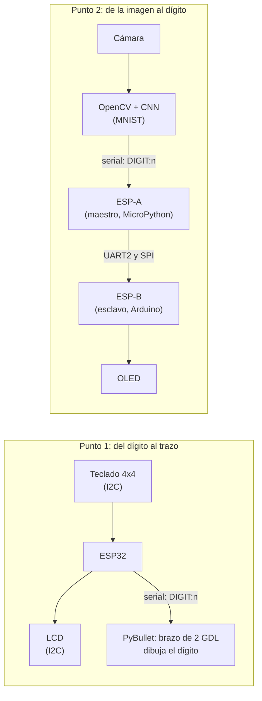

# Dígitos: brazo que dibuja + visión que reconoce

Actividad de dos puntos independientes, los dos alrededor de los dígitos del 0 al 9. La base es el
`brazo.urdf` y el ejemplo de OpenCV del repositorio
[U_Militar](https://github.com/dialejobv/U_Militar/blob/main/README.md). El primer punto va del
dígito al movimiento (un teclado elige, el brazo dibuja); el segundo va de la imagen al dígito (la
cámara ve, una CNN reconoce, dos ESP32 lo llevan a una pantalla). Cada punto tiene su propia carpeta,
con su README, su código y su propio `entorno/`.

## Qué es cada cosa nueva

- **I2C** (punto 1): un bus de dos cables (`SDA` datos, `SCL` reloj) donde varios dispositivos
  comparten los mismos cables y el ESP32 le habla a cada uno por su dirección. El teclado y la LCD
  viven en el mismo bus, en `0x20` y `0x27`.
- **PyBullet y URDF** (punto 1): PyBullet es un simulador de física; un URDF es un archivo XML que
  describe un robot como eslabones (*links*) unidos por articulaciones (*joints*). El brazo del
  profesor tiene dos articulaciones útiles para dibujar: el giro de la base y el codo.
- **CNN y MNIST** (punto 2): una red neuronal convolucional aprende a reconocer imágenes deslizando
  filtros chicos que detectan bordes y trazos; MNIST son 70 000 dígitos escritos a mano de 28×28 con
  los que se entrena.
- **UART y SPI** (punto 2): dos formas de unir dos microcontroladores por cable. UART manda texto
  por un par de cables cruzados, sin reloj; SPI usa un reloj que pone el maestro y una línea `SS`
  para elegir con qué esclavo habla.

## La idea general

**[Punto 1: teclado + brazo dibujando](./punto-1-teclado-brazo-dibujando).** Se aprieta una tecla
del 0 al 9, el ESP32 la muestra en la LCD y le manda `DIGIT:n` al PC, y el brazo simulado la dibuja
con una línea amarilla. Lo difícil fue geométrico: un brazo de dos articulaciones solo alcanza los
puntos de una esfera, no de un plano, así que los dígitos se dibujan en un parche chico de esa esfera
(±0,35 rad alrededor de una pose con el codo doblado) y cada tramo se parte en 8 puntos intermedios.

**[Punto 2: reconocimiento + OLED](./punto-2-reconocimiento-oled-spi).** Un dígito escrito en un
papel se muestra a la cámara; OpenCV lo recorta y lo deja como una imagen de MNIST (28×28, fondo
negro, centrado por centro de masa), y una CNN (Conv2D 32 → MaxPool → Conv2D 64 → MaxPool →
Dense 128 → Dropout 0,5 → Dense 10) dice qué dígito es. Como la red "duda" de un frame a otro, un
dígito solo se confirma si en los últimos 15 frames ganó con al menos el 80 % de los votos (y cada
voto necesita 60 % de confianza). El dígito confirmado va al ESP-A, que lo reenvía al ESP-B por
**UART2 y por SPI a la vez**, y el ESP-B lo pinta en la OLED. El ESP-B es un sketch de Arduino
porque MicroPython no tiene modo SPI esclavo en el ESP32 (el porqué completo está en el README del
punto 2).

## Cómo probarlo

Los pasos detallados están en el README de cada punto. En resumen:

**Sin ESP32 conectado:**
- Punto 1: `python brazo_dibuja.py` abre PyBullet con 10 botones, uno por dígito.
- Punto 2: `python reconocer_digito.py` reconoce con la cámara igual; solo no manda nada.

**Con ESP32 conectado:**
- Punto 1: un ESP32 con teclado y LCD por I2C, `esp32_teclado_lcd.py` como `main.py`.
- Punto 2: el ESP-A por USB (MicroPython), el ESP-B con el sketch de Arduino y la OLED, unidos
  por UART2 y/o SPI.

## Pendiente

Fotos del montaje y video de cada punto: se agregan en el README de cada uno cuando estén.
