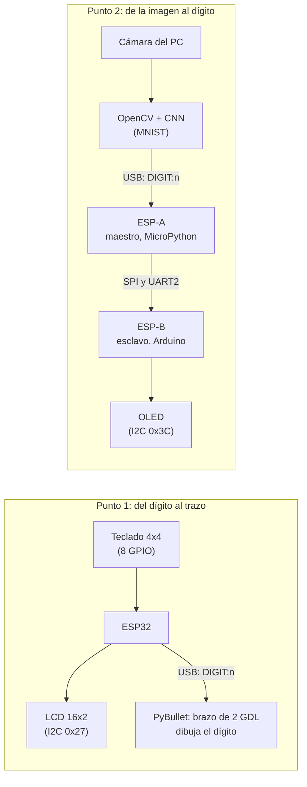
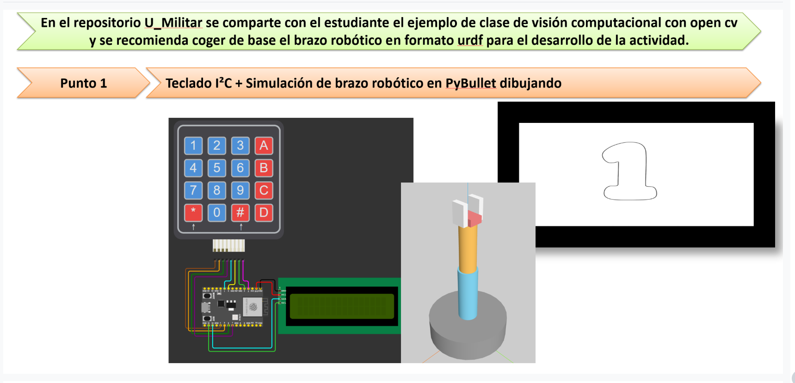
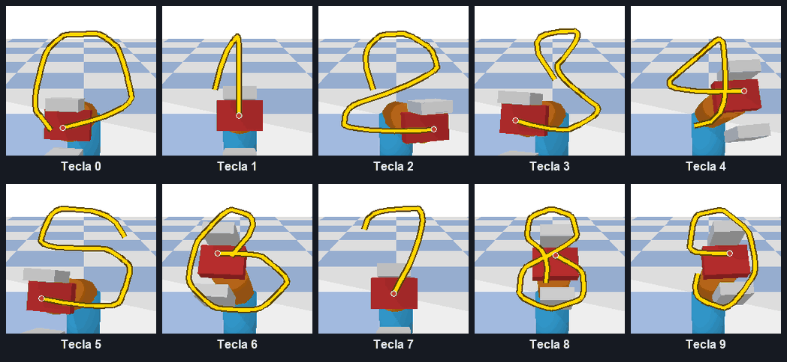
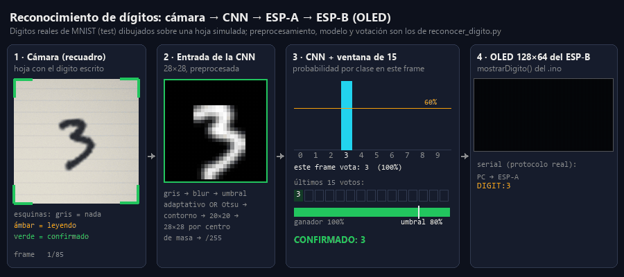

# Dígitos: brazo que dibuja + visión que reconoce

Actividad de dos puntos independientes, los dos alrededor de los dígitos del 0 al 9. El enunciado recomienda tomar como base el `brazo.urdf` y el ejemplo de visión con OpenCV del repositorio [U_Militar](https://github.com/dialejobv/U_Militar/blob/main/README.md), y eso hicimos. Los dos puntos van en sentidos opuestos:

- El **punto 1** va del dígito al movimiento: un teclado elige un número y un brazo simulado lo dibuja.
- El **punto 2** va de la imagen al dígito: la cámara ve un número escrito a mano, una red neuronal lo reconoce y dos ESP32 lo llevan hasta una pantalla.

Cada punto tiene su propia carpeta, con su README completo (conceptos, conexiones pin a pin, qué hace cada archivo, la lógica del código y cómo probarlo), su código y su propio `entorno/` de Python. Este README es solo el mapa.

## Qué es cada cosa nueva

Cada concepto está explicado con detalle en el README del punto donde se usa; acá va la idea corta para ubicarse:

- **Teclado matricial** (punto 1): 16 teclas con solo 8 cables, organizadas en 4 filas y 4 columnas. Se lee "barriendo": se baja una fila a la vez y se mira qué columna bajó con ella.
- **I2C** (puntos 1 y 2): un bus de dos cables (`SDA` datos, `SCL` reloj) donde el ESP32 le habla a varios dispositivos por su dirección. Lo usan la LCD del punto 1 (`0x27`) y la OLED del punto 2 (`0x3C`).
- **URDF y PyBullet** (punto 1): un URDF es un archivo XML que describe un robot como piezas (*links*) unidas por articulaciones (*joints*); PyBullet es el simulador de física que lo carga y lo mueve. Es el mismo brazo del [tema 7](../7-brazo-robotico-urdf).
- **CNN y MNIST** (punto 2): una red neuronal convolucional reconoce imágenes deslizando filtros chicos que detectan bordes y trazos; MNIST son 70 000 dígitos escritos a mano de 28×28 con los que se entrena.
- **UART y SPI** (punto 2): dos formas de unir dos microcontroladores por cable. UART manda texto por un par de cables cruzados, sin reloj; SPI usa un reloj que pone el maestro, cables sin cruzar y una línea `CS` para elegir con qué esclavo habla.

## La idea general

Los dos puntos usan el mismo protocolo de texto hacia o desde el PC, una línea `DIGIT:n` por dígito a 115 200 baudios, y los dos siguen el patrón de todo el repositorio: si no hay ESP32 conectado, el programa del PC no se cae y se puede probar igual.

## [Punto 1: teclado + brazo dibujando](./punto-1-teclado-brazo-dibujando)

Se aprieta una tecla del 0 al 9, el ESP32 la muestra en la LCD y le manda `DIGIT:n` al PC, y el brazo simulado la dibuja con una línea amarilla que sale de la punta de la pinza, como un lápiz. Sin ESP32, la ventana de PyBullet trae 10 botones, uno por dígito.

Lo difícil fue geométrico: un brazo con solo dos articulaciones de giro (base y codo) solo alcanza los puntos de una **esfera**, no de un plano, así que ni la cinemática inversa a un plano ni un mapeo amplio funcionaban (los dígitos salían como manchas). Se resolvió dibujando en un parche chico de esa esfera (±0.35 rad alrededor de una pose con el codo doblado) y partiendo cada tramo en 8 puntos intermedios. En el README del punto están la explicación completa, la tabla de pines del teclado y la LCD, y la lógica del firmware y del script.

## [Punto 2: reconocimiento + OLED por SPI](./punto-2-reconocimiento-oled-spi)

Un dígito escrito en papel se muestra a la cámara; OpenCV lo recorta y lo deja con el aspecto de una imagen de MNIST (28×28, fondo negro, centrado por centro de masa), y una CNN (Conv2D 32 → MaxPool → Conv2D 64 → MaxPool → Dense 128 → Dropout 0.5 → Dense 10) dice qué dígito es. Como la red "duda" de un frame a otro, un dígito solo se confirma si en los últimos 15 frames ganó con al menos el 80 % de los votos, y cada voto necesita 60 % de confianza. Con los ajustes del preprocesamiento y del entrenamiento, la precisión sobre un lote de 240 imágenes de prueba pasó de 78.3 % a 98.3 %.

El dígito confirmado va al ESP-A, que lo reenvía al ESP-B **por SPI y por UART2 a la vez**, y el ESP-B lo pinta en la OLED. El ESP-B es un sketch de Arduino porque MicroPython no tiene modo SPI esclavo en el ESP32; el porqué completo, las tablas de pines de las dos placas y la OLED, y la lógica de cada archivo están en el README del punto.

## Cómo probarlo

Los pasos detallados, con los mensajes que tienen que aparecer en cada paso, están en el README de cada punto. En resumen, desde la carpeta de cada punto:

**Sin ESP32 conectado:**

- Punto 1: `entorno\Scripts\python brazo_dibuja.py` abre PyBullet con 10 botones, uno por dígito.
- Punto 2: `entorno\Scripts\python reconocer_digito.py` reconoce con la cámara igual; solo no manda nada. Sin cámara, `entorno\Scripts\python reconocer_digito.py --mouse` abre un lienzo donde el dígito se dibuja con el mouse (y si la cámara no abre, entra solo en ese modo).
- Sin Python: cada punto trae un `preview.html` (doble clic en Chrome o Edge) con el teclado y la LCD simulados (punto 1) o la OLED simulada (punto 2).

**Con ESP32 conectado:**

- Punto 1: un ESP32 con el teclado en 8 GPIO y la LCD por I2C, con `esp32_teclado_lcd.py` guardado como `main.py`.
- Punto 2: el ESP-A por USB con `esp_a_maestro.py` como `main.py`, el ESP-B con el sketch de Arduino y la OLED, unidos por SPI y/o UART2 con tierra común. `probar_esp_a.py` prueba el ESP-A solo, sin cámara.

## El montaje y la demo

Cada punto tiene sus fotos del montaje real, el montaje en 3D con las conexiones rotuladas y una animación de la demo en su propio README. Una muestra de cada uno:

| Punto 1: los 10 dígitos que dibuja el brazo | Punto 2: el reconocimiento hasta la OLED |
|---|---|
|  |  |
