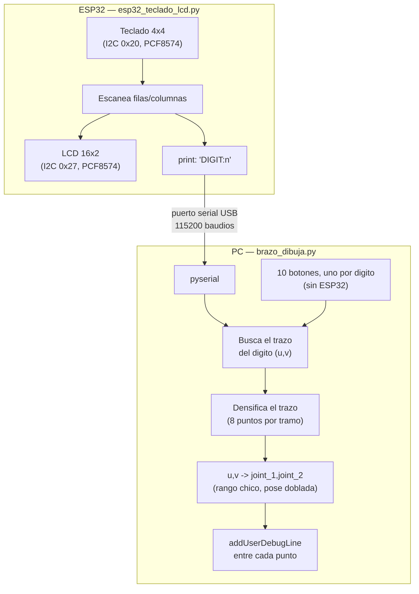

# Punto 1: Teclado I2C + brazo robótico dibujando en PyBullet

Basado en el `brazo.urdf` compartido en el repositorio [U_Militar](https://github.com/dialejobv/U_Militar/blob/main/8%29%20Brazo_URDF/brazo.urdf) (ver `enunciado-actividad.png`). Un teclado matricial 4x4 y una pantalla LCD, los dos por I2C, dejan elegir un dígito del 0 al 9; el ESP32 lo muestra en la LCD y se lo manda al PC, que mueve el brazo simulado en PyBullet para "dibujarlo".

## Qué es I2C y por qué dos dispositivos comparten el mismo bus

I2C es un protocolo de comunicación de solo 2 cables (`SDA` para los datos, `SCL` para el reloj) donde varios dispositivos conviven en el mismo bus físico y el maestro (acá, el ESP32) habla con cada uno usando su dirección de 7 bits, como un número de casa en la misma calle. El teclado y la LCD son dos periféricos separados, cada uno detrás de su propio expansor **PCF8574** (un chip que convierte 8 líneas I2C en 8 pines GPIO normales), y cada expansor sale de fábrica con una dirección distinta (`0x20` el del teclado, `0x27` el de la LCD), así que el ESP32 los distingue sin necesidad de cables adicionales: solo `SDA`, `SCL`, 3V3 y GND, compartidos por los dos.

## Por qué el brazo se maneja por ángulos de articulación y no por coordenadas XYZ

`joint_1` gira la base sobre el eje Z (como una torreta) y `joint_2` inclina el segundo brazo sobre el eje Y, en la punta del primero. Combinando las dos, la punta del brazo (sin contar la pinza) solo puede tocar los puntos de una **esfera** centrada en el codo — literalmente una esfera, como un globo terráqueo, con `joint_1` haciendo de longitud y `joint_2` de latitud. Pedirle al brazo que llegue a un punto XYZ arbitrario por cinemática inversa (`calculateInverseKinematics`) falla apenas ese punto cae fuera de esa esfera, que pasó exactamente eso en un primer intento: el error de la IK llegaba a 0.75 m.

La solución no fue cinemática inversa ni un mapeo XYZ, sino manejar `joint_1`/`joint_2` directamente pero con dos ajustes clave:
- **Un rango de ángulos chico** (`RANGO_J1`/`RANGO_J2` = ±0.35 rad, unos 20°), centrado en una pose con el codo ya doblado (`CENTRO_J2` = 1.0 rad) en vez de con el brazo estirado. En un parche chico de esfera la curvatura casi no se nota — es la misma razón por la que un mapa de una ciudad no se ve deformado aunque la Tierra sea una esfera. Con un rango amplio (lo que se probó primero) los dígitos salían irreconocibles, como manchas triangulares.
- **Densificar cada trazo** (`densificar()`, 8 puntos intermedios por tramo): la interpolación entre dos ángulos de articulación no sigue una línea recta en el espacio real, así que hay que pedirle al brazo muchos puntos intermedios (calculados sobre el trazo original en `u,v`) para que el recorrido real se acerque a la línea recta esperada, en vez de "cortar camino" por la curvatura.

La cámara de PyBullet arranca ya apuntando de frente a la zona donde se dibuja (`resetDebugVisualizerCamera`), porque desde arriba (la vista con la que se probó al principio) los dígitos también se ven distorsionados por la perspectiva. La ventana también trae un texto fijo arriba recordando qué hacer, para no depender de leer este README mientras se prueba.

El trazo (amarillo, más grueso que al principio) tampoco se dibuja exactamente en el origen del link de la pinza — eso queda enterrado dentro del bloque rojo/gris de la pinza y se ve enredado con ella — sino unos 9 cm más allá, a lo largo del propio eje de la pinza, como si fuera la punta de un lápiz saliendo de ella. Así el trazo queda visualmente separado de la geometría de la pinza en vez de peleándose por los mismos píxeles.

## Los trazos de cada dígito

Cada dígito (0-9) es una lista de puntos `(u, v)` en un cuadrado unitario, pensados como un solo recorrido sin levantar el "lápiz" — no son una tipografía real, son una aproximación simplificada pero reconocible, elegida para que el brazo la pueda seguir de corrido sin saltos raros. Están en `TRAZOS_DIGITOS`, dentro de `brazo_dibuja.py`, si se quieren ajustar. Cada vez que se dibuja un dígito nuevo se borra el trazo del anterior (si no, se acumulan uno sobre otro y no se entiende ninguno).

## Conexiones (paso a paso)

Teclado y LCD comparten el mismo bus I2C — no hace falta ninguna placa aparte del ESP32.

1. **Teclado matricial 4x4 → expansor PCF8574 → ESP32** (dirección `0x20` de fábrica):
   - `VCC` → `3V3`, `GND` → `GND`, `SDA` → `GPIO21`, `SCL` → `GPIO22`.
2. **LCD 16x2 → backpack PCF8574 → ESP32** (dirección `0x27` de fábrica — si la pantalla no enciende o solo muestra cuadros negros, es casi siempre el potenciómetro de contraste del propio backpack, no el código):
   - `VCC` → `3V3` (o `5V` si el backpack lo requiere, revisar la serigrafía del módulo), `GND` → `GND`, `SDA` → el mismo `GPIO21`, `SCL` → el mismo `GPIO22` (en paralelo con el teclado, mismo bus, direcciones distintas).
3. **ESP32 → PC**: un solo cable USB. Revisar en el Administrador de dispositivos qué puerto COM le asigna Windows y ponerlo en `PUERTO_SERIAL` dentro de `brazo_dibuja.py`.

## Cómo probarlo

**Sin ESP32 conectado:**
1. Activar el entorno: `entorno\Scripts\activate` (ya trae `pybullet` y `pyserial`).
2. `python brazo_dibuja.py`. Al no encontrar el ESP32, la ventana de PyBullet se abre igual con 10 botones, uno por dígito.

**Con ESP32 conectado:**
1. Guardar `esp32_teclado_lcd.py` como `main.py` en el ESP32 y armar las conexiones de arriba.
2. Ajustar `PUERTO_SERIAL` en `brazo_dibuja.py` según el puerto COM del paso 3.
3. `python brazo_dibuja.py`. Cada dígito presionado en el teclado se muestra en la LCD y se dibuja solo en la simulación.

## Pendiente

Se hicieron pruebas adicionales de la comunicación serial antes del montaje físico. Fotos del montaje y video de la demo — se agregan aquí antes de subir el tema al repositorio.
