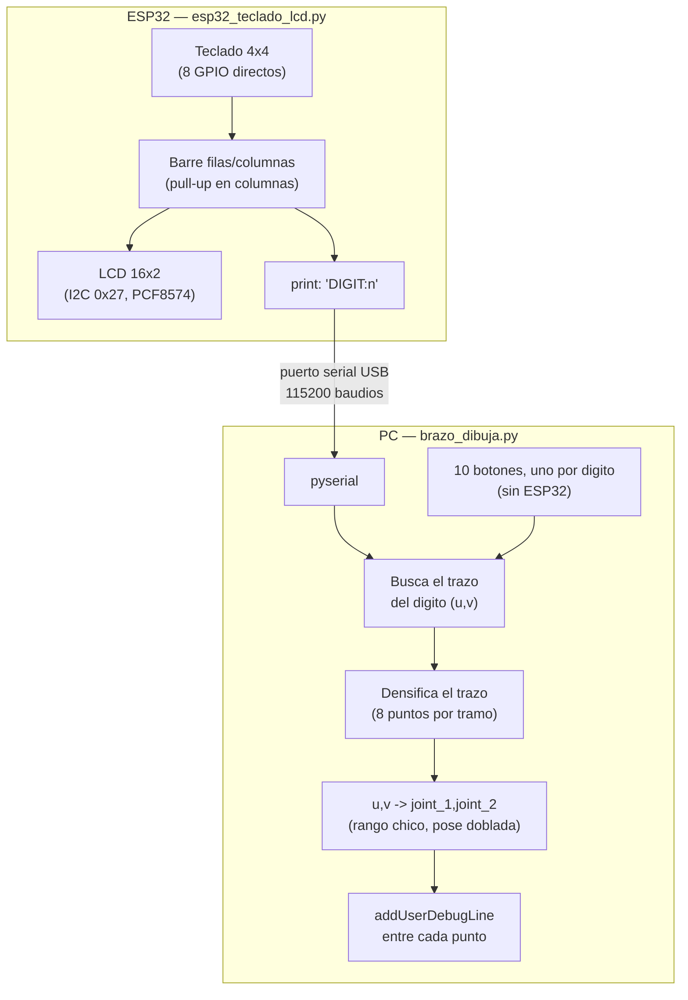
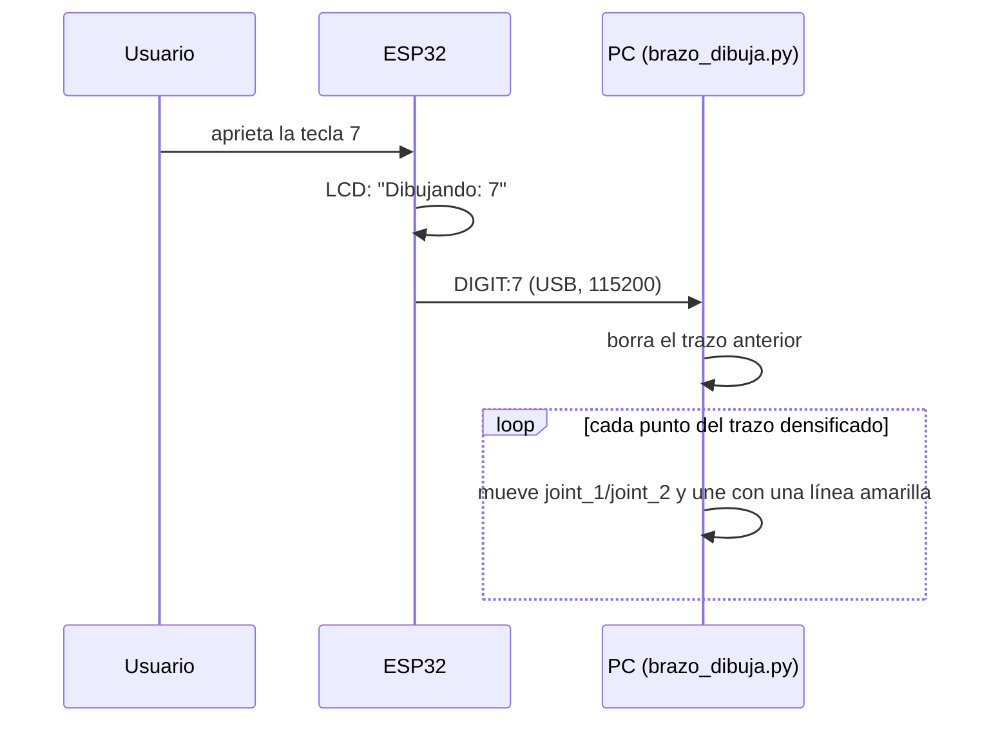

# Punto 1: Teclado matricial y LCD I2C + brazo robótico dibujando en PyBullet

Basado en el `brazo.urdf` compartido en el repositorio [U_Militar](https://github.com/dialejobv/U_Militar/blob/main/8%29%20Brazo_URDF/brazo.urdf). Un teclado matricial 4x4 (conectado directo a pines del ESP32) y una pantalla LCD 16x2 por I2C dejan elegir un dígito del 0 al 9; el ESP32 lo muestra en la LCD y se lo manda al PC, que mueve el brazo simulado en PyBullet para "dibujarlo".

## Qué es un teclado matricial y cómo se lee

Un teclado 4x4 tiene 16 teclas pero solo 8 cables: las teclas están organizadas en una matriz de 4 filas (`R1`-`R4`) y 4 columnas (`C1`-`C4`), y cada tecla es un simple interruptor que, al apretarse, une una fila con una columna. Por eso no se puede leer "tecla por tecla" como si fueran 16 botones sueltos: hay que **barrer** la matriz.

El barrido funciona así: las 4 columnas se configuran como entradas con la resistencia **pull-up interna** del ESP32 activada, de modo que en reposo se leen en `1`. Las 4 filas son salidas y se dejan todas en `1`, y el firmware baja **una sola fila a la vez** a `0`. Mientras esa fila está en `0`, se leen las columnas: si alguna aparece en `0` es porque hay una tecla apretada que la está uniendo con la fila baja, y el cruce fila/columna dice exactamente cuál es. Después se vuelve a subir esa fila y se pasa a la siguiente. Todo el recorrido de las 4 filas tarda muy poco, así que para quien aprieta la tecla la lectura es instantánea.

## Qué es I2C y cómo se usa acá

I2C es un protocolo de comunicación de solo 2 cables (`SDA` para los datos, `SCL` para el reloj) donde varios dispositivos pueden convivir en el mismo bus físico y el maestro (acá, el ESP32) habla con cada uno usando su dirección de 7 bits, como un número de casa en la misma calle. En este punto lo usa solo la LCD: la pantalla viene con un *backpack* **PCF8574** soldado atrás (un chip que convierte 8 líneas I2C en 8 pines GPIO normales, que son los que en realidad manejan la LCD), con dirección `0x27` de fábrica. Así la pantalla, que por sí sola necesitaría 6 o más cables de datos, queda conectada con solo `SDA`, `SCL`, alimentación y GND.

## Qué es un URDF y qué articulaciones tiene este brazo

Un URDF (*Unified Robot Description Format*) es un archivo XML que describe un robot como una cadena de eslabones rígidos (`<link>`, con su forma, color y masa) unidos por articulaciones (`<joint>`, que dicen alrededor de qué eje gira cada eslabón respecto al anterior y entre qué ángulos puede moverse). PyBullet lo carga con `loadURDF` y a partir de ahí cada articulación se mueve con un "motor" al que se le pide un ángulo (`setJointMotorControl2` con `POSITION_CONTROL`). El `brazo.urdf` del profesor tiene la base, dos tramos de brazo y una pinza; para dibujar solo hacen falta dos articulaciones: `joint_1` (giro de la base) y `joint_2` (codo).

## Por qué el brazo se maneja por ángulos de articulación y no por coordenadas XYZ

`joint_1` gira la base sobre el eje Z (como una torreta) y `joint_2` inclina el segundo brazo sobre el eje Y, en la punta del primero. Combinando las dos, la punta del brazo (sin contar la pinza) solo puede tocar los puntos de una **esfera** centrada en el codo — literalmente una esfera, como un globo terráqueo, con `joint_1` haciendo de longitud y `joint_2` de latitud. Pedirle al brazo que llegue a un punto XYZ arbitrario por cinemática inversa (`calculateInverseKinematics`) falla apenas ese punto cae fuera de esa esfera, que pasó exactamente eso en un primer intento: el error de la IK llegaba a 0.75 m.

La solución no fue cinemática inversa ni un mapeo XYZ, sino manejar `joint_1`/`joint_2` directamente pero con dos ajustes clave:
- **Un rango de ángulos chico** (`RANGO_J1`/`RANGO_J2` = ±0.35 rad, unos 20°), centrado en una pose con el codo ya doblado (`CENTRO_J2` = 1.0 rad) en vez de con el brazo estirado. En un parche chico de esfera la curvatura casi no se nota — es la misma razón por la que un mapa de una ciudad no se ve deformado aunque la Tierra sea una esfera. Con un rango amplio (lo que se probó primero) los dígitos salían irreconocibles, como manchas triangulares.
- **Densificar cada trazo** (`densificar()`, 8 puntos intermedios por tramo): la interpolación entre dos ángulos de articulación no sigue una línea recta en el espacio real, así que hay que pedirle al brazo muchos puntos intermedios (calculados sobre el trazo original en `u,v`) para que el recorrido real se acerque a la línea recta esperada, en vez de "cortar camino" por la curvatura.

La cámara de PyBullet arranca ya apuntando de frente a la zona donde se dibuja (`resetDebugVisualizerCamera`), porque desde arriba (la vista con la que se probó al principio) los dígitos también se ven distorsionados por la perspectiva. La ventana también trae un texto fijo arriba recordando qué hacer, para no depender de leer este README mientras se prueba.

El trazo (amarillo, más grueso que al principio) tampoco se dibuja exactamente en el origen del link de la pinza — eso queda enterrado dentro del bloque rojo/gris de la pinza y se ve enredado con ella — sino unos 9 cm más allá, a lo largo del propio eje de la pinza, como si fuera la punta de un lápiz saliendo de ella. Así el trazo queda visualmente separado de la geometría de la pinza en vez de peleándose por los mismos píxeles.

## La idea general

```mermaid
flowchart TD
    subgraph ESP["ESP32 — esp32_teclado_lcd.py"]
        Teclado["Teclado 4x4<br/>(8 GPIO directos)"] --> Lee["Barre filas/columnas<br/>(pull-up en columnas)"]
        Lee --> LCD["LCD 16x2<br/>(I2C 0x27, PCF8574)"]
        Lee --> Envia["print: 'DIGIT:n'"]
    end

    Envia -->|"puerto serial USB<br/>115200 baudios"| Recibe

    subgraph PC["PC — brazo_dibuja.py"]
        Recibe["pyserial"] --> Trazo["Busca el trazo<br/>del digito (u,v)"]
        Botones["10 botones, uno por digito<br/>(sin ESP32)"] --> Trazo
        Trazo --> Densifica["Densifica el trazo<br/>(8 puntos por tramo)"]
        Densifica --> Joints["u,v -> joint_1,joint_2<br/>(rango chico, pose doblada)"]
        Joints --> Linea["addUserDebugLine<br/>entre cada punto"]
    end
```

```mermaid
sequenceDiagram
    participant U as Usuario
    participant E as ESP32
    participant P as PC (brazo_dibuja.py)
    U->>E: aprieta la tecla 7
    E->>E: LCD: "Dibujando: 7"
    E->>P: DIGIT:7 (USB, 115200)
    P->>P: borra el trazo anterior
    loop cada punto del trazo densificado
        P->>P: mueve joint_1/joint_2 y une con una línea amarilla
    end
```

El PC lee el puerto serial sin frenar la simulación: solo lee cuando ya hay bytes esperando y, si llegaron varias líneas juntas, las procesa todas. La última línea cruda que llegó del ESP32 se muestra en gris arriba en la ventana (si nunca cambia, el ESP32 no está mandando nada; si cambia pero no es un `DIGIT:n`, el problema es de formato, no de cable). Al arrancar, el ESP32 imprime qué direcciones I2C encontró y avisa si no responde la LCD (`0x27`).

## Los trazos de cada dígito

Cada dígito (0-9) es una lista de puntos `(u, v)` en un cuadrado unitario, pensados como un solo recorrido sin levantar el "lápiz" — no son una tipografía real, son una aproximación simplificada pero reconocible, elegida para que el brazo la pueda seguir de corrido sin saltos raros. Están en `TRAZOS_DIGITOS`, dentro de `brazo_dibuja.py`, si se quieren ajustar. Cada vez que se dibuja un dígito nuevo se borra el trazo del anterior (si no, se acumulan uno sobre otro y no se entiende ninguno).

## Conexiones

El teclado va directo a 8 GPIO del ESP32 y la LCD por el bus I2C.

**Teclado matricial 4x4** (las 4 columnas llevan la pull-up interna activada desde el firmware, no hace falta ninguna resistencia externa):

| Teclado 4x4 | ESP32 | En el firmware |
|---|---|---|
| Fila R1 | `GPIO14` | `ROW_PINS[0]` |
| Fila R2 | `GPIO27` | `ROW_PINS[1]` |
| Fila R3 | `GPIO26` | `ROW_PINS[2]` |
| Fila R4 | `GPIO25` | `ROW_PINS[3]` |
| Columna C1 | `GPIO33` | `COL_PINS[0]` |
| Columna C2 | `GPIO32` | `COL_PINS[1]` |
| Columna C3 | `GPIO18` | `COL_PINS[2]` |
| Columna C4 | `GPIO19` | `COL_PINS[3]` |

**LCD 16x2 con backpack PCF8574** (dirección `0x27`; si la pantalla enciende pero no se ve texto o solo muestra cuadros negros, es casi siempre el potenciómetro de contraste del propio backpack, no el código):

| LCD (backpack) | ESP32 |
|---|---|
| `SDA` | `GPIO21` |
| `SCL` | `GPIO22` |
| `VCC` | `3V3` (o `5V` si el backpack lo requiere, revisar la serigrafía del módulo) |
| `GND` | `GND` |

**ESP32 → PC**: un solo cable USB. En el Administrador de dispositivos se ve qué puerto COM le asigna Windows; ese es el que va en `PUERTO_SERIAL` dentro de `brazo_dibuja.py`.

## Cómo probarlo

**Sin ESP32 conectado:**
1. Activar el entorno: `entorno\Scripts\activate` (ya trae `pybullet` y `pyserial`).
2. `python brazo_dibuja.py`. Al no encontrar el ESP32, la ventana de PyBullet se abre igual con 10 botones, uno por dígito.

**Con ESP32 conectado:**
1. Guardar `esp32_teclado_lcd.py` como `main.py` en el ESP32 y armar las conexiones de arriba.
2. Ajustar `PUERTO_SERIAL` en `brazo_dibuja.py` según el puerto COM de la sección de conexiones.
3. `python brazo_dibuja.py`. Cada dígito presionado en el teclado se muestra en la LCD y se dibuja solo en la simulación. Las teclas A-D, `*` y `#` se ignoran. Si no pasa nada, mirar la línea gris de la ventana ("Última línea del ESP32") y, con Thonny, el mensaje `I2C encontrados: [...]` que el ESP32 imprime al arrancar (tiene que aparecer `0x27`, la LCD; el teclado no sale ahí porque no va por I2C). Si la LCD responde pero una tecla no hace nada, revisar el cable de su fila o su columna según la tabla de conexiones.

## Pendiente

Se hicieron pruebas adicionales de la comunicación serial antes del montaje físico. Fotos del montaje y video de la demo: se agregan aquí cuando estén.
