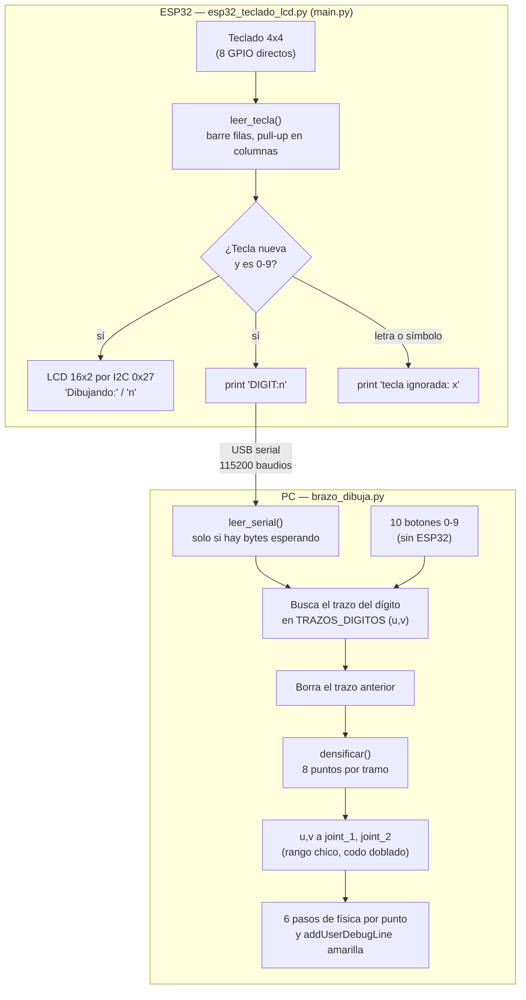
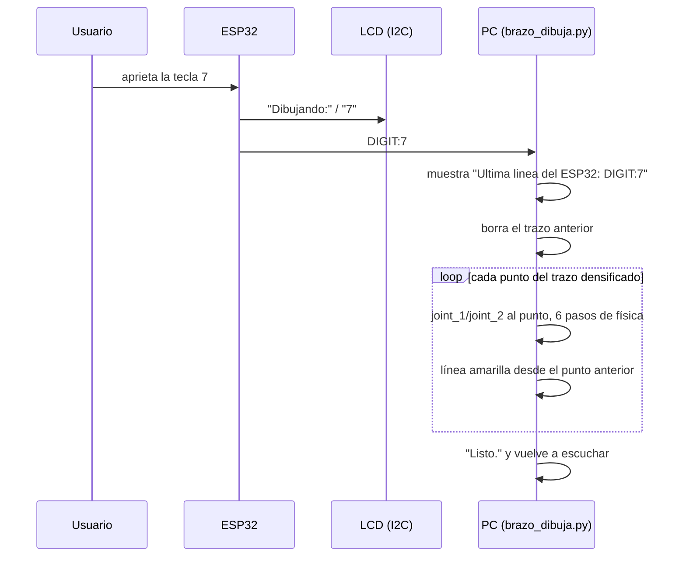

# Punto 1: Teclado matricial y LCD I2C + brazo robótico dibujando en PyBullet

Basado en el `brazo.urdf` compartido en el repositorio [U_Militar](https://github.com/dialejobv/U_Militar/blob/main/8%29%20Brazo_URDF/brazo.urdf) (el mismo del [tema 7](../../7-brazo-robotico-urdf)), como recomienda el enunciado.


El enunciado pide "Teclado I²C + simulación de brazo robótico en PyBullet dibujando", y en su esquema se ve un teclado 4x4 con sus 8 cables directos al ESP32 y una LCD 16x2 con 4 cables (el bus I2C). Seguimos ese esquema: el teclado va a 8 GPIO y lo que va por I2C es la pantalla. Lo que quedó:

- Se aprieta una tecla del 0 al 9 en el teclado.
- El ESP32 la muestra en la LCD (`Dibujando:` / `7`) y le manda al PC la línea `DIGIT:7` por el USB.
- `brazo_dibuja.py` mueve el brazo simulado para trazar ese dígito y va dejando una línea amarilla por donde pasa la punta, como si tuviera un lápiz.
- Sin ESP32, la ventana de PyBullet trae 10 botones (uno por dígito) que hacen exactamente lo mismo.

## Qué es un teclado matricial y cómo se lee

Un teclado 4x4 tiene 16 teclas pero solo 8 cables: las teclas están en una matriz de 4 filas (`R1`-`R4`) y 4 columnas (`C1`-`C4`), y cada tecla es un simple contacto que, al apretarse, une una fila con una columna. No pone ningún voltaje por sí misma. Por eso no se puede leer "tecla por tecla" como 16 botones sueltos: hay que **barrer** la matriz.

1. Las 4 **columnas** se configuran como entradas con la resistencia **pull-up interna** del ESP32 (unos 45 kΩ hacia 3.3 V). Sin la pull-up, una columna sin tecla apretada quedaría "flotando" y leería ruido; con ella lee `1` en reposo.
2. Las 4 **filas** son salidas y arrancan todas en `1`.
3. El firmware baja **una sola fila** a `0`, espera 10 µs y lee las columnas. Si alguna lee `0`, hay una tecla uniendo esa columna con la fila que está en bajo, y el cruce dice exactamente cuál es.
4. Vuelve a subir la fila y pasa a la siguiente.

Si se bajaran las cuatro filas a la vez se sabría la columna pero no cuál de las cuatro filas la bajó. La espera de 10 µs existe porque la pull-up interna es una resistencia alta y, junto con la capacidad de los cables, la columna tarda un poco en bajar de verdad a 0; si se lee enseguida, la tecla se puede perder. El barrido completo dura microsegundos, así que para quien aprieta es instantáneo.

## Qué es I2C y cómo maneja la LCD

I2C es un bus de solo 2 cables: `SDA` (datos) y `SCL` (reloj). El ESP32 es el **maestro**: genera el reloj y habla con cada dispositivo por su **dirección** de 7 bits, como un número de casa en la misma calle; varios dispositivos pueden compartir los mismos dos cables. En reposo las dos líneas quedan en alto por resistencias pull-up (el módulo de la LCD las trae) y los dispositivos solo las bajan para comunicar. Lo usamos a 100 kHz, la velocidad estándar, que soporta cualquier módulo barato sin problemas.

Una LCD 16x2 "pelada" (controlador HD44780) necesita al menos 6 cables de datos y control. Por eso viene con un *backpack* soldado atrás: un **PCF8574**, un chip que recibe un byte por I2C y lo pone en 8 pines. En la dirección `0x27` (la de fábrica más común) esos 8 bits van así:

| Bit del PCF8574 | Pin de la LCD | Para qué sirve |
|---|---|---|
| P0 | RS | 0 = lo que se manda es un comando, 1 = es un carácter |
| P1 | RW | siempre en 0 (solo escribimos) |
| P2 | E | *enable*: la LCD toma el dato en el flanco de bajada de este pin |
| P3 | luz de fondo | 1 = encendida |
| P4-P7 | D4-D7 | los 4 bits de datos |

Como la LCD tiene un bus de 8 bits pero solo quedan 4 pines libres, se maneja en **modo 4 bits**: cada byte se manda en dos mitades (*nibbles*), primero la alta y después la baja, y cada mitad con un "pulso" de E (alto y luego bajo). Eso es lo que hacen `_lcd_nibble()` y `_lcd_pulso()` en el firmware.

## Qué es un URDF y qué articulaciones usa el dibujo

Un URDF (*Unified Robot Description Format*) es un archivo XML que describe un robot como una cadena de piezas rígidas (`<link>`, con su forma y color) unidas por articulaciones (`<joint>`, que dicen alrededor de qué eje se mueve cada pieza respecto a la anterior y entre qué límites). PyBullet, un simulador de física que se maneja desde Python, lo carga con `loadURDF` y a partir de ahí cada articulación se mueve con un motor al que se le pide una posición (`setJointMotorControl2` con `POSITION_CONTROL`); PyBullet calcula la fuerza para llegar ahí en cada paso de la simulación. El árbol completo del brazo está explicado en el [README del tema 7](../../7-brazo-robotico-urdf).

Para dibujar solo hacen falta dos articulaciones: `joint_1` (gira la base sobre el eje Z, como una torreta) y `joint_2` (el codo, que inclina el segundo tramo sobre el eje Y). La pinza no se mueve en este punto.

## Por qué el brazo se maneja por ángulos y no por coordenadas XYZ

Esta fue la parte difícil del punto, y la que más veces tuvimos que rehacer.

Con solo dos articulaciones de giro, la punta del segundo tramo está siempre a la misma distancia del codo (el largo del tramo). O sea: **solo puede tocar los puntos de una esfera** centrada en el codo, con `joint_1` haciendo de longitud y `joint_2` de latitud, como en un globo terráqueo. Un dígito es una figura plana, y un plano no cabe sobre una esfera sin deformarse.

Lo que probamos y por qué no sirvió:

- **Cinemática inversa a un plano XYZ** (`calculateInverseKinematics`): se le pide a PyBullet los ángulos para que la punta llegue a un punto XYZ. Si el punto no está sobre esa esfera, no hay solución exacta, y el error llegaba a 0.75 m: el brazo iba a cualquier lado.
- **Mapear el cuadrado del dígito a los dos ángulos con un rango amplio**: los dígitos salían irreconocibles, como manchas triangulares, porque se estiraba el dibujo sobre una zona muy curva de la esfera.

Lo que funcionó fue manejar `joint_1` y `joint_2` directamente, pero con dos ajustes:

- **Un rango de ángulos chico** (`RANGO_J1 = RANGO_J2 = 0.35` rad, unos 20° a cada lado), centrado en una pose con el codo ya doblado (`CENTRO_J2 = 1.0` rad, unos 57°) en vez de estirado. En un parche chico de la esfera la curvatura casi no se nota, por la misma razón por la que el mapa de una ciudad no se ve deformado aunque la Tierra sea redonda. Doblar el codo aleja la pose de las posiciones degeneradas (brazo estirado) y de los límites del URDF.
- **Densificar cada trazo**: entre cada dos puntos del dígito se agregan 8 puntos intermedios (`PUNTOS_POR_TRAMO = 8`). Interpolar entre dos ángulos no sigue una recta en el espacio, así que con muchos puntos cercanos el recorrido real se pega a la línea que se quería.

La conversión es lineal y muy corta:

```python
def angulos_articulaciones(u, v):
    j1 = CENTRO_J1 + (u - 0.5) * 2 * RANGO_J1   # u: 0 = izquierda, 1 = derecha
    j2 = CENTRO_J2 + (v - 0.5) * 2 * RANGO_J2   # v: 0 = abajo,     1 = arriba
    return j1, j2
```

La cámara de la ventana arranca mirando de frente la zona del dibujo (`resetDebugVisualizerCamera` con `cameraYaw=0, cameraPitch=-10`), porque desde arriba, que fue lo primero que probamos, los dígitos también se veían deformados por la perspectiva.

## La idea general


```mermaid
flowchart TD
    subgraph ESP["ESP32 — esp32_teclado_lcd.py (main.py)"]
        Teclado["Teclado 4x4<br/>(8 GPIO directos)"] --> Lee["leer_tecla()<br/>barre filas, pull-up en columnas"]
        Lee --> Nueva{"¿Tecla nueva<br/>y es 0-9?"}
        Nueva -->|"sí"| LCD["LCD 16x2 por I2C 0x27<br/>'Dibujando:' / 'n'"]
        Nueva -->|"sí"| Envia["print 'DIGIT:n'"]
        Nueva -->|"letra o símbolo"| Ignora["print 'tecla ignorada: x'"]
    end

    Envia -->|"USB serial<br/>115200 baudios"| Recibe

    subgraph PC["PC — brazo_dibuja.py"]
        Recibe["leer_serial()<br/>solo si hay bytes esperando"] --> Trazo["Busca el trazo del dígito<br/>en TRAZOS_DIGITOS (u,v)"]
        Botones["10 botones 0-9<br/>(sin ESP32)"] --> Trazo
        Trazo --> Borra["Borra el trazo anterior"]
        Borra --> Densifica["densificar()<br/>8 puntos por tramo"]
        Densifica --> Joints["u,v a joint_1, joint_2<br/>(rango chico, codo doblado)"]
        Joints --> Linea["6 pasos de física por punto<br/>y addUserDebugLine amarilla"]
    end
```


```mermaid
sequenceDiagram
    participant U as Usuario
    participant E as ESP32
    participant L as LCD (I2C)
    participant P as PC (brazo_dibuja.py)
    U->>E: aprieta la tecla 7
    E->>L: "Dibujando:" / "7"
    E->>P: DIGIT:7
    P->>P: muestra "Ultima linea del ESP32: DIGIT:7"
    P->>P: borra el trazo anterior
    loop cada punto del trazo densificado
        P->>P: joint_1/joint_2 al punto, 6 pasos de física
        P->>P: línea amarilla desde el punto anterior
    end
    P->>P: "Listo." y vuelve a escuchar
```

## Los trazos de cada dígito

Cada dígito es una lista de puntos `(u, v)` dentro de un cuadrado unitario (`u` horizontal de 0 a 1, `v` vertical de 0 a 1 con `v = 1` arriba). Son trazos de **un solo recorrido**, como si nunca se levantara el lápiz, porque el brazo no tiene forma de "levantarlo": no son una tipografía real sino una aproximación simplificada y reconocible. Por ejemplo:

```python
"7": [(0, 1), (1, 1), (0.4, 0)],          # raya de arriba y diagonal hacia abajo
"4": [(0.7, 0), (0.7, 1), (0, 0.35), (1, 0.35)],
```

El `8` es el más largo (13 puntos, que densificados son 97 posiciones) y tarda unos 2.4 s en dibujarse; el `1` (3 puntos, 17 posiciones) tarda menos de medio segundo. Están todos en `TRAZOS_DIGITOS`, dentro de `brazo_dibuja.py`, por si se quieren ajustar.

## Conexiones

El teclado va directo a 8 GPIO del ESP32 y la LCD por el bus I2C. No hace falta ninguna resistencia externa: las pull-up de las columnas son las internas del ESP32 y las del bus I2C vienen en el backpack de la LCD.

**Teclado matricial 4x4:**

| Teclado | ESP32 | En el firmware | Modo |
|---|---|---|---|
| Fila R1 (`1 2 3 A`) | `GPIO14` | `ROW_PINS[0]` | salida, reposo en 1 |
| Fila R2 (`4 5 6 B`) | `GPIO27` | `ROW_PINS[1]` | salida, reposo en 1 |
| Fila R3 (`7 8 9 C`) | `GPIO26` | `ROW_PINS[2]` | salida, reposo en 1 |
| Fila R4 (`* 0 # D`) | `GPIO25` | `ROW_PINS[3]` | salida, reposo en 1 |
| Columna C1 (`1 4 7 *`) | `GPIO33` | `COL_PINS[0]` | entrada con pull-up interna |
| Columna C2 (`2 5 8 0`) | `GPIO32` | `COL_PINS[1]` | entrada con pull-up interna |
| Columna C3 (`3 6 9 #`) | `GPIO18` | `COL_PINS[2]` | entrada con pull-up interna |
| Columna C4 (`A B C D`) | `GPIO19` | `COL_PINS[3]` | entrada con pull-up interna |

Por qué esos pines: son GPIO de uso general que no tienen función especial al arrancar. Evitamos los GPIO 34 a 39 para las columnas porque son solo de entrada y **no tienen pull-up interna** (el barrido no funcionaría sin resistencias externas), los GPIO 6 a 11 porque están conectados a la memoria flash, y los pines de *strapping* (0, 2, 12, 15), que deciden cómo arranca la placa. GPIO 18 y 19 están libres porque en este punto no se usa SPI.

**LCD 16x2 con backpack PCF8574** (dirección `0x27`):

| Backpack de la LCD | ESP32 | Por qué |
|---|---|---|
| `SDA` | `GPIO21` | pin I2C por defecto del ESP32 (`I2C_SDA = 21`) |
| `SCL` | `GPIO22` | pin I2C por defecto del ESP32 (`I2C_SCL = 22`) |
| `VCC` | `3V3` (o `5V` si el módulo lo pide, revisar la serigrafía) | alimentación de la LCD y su luz de fondo |
| `GND` | `GND` | referencia común |

Si la pantalla enciende pero no se ve texto, o solo salen cuadros negros, casi siempre es el potenciómetro de contraste que trae el propio backpack, no el código. Si se alimenta a 5 V, las pull-up del backpack suben SDA/SCL a 5 V; en la práctica suele funcionar, pero si hay algo raro vale la pena probar primero a 3.3 V.

**ESP32 → PC**: un solo cable USB. En el Administrador de dispositivos se ve qué `COM` le asigna Windows; ese va en `PUERTO_SERIAL` dentro de `brazo_dibuja.py`.

## Qué hace cada archivo

- **`esp32_teclado_lcd.py`**: el firmware del ESP32 (MicroPython). Se guarda en la placa como `main.py`. Escanea el bus I2C al arrancar, inicializa la LCD, barre el teclado cada 30 ms y por cada tecla nueva la muestra y manda `DIGIT:n`.
- **`probar_teclado.py`**: prueba aislada del teclado, sin LCD ni PC. Se corre desde Thonny con el botón *Run* (no se guarda como `main.py`). Imprime qué columnas leen en reposo y, por cada tecla, su fila y columna con el GPIO correspondiente. Sirve para separar un problema de cableado de uno del programa.
- **`brazo_dibuja.py`**: el programa del PC. Abre el serial si puede, carga el brazo en PyBullet, crea los 10 botones y dibuja cada dígito que llega (por serial o por botón).
- **`brazo.urdf`**: el brazo del profesor, idéntico al del tema 7.
- **`enunciado-actividad.png`**: la captura del enunciado.
- **`entorno/`**: entorno virtual de Python del punto, con `pybullet`, `pyserial` y `numpy`. No se sube a GitHub (su `.gitignore` tiene `*`).
  Para crearlo en otro PC (Python 3.14), dentro de esta carpeta: `py -3.14 -m venv entorno` y `entorno\Scripts\python -m pip install pybullet pyserial numpy`.

## La lógica del código

### En el ESP32 (`esp32_teclado_lcd.py`)

**Arranque y diagnóstico.** Lo primero que hace es `i2c.scan()`, que devuelve las direcciones de todo lo que contesta en el bus, y lo imprime. En este montaje lo único I2C es la LCD, así que por la consola debería salir:

```
I2C encontrados: ['0x27']
ESP32 listo: esperando teclas
```

Si falta `0x27` imprime `OJO: no responde la LCD en 0x27`: es un problema de cables o de dirección, no de código.

**La LCD es opcional.** Si la LCD no contesta, cada escritura lanza `OSError`. En una versión anterior ese error mataba el programa **antes** de llegar al bucle del teclado, y al PC no llegaba nada aunque el teclado estuviera perfecto. Ahora `lcd_init()` y `lcd_mostrar()` van dentro de `try`: si la LCD falla se avisa una vez (`OJO: la LCD no responde (...); sigo sin LCD`) y el teclado sigue mandando dígitos al PC igual. Lo que importa (teclado → PC) no depende del periférico opcional.

**Inicialización de la LCD.** Al encenderse no se sabe si el controlador quedó en modo 8 o 4 bits, así que se le manda `0x03` tres veces (lo deja en un estado conocido) y después `0x02` para pasarlo a 4 bits. Luego cuatro comandos: `0x28` (4 bits, 2 líneas), `0x0C` (pantalla encendida sin cursor), `0x06` (el cursor avanza solo) y `0x01` (borrar).

**Un detalle de MicroPython.** Para que un texto corto borre lo que había antes en la fila hay que rellenarlo con espacios hasta 16 caracteres. En Python normal eso es `texto.ljust(16)`, pero **MicroPython no tiene `str.ljust()`** (ni `rjust` ni `center`): usarlo tiraba `AttributeError` y el programa moría antes del bucle del teclado. Se hace a mano:

```python
for caracter in (texto + " " * 16)[:16]:
    lcd_dato(ord(caracter))
```

**Bucle principal.** Cada 30 ms barre el teclado. Una tecla solo cuenta cuando **cambia** respecto a la vuelta anterior (`tecla != tecla_anterior`): mientras se mantiene apretada el barrido la sigue viendo, y sin esa condición se mandaría el mismo dígito decenas de veces. Esos 30 ms entre lecturas funcionan además como anti-rebote simple.

```python
if tecla is not None and tecla != tecla_anterior:
    if tecla.isdigit():
        lcd_mostrar("Dibujando:", tecla)
        print("DIGIT:{}".format(tecla))
    else:
        print("tecla ignorada:", tecla)
```

El protocolo entero es una línea por tecla. Apretando `7`, `A` y `3` por el USB sale:

```
DIGIT:7
tecla ignorada: A
DIGIT:3
```

Las teclas `A`-`D`, `*` y `#` se avisan igual (así se ve que el teclado sí se está leyendo), pero el PC las ignora porque no empiezan con `DIGIT:`.

### En el PC (`brazo_dibuja.py`)

**1. Sin necesidad de estar conectado.** El puerto se abre en un `try/except serial.SerialException`. Si falla, `ser = None` y el script sigue con los 10 botones. Además explica por qué falló: si el error es "Acceso denegado" (otro programa, casi siempre Thonny, tiene el puerto abierto) lo dice, y en cualquier caso lista los puertos que sí existen para corregir `PUERTO_SERIAL`. Si abre bien espera 2 s, porque abrir el puerto reinicia el ESP32 (línea DTR).

**2. Lectura serial sin bloquear.** `leer_serial()` solo lee si `ser.in_waiting > 0` y lee **todo** lo que haya (`while`, no `if`), para no quedarse atrás si llegaron varias líneas juntas mientras el brazo dibujaba. Un `readline()` a secas dentro del bucle esperaría hasta su timeout cada vez que no hay nada nuevo, y como ese mismo bucle es el que avanza la simulación, la ventana se vería trabada. Cada línea recibida se imprime en consola (`[SERIAL] recibido: 'DIGIT:7'`) y se muestra en gris arriba de la ventana como `Ultima linea del ESP32: ...`: si nunca cambia, el ESP32 no está mandando nada; si cambia pero no es `DIGIT:n`, el problema es de formato, no de cable. Si se desconecta el cable con el programa corriendo, se atrapa la excepción y se sigue con los botones.

**3. Botones.** Un botón de PyBullet (`addUserDebugParameter` con mínimo mayor que máximo) no devuelve "apretado/suelto", devuelve un contador que sube con cada click. Por eso se compara con el valor anterior: si cambió, se dibuja ese dígito.

**4. Dibujar un dígito** (`dibujar_digito`):

1. Borra las líneas del dígito anterior con `removeUserDebugItem` (si no, se acumulan y no se entiende ninguno).
2. Densifica el trazo.
3. Para cada punto: `mover_a(u, v)` convierte a ángulos, manda los dos motores y avanza **6 pasos de física** (~25 ms simulados). El motor de posición no llega en un solo paso; con 8 puntos por tramo el objetivo cambia muy poco entre un punto y el siguiente, y 6 pasos alcanzan para que la punta lo siga sin que el dibujo se haga eterno.
4. Calcula dónde está la "punta del lápiz" y une con una línea amarilla (`addUserDebugLine`, grosor 6) el punto anterior con el actual.

**5. La punta del lápiz.** El trazo no se dibuja en el origen del link de la pinza, porque ese punto queda **dentro** del bloque rojo de la pinza y la línea se veía enredada con la geometría. Se toma la posición y orientación del link (`getLinkState(..., computeForwardKinematics=True)[4:6]`) y se desplaza 9 cm a lo largo de su propio eje Z con `multiplyTransforms`, como la punta de un lápiz saliendo de la pinza:

```python
OFFSET_PLUMA = [0, 0, 0.09]
pos_link, orn_link = p.getLinkState(robot_id, EFECTOR, computeForwardKinematics=True)[4:6]
punto_mundo, _ = p.multiplyTransforms(pos_link, orn_link, OFFSET_PLUMA, [0, 0, 0, 1])
```

**6. Salida limpia.** El bucle es `while p.isConnected()`; si se cierra la ventana a mitad de un dibujo, PyBullet lanza `p.error`, que se atrapa junto con `Ctrl+C` para salir sin traza de error, y el `finally` cierra el puerto.

Un límite de PyBullet que encontramos: `p.getCameraImage()` **no incluye** las líneas de depuración (`addUserDebugLine`) en la imagen que devuelve, ni en modo `DIRECT` ni en `GUI`. Esas líneas son una capa que solo se ve en la ventana en vivo, así que el trazo no se puede capturar automáticamente: para ver (o fotografiar) un dígito dibujado hay que abrir la ventana.

## Cómo probarlo

Todos los comandos se corren desde la carpeta `punto-1-teclado-brazo-dibujando`.

**Sin ESP32 conectado:**

1. `entorno\Scripts\python brazo_dibuja.py`. La consola dice `No se pudo abrir COM7: ...`, lista los puertos disponibles y termina con `Sigue sin ESP32: usa los botones 0-9 de la ventana.`
2. En el panel de la derecha hay 10 botones, del `0` al `9`. Cada click borra el dígito anterior y dibuja el nuevo con la línea amarilla. Arriba de la ventana dice `Sin ESP32: usa los botones 0-9`.

**Con ESP32 conectado:**

1. Armar las conexiones de arriba.
2. (Opcional, recomendable la primera vez) Abrir `probar_teclado.py` en Thonny y darle *Run*: al apretar teclas tiene que imprimir algo como `Tecla 7  (fila R3 = GPIO26, columna C1 = GPIO33)`. Si sale una tecla distinta a la apretada, el teclado tiene los pines en otro orden (cambiar `ROW_PINS`/`COL_PINS` aquí y en el firmware).
3. Guardar `esp32_teclado_lcd.py` en la placa como `main.py` con Thonny. La LCD tiene que mostrar `Marca un digito` / `para dibujar`. **Cerrar Thonny** antes del paso siguiente: un puerto COM solo lo puede tener abierto un programa.
4. Poner en `PUERTO_SERIAL` (arriba de `brazo_dibuja.py`) el COM del ESP32.
5. `entorno\Scripts\python brazo_dibuja.py`. En la consola: `ESP32 conectado en COM7: se dibuja cada digito que llegue del teclado.`
6. Apretar un dígito: la LCD muestra `Dibujando:` y el número, en la ventana aparece `Ultima linea del ESP32: DIGIT:n` y el brazo lo dibuja. Los botones de la ventana siguen funcionando.
7. Si no pasa nada: mirar la línea gris de la ventana. Si nunca cambia, el ESP32 no está mandando (ver con Thonny, con el script cerrado, que al reiniciar salgan `I2C encontrados: ['0x27']` y `ESP32 listo: esperando teclas`). Si la LCD responde pero una tecla no hace nada, revisar el cable de su fila o su columna en la tabla.

## Pendiente

- Fotos del montaje físico (ESP32, teclado y LCD).
- Video del teclado real haciendo dibujar al brazo, y capturas de la ventana con algunos dígitos dibujados (hay que tomarlas a mano de la ventana, por lo de `getCameraImage` explicado arriba).
- Se hicieron pruebas adicionales de la comunicación serial antes del montaje físico.
