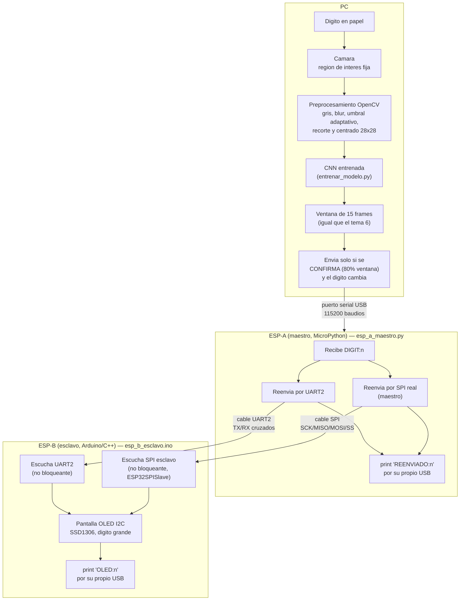

# Punto 2: Reconocimiento de dígitos con OpenCV + CNN + OLED

Basado en el ejemplo de visión computacional con OpenCV compartido en el repositorio [U_Militar](https://github.com/dialejobv/U_Militar/blob/main/10%29%20Open_Cv) (`entrenar_modelo.py` y `reconocer_digito.py`, ver `enunciado-actividad.png` y `enunciado-actividad-2.png`). Un dígito escrito a mano en un papel, mostrado a la cámara del PC, se reconoce con una CNN entrenada sobre MNIST; el resultado se manda por serial al ESP-A, que se lo reenvía al ESP-B por **dos caminos a la vez** (UART2 y SPI real), y este lo muestra en una pantalla OLED.

## Qué es una CNN y por qué MNIST

Una CNN (red neuronal convolucional) es un tipo de red pensada para imágenes: en vez de conectar cada pixel con cada neurona (como haría una red densa normal), desliza filtros pequeños sobre la imagen que aprenden a detectar bordes, curvas y trazos — las mismas piezas con las que se arma un dígito escrito a mano — y por eso generaliza mucho mejor que una red densa para este tipo de tarea. MNIST es el dataset clásico de 70,000 imágenes de dígitos manuscritos (0-9) en blanco y negro de 28x28 píxeles, usado tradicionalmente como el "hola mundo" de la visión por computador: es chico, ya viene etiquetado y entrenar algo que reconozca dígitos con buena precisión toma minutos, no horas.

## La idea general

El que de verdad esté cableado (UART2, SPI, o los dos a la vez para probar) es el que entrega el dígito — el ESP-B no necesita saber de antemano cuál es, y si un cable falla el otro sigue funcionando.

## Por qué a veces "fallaba" por pequeños errores

La primera versión suavizaba con una ventana chica (5 frames) y se quedaba con el dígito más repetido, sin importar por cuánto había ganado — un dígito con apenas 2 votos de 5 (40%) se mandaba igual que uno con 5 de 5. Eso hacía que un mal ángulo, una sombra, o la mano temblando un poco mandaran un dígito equivocado con la misma confianza que uno bien leído.

Se cambió al mismo esquema de 3 filtros que ya está probado y funcionando en el tema 6 (`clasificarFrame` + `actualizarVentana` en `gesture_control.html`), adaptado de "gestos de mano" a "dígitos":

1. **Filtrar por confianza ANTES de votar** (`UMBRAL_CONFIANZA = 60`): si la CNN no está al menos 60% seguro en un frame individual, ese frame cuenta como "nada" en vez de colarse en la ventana como si fuera un dígito real.
2. **Ventana más grande** (`TAM_VENTANA = 15`, antes 5): más frames acumulados antes de decidir, menos sensible a un frame raro suelto.
3. **Umbral de confirmación por proporción** (`UMBRAL_CONFIRMACION = 0.8`): el dígito ganador tiene que ser al menos el 80% de los últimos 15 frames — no solo "el más frecuente" — para confirmarse y mandarse. Si nadie llega a ese 80% (incluyendo cuando "nada" gana porque se quitó el papel), no se manda ni se muestra nada todavía.

## Confirmación por USB (`REENVIADO:n` / `OLED:n`)

Los `print` de `"REENVIADO:n"` y `"OLED:n"` no son parte del protocolo que pide la actividad — se agregaron como ayuda para depurar: al conectar un monitor serial (Thonny para el ESP-A, el Monitor Serie del Arduino IDE para el ESP-B) directamente a cada uno, confirman por texto que de verdad recibió y reenvió/mostró el dígito, sin tener que confiar en que la OLED se vea bien a simple vista. El `"OLED:n"` del ESP-B además dice por cuál de los dos caminos llegó ese dígito en particular (`UART2` o `SPI`). El ESP-A da esa confirmación por el mismo USB que ya usa para recibir del PC; el ESP-B no necesita estar conectado al PC para funcionar (solo al ESP-A, por UART2 y/o SPI), el `print` es nada más un extra para cuando sí se conecta a revisar. Si el ESP-A no responde, `probar_esp_a.py` (en esta misma carpeta) lo prueba de forma aislada, sin cámara ni CNN de por medio — ver los comentarios de `esp_a_maestro.py` para más detalle de cómo diagnosticarlo.

## Dos caminos a la vez: UART2 y SPI

El esquema de la actividad pide un enlace **maestro/esclavo por SPI** entre el ESP-A y el ESP-B. El módulo `machine.SPI` de MicroPython para el ESP32 solo implementa el **modo maestro**: no expone un modo esclavo utilizable sin escribir C a mano contra el ESP-IDF, así que un ESP32 esclavo por SPI no es viable con MicroPython estándar. Esto ya no se resuelve con una sola alternativa (UART2 *o* SPI en una carpeta aparte), sino con **los dos caminos a la vez, reforzándose entre sí**:

- El **ESP-A** (maestro) se queda en **MicroPython**: solo necesita hablar SPI en modo *maestro*, que `machine.SPI` sí soporta. Cada dígito que le llega del PC lo manda **por UART2 y por SPI al mismo tiempo**, sin preguntarse cuál de los dos está de verdad cableado.
- El **ESP-B** (esclavo) pasa a ser un sketch de **Arduino/C++** (`esp_b_esclavo.ino`), porque escuchar SPI en modo esclavo es justo lo que le falta a MicroPython — para eso sí hace falta la librería `ESP32SPISlave`, que ninguna versión de MicroPython trae. El `loop()` revisa UART2 y SPI sin bloquear, en la misma vuelta: el que de verdad esté cableado (o los dos a la vez, para probar) es el que entrega el dígito, y si uno falla el otro sigue funcionando — de ahí que ya no haga falta una carpeta de "alternativa" aparte.

Esta combinación se revisó con cuidado (no se pudo compilar ni correr en hardware real, por no tener placa ni toolchain de Arduino a la mano): cada llamada de `ESP32SPISlave` en `esp_b_esclavo.ino` (`setDataMode`, `setQueueSize`, `begin()`, y el patrón no bloqueante `hasTransactionsCompletedAndAllResultsHandled()` / `queue()` + `trigger()` / `hasTransactionsCompletedAndAllResultsReady()`) se comparó línea por línea contra el ejemplo oficial `transfer_in_the_background` del repositorio de la librería (versión `0.8.0`, la que instala hoy el Gestor de Librerías) y coincide exactamente. Aun así, antes de una entrega real: compilarlo en el Arduino IDE y probarlo con las dos placas físicas.

`GPIO12` (el `MISO` del ESP-B) es un pin de *strapping* del ESP32 — decide el voltaje de la flash al arrancar y espera leerlo en `LOW`. Si el ESP-B no arranca o entra en bootloop al conectar el cable de `MISO`, resetear primero el ESP-A y esperar a que termine de arrancar antes de resetear el ESP-B.

## Conexiones (paso a paso)

Dos ESP32 por separado, cada uno con su propio cable de alimentación/datos, más la OLED en uno solo de ellos. Los cables de UART2 y de SPI se arman los dos (o solo uno, si se prefiere probar un solo camino) — no hace falta elegir de antemano.

1. **ESP-A ↔ ESP-B, cable UART2 cruzado** (2 cables de datos + 1 de tierra, **cruzados**: el TX de uno va al RX del otro):
   - `GPIO17` (TX) del ESP-A → `GPIO16` (RX) del ESP-B
   - `GPIO16` (RX) del ESP-A → `GPIO17` (TX) del ESP-B
   - `GND` del ESP-A → `GND` del ESP-B (¡no olvidar esta! sin tierra común el UART no funciona aunque TX/RX estén bien)
2. **ESP-A ↔ ESP-B, cable SPI real** (4 cables de datos, **sin cruzar**, más tierra común — ya cubierta por la del paso 1 si se conectan los dos caminos):
   - `GPIO18` (SCK) del ESP-A → `GPIO14` (SCK) del ESP-B
   - `GPIO19` (MISO) del ESP-A → `GPIO12` (MISO) del ESP-B
   - `GPIO23` (MOSI) del ESP-A → `GPIO13` (MOSI) del ESP-B
   - `GPIO5` (SS/CS) del ESP-A → `GPIO15` (SS) del ESP-B
   - Cuidado con `GPIO12`: es un pin de *strapping* del ESP-B — ver la nota en "Dos caminos: UART2 y SPI" más arriba.
3. **OLED I2C → ESP-B únicamente** (el ESP-A no necesita pantalla):
   - `VCC` → `3V3`, `GND` → `GND`, `SDA` → `GPIO21`, `SCL` → `GPIO22`, dirección `0x3C` (la más común en módulos SSD1306 128x64 — si no aparece nada, revisar con un escáner I2C si la dirección real es `0x3D`).
4. **ESP-A → PC**: un cable USB (el único que hace falta para que todo funcione: es por donde `reconocer_digito.py` le manda cada dígito). Revisar el puerto COM que le asigna Windows y ponerlo en `PUERTO_SERIAL` dentro de `reconocer_digito.py`. El ESP-B **no necesita** su propio cable al PC — recibe todo lo que necesita por los cables de los pasos 1-2; conectarlo también por USB es opcional, solo para revisar sus `print` de depuración con el Monitor Serie del Arduino IDE.

## Cómo probarlo

`reconocer_digito.py` es el único script que hay que correr para el día a día — junta cámara, reconocimiento y el envío/recepción con el ESP-A en una sola ventana (si falta el modelo entrenado, el propio script lo avisa con el comando exacto a correr, en vez de fallar a medias).

1. Activar el entorno: `entorno\Scripts\activate` (ya trae `tensorflow`, `opencv-python`, `numpy` y `pyserial`).
2. **ESP-A**: guardar `esp-a-maestro/esp_a_maestro.py` como `main.py` en el ESP-A con Thonny, igual que el resto de los ESP32 de este repositorio.
3. **ESP-B**: abrir `esp-b-esclavo/esp_b_esclavo.ino` con el Arduino IDE (con el paquete de placas ESP32 y las librerías `ESP32SPISlave`, `Adafruit SSD1306` y `Adafruit GFX Library` instaladas — ver el sketch para el detalle) y subirlo al ESP-B. Es el único ESP32 de todo el repositorio que no se programa con Thonny/MicroPython, porque escuchar SPI en modo esclavo lo exige. Armar las conexiones de arriba.
4. Ajustar `PUERTO_SERIAL` en `reconocer_digito.py` con el puerto del ESP-A.
5. `python reconocer_digito.py`. La primera vez avisa que falta `modelo_mnist_cnn.h5` y pide correr `python entrenar_modelo.py` (una sola vez, tarda varios minutos); después de eso ya arranca directo.
6. Mostrar un dígito escrito a mano dentro del recuadro verde de la cámara. Abajo de la misma ventana aparecen dos líneas en vivo: la confirmación `"ESP-A confirmó el reenvío de: n"` cada vez que el ESP-A recibe y reenvía un dígito, y el último dato crudo recibido (para diagnosticar si algo no llega) — así no hace falta ninguna herramienta aparte para saber si de verdad llegó. Sin ESP-A conectado, el reconocimiento en pantalla funciona igual; simplemente no llega a ninguna OLED.

## Pendiente

Se hicieron pruebas adicionales de la comunicación serial antes del montaje físico. Fotos del montaje (los dos ESP32 con la OLED) y video de la demo — se agregan aquí antes de subir el tema al repositorio.
