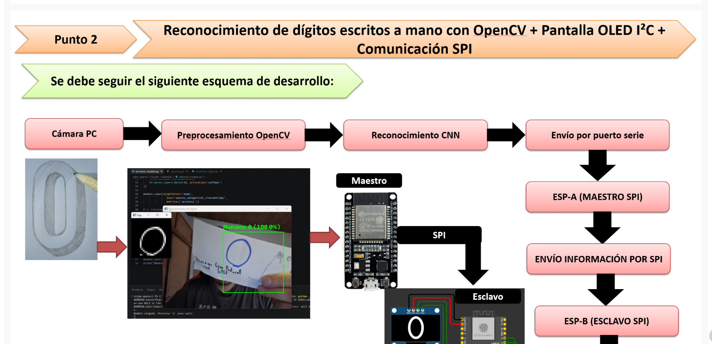
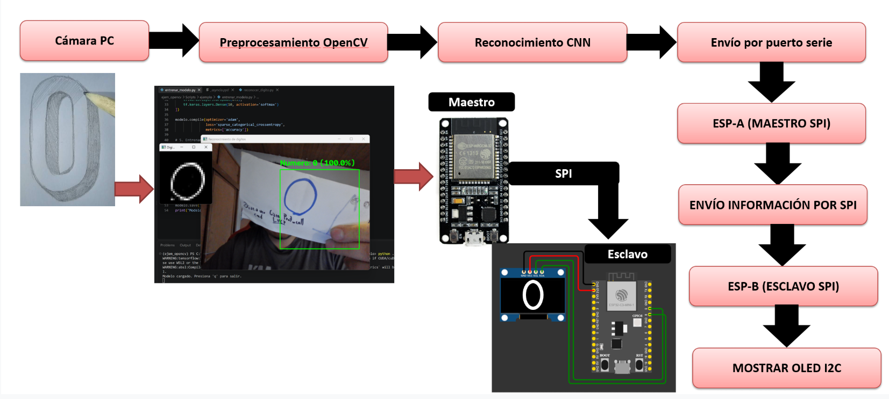
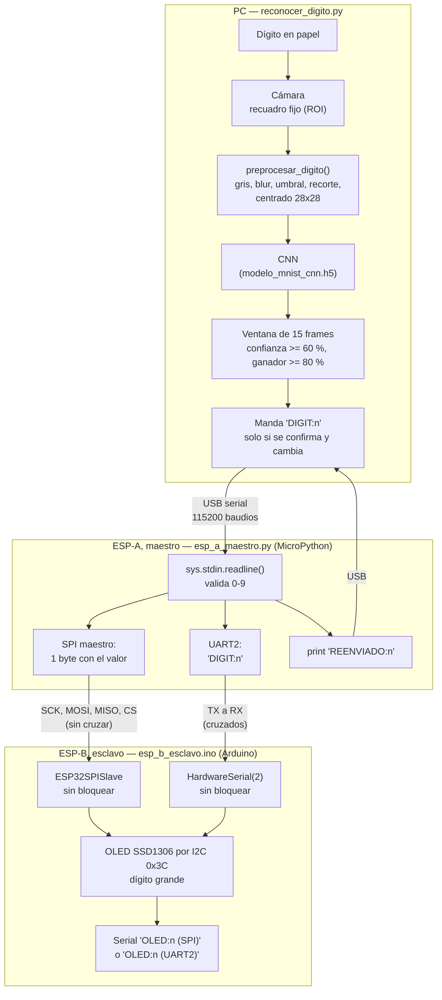
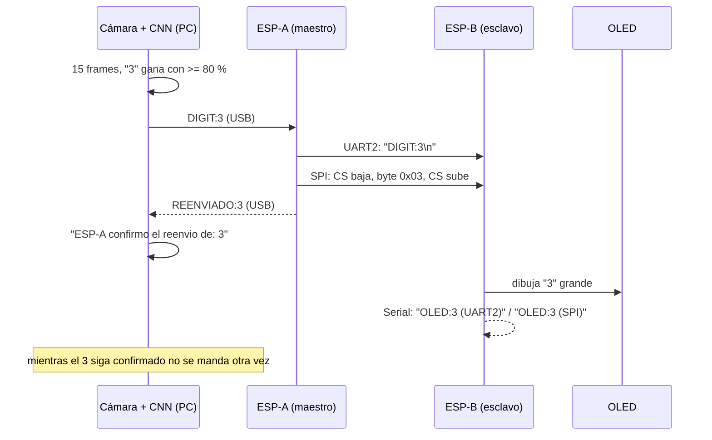

# Punto 2: Reconocimiento de dígitos con OpenCV + CNN + OLED

Basado en el ejemplo de visión computacional con OpenCV compartido en el repositorio [U_Militar](https://github.com/dialejobv/U_Militar/blob/main/10%29%20Open_Cv) (`entrenar_modelo.py` y `reconocer_digito.py`), como recomienda el enunciado.




El enunciado pide seguir un esquema fijo: cámara del PC → preprocesamiento OpenCV → reconocimiento con una CNN → envío por puerto serie → ESP-A (maestro SPI) → envío por SPI → ESP-B (esclavo SPI) → mostrar en una OLED I2C. Lo que quedó:

- Se escribe un dígito en un papel y se muestra a la cámara del PC, dentro de un recuadro fijo.
- `reconocer_digito.py` lo recorta y lo deja como una imagen de MNIST (28×28, fondo negro, trazo blanco, centrado), y la CNN entrenada con `entrenar_modelo.py` dice qué dígito es. Como la red puede "dudar" de un frame a otro, un dígito solo se confirma cuando gana con claridad varios frames seguidos.
- Cada dígito confirmado se manda **una sola vez** por USB al ESP-A como `DIGIT:n`.
- El ESP-A (MicroPython) lo reenvía al ESP-B por **dos caminos a la vez: SPI real y UART2**, y le contesta al PC `REENVIADO:n`.
- El ESP-B (sketch de Arduino) escucha los dos caminos y pinta el dígito grande en la OLED.

Por qué hay dos caminos y por qué el ESP-B no está en MicroPython como todo lo demás del repositorio está explicado en "Qué es SPI" y "Dos caminos a la vez", más abajo.

## Qué es una CNN y qué es MNIST

Una **red neuronal** es una función con miles de números ajustables (*pesos*) que se "entrena" mostrándole ejemplos con su respuesta correcta: en cada ejemplo se mide qué tan equivocada estuvo y se corrigen un poco los pesos. Después de ver muchos ejemplos, acierta con ejemplos que nunca vio.

Una **CNN** (red neuronal convolucional) es el tipo de red pensado para imágenes. En vez de conectar cada píxel con cada neurona (como una red densa, que no sabe qué píxeles están al lado de cuáles), **desliza filtros chicos** de 3×3 sobre toda la imagen. Cada filtro aprende a reaccionar a un patrón local, como un borde vertical o una curva, y lo detecta esté donde esté en la imagen. Una segunda capa de filtros combina esos bordes en piezas más grandes (un lazo, una esquina), que son justo las piezas con las que se arma un dígito escrito a mano. Por eso una CNN generaliza mucho mejor que una red densa para esto.

**MNIST** es el conjunto de datos clásico para esto: 70 000 imágenes de dígitos escritos a mano (0-9), en escala de grises de 28×28 píxeles, con el trazo blanco sobre fondo negro, cada dígito ocupando unos 20×20 píxeles centrado por su centro de masa. Viene separado en 60 000 para entrenar y 10 000 para medir. Es el "hola mundo" de la visión por computador: es chico, ya viene etiquetado y entrenar algo que lo reconozca bien toma minutos, no horas. `tf.keras.datasets.mnist` lo descarga solo la primera vez.

La consecuencia práctica, y lo que más trabajo nos dio: la red solo sabe reconocer cosas que **se parezcan a MNIST**. Todo el preprocesamiento de la cámara existe para convertir una foto de un papel en algo con ese mismo aspecto.

## Qué es OpenCV

OpenCV es una biblioteca de visión por computador. Acá la usamos para abrir la cámara (`cv2.VideoCapture`), pasar a gris, desenfocar, umbralizar (separar "trazo" de "fondo"), buscar contornos, recortar, reescalar, calcular el centro de masa (`cv2.moments`) y dibujar la ventana con el resultado.

## Qué es SPI (maestro y esclavo)

SPI es un bus serial **síncrono** para unir chips a corta distancia. A diferencia de UART, hay un reloj compartido, y siempre hay un **maestro** (el que genera el reloj y decide cuándo se habla) y uno o más **esclavos**. Usa 4 cables:

- `SCK`: el reloj, lo genera el maestro.
- `MOSI` (*Master Out, Slave In*): datos del maestro al esclavo.
- `MISO` (*Master In, Slave Out*): datos del esclavo al maestro.
- `SS` o `CS` (*Slave/Chip Select*): el maestro lo baja a 0 para decirle a un esclavo "te estoy hablando a ti", y lo sube al terminar. Con varios esclavos, cada uno tiene su propio CS.

Los cables **no se cruzan**: SCK con SCK, MOSI con MOSI, MISO con MISO, porque los nombres ya dicen quién manda. En cada pulso de reloj pasa un bit en cada sentido a la vez. El **modo 0** (`polarity=0, phase=0`, `SPI_MODE0`) que usamos significa que el reloj en reposo está en bajo y el dato se lee en el flanco de subida; maestro y esclavo tienen que estar en el mismo modo.

El problema: **MicroPython en el ESP32 no tiene modo SPI esclavo.** `machine.SPI` solo implementa el maestro, y no hay versión de MicroPython que lo traiga. El ESP-A (maestro) puede quedarse en MicroPython sin problema, pero el ESP-B (el que tiene que escuchar) no. Por eso el ESP-B es un sketch de **Arduino/C++** con la librería `ESP32SPISlave` (de hideakitai), que sí implementa el esclavo sobre el hardware SPI del ESP32.

## Qué es UART2

UART es la comunicación serial más simple: un cable para transmitir (TX) y otro para recibir (RX), sin reloj compartido; los dos lados acuerdan la velocidad de antemano (115 200 baudios acá). Por eso los cables **se cruzan**: el TX de uno va al RX del otro. Y hace falta **GND común**: sin tierra compartida, los dos ESP32 no tienen la misma referencia de qué es un 0 y qué es un 1.

El ESP32 tiene tres UART. La UART0 es la que va al USB (el `print()` de MicroPython y el `Serial` de Arduino), así que para hablar entre placas usamos la **UART2**, en los GPIO 16 (RX) y 17 (TX).

## Qué es una OLED SSD1306

Una pantalla OLED de 128×64 píxeles monocromática, donde cada píxel emite su propia luz (no tiene luz de fondo, por eso el negro es negro de verdad). El chip que la controla es el **SSD1306**, que guarda en su memoria un bit por píxel. Se maneja por **I2C** (dos cables, `SDA` datos y `SCL` reloj, con el ESP32 de maestro), en la dirección `0x3C` en la mayoría de los módulos. En el sketch usamos la librería `Adafruit SSD1306`: se dibuja en un buffer en la memoria del ESP32 (`clearDisplay`, `setTextSize`, `print`) y `display()` lo manda entero a la pantalla.

## La idea general


```mermaid
flowchart TD
    subgraph PC["PC — reconocer_digito.py"]
        Papel["Dígito en papel"] --> Cam["Cámara<br/>recuadro fijo (ROI)"]
        Cam --> Pre["preprocesar_digito()<br/>gris, blur, umbral, recorte,<br/>centrado 28x28"]
        Pre --> CNN["CNN<br/>(modelo_mnist_cnn.h5)"]
        CNN --> Vota["Ventana de 15 frames<br/>confianza >= 60 %, ganador >= 80 %"]
        Vota --> Envia["Manda 'DIGIT:n'<br/>solo si se confirma y cambia"]
    end

    Envia -->|"USB serial<br/>115200 baudios"| RecibeA

    subgraph ESPA["ESP-A, maestro — esp_a_maestro.py (MicroPython)"]
        RecibeA["sys.stdin.readline()<br/>valida 0-9"] --> ReenviaSPI["SPI maestro:<br/>1 byte con el valor"]
        RecibeA --> ReenviaUART["UART2:<br/>'DIGIT:n'"]
        RecibeA --> EcoA["print 'REENVIADO:n'"]
    end

    EcoA -->|"USB"| Envia
    ReenviaSPI -->|"SCK, MOSI, MISO, CS<br/>(sin cruzar)"| RecibeSPI
    ReenviaUART -->|"TX a RX<br/>(cruzados)"| RecibeUART

    subgraph ESPB["ESP-B, esclavo — esp_b_esclavo.ino (Arduino)"]
        RecibeSPI["ESP32SPISlave<br/>sin bloquear"] --> OLED["OLED SSD1306 por I2C 0x3C<br/>dígito grande"]
        RecibeUART["HardwareSerial(2)<br/>sin bloquear"] --> OLED
        OLED --> EcoB["Serial 'OLED:n (SPI)'<br/>o 'OLED:n (UART2)'"]
    end
```


```mermaid
sequenceDiagram
    participant C as Cámara + CNN (PC)
    participant A as ESP-A (maestro)
    participant B as ESP-B (esclavo)
    participant O as OLED
    C->>C: 15 frames, "3" gana con >= 80 %
    C->>A: DIGIT:3 (USB)
    A->>B: UART2: "DIGIT:3\n"
    A->>B: SPI: CS baja, byte 0x03, CS sube
    A-->>C: REENVIADO:3 (USB)
    C->>C: "ESP-A confirmo el reenvio de: 3"
    B->>O: dibuja "3" grande
    B-->>B: Serial: "OLED:3 (UART2)" / "OLED:3 (SPI)"
    Note over C: mientras el 3 siga confirmado no se manda otra vez
```

## Conexiones

Dos ESP32, cada uno con su cable USB para alimentarse (el del ESP-B puede ir a un cargador), la OLED solo en el ESP-B, y el ESP-A conectado al PC. Todos los pines salen del código (`esp_a_maestro.py` y `esp_b_esclavo.ino`). No hace falta ninguna resistencia externa: la OLED trae las pull-up del bus I2C en el propio módulo.

**ESP-A ↔ ESP-B por SPI** (sin cruzar):

| Señal | ESP-A (maestro) | ESP-B (esclavo) | Notas |
|---|---|---|---|
| `SCK` (reloj) | `GPIO18` | `GPIO14` | en el ESP-A son los pines de VSPI, en el ESP-B los de HSPI por defecto de la librería |
| `MOSI` | `GPIO23` | `GPIO13` | por aquí va el byte del dígito |
| `MISO` | `GPIO19` | `GPIO12` | el esclavo no contesta nada, pero se cablea para tener el bus completo |
| `CS` / `SS` | `GPIO5` | `GPIO15` | lo maneja a mano el ESP-A; activo en bajo |
| `GND` | `GND` | `GND` | tierra común (la misma sirve para los dos caminos) |

**ESP-A ↔ ESP-B por UART2** (cruzados):

| ESP-A | ESP-B | Notas |
|---|---|---|
| `GPIO17` (TX2) | `GPIO16` (RX2) | lo que manda el ESP-A |
| `GPIO16` (RX2) | `GPIO17` (TX2) | el ESP-B no manda nada por aquí, pero queda el par completo |
| `GND` | `GND` | sin tierra común no funciona aunque TX/RX estén bien |

**OLED SSD1306 128×64 → ESP-B**:

| OLED | ESP-B | Por qué |
|---|---|---|
| `VCC` | `3V3` | el módulo funciona a 3.3 V, así las líneas I2C quedan al mismo nivel que el ESP32 |
| `GND` | `GND` | referencia común |
| `SDA` | `GPIO21` | pin I2C por defecto (`Wire.begin(21, 22)`) |
| `SCL` | `GPIO22` | pin I2C por defecto |

**ESP-A → PC**: un cable USB. Es el único cable al PC que hace falta: por ahí llega cada dígito y sale la confirmación. Su COM va en `PUERTO_SERIAL` dentro de `reconocer_digito.py` (y de `probar_esp_a.py`). El ESP-B no necesita estar conectado al PC; conectarlo por USB sirve solo para ver sus mensajes en el Monitor Serie del Arduino IDE.

Un cuidado con los pines del ESP-B: `GPIO12` (MISO) y `GPIO15` (SS) son pines de *strapping*, que el ESP32 lee en el instante en que arranca. `GPIO12` decide el voltaje de la memoria flash y tiene que estar en bajo al arrancar; si el ESP-B no arranca o se queda reiniciándose al conectar el cable de MISO, hay que resetear primero el ESP-A, esperar a que termine de arrancar y recién ahí resetear el ESP-B. `GPIO15` en bajo al arrancar solo silencia los mensajes de arranque, y como el CS del ESP-A queda en alto en reposo, no molesta. Usamos esos pines igual porque son los que la librería `ESP32SPISlave` trae por defecto para HSPI.

## Qué hace cada archivo

- **`entrenar_modelo.py`**: entrena la CNN sobre MNIST y la guarda en `modelo_mnist_cnn.h5`. Se corre **una sola vez** (tarda varios minutos), no en cada uso.
- **`modelo_mnist_cnn.h5`**: la red ya entrenada (arquitectura + pesos, unos 2.7 MB). Es lo que carga `reconocer_digito.py`.
- **`reconocer_digito.py`**: el programa del día a día. Cámara, preprocesamiento, CNN, votación, envío al ESP-A y lectura de su confirmación, todo en una ventana.
- **`esp-a-maestro/esp_a_maestro.py`**: firmware del ESP-A en MicroPython. Se guarda en la placa como `main.py` con Thonny. Recibe `DIGIT:n` por USB, lo valida, lo reenvía por SPI y por UART2, y contesta `REENVIADO:n`.
- **`esp-b-esclavo/esp_b_esclavo.ino`**: sketch de Arduino del ESP-B. Se compila y sube con el Arduino IDE (es el único ESP32 del repositorio que no se programa con Thonny). Escucha SPI esclavo y UART2 sin bloquear y dibuja el dígito en la OLED.
- **`probar_esp_a.py`**: prueba aislada del ESP-A desde el PC, sin cámara ni CNN. Abre el puerto, le manda `DIGIT:5` y muestra todo lo que responda.
- **`enunciado-actividad.png`** y **`enunciado-actividad-2.png`**: las capturas del enunciado.
- **`entorno/`**: entorno virtual de Python **3.12** (TensorFlow todavía no tiene versión para 3.13/3.14) con `tensorflow`, `opencv-python`, `numpy` y `pyserial`. No se sube a GitHub (su `.gitignore` tiene `*`). Para crearlo en otro PC, dentro de esta carpeta:

  ```
  py -3.12 -m venv entorno
  entorno\Scripts\python -m pip install tensorflow opencv-python numpy pyserial
  ```

## Cómo se entrenó la red (`entrenar_modelo.py`)

1. **Carga MNIST** (60 000 de entrenamiento, 10 000 de prueba).
2. **Normaliza** dividiendo entre 255: los píxeles vienen de 0 a 255 y quedan de 0 a 1. Las redes aprenden mucho mejor con números chicos, y por eso `reconocer_digito.py` tiene que hacer exactamente la misma división con la imagen de la cámara.
3. **Cambia la forma a `(28, 28, 1)`**: una capa convolucional espera alto, ancho y canales; una imagen en gris tiene 1 canal (una a color tendría 3), y MNIST viene sin esa tercera dimensión.
4. **Arma la red**. Estas son sus capas, con el tamaño que sale de cada una (los parámetros los calculamos a partir de la arquitectura del código):

| Capa | Salida | Parámetros | Qué hace |
|---|---|---|---|
| `Conv2D(32, 3x3, relu)` | 26×26×32 | 320 | 32 filtros que detectan trazos simples (bordes, curvas) |
| `MaxPooling2D(2x2)` | 13×13×32 | 0 | reduce a la mitad quedándose con lo más fuerte de cada zona: tolera que el trazo esté un poco corrido |
| `Conv2D(64, 3x3, relu)` | 11×11×64 | 18 496 | 64 filtros que combinan trazos en piezas más grandes |
| `MaxPooling2D(2x2)` | 5×5×64 | 0 | otra reducción a la mitad |
| `Flatten` | 1600 | 0 | aplana todo en un vector |
| `Dense(128, relu)` | 128 | 204 928 | combina todas las piezas detectadas |
| `Dropout(0.5)` | 128 | 0 | al entrenar apaga la mitad de esas neuronas al azar, para que la red no memorice |
| `Dense(10, softmax)` | 10 | 1 290 | una probabilidad por dígito; las 10 suman 1 |

   En total son 225 034 pesos. Se entrena con el optimizador `adam` y la pérdida `sparse_categorical_crossentropy` (la que corresponde cuando la respuesta correcta es un entero 0-9).
5. **Data augmentation**: en cada época, cada imagen se rota hasta 10°, se corre hasta un 10 %, se agranda o achica hasta un 10 %, y con `variar_grosor_trazo()` se engrosa (35 % de las veces, dilatando) o adelgaza (15 %, erosionando) su trazo. MNIST tiene trazos finos y parejos, y un dígito real frente a la cámara nunca está así de centrado, derecho ni con ese grosor.
6. **10 épocas** (10 pasadas por las 60 000 imágenes), midiendo después de cada una contra las 10 000 que nunca vio: si la precisión de entrenamiento sube pero la de prueba no, la red está memorizando.
7. **Guarda** `modelo_mnist_cnn.h5`.

## La lógica del reconocimiento (`reconocer_digito.py`)

### Preprocesamiento: de la foto a "algo que parezca MNIST"

Solo se procesa lo que está dentro del **recuadro** del centro de la imagen (un cuadrado del 60 % del lado más chico del frame, calculado con la resolución que de verdad aceptó la cámara; se le piden 1280×720). `preprocesar_digito()` hace, en orden:

1. **Gris**: el color no aporta nada para reconocer un trazo.
2. **Desenfoque de mediana y luego gaussiano**: la mediana quita el ruido "sal y pimienta" (por ejemplo el patrón de moiré que aparece al fotografiar la pantalla de un celular); el gaussiano suaviza lo que quede.
3. **Umbral adaptativo + Otsu, combinados con OR**. El ejemplo del profesor usa solo el adaptativo, que decide trazo/fondo según el promedio de una vecindad de 11 px. Con un trazo más grueso que eso, en el centro del trazo el promedio local es casi igual al píxel y el centro queda como fondo: un "1" grueso salía hueco, con dos líneas, y se leía como "8". Otsu (un solo corte global) rellena bien las zonas grandes; el OR se queda con lo mejor de los dos.
4. **Limpieza morfológica con kernel de 3×3**: un *cierre* tapa huecos chicos dentro del trazo y una *apertura* quita motitas sueltas. Probamos un kernel de 5×5 dos veces y cerraba la curva abierta del "2" o del "5", dejándolos como un "8".
5. **Contorno más grande**: se queda con el contorno de mayor área, y si mide menos de 500 px² lo descarta como ruido (no hay dígito).
6. **Recorte** al rectángulo del dígito.
7. **Adelgazar solo si está muy relleno**: si más del 45 % del rectángulo está pintado (marcador grueso, fuente en negrita), se erosiona hasta 3 veces.
8. **Reescalar a 20×20** manteniendo la proporción, porque en MNIST el trazo ocupa 20×20 dentro del cuadro de 28×28.
9. **Un desenfoque chico de 3×3**: los bordes de MNIST tienen un degradado suave; los nuestros salen del umbral en blanco o negro puro.
10. **Pegar en un lienzo negro de 28×28 centrado por centro de masa** (con `cv2.moments`), no por el centro de la caja, porque así está centrado MNIST.
11. **Dividir entre 255**, igual que en el entrenamiento.

Los ajustes de los pasos 3, 4 y 7 y el engrosado del entrenamiento salieron de medir con un lote de **240 imágenes de prueba** (fuentes reales y fotos de pantalla simuladas con ángulo, reflejo, ruido y desenfoque): la versión original acertaba el **78.3 %** y la final el **98.3 %**.

### Clasificar un frame

`clasificar_frame()` pasa la imagen de 28×28 por la red con `modelo(entrada, training=False)` en vez de `modelo.predict()`: `predict` está pensado para lotes grandes y arma en cada llamada una maquinaria que, para una sola imagen por frame, tarda más que la propia red (se notaba en los FPS). El resultado es la clase con mayor probabilidad y esa probabilidad como confianza. **Si la confianza es menor a 60 %, el frame cuenta como "nada"**, no como un dígito.

### Suavizar: ventana de 15 frames con umbral de proporción

La primera versión miraba los últimos 5 frames y se quedaba con el más repetido, aunque hubiera ganado con 2 de 5 votos (40 %). Un mal ángulo, una sombra o la mano temblando mandaban un dígito equivocado con la misma seguridad que uno bien leído. Pasamos al mismo esquema de tres filtros que ya funcionaba en el tema 6 para los gestos (`clasificarFrame` + `actualizarVentana` en `gesture_control.html`):

1. **Confianza por frame** (`UMBRAL_CONFIANZA = 60`): lo de arriba.
2. **Ventana más grande** (`TAM_VENTANA = 15`): un frame raro suelto pesa poco.
3. **Proporción mínima** (`UMBRAL_CONFIRMACION = 0.8`): el ganador tiene que ser al menos el 80 % de los últimos 15 frames (12 de 15), no solo el más frecuente. Si nadie llega, incluido el caso en que gana "nada" porque se quitó el papel, no se confirma nada.

```python
ganador = max(conteo, key=conteo.get)
proporcion = conteo[ganador] / len(ventana)
confirmado = ganador if (ganador is not None and proporcion >= UMBRAL_CONFIRMACION) else None
```

### Enviar una sola vez y escuchar la respuesta

Solo se escribe `DIGIT:n` cuando el dígito confirmado **cambia** (`confirmado != digito_enviado`); mandar el mismo valor en cada frame (~30 por segundo) saturaría el puerto. Cuando deja de haber un dígito confirmado, `digito_enviado` vuelve a `None`, así el próximo que se confirme se manda de una aunque sea el mismo de antes.

`leer_confirmaciones_esp_a()` cierra el circuito: lee **todas** las líneas que haya en el buffer (`while ser.in_waiting > 0`), guarda la última cruda y, si empieza con `REENVIADO:`, la toma como confirmación. Abajo de la ventana hay un "led" y dos líneas: `ESP-A confirmo el reenvio de: n` (verde), `ESP-A: esperando confirmacion...` (ámbar) o `ESP-A: no conectado` (rojo), y `Ultimo dato crudo del ESP-A: ...`. Esa línea cruda es el diagnóstico: si nunca cambia de `(nada todavia)`, el ESP-A no está mandando nada; si cambia pero nunca dice `REENVIADO:`, está mandando otra cosa.

El puerto se abre con el mismo patrón de siempre (`try/except serial.SerialException`): sin ESP-A, todo el reconocimiento funciona igual y solo no se manda nada. Si el cable se desconecta a mitad de la demo, se atrapa la excepción y se sigue sin enviar.

### La ventana

El recuadro se marca con cuatro esquinas en L: grises si no hay nada, ámbar si hay un dígito pero la ventana todavía no llega al 80 %, verdes con un pulso de brillo cuando se confirma. Arriba a la izquierda sale `Buscando digito...`, `Leyendo... N% ventana` o, al confirmar, el dígito grande con dos barras (proporción de la ventana y confianza promedio). Una segunda ventana, "Digito procesado", muestra ampliada la imagen de 28×28 que de verdad ve la red: es la mejor forma de entender por qué a veces se equivoca.

## La lógica de los dos ESP32

### ESP-A (`esp_a_maestro.py`)

Configura la UART2 (`UART(2, baudrate=115200, tx=17, rx=16)`), el SPI maestro (`SPI(2, baudrate=1000000, polarity=0, phase=0, sck=18, mosi=23, miso=19)`) y el CS en el GPIO 5 como salida en alto (`machine.SPI` no maneja el CS solo). Imprime `ESP-A listo, esperando 'DIGIT:n' por USB...` y entra al bucle:

1. `sys.stdin.readline()` espera una línea completa por el USB (el mismo patrón que se usó en el tema 4 para recibir órdenes del PC).
2. Si empieza con `DIGIT:`, la **valida antes de reenviar**: si no es un entero de 0 a 9, imprime `IGNORADO:...` y sigue. Sin esta validación, un `int()` sobre basura (una línea cortada, ruido al abrir el puerto) lanzaba `ValueError`, mataba `main.py` y la placa quedaba en el REPL sin reenviar nada más hasta un reset.
3. **UART2**: escribe el texto tal cual, `DIGIT:3\n`.
4. **SPI**: baja el CS, manda **un solo byte con el valor** (`bytes([3])`, no el texto) y sube el CS. El esclavo espera exactamente un byte por transacción, así que no hace falta ningún separador.
5. Contesta al PC `REENVIADO:3`.

```python
cs_esclavo.value(0)
spi_a_esclavo.write(bytes([valor]))
cs_esclavo.value(1)
print("REENVIADO:" + str(valor))
```

`REENVIADO:n` confirma que el ESP-A recibió y reenvió; no dice si el ESP-B recibió del otro lado. Para eso está el mensaje del propio ESP-B.

### ESP-B (`esp_b_esclavo.ino`)

En `setup()` arranca el `Serial` del USB (solo para depurar), la UART2 (`uartDeMaestro.begin(115200, SERIAL_8N1, 16, 17)`), la OLED (`Wire.begin(21, 22)` y `oled.begin(SSD1306_SWITCHCAPVCC, 0x3C)`) y el SPI esclavo en modo 0 con una cola de una transacción. En `loop()` revisa los dos caminos **sin bloquear**, en la misma vuelta:

- **UART2**: va acumulando caracteres en un `String` hasta encontrar `\n`. Solo acepta la línea si tiene exactamente 7 caracteres, empieza con `DIGIT:` y el último es un dígito: `toInt()` devuelve 0 ante cualquier basura, y sin ese chequeo el ruido del cable mostraba un "0" falso. El buffer tiene un tope de 32 caracteres para no crecer sin límite si nunca llega un fin de línea.
- **SPI**: el patrón no bloqueante de la librería (el mismo del ejemplo oficial `transfer_in_the_background`). Si no hay ninguna transacción pendiente, deja una en cola para recibir 1 byte (`queue` + `trigger`); si una ya se completó, toma el byte. Solo acepta valores de 0 a 9: con el cable suelto, un pulso de ruido en SCK/SS puede completar una transacción con cualquier byte (0xFF es típico con MOSI al aire).

`mostrarDigito()` borra la pantalla, escribe `Digito reconocido:` arriba en letra chica y el dígito en tamaño 5 en el centro, y por el `Serial` del USB imprime por cuál camino llegó:

```
ESP-B listo, esperando 'DIGIT:n' por UART2 o por SPI...
OLED:3 (UART2)
OLED:3 (SPI)
```

Con los dos caminos cableados, cada dígito llega dos veces y la OLED se redibuja dos veces con el mismo número (no se nota); en el monitor salen las dos líneas, que es justo lo que confirma que los dos caminos funcionan.

### Dos caminos a la vez: SPI y UART2

El enunciado pide SPI maestro/esclavo, y como MicroPython no tiene esclavo SPI, al principio el enlace había quedado solo por UART2, que sí se puede hacer en MicroPython. En vez de dejar dos versiones (una "que funciona" y una "alternativa sin probar"), juntamos las dos en el mismo firmware:

- El ESP-A se queda en MicroPython, porque solo necesita SPI **maestro**, y manda cada dígito por SPI y por UART2 sin preguntarse cuál está conectado.
- El ESP-B pasa entero a Arduino, porque escuchar SPI esclavo lo exige, y ya que está en Arduino escucha también UART2 en el mismo `loop()`.

Así el que esté cableado es el que entrega el dígito, se pueden conectar los dos para demostrar el SPI que pide el enunciado con el UART2 de respaldo, y si un cable falla el otro sigue funcionando. Honestamente: cada llamada de `ESP32SPISlave` se comparó contra el ejemplo oficial de la librería (versión `0.8.0`, la que instala el Gestor de Librerías), pero el sketch todavía hay que compilarlo en el Arduino IDE y probarlo con las dos placas. El ESP-A sí se probó conectado de verdad con `probar_esp_a.py`.

### Por qué no se prueba el ESP-A escribiendo en Thonny

Es tentador abrir la consola de Thonny y escribir `DIGIT:5` a mano. No funciona: con `main.py` ya bloqueado en `sys.stdin.readline()`, Thonny intenta mandar ese texto con su protocolo de *raw paste* (pensado para pegar código en el REPL), falla con `ProtocolError: Could not get raw-paste confirmation` e interrumpe `main.py` con un `KeyboardInterrupt`. Ese error es de Thonny, no del código. Además la placa queda en el REPL (`>>>`) sin volver a correr `main.py` hasta un reset. Por eso existe `probar_esp_a.py`: abre el puerto con `pyserial`, igual que `reconocer_digito.py`, espera 2 s a que la placa reinicie, muestra lo que imprima al arrancar, manda `DIGIT:5` y muestra todo lo que conteste durante 5 s. Si aparece `REENVIADO:5`, el ESP-A está bien.

## Cómo probarlo

Todos los comandos se corren desde la carpeta `punto-2-reconocimiento-oled-spi`.

**Antes de la primera vez (una sola vez):** si no existe `modelo_mnist_cnn.h5`, entrenarlo con `entorno\Scripts\python entrenar_modelo.py` (tarda varios minutos y descarga MNIST la primera vez). Si falta el modelo, `reconocer_digito.py` avisa con ese mismo comando y termina, en vez de fallar a medias. El modelo ya viene incluido en la carpeta, así que normalmente este paso no hace falta.

**Sin ESP32 conectado:**

1. `entorno\Scripts\python reconocer_digito.py`. La consola dice `No se encontro el ESP-A en COM7: el reconocimiento sigue, pero no se manda nada.` y después `Modelo cargado. Presiona 'q' para salir.`
2. Mostrar un dígito escrito a mano (trazo grueso, papel blanco, buena luz) dentro del recuadro. Arriba a la izquierda aparece `Leyendo...` mientras se llena la ventana y, al confirmarse, el dígito grande con sus dos barras. La ventana "Digito procesado" muestra la imagen de 28×28 que ve la red. Abajo dice `ESP-A: no conectado` en rojo.
3. `q` para salir.

**Con ESP32 conectado:**

1. **ESP-A**: con Thonny, guardar `esp-a-maestro/esp_a_maestro.py` en la placa como `main.py`.
2. **ESP-B**: abrir `esp-b-esclavo/esp_b_esclavo.ino` en el Arduino IDE, con el paquete de placas ESP32 instalado y las librerías `ESP32SPISlave`, `Adafruit SSD1306` y `Adafruit GFX Library` (desde el Gestor de Librerías). Elegir la placa "ESP32 Dev Module" (o la que corresponda) y subirlo.
3. Armar las conexiones de arriba (SPI, UART2 o los dos, siempre con GND común) y la OLED en el ESP-B.
4. **Cerrar Thonny** y poner en `PUERTO_SERIAL` (dentro de `reconocer_digito.py` y de `probar_esp_a.py`) el COM del ESP-A.
5. Primero, la prueba aislada: `entorno\Scripts\python probar_esp_a.py`. Tiene que mostrar `(arranque) -> ESP-A listo, esperando 'DIGIT:n' por USB...` y después `<- recibido: 'REENVIADO:5'`, y la OLED debe mostrar un 5.
6. `entorno\Scripts\python reconocer_digito.py` y mostrar un dígito. Cada dígito confirmado se manda una vez, aparece en la OLED, y abajo de la ventana sale `ESP-A confirmo el reenvio de: n` con el led en verde. En la consola se ve `[SERIAL] mandado: DIGIT:n` y `[SERIAL] recibido: 'REENVIADO:n'`.
7. Para ver el lado del ESP-B: conectarlo por USB y abrir el Monitor Serie del Arduino IDE a 115200. Cada dígito imprime `OLED:n (UART2)` y/o `OLED:n (SPI)` según el camino que esté cableado. Si nunca aparece `OLED:n`, el problema está en los cables entre las placas (TX/RX cruzados, SPI sin cruzar, GND común); si aparece pero la pantalla no cambia, es la dirección de la OLED (probar `0x3D` en lugar de `0x3C`).

## Pendiente

- Fotos del montaje físico (los dos ESP32 unidos por SPI y UART2, con la OLED en el ESP-B).
- Video de la demo: dígito en papel frente a la cámara y el mismo número apareciendo en la OLED.
- Compilar `esp_b_esclavo.ino` en el Arduino IDE y probar el camino SPI con las dos placas físicas.
- Se hicieron pruebas adicionales de la comunicación serial antes del montaje físico.
