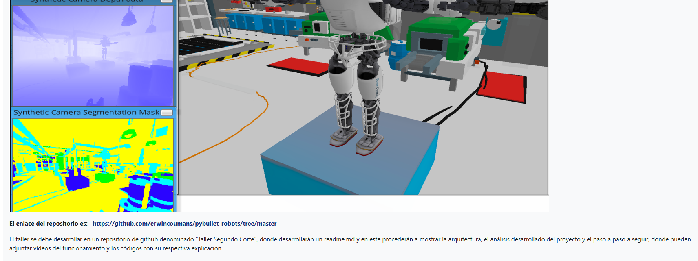
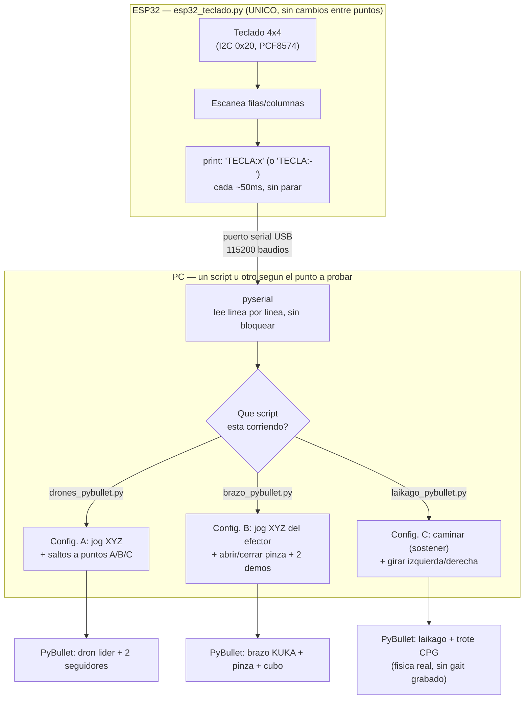

# Taller segundo corte: consolas de mando con ESP32 para simulaciones en PyBullet

Taller de tres puntos asignado por el profesor (el enunciado de cada punto está dentro de su propia carpeta), usando como base los repositorios que compartió: [gym-pybullet-drones](https://github.com/utiasDSL/gym-pybullet-drones) para el punto a) y [pybullet_robots](https://github.com/erwincoumans/pybullet_robots) (`baxter_ik_demo.py` y `laikago.py`) para los puntos b) y c).

**Un solo teclado matricial 4x4** (el mismo módulo I2C reutilizado en los temas 7 y 8) controla las tres simulaciones de este taller. El firmware del ESP32 (`esp32_teclado.py`) es idéntico para las tres: no sabe nada de drones, brazos ni patas, solo manda por serial la tecla que esté presionada en cada instante (`TECLA:8`, `TECLA:-`, etc). La "configuración" — qué hace cada tecla — vive del lado del PC, en cada script de Python, así que **no hay que reprogramar el ESP32 para pasar de un punto al otro**, solo correr el script que corresponda.

### [Punto a) Drones: mover entre 3 puntos A, B y C](./punto-a-drones-waypoints)
Un dron (con otros dos siguiéndolo en formación) se mueve entre tres waypoints con movimiento fluido, controlado por teclado: jog manual para posicionarlo a mano o saltos directos a los puntos A/B/C.

### [Punto b) Brazo robótico tipo Baxter: mover, posicionar y coger un objeto](./punto-b-brazo-tipo-baxter)
Un brazo robótico (control por cinemática inversa, la misma técnica de `baxter_ik_demo.py`) se mueve con el teclado en X/Y/Z y puede coger un cubo de una bandeja y llevarlo a otro punto, ya sea a mano (abrir/cerrar pinza) o con dos demos de un solo botón (coger y mover el cubo, o recorrer los 3 ejes).

### [Punto c) Locomoción real con las 4 patas (cuadrúpedo Laikago)](./punto-c-locomocion-laikago)
Un robot de 4 patas camina de verdad, con física real de punta a punta (un CPG genera el trote con senos, y es el contacto pata-piso el que lo empuja, nada de animaciones ni de teletransportar el cuerpo), con el teclado controlando cuándo camina y hacia dónde gira. Por qué este punto usa un robot distinto al del punto b) está explicado ahí mismo.

## Por qué Baxter se reemplazó por un brazo KUKA + pinza

El enunciado pide el robot Baxter y da como base `baxter_ik_demo.py`, pero ese script carga un URDF (`baxter_common/baxter_description/urdf/toms_baxter.urdf`) que no viene ni en ese repositorio ni en el paquete de Python `pybullet_data`: son las mallas 3D de [RethinkRobotics/baxter_common](https://github.com/RethinkRobotics/baxter_common), unos 50 MB, fuera de lugar en un repositorio de apuntes de clase como este.

En su lugar se usa el brazo **KUKA IIWA + pinza WSG50** (`kuka_iiwa/kuka_with_gripper2.sdf`), que **sí viene incluido** en `pybullet_data`, con exactamente la misma técnica de `baxter_ik_demo.py` (`calculateInverseKinematics` hacia una posición XYZ del efector) y los mismos índices de articulación/pinza que usa el propio ejemplo oficial de PyBullet para este modelo (`pybullet_envs/bullet/kuka.py`). Un solo brazo de 7 grados de libertad alcanza de sobra para demostrar lo que pide el punto b) — movimiento fluido, posicionamiento real y coger/mover un objeto — sin descargar mallas pesadas.

Por la misma razón (sin las mallas de Baxter no hay manera de que "camine"), el punto c) usa otro robot del mismo repositorio: un cuadrúpedo Laikago, cuyo URDF y mallas sí vienen en `pybullet_data`. La explicación completa de por qué el punto c) se interpretó como locomoción real (y no una repetición del punto b) está en el README de [`punto-c-locomocion-laikago`](./punto-c-locomocion-laikago).

## Qué es un waypoint y qué es la cinemática inversa (IK)

Un **waypoint** es, literalmente, un punto de paso: una coordenada XYZ a la que algo (un dron, el extremo de un brazo) tiene que llegar, sin importar el camino exacto que siga para hacerlo. El punto a) del taller son 3 waypoints (A, B, C) entre los que el dron viaja.

La **cinemática inversa** (IK, *inverse kinematics*) es el problema de calcular qué ángulo debe tener cada articulación de un brazo para que su extremo (el efector) llegue a una posición XYZ deseada — lo inverso de la cinemática "directa", que es fácil (con los ángulos ya conocidos, calcular dónde queda el extremo). Para un brazo de 7 articulaciones como el KUKA IIWA, hay más de una combinación de ángulos que llega al mismo punto (es un brazo "redundante"), así que `calculateInverseKinematics` de PyBullet recibe además una pose de referencia (`restPoses`) para que, entre todas las soluciones válidas, prefiera una parecida a esa. En el tema 7/8 el brazo de 2 grados de libertad se controlaba moviendo los ángulos directamente (sin IK) porque con solo 2 articulaciones alcanzar un punto XYZ arbitrario casi nunca es posible; con 7 articulaciones sí, y por eso acá se usa IK de verdad.

## Qué es una restricción cinemática (constraint) al agarrar un objeto

Agarrar un objeto solo con fricción de la pinza (como hace literalmente `baxter_ik_demo.py`) resultó poco confiable en las pruebas: la pinza es liviana y el cubo se escapaba o quedaba mal sujeto en cuanto el brazo empezaba a moverse rápido, en vez de quedarse quieto sosteniéndolo. La solución, la misma que usan muchos tutoriales de *pick-and-place* en PyBullet, es una **restricción (`p.createConstraint`)**: al cerrar la pinza cerca del cubo, se crea una unión fija (`p.JOINT_FIXED`) entre el efector y el cubo — una "soldadura" temporal que lo mantiene pegado a la pinza mientras viaja — y se elimina al abrir la pinza para soltarlo. Es la manera confiable de simular un agarre sin depender de que el motor de físicas resuelva bien el contacto/fricción entre dos piezas pequeñas y livianas.

## La idea general

## Cómo probarlo

Cada punto tiene su propio script (ver su README para el detalle completo), pero comparten el mismo entorno virtual y el mismo firmware de ESP32:

**Sin ESP32 conectado:**
1. Activar el entorno: `entorno\Scripts\activate` (ya trae `pybullet`, `pyserial` y `numpy`).
2. `python punto-a-drones-waypoints\drones_pybullet.py`, `python punto-b-brazo-tipo-baxter\brazo_pybullet.py` o `python punto-c-locomocion-laikago\laikago_pybullet.py`. Al no encontrar el ESP32, cada ventana de PyBullet abre igual con sus propios botones.

**Con ESP32 conectado:**
1. Guardar `esp32_teclado.py` como `main.py` en el ESP32 (con Thonny, por ejemplo) — un solo teclado matricial 4x4 por I2C, dirección `0x20`, igual que en los temas 7 y 8 (`SDA`→`GPIO21`, `SCL`→`GPIO22`).
2. Ajustar `PUERTO_SERIAL` dentro del script que se vaya a correr, según el puerto COM que aparezca en el Administrador de dispositivos.
3. Correr el script del punto que se quiera probar. El mismo teclado, sin reprogramar nada, sirve para las tres simulaciones — solo cambia qué script de Python está escuchando.

## Pendiente

Se hicieron pruebas adicionales de la comunicación serial antes del montaje físico. Fotos del montaje y video de la demo — se agregan aquí antes de subir el tema al repositorio.
