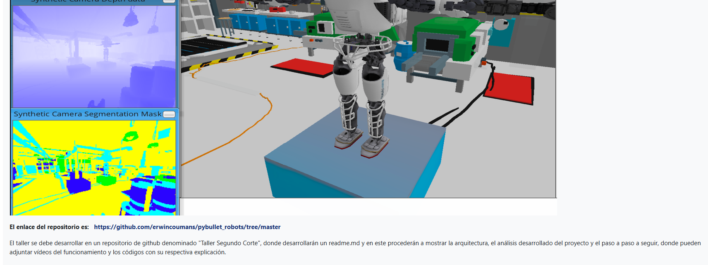
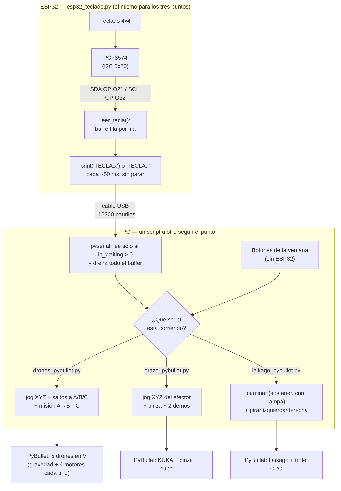
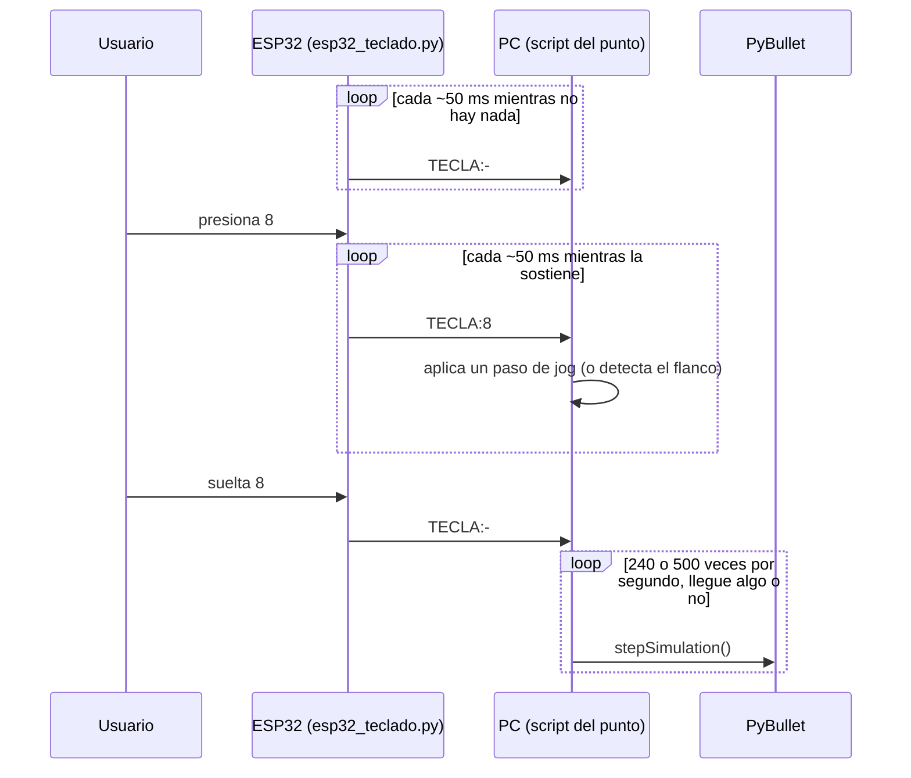

# Taller segundo corte: consolas de mando con ESP32 para simulaciones en PyBullet

Taller de tres puntos que dejó el profesor para cerrar el segundo corte, en la línea de lo que en clase llamamos *real-to-sim*: algo físico (un ESP32 con un teclado en la mano) manejando algo simulado (robots en PyBullet). El profesor compartió dos repositorios como base: [gym-pybullet-drones](https://github.com/utiasDSL/gym-pybullet-drones) para el punto a) y [pybullet_robots](https://github.com/erwincoumans/pybullet_robots) (`baxter_ik_demo.py` y `laikago.py`) para los puntos b) y c). El enunciado de cada punto está dentro de su carpeta; este es el de la entrega en general:



La entrega pide "mostrar la arquitectura, el análisis desarrollado del proyecto y el paso a paso a seguir", con los códigos y su explicación. Por eso este README explica lo que tienen en común los tres puntos (el teclado, el firmware del ESP32, cómo se leen las teclas en el PC y cómo se conecta todo), y cada punto tiene su propio README con la parte de control y la lógica de su simulación.

## Lo que se hizo en cada punto

### [Punto a) Drones: mover entre 3 puntos A, B y C](./punto-a-drones-waypoints)
Cinco drones en formación en V vuelan con física real (gravedad más la fuerza de los 4 motores de cada uno, con un control en cascada como el de gym-pybullet-drones) entre tres waypoints. Con el teclado se pueden mover a mano, mandar directo a A, B o C, o lanzar la misión automática A → B → C. Trae una prueba sin ventana que vuela la misión y la mide: en nuestra última corrida el líder llegó a A a los 1,2 s, a B a los 2,9 s y a C a los 4,9 s de empezar.

### [Punto b) Brazo robótico tipo Baxter: mover, posicionar y coger un objeto](./punto-b-brazo-tipo-baxter)
Un brazo KUKA IIWA con pinza (en vez de Baxter, más abajo está el porqué) se mueve con el teclado en X, Y y Z usando cinemática inversa, la misma técnica de `baxter_ik_demo.py`. Puede coger un cubo de una bandeja y llevarlo a una plataforma, a mano (abrir y cerrar la pinza) o con una demo de un solo botón; otra demo recorre los tres ejes para mostrar el rango de movimiento.

### [Punto c) Locomoción real con las 4 patas (cuadrúpedo Laikago)](./punto-c-locomocion-laikago)
Un robot de 4 patas camina de verdad: un CPG genera el trote con funciones seno y es el contacto de las patas con el piso lo que lo empuja (nada de animaciones ni de mover el cuerpo a mano). Con el teclado se decide cuándo camina y hacia dónde gira. Ahí mismo explicamos por qué interpretamos el punto c) como locomoción y por qué usamos otro robot.

## Qué es PyBullet

PyBullet es la versión para Python del motor de física Bullet (el mismo que usan algunos videojuegos y bastantes laboratorios de robótica). Uno carga robots y objetos desde archivos de descripción (`.urdf` o `.sdf`), les pone gravedad, y cada llamada a `p.stepSimulation()` avanza el mundo un paso de tiempo fijo (en este taller, 1/240 s en los drones y el brazo, y 1/500 s en el Laikago): calcula choques, fricción, fuerzas de los motores de cada articulación y la nueva posición de todo. Tiene dos modos: `GUI`, que abre una ventana 3D donde se ve la simulación y se pueden poner botones propios (`addUserDebugParameter`), y `DIRECT`, sin ventana, mucho más rápido, que usamos para las pruebas automáticas (medir cuánto se demora el dron en llegar, o cuántas veces se cae el Laikago con unos parámetros dados).

PyBullet trae un paquete de modelos listos, `pybullet_data`: el piso (`plane.urdf`), el brazo KUKA, la bandeja, el cubo y el Laikago que usamos salen de ahí, así que no hay que descargar nada aparte. El dron no: ese lo describimos nosotros en `punto-a-drones-waypoints/dron.urdf`.

## Qué es una consola de mandos y por qué un solo teclado para todo

Los tres enunciados piden "una consola de mandos con la ESP32". Lo que hicimos es tratar al ESP32 como un control de videojuego: **un solo teclado matricial 4x4** (el mismo módulo I2C que ya usamos en los temas 7 y 8) conectado a un ESP32, que le cuenta al PC qué tecla está presionada. El firmware (`esp32_teclado.py`) es idéntico para los tres puntos: no sabe nada de drones, brazos ni patas, solo manda por serial la tecla que esté presionada en cada instante (`TECLA:8`, `TECLA:-`, etc.). Lo que hace cada tecla (la "configuración" del control) vive del lado del PC, en el script de Python de cada punto. Así **no hay que reprogramar el ESP32 para pasar de un punto a otro**: se deja conectado y solo se cambia qué script se corre.

## Qué es un teclado matricial, I2C y el PCF8574

Un teclado 4x4 tiene 16 teclas pero solo 8 cables: las teclas están en una matriz de 4 filas y 4 columnas, y cada tecla es un interruptor que, al apretarse, une su fila con su columna. Para saber cuál se presionó hay que **barrer** la matriz: poner en 0 una fila a la vez y mirar las columnas. Si una columna aparece en 0 mientras esa fila está en 0, hay una tecla apretada justo en ese cruce.

Conectar esos 8 cables directo al ESP32 gasta 8 pines. En vez de eso usamos un **PCF8574**, un "expansor de pines": un chip que ofrece 8 pines digitales (P0 a P7) y se maneja por **I2C**, un bus de solo 2 cables (`SDA` para los datos y `SCL` para el reloj) en el que cada chip tiene una dirección, como el número de una casa en una calle. El ESP32 le escribe un byte al PCF8574 para fijar sus 8 pines y le pide un byte para leerlos. Nuestro módulo tiene la dirección `0x20` (los tres pines de dirección A0, A1 y A2 en GND).

Un detalle del PCF8574 que explica el código: no tiene un registro para decir "este pin es entrada y este salida". Un pin escrito en 0 queda firme en 0; un pin escrito en 1 queda débilmente en 1, con una pull-up interna, y cualquier cosa externa que lo lleve a GND lo baja. Por eso, para "leer" las columnas, el firmware las escribe en 1 y después lee el byte: la columna que tenga una tecla presionada contra la fila activa vuelve en 0. Esa pull-up interna es la razón de que el teclado no necesite resistencias externas.

## Qué es un jog y por qué no un dial

En los tres puntos el movimiento manual es de tipo **jog**: cada tecla suma o resta un paso fijo (10 cm en el objetivo del dron, 1,5 cm en el efector del brazo, 0,015 rad de giro en el Laikago), y sostener la tecla repite ese paso una y otra vez, como mover un cursor con las flechas. La alternativa sería un **dial**: un valor absoluto (por ejemplo un slider o un potenciómetro) que dice directamente "la posición es tanto". Elegimos jog por dos razones: el teclado es lo que ya teníamos y solo sabe decir "presionada o no", y en el tema 7 comprobamos que los sliders de PyBullet (`addUserDebugParameter` con rango) no se pueden recrear de forma confiable. Con jog, los botones de la ventana son fijos y se crean una sola vez, y cada click equivale exactamente a una pulsación de la tecla correspondiente.

## Por qué Baxter se reemplazó por un brazo KUKA + pinza

El enunciado del punto b) pide el robot Baxter y da como base `baxter_ik_demo.py`, pero ese script carga un URDF (`baxter_common/baxter_description/urdf/toms_baxter.urdf`) que no viene ni en ese repositorio ni en el paquete de Python `pybullet_data`: son las mallas 3D de [RethinkRobotics/baxter_common](https://github.com/RethinkRobotics/baxter_common), unos 50 MB, fuera de lugar en un repositorio de apuntes de clase como este. Lo comprobamos buscando en el `pybullet_data` instalado en `entorno/`: trae `kuka_iiwa`, `laikago`, `tray` y `cube_small.urdf`, pero nada de Baxter.

En su lugar usamos el brazo **KUKA IIWA + pinza WSG50** (`kuka_iiwa/kuka_with_gripper2.sdf`), que sí viene incluido, con exactamente la misma técnica de `baxter_ik_demo.py` (`calculateInverseKinematics` hacia una posición XYZ del efector) y los mismos índices de articulación y de pinza que usa el propio ejemplo oficial de PyBullet para este modelo (`pybullet_envs/bullet/kuka.py`). Cada brazo de Baxter tiene 7 articulaciones y el KUKA también, así que el problema de control es el mismo: un solo brazo de 7 grados de libertad alcanza de sobra para lo que pide el punto b) (movimiento fluido, posicionamiento real y coger y mover un objeto).

Por la misma razón (Baxter no tiene piernas, y sin sus mallas tampoco hay manera de simularlo), el punto c) usa otro robot del mismo repositorio: el cuadrúpedo Laikago, cuyo URDF y mallas sí vienen en `pybullet_data`. La explicación completa está en el README de [`punto-c-locomocion-laikago`](./punto-c-locomocion-laikago).

## La idea general


```mermaid
flowchart TD
    subgraph ESP["ESP32 — esp32_teclado.py (el mismo para los tres puntos)"]
        Teclado["Teclado 4x4"] --> PCF["PCF8574<br/>(I2C 0x20)"]
        PCF -->|"SDA GPIO21 / SCL GPIO22"| Lee["leer_tecla():<br/>barre fila por fila"]
        Lee --> Envia["print('TECLA:x') o 'TECLA:-'<br/>cada ~50 ms, sin parar"]
    end

    Envia -->|"cable USB<br/>115200 baudios"| Recibe

    subgraph PC["PC — un script u otro según el punto"]
        Recibe["pyserial: lee solo si in_waiting > 0<br/>y drena todo el buffer"] --> Config{"¿Qué script<br/>está corriendo?"}
        Botones["Botones de la ventana<br/>(sin ESP32)"] --> Config
        Config -->|"drones_pybullet.py"| Drones["jog XYZ + saltos a A/B/C<br/>+ misión A→B→C"]
        Config -->|"brazo_pybullet.py"| Brazo["jog XYZ del efector<br/>+ pinza + 2 demos"]
        Config -->|"laikago_pybullet.py"| Patas["caminar (sostener, con rampa)<br/>+ girar izquierda/derecha"]
    end

    Drones --> SimDrones["PyBullet: 5 drones en V<br/>(gravedad + 4 motores cada uno)"]
    Brazo --> SimBrazo["PyBullet: KUKA + pinza + cubo"]
    Patas --> SimPatas["PyBullet: Laikago + trote CPG"]
```

Así se ve en el tiempo una pulsación normal (sostener la tecla `8` un momento y soltarla):


```mermaid
sequenceDiagram
    participant U as Usuario
    participant E as ESP32 (esp32_teclado.py)
    participant P as PC (script del punto)
    participant S as PyBullet
    loop cada ~50 ms mientras no hay nada
        E->>P: TECLA:-
    end
    U->>E: presiona 8
    loop cada ~50 ms mientras la sostiene
        E->>P: TECLA:8
        P->>P: aplica un paso de jog (o detecta el flanco)
    end
    U->>E: suelta 8
    E->>P: TECLA:-
    loop 240 o 500 veces por segundo, llegue algo o no
        P->>S: stepSimulation()
    end
```

## El firmware del ESP32 paso a paso (`esp32_teclado.py`)

El archivo es corto (unas 80 líneas) y se guarda como `main.py` en el ESP32 para que arranque solo al conectarlo. Hace tres cosas:

1. **Abre el bus I2C** en `GPIO21` (SDA) y `GPIO22` (SCL) a 100 kHz, el modo estándar del PCF8574:
   ```python
   i2c = I2C(0, sda=Pin(I2C_SDA), scl=Pin(I2C_SCL), freq=100000)
   ```
2. **Barre el teclado** en `leer_tecla()`. El nibble alto del byte (P4 a P7) son las filas y el bajo (P0 a P3) las columnas. Para cada fila arma un byte con esa fila en 0, las otras tres en 1 y las cuatro columnas en 1 (para que queden como entradas con pull-up), lo escribe, lee el byte de vuelta y mira qué columna bajó:
   ```python
   filas = 0x0F & ~(1 << fila)
   byte_salida = (filas << 4) | 0x0F
   i2c.writeto(DIR_TECLADO, bytes([byte_salida]))
   byte_entrada = i2c.readfrom(DIR_TECLADO, 1)[0]
   columnas = byte_entrada & 0x0F
   ```
   Un ejemplo concreto: al barrer la fila 1 (la de `4 5 6 B`) se escribe `0b1101_1111` (`0xDF`, P5 en 0). Si la tecla `5` está presionada, une P5 con P1, y el byte que vuelve tiene las columnas en `0b1101`: la columna 1 está en 0, así que la tecla es `MAPA_TECLAS[1][1]`, o sea `"5"`. Si ninguna columna bajó en ninguna de las 4 filas, devuelve `None`.
3. **Manda la tecla actual cada 50 ms, cambie o no**:
   ```python
   while True:
       tecla = leer_tecla()
       print("TECLA:{}".format(tecla if tecla is not None else "-"))
       time.sleep_ms(50)
   ```
   Mandar siempre (y `TECLA:-` cuando no hay nada) es lo que permite que "sostener" una tecla llegue al PC como una repetición continua, 20 veces por segundo, y que el PC sepa cuándo se soltó. 50 ms es lo bastante rápido para que el jog se sienta continuo y lo bastante lento para no saturar el puerto: cada línea son unos 9 bytes (`TECLA:8` más el salto de línea), unos 180 bytes por segundo de los ~11 500 que caben a 115 200 baudios.

`print()` en MicroPython sale por el mismo USB con el que se programa el ESP32, así que no hace falta ningún UART extra: del lado del PC ese USB aparece como un puerto COM.

## El protocolo `TECLA:x` y cómo lo lee el PC

El protocolo es una línea de texto por mensaje, siempre con la misma forma:

```
TECLA:-      ninguna tecla presionada
TECLA:8      se está sosteniendo el 8
TECLA:A      se está sosteniendo la A
TECLA:#      se está sosteniendo el numeral
```

Los tres scripts lo leen con las mismas dos reglas, que aprendimos a la mala:

- **No bloquear nunca la simulación.** Un `ser.readline()` a secas, con timeout, se queda esperando hasta que llegue una línea completa. Como esa llamada vive en el mismo bucle que `stepSimulation()`, la ventana entera quedaba limitada a la velocidad a la que llegan líneas del ESP32 (unas 20 por segundo) en vez de los 240 pasos por segundo de la física, y el brazo se veía trabado aunque el jog estuviera bien calculado. El arreglo es leer **solo si ya hay bytes esperando** (`ser.in_waiting > 0`).
- **Drenar todo lo que llegó, no una línea por vuelta.** Si en una vuelta del bucle se lee una sola línea y llegaron tres, el script se va quedando atrás. Por eso se lee en un `while`, hasta vaciar el buffer.

Y un truco de diagnóstico que los tres muestran en la ventana: **la última línea cruda recibida** tal como llegó. Si nunca cambia, el ESP32 no está mandando nada (puerto equivocado, Thonny ocupando el puerto, `main.py` detenido); si cambia pero no dice `TECLA:x`, el problema es de formato y no de cables.

Lo que sí cambia entre puntos es **cómo se interpreta la repetición**. Como el ESP32 repite la tecla sostenida cada 50 ms, cada script decide qué teclas actúan en cada repetición (jog: sostener es seguir moviéndose) y cuáles solo en el **flanco**, es decir, en el instante en que la tecla recibida cambia (acciones de un solo golpe, como una demo o un reset):

| Punto | Actúan en cada repetición | Actúan solo en el flanco |
|---|---|---|
| a) Drones | todas (las que no son jog fijan un objetivo, y repetirlo no cambia nada) | ninguna |
| b) Brazo | `8 2 4 6 9 7` (jog) | `5 A B C D 0` |
| c) Laikago | `4 6` (cada línea gira un paso) | `8` (empezar y dejar de caminar), `5` |

En el brazo esto no era un detalle: un toque normal de la `D` son unas 4 líneas `TECLA:D`, y antes de separar jog y flanco la demo de coger el cubo (unos 10 s) se ejecutaba cuatro veces seguidas.

## Conexiones

Solo el teclado va al ESP32; no hay ningún otro sensor. Estas conexiones salen del código del firmware (`I2C_SDA = 21`, `I2C_SCL = 22`, `DIR_TECLADO = 0x20`, y el barrido con filas en P4-P7 y columnas en P0-P3).

**Teclado 4x4 → PCF8574.** Si el teclado viene con su módulo PCF8574 ya soldado, esto ya está hecho; si se arma a mano, tiene que quedar así para que `MAPA_TECLAS` coincida con las teclas reales:

| Teclado 4x4 | Teclas de esa línea | PCF8574 | Rol en el firmware |
|---|---|---|---|
| Fila 1 | `1 2 3 A` | `P4` | salida, se pone en 0 al barrer la fila 0 |
| Fila 2 | `4 5 6 B` | `P5` | salida, fila 1 |
| Fila 3 | `7 8 9 C` | `P6` | salida, fila 2 |
| Fila 4 | `* 0 # D` | `P7` | salida, fila 3 |
| Columna 1 | `1 4 7 *` | `P0` | entrada con pull-up interna, columna 0 |
| Columna 2 | `2 5 8 0` | `P1` | entrada con pull-up interna, columna 1 |
| Columna 3 | `3 6 9 #` | `P2` | entrada con pull-up interna, columna 2 |
| Columna 4 | `A B C D` | `P3` | entrada con pull-up interna, columna 3 |

**PCF8574 → ESP32:**

| Módulo PCF8574 | ESP32 | Por qué |
|---|---|---|
| `VCC` | `3V3` | a 3,3 V las líneas I2C quedan al mismo voltaje que los pines del ESP32 (a 5 V, las pull-ups del bus llevarían SDA y SCL a 5 V) |
| `GND` | `GND` | referencia común |
| `SDA` | `GPIO21` | pin I2C por defecto del ESP32 DevKit, el mismo de los temas 7 y 8 |
| `SCL` | `GPIO22` | ídem |
| `A0`, `A1`, `A2` | a `GND` | dirección `0x20`, la que usa `DIR_TECLADO` |

Las columnas no necesitan resistencias externas (usan la pull-up interna del PCF8574). El bus I2C sí necesita pull-ups en SDA y SCL: los módulos PCF8574 normalmente las traen soldadas; si se usa el chip suelto, hay que poner unas de 4,7 kΩ a 3V3.

**ESP32 → PC:** un solo cable USB, el mismo con el que se programa. En el Administrador de dispositivos de Windows se ve qué puerto COM le asignó (por defecto los scripts buscan `COM7`).

## Qué hace cada archivo

```
9-taller-segundo-corte/
├─ README.md                    este archivo: lo común a los tres puntos
├─ enunciado-entrega.png        captura del enunciado general de la entrega
├─ esp32_teclado.py             firmware único del ESP32 (se guarda como main.py)
├─ entorno/                     entorno de Python compartido (no se sube: su .gitignore tiene "*")
├─ punto-a-drones-waypoints/
│  ├─ README.md
│  ├─ enunciado-actividad.png
│  ├─ drones_pybullet.py        simulación y control de los 5 drones
│  └─ dron.urdf                 el dron: un solo cuerpo con masa, inercia y 4 brazos
├─ punto-b-brazo-tipo-baxter/
│  ├─ README.md
│  ├─ enunciado-actividad.png
│  └─ brazo_pybullet.py         KUKA + pinza + cubo, jog por IK y demos
└─ punto-c-locomocion-laikago/
   ├─ README.md
   ├─ enunciado-actividad.png
   └─ laikago_pybullet.py       Laikago con trote CPG, rampa y giro
```

- **`esp32_teclado.py`**: se usa en los tres puntos, sin cambios. Barre el teclado por I2C y manda `TECLA:x` cada 50 ms. Es lo único que se carga en el ESP32.
- **`entorno/`**: entorno virtual de Python 3.14 con `pybullet`, `pyserial` y `numpy`. Los tres scripts corren con él. No se sube a GitHub; quien clone el repo tiene que crearlo (ver "Cómo probarlo").
- **`drones_pybullet.py`, `brazo_pybullet.py`, `laikago_pybullet.py`**: un script por punto. Cada uno intenta abrir el puerto serial dentro de un `try/except serial.SerialException`; si no encuentra el ESP32, avisa por consola y sigue funcionando con botones en la ventana de PyBullet. Su lógica está explicada en el README de cada punto.
- **`dron.urdf`**: la descripción del dron del punto a) (el único modelo que no viene en `pybullet_data`).

## Qué hace cada tecla en cada punto

Sacado de la función que interpreta las teclas en cada script (`Mando.tecla`, `ejecutar_tecla` y `procesar_tecla`):

| Tecla | a) Drones | b) Brazo KUKA | c) Laikago |
|---|---|---|---|
| `8` / `2` | objetivo +Y / −Y | efector +Y / −Y | `8` sostenida: trotar (al soltar frena con rampa) |
| `4` / `6` | objetivo −X / +X | efector −X / +X | sostenidas: girar a la izquierda / derecha (frena el trote antes) |
| `9` / `7` | subir / bajar (no pasa del suelo) | efector +Z / −Z | — |
| `5` | congelar el objetivo donde está | volver a la pose inicial | reiniciar el robot |
| `A` / `B` / `C` | ir al waypoint A, B o C | A: abrir pinza · B: demo de los 3 ejes · C: cerrar y agarrar | — |
| `D` | volver al origen | demo: coger el cubo y llevarlo | — |
| `*` / `#` | despegar / aterrizar | — | — |
| `0` | misión automática A → B → C | soltar y reponer el cubo | — |
| `1` / `3` | — | — | — |

Waypoints del punto a): A = (0,0; 0,9; 1,2) m, B = (1,4; −0,6; 1,6) m, C = (−1,3; 0,4; 0,9) m.

## Cómo probarlo

Los tres scripts comparten el entorno que está en esta carpeta. Los comandos van desde `9-taller-segundo-corte\` y llaman al Python del entorno directamente (`entorno\Scripts\python ...`), que sigue funcionando aunque la carpeta se haya movido de lugar; el script `activate` guarda la ruta absoluta de cuando se creó y puede fallar.

Si se clona el repo y `entorno\` no existe:

```
python -m venv entorno
entorno\Scripts\python -m pip install pybullet pyserial numpy
```

**Sin ESP32 conectado:**
1. Correr el punto que se quiera ver:
   ```
   entorno\Scripts\python punto-a-drones-waypoints\drones_pybullet.py
   entorno\Scripts\python punto-b-brazo-tipo-baxter\brazo_pybullet.py
   entorno\Scripts\python punto-c-locomocion-laikago\laikago_pybullet.py
   ```
2. En consola sale `No se encontro el ESP32 en COM7: usa los botones de la ventana.` y la ventana de PyBullet abre igual. Los botones están en el panel de la derecha ("Params"); cada click equivale a una pulsación de la tecla correspondiente.
3. Para comprobar el punto a) sin abrir ventana: `entorno\Scripts\python punto-a-drones-waypoints\drones_pybullet.py --prueba` (vuela la misión A → B → C y termina con `PRUEBA OK`).

**Con ESP32 conectado:**
1. Armar las conexiones de arriba y guardar `esp32_teclado.py` como `main.py` en el ESP32 (con Thonny: abrir el archivo, "Guardar como" → dispositivo MicroPython → `main.py`).
2. Cerrar Thonny (o desconectarlo con "Detener"): si Thonny tiene el puerto abierto, pyserial no puede abrirlo.
3. Ver el puerto COM en el Administrador de dispositivos. En los drones se pasa por consola (`--puerto COM5`); en el brazo y el Laikago se cambia la constante `PUERTO_SERIAL` al principio del script.
4. Correr el script del punto. Al abrir el puerto el ESP32 se reinicia (la señal DTR del USB lo resetea), por eso los scripts esperan 2 s antes de empezar a leer. El mismo teclado sirve para los tres puntos sin reprogramar nada.
5. Si "no pasa nada", mirar la línea cruda del ESP32 en la ventana. Si nunca cambia, conectar Thonny y mirar la consola: un `OSError: [Errno 19] ENODEV` quiere decir que el PCF8574 no contesta en `0x20` (cable de SDA/SCL suelto, sin alimentación o jumpers de dirección distintos).

No sirve escribir `TECLA:8` a mano en la consola de Thonny para probar: Thonny manda ese texto con su protocolo de "raw paste", interrumpe `main.py` y deja la placa en el REPL. Para ver qué manda el ESP32 sin Thonny, lo más directo es la propia línea cruda de la ventana, o un script de tres líneas con pyserial que abra el puerto e imprima lo que llega.

## Pendiente

Se hicieron pruebas adicionales de la comunicación serial antes del montaje físico. Faltan las fotos del montaje (ESP32 + módulo PCF8574 + teclado) y el video de cada punto funcionando con el teclado; se agregan aquí y en el README de cada punto cuando estén.
