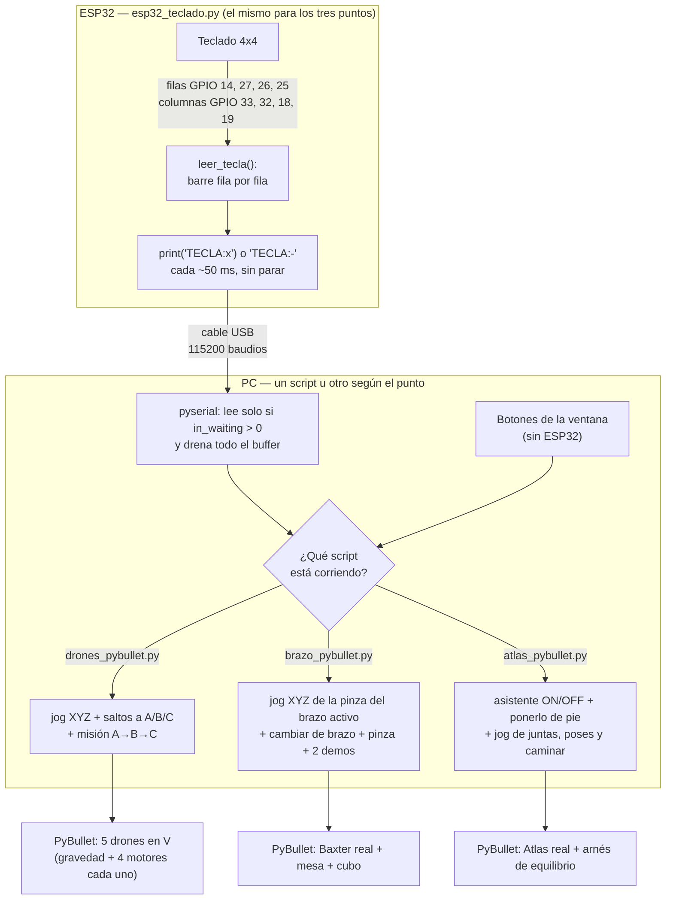
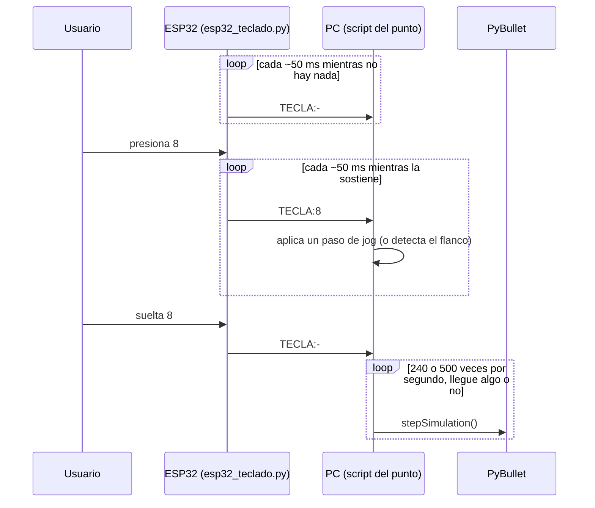

# Taller segundo corte: consolas de mando con ESP32 para simulaciones en PyBullet

Taller de tres puntos que dejó el profesor para cerrar el segundo corte, en la línea de lo que en clase llamamos *real-to-sim*: algo físico (un ESP32 con un teclado en la mano) manejando algo simulado (robots en PyBullet). El profesor compartió dos repositorios como base: [gym-pybullet-drones](https://github.com/utiasDSL/gym-pybullet-drones) para el punto a) y [pybullet_robots](https://github.com/erwincoumans/pybullet_robots) (`baxter_ik_demo.py` y `atlas.py`) para los puntos b) y c). El enunciado de cada punto está dentro de su carpeta; este es el de la entrega en general:


La entrega pide "mostrar la arquitectura, el análisis desarrollado del proyecto y el paso a paso a seguir", con los códigos y su explicación. Por eso este README explica lo que tienen en común los tres puntos (el teclado, el firmware del ESP32, cómo se leen las teclas en el PC y cómo se conecta todo) y, sobre todo, **cómo se maneja cada punto**; cada punto tiene además su propio README con la parte de control y la lógica de su simulación.

## El montaje real

Todo el taller se maneja con este montaje: un ESP32 en su placa de expansión y un teclado matricial 4x4 conectado **directo a 8 GPIO** con 8 cables (4 filas y 4 columnas), sin ningún módulo intermedio. Un solo cable USB va al portátil: por ahí se alimenta el ESP32 y por ahí manda las teclas. Con este mismo montaje, sin reprogramar nada, se probaron los tres puntos, y el teclado respondió en todos.

<table>
<tr>
<td></td>
<td></td>
</tr>
<tr>
<td>El ESP32 con los 8 cables del teclado (filas y columnas) y el USB al PC.</td>
<td>El teclado 4x4 hace de control: el mismo para drones, Baxter y Atlas.</td>
</tr>
</table>

## Lo que se hizo en cada punto

### [Punto a) Drones: mover entre 3 puntos A, B y C](./punto-a-drones-waypoints)
Cinco drones en formación en V vuelan con física real (gravedad más la fuerza de los 4 motores de cada uno, con un control en cascada como el de gym-pybullet-drones) entre tres waypoints. Con el teclado se pueden mover a mano, mandar directo a A, B o C, o lanzar la misión automática A → B → C. Trae una prueba sin ventana que vuela la misión y la mide: en nuestra última corrida el líder llegó a A a los 1,2 s, a B a los 2,9 s y a C a los 4,9 s de empezar.


Video completo: [drones-mision.mp4](punto-a-drones-waypoints/video/drones-mision.mp4)

### [Punto b) Baxter: mover los dos brazos, posicionar y coger un objeto](./punto-b-brazo-tipo-baxter)
El robot **Baxter real** (el mismo `toms_baxter.urdf` de `baxter_ik_demo.py`) mueve cualquiera de sus dos brazos con el teclado en X, Y y Z usando cinemática inversa; la tecla `*` cambia de brazo y el otro se queda quieto, sostenido por sus motores. Puede coger un cubo de la mesa y llevarlo a otro punto, a mano (abrir y cerrar la pinza) o con una demo de un solo botón; otra demo recorre los tres ejes. La prueba sin ventana (`probar_baxter.py`) mide que cada pinza llega a menos de 0,2 cm de sus objetivos y que la demo deja el cubo a menos de 0,6 cm del destino con los dos brazos.


Video completo: [baxter-demo.mp4](punto-b-brazo-tipo-baxter/video/baxter-demo.mp4)

<table>
<tr>
<td></td>
<td></td>
</tr>
<tr>
<td>Baxter en su pose inicial (los dos brazos sobre la mesa).</td>
<td>La pinza cerrada sobre el cubo.</td>
</tr>
</table>

### [Punto c) Atlas: humanoide con asistente de equilibrio](./punto-c-atlas)
El enunciado del punto c) dice "Baxter" pero su imagen es el humanoide **Atlas** de Boston Dynamics (`atlas.py` del mismo repositorio), así que este punto usa el **Atlas real**. Con el teclado se mueven sus brazos, torso, cabeza y piernas, se le ponen poses (saludar, agacharse, brazos arriba) y camina, todo con física real. Tiene un **asistente de equilibrio** que se prende y se apaga con una tecla (y con un botón en la ventana), y una tecla para **ponerlo de pie** si se cae: así se puede comparar la misma caminata con y sin ayuda. Con asistente camina, gira y retrocede sin caerse; sin él aguanta de pie y en las poses, camina derecho al borde de caerse (a veces aguanta, a veces no) y se cae al girar, al retroceder o al arrancar y frenar varias veces.

<table>
<tr>
<td></td>
<td></td>
</tr>
<tr>
<td>Con asistente. Video completo: <a href="punto-c-atlas/video/atlas-con-asistente.mp4">atlas-con-asistente.mp4</a></td>
<td>Sin asistente. Video completo: <a href="punto-c-atlas/video/atlas-sin-asistente.mp4">atlas-sin-asistente.mp4</a></td>
</tr>
</table>

<table>
<tr>
<td></td>
<td></td>
<td></td>
</tr>
<tr>
<td>De pie, asistente ON.</td>
<td>Caminando.</td>
<td>Asistente OFF.</td>
</tr>
</table>

## Cómo se maneja cada punto: comportamientos y modos

Las tres simulaciones se manejan con el mismo teclado, pero no se manejan igual. Lo que cambia de un punto a otro es **cómo reacciona cada tecla** y **en qué modo está el robot**. Hay tres comportamientos de tecla, y cada punto los combina a su manera:

- **Jog (sostener = seguir moviéndose).** Cada línea `TECLA:x` que llega mueve un paso fijo; como el ESP32 repite la tecla sostenida 20 veces por segundo, sostenerla es moverse de corrido y soltarla es parar. Es el movimiento fino, a mano.
- **Un golpe (flanco).** La acción ocurre una sola vez, en el instante en que la tecla recibida cambia, aunque se deje sostenida: una demo, cambiar de brazo, prender el asistente, una pose. Para repetirla hay que soltar y volver a pulsar.
- **Sostener para mantener un estado (flanco al pulsar y al soltar).** Solo en Atlas: pulsar `8 2 4 6` arranca la caminata o el giro, y soltar la frena. No es un paso por línea sino un estado que dura mientras la tecla está abajo.

La explicación de por qué hace falta separar jog y flanco está más abajo, en "El protocolo `TECLA:x` y cómo lo lee el PC".

### a) Drones: manual, waypoints y misión

| Modo | Teclas | Qué pasa |
|---|---|---|
| Manual (jog) | `8 2 4 6 9 7` | El objetivo del líder se corre 10 cm por línea: sosteniendo, unos 2 m/s de objetivo. El líder vuela hacia él inclinándose y los otros cuatro lo siguen en V. `7` nunca baja del piso. |
| Detener | `5` | El objetivo pasa a ser donde está el líder: se queda flotando ahí. |
| Waypoints | `A` `B` `C`, `D` | Vuela directo al punto elegido, o al origen con `D` (y aterriza ahí). |
| Despegar / aterrizar | `*` / `#` | Sube a 1 m / baja al piso y apaga los motores al tocarlo. |
| Misión automática | `0` | Va a A, al llegar (a menos de 12 cm y casi quieto) pasa a B y después a C, sola. Cualquier otra tecla cancela la misión y retoma el control manual. |

En los drones todas las teclas actúan en cada línea: las que no son jog fijan un objetivo, y fijar el mismo objetivo cuatro veces seguidas da lo mismo que fijarlo una.

### b) Baxter: brazo activo, jog XYZ, pinza y demos

| Modo | Teclas | Qué pasa |
|---|---|---|
| Elegir brazo | `*` (un golpe) | Cambia el brazo activo, izquierdo ↔ derecho. El otro se queda quieto donde estaba, sostenido por sus motores. |
| Jog XYZ de la pinza | `8 2 4 6 9 7` (jog) | La pinza del brazo activo se mueve 1,5 cm por línea (30 cm/s sostenida), siempre mirando hacia abajo, y la cinemática inversa calcula las 7 articulaciones. No sale de la caja de trabajo de ese brazo: sosteniendo `7` baja hasta la altura de agarre y se detiene sin atravesar la mesa. |
| Pinza | `C` / `A` (un golpe) | Cierra (y agarra el cubo si está entre los dedos) / abre (y lo suelta). |
| Demos | `D` / `B` (un golpe) | `D` coge el cubo y lo lleva al destino con el brazo activo (8,6 s de simulación); `B` recorre los extremos de la caja en X, Y y Z. Mientras corre una demo no se leen teclas, y lo que llegó en ese tiempo se descarta. |
| Home y reponer | `5` / `0` (un golpe) | Devuelve el brazo activo a su pose inicial / suelta el cubo y lo pone otra vez en el origen. |

Se puede hacer todo a mano (jog hasta encima del cubo, bajar, `C`, subir, jog hasta el destino, bajar, `A`) o de un golpe con `D`, y con cualquiera de los dos brazos.

### c) Atlas: asistente, grupos de juntas, poses y caminata

| Modo | Teclas | Qué pasa |
|---|---|---|
| Asistente de equilibrio | `A` (un golpe) | Prende o apaga el arnés virtual: sostiene la mitad del peso y endereza la pelvis, sin empujar en horizontal ni girar el rumbo. |
| Ponerlo de pie | `B` (un golpe) | Lo deja de pie donde está, lo asienta 0,6 s con asistente y después devuelve el asistente a como estaba. `0` reinicia todo en el origen, con asistente prendido. |
| Grupos de juntas | `*` (un golpe) | Pasa al siguiente grupo: brazo izquierdo → brazo derecho → torso y cabeza → piernas. |
| Jog de juntas | `1 3` y `7 9` (jog) | Mueven las dos juntas del grupo activo, 0,03 rad por línea (unos 0,6 rad/s sostenida), sin pasar del límite del URDF. En piernas una tecla mueve cadera, rodilla y tobillo a la vez para agacharlo con los pies planos. |
| Poses | `C` saludar, `D` agacharse, `#` brazos arriba, `5` de pie y detener (un golpe) | Cambian con una rampa en S de 0,6 s: los motores nunca reciben un salto. |
| Caminar y girar | `8` / `2`, `4` / `6` (sostener) | Adelante / atrás, girar a la izquierda / derecha dando pasos en el lugar. Arranca al pulsar y frena al soltar, con rampa de 0,6 s. |

**Con y sin asistente.** Es la comparación central del punto c), y sale de `probar_atlas.py` (mismas teclas, misma física, el asistente es lo único que cambia):

| Prueba | Con asistente | Sin asistente |
|---|---|---|
| De pie quieto 20 s | de pie | de pie |
| Caminar adelante 15 s (`8`) | de pie, avanzó 188 cm | depende del arranque: recién creado se cae a los 5,4 s (72 cm); en la prueba de estrés, tras otras pruebas en el mismo mundo, aguantó los 15 s (167 cm) |
| Arrancar y frenar 5 veces | de pie, avanzó 129 cm | se cae a los 9,8 s |
| Girar a la izquierda 8 s (`4`) | de pie, giró 151° | se cae a los 2,5 s (giró 23°) |
| Caminar atrás 8 s (`2`) | de pie, retrocedió 94 cm | se cae a los 2,4 s |
| Poses seguidas (`C`, `D`, `#`, `5`) | todas bien | todas bien |

Sin asistente Atlas se sostiene de pie y en las poses; caminando derecho está al borde (en la prueba de estrés aguantó 15 s a unos 11 cm/s, pero recién creado se cae a los 5,4 s); lo que no aguanta es arrancar y frenar seguido, girar y retroceder, porque la marcha es un patrón fijo sin realimentación. Con el asistente hace todo (unos 12,5 cm/s adelante y 19° por segundo girando). Y cuando se cae, `B` lo levanta: en la prueba lo tiramos 3 veces de un empujón y las 3 veces quedó de pie y se sostuvo solo después.

### Tres formas de controlarlo

| Forma | Qué se necesita | Cómo se comporta |
|---|---|---|
| **Teclado físico por USB** | El ESP32 con `esp32_teclado.py` como `main.py` y el teclado conectado | La forma completa: jog sosteniendo, un golpe por flanco y caminar sosteniendo, tal como se describe arriba. |
| **Botones de la ventana de PyBullet** | Nada: si el script no encuentra el ESP32, sigue con botones (14 en drones, 13 en Baxter, 16 en Atlas) | Cada click equivale a una pulsación de su tecla. Como un click no se puede sostener, en Atlas caminar y girar se prenden con un click y se apagan con el siguiente, y el jog de juntas mueve 0,15 rad por click. Los botones siguen funcionando aunque el ESP32 esté conectado. |
| **`preview.html` en el navegador** | Solo Chrome o Edge, sin Python ni PyBullet | Un teclado 4x4 clicable con las tres configuraciones en un esquema 2D, con las mismas teclas y la misma regla de flancos. En "Modo prueba" se simula con clicks; en "Conectado (Web Serial)" se conecta al ESP32 real, muestra las líneas crudas que llegan y el teclado físico mueve el esquema. |

### Qué hace cada tecla en cada punto

Sacado de la función que interpreta las teclas en cada script (`Mando.tecla` en los drones, `ejecutar_tecla` y `procesar_tecla` en Baxter, `procesar_tecla` en Atlas):

| Tecla | a) Drones | b) Baxter | c) Atlas |
|---|---|---|---|
| `8` / `2` | objetivo +Y / −Y | pinza +Y / −Y | sostenidas: caminar adelante / atrás |
| `4` / `6` | objetivo −X / +X | pinza −X / +X | sostenidas: girar a la izquierda / derecha dando pasos |
| `9` / `7` | subir / bajar (no pasa del suelo) | pinza +Z / −Z | junta B del grupo + / − |
| `1` / `3` | — | — | junta A del grupo − / + |
| `5` | congelar el objetivo donde está | home del brazo activo | pose de pie y detener |
| `A` | ir al waypoint A | abrir la pinza y soltar | asistente de equilibrio ON/OFF |
| `B` | ir al waypoint B | demo: recorrer los 3 ejes | ponerlo de pie |
| `C` | ir al waypoint C | cerrar la pinza y agarrar | saludar |
| `D` | volver al origen | demo: coger el cubo y llevarlo | agacharse |
| `*` | despegar | cambiar de brazo (izquierdo/derecho) | siguiente grupo de juntas (brazo izq → brazo der → torso y cabeza → piernas) |
| `#` | aterrizar | — | brazos arriba |
| `0` | misión automática A → B → C | reponer el cubo | reiniciar todo |

Waypoints del punto a): A = (0,0; 0,9; 1,2) m, B = (1,4; −0,6; 1,6) m, C = (−1,3; 0,4; 0,9) m.

## Qué es PyBullet

PyBullet es la versión para Python del motor de física Bullet (el mismo que usan algunos videojuegos y bastantes laboratorios de robótica). Uno carga robots y objetos desde archivos de descripción (`.urdf` o `.sdf`), les pone gravedad, y cada llamada a `p.stepSimulation()` avanza el mundo un paso de tiempo fijo (en este taller, 1/240 s en los drones y en Baxter, y 1/500 s en Atlas): calcula choques, fricción, fuerzas de los motores de cada articulación y la nueva posición de todo. Tiene dos modos: `GUI`, que abre una ventana 3D donde se ve la simulación y se pueden poner botones propios (`addUserDebugParameter`), y `DIRECT`, sin ventana, mucho más rápido, que usamos para las pruebas automáticas (medir cuánto se demora el dron en llegar, o cuánto aguanta Atlas sin el asistente de equilibrio).

PyBullet trae un paquete de modelos listos, `pybullet_data`: el piso (`plane.urdf`), la bandeja y el cubo salen de ahí. Baxter y Atlas no vienen en ese paquete: se bajan una vez con `descargar_modelos.py` (más abajo, "Los modelos 3D reales"). El dron lo describimos nosotros en `punto-a-drones-waypoints/dron.urdf`.

## Qué es una consola de mandos y por qué un solo teclado para todo

Los tres enunciados piden "una consola de mandos con la ESP32". Lo que hicimos es tratar al ESP32 como un control de videojuego: **un solo teclado matricial 4x4** conectado directo a 8 pines del ESP32 (los mismos pines de los temas 7 y 8), que le cuenta al PC qué tecla está presionada. El firmware (`esp32_teclado.py`) es idéntico para los tres puntos: no sabe nada de drones, de Baxter ni de Atlas, solo manda por serial la tecla que esté presionada en cada instante (`TECLA:8`, `TECLA:-`, etc.). Lo que hace cada tecla (la "configuración" del control) vive del lado del PC, en el script de Python de cada punto. Así **no hay que reprogramar el ESP32 para pasar de un punto a otro**: se deja conectado y solo se cambia qué script se corre.

## Qué es un teclado matricial y cómo se barre

Un teclado 4x4 tiene 16 teclas pero solo 8 cables: las teclas están en una matriz de 4 filas y 4 columnas, y cada tecla es un interruptor que, al apretarse, une su fila con su columna. Para saber cuál se presionó hay que **barrer** la matriz: poner en 0 una fila a la vez y mirar las columnas. Si una columna aparece en 0 mientras esa fila está en 0, hay una tecla apretada justo en ese cruce.

Los 8 cables van **directo a 8 GPIO del ESP32**: las 4 filas como salidas y las 4 columnas como entradas. Las columnas usan la **resistencia de subida (pull-up) interna** del ESP32: mientras nada las toca leen 1, y cuando una tecla las une con la fila que está en 0, bajan a 0. Por eso el teclado no necesita resistencias externas ni ningún módulo intermedio, igual que en los temas 7 y 8.

## Qué es un jog y por qué no un dial

En los tres puntos el movimiento manual es de tipo **jog**: cada tecla suma o resta un paso fijo (10 cm en el objetivo del dron, 1,5 cm en la pinza de Baxter, 0,03 rad en una junta de Atlas), y sostener la tecla repite ese paso una y otra vez, como mover un cursor con las flechas. La alternativa sería un **dial**: un valor absoluto (por ejemplo un slider o un potenciómetro) que dice directamente "la posición es tanto". Elegimos jog por dos razones: el teclado es lo que ya teníamos y solo sabe decir "presionada o no", y en el tema 7 comprobamos que los sliders de PyBullet (`addUserDebugParameter` con rango) no se pueden recrear de forma confiable. Con jog, los botones de la ventana son fijos y se crean una sola vez, y cada click equivale exactamente a una pulsación de la tecla correspondiente.

## Los modelos 3D reales de Baxter y Atlas

Los puntos b) y c) usan los robots reales del repositorio del profesor: **Baxter** (`baxter_common/baxter_description/urdf/toms_baxter.urdf`, el mismo de `baxter_ik_demo.py`) y **Atlas** (`atlas/atlas_v4_with_multisense.urdf`, el mismo de `atlas.py`). Sus URDF y sus mallas 3D no vienen en el paquete `pybullet_data` (que solo trae modelos livianos como el piso, la bandeja y el cubo), sino en la carpeta `data/` de [pybullet_robots](https://github.com/erwincoumans/pybullet_robots): son unos 37 MB (23 MB de Baxter en mallas `.DAE` y 14 MB de Atlas en `.obj`).

Para no cargar el repositorio con esas mallas, **`descargar_modelos.py`** las baja una sola vez a la carpeta `modelos/`, que `.gitignore` deja fuera de git. El script lee el URDF de cada robot, saca la lista exacta de mallas que pide (`filename="..."`) y baja solo esas, más los materiales y texturas de Atlas; si ya están, no las vuelve a bajar. Solo usa la biblioteca estándar de Python, así que no hay que instalar nada más:

```
entorno\Scripts\python descargar_modelos.py
```

Un detalle que explica el código de los dos puntos: Baxter nombra sus mallas como `package://baxter_description/meshes/...` (una convención de ROS). PyBullet quita el `package://` y busca el resto dentro de su ruta de búsqueda adicional, así que el script de Baxter pone esa ruta en `modelos/baxter_common/` y carga el URDF con su ruta absoluta (PyBullet guarda **una sola** ruta de búsqueda adicional a la vez). Si `modelos/` no existe, los scripts lo dicen y piden correr `descargar_modelos.py` en vez de fallar con un error raro.

## La idea general


```mermaid
flowchart TD
    subgraph ESP["ESP32 — esp32_teclado.py (el mismo para los tres puntos)"]
        Teclado["Teclado 4x4"] -->|"filas GPIO 14, 27, 26, 25<br/>columnas GPIO 33, 32, 18, 19"| Lee["leer_tecla():<br/>barre fila por fila"]
        Lee --> Envia["print('TECLA:x') o 'TECLA:-'<br/>cada ~50 ms, sin parar"]
    end

    Envia -->|"cable USB<br/>115200 baudios"| Recibe

    subgraph PC["PC — un script u otro según el punto"]
        Recibe["pyserial: lee solo si in_waiting > 0<br/>y drena todo el buffer"] --> Config{"¿Qué script<br/>está corriendo?"}
        Botones["Botones de la ventana<br/>(sin ESP32)"] --> Config
        Config -->|"drones_pybullet.py"| Drones["jog XYZ + saltos a A/B/C<br/>+ misión A→B→C"]
        Config -->|"brazo_pybullet.py"| Brazo["jog XYZ de la pinza del brazo activo<br/>+ cambiar de brazo + pinza + 2 demos"]
        Config -->|"atlas_pybullet.py"| Atlas["asistente ON/OFF + ponerlo de pie<br/>+ jog de juntas, poses y caminar"]
    end

    Drones --> SimDrones["PyBullet: 5 drones en V<br/>(gravedad + 4 motores cada uno)"]
    Brazo --> SimBrazo["PyBullet: Baxter real + mesa + cubo"]
    Atlas --> SimAtlas["PyBullet: Atlas real + arnés de equilibrio"]
```

Así se ve en el tiempo una pulsación normal (sostener la tecla `8` un momento y soltarla):


```mermaid
sequenceDiagram
    participant U as Usuario
    participant E as ESP32 (esp32_teclado.py)
    participant P as PC (script del punto)
    participant S as PyBullet
    loop cada ~50 ms mientras no hay nada
        E->>P: TECLA:-
    end
    U->>E: presiona 8
    loop cada ~50 ms mientras la sostiene
        E->>P: TECLA:8
        P->>P: aplica un paso de jog (o detecta el flanco)
    end
    U->>E: suelta 8
    E->>P: TECLA:-
    loop 240 o 500 veces por segundo, llegue algo o no
        P->>S: stepSimulation()
    end
```

## El firmware del ESP32 paso a paso (`esp32_teclado.py`)

El archivo es corto (unas 85 líneas, la mitad comentarios) y se guarda como `main.py` en el ESP32 para que arranque solo al conectarlo. Hace tres cosas:

1. **Configura los 8 pines**: las filas (`GPIO 14, 27, 26, 25`) como salidas, todas en 1; las columnas (`GPIO 33, 32, 18, 19`) como entradas con la pull-up interna:
   ```python
   p = Pin(pin, Pin.OUT); p.value(1)            # cada fila
   p = Pin(pin, Pin.IN, Pin.PULL_UP)            # cada columna
   ```
2. **Barre el teclado** en `leer_tecla()`: pone UNA fila en 0, lee las 4 columnas y, si alguna está en 0, devuelve la tecla de ese cruce (después de volver a poner la fila en 1); si no, pasa a la siguiente fila:
   ```python
   fila.value(0)
   for j, col in enumerate(columnas):
       if col.value() == 0:
           fila.value(1)
           return MAPA_TECLAS[i][j]
   fila.value(1)
   ```
   Un ejemplo concreto: al barrer la fila 1 (la de `4 5 6 B`, `GPIO27`) esa fila queda en 0. Si la tecla `5` está presionada, une esa fila con la columna 1 (`GPIO32`), que baja a 0: la tecla es `MAPA_TECLAS[1][1]`, o sea `"5"`. Si ninguna columna bajó en ninguna de las 4 filas, devuelve `None`.
3. **Manda la tecla actual cada 50 ms, cambie o no**:
   ```python
   while True:
       tecla = leer_tecla()
       print("TECLA:{}".format(tecla if tecla is not None else "-"))
       time.sleep_ms(50)
   ```
   Mandar siempre (y `TECLA:-` cuando no hay nada) es lo que permite que "sostener" una tecla llegue al PC como una repetición continua, 20 veces por segundo, y que el PC sepa cuándo se soltó. 50 ms es lo bastante rápido para que el jog se sienta continuo y lo bastante lento para no saturar el puerto: cada línea son unos 9 bytes (`TECLA:8` más el salto de línea), unos 180 bytes por segundo de los ~11 500 que caben a 115 200 baudios.

`print()` en MicroPython sale por el mismo USB con el que se programa el ESP32, así que no hace falta ningún UART extra: del lado del PC ese USB aparece como un puerto COM.

## El protocolo `TECLA:x` y cómo lo lee el PC

El protocolo es una línea de texto por mensaje, siempre con la misma forma:

```
TECLA:-      ninguna tecla presionada
TECLA:8      se está sosteniendo el 8
TECLA:A      se está sosteniendo la A
TECLA:#      se está sosteniendo el numeral
```

Los tres scripts lo leen con las mismas dos reglas, que aprendimos a la mala:

- **No bloquear nunca la simulación.** Un `ser.readline()` a secas, con timeout, se queda esperando hasta que llegue una línea completa. Como esa llamada vive en el mismo bucle que `stepSimulation()`, la ventana entera quedaba limitada a la velocidad a la que llegan líneas del ESP32 (unas 20 por segundo) en vez de los 240 pasos por segundo de la física, y el brazo se veía trabado aunque el jog estuviera bien calculado. El arreglo es leer **solo si ya hay bytes esperando** (`ser.in_waiting > 0`).
- **Drenar todo lo que llegó, no una línea por vuelta.** Si en una vuelta del bucle se lee una sola línea y llegaron tres, el script se va quedando atrás. Por eso se lee en un `while`, hasta vaciar el buffer.

Y un truco de diagnóstico que los tres muestran en la ventana: **la última línea cruda recibida** tal como llegó. Si nunca cambia, el ESP32 no está mandando nada (puerto equivocado, Thonny ocupando el puerto, `main.py` detenido); si cambia pero no dice `TECLA:x`, el problema es de formato y no de cables.

Lo que sí cambia entre puntos es **cómo se interpreta la repetición**. Como el ESP32 repite la tecla sostenida cada 50 ms, cada script decide qué teclas actúan en cada repetición (jog: sostener es seguir moviéndose) y cuáles solo en el **flanco**, es decir, en el instante en que la tecla recibida cambia (acciones de un solo golpe, como una demo o un reset):

| Punto | Actúan en cada repetición | Actúan solo en el flanco |
|---|---|---|
| a) Drones | todas (las que no son jog fijan un objetivo, y repetirlo no cambia nada) | ninguna |
| b) Baxter | `8 2 4 6 9 7` (jog) | `5 A B C D 0 *` |
| c) Atlas | `1 3 7 9` (jog de juntas) | `A B C D # 5 * 0`, y `8 2 4 6` al sostener y al soltar (empezar y dejar de caminar o girar) |

En el brazo esto no era un detalle (y en Atlas tampoco: la `A` prende o apaga el asistente, y cuatro líneas seguidas lo dejarían igual que al principio): un toque normal de la `D` son unas 4 líneas `TECLA:D`, y antes de separar jog y flanco la demo de coger el cubo (unos 10 s) se ejecutaba cuatro veces seguidas.

## Conexiones

Solo el teclado va al ESP32; no hay ningún otro sensor. Estas conexiones salen del código del firmware (`PINES_FILAS = [14, 27, 26, 25]` y `PINES_COLUMNAS = [33, 32, 18, 19]`), y son las mismas de los temas 7 y 8, así que el mismo montaje sirve:

| Teclado 4x4 | Teclas de esa línea | ESP32 | Rol en el firmware |
|---|---|---|---|
| Fila 1 | `1 2 3 A` | `GPIO14` | salida, se pone en 0 al barrer la fila 0 |
| Fila 2 | `4 5 6 B` | `GPIO27` | salida, fila 1 |
| Fila 3 | `7 8 9 C` | `GPIO26` | salida, fila 2 |
| Fila 4 | `* 0 # D` | `GPIO25` | salida, fila 3 |
| Columna 1 | `1 4 7 *` | `GPIO33` | entrada con pull-up interna, columna 0 |
| Columna 2 | `2 5 8 0` | `GPIO32` | entrada con pull-up interna, columna 1 |
| Columna 3 | `3 6 9 #` | `GPIO18` | entrada con pull-up interna, columna 2 |
| Columna 4 | `A B C D` | `GPIO19` | entrada con pull-up interna, columna 3 |

No hacen falta resistencias externas (las columnas usan la pull-up interna del ESP32) ni alimentación aparte: el teclado es pasivo, solo interruptores.

**ESP32 → PC:** un solo cable USB, el mismo con el que se programa. En el Administrador de dispositivos de Windows se ve qué puerto COM le asignó (por defecto los scripts buscan `COM7`).

## Qué hace cada archivo

```
9-taller-segundo-corte/
├─ README.md                    este archivo: lo común a los tres puntos
├─ enunciado-entrega.png        captura del enunciado general de la entrega
├─ esp32_teclado.py             firmware único del ESP32 (se guarda como main.py)
├─ descargar_modelos.py         baja las mallas reales de Baxter y Atlas a modelos/
├─ capturar_modelos.py          genera las imágenes de los README (PyBullet sin ventana)
├─ preview.html                 simulador web de las tres consolas (modo prueba y Web Serial)
├─ img/                         fotos del montaje real (ESP32 + teclado) y capturas del preview
├─ modelos/                     mallas de Baxter y Atlas (no se sube: la crea descargar_modelos.py)
├─ entorno/                     entorno de Python compartido (no se sube: su .gitignore tiene "*")
├─ punto-a-drones-waypoints/
│  ├─ README.md
│  ├─ enunciado-actividad.png
│  ├─ drones_pybullet.py        simulación y control de los 5 drones
│  ├─ dron.urdf                 el dron: un solo cuerpo con masa, inercia y 4 brazos
│  └─ video/                    la misión A → B → C (GIF y MP4)
├─ punto-b-brazo-tipo-baxter/
│  ├─ README.md
│  ├─ enunciado-actividad.png
│  ├─ brazo_pybullet.py         Baxter real: dos brazos por IK, pinza, cubo y demos
│  ├─ probar_baxter.py          prueba sin ventana (IK, demo, flanco, choques)
│  ├─ img/                      capturas del modelo
│  └─ video/                    Baxter en acción (GIF y MP4)
└─ punto-c-atlas/
   ├─ README.md
   ├─ enunciado-actividad.png
   ├─ atlas_pybullet.py         Atlas real: asistente, ponerlo de pie, juntas, poses y caminata
   ├─ probar_atlas.py           prueba de estrés con y sin asistente
   ├─ img/                      capturas del modelo
   └─ video/                    Atlas con y sin asistente (GIF y MP4)
```

- **`esp32_teclado.py`**: se usa en los tres puntos, sin cambios. Barre el teclado por GPIO directo y manda `TECLA:x` cada 50 ms. Es lo único que se carga en el ESP32.
- **`descargar_modelos.py`**: se corre una vez antes de los puntos b) y c); ver "Los modelos 3D reales".
- **`entorno/`**: entorno virtual de Python 3.14 con `pybullet`, `pyserial` y `numpy`. Los tres scripts corren con él. No se sube a GitHub; quien clone el repo tiene que crearlo (ver "Cómo probarlo").
- **`drones_pybullet.py`, `brazo_pybullet.py`, `atlas_pybullet.py`**: un script por punto. Cada uno intenta abrir el puerto serial dentro de un `try/except serial.SerialException`; si no encuentra el ESP32, avisa por consola y sigue funcionando con botones en la ventana de PyBullet. Su lógica está explicada en el README de cada punto.
- **`preview.html`**: una página suelta (sin instalar nada) con las tres consolas: un teclado 4x4 clicable que simula cada punto en el navegador ("modo prueba") o se conecta de verdad al ESP32 por Web Serial y muestra lo que llega. Sirve para probar el teclado y la lógica de flanco sin abrir PyBullet:


- **`dron.urdf`**: la descripción del dron del punto a).
- **`img/`** y la carpeta **`video/`** de cada punto: las fotos del montaje real, las capturas del preview y los videos de cada simulación (un GIF corto para verlo en GitHub y el MP4 completo).

La tabla de qué hace cada tecla en cada punto está arriba, en "Cómo se maneja cada punto".

## Cómo probarlo

Los tres scripts comparten el entorno que está en esta carpeta. Los comandos van desde `9-taller-segundo-corte\` y llaman al Python del entorno directamente (`entorno\Scripts\python ...`), que sigue funcionando aunque la carpeta se haya movido de lugar; el script `activate` guarda la ruta absoluta de cuando se creó y puede fallar.

Si se clona el repo y `entorno\` no existe:

```
python -m venv entorno
entorno\Scripts\python -m pip install pybullet pyserial numpy
```

Antes de los puntos b) y c), bajar una vez los modelos reales (unos 36 MB):

```
entorno\Scripts\python descargar_modelos.py
```

**Sin ESP32 conectado:**
1. Correr el punto que se quiera ver:
   ```
   entorno\Scripts\python punto-a-drones-waypoints\drones_pybullet.py
   entorno\Scripts\python punto-b-brazo-tipo-baxter\brazo_pybullet.py
   entorno\Scripts\python punto-c-atlas\atlas_pybullet.py
   ```
2. En consola sale `No se encontro el ESP32 en COM7: usa los botones de la ventana.` y la ventana de PyBullet abre igual. Los botones están en el panel de la derecha ("Params"); cada click equivale a una pulsación de la tecla correspondiente.
3. Para comprobar sin abrir ventana: `entorno\Scripts\python punto-a-drones-waypoints\drones_pybullet.py --prueba` (vuela la misión A → B → C y termina con `PRUEBA OK`), `entorno\Scripts\python punto-b-brazo-tipo-baxter\probar_baxter.py` y `entorno\Scripts\python punto-c-atlas\probar_atlas.py`.

**Con ESP32 conectado:**
1. Armar las conexiones de arriba y guardar `esp32_teclado.py` como `main.py` en el ESP32 (con Thonny: abrir el archivo, "Guardar como" → dispositivo MicroPython → `main.py`).
2. Cerrar Thonny (o desconectarlo con "Detener"): si Thonny tiene el puerto abierto, pyserial no puede abrirlo.
3. Ver el puerto COM en el Administrador de dispositivos. En los drones se pasa por consola (`--puerto COM5`); en Baxter y Atlas se cambia la constante `PUERTO_SERIAL` al principio del script.
4. Correr el script del punto. Al abrir el puerto el ESP32 se reinicia (la señal DTR del USB lo resetea), por eso los scripts esperan 2 s antes de empezar a leer. El mismo teclado sirve para los tres puntos sin reprogramar nada.
5. Si "no pasa nada", mirar la línea cruda del ESP32 en la ventana. Si nunca cambia, conectar Thonny y mirar la consola: si `main.py` corre pero siempre manda `TECLA:-`, revisar los 8 cables del teclado contra la tabla de conexiones (una fila o columna suelta deja muda toda esa línea de teclas).

No sirve escribir `TECLA:8` a mano en la consola de Thonny para probar: Thonny manda ese texto con su protocolo de "raw paste", interrumpe `main.py` y deja la placa en el REPL. Para ver qué manda el ESP32 sin Thonny, lo más directo es la propia línea cruda de la ventana, o un script de tres líneas con pyserial que abra el puerto e imprima lo que llega.
