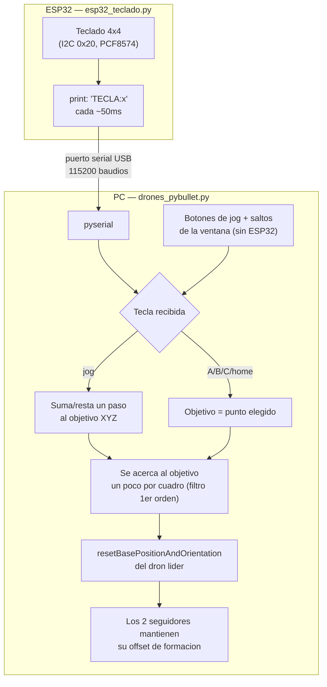

# Punto a) Drones: mover entre 3 puntos A, B y C

Basado en la idea de [gym-pybullet-drones](https://github.com/utiasDSL/gym-pybullet-drones) (ver `enunciado-actividad.png`): mover un dron entre los puntos A, B y C, controlado desde el ESP32. En vez de usar esa librería completa (que trae de dependencia `gymnasium` y `stable-baselines3`, pensadas para entrenar redes neuronales de control de vuelo, no para un mando manual), el dron es un cuerpo **cinemático**: su posición se fija directamente cada cuadro (sin motor de físicas de vuelo real), que alcanza de sobra para lo que pide el taller — la consola de mandos desde el ESP32, no un simulador aerodinámico.

## Qué es un dron cinemático y por qué no hace falta un modelo de vuelo real

Un dron real vuela regulando la velocidad de sus 4 hélices para generar el empuje y los torques que lo mueven en las 3 direcciones y lo rotan — eso es lo que simula gym-pybullet-drones con todo detalle (útil para *entrenar* un controlador de vuelo). Acá el objetivo es otro: que el teclado mueva un dron de forma fluida y reconocible, así que en vez de calcular fuerzas y torques, `drones_pybullet.py` simplemente le dice a PyBullet "el dron está en esta posición ahora" (`resetBasePositionAndOrientation`) en cada cuadro, acercándose un poco a la vez a un "objetivo" que el teclado va moviendo — un filtro de primer orden, la misma idea que un promedio móvil, que da un movimiento suave en vez de saltos bruscos.

## La idea general

Un solo teclado matricial 4x4 controla todo (ver `../esp32_teclado.py`, el mismo firmware que usa `punto-b-brazo-tipo-baxter`): esta es la **configuración de drones**, con este mapeo de teclas:

| Tecla | Efecto |
|---|---|
| `8` / `2` | Adelante / atrás (Y+ / Y-) |
| `4` / `6` | Izquierda / derecha (X- / X+) |
| `9` / `7` | Subir / bajar (Z+ / Z-) |
| `5` | Detener (congela el objetivo en la posición actual) |
| `A` / `B` / `C` | Volar directo al punto A / B / C |
| `D` | Volver al origen (home) |
| `*` / `#` | Despegar / aterrizar |
| `0`, `1`, `3` | Sin uso en esta configuración |

Los otros 2 drones (más chicos, azules) siguen al líder manteniendo un offset fijo de formación — no se controlan por separado, es la manera simple de que "los drones" (plural, como pide el enunciado) se muevan juntos con un solo control.

## Conexiones (paso a paso)

Solo el teclado matricial va al ESP32 — no hace falta ningún otro sensor:

1. **Teclado matricial 4x4 → expansor I2C PCF8574 → ESP32** (dirección `0x20` de fábrica): `VCC`→`3V3`, `GND`→`GND`, `SDA`→`GPIO21`, `SCL`→`GPIO22`.
2. **ESP32 → PC**: un solo cable USB. Revisar en el Administrador de dispositivos qué puerto COM le asigna Windows y ponerlo en `PUERTO_SERIAL` dentro de `drones_pybullet.py`.

## Cómo probarlo

**Sin ESP32 conectado:**
1. Activar el entorno (en la carpeta del taller): `..\entorno\Scripts\activate` (ya trae `pybullet` y `pyserial`).
2. `python drones_pybullet.py`. Al no encontrar el ESP32, la ventana de PyBullet se abre igual con los mismos botones (jog + saltos a A/B/C/home/despegar/aterrizar).

**Con ESP32 conectado:**
1. Guardar `../esp32_teclado.py` como `main.py` en el ESP32 y armar las conexiones de arriba.
2. Ajustar `PUERTO_SERIAL` en `drones_pybullet.py` según el puerto COM del paso 2 de conexiones.
3. `python drones_pybullet.py`. El teclado mueve el dron líder en tiempo real; los otros dos lo siguen en formación.

## Pendiente

Se hicieron pruebas adicionales de la comunicación serial antes del montaje físico. Fotos del montaje y video de la demo — se agregan aquí antes de subir el tema al repositorio.
