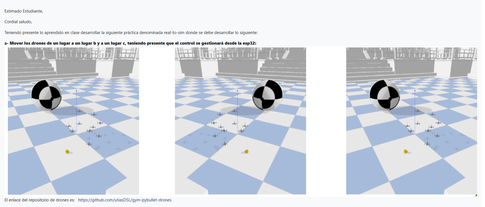
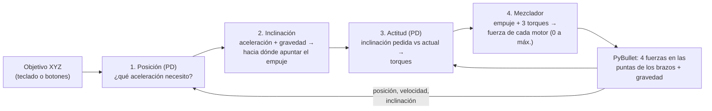
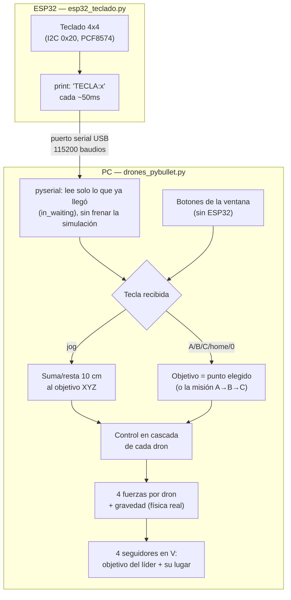

# Punto a) Drones: mover entre 3 puntos A, B y C

Basado en [gym-pybullet-drones](https://github.com/utiasDSL/gym-pybullet-drones): mover los drones de un lugar A a un lugar B y a un lugar C, con el control gestionado desde el ESP32. No usamos esa librería completa (trae `gymnasium` y `stable-baselines3`, pensadas para *entrenar* controladores con redes neuronales), pero sí su idea central: **cada dron vuela con física real**, sostenido y movido solo por el empuje de sus 4 motores.

## Qué es un cuadricóptero y cómo vuela

Un cuadricóptero no tiene timón ni ruedas: lo único que puede hacer es cambiar cuánto empuja cada una de sus 4 hélices. Con eso le alcanza para todo:

- **Subir o bajar**: los 4 motores empujan más o menos a la vez. Para quedarse quieto en el aire, entre los 4 tienen que igualar su peso (0,35 kg × 9,81 = 3,4 N, unos 0,86 N cada uno).
- **Inclinarse**: si los motores de un lado empujan más que los del otro, el dron rota. Y como el empuje sale perpendicular a las hélices, al inclinarse una parte de ese empuje lo **lleva hacia ese lado**. Un dron no puede moverse de costado sin inclinarse: por eso se ve "agacharse" hacia donde va, frenar inclinándose al revés y pasarse un poco antes de quedar quieto.
- **Girar sobre sí mismo (yaw)**: las hélices giran alternadas, dos en un sentido y dos en el otro, y cada una "tuerce" el cuerpo al revés de su giro. Acelerando un par y frenando el otro, el dron gira sin inclinarse.

En `drones_pybullet.py` cada dron es un cuerpo con masa, inercia y gravedad, y en **cada paso de la simulación** se le aplica la fuerza de cada motor en la punta de su brazo (`applyExternalForce`), igual que en gym-pybullet-drones. Nada lo "teletransporta": si el control estuviera mal, se caería.

## El control en cascada

Para decidir cuánto empuja cada motor, el control va de afuera hacia adentro, cada etapa más rápida que la anterior:

```mermaid
flowchart LR
    O["Objetivo XYZ<br/>(teclado o botones)"] --> P["1. Posición (PD)<br/>¿qué aceleración necesito?"]
    P --> I["2. Inclinación<br/>aceleración + gravedad →<br/>hacia dónde apuntar el empuje"]
    I --> A["3. Actitud (PD)<br/>inclinación pedida vs actual →<br/>torques"]
    A --> M["4. Mezclador<br/>empuje + 3 torques →<br/>fuerza de cada motor (0 a máx.)"]
    M --> F["PyBullet: 4 fuerzas en las<br/>puntas de los brazos + gravedad"]
    F -->|"posición, velocidad,<br/>inclinación"| P
    F --> A
```

Un **PD** (proporcional-derivativo) es como un resorte con amortiguador: empuja más cuanto más lejos está del objetivo (P) y frena según la velocidad (D) para no pasarse demasiado. El lazo de actitud es unas 8 veces más rápido que el de posición: si no, el dron no alcanzaría a inclinarse antes de que la posición le pidiera otra cosa, y oscilaría.

## La idea general

Un solo teclado matricial 4x4 controla todo (ver `../esp32_teclado.py`, el mismo firmware que usa `punto-b-brazo-tipo-baxter`): esta es la **configuración de drones**, con este mapeo de teclas:

| Tecla | Efecto |
|---|---|
| `8` / `2` | Adelante / atrás (Y+ / Y-) |
| `4` / `6` | Izquierda / derecha (X- / X+) |
| `9` / `7` | Subir / bajar (Z+ / Z-) |
| `5` | Detener (congela el objetivo en la posición actual) |
| `A` / `B` / `C` | Volar directo al punto A / B / C |
| `D` | Volver al origen (home) |
| `*` / `#` | Despegar / aterrizar (al tocar el piso apaga los motores) |
| `0` | **Misión automática A → B → C** (lo que pide el enunciado, de una: pasa al siguiente punto al llegar) |
| `1`, `3` | Sin uso en esta configuración |

Son **5 drones**, como el enjambre del enunciado: el líder (rojo) y 4 azules en V detrás de él. Cada uno tiene su propio controlador y sus propios motores; los azules persiguen el objetivo del líder más su lugar en la formación (no la posición del líder, para que la V no se deforme cuando el líder se inclina o se pasa).

```mermaid
flowchart TD
    subgraph ESP["ESP32 — esp32_teclado.py"]
        Teclado["Teclado 4x4<br/>(I2C 0x20, PCF8574)"] --> Envia["print: 'TECLA:x'<br/>cada ~50ms"]
    end

    Envia -->|"puerto serial USB<br/>115200 baudios"| Recibe

    subgraph PC["PC — drones_pybullet.py"]
        Recibe["pyserial: lee solo lo que ya llegó<br/>(in_waiting), sin frenar la simulación"] --> Interpreta{"Tecla recibida"}
        Botones["Botones de la ventana<br/>(sin ESP32)"] --> Interpreta
        Interpreta -->|"jog"| Objetivo["Suma/resta 10 cm<br/>al objetivo XYZ"]
        Interpreta -->|"A/B/C/home/0"| ObjetivoDirecto["Objetivo = punto elegido<br/>(o la misión A→B→C)"]
        Objetivo --> Control["Control en cascada<br/>de cada dron"]
        ObjetivoDirecto --> Control
        Control --> Motores["4 fuerzas por dron<br/>+ gravedad (física real)"]
        Motores --> Seguidores["4 seguidores en V:<br/>objetivo del líder + su lugar"]
    end
```

## Conexiones (paso a paso)

Solo el teclado matricial va al ESP32 — no hace falta ningún otro sensor:

1. **Teclado matricial 4x4 → expansor I2C PCF8574 → ESP32** (dirección `0x20` de fábrica): `VCC`→`3V3`, `GND`→`GND`, `SDA`→`GPIO21`, `SCL`→`GPIO22`.
2. **ESP32 → PC**: un solo cable USB. Revisar en el Administrador de dispositivos qué puerto COM le asigna Windows y pasarlo con `--puerto` (por defecto `COM7`).

## Cómo probarlo

**Sin ESP32 conectado:**
1. Activar el entorno (en la carpeta del taller): `..\entorno\Scripts\activate` (ya trae `pybullet` y `pyserial`).
2. `python drones_pybullet.py`. Al no encontrar el ESP32, la ventana de PyBullet se abre igual con los mismos botones (jog, saltos a A/B/C/home, despegar/aterrizar y "Misión A → B → C"). Arriba se ve la posición del líder, su objetivo y la última línea cruda que llegó por el serial.
3. Prueba sin ventana: `python drones_pybullet.py --prueba` despega, vuela la misión A → B → C y dice en cuánto llegó a cada punto y cuánto se inclinó (en nuestras pruebas: A a los 1,2 s, B a los 2,9 s, C a los 4,9 s, inclinación máxima de unos 33°).

**Con ESP32 conectado:**
1. Guardar `../esp32_teclado.py` como `main.py` en el ESP32 y armar las conexiones de arriba.
2. `python drones_pybullet.py --puerto COM7` (el puerto COM del paso 2 de conexiones).
3. El teclado manda `TECLA:x` y el líder va hacia donde se le pide, inclinándose; los otros cuatro lo siguen en formación. Si "no llega nada", mirar la línea cruda de arriba de la ventana: si nunca cambia, el ESP32 no está mandando (revisar el puerto y cerrar Thonny).

## Pendiente

Se hicieron pruebas adicionales de la comunicación serial antes del montaje físico. Fotos del montaje y video de la demo: se agregan aquí cuando estén.
