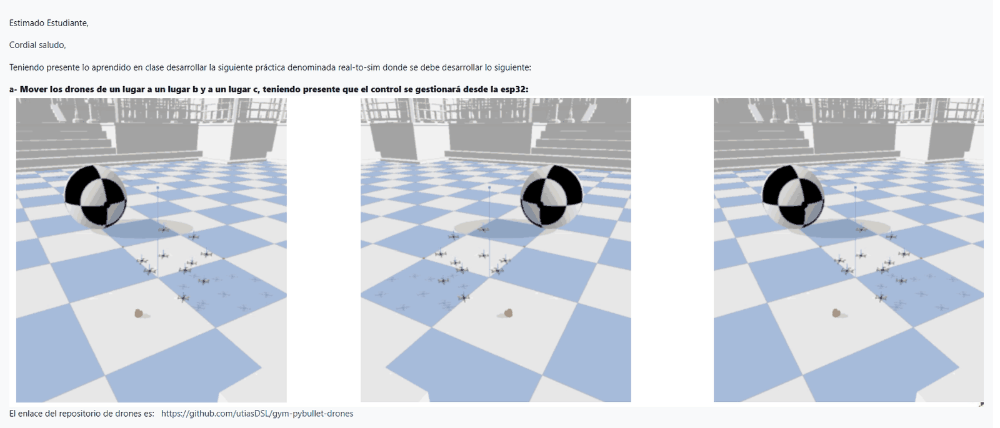
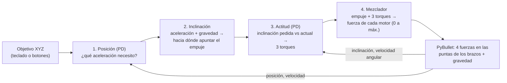
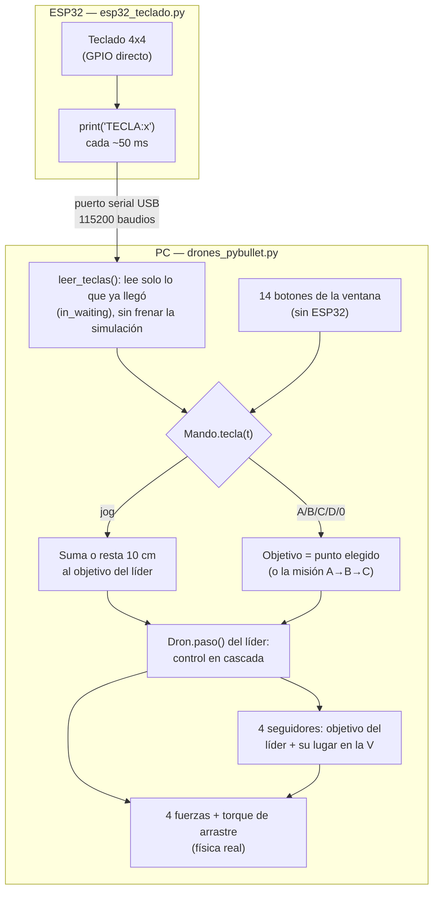
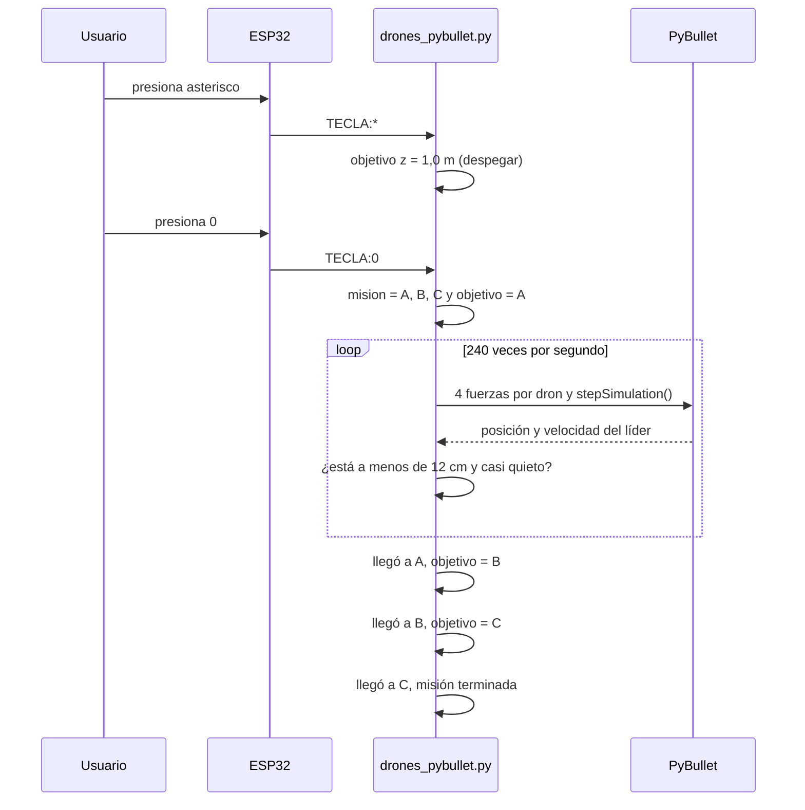
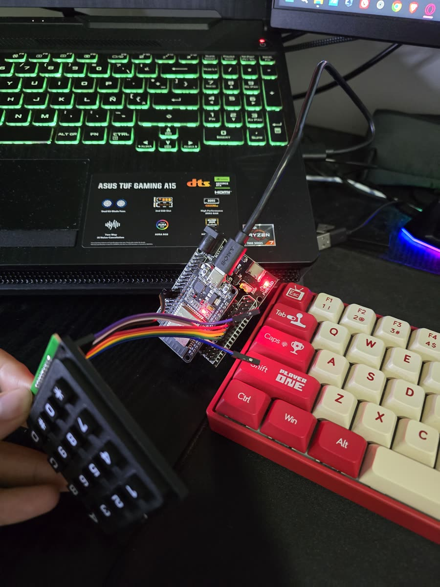
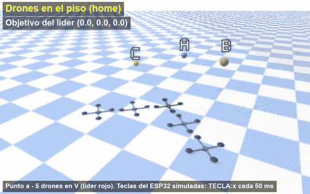

# Punto a) Drones: mover entre 3 puntos A, B y C

> **¿Quiere probarlo?** Doble clic en [`ABRIR.bat`](../ABRIR.bat) (carpeta del tema 9) → paso **a) Drones** de la app: la prueba rápida dibuja en la app la ruta A → B → C del líder a partir de lo que imprime la simulación. **¿Quiere saber cómo funciona?** Aquí está todo: [qué es un waypoint](#qué-es-un-waypoint) · [cómo vuela un cuadricóptero](#qué-es-un-cuadricóptero-y-cómo-vuela) · [control PD](#qué-es-un-control-pd) · [cascada](#qué-es-el-control-en-cascada) · [mezclador](#qué-es-el-mezclador) · [idea general](#la-idea-general) · [el código paso a paso](#la-lógica-del-código-paso-a-paso) · [lo que probamos](#lo-que-probamos-y-descartamos) · [cómo probarlo a mano](#cómo-probarlo).

Basado en [gym-pybullet-drones](https://github.com/utiasDSL/gym-pybullet-drones). El enunciado pide mover los drones de un lugar A a un lugar B y a un lugar C, con el control gestionado desde el ESP32:



## Qué pedía y qué hicimos

Las imágenes del enunciado muestran un enjambre de drones que va cambiando de posición. Lo que hicimos: **cinco drones** (un líder rojo y cuatro azules en formación en V detrás de él) que vuelan con **física real** entre tres waypoints fijos, A, B y C, manejados con el teclado matricial del ESP32. Se pueden mover a mano (jog en X, Y y Z), mandar directo a un punto, volver al origen, despegar y aterrizar, o lanzar con una sola tecla la **misión automática A → B → C**, que es literalmente lo que pide el enunciado.

"Física real" quiere decir que a ningún dron se le fija la posición: cada uno es un cuerpo con masa (0,35 kg), inercia y gravedad, y lo único que lo sostiene y lo mueve es la fuerza de sus 4 motores, calculada en cada paso de la simulación por un control en cascada. Si el control estuviera mal, el dron se caería.

El script trae una prueba sin ventana (`--prueba`) que despega, vuela la misión y la mide. En nuestra última corrida:

```
Llego a A a los 1.2 s de empezar la mision
Llego a B a los 2.9 s de empezar la mision
Llego a C a los 4.9 s de empezar la mision
{'llegadas': [('A', 1.2), ('B', 2.9), ('C', 4.9)], 'inclinacion_max_grados': 32.8, 'posicion_final': [-1.225, 0.391, 0.894]}
PRUEBA OK
```

La inclinación máxima (32,8°) es la de los cinco drones juntos, y pasa un poco del límite que se le pide al controlador (30°) porque el cuerpo tarda un instante en frenar su giro; la prueba falla si pasa de 35°.

No usamos gym-pybullet-drones completo porque trae `gymnasium` y `stable-baselines3`, que sirven para *entrenar* controladores con redes neuronales y no hacen falta acá. Sí tomamos su idea central (un cuerpo por dron, la fuerza de cada motor aplicada en la punta de su brazo en cada paso) y el esquema de su controlador PID en cascada.

## Qué es un waypoint

Un **waypoint** es un punto de paso: una coordenada XYZ a la que algo tiene que llegar, sin importar el camino exacto que siga para hacerlo. Es como darle a un taxista una lista de direcciones: él decide por qué calles ir. Acá el dron no sigue una trayectoria dibujada; se le dice "tu objetivo ahora es B" y el controlador se encarga de llevarlo. Los tres waypoints del enunciado están en el diccionario `PUNTOS` del script:

| Punto | X (m) | Y (m) | Z (m) |
|---|---|---|---|
| A | 0,0 | 0,9 | 1,2 |
| B | 1,4 | −0,6 | 1,6 |
| C | −1,3 | 0,4 | 0,9 |
| Origen (home) | 0,0 | 0,0 | 0,03 (en el piso) |

Los elegimos a distintas alturas y a lados opuestos para que el recorrido A → B → C obligue a moverse en los tres ejes. En la ventana se ven como esferas semitransparentes con su letra encima, y el líder va dejando un trazo amarillo por donde pasa (se borra cada vez que se elige un punto nuevo).

## Qué es un cuadricóptero y cómo vuela

Un cuadricóptero no tiene timón ni ruedas: lo único que puede hacer es cambiar cuánto empuja cada una de sus 4 hélices. Con eso le alcanza para todo:

- **Subir o bajar**: los 4 motores empujan más o menos a la vez. Para quedarse quieto en el aire, entre los 4 tienen que igualar su peso: 0,35 kg × 9,81 m/s² = 3,4 N, unos 0,86 N cada uno. El máximo de cada motor en el script es `F_MAX` = 2,15 N, una relación empuje/peso de 2,5, típica de un dron de hobby.
- **Inclinarse**: si los motores de un lado empujan más que los del otro, el dron rota. Y como el empuje sale perpendicular a las hélices, al inclinarse una parte de ese empuje lo **lleva hacia ese lado**. Un dron no puede moverse de costado sin inclinarse: por eso en la simulación se ve "agacharse" hacia donde va, frenar inclinándose al revés y pasarse un poco antes de quedar quieto.
- **Girar sobre sí mismo (yaw)**: las hélices giran alternadas, dos en un sentido y dos en el otro, y cada una "tuerce" el cuerpo al revés de su giro (arrastre del aire). En vuelo quieto esos torques se anulan; acelerando un par y frenando el otro, el dron gira sin inclinarse.

Nuestro dron está en configuración X, visto desde arriba (+x es "adelante"):

| Motor | Posición (m) | Sentido de giro (`GIRO`) |
|---|---|---|
| 1 | (+0,24; +0,24) adelante-izquierda | +1 |
| 2 | (−0,24; +0,24) atrás-izquierda | −1 |
| 3 | (−0,24; −0,24) atrás-derecha | +1 |
| 4 | (+0,24; −0,24) adelante-derecha | −1 |

## Qué es un control PD

Un controlador tiene que decidir cuánto empujar a partir de dos cosas: qué tan lejos está del objetivo (el **error**) y qué tan rápido se está moviendo. Un **PD** (proporcional-derivativo) hace exactamente eso:

```
aceleración pedida = Kp · (objetivo − posición) − Kd · velocidad
```

La parte **P** funciona como un resorte: cuanto más lejos, más fuerte empuja hacia el objetivo. La parte **D** funciona como un amortiguador: frena en proporción a la velocidad, para que no llegue disparado y se pase. Con solo P, el dron oscilaría para siempre alrededor del punto; con P y D, llega, se pasa un poco y se queda. (Un PID agrega una parte I que corrige errores que se quedan pegados en el tiempo, como un viento constante; acá no hay viento ni errores de modelo, así que no hizo falta.)

## Qué es el control en cascada

Un dron no puede "empujarse hacia B" directamente: tiene que inclinarse primero, y para inclinarse tiene que repartir el empuje entre sus motores. Por eso el control se arma en capas, de afuera hacia adentro, cada una resolviendo un problema más simple y cada una más rápida que la anterior:


```mermaid
flowchart LR
    O["Objetivo XYZ<br/>(teclado o botones)"] --> P["1. Posición (PD)<br/>¿qué aceleración necesito?"]
    P --> I["2. Inclinación<br/>aceleración + gravedad →<br/>hacia dónde apuntar el empuje"]
    I --> A["3. Actitud (PD)<br/>inclinación pedida vs actual →<br/>3 torques"]
    A --> M["4. Mezclador<br/>empuje + 3 torques →<br/>fuerza de cada motor (0 a máx.)"]
    M --> F["PyBullet: 4 fuerzas en las<br/>puntas de los brazos + gravedad"]
    F -->|"posición, velocidad"| P
    F -->|"inclinación, velocidad angular"| A
```

La regla de oro del control en cascada es que **el lazo de adentro tiene que ser mucho más rápido que el de afuera**. Si no, cuando la posición le pide al dron "inclínate 20°", el dron todavía no alcanzó a inclinarse y la posición ya le está pidiendo otra cosa, y el conjunto oscila. Con las ganancias del script, el lazo de posición tiene una frecuencia natural de unos 2,5 rad/s (√6) y el de actitud de 20 rad/s: unas 8 veces más rápido.

## Qué es el mezclador

El mezclador es la última etapa: recibe lo que pidieron las etapas anteriores (un empuje total y tres torques, uno por eje) y lo convierte en la fuerza de cada uno de los 4 motores. Un motor en la posición (x, y) que empuja f produce un torque y·f sobre el eje x, −x·f sobre el eje y, y un torque de arrastre `KM_KF`·f sobre el eje z según su sentido de giro. Como las cuatro combinaciones de signos (+,+), (−,+), (−,−), (+,−) son ortogonales entre sí, el sistema se invierte simplemente sumando, sin resolver ninguna ecuación:

```python
f = empuje / 4 + tx * y / (4 * BRAZO ** 2) - ty * x / (4 * BRAZO ** 2) + tz * s / (4 * KM_KF)
fuerzas.append(max(0.0, min(F_MAX, f)))
```

El recorte entre 0 y `F_MAX` es físico: una hélice solo puede empujar hacia arriba (no puede "tirar" del dron hacia abajo) y tiene un máximo.

## La idea general

Un solo teclado matricial controla todo (el firmware común está explicado en el [README del taller](../README.md)); esta es la **configuración de drones**:

| Tecla | Efecto |
|---|---|
| `8` / `2` | Objetivo adelante / atrás (Y+ / Y−), 10 cm por línea recibida |
| `4` / `6` | Objetivo izquierda / derecha (X− / X+) |
| `9` / `7` | Subir / bajar (Z+ / Z−); bajar nunca pasa de la altura del piso |
| `5` | Detener: el objetivo pasa a ser la posición actual del líder |
| `A` / `B` / `C` | Volar directo al punto A / B / C |
| `D` | Volver al origen (aterriza ahí) |
| `*` / `#` | Despegar a 1 m / aterrizar (al tocar el piso se apagan los motores) |
| `0` | **Misión automática A → B → C**: pasa al siguiente punto al llegar a cada uno |
| `1`, `3` | Sin uso en esta configuración |

El líder va al objetivo; los cuatro azules persiguen **el objetivo del líder más su lugar en la V**, no la posición del líder. Si persiguieran la posición del líder, cada vez que él se inclina o se pasa un poco, la formación se deformaría en cadena.


```mermaid
flowchart TD
    subgraph ESP["ESP32 — esp32_teclado.py"]
        Teclado["Teclado 4x4<br/>(GPIO directo)"] --> Envia["print('TECLA:x')<br/>cada ~50 ms"]
    end

    Envia -->|"puerto serial USB<br/>115200 baudios"| Recibe

    subgraph PC["PC — drones_pybullet.py"]
        Recibe["leer_teclas(): lee solo lo que ya llegó<br/>(in_waiting), sin frenar la simulación"] --> Interpreta{"Mando.tecla(t)"}
        Botones["14 botones de la ventana<br/>(sin ESP32)"] --> Interpreta
        Interpreta -->|"jog"| Objetivo["Suma o resta 10 cm<br/>al objetivo del líder"]
        Interpreta -->|"A/B/C/D/0"| ObjetivoDirecto["Objetivo = punto elegido<br/>(o la misión A→B→C)"]
        Objetivo --> Control["Dron.paso() del líder:<br/>control en cascada"]
        ObjetivoDirecto --> Control
        Control --> Motores["4 fuerzas + torque de arrastre<br/>(física real)"]
        Control --> Seguidores["4 seguidores: objetivo del<br/>líder + su lugar en la V"]
        Seguidores --> Motores
    end
```

Así se ve la misión automática de principio a fin:


```mermaid
sequenceDiagram
    participant U as Usuario
    participant E as ESP32
    participant P as drones_pybullet.py
    participant S as PyBullet
    U->>E: presiona asterisco
    E->>P: TECLA:*
    P->>P: objetivo z = 1,0 m (despegar)
    U->>E: presiona 0
    E->>P: TECLA:0
    P->>P: mision = A, B, C y objetivo = A
    loop 240 veces por segundo
        P->>S: 4 fuerzas por dron y stepSimulation()
        S-->>P: posición y velocidad del líder
        P->>P: ¿está a menos de 12 cm y casi quieto?
    end
    P->>P: llegó a A, objetivo = B
    P->>P: llegó a B, objetivo = C
    P->>P: llegó a C, misión terminada
```

## Conexiones

Solo el teclado matricial va al ESP32, conectado directo a 8 GPIO: filas en `GPIO14`, `GPIO27`, `GPIO26` y `GPIO25`; columnas en `GPIO33`, `GPIO32`, `GPIO18` y `GPIO19`, con la pull-up interna del ESP32. La tabla pin a pin (qué fila y qué columna del teclado va a qué pin) está en el [README del taller](../README.md#conexiones), porque es la misma para los tres puntos. El ESP32 va al PC por un solo cable USB; el puerto COM se pasa con `--puerto` (por defecto `COM7`).

## Qué hace cada archivo

- **`drones_pybullet.py`**: todo el punto a). Crea el mundo, carga los 5 drones, tiene el controlador de cada uno (`Dron`), lo que hace cada tecla (`Mando`), la lectura del serial (`leer_teclas`) y el bucle principal (`volar`). Se corre con ventana (`python drones_pybullet.py`, opcionalmente `--puerto COM5`, o `--mision` para que arranque volando la misión) o sin ventana como prueba automática (`--prueba`).
- **`dron.urdf`**: la descripción del dron. Es un solo link (no tiene articulaciones: las hélices no giran de verdad en la simulación, su efecto está en las fuerzas que aplica el script). Tiene la parte visual (cuerpo rojo de 10 cm, 4 brazos en X, motores y discos de hélice semitransparentes), una caja de colisión chata de 56 × 56 × 4 cm para que se apoye en el piso y los drones no se atraviesen entre sí, y la parte inercial: 0,35 kg e inercias `ixx = iyy = 0,0045`, `izz = 0,0085` kg·m² (aproximadas como un cuerpo central más 4 masas en las puntas).
- **`../esp32_teclado.py`**: el firmware común del ESP32 (ver el README del taller).
- **`img/enunciado-actividad.png`**: la captura del enunciado de este punto.
- **`video/`**: la misión A → B → C grabada (`drones-mision.gif`: la grabación completa, se ve directo en GitHub y en la app).

## La lógica del código paso a paso

### 1. Crear el mundo (`crear_mundo`)

Conecta PyBullet en modo `GUI` (o `DIRECT` para la prueba), pone la gravedad en −9,81 y el paso de física en 1/240 s, carga el piso y las tres esferas de los waypoints, y después los drones: el líder en el origen y los cuatro seguidores en sus lugares de la V (`OFFSET_SEGUIDORES`, separados 0,7 m en X y 0,6 m hacia atrás por fila, más que el ancho de un dron, 0,56 m, para que no se toquen ni al inclinarse). A los seguidores se les cambia el color a azul con `changeVisualShape`. El URDF se carga con ruta absoluta, porque PyBullet busca las rutas relativas desde la carpeta desde donde se corrió el comando, no desde la del script.

### 2. El controlador de cada dron (`Dron.paso`)

Se llama **en cada paso de física, para cada dron**. Esto es obligatorio: PyBullet borra las fuerzas externas después de cada `stepSimulation()`, así que si en un paso no se aplican, ese paso el dron cae libre. Las cuatro etapas del control en cascada, en el código:

**Posición → aceleración pedida (PD), recortada** para limitar cuánto se inclina y qué tan rápido sube:
```python
ax = _recortar(KP_POS * (self.objetivo[0] - pos[0]) - KD_POS * vel[0], ACC_MAX_XY)
az = _recortar(KP_ALT * (self.objetivo[2] - pos[2]) - KD_ALT * vel[2], ACC_MAX_Z)
```

**Aceleración → inclinación y empuje.** La fuerza total que hace falta es masa × (aceleración pedida + la que anula la gravedad). Se pasa al marco del dron girado solo en yaw (para saber si inclinarse hacia su adelante o hacia su costado) y de ahí salen los ángulos: inclinarse en +pitch lleva el empuje hacia +x del dron, y en +roll hacia −y. El empuje total es la parte de esa fuerza que cae sobre el eje z *real* del dron: si está más inclinado de lo pedido, empuja menos y no se dispara hacia arriba.
```python
pitch_des = _recortar(math.atan2(fx_d, fz), INCLINACION_MAX)
roll_des = _recortar(math.atan2(-fy_d, fz), INCLINACION_MAX)
empuje = max(0.0, fx * z_dron[0] + fy * z_dron[1] + fz * z_dron[2])
```

**Actitud → torques (otro PD).** La velocidad angular que devuelve PyBullet viene en el marco del mundo; se pasa al del dron multiplicando por la transpuesta de la matriz de rotación. El yaw siempre se lleva a 0 (el dron mirando hacia +x).
```python
tx = KP_ATT * (roll_des - roll) - KD_ATT * w[0]
ty = KP_ATT * (pitch_des - pitch) - KD_ATT * w[1]
tz = KP_YAW * err_yaw - KD_YAW * w[2]
```

**Mezclador → 4 motores**, y cada fuerza se aplica en la punta de su brazo en el marco del propio dron (`LINK_FRAME`), así que se inclina con él y el torque sale de la geometría, igual que en uno real. El arrastre de las hélices va aparte como un torque en z:
```python
for (x, y), f in zip(MOTORES, fuerzas):
    p.applyExternalForce(self.id, -1, [0, 0, f], [x, y, 0], p.LINK_FRAME)
p.applyExternalTorque(self.id, -1, [0, 0, KM_KF * sum(f * s for f, s in zip(fuerzas, GIRO))], p.LINK_FRAME)
```

**Aterrizaje.** Si el objetivo está en el piso y el dron ya está a menos de 5 cm de altura y casi sin velocidad vertical, `paso()` devuelve sin aplicar fuerzas: los motores se apagan y el dron se apoya con su peso. Sin esto, el controlador lo mantenía flotando a ras del piso. Al pedirle subir otra vez, los motores vuelven a prenderse solos.

Las ganancias, todas al principio del script:

| Constante | Valor | Qué controla |
|---|---|---|
| `KP_POS`, `KD_POS` | 6,0 / 4,0 | PD de posición en X e Y |
| `KP_ALT`, `KD_ALT` | 8,0 / 5,0 | PD de altura (un poco más firme que X e Y) |
| `ACC_MAX_XY`, `ACC_MAX_Z` | 4,0 m/s² | recorte de la aceleración pedida (en X e Y equivale a unos 22° de inclinación) |
| `INCLINACION_MAX` | 30° | inclinación máxima que se le pide a la actitud |
| `KP_ATT`, `KD_ATT` | 1,8 / 0,162 | PD de roll y pitch, calculados como `I·20²` y `2·0,9·I·20` con `I = 0,0045`: 20 rad/s y amortiguamiento 0,9 |
| `KP_YAW`, `KD_YAW` | 0,02 / 0,01 | PD del giro sobre z |
| `KM_KF` | 0,025 | torque de arrastre por newton de empuje (del orden del Crazyflie de gym-pybullet-drones) |

Las de actitud no salieron de probar al azar: con la inercia del dron y la frecuencia que queríamos (20 rad/s, bastante más rápida que la posición) se despejan Kp y Kd de la fórmula de un sistema de segundo orden.

### 3. Lo que hace cada tecla (`Mando`)

`Mando.tecla(t)` solo cambia el **objetivo** del líder: suma o resta `PASO_JOG` (10 cm) en el jog, lo reemplaza por un waypoint con `A`/`B`/`C`, por el origen con `D`, por la posición actual con `5`, o solo cambia la altura con `*` (1 m) y `#` (piso). Cualquier tecla distinta de `0` cancela la misión en curso. `0` carga la lista `["A", "B", "C"]` y pone el objetivo en A.

`Mando.avanzar_mision(pos, vel)` se revisa en cada paso: cuando el líder está a menos de 12 cm del punto y se mueve a menos de 0,3 m/s, lo da por alcanzado, lo saca de la lista y pone el siguiente como objetivo. Exigir "casi quieto" además de "cerca" evita que cuente como llegada un paso rápido por encima del punto.

En este punto no hace falta separar teclas de jog y de un solo golpe (como sí en Baxter y Atlas): todas las que no son jog fijan un objetivo, y recibir `TECLA:A` cuatro veces seguidas deja el mismo objetivo que recibirla una.

### 4. Leer el serial sin frenar la simulación (`leer_teclas`)

El puerto se abre con `timeout=0` (una lectura nunca espera) y la función solo lee si ya hay bytes esperando. Lee todo lo que haya de una vez, lo corta por saltos de línea y guarda el último pedazo, que puede venir cortado a la mitad, para completarlo en la vuelta siguiente:

```python
if ser is None or not ser.in_waiting:
    return teclas, cruda, buffer
buffer += ser.read(ser.in_waiting).decode(errors="ignore")
*lineas, buffer = buffer.split("\n")
for linea in lineas:
    ...
    if linea.startswith("TECLA:"):
        teclas.append(linea.split(":", 1)[1][:1])
```

Devuelve la lista de teclas que llegaron y la última línea cruda, que se muestra en la ventana. `TECLA:-` se ignora sola porque `-` no hace nada en `Mando.tecla`.

### 5. El bucle principal (`volar`)

En cada vuelta: lee las teclas del serial y los clicks de los botones (cada botón de PyBullet es un contador que sube con cada click; si cambió, cuenta como una pulsación de su tecla), se las pasa a `Mando`, corre `paso()` del líder y de los cuatro seguidores (con su objetivo actualizado al del líder más su offset), revisa la misión, dibuja el trazo del líder cada 8 pasos (máximo 400 tramos, para no llenar la ventana), actualiza el texto de arriba 10 veces por segundo (posición, objetivo, misión y línea cruda del serial) y avanza la física con `stepSimulation()`. Con ventana duerme 1/240 s por vuelta para ir a velocidad real; en `--prueba` no duerme y la misión se simula en un par de segundos.

## Lo que probamos y descartamos

- **Mover el dron fijando su posición** con `resetBasePositionAndOrientation` en cada cuadro, sin gravedad. Fue la primera versión: funcionaba, pero se veía como un objeto arrastrado por la pantalla, sin inclinarse ni frenar, nada que ver con un dron. La reemplazamos por fuerzas de motor y control en cascada.
- **Seguidores persiguiendo la posición del líder**: la V se deformaba cada vez que el líder se inclinaba o se pasaba. Ahora siguen su objetivo.
- **Dejar los motores prendidos al aterrizar**: el dron quedaba flotando a un par de centímetros del piso. Ahora se apagan al tocarlo.
- **Leer con `readline()` con timeout** dentro del bucle: frenaba toda la simulación a la velocidad de llegada de líneas. Ahora se lee solo lo que ya llegó.

## El montaje y la demo

El montaje es el mismo de los tres puntos: el ESP32 en su placa de expansión, el teclado 4x4 conectado directo a 8 GPIO y un solo cable USB al portátil. Con él se manejaron los drones desde el teclado: `*` para despegar, `0` para la misión y el jog para moverlos a mano.



Así se ve la misión A → B → C: el líder rojo va de punto en punto inclinándose hacia donde va, dejando su trazo amarillo, y los cuatro azules lo siguen en V.



El GIF es la grabación completa (15 s).

## Cómo probarlo

Los comandos van desde la carpeta del taller (`9-taller-segundo-corte\`), usando su entorno.

**Sin ESP32 conectado:**
1. `entorno\Scripts\python punto-a-drones-waypoints\drones_pybullet.py`. En consola sale que no encontró el ESP32 y la ventana de PyBullet abre igual, con 14 botones a la derecha: jog en los tres ejes, Detener, Ir a A / B / C, Home, Despegar, Aterrizar y "Mision A -> B -> C".
2. Lo más rápido para verlo todo: "Despegar" y después "Mision A -> B -> C" (o correr el script con `--mision`, que despega solo y lanza la misión al segundo de abrir la ventana; después se sigue manejando igual). Arriba de la ventana se ve la posición del líder, su objetivo, los puntos que le faltan a la misión y el estado del serial (`sin ESP32`).
3. Prueba sin ventana: `entorno\Scripts\python punto-a-drones-waypoints\drones_pybullet.py --prueba`. Despega, vuela la misión A → B → C, imprime en cuánto llegó a cada punto y la inclinación máxima, y termina con `PRUEBA OK` o `PRUEBA FALLIDA` (falla si no llega a los tres en orden o si se inclina más de 35°).

**Con ESP32 conectado:**
1. Guardar `esp32_teclado.py` (en la carpeta del taller) como `main.py` en el ESP32, armar las conexiones y cerrar Thonny.
2. `entorno\Scripts\python punto-a-drones-waypoints\drones_pybullet.py --puerto COM7`, con el COM que muestre el Administrador de dispositivos.
3. `*` para despegar, `0` para la misión, o mover el líder con `8 2 4 6 9 7` (sosteniendo, se mueve a unos 2 m/s de objetivo: 10 cm por cada línea, 20 líneas por segundo). El líder va hacia donde se le pide, inclinándose, y los otros cuatro lo siguen en formación. Los botones de la ventana siguen funcionando a la par.
4. Si no responde, mirar al final del texto de arriba (`serial: ...`): si se queda en `(nada todavia)`, el ESP32 no está mandando (puerto equivocado o Thonny todavía abierto).
