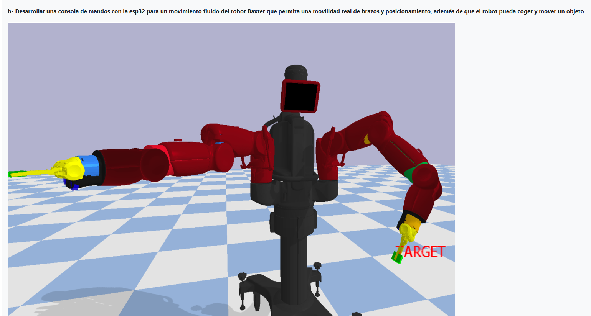
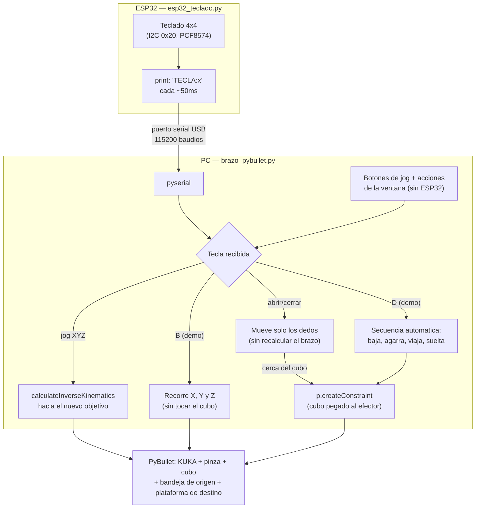

# Punto b) Brazo robótico tipo Baxter: mover, posicionar y coger un objeto

Basado en [baxter_ik_demo.py](https://github.com/erwincoumans/pybullet_robots/blob/master/baxter_ik_demo.py): una consola de mandos con el ESP32 para un movimiento fluido y con posicionamiento real, donde el robot pueda coger y mover un objeto. Por qué el brazo real que se usa acá es un KUKA IIWA + pinza en vez de Baxter (las mallas 3D de Baxter no vienen ni en ese repositorio ni en `pybullet_data`, y agregarlas son ~50 MB fuera de lugar en este repositorio de apuntes) está explicado en el README del taller. El punto c) del enunciado (locomoción con las 4 patas) es un robot y un problema de control distintos — está resuelto aparte, en [`punto-c-locomocion-laikago`](../punto-c-locomocion-laikago).

## Qué es la cinemática inversa (IK) y por qué hace falta para este brazo

A diferencia del brazo de 2 grados de libertad de los temas 7 y 8 (que se movía articulación por articulación, sin poder llegar a cualquier punto XYZ), el KUKA IIWA tiene **7 articulaciones**: suficientes para que su extremo (el efector) alcance prácticamente cualquier posición XYZ dentro de su alcance, con más de una combinación de ángulos posible para llegar ahí (es un brazo "redundante"). `p.calculateInverseKinematics` resuelve ese cálculo: dada una posición XYZ deseada, devuelve los 7 ángulos de articulación que la alcanzan, usando además una pose de referencia (`restPoses`) para preferir, entre todas las soluciones válidas, una parecida a esa — evitando que el brazo se "retuerza" en configuraciones raras para llegar al mismo punto.

## Qué es una restricción cinemática (constraint) al agarrar el cubo

Agarrar el cubo solo con la fricción de la pinza (como hace literalmente `baxter_ik_demo.py`) resultó poco confiable en las pruebas reales de este script: la pinza es liviana y el cubo se escapaba o quedaba mal sujeto apenas el brazo se movía rápido. La solución (la misma que usan muchos tutoriales de *pick-and-place* en PyBullet) es crear una **restricción fija** (`p.createConstraint(..., jointType=p.JOINT_FIXED)`) entre el efector y el cubo en el momento de cerrar la pinza cerca de él — una "soldadura" temporal que lo mantiene pegado a la pinza mientras viaja — y eliminarla (`p.removeConstraint`) al abrir la pinza para soltarlo. La transformación relativa exacta entre efector y cubo se calcula en el instante del agarre (`invertTransform` + `multiplyTransforms`), así que no importa el ángulo exacto con el que llegó la pinza: el cubo queda pegado tal cual estaba, sin "saltar" a una posición asumida de antemano.

## La idea general

Un solo teclado matricial 4x4 controla todo (ver `../esp32_teclado.py`, el mismo firmware que usa `punto-a-drones-waypoints`): esta es la **configuración de brazo**, con este mapeo de teclas:

| Tecla | Efecto |
|---|---|
| `8` / `2` | Adelante / atrás (Y+ / Y-) |
| `4` / `6` | Izquierda / derecha (X- / X+) |
| `9` / `7` | Subir / bajar (Z+ / Z-) |
| `5` | Home (postura neutra) |
| `A` | Abrir pinza |
| `C` | Cerrar pinza (agarra el cubo si está cerca) |
| `D` | Demo automática: coge el cubo y lo mueve al destino |
| `B` | Demo: recorre los 3 ejes (X, Y y Z) para mostrar el rango de movimiento completo |
| `0` | Reset (reubica el cubo, cancela cualquier demo) |
| `1`, `3`, `*`, `#` | Sin uso en esta configuración |

El movimiento manual (jog) lee el puerto serial sin bloquear la simulación (`ser.in_waiting` en vez de esperar a que llegue una línea nueva), así que el brazo se mueve fluido incluso mientras espera datos del ESP32 — antes, esperar la línea siguiente frenaba toda la ventana de PyBullet a los mismos ~20 cuadros por segundo del teclado.

## Conexiones (paso a paso)

Solo el teclado matricial va al ESP32 — no hace falta ningún otro sensor:

1. **Teclado matricial 4x4 → expansor I2C PCF8574 → ESP32** (dirección `0x20` de fábrica): `VCC`→`3V3`, `GND`→`GND`, `SDA`→`GPIO21`, `SCL`→`GPIO22`.
2. **ESP32 → PC**: un solo cable USB. Revisar en el Administrador de dispositivos qué puerto COM le asigna Windows y ponerlo en `PUERTO_SERIAL` dentro de `brazo_pybullet.py`.

## Cómo probarlo

**Sin ESP32 conectado:**
1. Activar el entorno (en la carpeta del taller): `..\entorno\Scripts\activate` (ya trae `pybullet` y `pyserial`).
2. `python brazo_pybullet.py`. Al no encontrar el ESP32, la ventana de PyBullet se abre igual con los mismos botones (jog + abrir/cerrar/home/demo/recorrido/reset).

**Con ESP32 conectado:**
1. Guardar `../esp32_teclado.py` como `main.py` en el ESP32 y armar las conexiones de arriba.
2. Ajustar `PUERTO_SERIAL` en `brazo_pybullet.py` según el puerto COM del paso 2 de conexiones.
3. `python brazo_pybullet.py`. El teclado mueve el efector en tiempo real; `C` cerca del cubo lo agarra, `D` corre la demo de coger y mover, `B` corre la demo que recorre los 3 ejes.

## Pendiente

Se hicieron pruebas adicionales de la comunicación serial antes del montaje físico. Fotos del montaje y video de la demo — se agregan aquí antes de subir el tema al repositorio.
