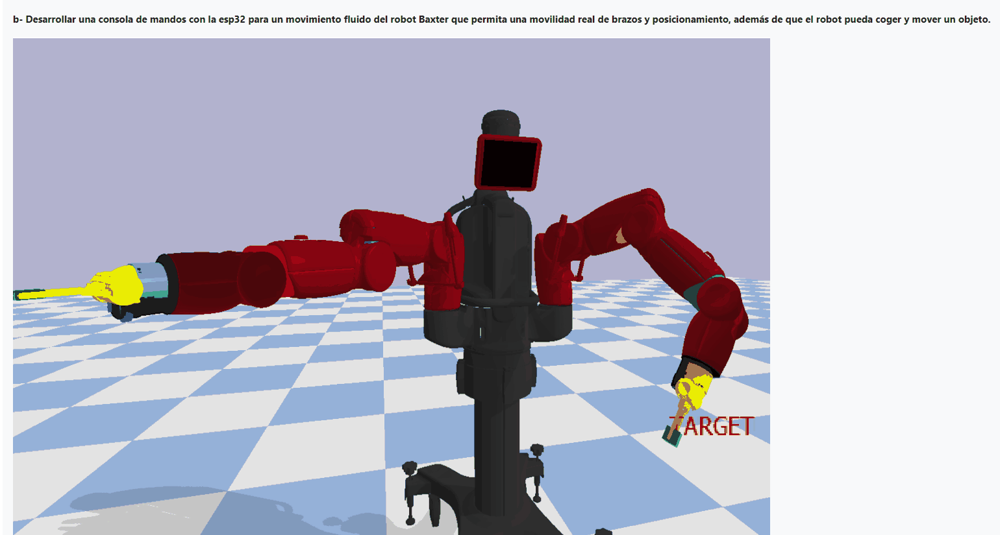
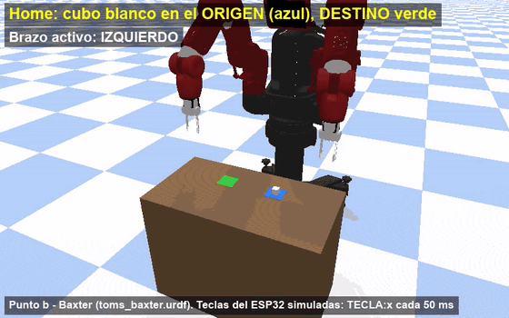
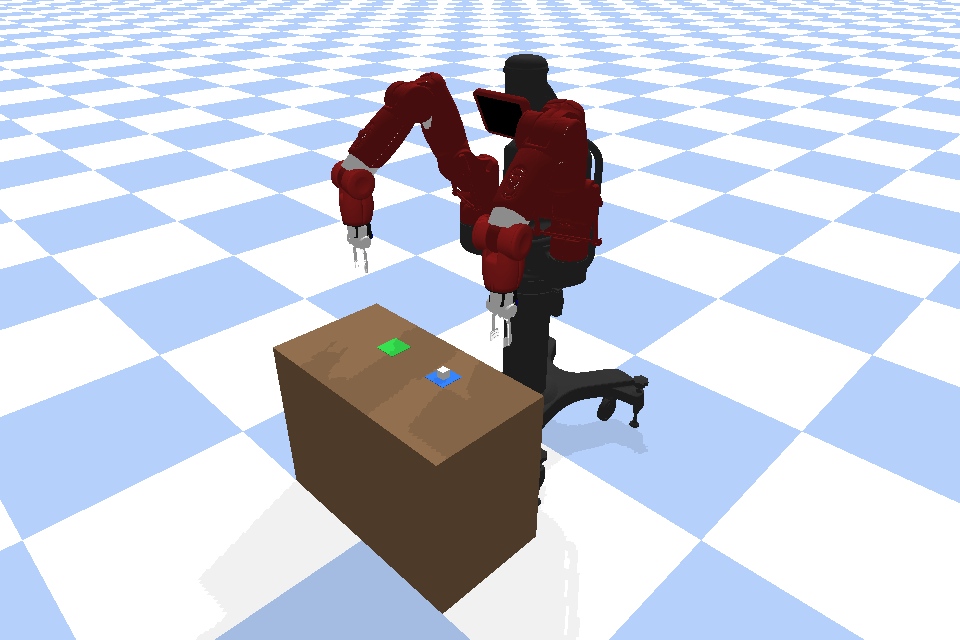
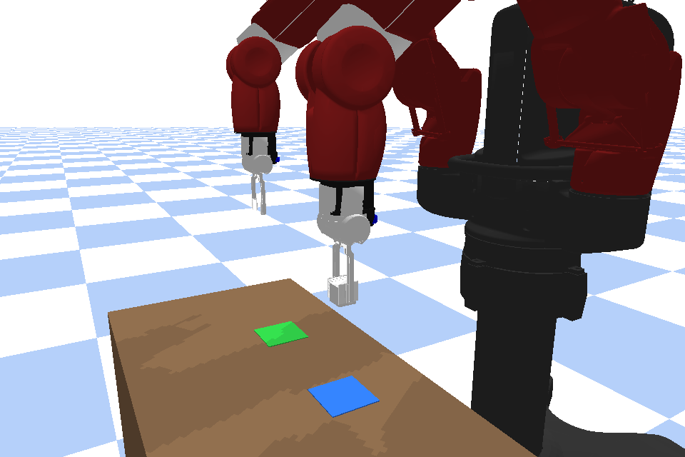
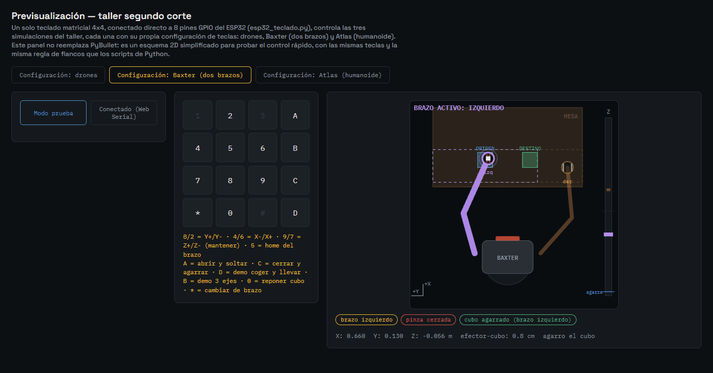
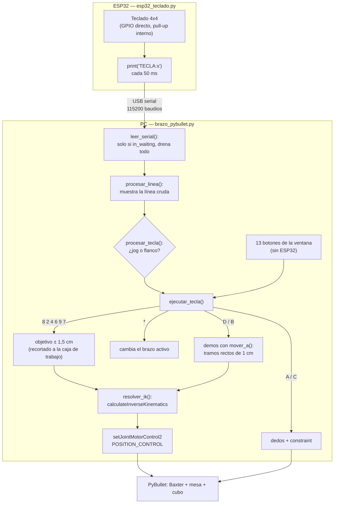
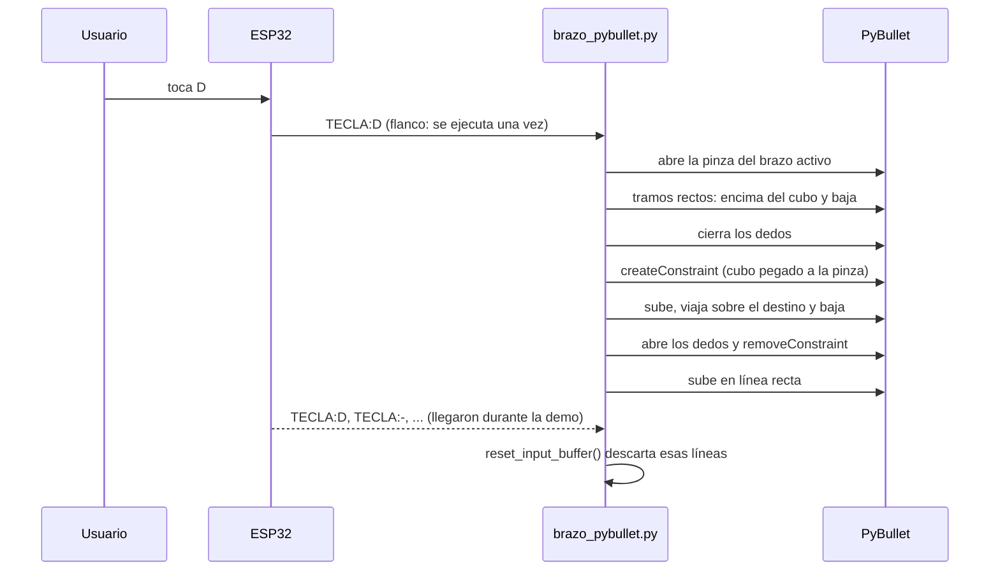
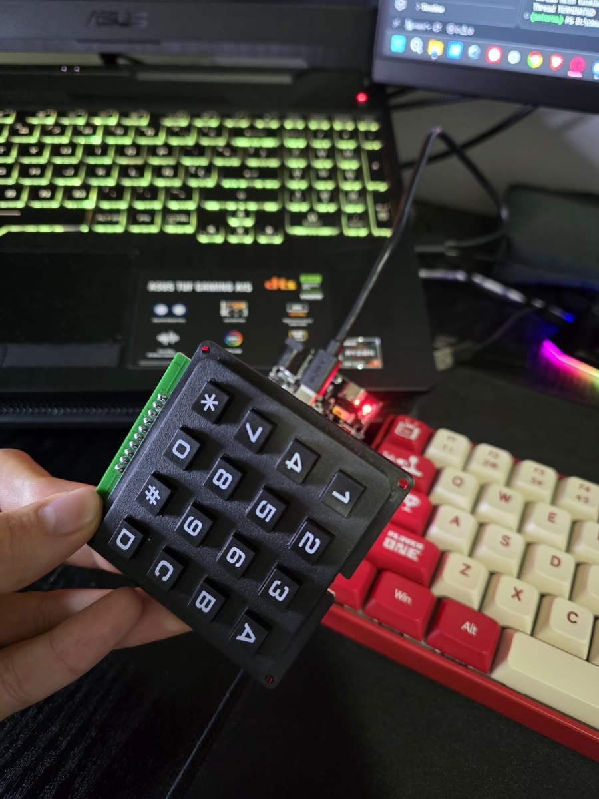

# Punto b) Baxter: mover los dos brazos, posicionar y coger un objeto

> **¿Quiere probarlo?** Doble clic en [`ABRIR.bat`](../ABRIR.bat) (carpeta del tema 9) → paso **b) Baxter** de la app (abre la ventana con sus 13 botones, o la prueba sin ventana con la lista de OK). **¿Quiere saber cómo funciona?** Aquí está todo: [cómo se maneja](#cómo-se-maneja-comportamientos-y-modos) · [qué es Baxter](#qué-es-baxter) · [modelos 3D](#los-modelos-3d-reales) · [cinemática inversa](#qué-es-la-cinemática-inversa) · [constraint](#qué-es-un-constraint) · [idea general](#la-idea-general) · [la escena](#la-escena) · [lógica paso a paso](#lógica-paso-a-paso) · [cómo probarlo a mano](#cómo-probarlo) · [resultados](#resultados-de-la-prueba).

Basado en [baxter_ik_demo.py](https://github.com/erwincoumans/pybullet_robots/blob/master/baxter_ik_demo.py), del repositorio [pybullet_robots](https://github.com/erwincoumans/pybullet_robots) que compartió el profesor. De ese script tomamos el robot (el mismo `toms_baxter.urdf`, con la base fija) y la técnica: mover la pinza con `p.calculateInverseKinematics` y repartir la respuesta entre las articulaciones según su `qIndex`.

## Qué pedía el enunciado



Una consola de mandos con el ESP32 para mover a Baxter con fluidez, con movilidad real de los brazos y posicionamiento, y que pueda coger y mover un objeto. Lo que hicimos, con el teclado 4x4 del ESP32:

- **Los dos brazos**: `*` cambia el brazo activo (izquierdo o derecho). El otro se queda quieto donde estaba, sostenido por sus motores.
- **Movimiento fluido y posicionamiento**: sosteniendo `8 2 4 6 9 7`, la pinza del brazo activo se mueve de corrido en X, Y y Z (30 cm/s), siempre mirando hacia abajo. Uno decide *dónde* va la pinza y la cinemática inversa calcula los ángulos de las 7 articulaciones.
- **Coger y mover un objeto**: `C` cierra la pinza y agarra el cubo si está entre los dedos, `A` la abre y lo suelta, y `D` hace todo sola: va al cubo, lo agarra, lo levanta, lo lleva al destino y lo deja.

Quedó funcionando en el montaje real: el teclado conectado al ESP32 maneja los dos brazos de Baxter en la simulación, tecla por tecla. (Al principio, como Baxter no viene con PyBullet, este punto usaba otro brazo de reemplazo; ahora es el modelo real de Baxter.)

## Así se ve

La demo `D` con el brazo izquierdo, después `*` para pasar al derecho, el derecho movido a mano con el jog y `0` para reponer el cubo:



El GIF es la grabación completa (24 s).

El modelo 3D real de Baxter, en su pose inicial y en el momento en que agarra el cubo (capturas de la simulación con `getCameraImage`):

| Pose inicial (home) | Agarrando el cubo |
|---|---|
|  |  |

## Cómo se maneja: comportamientos y modos

### El teclado, tecla por tecla

Así queda repartido el teclado 4x4 (la misma disposición que el teclado físico):

| | | | |
|---|---|---|---|
| `1` sin uso | `2` pinza a −Y (derecha de Baxter) | `3` sin uso | `A` abrir pinza / soltar |
| `4` pinza a −X (hacia Baxter) | `5` home del brazo activo | `6` pinza a +X (hacia el fondo) | `B` demo: recorrer los 3 ejes |
| `7` bajar (Z−) | `8` pinza a +Y (izquierda de Baxter) | `9` subir (Z+) | `C` cerrar pinza / agarrar |
| `*` cambiar de brazo | `0` reponer el cubo | `#` sin uso | `D` demo: coger y mover |

"Izquierda" y "derecha" son siempre las de Baxter (+Y es su izquierda), no las de quien lo mira de frente.

### Un brazo activo a la vez, y la tecla `*`

Todas las teclas actúan sobre el **brazo activo**, que arranca siendo el izquierdo. `*` lo cambia (izquierdo ↔ derecho) y el cambio se ve arriba en la ventana: `Brazo activo: IZQUIERDO | tecla: * | ESP32: TECLA:*`.

Mientras tanto, **el otro brazo no se suelta ni se cae**: sus motores siguen con el último objetivo que recibieron y lo sostienen quieto contra la gravedad, aunque esté en medio de la mesa o con la pinza cerrada. Por eso se puede, por ejemplo, dejar el brazo izquierdo esperando encima del destino, pasar al derecho y moverlo, y al volver con `*` el izquierdo sigue exactamente donde quedó. Cada brazo recuerda su propio objetivo.

### Jog: sostener la tecla es moverse

Las teclas `8 2 4 6 9 7` mueven el **objetivo** de la pinza del brazo activo un paso fijo de **1,5 cm** (`PASO_JOG`) por cada línea `TECLA:x` que llega del ESP32. El firmware repite la tecla sostenida cada 50 ms, así que:

- **un toque corto** mueve la pinza unos pocos pasos (de a 1,5 cm, para afinar la posición encima del cubo);
- **sostener la tecla** la mueve de corrido a 1,5 cm × 20 líneas por segundo = **30 cm/s**, y para en cuanto se suelta.

Cada paso de jog pasa por la cinemática inversa: la pinza siempre baja mirando hacia la mesa, y el brazo se acomoda solo (hombro, codo y muñeca) con motores de velocidad limitada, sin teletransportarse. En la prueba, 10 líneas `TECLA:8` movieron el objetivo 15,0 cm y la pinza real también 15,0 cm, desviándose apenas 0,01 cm en X.

### Los límites: qué pasa al llegar al borde

Cada brazo tiene su **caja de trabajo** (`LIMITES_JOG`): X de 0,50 a 0,72 m, Z desde la altura de agarre (z = −0,19) hasta 0,20, e Y de −0,20 a 0,50 para el izquierdo (de −0,50 a 0,20 para el derecho). Es decir, cada brazo puede cruzar hasta 20 cm al lado del otro, lo justo para alcanzar el origen y el destino del cubo.

Al llegar al borde, **la tecla simplemente deja de mover la pinza en esa dirección**: el objetivo se recorta a la caja y se queda ahí, sin error ni aviso. Dos consecuencias prácticas:

- **Sostener `7` baja la pinza hasta rodear el cubo y ahí se detiene**: el piso de la caja es justo la altura de agarre, así que no atraviesa la mesa (en la prueba, 60 líneas `TECLA:7` dejaron el objetivo quieto en z = −0,1905). Es la forma cómoda de bajar a agarrar: sostener `7` y soltar cuando ya no baja.
- **La tecla contraria responde al instante.** Si el objetivo pudiera seguir saliéndose de la caja hacia un punto que el brazo ya no alcanza, el brazo quedaría estirado "persiguiéndolo" y, al pulsar la contraria, el objetivo tardaría lo mismo en volver: se sentiría como que la tecla no responde. Recortando, eso no pasa.

### Acciones de un golpe: por qué van por flanco

Las demás teclas (`5 A B C D 0 *`) **actúan una sola vez por pulsación**, aunque se dejen sostenidas. El motivo es el mismo firmware: un toque normal de un dedo dura lo suficiente para que lleguen unas 4 líneas iguales. Si `*` actuara con cada una, un toque cambiaría de brazo cuatro veces y uno terminaría en el mismo brazo; si `D` actuara con cada una, la demo (8,6 s) correría cuatro veces seguidas.

Por eso `procesar_tecla` separa:

- **Teclas de jog** (`8 2 4 6 9 7`): actúan con cada línea que llega.
- **Todas las demás**: actúan solo en el **flanco**, el instante en que la tecla recibida es distinta de la anterior. Para volver a usarla hay que soltarla (llega `TECLA:-`) y pulsarla de nuevo.

En la prueba, `TECLA:*` repetida 10 veces cambió de brazo **una sola vez**, y otro toque lo devolvió.

### La pinza: `C` cierra, `A` abre, y cuándo agarra

- **`C`** cierra los dos dedos del brazo activo (de verdad: son motores con 20 N de fuerza). Si en ese momento el cubo está **entre los dedos** (su centro a menos de 4 cm del punto de la pinza), además lo agarra: queda unido a la pinza (ver "Qué es un constraint") y viaja con ella. Si no hay cubo cerca, la pinza simplemente se cierra en el aire.
- **`A`** abre los dedos y, si **esa** pinza tenía el cubo, lo suelta: primero abre, espera 1/8 de segundo y después lo suelta, para que caiga derecho.
- El cubo lo puede tener **un solo brazo a la vez**: `C` con el otro brazo no se lo quita, y `A` en un brazo que no lo tiene no suelta el del otro.

Para agarrar a mano: jog hasta quedar encima del cuadro azul, sostener `7` hasta que se detenga, `C`, subir con `9`, jog hasta el cuadro verde, bajar con `7` y `A`.

### Las demos: `D` y `B`

- **`D` (coger y mover)**: con el brazo activo, va a **donde esté** el cubo (no necesariamente el origen: si uno lo movió a mano, lo busca ahí), abre la pinza, se pone encima a 20 cm de la mesa, baja en dos tramos, cierra, agarra, sube, viaja sobre el destino, baja, abre, suelta y se aleja hacia arriba. Funciona con los dos brazos: en la prueba dejó el cubo a 0,19 cm del destino con el izquierdo y a 0,57 cm con el derecho, después de levantarlo 19 cm. Dura 8,6 s.
- **`B` (recorrer los 3 ejes)**: pasea la pinza del brazo activo por los extremos de **su** caja de trabajo, un eje a la vez (X, Y y Z) y volviendo al centro entre cada uno. Sirve para ver de una vez todo el rango que alcanza el brazo.

Las dos demos se mueven en **línea recta**, en tramos de 1 cm, y son bloqueantes: mientras corren, el teclado no hace nada. Las líneas que el ESP32 manda durante la demo se descartan al terminar (`reset_input_buffer`), para que no se ejecuten todas juntas después.

### Home `5` y reponer `0`

- **`5`** manda el brazo activo a su pose inicial: abierto hacia su lado, por encima de la mesa (0,60; ±0,40; 0,05). Va directo a esos ángulos, no en línea recta, así que conviene subir antes si la pinza está pegada a la mesa. Si tenía el cubo agarrado, lo sigue teniendo.
- **`0`** suelta el cubo (lo tenga quien lo tenga) y lo devuelve al cuadro azul del origen. Sirve para repetir la demo o para recuperarlo si quedó mal apoyado.

### Tres formas de controlarlo

**1. El teclado físico (ESP32 por USB).** Es la forma principal: el ESP32 con `esp32_teclado.py` barre el teclado y manda `TECLA:x` cada 50 ms; `brazo_pybullet.py` lo lee por el puerto serial. Arriba en la ventana se ve la última línea **cruda** que llegó: si nunca cambia, el ESP32 no está mandando nada; si cambia pero no dice `TECLA:x`, el problema es de formato y no de cable. Si el ESP32 se desconecta a mitad de camino, el script lo avisa y sigue con los botones.

**2. Los botones de la ventana de PyBullet (sin ESP32).** Si el script no encuentra el ESP32, abre la ventana igual y lo dice arriba: `ESP32: no conectado (usa los botones)`. A la derecha hay 13 botones, uno por tecla, con la tecla entre corchetes (`Cerrar pinza [C]`, `Demo: coger y mover [D]`, `Cambiar de brazo [*]`...). Pasan por la misma función que el teclado (`ejecutar_tecla`), así que hacen exactamente lo mismo, con una diferencia: **cada click es un solo paso de jog** (1,5 cm), porque un botón no se puede "sostener". Los botones funcionan también con el ESP32 conectado, a la par.

**3. El simulador web `preview.html`.** En la carpeta del taller está [`../preview.html`](../preview.html), una página suelta (se abre con doble click, sin instalar nada) con la configuración "Baxter (dos brazos)": un teclado 4x4 clicable y una vista desde arriba de Baxter, la mesa, el cubo y los dos brazos, con la altura Z en una barra al lado. Usa las mismas constantes que el script (paso, cajas de trabajo, home, umbral de agarre) y la misma regla de flancos. Tiene dos modos:

- **Modo prueba**: se juega con el mouse, sin hardware. Sostener una tecla de jog la repite como el ESP32. Las demos corren con la misma secuencia que en PyBullet, un poco más rápidas.
- **Conectado (Web Serial)**: en Chrome o Edge, se conecta al ESP32 por USB y lo maneja el teclado físico, mostrando las líneas crudas que llegan. Sirve para comprobar el teclado y el cableado sin abrir PyBullet. El puerto lo puede tener abierto un solo programa a la vez: cerrar antes Thonny y `brazo_pybullet.py`.



El preview es un esquema 2D para probar el **control**: ahí la pinza va derecho hacia el objetivo, sin cinemática inversa ni física. Lo que de verdad mueve los brazos es el script de PyBullet.

## Qué es Baxter

**Baxter** es un robot de Rethink Robotics pensado para trabajar al lado de personas en tareas repetitivas (empacar, cargar máquinas). Tiene un torso fijo sobre un pedestal, una **pantalla que hace de cara** (muestra unos ojos que miran hacia donde se va a mover el brazo, para que la gente a su alrededor lo anticipe) y **dos brazos de 7 articulaciones** cada uno, que terminan en una **pinza eléctrica** de dos dedos paralelos.

Las 7 articulaciones de cada brazo tienen nombre propio en el URDF, y así se ven en el código:

| Articulación | Qué mueve |
|---|---|
| `s0`, `s1` | hombro: girar a los lados y subir o bajar el brazo |
| `e0`, `e1` | codo: girar el brazo superior y doblar el codo |
| `w0`, `w1`, `w2` | muñeca: girar el antebrazo, doblar la muñeca y girar la pinza |

Los dedos (`l_gripper_l_finger_joint` y `l_gripper_r_finger_joint` en el brazo izquierdo, `r_gripper_...` en el derecho) son **prismáticos**: no giran, se deslizan, cada uno entre 0 y 2 cm. Medimos la separación entre las puntas: 5,6 cm con la pinza abierta y 1,6 cm cerrada. El punto que se posiciona es `left_endpoint` / `right_endpoint`, un punto fijo de la pinza a la altura de las puntas de los dedos.

## Los modelos 3D reales

El URDF de Baxter no está en el paquete `pybullet_data` que se instala con pip (trae el piso y el cubo, pero no Baxter). En el repositorio del profesor está en la carpeta `data/baxter_common/`, junto con sus mallas 3D: 17 mallas `.DAE` que suman unos **22 MB** (medido en nuestra carpeta `modelos/`). No los subimos a este repositorio, que es de apuntes de clase. En cambio, el script [`../descargar_modelos.py`](../descargar_modelos.py) lee el URDF, ve qué mallas pide y las baja una sola vez del repositorio del profesor a la carpeta `modelos/` del taller, que git ignora:

```
entorno\Scripts\python descargar_modelos.py
```

Si se corre `brazo_pybullet.py` sin haberlas bajado, corre solo `descargar_modelos.py` una vez antes de abrir la ventana; si no hay internet, avisa `Faltan los modelos: corra ...descargar_modelos.py en la carpeta del taller` y termina.

Un detalle de carga que costó encontrar: el URDF nombra sus mallas como `package://baxter_description/meshes/...`. PyBullet quita el `package://` y busca el resto en su **ruta de búsqueda adicional**, que es **una sola** (cada `setAdditionalSearchPath` pisa la anterior). Por eso esa ruta apunta a `modelos/baxter_common/`, y el piso y el cubo de `pybullet_data` se cargan con su ruta completa.

## Qué es la cinemática inversa

Un brazo robótico es una cadena de eslabones unidos por articulaciones. Hay dos preguntas posibles:

- **Cinemática directa**: "si cada articulación tiene tal ángulo, ¿dónde queda la pinza?". Es fácil: se van encadenando las rotaciones de cada eslabón.
- **Cinemática inversa (IK)**: "quiero la pinza en (0,65; 0,15; −0,19) mirando hacia abajo, ¿qué ángulo necesita cada articulación?". Es la pregunta que sirve para agarrar algo, y es la difícil: puede no tener solución (el punto está fuera de alcance) o tener infinitas.

Para fijar la posición (3 números) y la orientación (3 más) de la pinza hacen falta 6 articulaciones. Cada brazo de Baxter tiene 7, así que es **redundante**: para un mismo punto hay infinitas posturas válidas, como uno puede tocar la misma taza con el codo más arriba o más abajo. `p.calculateInverseKinematics` resuelve esto numéricamente, por aproximaciones sucesivas. Para elegir entre tantas soluciones recibe los **límites de cada articulación** y una **pose de descanso**: entre las soluciones válidas prefiere la más parecida a esa pose (a esto se le llama usar el *espacio nulo*). Así el brazo no se retuerce.

Tres cosas que cambiamos respecto al demo del profesor, todas medidas:

1. **Límites reales**. El demo le pasa −2 a 2 radianes a todas las articulaciones. Nosotros leemos los del URDF (`getJointInfo`): el hombro `s1`, por ejemplo, va de −2,15 a 1,05, y el codo `e1` de −0,05 a 2,62.
2. **Iterar sin teletransportar el robot**. El `accurateIK` del demo repite la IK y, entre vuelta y vuelta, pone el robot en la pose calculada con `resetJointState` para medir el error. Eso rompe la física si se hace mientras el robot se mueve. Nosotros repetimos la IK hasta 10 veces arrancando cada vuelta desde la solución anterior (`currentPositions`), sin tocar el robot, y paramos cuando la solución deja de cambiar (medido en el jog: de 1 a 4 vueltas, unos 6 ms por cálculo).
3. **El hombro apunta al objetivo**. La pose de descanso del hombro (`s0`) se calcula para cada objetivo: el ángulo de la recta hombro → objetivo vista desde arriba (`s0_hacia`). Probamos en una grilla de puntos sobre la mesa: con un `s0` fijo, aun iterando, la IK fallaba hasta por 22 cm cuando un brazo cruzaba al lado del otro; con `s0_hacia` el error quedó por debajo de 1 cm hasta x = 0,70 m y cruzando hasta 15 cm al otro lado.

Y una más, de la orientación: "pinza hacia abajo" se puede pedir de dos maneras equivalentes para agarrar (girada 0° o 180°, porque la pinza es simétrica). Con la primera, la muñeca `w2` tenía que quedar en −3,06 rad, justo en su límite, y al cruzar al otro lado la IK fallaba por 7 cm. Con la segunda, `w2` queda cerca de 0 y todo funciona.

Un detalle de PyBullet: `calculateInverseKinematics` devuelve un ángulo por cada articulación **móvil** del robot, no solo las 7 del brazo: en Baxter son 19 (la cabeza, los 7 de cada brazo y los 4 dedos), en el orden de su `qIndex`. Por eso el código arma la lista `moviles` ordenada por `qIndex` y busca ahí cada valor, igual que el demo con su `qIndex - 7`.

## Qué es un constraint

En la vida real una pinza sostiene un objeto por fricción: aprieta y el objeto no se resbala. En PyBullet los dedos de Baxter sí se cierran de verdad (son motores de posición con la fuerza del URDF, 20 N) y aprietan el cubo: cada dedo se queda en 0,93 cm de su recorrido de 0 a 2 cm, contra las caras del cubo. Pero el contacto de dos dedos chicos con un cubo liviano es lo más frágil de toda la simulación, así que además usamos un **constraint**.

Un constraint (`p.createConstraint`) es una regla extra que el motor de física respeta en cada paso. El de tipo `JOINT_FIXED` une dos cuerpos como una soldadura: al cerrar la pinza con el cubo entre los dedos (a menos de 4 cm del `endpoint`), se crea uno entre la pinza y el cubo, y el cubo viaja pegado a ella. La posición relativa se mide en ese instante (`invertTransform` + `multiplyTransforms`), así que el cubo queda exactamente como estaba, sin saltar. Al soltar se borra con `p.removeConstraint` y el cubo vuelve a tener solo gravedad.

El orden al soltar importa: **primero se abren los dedos y después se borra el constraint** (`abrir_y_soltar`). Al revés, los dedos todavía apretando empujaban el cubo apenas quedaba suelto y caía 2,7 cm corrido del destino.

Lo medimos también sin constraint (sección 5 de la prueba): en esta escena los dedos solos levantaron el cubo los 19 cm y lo llevaron al destino. Dejamos el constraint igual, como seguro para el control manual, donde uno puede mover el brazo de golpe.

## La idea general

El teclado va conectado directo a pines GPIO del ESP32: filas en los GPIO 14, 27, 26 y 25 y columnas en los 33, 32, 18 y 19, con la resistencia de pull-up interna. El firmware común del taller ([`../esp32_teclado.py`](../esp32_teclado.py)) barre las filas y manda la tecla pulsada por USB cada 50 ms:


```mermaid
flowchart TD
    subgraph ESP["ESP32 — esp32_teclado.py"]
        Teclado["Teclado 4x4<br/>(GPIO directo, pull-up interno)"] --> Envia["print('TECLA:x')<br/>cada 50 ms"]
    end

    Envia -->|"USB serial<br/>115200 baudios"| Recibe

    subgraph PC["PC — brazo_pybullet.py"]
        Recibe["leer_serial():<br/>solo si in_waiting, drena todo"] --> Linea["procesar_linea():<br/>muestra la línea cruda"]
        Linea --> Procesa{"procesar_tecla():<br/>¿jog o flanco?"}
        Procesa --> Ejecuta["ejecutar_tecla()"]
        Botones["13 botones de la ventana<br/>(sin ESP32)"] --> Ejecuta
        Ejecuta -->|"8 2 4 6 9 7"| Objetivo["objetivo ± 1,5 cm<br/>(recortado a la caja de trabajo)"]
        Ejecuta -->|"*"| Activo["cambia el brazo activo"]
        Ejecuta -->|"A / C"| Pinza["dedos + constraint"]
        Ejecuta -->|"D / B"| Demo["demos con mover_a():<br/>tramos rectos de 1 cm"]
        Objetivo --> IK["resolver_ik():<br/>calculateInverseKinematics"]
        Demo --> IK
        IK --> Motores["setJointMotorControl2<br/>POSITION_CONTROL"]
    end

    Motores --> Sim["PyBullet: Baxter + mesa + cubo"]
    Pinza --> Sim
```

Así se ve la demo `D` en el tiempo. Mientras corre, el bucle principal no lee el puerto, así que las líneas que el ESP32 sigue mandando se acumulan y al final se descartan:


```mermaid
sequenceDiagram
    participant U as Usuario
    participant E as ESP32
    participant P as brazo_pybullet.py
    participant S as PyBullet
    U->>E: toca D
    E->>P: TECLA:D (flanco: se ejecuta una vez)
    P->>S: abre la pinza del brazo activo
    P->>S: tramos rectos: encima del cubo y baja
    P->>S: cierra los dedos
    P->>S: createConstraint (cubo pegado a la pinza)
    P->>S: sube, viaja sobre el destino y baja
    P->>S: abre los dedos y removeConstraint
    P->>S: sube en línea recta
    E-->>P: TECLA:D, TECLA:-, ... (llegaron durante la demo)
    P->>P: reset_input_buffer() descarta esas líneas
```

## La escena

Las coordenadas son las de Baxter: origen en el torso, +X hacia su frente, +Y hacia **su** izquierda, +Z arriba. Todas están en constantes al principio del script.

| Elemento | Dónde | Detalle |
|---|---|---|
| Baxter (`toms_baxter.urdf`) | origen, mirando a +X | base fija, como en el demo |
| Piso (`plane.urdf`) | z = −0,926 | donde termina el pedestal (medido con `getAABB`) |
| Mesa | x de 0,47 a 1,0; y de −0,5 a 0,5; superficie en z = −0,20 | bloque fijo; empieza por delante del pedestal, que llega a x = 0,42 |
| Cubo (`cube_small.urdf` a escala 0,7) | empieza en el origen | 3,5 cm de lado (ver abajo) |
| Origen (cuadro azul) | (0,65; 0,15) | del lado izquierdo de Baxter |
| Destino (cuadro verde) | (0,65; −0,15) | del lado derecho |
| Home de cada brazo | (0,60; ±0,40; 0,05) | abiertos a los costados, sobre la mesa |
| Caja del jog, brazo izquierdo | X 0,50 a 0,72 · Y −0,20 a 0,50 · Z −0,19 a 0,20 | el derecho, igual con Y de −0,50 a 0,20 |

- **El cubo va a escala 0,7.** `cube_small.urdf` mide 5 cm y la pinza abierta deja 5,6 cm entre las puntas: 3 mm de holgura por lado. A 3,5 cm entra holgado y la pinza cerrada (1,6 cm) lo aprieta de verdad.
- **Origen y destino los alcanzan los dos brazos.** Cada brazo puede cruzar hasta 20 cm al lado del otro; más allá, o más lejos que x = 0,72, la pinza vertical ya no llega bien.
- **El piso de la caja del jog es la altura de agarre** (z = −0,19): sostener `7` baja la pinza hasta rodear el cubo y ahí se detiene; no atraviesa la mesa.

## Lógica paso a paso

Todo está en [`brazo_pybullet.py`](brazo_pybullet.py), separado en funciones para que otro script lo pueda importar (la prueba y las capturas lo usan en modo `DIRECT`, sin ventana).

- **`crear_mundo(modo)`**: revisa que estén los modelos, conecta PyBullet (`p.GUI` o `p.DIRECT`), carga el piso, Baxter, la mesa, las marcas y el cubo, y busca todo **por nombre** con `indice_por_nombre` (ningún índice de articulación está escrito a mano). Pone a Baxter en su pose inicial: resuelve la IK hacia el home de cada brazo y lo coloca ahí con `resetJointState`, la **única** vez que se usa (antes de empezar a simular). Después deja los motores sosteniendo esa pose. Devuelve `estado`, un objeto con todos los ids y variables.
- **`resolver_ik(estado, brazo, xyz)`**: la cinemática inversa explicada arriba. Devuelve el ángulo de las 7 articulaciones del brazo pedido. Las demás (cabeza, otro brazo, dedos) tienen como pose de descanso su posición actual, para que la IK no "quiera" moverlas, y de todos modos no se tocan.
- **`fijar_objetivo(estado, brazo, xyz)`**: llama a `resolver_ik` y le manda a cada motor su ángulo con `POSITION_CONTROL`. Ese modo no teletransporta la articulación: es un motor con fuerza máxima (120 N·m en hombro y codo, 40 N·m en la muñeca) y velocidad máxima (1,2 rad/s), que empuja contra la gravedad. La fuerza es más alta que la del URDF (50 y 15) porque varios links de `toms_baxter.urdf` no traen inercia y PyBullet les asigna 1 kg a cada uno: el brazo simulado pesa más que el real.
- **`mover_a(estado, brazo, xyz, pasos)`**: lleva la pinza hasta `xyz` **en línea recta**, en tramos de 1 cm (una IK por tramo), y simula. Al principio le dábamos a los motores directamente el ángulo final: cada articulación giraba a su ritmo y la pinza hacía una curva. Al subir después de soltar el cubo, se corría 3 cm de lado todavía abajo, golpeaba el cubo y lo giraba 57°.
- **`mover_pinza(estado, brazo, abierta)`**: abre o cierra los dos dedos. Lee de los límites del URDF hacia qué lado abre cada uno (uno va de 0 a 0,02 y el otro de −0,02 a 0).
- **`intentar_agarrar`, `soltar`, `abrir_y_soltar`**: el constraint explicado arriba.
- **`reponer_cubo`**: suelta el cubo y lo devuelve al origen moviendo **el mismo** cuerpo (`resetBasePositionAndOrientation`), sin borrarlo ni crear otro: PyBullet reutiliza los ids de cuerpos borrados.
- **`ejecutar_demo(estado)`** (`D`): con el brazo activo, toma la posición real del cubo, abre la pinza, va encima a 20 cm de la mesa, baja en dos tramos, cierra, agarra, sube, viaja sobre el destino, baja, abre, suelta y sube. Dura 8,6 s de simulación.
- **`ejecutar_demo_recorrido(estado)`** (`B`): pasea la pinza del brazo activo por los extremos de su caja de trabajo en X, Y y Z, volviendo al centro entre cada eje.
- **`ejecutar_tecla(estado, tecla)`**: la única función que decide qué hace cada tecla; la usan el ESP32 y los botones, así nunca se desincronizan. El jog suma el paso y recorta el objetivo a la caja del brazo activo (`LIMITES_JOG`).
- **`procesar_tecla` y `procesar_linea`**: el filtro jog/flanco y la lectura de una línea `TECLA:x`. Tras una demo vacían el buffer del puerto (`reset_input_buffer`).
- **`leer_serial(estado)`**: lee solo si `ser.in_waiting` es mayor que cero y drena **todo** el buffer. Un `readline()` a secas esperaría hasta 50 ms cuando no hay línea y frenaría toda la simulación a unos 20 cuadros por segundo. Si el ESP32 se desconecta, la `SerialException` se atrapa, `ser` pasa a `None` y se sigue con los botones.
- **`actualizar_texto(estado)`**: escribe arriba en la ventana el brazo activo, la última tecla y la última línea **cruda** del ESP32.
- **Bucle principal** (solo en `if __name__ == "__main__":`): abre el serial en un `try/except` (sin ESP32 sigue con botones), crea los 13 botones **una sola vez** y, en cada vuelta, lee el serial, lee los botones y avanza un paso de física (1/240 s).

## Cómo probarlo

Los comandos van desde la carpeta del taller (`9-taller-segundo-corte\`), usando su entorno. La primera vez hay que bajar los modelos: `entorno\Scripts\python descargar_modelos.py`.

**Sin ESP32 conectado:**
1. `entorno\Scripts\python punto-b-brazo-tipo-baxter\brazo_pybullet.py`. En consola sale `No se encontro el ESP32 en COM7: usa los botones de la ventana.` y la ventana abre igual; arriba se lee `Brazo activo: IZQUIERDO | tecla: - | ESP32: no conectado (usa los botones)`.
2. Con los 13 botones de la derecha: `Demo: coger y mover [D]` para ver el punto completo, o hacerlo a mano como se explica en "La pinza". `Cambiar de brazo [*]` y repetir con el otro brazo; `Reponer cubo [0]` devuelve el cubo al origen.
3. Para probar solo el control, sin Python: abrir [`../preview.html`](../preview.html), elegir "Configuración: Baxter (dos brazos)" y usar el modo prueba.

**Con ESP32 conectado:**
1. Guardar `esp32_teclado.py` (en la carpeta del taller) como `main.py` en el ESP32, conectar el teclado (filas a los GPIO 14, 27, 26 y 25; columnas a los 33, 32, 18 y 19) y cerrar Thonny para liberar el puerto.
2. Cambiar `PUERTO_SERIAL = "COM7"` al principio de `brazo_pybullet.py` por el COM que muestre el Administrador de dispositivos.
3. `entorno\Scripts\python punto-b-brazo-tipo-baxter\brazo_pybullet.py`. En consola sale `ESP32 conectado en COM7: el teclado mueve a Baxter.`; sosteniendo `8 2 4 6 9 7` la pinza se mueve de corrido, y los botones siguen funcionando a la par.

**Prueba automática** (sin ventana, unos 10 s): `entorno\Scripts\python punto-b-brazo-tipo-baxter\probar_baxter.py`. Imprime cada cifra y termina con `Todas las pruebas pasaron.` (o con código 1 si algo falla).

| Tecla | Efecto | Tipo |
|---|---|---|
| `8` / `2` | Pinza hacia +Y / −Y (izquierda / derecha de Baxter) | jog, se repite |
| `4` / `6` | Pinza hacia −X / +X (hacia Baxter / hacia el fondo de la mesa) | jog, se repite |
| `9` / `7` | Pinza sube / baja (Z+ / Z−) | jog, se repite |
| `5` | Home del brazo activo | un golpe |
| `A` | Abrir la pinza (y soltar el cubo si esa pinza lo tenía) | un golpe |
| `C` | Cerrar la pinza (y agarrar el cubo si está entre los dedos) | un golpe |
| `D` | Demo: coge el cubo y lo lleva al destino con el brazo activo | un golpe |
| `B` | Demo: recorre los ejes X, Y y Z con el brazo activo | un golpe |
| `0` | Suelta el cubo y lo repone en el origen | un golpe |
| `*` | Cambia de brazo activo (izquierdo ↔ derecho) | un golpe |
| `1`, `3`, `#` | Sin uso en este punto | — |

## El montaje y la demo

El montaje real: el teclado de membrana 4x4 va con sus 8 cables directo a los pines del ESP32 (filas en los GPIO 14, 27, 26 y 25; columnas en los 33, 32, 18 y 19), y el ESP32 va al portátil por el cable USB, que es a la vez la alimentación y el canal serial. No hay más componentes: las resistencias de pull-up son las internas del ESP32. Con este montaje quedó funcionando: el teclado responde en todas sus teclas y maneja a Baxter en la simulación.

| El ESP32 con el teclado conectado | El teclado 4x4 |
|---|---|
|  |  |

En la simulación, la secuencia del video es la demo `D` con el brazo izquierdo (coge el cubo del cuadro azul y lo deja en el verde), `*` para pasar al brazo derecho, un jog del derecho con las teclas de movimiento y `0` para reponer el cubo en el origen:


El GIF es la grabación completa (24 s).

## Resultados de la prueba

Salida de `probar_baxter.py` (modo `DIRECT`):

| Qué se probó | Resultado |
|---|---|
| IK + motores, brazo izquierdo, 3 objetivos (uno cruzando 15 cm al lado derecho) | error final de 0,12 / 0,03 / 0,13 cm |
| IK + motores, brazo derecho, los mismos 3 en espejo | 0,12 / 0,03 / 0,13 cm |
| Demo `D` con el brazo izquierdo | cubo a **0,19 cm** del destino; subió 19,0 cm; quedó apoyado en la mesa |
| Demo `D` con el brazo derecho | cubo a **0,57 cm** del destino; subió 19,0 cm; quedó apoyado en la mesa |
| Duración de la demo `D` | 8,6 s de simulación |
| `TECLA:*` repetida 10 veces | cambió de brazo **una** vez (izquierdo → derecho); otro toque lo devolvió |
| `TECLA:8` repetida 10 veces, una cada 50 ms | el objetivo avanzó 15,0 cm en Y (10 pasos) y la pinza real también 15,0 cm, con 0,01 cm de desvío en X |
| `TECLA:7` repetida 60 veces | el objetivo se detuvo en z = −0,1905, el piso de la caja |
| Antebrazos, muñecas y pinzas contra torso y pedestal (`getClosestPoints`, durante las demos) | nunca a menos de 5 cm |
| Los dos brazos entre sí (antebrazo a pinza) | nunca a menos de 5 cm |
| Brazo, mesa: contactos al final | 0 |
| Dedos solos, sin constraint (dato) | levantaron el cubo 19,0 cm y lo llevaron hasta (0,650; −0,158) |

Un dato que hay que leer con cuidado: el **brazo superior** (los links del hombro y `upper_elbow`, atornillados junto al torso) contra la forma de colisión del torso da −1,0 cm ya en la pose de home y llega a −7,0 cm cuando un brazo cruza al otro lado. No es que se meta en el pecho: PyBullet usa como forma de colisión del torso la **envolvente convexa** de su malla, un "globo" que rodea el pecho y los hombros, y el brazo superior sale de adentro de ese globo. En las imágenes renderizadas de esas poses no se ve ningún cruce. Como en el demo del profesor, la autocolisión del robot está apagada (es lo que trae `loadURDF` por defecto); por eso estas distancias se miden con `getClosestPoints`, que mide la geometría aunque la colisión esté apagada.
