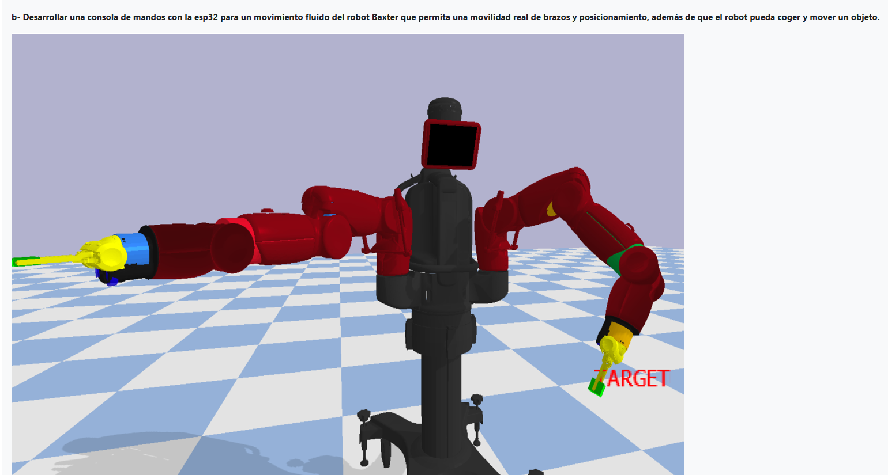
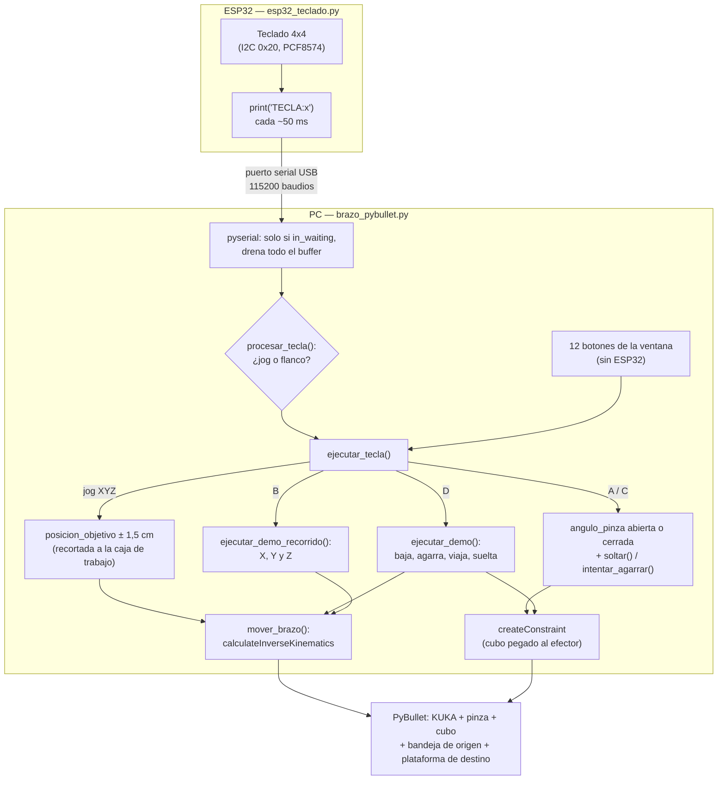
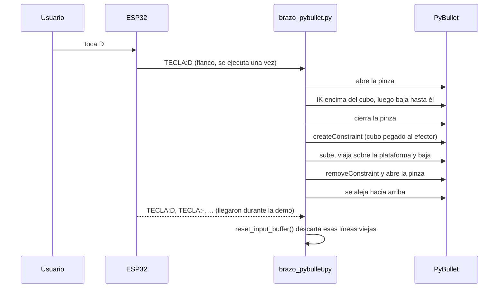

# Punto b) Brazo robótico tipo Baxter: mover, posicionar y coger un objeto

Basado en [baxter_ik_demo.py](https://github.com/erwincoumans/pybullet_robots/blob/master/baxter_ik_demo.py), del repositorio [pybullet_robots](https://github.com/erwincoumans/pybullet_robots) que compartió el profesor. El enunciado pide una consola de mandos con el ESP32 para un movimiento fluido del robot Baxter, con movilidad real de brazos y posicionamiento, y que el robot pueda coger y mover un objeto:



## Qué pedía y qué hicimos

Hicimos una consola de mando con el teclado del ESP32 para un brazo robótico de 7 articulaciones con pinza, en una escena con una bandeja de origen, un cubo y una plataforma de destino. Con el teclado:

- **Movimiento fluido**: sosteniendo `8 2 4 6 9 7` la pinza se mueve de corrido en X, Y y Z (unos 30 cm/s), y el brazo acomoda sus 7 articulaciones solo para seguirla.
- **Posicionamiento real**: el control es por cinemática inversa: uno decide *dónde* va la pinza (una coordenada XYZ) y el script calcula los ángulos. La pinza siempre queda mirando hacia abajo, lista para agarrar.
- **Coger y mover un objeto**: `A` abre la pinza, `C` la cierra y agarra el cubo si está cerca, y `D` corre una demo que hace todo sola (bajar, agarrar, levantar, llevar el cubo a la plataforma y soltarlo). `0` repone el cubo en la bandeja para volver a empezar.
- Además, `B` corre una demo que pasea la pinza por los tres ejes para mostrar el rango de movimiento, y `5` vuelve a la pose inicial.

El brazo no es Baxter sino un **KUKA IIWA con pinza WSG50**. El porqué está resumido abajo y completo en el [README del taller](../README.md#por-qué-baxter-se-reemplazó-por-un-brazo-kuka--pinza). El punto c) del enunciado (que interpretamos como locomoción con patas) es otro robot y otro problema de control, y está resuelto aparte en [`punto-c-locomocion-laikago`](../punto-c-locomocion-laikago).

## Qué es Baxter y por qué usamos un KUKA

**Baxter** es un robot de Rethink Robotics pensado para trabajar al lado de personas: un torso fijo sobre un pedestal, una pantalla como cara y **dos brazos de 7 articulaciones** cada uno. `baxter_ik_demo.py` carga su modelo desde `baxter_common/baxter_description/urdf/toms_baxter.urdf`, pero esas mallas 3D (unos 50 MB, del repositorio RethinkRobotics/baxter_common) no vienen ni en `pybullet_robots` ni en el paquete `pybullet_data` que se instala con pip; lo revisamos en el `pybullet_data` de nuestro `entorno/`.

El **KUKA LBR IIWA** es un brazo industrial colaborativo, también de **7 articulaciones**, y sí viene en `pybullet_data` junto con una pinza de dos dedos (WSG50), en `kuka_iiwa/kuka_with_gripper2.sdf`. El problema de control es el mismo que con un brazo de Baxter (7 articulaciones, llevar la pinza a un punto), así que usamos exactamente la técnica de `baxter_ik_demo.py` (`calculateInverseKinematics` hacia una posición XYZ) y los índices de articulación, límites y pose de reposo del ejemplo oficial de PyBullet para este modelo (`pybullet_envs/bullet/kuka.py`).

## Qué es la cinemática inversa (IK)

Un brazo robótico es una cadena de eslabones unidos por articulaciones. Hay dos preguntas posibles:

- **Cinemática directa**: "si cada articulación tiene tal ángulo, ¿dónde queda la pinza?". Es fácil: se van encadenando las rotaciones de cada eslabón.
- **Cinemática inversa**: "quiero la pinza en (0,55; 0,20; 0,08), ¿qué ángulo necesita cada articulación?". Es la pregunta que de verdad sirve para agarrar algo, y es la difícil: puede no tener solución (el punto está fuera de alcance) o tener muchas.

El extremo del brazo que uno quiere posicionar se llama **efector** (acá, la muñeca del KUKA, el link 6, justo encima de la pinza). Cada articulación que se puede mover es un **grado de libertad** (GDL). Para fijar la posición (3 números) y la orientación (3 más) de la pinza hacen falta 6 GDL; el KUKA tiene 7, así que es un brazo **redundante**: para un mismo punto hay infinitas combinaciones de ángulos válidas, como uno puede tocar la misma taza con el codo más arriba o más abajo. `p.calculateInverseKinematics` resuelve esto numéricamente y, para elegir entre tantas soluciones, recibe los límites de cada articulación (`LIM_INF`, `LIM_SUP`, `RANGO_JUNTAS`) y una pose de referencia (`POSE_REPOSO`): entre las soluciones válidas, prefiere la más parecida a esa. Así el brazo no se retuerce en posturas raras.

En los temas 7 y 8 el brazo tenía solo 2 GDL y lo movíamos ángulo por ángulo, porque con 2 articulaciones la punta solo recorre una esfera y casi ningún punto XYZ es alcanzable. Con 7 GDL sí tiene sentido pedirle un punto, y por eso acá la IK es el centro de todo.

## Qué es una restricción (constraint) al agarrar el cubo

En la vida real, una pinza sostiene un objeto por fricción: aprieta y el objeto no se resbala. `baxter_ik_demo.py` hace eso literalmente, pero en nuestras pruebas resultó poco confiable: la pinza es liviana, el cubo es chico y el motor de física resuelve mal ese contacto, así que el cubo se escapaba o quedaba torcido apenas el brazo empezaba a moverse.

La solución, la misma de muchos tutoriales de *pick-and-place* en PyBullet, es una **restricción fija** (`p.createConstraint(..., jointType=p.JOINT_FIXED)`): en el momento de cerrar la pinza cerca del cubo, se crea una unión rígida entre el efector y el cubo, como una soldadura temporal, que lo mantiene pegado mientras viaja. Al abrir la pinza se elimina (`p.removeConstraint`) y el cubo vuelve a quedar suelto, con gravedad. La posición relativa entre efector y cubo se calcula en el instante del agarre (`invertTransform` + `multiplyTransforms`), así que el cubo queda exactamente como estaba respecto a la pinza, sin saltar a una posición supuesta de antemano.

## Qué es un jog, y teclas sostenidas contra teclas de un golpe

El movimiento manual es de tipo **jog**: cada línea `TECLA:8` que llega del ESP32 corre el objetivo de la pinza un paso fijo de 1,5 cm (`PASO_JOG`). Como el ESP32 repite la tecla sostenida cada 50 ms, sostenerla es moverse de corrido a 1,5 cm × 20 = 30 cm/s. Cada click en el botón equivalente de la ventana es un solo paso.

Pero no todas las teclas deben repetirse. Si `D` (la demo, unos 10 s) se ejecutara con cada repetición, un toque normal (unas 4 líneas `TECLA:D`) la corría cuatro veces seguidas: nos pasó. Por eso el script separa:

- **Teclas de jog** (`8 2 4 6 9 7`, en `TECLAS_JOG`): actúan con cada línea que llega.
- **Todas las demás** (`5 A B C D 0`): actúan solo en el **flanco**, el instante en que la tecla recibida es distinta de la anterior.

## La idea general

Un solo teclado matricial controla todo (el firmware común está explicado en el [README del taller](../README.md)); esta es la **configuración de brazo**:

| Tecla | Efecto | Tipo |
|---|---|---|
| `8` / `2` | Pinza adelante / atrás (Y+ / Y−) | jog, se repite |
| `4` / `6` | Pinza izquierda / derecha (X− / X+) | jog, se repite |
| `9` / `7` | Pinza sube / baja (Z+ / Z−) | jog, se repite |
| `5` | Home: vuelve a la pose inicial | un golpe |
| `A` | Abrir pinza (y soltar el cubo si lo tenía) | un golpe |
| `C` | Cerrar pinza (agarra el cubo si está a menos de 32 cm del efector) | un golpe |
| `D` | Demo: coge el cubo y lo lleva a la plataforma | un golpe |
| `B` | Demo: recorre los ejes X, Y y Z | un golpe |
| `0` | Suelta el cubo y lo repone en la bandeja | un golpe |
| `1`, `3`, `*`, `#` | Sin uso en esta configuración | — |


```mermaid
flowchart TD
    subgraph ESP["ESP32 — esp32_teclado.py"]
        Teclado["Teclado 4x4<br/>(I2C 0x20, PCF8574)"] --> Envia["print('TECLA:x')<br/>cada ~50 ms"]
    end

    Envia -->|"puerto serial USB<br/>115200 baudios"| Recibe

    subgraph PC["PC — brazo_pybullet.py"]
        Recibe["pyserial: solo si in_waiting,<br/>drena todo el buffer"] --> Procesa{"procesar_tecla():<br/>¿jog o flanco?"}
        Procesa --> Ejecuta["ejecutar_tecla()"]
        Botones["12 botones de la ventana<br/>(sin ESP32)"] --> Ejecuta
        Ejecuta -->|"jog XYZ"| Objetivo["posicion_objetivo ± 1,5 cm<br/>(recortada a la caja de trabajo)"]
        Ejecuta -->|"A / C"| Pinza["angulo_pinza abierta o cerrada<br/>+ soltar() / intentar_agarrar()"]
        Ejecuta -->|"D"| Demo["ejecutar_demo():<br/>baja, agarra, viaja, suelta"]
        Ejecuta -->|"B"| Recorrido["ejecutar_demo_recorrido():<br/>X, Y y Z"]
        Objetivo --> IK["mover_brazo():<br/>calculateInverseKinematics"]
        Pinza --> Constraint["createConstraint<br/>(cubo pegado al efector)"]
        Demo --> IK
        Demo --> Constraint
        Recorrido --> IK
    end

    IK --> Sim["PyBullet: KUKA + pinza + cubo<br/>+ bandeja de origen + plataforma de destino"]
    Constraint --> Sim
```

Así se ve la demo `D` en el tiempo. Mientras corre, el bucle principal está detenido, así que las líneas que el ESP32 sigue mandando se acumulan y al final se descartan:


```mermaid
sequenceDiagram
    participant U as Usuario
    participant E as ESP32
    participant P as brazo_pybullet.py
    participant S as PyBullet
    U->>E: toca D
    E->>P: TECLA:D (flanco, se ejecuta una vez)
    P->>S: abre la pinza
    P->>S: IK encima del cubo, luego baja hasta él
    P->>S: cierra la pinza
    P->>S: createConstraint (cubo pegado al efector)
    P->>S: sube, viaja sobre la plataforma y baja
    P->>S: removeConstraint y abre la pinza
    P->>S: se aleja hacia arriba
    E-->>P: TECLA:D, TECLA:-, ... (llegaron durante la demo)
    P->>P: reset_input_buffer() descarta esas líneas viejas
```

## La escena

Todas las posiciones están en constantes al principio del script. El brazo tiene la base en (−0,1; 0; 0,07) y el piso está más abajo, en z = −0,65, para que la bandeja quede a una altura cómoda.

| Elemento | Posición (m) | Detalle |
|---|---|---|
| Bandeja de origen (`tray/tray.urdf`) | (0,55; 0,20; −0,19) | fija; el cubo empieza encima de ella |
| Cubo (`cube_small.urdf`) | (0,55; 0,20; 0,05) al crearse | cae y se asienta en la bandeja, en z ≈ −0,159; mide 5 cm |
| Plataforma de destino | (0,55; −0,30; −0,17) | caja gris de 16 × 16 × 2 cm, fija |
| Home del efector (`HOME_EFECTOR`) | (0,537; 0; 0,35) | la pose de reposo del ejemplo oficial |
| Altura de viaje (`ALTURA_VIAJE`) | z = 0,35 | a esa altura se traslada el cubo sin chocar con nada |
| Caja de trabajo del jog (`LIMITES_JOG`) | X 0,30 a 0,68 · Y −0,40 a 0,40 · Z 0,07 a 0,60 | el jog no deja salir el objetivo de ahí |

Dos medidas que costó encontrar y que están comentadas en el código:

- **La muñeca queda unos 24 cm por encima de las puntas de los dedos** (`OFFSET_PINZA_SOBRE_CUBO`). Lo medimos probando alturas y comparando con la posición real de los dedos (`getLinkState`). Por eso la altura de agarre es la del cubo más 0,24: sobre la bandeja, −0,159 + 0,24 = 0,081; sobre la plataforma, que es más alta, −0,135 + 0,24 = 0,105.
- **Ángulos de la pinza**: en 0,0 los dedos quedan a unos 4 cm uno del otro, menos que los 5 cm del cubo (ahí es donde lo aprietan); en 0,15 quedan a unos 8 cm, con espacio de sobra para bajar sin rozarlo.

## Qué hace cada archivo

- **`brazo_pybullet.py`**: todo el punto b). Abre el serial (o sigue sin él), arma la escena, tiene las funciones de movimiento (`mover_brazo`, `mover_pinza`), de agarre (`intentar_agarrar`, `soltar`), las dos demos, la interpretación de teclas (`ejecutar_tecla`, `procesar_tecla`) y el bucle principal. Se corre con `python brazo_pybullet.py`; el puerto se cambia en la constante `PUERTO_SERIAL`.
- **`../esp32_teclado.py`**: el firmware común del ESP32 (ver el README del taller).
- **`enunciado-actividad.png`**: la captura del enunciado de este punto.

El brazo, la pinza, la bandeja y el cubo salen de `pybullet_data`; este punto no trae modelos propios.

## La lógica del código paso a paso

### 1. Arranque

Primero intenta abrir el puerto con `serial.Serial(PUERTO_SERIAL, 115200)` dentro de un `try/except serial.SerialException`: si falla, `ser` queda en `None` y todo sigue igual pero solo con botones. Después abre PyBullet en `GUI`, carga el KUKA con `loadSDF` y pone cada articulación en la pose inicial del ejemplo oficial (`POSE_INICIAL`, 14 valores: las 7 del brazo, la muñeca y los dedos), para no arrancar en una postura rara. Los índices que importan:

| Índice | Qué es |
|---|---|
| 0 a 6 | las 7 articulaciones del brazo; el 6 es el efector para la IK |
| 7 | giro de la pinza (queda fijo en 0) |
| 8 y 11 | los dos dedos (se mueven con signos opuestos) |
| 10 y 13 | las puntas de los dedos (siempre en 0) |

### 2. Mover el brazo (`mover_brazo`)

Calcula la IK hacia el punto pedido, con la pinza siempre mirando hacia abajo (orientación de Euler `[0, −π, 0]`), y le manda a cada una de las 7 articulaciones su ángulo con `POSITION_CONTROL`:

```python
orientacion = p.getQuaternionFromEuler([0, -math.pi, 0])
poses_juntas = p.calculateInverseKinematics(brazo_id, INDICE_EFECTOR, pos_xyz, orientacion,
                                            LIM_INF, LIM_SUP, RANGO_JUNTAS, POSE_REPOSO)
for i in range(INDICE_EFECTOR + 1):
    p.setJointMotorControl2(brazo_id, i, p.POSITION_CONTROL, targetPosition=poses_juntas[i],
                            force=200, maxVelocity=1.2, positionGain=0.5, velocityGain=1)
```

`POSITION_CONTROL` no teletransporta la articulación: le pone un motor que la lleva al ángulo pedido con una fuerza máxima (200) y una velocidad máxima (1,2 rad/s). Esa velocidad máxima es la que hace que el movimiento se vea suave aunque el objetivo salte.

### 3. Mover la pinza (`mover_pinza`)

Abre o cierra solo los dedos, sin tocar el brazo. Esto es a propósito: volver a llamar `mover_brazo` con el mismo punto resuelve la IK de nuevo desde el estado actual y, al ser un brazo redundante, a veces converge a otra postura válida pero distinta, así que el brazo "saltaba" mientras solo queríamos cerrar la pinza.

### 4. Agarrar y soltar (`intentar_agarrar`, `soltar`)

`intentar_agarrar` mide la distancia entre el efector y el cubo. Como el efector es la muñeca y queda 24 cm por encima del cubo aun cuando la pinza está perfecta, el umbral (`UMBRAL_AGARRE`) es de 32 cm. Si está dentro, calcula la transformación relativa exacta entre los dos y crea la restricción:

```python
inv_pos, inv_orn = p.invertTransform(pos_efector, orn_efector)
pos_relativa, orn_relativa = p.multiplyTransforms(inv_pos, inv_orn, pos_cubo, orn_cubo)
restriccion_agarre = p.createConstraint(
    parentBodyUniqueId=brazo_id, parentLinkIndex=INDICE_EFECTOR,
    childBodyUniqueId=cubo_id, childLinkIndex=-1,
    jointType=p.JOINT_FIXED, jointAxis=[0, 0, 0],
    parentFramePosition=pos_relativa, parentFrameOrientation=orn_relativa,
    childFramePosition=[0, 0, 0])
```

`soltar` borra la restricción si existe. `A` y `0` siempre sueltan; `C` siempre intenta agarrar.

### 5. Las dos demos

`ejecutar_demo()` (tecla `D`) es una secuencia fija de movimientos, cada uno seguido de `esperar()`, que corre la física unos segundos para que el brazo alcance a llegar: abrir la pinza, ir encima del cubo a la altura de viaje, bajar a la altura de agarre, cerrar, agarrar, subir, viajar encima de la plataforma, bajar, soltar, abrir y alejarse. Toma la posición real del cubo en ese momento, así que funciona aunque se haya movido. Al terminar deja el objetivo del jog donde quedó el brazo, para que el control manual siga desde ahí y no salte.

`ejecutar_demo_recorrido()` (tecla `B`) pasea el efector desde home por X (+0,13 y −0,19 m), Y (±0,3 m) y Z (arriba a 0,55 y abajo a 0,08), volviendo a home entre cada eje. No toca el cubo ni la pinza.

Las dos son **bloqueantes**: mientras corren, el bucle principal no lee teclas.

### 6. Interpretar las teclas (`ejecutar_tecla`, `procesar_tecla`)

`ejecutar_tecla(tecla)` es la única función que decide qué hace cada tecla, y la usan tanto el ESP32 como los botones: así los dos nunca se desincronizan. Al final siempre recorta el objetivo a la caja de trabajo:

```python
posicion_objetivo = [limitar(posicion_objetivo[eje], *LIMITES_JOG[eje]) for eje in range(3)]
```

`procesar_tecla(tecla)` es el filtro para lo que llega del ESP32: deja pasar el jog siempre y el resto solo en el flanco. Y si la tecla fue una demo, vacía el buffer del puerto al terminar, porque lo que llegó durante esos 10 s son líneas viejas (si se ejecutaran todas juntas, el brazo daría 200 pasos de jog de golpe):

```python
anterior, tecla_anterior = tecla_anterior, tecla
if tecla in TECLAS_JOG or tecla != anterior:
    ejecutar_tecla(tecla)
if tecla in ("D", "B") and ser is not None:
    ser.reset_input_buffer()
```

### 7. El bucle principal

En cada vuelta (240 por segundo): si no hay una demo corriendo, lee **todo** lo que haya en el puerto, solo si `ser.in_waiting` es mayor que cero; actualiza en la ventana la última línea cruda si cambió; lee los contadores de los 12 botones; y manda el brazo al objetivo y la pinza a su ángulo. Después avanza la física un paso y duerme 1/240 s. Si el ESP32 se desconecta a mitad de camino, la `SerialException` se atrapa, `ser` pasa a `None` y se sigue con los botones.

## Lo que probamos y descartamos

- **Agarrar solo por fricción**, como `baxter_ik_demo.py`: el cubo se escapaba al mover el brazo. Lo reemplazamos por la restricción fija.
- **Un offset fijo entre pinza y cubo** para la restricción: según cómo convergía la IK, la muñeca llegaba un poco girada y el cubo "saltaba" al pegarse. Ahora se usa la transformación real del momento.
- **Dos bandejas iguales** (origen y destino): la malla de `tray.urdf` es mucho más ancha de lo que parece (unos 0,6 m), y dos bandejas a menos de esa distancia quedaban encimadas; el choque entre ellas lanzaba el cubo a cualquier parte apenas arrancaba la simulación. Por eso el destino es una plataforma chica.
- **Jog sin límites**: sostener una tecla unos segundos sacaba el objetivo del alcance del brazo; la IK devuelve igual su mejor aproximación, el brazo quedaba estirado a tope y al volver el objetivo tardaba lo mismo en regresar (se sentía como que la tecla no respondía). Medimos llegando por jog a las 8 esquinas de la caja actual: el efector queda a 2-4 cm del objetivo en todas; con X hasta 0,75 m ya quedaba a 8-12 cm.
- **`ser.readline()` a secas en el bucle**: bloqueaba hasta 50 ms cuando no había línea y dejaba toda la simulación a unos 20 cuadros por segundo. Ahora solo se lee si ya hay datos.
- **Todas las teclas repitiéndose**: la demo se ejecutaba cuatro veces con un solo toque. Ahora las acciones son de flanco.

## Cómo probarlo

Los comandos van desde la carpeta del taller (`9-taller-segundo-corte\`), usando su entorno.

**Sin ESP32 conectado:**
1. `entorno\Scripts\python punto-b-brazo-tipo-baxter\brazo_pybullet.py`. En consola sale `No se encontro el ESP32 en COM7: usa los botones de la ventana.` y la ventana abre igual; arriba se lee `ESP32: no conectado (usa los botones)`.
2. A la derecha hay 12 botones, uno por tecla, con la tecla entre corchetes (`Adelante (Y+) [8]`, `Cerrar pinza [C]`, `Demo: coger y mover [D]`...). Para ver el punto completo: "Demo: coger y mover [D]". Para hacerlo a mano: jog hasta quedar encima del cubo, bajar, "Cerrar pinza [C]", subir, jog hasta la plataforma, bajar y "Abrir pinza [A]". "Reset cubo [0]" lo devuelve a la bandeja.

**Con ESP32 conectado:**
1. Guardar `esp32_teclado.py` (en la carpeta del taller) como `main.py` en el ESP32, armar las conexiones del [README del taller](../README.md#conexiones) y cerrar Thonny.
2. Cambiar `PUERTO_SERIAL = "COM7"` al principio de `brazo_pybullet.py` por el COM que muestre el Administrador de dispositivos.
3. `entorno\Scripts\python punto-b-brazo-tipo-baxter\brazo_pybullet.py`. Sosteniendo `8 2 4 6 9 7` la pinza se mueve de corrido; `C` cerca del cubo lo agarra, `A` lo suelta, `D` corre la demo de coger y mover y `B` la de los tres ejes. Los botones siguen funcionando a la par.
4. En la ventana aparece la última línea cruda (`ESP32: TECLA:-`, `ESP32: TECLA:8`...): si nunca cambia, el ESP32 no está mandando nada; si cambia pero no dice `TECLA:x`, el problema es de formato, no de cable.

## Pendiente

Se hicieron pruebas adicionales de la comunicación serial antes del montaje físico. Faltan las fotos del montaje y un video del brazo cogiendo y moviendo el cubo desde el teclado; se agregan aquí cuando estén.
