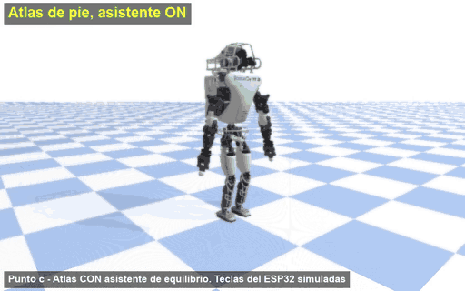
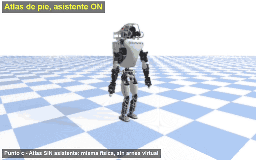
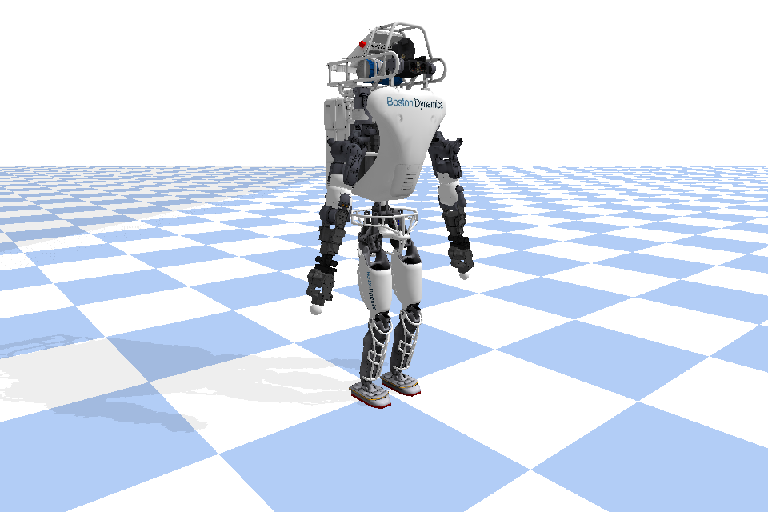
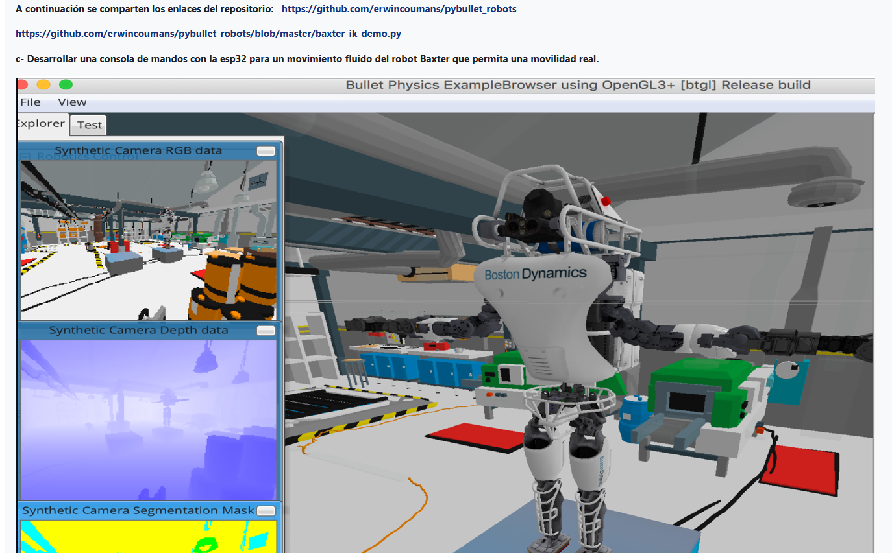
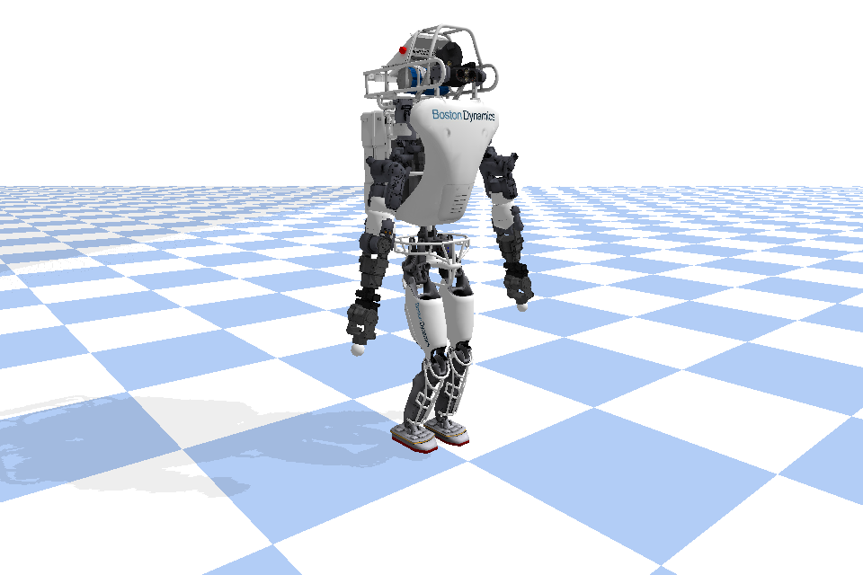
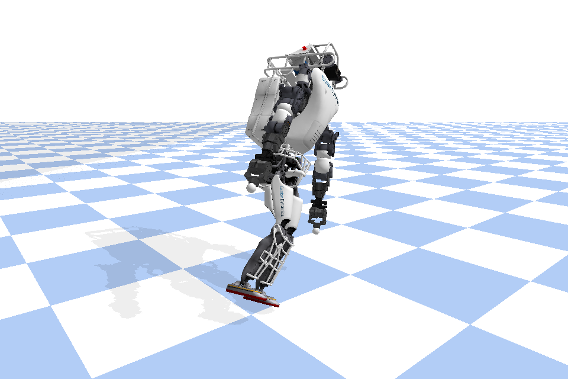
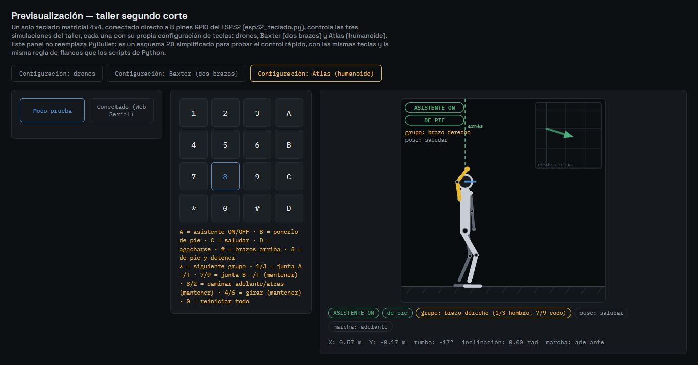
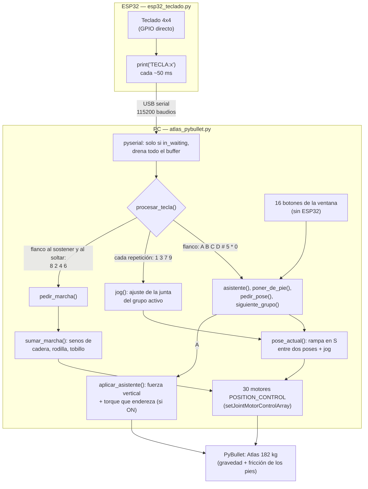
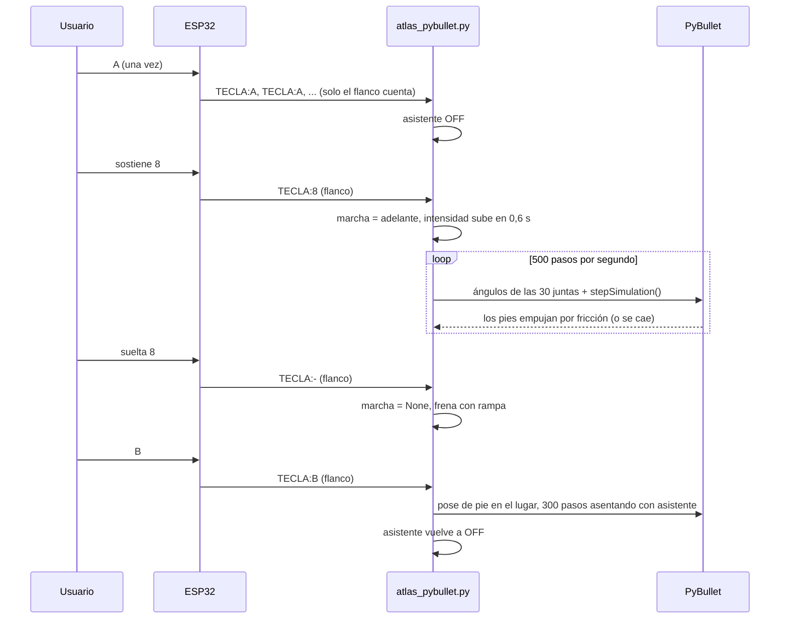

# Punto c) Atlas: un humanoide que se para, se mueve y camina desde el teclado

Basado en [atlas.py](https://github.com/erwincoumans/pybullet_robots/blob/master/atlas.py), del repositorio [pybullet_robots](https://github.com/erwincoumans/pybullet_robots) que compartió el profesor.

Atlas, el humanoide de Boston Dynamics, manejado entero desde el teclado 4x4 del ESP32: se le mueven brazos, torso, cabeza y piernas junta por junta, se lo manda a poses (saludar, agacharse, brazos arriba), camina hacia adelante y hacia atrás y gira dando pasos, todo con física real. La gracia está en una tecla, la `A`: prende y apaga un **asistente de equilibrio** (un arnés virtual), así que la misma caminata se puede probar con ayuda y sin ella, y ver dónde la física sola aguanta y dónde no. Si se cae, la `B` lo pone de pie. En el montaje real funcionó con el teclado respondiendo en todas las teclas.

<table>
  <tr>
    <th>Con asistente: camina, gira, saluda, se agacha</th>
    <th>Sin asistente: camina derecho, gira y se cae, B lo levanta</th>
  </tr>
  <tr>
    <td></td>
    <td></td>
  </tr>
  <tr>
    <td>Video completo: <a href="video/atlas-con-asistente.mp4">atlas-con-asistente.mp4</a></td>
    <td>Video completo: <a href="video/atlas-sin-asistente.mp4">atlas-sin-asistente.mp4</a></td>
  </tr>
</table>



## Qué pedía el enunciado



El texto del punto c) dice: "Desarrollar una consola de mandos con la esp32 para un movimiento fluido del robot Baxter que permita una movilidad real". Pero la imagen no es Baxter: es el humanoide **Atlas** de Boston Dynamics parado sobre una plataforma azul, que es justamente lo que carga `atlas.py` del repositorio enlazado. El texto parece copiado del punto b) (que sí es Baxter), así que este punto se hizo con Atlas. (Una primera versión de este punto usó un robot de reemplazo; quedó en el historial de git.)

## Qué es Atlas

Atlas es un robot humanoide bípedo (camina en dos piernas) de Boston Dynamics, hecho para el DARPA Robotics Challenge. El modelo que usamos (`atlas_v4_with_multisense.urdf`) tiene **30 articulaciones** de giro y pesa **182,4 kg** en total (lo medimos sumando las masas de los links del URDF). Casi la mitad de ese peso, 84 kg, está en el torso superior (`utorso`).

| Zona | Juntas | Qué mueven |
|---|---|---|
| Espalda | `back_bkz`, `back_bky`, `back_bkx` | girar el torso, inclinarlo adelante/atrás, inclinarlo de costado |
| Cuello | `neck_ry` | cabeza arriba/abajo |
| Cada brazo (`l_arm_`, `r_arm_`) | `shz`, `shx`, `ely`, `elx`, `wry`, `wrx`, `wry2` | hombro (2), codo (2), muñeca (3) |
| Cada pierna (`l_leg_`, `r_leg_`) | `hpz`, `hpx`, `hpy`, `kny`, `aky`, `akx` | cadera (girar, abrir, adelante/atrás), rodilla, tobillo (adelante/atrás, de costado) |

Las letras del final dicen el eje: `z` es girar sobre la vertical, `y` es adelante/atrás y `x` es de costado. En el script las juntas se buscan **por nombre** (`e.juntas["l_leg_kny"]`), no por número, así no hay que acordarse de que la rodilla izquierda es la 21.

## Los modelos 3D reales

Las mallas de Atlas no vienen en el paquete `pybullet_data`, así que se bajan una sola vez con `descargar_modelos.py`, en la carpeta del taller:

```
entorno\Scripts\python descargar_modelos.py
```

Baja unos 14 MB del repositorio del profesor a `9-taller-segundo-corte/modelos/`, que no se sube a GitHub (está en el `.gitignore`). Si falta, `atlas_pybullet.py` corre solo el descargador una vez; si no hay internet, avisa qué comando correr y se cierra. La plataforma azul de la imagen (`boston_box.urdf`) tampoco viene en `pybullet_data`; no la pusimos porque Atlas camina y se caería del borde.

| De pie, con el asistente | Caminando | Sin asistente, en el piso |
|---|---|---|
|  |  |  |

## Cómo se maneja: comportamientos y modos

Todo lo que hace Atlas sale de 16 teclas. Hay tres maneras de reaccionar a una tecla, y conviene tenerlas claras porque el ESP32 repite la tecla sostenida cada 50 ms (`TECLA:8`, `TECLA:8`, ...):

- **De un golpe (flanco):** `A B C D # 5 * 0` actúan solo cuando la tecla cambia. Sostener `A` medio segundo manda unas 10 líneas `TECLA:A` y el asistente conmuta **una sola vez** (está medido).
- **Sostenida (flanco al sostener y al soltar):** `8 2 4 6` arrancan la marcha al empezar a sostenerlas y la frenan al soltarlas.
- **Repetida (jog):** `1 3 7 9` actúan en cada repetición: sostener es seguir moviendo.

### El asistente de equilibrio (`A`)

A los humanoides reales se los prueba colgados de un **arnés** o de una grúa: si pierden el equilibrio, el arnés los ataja, y así se puede ensayar la marcha sin romper el robot. Nuestro asistente es eso, un arnés virtual que se prende y se apaga con `A`. Arranca prendido.

Qué hace:

- **Sostiene la mitad del peso** con una fuerza vertical sobre la pelvis (`ALFA_PESO = 0.5`), más un amortiguador vertical para que no rebote. En rehabilitación esto se llama *body weight support*.
- **Endereza la pelvis**: si se inclina, aplica un torque proporcional a la inclinación (más un amortiguador), con un tope de 2500 N·m para que no sea un "brazo de dios".

Qué NO hace:

- **No empuja en horizontal ni gira el rumbo.** La fuerza es solo vertical y el torque solo corrige la inclinación (el eje es `up × z`, que nunca tiene componente vertical). Todo lo que el robot avanza o gira sale de la fricción de los pies, con o sin asistente.
- **No mueve las juntas ni cambia la caminata.** El patrón de pasos es el mismo con el asistente prendido o apagado; lo único que cambia son esas dos fuerzas sobre la pelvis.
- **No levanta a un robot tirado.** Si ya está en el piso, no hace nada (empujar con 2500 N·m un cuerpo acostado lo haría dar vueltas); para eso está `B`.

Primero probamos el asistente con un `createConstraint(JOINT_FIXED)` entre la pelvis y el mundo, moviendo el pivote a la x, y actual de la pelvis en cada paso para que solo corrigiera altura y orientación. No sirvió: una restricción fija le pide al solver de Bullet velocidad relativa cero en los seis ejes, así que también frena el avance aunque el pivote lo siga. Con `maxForce` de 2000 N el robot avanzó −1,7 cm en 10 s de caminata, contra 1,21 m con el arnés de fuerzas. Con 500 N sí avanzó (1,13 m), pero 500 N es menos de un tercio del peso: ya no lo sostiene. Por eso quedó con fuerzas externas (`applyExternalForce` y `applyExternalTorque` en cada paso de física).

En pantalla siempre se ve `ASISTENTE: ON/OFF` y `ESTADO: de pie/CAIDO` (en rojo si está caído o sin asistente). Caído quiere decir pelvis a menos de 55 cm del piso o inclinada más de 0,6 rad, unos 34°.

### Ponerlo de pie (`B`) y reiniciar (`0`)

`B` es la grúa: deja al robot donde está (misma x, y y rumbo), le pone las juntas en la pose de pie, calcula la altura de la pelvis para que las suelas toquen justo el piso (con la caja que envuelve a cada pie, no a ojo) y lo deja asentarse 300 pasos de física (0,6 s) con el asistente prendido. Después **el asistente vuelve a como lo tenía el usuario**: si estaba apagado, queda apagado, y se ve si se sostiene solo. En la prueba lo tiramos 3 veces con un empujón y las 3 veces quedó de pie los 5 s siguientes sin asistente.

`0` reinicia todo: lo lleva al origen mirando hacia adelante, con el asistente prendido, el grupo de juntas en "brazo izquierdo", sin marcha y sin ajustes de jog.

### Mover el cuerpo junta por junta (`*`, `1`/`3`, `7`/`9`)

Las juntas están en cuatro grupos y `*` pasa al siguiente (brazo izquierdo → brazo derecho → torso y cabeza → piernas → brazo izquierdo...). Cada grupo tiene dos "juntas" de jog: la A se mueve con `1`/`3` y la B con `7`/`9`. Cada repetición de la tecla (20 por segundo mientras se sostiene) mueve 0,03 rad, así que sostenerla mueve unos 0,6 rad por segundo. Nunca pasa del límite que trae el URDF.

| Grupo | Junta A (`1` −, `3` +) | Junta B (`7` −, `9` +) |
|---|---|---|
| brazo izquierdo | hombro (`l_arm_shx`): + sube el brazo | codo (`l_arm_elx`): + lo dobla |
| brazo derecho | hombro (`r_arm_shx`): + sube el brazo | codo (`r_arm_elx`): + lo dobla |
| torso y cabeza | giro del torso (`back_bkz`): + a la izquierda | cabeza (`neck_ry`): + mira abajo |
| piernas | agachar: cadera, rodilla y tobillo de las dos piernas a la vez | peso a la derecha: caderas y tobillos de costado |

En las piernas una tecla mueve varias juntas a la vez: doblar solo una rodilla tumbaría al robot, en cambio doblar cadera −1, rodilla +2 y tobillo −1 (las dos piernas) lo agacha con los pies planos. El grupo activo y lo que mueven `1/3` y `7/9` se leen en la segunda línea del texto de arriba del robot.

### Poses de un golpe (`C`, `D`, `#`, `5`)

`C` saluda (brazo derecho arriba y el codo va y viene), `D` se agacha (la pelvis baja de 0,95 a 0,78 m, y detiene la marcha), `#` levanta los dos brazos y `5` vuelve a la pose de pie y detiene la marcha. Toda pose cambia con una **rampa en S de 0,6 s**: los motores nunca reciben un salto de ángulo. Lo que se haya movido con jog se funde en el punto de partida de la rampa.

Para el agachado medimos que inclinar el torso hacia adelante 0,3 rad o más lo tira de cara a los 2 s (sin asistente); con 0,15 se sostiene. Como cadera y tobillo se doblan lo mismo, la pelvis queda encima de los pies, y el torso, que es casi la mitad del peso, también.

### Caminar, retroceder y girar (`8`, `2`, `4`, `6` sostenidas)

Sosteniendo `8` camina hacia adelante y con `2` hacia atrás; `4` y `6` giran a la izquierda y a la derecha **dando pasos en el lugar**. Al soltar la tecla frena. Arrancar, frenar y pasar de caminar a girar se hace con rampa de 0,6 s (la intensidad de la marcha, la zancada y el giro suben y bajan de a poco), así nunca hay un tirón. Detalles que se notan al usarlo:

- Si estaba agachado o con las piernas o el torso movidos con jog, al pedir la marcha vuelve primero a la pose de pie (con rampa) mientras arranca. Con el saludo o los brazos arriba camina igual.
- Si se cae mientras camina, deja de pedirle la marcha (solo lo arrastraría por el piso) y avisa "Se cayo: B para ponerlo de pie". Si está en el piso, `8 2 4 6` no hacen nada hasta levantarlo.

### Qué esperar con y sin asistente

Medido con `probar_atlas.py` (sin ventana, simulando el ESP32: una línea `TECLA:x` cada 50 ms). La simulación es determinista: sale igual cada vez.

| Prueba | Con asistente | Sin asistente |
|---|---|---|
| De pie quieto 20 s | de pie los 20 s | de pie los 20 s |
| Caminar adelante 15 s (`8`) | de pie, avanzó 188 cm | depende del arranque: recién creado se cae a los 5,4 s (72 cm); en la prueba de estrés, tras otras pruebas en el mismo mundo, aguantó los 15 s (167 cm) |
| Arrancar y frenar 5 veces (3 s con `8`, 1 s suelta) | de pie los 20 s, avanzó 129 cm | **se cae a los 9,8 s**, después de avanzar 82 cm |
| Girar a la izquierda 8 s (`4`) | de pie, giró 151° | **se cae a los 2,5 s** (giró 23°) |
| Caminar atrás 8 s (`2`) | de pie, retrocedió 94 cm | **se cae a los 2,4 s** |
| Poses seguidas, 4 s cada una (`C`, `D`, `#`, `5`) | todas bien | todas bien |
| Tirarlo y levantarlo con `B`, 3 veces | — | 3/3 de pie, y se sostiene solo 5 s |

Lo que dice la tabla: de pie y en las poses Atlas se sostiene solo, porque el centro de masa queda quieto sobre las dos suelas. Caminar derecho, sin parar, está justo en el borde: a veces aguanta (en la prueba de estrés, 15 s y 167 cm, unos 11 cm/s) y a veces no (recién creado y con la misma tecla se cae a los 5,4 s). El resultado cambia con el estado en el que arranca, que es justamente lo que significa no tener margen de equilibrio. Lo que no logra sin asistente es arrancar y frenar varias veces seguidas, girar en el lugar y caminar hacia atrás: en esos casos el patrón fijo, sin ninguna realimentación, deja el centro de masa fuera del pie de apoyo y se cae en pocos segundos. Con el asistente hace todo, unos 12,5 cm/s hacia adelante y 19° por segundo girando.

### Experimentos para probar las físicas

Una guía corta para la demo (vale igual con el teclado o con los botones de la ventana):

1. **Camina derecho sin asistente.** `A` (queda en rojo `ASISTENTE: OFF`) y sostener `8`: camina unos metros sin que nada lo sostenga, pero está al borde: según cómo arranque aguanta o se cae a los pocos segundos (5,4 s en una corrida recién creada).
2. **Gira sin asistente.** Sin soltar el modo OFF, sostener `4`: alcanza a girar unos 23° y a los ~2,5 s se va al piso (`ESTADO: CAIDO`).
3. **Levántalo.** `B`: queda de pie en el mismo lugar y el asistente sigue en OFF; se queda parado solo.
4. **Prende el asistente y repite.** `A` y sostener `4`: ahora gira sin caerse (151° en 8 s). Lo mismo con `2` (atrás).
5. **Arranca y frena sin asistente.** Con `A` en OFF, sostener y soltar `8` varias veces seguidas: a la tercera tanda ya se cae. Con el asistente prendido no.
6. **Poses sin asistente.** `C`, `D`, `#` y `5` con el asistente apagado: todas se sostienen solas, porque el centro de masa no sale de las suelas.

### Tres formas de controlarlo

**1. El teclado físico (ESP32 por USB).** El teclado va directo a los GPIO del ESP32 (filas 14, 27, 26, 25; columnas 33, 32, 18, 19) y el firmware común `esp32_teclado.py` manda `TECLA:x` por serial. Es el modo principal: las teclas sostenidas (caminar, girar, jog) se sienten como un control de videojuego. La tercera línea del texto sobre el robot muestra la última línea cruda que llegó del ESP32, útil para ver si el teclado está mandando.

**2. Los botones de la ventana de PyBullet (sin ESP32).** Si el script no encuentra el ESP32, sigue igual y arriba se lee `ESP32: no conectado (usa los botones)`. A la derecha hay un botón por tecla, con la tecla entre paréntesis. Como un click no se puede sostener, los de caminar y girar se prenden con un click y se apagan con el siguiente, y los de jog mueven 0,15 rad por click (5 repeticiones). Los botones también funcionan con el ESP32 conectado: como la marcha cambia solo en los flancos, las `TECLA:-` repetidas del ESP32 no apagan una caminata prendida con un botón.

**3. El `preview.html` del taller (en el navegador).** Es una página suelta, en la carpeta del taller, con la configuración "Atlas (humanoide)": un teclado 4x4 clicable con las mismas reglas de flanco y sostener, y un esquema 2D de Atlas de lado con el arnés dibujado cuando el asistente está ON. En **modo prueba** simula todo en JavaScript con las cifras medidas (velocidades, giro y los tiempos de caída sin asistente), sin abrir PyBullet; en **modo conectado** se conecta por Web Serial (Chrome o Edge) al mismo ESP32 y muestra las líneas que llegan, para probar el teclado sin correr Python.



## Por qué caminar es difícil para un bípedo

Un objeto se mantiene en pie mientras la vertical de su **centro de masa** cae dentro de su **polígono de apoyo**, que es la figura que forman los puntos que tocan el piso. Un cuadrúpedo siempre puede tener al menos dos patas en diagonal apoyadas, y su polígono es grande. Un bípedo, para dar un paso, tiene que levantar un pie, y en ese momento el polígono de apoyo es **una sola suela** de 23 × 13 cm con 182 kg encima.

Por eso nuestra caminata hace tres cosas a la vez en cada paso:

1. **Pasa el peso de costado** (caderas `hpx` y tobillos `akx`) para dejar el centro de masa encima del pie que se queda en el piso, *antes* de levantar el otro. Sin esto, al levantar un pie el robot cae hacia ese lado.
2. **Levanta el pie** doblando la rodilla (`kny`) solo en la pierna que va por el aire.
3. **Da la zancada** con la cadera (`hpy`): en el aire la pierna va de atrás hacia adelante y apoyada va de adelante hacia atrás, y eso es lo que empuja el cuerpo. El tobillo (`aky`) compensa para que la suela quede siempre plana.

Para girar se suma una cuarta: la cadera vertical (`hpz`) de la pierna que va por el aire se abre hacia el lado del giro y, ya apoyada, vuelve, y eso rota la pelvis sobre el pie plantado. Nada gira ni mueve la base a mano.

No hay ningún sensor de equilibrio ni realimentación: es un patrón fijo (un **CPG**, *central pattern generator*: ángulos generados con senos, la pierna izquierda y la derecha en fase opuesta), así que funciona solo si el patrón está bien calibrado. Cuanto más largo el paso, más se aleja el centro de masa del pie de apoyo y más fácil es caerse. Eso explica la tabla de arriba: caminar derecho a ritmo constante es el caso para el que se calibró; arrancar, frenar, girar o retroceder sacan al centro de masa de ese equilibrio justo, y sin realimentación nada lo corrige (salvo el asistente).

### Cómo se eligieron los parámetros de la caminata

Con barridos sin ventana (20 s caminando, **sin asistente**, mismo patrón):

| Zancada (hpy) | Lateral (hpx) | Levantar (kny) | Frecuencia | Sin asistente, 20 s |
|---|---|---|---|---|
| 0,15 | 0,08 | 0,4 | 0,8 Hz | se cae a los 1,8 s |
| 0,07 | 0,05 | 0,3 | 0,8 Hz | se cae a los 10,2 s |
| 0,05 | 0,06 | 0,3 | 0,8 Hz | se cae a los 7,7 s |
| 0,05 | 0,055 | 0,4 | 0,8 Hz | se cae a los 6,3 s |
| 0,05 | 0,05 | 0,5 | 0,8 Hz | se cae a los 2,6 s |
| 0,05 | 0,05 | 0,3 | 0,8 Hz | de pie, 2,00 m |
| 0,05 | 0,045 | 0,4 | 0,8 Hz | de pie, 2,23 m |
| **0,05** | **0,05** | **0,4** | **0,8 Hz** | **de pie, 2,31 m (el que quedó)** |
| 0,05 | 0,05 | 0,4 | 1,0 Hz | de pie, 2,84 m |

Lo que sale de la tabla: sin asistente solo funcionan pasos cortos (0,05 rad de cadera) y un balanceo lateral justo; un poco más de lateral o de zancada y se cae. Usamos el mismo patrón con y sin asistente para que la comparación sea justa. Con 1,0 Hz también aguantó, pero quedamos en 0,8 Hz porque tenía vecinos estables por todos lados.

**Fuerzas de los motores.** El URDF trae el torque máximo de cada junta. Los de los brazos alcanzan, pero los del tobillo (92 y 45 N·m) y el del torso de costado (300 N·m) no sostienen 182 kg: con esos valores, solo inclinar las dos caderas 0,1 rad de costado tiró al robot. En piernas y espalda usamos al menos 800 y 1000 N·m (o el del URDF si es mayor, como la rodilla con 890).

## La idea general

Un solo teclado matricial controla todo (el firmware común está explicado en el [README del taller](../README.md)); esta es la configuración de Atlas:



Así se ve sostener `8` con el asistente apagado, y levantarlo con `B` si se cae:



## Lógica paso a paso

1. **Arranque.** Intenta abrir el serial dentro de un `try/except serial.SerialException`; sin ESP32 sigue con los botones. `crear_mundo(p.GUI)` carga el piso y Atlas con ruta absoluta, guarda las 30 juntas por nombre con su límite y su fuerza, pone fricción 1,0 en el piso y las suelas, y llama a `reiniciar_todo()`, que lo deja de pie y asentado.
2. **Paso de física (`paso()`), 500 por segundo.** Avanza la rampa de la pose y la de la marcha. Si el robot se cayó, deja de pedirle que camine (solo lo arrastraría por el piso). Calcula el ángulo de cada junta (`objetivos_motores()`: pose con rampa + jog + vaivén del saludo + patrón de pasos) y lo manda a los 30 motores en una sola llamada. Si el asistente está prendido, aplica sus fuerzas (PyBullet las borra después de cada paso, por eso van en cada uno) y avanza la física 1/500 s. Un paso tan fino mantiene estables los contactos de dos suelas con 182 kg encima.
3. **Teclas (`procesar_tecla()`).** El ESP32 repite la tecla sostenida cada 50 ms, así que cada tecla reacciona a lo que corresponde:
   ```python
   flanco = tecla != anterior
   if flanco and anterior in TECLAS_MARCHA and e.marcha == TECLAS_MARCHA[anterior]:
       pedir_marcha(e, None)            # soltó 8/2/4/6: frena con rampa
   if flanco and tecla in TECLAS_MARCHA:
       pedir_marcha(e, TECLAS_MARCHA[tecla])
   if tecla in ("1", "3", "7", "9"):    # jog: cada repetición
       jog(e, 0 if tecla in "13" else 1, -1 if tecla in "17" else 1)
   if not flanco:
       return                           # A, B, C, D, #, 5, *, 0: solo el flanco
   ```
   Como la marcha cambia solo en los flancos, las `TECLA:-` repetidas no apagan una caminata que se prendió con el botón de la ventana.
4. **Bucle de la ventana (`main()`).** Cada vuelta lee el serial solo si `ser.in_waiting` (un `readline()` a secas bloquearía la física) y drena todo el buffer; si el ESP32 se desconecta, sigue con los botones. Lee los 16 botones (creados una sola vez, antes del bucle), simula 10 pasos de física (20 ms), reescribe el texto de arriba del robot solo si cambió, mueve la cámara para seguirlo sin cambiarle el ángulo al usuario, y duerme solo lo que sobre para ir a tiempo real.
5. **Texto en pantalla.** Tres líneas arriba del robot: `ASISTENTE: ON/OFF | ESTADO: de pie/CAIDO` (roja si está caído o sin asistente), el grupo activo con lo que mueven `1/3` y `7/9` y la marcha, y la última tecla con la **línea cruda** del ESP32. Si esa línea nunca cambia, el ESP32 no está mandando nada; si cambia pero no dice `TECLA:x`, el problema es de formato, no de cable.

El módulo se puede importar sin abrir ventana (todo vive en un objeto `Estado`, sin globales): `crear_mundo(modo)`, `asistente(e, activo)`, `poner_de_pie(e)`, `reiniciar_todo(e)`, `procesar_tecla(e, tecla)`, `paso(e)`, `simular(e, segundos, tecla)` y `leer_estado(e)`. La prueba de estrés y las capturas lo usan así.

## La prueba de estrés

`probar_atlas.py` corre todo en modo `DIRECT` (sin ventana, alrededor de un minuto) pasando por las mismas funciones que la ventana y simulando el protocolo del ESP32 (una línea `TECLA:x` cada 50 ms). Hace, con y sin asistente, las pruebas de la tabla de [Qué esperar con y sin asistente](#qué-esperar-con-y-sin-asistente), y además:

- **Ponerlo de pie:** lo tira 3 veces con un empujón de costado (1500 N durante 0,2 s, asistente apagado) y las 3 veces `B` lo dejó de pie. Después el asistente volvió a OFF y se sostuvo solo los 5 s siguientes.
- **Flanco:** 10 líneas `TECLA:A` seguidas (sostener `A` medio segundo) conmutaron el asistente **una sola vez**.

## El montaje y la demo

El montaje real es el mismo de todo el taller: el teclado 4x4 conectado directo a 8 GPIO del ESP32, y el ESP32 al PC por USB. Así quedó funcionando con Atlas:

| ESP32 con el teclado | El teclado |
|---|---|
|  |  |

Y así se ve Atlas manejado desde el teclado. A la izquierda con el asistente: camina, gira, saluda, se agacha y levanta los brazos. A la derecha con el asistente apagado: camina derecho 3 s, gira y se cae, y `B` lo pone de pie.

<table>
  <tr>
    <th>Con asistente</th>
    <th>Sin asistente</th>
  </tr>
  <tr>
    <td></td>
    <td></td>
  </tr>
</table>

- Video completo con asistente: [atlas-con-asistente.mp4](video/atlas-con-asistente.mp4)
- Video completo sin asistente: [atlas-sin-asistente.mp4](video/atlas-sin-asistente.mp4)

## Cómo probarlo

Los comandos van desde la carpeta del taller (`9-taller-segundo-corte\`), usando su entorno. Antes, una sola vez: `entorno\Scripts\python descargar_modelos.py`.

**Sin ESP32 conectado:**
1. `entorno\Scripts\python punto-c-atlas\atlas_pybullet.py`. En consola sale que no encontró el ESP32. Atlas aparece de pie, con el asistente prendido, y arriba se lee `ESP32: no conectado (usa los botones)`.
2. A la derecha hay un botón por acción, con su tecla entre paréntesis. Los de caminar y girar se prenden con un click y se apagan con el siguiente. Los de jog mueven 0,15 rad por click.
3. Seguir los [experimentos](#experimentos-para-probar-las-físicas): `Asistente ON/OFF (A)`, `Girar izquierda on/off (4)` para verlo caer, `Ponerlo de pie (B)` para levantarlo.
4. Sin Python: abrir `../preview.html` en Chrome o Edge, elegir "Configuración: Atlas (humanoide)" y usar el teclado en modo prueba.

**Con ESP32 conectado:**
1. Guardar `esp32_teclado.py` (en la carpeta del taller) como `main.py` en el ESP32 y cerrar Thonny.
2. Conectar el teclado directo a los GPIO del ESP32: filas a los GPIO 14, 27, 26 y 25 y columnas a los GPIO 33, 32, 18 y 19 (las columnas con la resistencia de pull-up interna). La tabla pin a pin está en el [README del taller](../README.md#conexiones).
3. Cambiar `PUERTO_SERIAL = "COM7"` al principio de `atlas_pybullet.py` por el COM que muestre el Administrador de dispositivos.
4. `entorno\Scripts\python punto-c-atlas\atlas_pybullet.py`. Sostener `8` lo hace caminar y al soltarla frena. Los botones de la ventana siguen funcionando a la par.

**La prueba de estrés:** `entorno\Scripts\python punto-c-atlas\probar_atlas.py` (sin ventana, alrededor de un minuto) imprime las tablas de arriba.

| Tecla | Efecto | Cómo reacciona |
|---|---|---|
| `A` | Asistente de equilibrio ON/OFF | flanco |
| `B` | Ponerlo de pie en el lugar (asienta 0,6 s con asistente y lo deja como estaba) | flanco |
| `C` | Saludar | flanco |
| `D` | Agacharse (detiene la marcha) | flanco |
| `#` | Brazos arriba | flanco |
| `5` | Pose de pie y detener | flanco |
| `*` | Siguiente grupo: brazo izq → brazo der → torso y cabeza → piernas | flanco |
| `1` / `3` | Junta A del grupo − / + | cada repetición (sostener = seguir) |
| `7` / `9` | Junta B del grupo − / + | cada repetición |
| `8` (sostener) | Caminar adelante | flanco al sostener y al soltar |
| `2` (sostener) | Caminar atrás | flanco al sostener y al soltar |
| `4` / `6` (sostener) | Girar a la izquierda / derecha dando pasos en el lugar | flanco al sostener y al soltar |
| `0` | Reiniciar todo (origen, asistente ON, grupo brazo izq) | flanco |

## Qué hace cada archivo

- **`atlas_pybullet.py`**: todo el punto c): serial, mundo, asistente, poses, jog, marcha, teclas y ventana. Se corre con `python atlas_pybullet.py` o se importa (ver su docstring).
- **`probar_atlas.py`**: la prueba de estrés en `DIRECT`.
- **`img/`**: capturas del modelo 3D (de pie con asistente, caminando y sin asistente).
- **`video/`**: los GIF y MP4 de la demo con y sin asistente.
- **`../descargar_modelos.py`**: baja las mallas de Atlas a `../modelos/`.
- **`../esp32_teclado.py`**: el firmware común del ESP32 (ver el README del taller).
- **`../preview.html`**: la consola en el navegador (modo prueba y Web Serial), con la configuración de Atlas.
- **`enunciado-actividad.png`**: la captura del enunciado de este punto.
