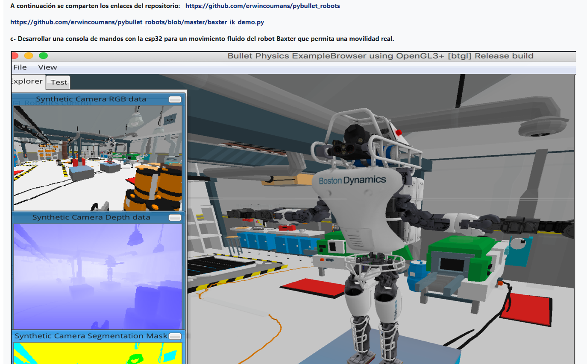
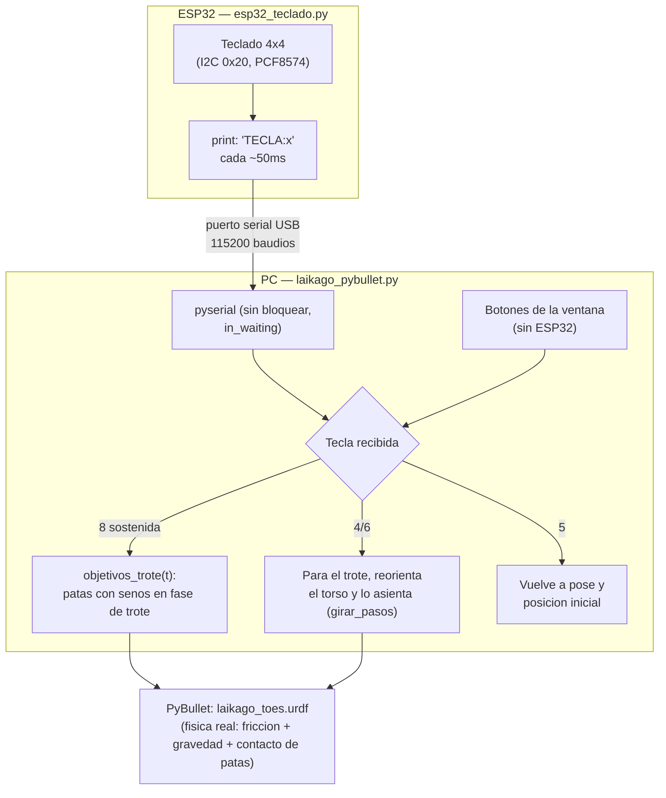

# Punto c) Locomoción real con las 4 patas (cuadrúpedo Laikago)

Basado en [laikago.py](https://github.com/erwincoumans/pybullet_robots/blob/master/laikago.py) del repositorio que compartió el profesor: el mismo robot (`laikago_toes.urdf`, ya incluido en `pybullet_data`) caminando con **física real** — nada de animaciones ni de teletransportar el cuerpo, el motor de físicas de PyBullet es el que efectivamente lo empuja hacia adelante a través del contacto real entre las patas y el piso.

## Por qué este punto es aparte del punto b)

Los puntos b) y c) del enunciado piden los dos "una consola de mandos con la ESP32 para un movimiento fluido... que permita una movilidad real", con el mismo texto casi calcado — pero la imagen del punto c) no muestra a Baxter (que es un robot de **torso fijo, sin piernas**: no puede caminar de ninguna manera), sino un robot con patas. La lectura más consistente es que el punto b) pide **movilidad del brazo** (posicionamiento + agarrar un objeto, cubierto en `../punto-b-brazo-tipo-baxter`) y el punto c) pide **movilidad real del cuerpo entero** — o sea, caminar de verdad — usando otro de los robots del mismo repositorio (`pybullet_robots` trae varios: `laikago.py`, `atlas.py`, `cassie.py`). Se eligió Laikago porque es el único de esos tres cuyo URDF y mallas ya vienen empaquetados en `pybullet_data` (Atlas y Cassie exigirían descargar sus propias mallas de `pybullet_robots/data/`, el mismo problema de peso que llevó a reemplazar a Baxter por el KUKA en el punto b).

## Por qué no se usó la caminata grabada del repositorio del profesor

`laikago.py` trae `data1.txt`, una grabación cuadro por cuadro de una caminata real capturada una sola vez. Se probó reproducirla tal cual (cargar cada cuadro, mandarlo a las 12 articulaciones) y el resultado fue un robot que mueve las patas de forma realista pero **casi no se desplaza** — la fricción/masas exactas con las que se grabó esa captura no coinciden del todo con las de este URDF simulado acá, así que alcanza para que las patas se vean bien pero no para que la física de contacto lo empuje con fuerza real hacia adelante. La primera solución que se probó fue "hacer trampa" empujando el cuerpo a mano cada cuadro (una técnica real, *root motion*, la misma que usan los personajes animados de un videojuego) — funcionaba, pero al no venir de la física de contacto, el robot se veía **deslizando/patinando** en vez de caminando, y no es lo que pide el punto c).

## Cómo camina de verdad: un CPG (generador de patrón central)

La solución que sí quedó con física real de punta a punta es un **CPG** (*central pattern generator*): en vez de una grabación, `objetivos_trote()` calcula el ángulo de cada articulación con una función seno, con las 4 patas en dos parejas diagonales en fase opuesta (FR+RL vs FL+RR) — el trote clásico de un cuadrúpedo, la misma idea que usan los ejemplos oficiales de PyBullet para el robot minitaur. La cadera se mueve adelante/atrás con el seno, y la rodilla se dobla (levanta el pie) solo durante la mitad de avance del ciclo, no durante el apoyo. Los tres parámetros (amplitud de cadera, amplitud de rodilla y frecuencia) salieron de probar **decenas de combinaciones**: las primeras, más agresivas, hacían caer al robot antes de completar un solo paso; los valores que quedaron (`AMPLITUD_CADERA=0.2`, `AMPLITUD_RODILLA=0.3`, `FRECUENCIA_TROTE=1.2`) caminan de corrido sin caerse, con el contacto pata-piso siendo lo único que mueve al robot.

Un detalle importante: recién cargado, el robot necesita "asentarse" en el piso (`reset_robot()` sostiene la pose de pie 250 pasos de física antes de devolver el control) — arrancar a trotar de un salto, sin ese asentado, lo hacía caer casi de inmediato porque las patas todavía no habían hecho contacto real.

## Por qué girar es lo único que sigue siendo una simplificación

Girar caminando de verdad (con zancadas más cortas de un lado que del otro, como un tanque) se probó, y el robot se caía con bastante frecuencia — ni el ejemplo del profesor resuelve el equilibrio de un cuadrúpedo girando, que es un problema de control bastante más difícil que caminar derecho (control con retroalimentación, no solo un patrón fijo). La solución que sí salió confiable fue **detener el trote, reorientar el torso a mano (`girar_pasos`) y asentarlo unos 80 pasos de física antes de devolver el control** — por eso, con este teclado, girar y caminar no se pueden combinar: primero se para, se gira, y recién ahí se puede volver a caminar (en la nueva dirección). Aun así, encadenar **muchos** giros grandes seguidos sin caminar de por medio puede llegar a hacer caer al robot (es física real: pasa lo mismo que le pasaría a un robot de verdad mal calibrado). Si eso pasa, `5` lo reinicia. Este es el único lugar del punto c) donde se usa una simplificación en vez de física de punta a punta — caminar derecho, en cambio, es 100% física real.

## La idea general

Un solo teclado matricial 4x4 controla todo (ver `../esp32_teclado.py`, el mismo firmware que usan `punto-a-drones-waypoints` y `punto-b-brazo-tipo-baxter`): esta es la **configuración de locomoción**, con este mapeo de teclas:

| Tecla | Efecto |
|---|---|
| `8` (mantener presionada) | Caminar hacia adelante (trote real generado con senos, física real) |
| `4` / `6` | Girar un poco a la izquierda/derecha (detiene el trote primero) |
| `5` | Reset: vuelve a la pose y posición inicial, parado |
| `0`, `1`, `3`, `7`, `9`, `A`, `B`, `C`, `D`, `*`, `#` | Sin uso en esta configuración |

## Conexiones (paso a paso)

Solo el teclado matricial va al ESP32 — no hace falta ningún otro sensor:

1. **Teclado matricial 4x4 → expansor I2C PCF8574 → ESP32** (dirección `0x20` de fábrica): `VCC`→`3V3`, `GND`→`GND`, `SDA`→`GPIO21`, `SCL`→`GPIO22`.
2. **ESP32 → PC**: un solo cable USB. Revisar en el Administrador de dispositivos qué puerto COM le asigna Windows y ponerlo en `PUERTO_SERIAL` dentro de `laikago_pybullet.py`.

## Cómo probarlo

**Sin ESP32 conectado:**
1. Activar el entorno (en la carpeta del taller): `..\entorno\Scripts\activate` (ya trae `pybullet` y `pyserial`).
2. `python laikago_pybullet.py`. Al no encontrar el ESP32, la ventana de PyBullet se abre igual con botones: "Caminar" alterna on/off con cada click, "Girar izquierda/derecha" gira un paso fijo por click, "Reset" vuelve a la pose inicial.

**Con ESP32 conectado:**
1. Guardar `../esp32_teclado.py` como `main.py` en el ESP32 y armar las conexiones de arriba.
2. Ajustar `PUERTO_SERIAL` en `laikago_pybullet.py` según el puerto COM del paso 2 de conexiones.
3. `python laikago_pybullet.py`. Mantener presionada la tecla `8` hace caminar al robot con física real; para girar, soltar `8` y sostener `4`/`6`.

## Pendiente

Se hicieron pruebas adicionales de la comunicación serial antes del montaje físico. Fotos del montaje y video de la demo — se agregan aquí antes de subir el tema al repositorio.
