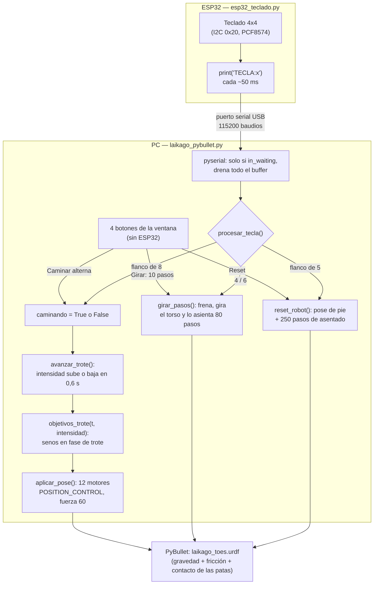
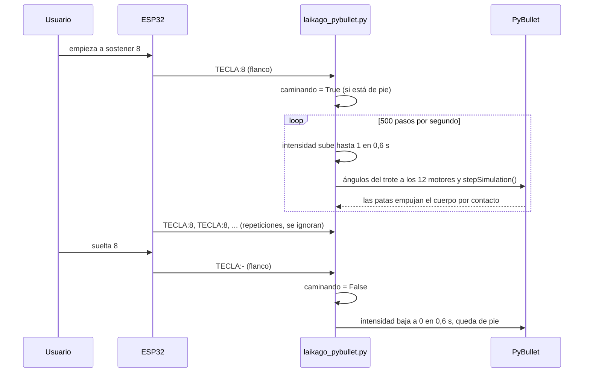

# Punto c) Locomoción real con las 4 patas (cuadrúpedo Laikago)

Basado en [laikago.py](https://github.com/erwincoumans/pybullet_robots/blob/master/laikago.py), del repositorio [pybullet_robots](https://github.com/erwincoumans/pybullet_robots) que compartió el profesor. El enunciado pide una consola de mandos con la ESP32 para un movimiento fluido del robot que permita una movilidad real:


## Qué pedía y qué hicimos

Hicimos que un robot de cuatro patas, el **Laikago**, camine con **física real** manejado desde el teclado del ESP32: sosteniendo `8` trota hacia adelante (arranca y frena suave, con rampa), con `4` y `6` gira a la izquierda o a la derecha, y `5` lo reinicia. Nada está animado ni se mueve el cuerpo a mano mientras camina: el script solo le dice a cada uno de los 12 motores de las patas a qué ángulo ir, y es el contacto de las patas con el piso (con fricción y gravedad) lo que empuja al robot hacia adelante. Si el patrón de movimiento estuviera mal, el robot se quedaría en el lugar o se caería, como uno de verdad.

Camina despacio (unos 6 cm/s), pero con los parámetros que dejamos no se cayó ni una vez en la prueba de estrés que le hicimos (más abajo están los números).

## Por qué este punto es aparte del punto b)

Los puntos b) y c) del enunciado piden casi con el mismo texto "una consola de mandos con la ESP32 para un movimiento fluido del robot Baxter que permita una movilidad real". Pero la imagen del punto c) no muestra a Baxter (que es un robot de **torso fijo, sin piernas**: no puede caminar de ninguna manera) sino un robot con patas, y el repositorio que se comparte trae varios robots caminantes. La lectura más consistente es que el punto b) pide **movilidad del brazo** (posicionar y agarrar un objeto, resuelto en [`punto-b-brazo-tipo-baxter`](../punto-b-brazo-tipo-baxter)) y el punto c) pide **movilidad real del cuerpo entero**, o sea caminar de verdad.

De los robots con patas de `pybullet_robots` (`laikago.py`, `atlas.py`, `cassie.py`) elegimos el Laikago porque es el único cuyo URDF y mallas ya vienen en el paquete `pybullet_data` (lo revisamos en el `entorno/` del taller). Atlas y Cassie cargan sus modelos desde la carpeta `data/` de ese repositorio, y descargarlos es el mismo problema de peso que nos llevó a cambiar Baxter por el KUKA en el punto b). Además, un bípedo como Atlas es un problema de equilibrio todavía más difícil que un cuadrúpedo.

## Qué es el Laikago

El Laikago es un robot cuadrúpedo (con forma de perro) de la empresa Unitree. Cada pata tiene **3 articulaciones**, 12 en total:

- **Abducción**: abre o cierra la pata hacia el costado (como separar las piernas). En nuestro trote queda fija en 0.
- **Cadera**: mueve la pata hacia adelante o hacia atrás (como balancear la pierna al caminar).
- **Rodilla**: dobla la pata, lo que levanta o baja el pie.

En el script, `JOINT_IDS` guarda los índices de esas 12 articulaciones en grupos de tres por pata, en el orden en que vienen en el URDF: **FR** (delantera derecha), **FL** (delantera izquierda), **RR** (trasera derecha) y **RL** (trasera izquierda). Las patas del lado derecho tienen la abducción al revés (`DIR_ABDUCCION = [-1, 1, -1, 1]`).

## Qué es un trote

Un cuadrúpedo puede mover las patas en varios órdenes (paso, trote, galope). El **trote** es el más simple y estable a velocidad baja: las patas se mueven **en parejas diagonales**. Mientras la delantera derecha y la trasera izquierda (FR + RL) están apoyadas empujando hacia atrás, la delantera izquierda y la trasera derecha (FL + RR) van por el aire hacia adelante, y medio ciclo después se intercambian. Siempre hay dos patas en diagonal apoyadas, así que el cuerpo no se va de lado.

## Qué es un CPG (generador de patrón central)

Un **CPG** (*central pattern generator*) es un circuito que produce un ritmo por sí solo, sin necesidad de una señal externa que lo marque paso a paso. El nombre viene de la biología: la médula espinal de los animales tiene redes de neuronas que generan el ritmo de caminar, y el cerebro solo les dice "más rápido", "más lento" o "para". En robótica, la versión más simple es calcular el ángulo de cada articulación con **funciones seno** del tiempo, desfasadas entre patas. Es la misma idea que usan los ejemplos oficiales de PyBullet para el robot Minitaur.

Nuestro CPG está en `objetivos_trote(t, intensidad)`:

```python
fase = 2 * math.pi * FRECUENCIA_TROTE * t + FASE_PATA[pata]
cadera = OFFSET_CADERA + intensidad * AMPLITUD_CADERA * math.sin(fase)
levantar = max(0.0, math.sin(fase))   # solo levanta el pie durante el avance
rodilla = OFFSET_RODILLA - intensidad * AMPLITUD_RODILLA * levantar
```

- **La cadera** oscila con un seno alrededor de su pose de pie (−0,7 rad), ±0,2 rad: la pata va hacia adelante y hacia atrás.
- **La rodilla** se dobla (levanta el pie) solo durante la mitad del ciclo en que la pata avanza, cuando el seno es positivo. En la otra mitad, la de apoyo, queda estirada en su pose de pie (0,7 rad) y empuja el cuerpo.
- **`FASE_PATA = [0, π, π, 0]`** (FR, FL, RR, RL) pone a FR y RL en fase, y a FL y RR en contrafase: el trote diagonal.
- **`intensidad`** (de 0 a 1) escala las dos amplitudes. Con 0, todas las patas quedan en la pose de pie sin importar `t`; con 1, trote completo. Es la perilla que usa la rampa para arrancar y frenar.

## Por qué no usamos la caminata grabada del repositorio del profesor

`laikago.py` trae `data1.txt`, una grabación cuadro por cuadro de una caminata real, y la reproduce mandando cada cuadro a las 12 articulaciones. La probamos tal cual, y el robot movía las patas de forma muy realista pero **casi no se desplazaba**: la fricción y las masas con las que se grabó esa captura no coinciden con las de este URDF simulado, así que las patas se ven bien pero la física de contacto no llega a empujarlo.

La primera solución que probamos fue empujar el cuerpo a mano en cada cuadro mientras se reproducía la grabación. Es una técnica real (*root motion*, la usan los personajes animados de los videojuegos) y funcionaba, pero al no venir de la física de contacto el robot se veía **patinando** en vez de caminando. No era lo que pedía el punto, así que la descartamos y pasamos al CPG, donde todo el desplazamiento viene del contacto de las patas con el piso.

## Cómo encontramos los parámetros: la prueba de estrés

Las primeras combinaciones de amplitud, frecuencia y fuerza tiraban al robot al piso. Para no ajustar a ojo, armamos una prueba en modo `DIRECT` (sin ventana, mucho más rápido): 9 tandas de caminar entre 1,5 y 5 s y parar, girar a los dos lados, caminar otros 6 s, todo repetido con 4 juegos de duraciones distintas, más 30 s de trote seguido. Los resultados, que quedaron anotados en el código:

| Fuerza | Cadera | Rodilla | Frecuencia | Resultado |
|---|---|---|---|---|
| 35 | 0,20 | 0,3 | 1,2 Hz | 3 caídas, y también se caía caminando derecho a los ~8 s (primera versión) |
| varias | 0,25 | varias | varias | de 4 a 9 caídas; más rápido (0,15 a 0,38 m/s) pero la zancada larga lo desbalancea |
| **60** | **0,20** | **0,4** | **1,5 Hz** | **0 caídas en las 4 variantes**, 30 s derecho sin desviarse, ~0,06 m/s |

Lo que más ayudó fue **levantar más el pie** (rodilla 0,4 en vez de 0,3): con 0,3, la pata que iba por el aire a veces rozaba el piso y frenaba de golpe esa esquina del robot. La fuerza (`FUERZA_MOTOR`, 60) es el torque máximo que cada motor puede hacer para seguir el ángulo pedido: con más fuerza, cada pata sigue el seno con menos retraso. El precio de todo esto es la velocidad: unos 6 cm/s.

## Tres detalles que hicieron falta para que no se caiga

- **Asentarse antes de trotar.** Recién cargado, el robot está en el aire y cae sobre sus patas. `reset_robot()` lo pone en la pose de pie y corre 250 pasos de física (medio segundo) sosteniéndola antes de devolver el control. Arrancar a trotar de un salto, sin ese asentado, lo tumbaba casi de inmediato porque las patas todavía no habían hecho contacto real con el piso.
- **Arrancar y frenar con rampa.** `avanzar_trote()` sube la intensidad de 0 a 1 en 0,6 s al pulsar `8` y la baja de 1 a 0 al soltarla, como un animal que acelera y frena en unos pasos. En la primera versión, soltar la tecla pasaba en un solo paso de física de media zancada a la pose de pie (y al volver a pulsarla, al inicio del seno): un tirón de unos 0,2 rad en los 8 motores de cadera y rodilla a la vez que, con 2 o 3 ciclos de soltar y pulsar, terminaba con el robot en el piso. Con la rampa la pose pedida es continua siempre, y el reloj del trote no necesita volver a 0 al reanudar (con intensidad 0, cualquier fase da la pose de pie).
  ```python
  delta = PASO_FISICA / RAMPA_TROTE
  if caminando:
      intensidad_trote = min(1.0, intensidad_trote + delta)
  else:
      intensidad_trote = max(0.0, intensidad_trote - delta)
  ```
- **Girar parado, no caminando.** Lo explicamos en la sección siguiente.

## Por qué girar es lo único que sigue siendo una simplificación

Girar caminando de verdad (con zancadas más cortas de un lado que del otro, como un tanque) lo probamos, y el robot se caía con bastante frecuencia. El equilibrio de un cuadrúpedo girando necesita control con realimentación (medir la inclinación del cuerpo y corregir), no solo un patrón fijo; ni el ejemplo del profesor lo resuelve. Lo que sí salió confiable fue:

1. frenar el trote del todo, con la misma rampa (`frenar_del_todo()`), para no girar con un pie en el aire;
2. girar el torso un poco sobre su orientación real de ese momento (`girar_pasos()`, 0,015 rad por línea recibida);
3. dejarlo asentarse 80 pasos de física antes de seguir. Con 30 pasos a veces le quedaba un resto de velocidad que le quitaba estabilidad al volver a trotar.

Por eso, con este control, girar y caminar no se combinan: se para, se gira y recién ahí se vuelve a caminar en la nueva dirección. Sosteniendo `4`/`6` gira unos 17° por segundo (0,015 rad × 20 líneas por segundo); cada click de los botones de la ventana gira unos 9°. El giro se aplica sobre la orientación real del torso (no se "corrige" el rumbo a uno guardado): caminando, el trote se desvía un par de grados, y pisar ese rumbo con uno guardado sería corregirlo a mano sin que nadie lo pida.

Si el robot llegara a caerse, no se lo deja girar: reorientar un cuerpo tumbado lo mete dentro del piso y la física lo expulsa volando (lo vimos salir a 2 m de altura). En ese caso avisa una sola vez por consola que hay que usar Reset (`5`). Este es el único lugar del punto c) donde hay una simplificación; caminar derecho es física real de punta a punta.

## La idea general

Un solo teclado matricial controla todo (el firmware común está explicado en el [README del taller](../README.md)); esta es la **configuración de locomoción**:

| Tecla | Efecto | Cómo reacciona |
|---|---|---|
| `8` (sostener) | Caminar hacia adelante; al soltarla frena con rampa | al flanco: cuando se empieza a sostener y cuando se suelta |
| `4` / `6` (sostener) | Girar a la izquierda / derecha (frena el trote primero) | en cada repetición: sostener es seguir girando |
| `5` | Reset: vuelve a la pose y posición inicial, parado y asentado | al flanco |
| `0`, `1`, `3`, `7`, `9`, `A`, `B`, `C`, `D`, `*`, `#` | Sin uso en esta configuración | — |


```mermaid
flowchart TD
    subgraph ESP["ESP32 — esp32_teclado.py"]
        Teclado["Teclado 4x4<br/>(I2C 0x20, PCF8574)"] --> Envia["print('TECLA:x')<br/>cada ~50 ms"]
    end

    Envia -->|"puerto serial USB<br/>115200 baudios"| Recibe

    subgraph PC["PC — laikago_pybullet.py"]
        Recibe["pyserial: solo si in_waiting,<br/>drena todo el buffer"] --> Procesa{"procesar_tecla()"}
        Botones["4 botones de la ventana<br/>(sin ESP32)"] -->|"Caminar alterna"| Estado
        Botones -->|"Girar: 10 pasos"| Gira
        Botones -->|"Reset"| Reset
        Procesa -->|"flanco de 8"| Estado["caminando = True o False"]
        Procesa -->|"4 / 6"| Gira["girar_pasos(): frena, gira<br/>el torso y lo asienta 80 pasos"]
        Procesa -->|"flanco de 5"| Reset["reset_robot(): pose de pie<br/>+ 250 pasos de asentado"]
        Estado --> Rampa["avanzar_trote():<br/>intensidad sube o baja en 0,6 s"]
        Rampa --> CPG["objetivos_trote(t, intensidad):<br/>senos en fase de trote"]
        CPG --> Motores["aplicar_pose(): 12 motores<br/>POSITION_CONTROL, fuerza 60"]
    end

    Motores --> Sim["PyBullet: laikago_toes.urdf<br/>(gravedad + fricción + contacto de las patas)"]
    Gira --> Sim
    Reset --> Sim
```

Así se ve sostener `8` un rato y soltarlo:


```mermaid
sequenceDiagram
    participant U as Usuario
    participant E as ESP32
    participant P as laikago_pybullet.py
    participant S as PyBullet
    U->>E: empieza a sostener 8
    E->>P: TECLA:8 (flanco)
    P->>P: caminando = True (si está de pie)
    loop 500 pasos por segundo
        P->>P: intensidad sube hasta 1 en 0,6 s
        P->>S: ángulos del trote a los 12 motores y stepSimulation()
        S-->>P: las patas empujan el cuerpo por contacto
    end
    E->>P: TECLA:8, TECLA:8, ... (repeticiones, se ignoran)
    U->>E: suelta 8
    E->>P: TECLA:- (flanco)
    P->>P: caminando = False
    P->>S: intensidad baja a 0 en 0,6 s, queda de pie
```

## Conexiones

Solo el teclado matricial va al ESP32, a través del módulo PCF8574 por I2C (`SDA`→`GPIO21`, `SCL`→`GPIO22`, `VCC`→`3V3`, `GND`→`GND`, dirección `0x20`). La tabla pin a pin (qué fila y qué columna del teclado va a qué pin del PCF8574, y por qué) está en el [README del taller](../README.md#conexiones), porque es la misma para los tres puntos. El ESP32 va al PC por un solo cable USB; el puerto COM se pone en la constante `PUERTO_SERIAL` del script (por defecto `COM7`).

## Qué hace cada archivo

- **`laikago_pybullet.py`**: todo el punto c). Abre el serial (o sigue sin él), carga el Laikago, tiene el CPG (`objetivos_trote`), la rampa (`avanzar_trote`), el reset con asentado, el giro, la interpretación de teclas (`procesar_tecla`) y el bucle principal. Se corre con `python laikago_pybullet.py`.
- **`../esp32_teclado.py`**: el firmware común del ESP32 (ver el README del taller).
- **`enunciado-actividad.png`**: la captura del enunciado de este punto.

El robot (`laikago/laikago_toes.urdf`) y el piso salen de `pybullet_data`; este punto no trae modelos propios.

## La lógica del código paso a paso

### 1. Arranque y carga del robot

Intenta abrir el puerto dentro de un `try/except serial.SerialException` (sin ESP32, `ser` queda en `None`). Abre PyBullet en `GUI` con un paso de física de **1/500 s**, más fino que el de los otros dos puntos: con contactos que se abren y cierran todo el tiempo (cuatro pies golpeando el piso), un paso más chico hace la simulación más estable. Carga `laikago_toes.urdf` con la misma orientación inicial que usa `laikago.py` y con colisión propia activada (`URDF_USE_SELF_COLLISION`), y además habilita el choque entre las cuatro patas inferiores entre sí, igual que el ejemplo del profesor; si no, al caminar se atravesaban.

### 2. Mandar la pose a los motores (`aplicar_pose`)

Recibe los tres ángulos (abducción, cadera, rodilla) de cada pata y se los manda a los 12 motores con `POSITION_CONTROL` y fuerza máxima `FUERZA_MOTOR` (60). Se llama en cada paso de física: es la única forma en que el script "mueve" al robot mientras camina.

### 3. El reloj del trote y la rampa (`avanzar_trote`)

Cada paso de física, sube o baja la intensidad según `caminando` (ver el fragmento de arriba) y, solo si la intensidad es mayor que cero, avanza el reloj del CPG (`tiempo_trote`). Parado, el reloj se congela; al volver a caminar sigue desde donde quedó, y como la intensidad arranca en 0, no hay tirón.

### 4. Interpretar las teclas (`procesar_tecla`)

El ESP32 repite la tecla sostenida cada 50 ms, así que acá se decide qué reacciona al flanco y qué a cada repetición:

```python
anterior, tecla_anterior = tecla_anterior, tecla
if tecla == "8" and anterior != "8":
    caminando = esta_de_pie()
elif anterior == "8" and tecla != "8":
    caminando = False           # avanzar_trote() frena con rampa, no en seco
if tecla == "4":
    girar_pasos(-1)
elif tecla == "6":
    girar_pasos(1)
elif tecla == "5" and anterior != "5":
    reset_robot()
```

Que `8` reaccione al flanco (y no a cada línea) tiene una ventaja extra: el botón "Caminar" de la ventana también sirve con el ESP32 conectado. Antes, cada `TECLA:-` (20 por segundo) ponía `caminando = False` y anulaba el click al instante.

### 5. Girar (`girar_pasos`)

Revisa que el robot esté de pie (torso a más de 30 cm del piso; de pie queda a unos 56 cm), frena el trote del todo, compone un giro pequeño sobre el eje z con la orientación actual del torso, se la aplica con `resetBasePositionAndOrientation`, le pone la velocidad en cero y corre 80 pasos de física sosteniendo la pose de pie. Un detalle de signos que nos hizo equivocarnos al principio: en PyBullet, un yaw positivo es un giro antihorario visto desde arriba, o sea hacia la **izquierda**, así que "derecha" (dirección +1) usa un ángulo negativo. En la primera versión estaba al revés y las teclas giraban al contrario de su etiqueta (lo medimos en `DIRECT`: "derecha" subía el rumbo de 87° a 98°).

### 6. El bucle principal

En cada vuelta (500 por segundo): lee **todo** lo que haya en el puerto, solo si `ser.in_waiting` es mayor que cero (un giro corre 80 pasos de física por línea, así que leyendo una sola línea por vuelta se irían acumulando atrasadas); actualiza en la ventana la última línea cruda si cambió; lee los 4 botones ("Caminar" alterna encendido y apagado con cada click, porque un click no se puede sostener; "Girar" gira 10 pasos, unos 9°; "Reset"); si el robot se cayó, deja de pedirle caminar (solo lo arrastraría panza abajo); manda la pose actual del trote a los motores, avanza la rampa y la física, y duerme 1/500 s.

## Cómo probarlo

Los comandos van desde la carpeta del taller (`9-taller-segundo-corte\`), usando su entorno.

**Sin ESP32 conectado:**
1. `entorno\Scripts\python punto-c-locomocion-laikago\laikago_pybullet.py`. En consola sale que no encontró el ESP32, el robot aparece, cae sobre sus patas y se asienta; arriba se lee `ESP32: no conectado (usa los botones)`.
2. A la derecha hay 4 botones: "Caminar (alternar on/off)" empieza a trotar con un click y frena con el siguiente; "Girar izquierda (un paso)" y "Girar derecha (un paso)" giran unos 9° por click (si estaba caminando, primero frena); "Reset" lo devuelve al inicio.

**Con ESP32 conectado:**
1. Guardar `esp32_teclado.py` (en la carpeta del taller) como `main.py` en el ESP32, armar las conexiones del [README del taller](../README.md#conexiones) y cerrar Thonny.
2. Cambiar `PUERTO_SERIAL = "COM7"` al principio de `laikago_pybullet.py` por el COM que muestre el Administrador de dispositivos.
3. `entorno\Scripts\python punto-c-locomocion-laikago\laikago_pybullet.py`. Mantener presionada la tecla `8` hace caminar al robot; al soltarla frena en unos pasos. Para girar, soltar `8` y sostener `4` o `6`. `5` lo reinicia si se cae. Los botones de la ventana siguen funcionando a la par.
4. Arriba del robot se ve la última línea cruda que llegó del ESP32 (`ESP32: TECLA:-`, `ESP32: TECLA:8`...): si nunca cambia, el ESP32 no está mandando nada (revisar el puerto y que `main.py` esté corriendo); si cambia pero no dice `TECLA:x`, el problema es de formato, no de cable.

## Pendiente

Se hicieron pruebas adicionales de la comunicación serial antes del montaje físico. Faltan las fotos del montaje y un video del Laikago caminando y girando desde el teclado; se agregan aquí cuando estén.
