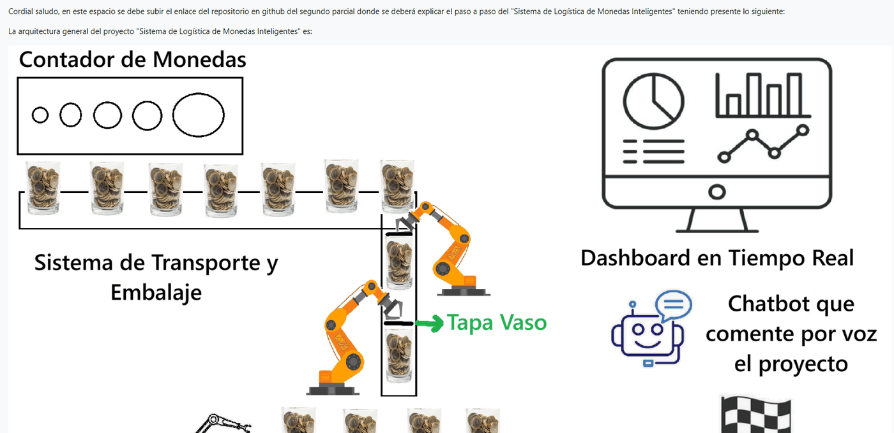

# Sensores · Teoría 2026-2

Repositorio con las investigaciones y proyectos de la materia de Sensores, semestre 2026-2. Cada tema tratado en clase vive en su propia carpeta, con su propio README explicando de qué se trata, y al final está el proyecto final del corte. Varios temas están basados en el repositorio [U_Militar](https://github.com/dialejobv/U_Militar/blob/main/README.md).

## Temas

### 1. [esp32-investigacion](./1-esp32-investigacion)
Investigación a fondo sobre el ESP32: de dónde viene la idea del microcontrolador, la historia de Espressif y el ESP8266 detrás, y cómo está armado el chip por dentro (pinout, ADC/DAC, periféricos). Cierra con cómo se programa, su costo ambiental y para qué se usa en la práctica, más un script corto que comprueba la ficha técnica en la placa real.

### 2. [Lenguajes: por qué Thonny](./2-lenguajes-thonny)
Qué es Thonny, cómo se conecta con MicroPython, y por qué programar el ESP32 con MicroPython es un camino distinto a hacerlo con C/C++ vía Arduino. Incluye cómo instalar MicroPython en el ESP32, una comparación directa entre ambos enfoques y el mismo código en los dos lenguajes (un semáforo que mide en microsegundos cuánto tarda cada uno y un display de siete segmentos en Wokwi). Basado en [Instalación de Thonny — NODEMCU V3 ESP8266](https://github.com/dialejobv/U_Militar/blob/main/1%29%20Instalaci%C3%B3n%20Thonny/NODEMCU%20V3%20ESP8266.md).

### 3. [Detección de objetos](./3-deteccion-objetos)
Un modelo YOLO detecta objetos (silla, celular) desde la cámara de la computadora y le avisa al ESP32 por puerto serial para encender LEDs físicos en una protoboard. Con `--carro-moto` detecta en su lugar un carro y una moto de juguete (la directiva alternativa). Incluye el armado del circuito, el protocolo de comunicación con apagado de seguridad, un modo que funciona sin el ESP32 y gifs de la demo funcionando. Basado en [Explicación de la arquitectura YOLO](https://github.com/dialejobv/U_Militar/blob/main/2%29%20Yolo/Explicaci%C3%B3n_Arq_YOLO.md).

### 4. [Chatbot: asistente de voz](./4-chatbot-asistente-voz)
Comandos de voz que encienden y apagan LEDs en el ESP32: la voz se transcribe a texto, un modelo de lenguaje vía la API de DeepSeek interpreta la intención y la computadora le manda la orden al ESP32 por puerto serial, que confirma cada orden con un `OK`. Funciona también sin ESP32, sin micrófono (escribiendo la frase) o sin clave de la API (intérprete por palabras clave). Incluye el armado del circuito, el manejo seguro de la API key y gifs de la demo funcionando. Basado en [chatbot.py](https://github.com/dialejobv/U_Militar/blob/main/3%29%20chatbot/chatbot.py).

### 5. [Parcial: peces en el osciloscopio (modo XY)](./5-parcial-figuras-lissauer)
Parcial del primer corte, a partir de las figuras de Lissajous. El ESP32 usa sus dos salidas DAC para dibujar peces en un osciloscopio puesto en modo XY, combinando elipses, líneas y curvas Bezier para armar la figura. Incluye dos versiones del script (un pez o tres) y gifs mostrando la figura trazándose en pantalla.

### 6. [Control de iluminación por gestos](./6-control-de-led-mediante-gestos)
Una página web reconoce gestos de la mano en vivo con MediaPipe Gesture Recognizer y le manda el comando al ESP32 por Web Serial para controlar tres LEDs por PWM (intensidad según el gesto) y dos modos de secuencia. Sin ESP32 ni cámara se puede probar igual con los botones manuales, que encienden un espejo de los LEDs en la propia página. Basado en la Actividad 4 asignada en clase, usando [MediaPipe Gesture Recognizer](https://google-ai-edge.github.io/mediapipe-samples-web/#/vision/gesture_recognizer).

### 7. [Brazo robótico: control por teclado (jog) + simulación URDF](./7-brazo-robotico-urdf)
Un teclado matricial 4x4 por I2C mueve, en tiempo real, un brazo de 2 grados de libertad con pinza simulado en PyBullet a partir del `brazo.urdf` compartido en clase — tipo "teach pendant": mantener una tecla presionada mueve una articulación mientras se sostiene. Si no hay ESP32 conectado, la misma ventana de PyBullet trae los mismos botones de jog para probar sin hardware. Basado en [brazo.urdf](https://github.com/dialejobv/U_Militar/blob/main/8%29%20Brazo_URDF/brazo.urdf).

### 8. [Dígitos: brazo que dibuja + visión que reconoce](./8-digitos-brazo-y-vision)
Dos puntos: un teclado matricial y una LCD por I2C eligen un dígito que el brazo del tema 7 dibuja moviendo sus articulaciones; y por otro lado, una CNN entrenada sobre MNIST reconoce un dígito escrito a mano y lo muestra en una OLED, reenviado entre dos ESP32 (maestro/esclavo). Basado en [brazo.urdf](https://github.com/dialejobv/U_Militar/blob/main/8%29%20Brazo_URDF/brazo.urdf) y en el ejemplo de [OpenCV](https://github.com/dialejobv/U_Militar/blob/main/10%29%20Open_Cv).

### 9. [Taller segundo corte: consolas de mando con ESP32 para simulaciones en PyBullet](./9-taller-segundo-corte)
Un solo teclado matricial 4x4, con el mismo firmware de ESP32 sin cambios, controla tres simulaciones distintas: cinco drones en formación en V que vuelan con física real (gravedad y la fuerza de sus 4 motores, con un control en cascada como el de gym-pybullet-drones) entre tres puntos A, B y C, a mano o con una misión automática A→B→C; un brazo robótico de 7 grados de libertad con pinza (en base a un KUKA IIWA, por las mismas razones que se explican en el propio tema) que agarra y mueve un objeto por cinemática inversa; y un cuadrúpedo Laikago que camina con física real de punta a punta (un CPG genera el trote con senos, arranca y frena con rampa, y es el contacto pata-piso el que lo empuja). Basado en [gym-pybullet-drones](https://github.com/utiasDSL/gym-pybullet-drones) y en [pybullet_robots](https://github.com/erwincoumans/pybullet_robots) (`baxter_ik_demo.py` y `laikago.py`).

### ★ [Proyecto final: Sistema de Logística de Monedas Inteligentes](./proyecto-final)
Segundo parcial (grupo 7: **detector de elementos de monedas y vasos**). Una cinta de cuatro estaciones filtra monedas colombianas —rechaza botones, arandelas, bloques y monedas de otros países con sensores capacitivo/inductivo, geometría y visión, y cruza el diámetro medido con la clase reconocida— y manda todo rechazo, con su causa, a una sola bandeja. Las aceptadas se guardan en un almacén tipo revólver y se empacan en vasos tapados de una sola denominación, vigilados por una cámara que descubre si alguien retira, cambia o llena un vaso, y por una cortina que frena la prensa si entra una mano. Un carro con ESP-NOW va de reversa al muelle, sigue la línea, esquiva tres muros, llega a la meta y vuelve solo. Todo corre con física real en PyBullet (con el error de cada sensor simulado), se ve en un visor 3D portable que `visor.bat` abre junto con el dashboard de Streamlit, y un asistente responde por voz o texto (DeepSeek, o un modelo local sin internet). El firmware de los dos ESP32 está en MicroPython y comparte la lógica de control con la simulación; falta el montaje físico.

---

Más carpetas se irán agregando a medida que se asignen nuevos temas en clase.
