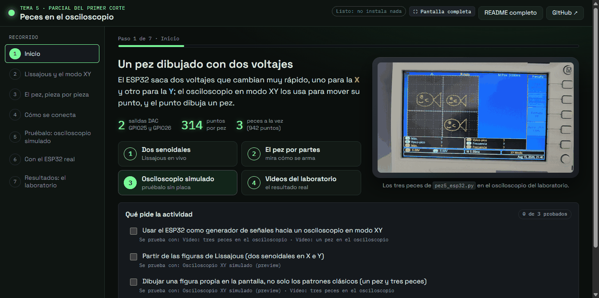

# _lanzador: el motor de las apps de las prácticas

Esta carpeta no es una práctica: es lo que hace funcionar las apps. Cada práctica se abre con **doble clic en el
`ABRIR.bat` de su carpeta** (en Linux/Mac, `sh abrir.sh`). Ese archivo busca un Python 3.9 o más nuevo y corre

```
python _lanzador/lanzador.py --practica <carpeta>
```

El lanzador levanta un servidor solo en este PC (`127.0.0.1`, puerto 8099 o el siguiente libre; nunca en la red) y abre
`http://127.0.0.1:<puerto>/app/<carpeta>/` en una ventana tipo programa: Edge o Chrome en modo `--app`, **maximizada** y en
una ventana nueva (`--app=<url> --start-maximized --new-window`); si no hay ninguno de los dos, en el navegador por
defecto. La consola del `ABRIR.bat` se minimiza sola: es la que mantiene la app funcionando; al cerrarla, la app deja de
poder lanzar cosas y **los programas que corrían dentro de la app (sin consola propia) se detienen con ella**, para no
dejar procesos huérfanos e invisibles. Lo mismo al cerrarse por Ctrl+C, por "Salir" o por inactividad: si nadie usa la
app en 10 minutos (y no hay nada en marcha), se cierra sola. Los programas con `"modo": "consola"` tienen su propia
ventana y siguen hasta que se cierre esa ventana.

| Archivo | Qué es |
|---|---|
| `lanzador.py` | el servidor (solo biblioteca estándar de Python: no hay que instalar nada para abrirlo) |
| `apps-comun/app.js` | la API `window.App` que usan todas las apps (versión en `App.version`, hoy `2.1`) |
| `apps-comun/app.css` | el estilo común (fondo oscuro, Space Grotesk + IBM Plex Mono) y sus componentes |
| `revisar_enlaces.py` | revisa enlaces, imágenes y anclas `#...` de todos los `.md` del repo como los resuelve GitHub |
| `captura-app.png` | la captura de una app que muestra el README de la raíz |

## Paso a paso: la app de una práctica nueva

1. **Carpeta**: `N-nombre-en-minusculas/` en la raíz del repo, con su `README.md` (el formato de siempre: qué pide,
   qué es cada concepto, la idea general en `mermaid`, conexiones, archivos, cómo probarlo con y sin ESP32).
2. **`ABRIR.bat` y `abrir.sh`**: se copian tal cual de cualquier otra práctica (son iguales en todas: toman el nombre
   de la práctica de su propia carpeta). El `.gitattributes` de la raíz les pone los fines de línea correctos (CRLF el
   `.bat`, LF el `.sh`): no editarlos con un editor que los cambie.
3. **`probar.json`**: qué se puede probar. Lo mínimo:
   ```json
   { "id": "12", "titulo": "Tema 12: ...", "resumen": "1-3 frases",
     "pide": ["cada punto del enunciado", "..."],
     "python": { "versiones": ["3.13", "3.12"], "paquetes": ["pyserial==3.5"] },
     "acciones": [
       { "id": "sim", "nombre": "Simulación sin ESP32", "tipo": "python", "script": "sim.py",
         "descripcion": "qué se ve y cómo se usa", "cubre": ["cada punto del enunciado"], "duracion": "~10 s" },
       { "id": "preview", "nombre": "Simulador en el navegador", "tipo": "html", "archivo": "preview.html" } ] }
   ```
   Sin Python (solo HTML, videos, enlaces), se omite `"python"`. Las versiones de los paquetes van fijas (`==`).
4. **Comprobar el manifiesto**: `python _lanzador/lanzador.py --comprobar` tiene que dar `[OK ]` en la práctica
   nueva (revisa campos, que existan los scripts y archivos, `duracion` y `progreso_regex`).
5. **La app**: `app/index.html` con `/comun/app.css` y `/comun/app.js` (ver el ejemplo mínimo más abajo). Lo de siempre:
   `App.marco()` con secciones (Inicio con `App.checklist`, Cómo funciona, Conexiones, Pruébalo con un
   `App.panelEjecucion` por acción, Con el ESP32, Resultados), `App.markdown` para reutilizar trozos del README en vez
   de copiarlos, y `App.imagen` para las fotos. Imágenes y videos de la práctica: `/repo/<carpeta>/img/...` o
   `App.url("img/...")`.
6. **Abrirla y probar cada botón**: `python _lanzador/lanzador.py --practica <carpeta> --no-navegador --puerto 8050`
   y abrir la URL que imprime (o doble clic en el `ABRIR.bat`). Revisar a 1366x768 y 1920x1080, sin errores en la
   consola del navegador (F12).
7. **README raíz**: agregar el párrafo del tema con su línea "Abrir: doble clic en ...ABRIR.bat".
8. **Enlaces**: `python _lanzador/revisar_enlaces.py <carpeta>` tiene que decir "Sin enlaces rotos".



## Cómo se usa

| Comando | Qué hace |
|---|---|
| `python _lanzador/lanzador.py --practica <carpeta>` | abre la app de esa práctica (lo que hace `ABRIR.bat`); si ya hay un lanzador abierto con la misma raíz, lo reutiliza y solo abre otra ventana |
| `... --practica <carpeta> --no-navegador` | levanta el servidor e imprime la URL sin abrir nada (para probar con capturas); así no se cierra solo |
| `python _lanzador/lanzador.py` | sin `--practica`: una página mínima con la lista de prácticas enlazando a sus apps (para el profesor, o para saltar de una a otra). Ya no hay "hub" con tarjetas: cada práctica se prueba desde su app |
| `python _lanzador/lanzador.py --comprobar` | revisa los 12 `probar.json` (campos, scripts que existan, `duracion`, `progreso_regex`) e imprime los errores, sin levantar nada |
| `--puerto N` | puerto preferido (8099 por defecto; busca el siguiente libre). Los laboratorios Docker usan otros: el dashboard del tema 11 está en `127.0.0.1:8180` |
| `--raiz DIR`, `--entornos DIR` | otra carpeta con `*/probar.json`; crear los entornos en `DIR/<carpeta>/entorno` |

La raíz del repo es la carpeta padre de `_lanzador/`. Cada práctica declara qué se puede lanzar en su `probar.json`
(contrato completo al principio de `lanzador.py`): el servidor **solo** ejecuta acciones declaradas ahí, nunca un
comando escrito desde la página, y exige un token que solo conoce la página que sirvió.

Las acciones `python` corren con el `entorno/` de la práctica, que se crea e instala solo la primera vez (en Windows,
PyBullet se compila: hacen falta las *Build Tools* de Visual Studio con C++, y el lanzador lo avisa antes con el comando
para instalarlas). Las `docker` comprueban primero que Docker Desktop esté abierto.

## Qué sirve el lanzador

| URL | Qué es |
|---|---|
| `/app/<carpeta>/...` | la carpeta de la app: `<carpeta>/app/` por defecto, o la carpeta del archivo que diga el campo `"app"` del `probar.json` |
| `/comun/...` | `_lanzador/apps-comun/` (`/comun/app.js`, `/comun/app.css`) |
| `/repo/<carpeta>/...` | cualquier archivo del repo (imágenes, videos, README, previews). Nunca `.env*`, `*.db`/`*.sqlite`, `entorno/`, `.git`, `respaldos/`, los PDF de Moodle ni los Word de entrega; tampoco rutas con `:` (flujos alternativos de NTFS) |
| `/readme/<carpeta>` | el README de la práctica renderizado (con "volver a la app"); los títulos llevan el mismo id que en GitHub, así funcionan los enlaces `#...` y `/readme/<carpeta>#seccion` |
| `/` | la página mínima con la lista de apps |

A cada `.html` servido por `/app/` el lanzador le inyecta `<meta name="probar-token">` y `<meta name="probar-carpeta">`:
`app.js` los usa solo; la app no tiene que hacer nada con el token. A la **página principal** de la app (su
`index.html`) le inyecta además la **pantalla de carga** "Abriendo la práctica…" (número, título y una barra), que se ve
desde el primer instante: `app.js` la avanza (cargando la página → leyendo la práctica y revisando su entorno → listo) y
la quita cuando la página terminó de cargar y la app ya leyó su práctica. Si `app.js` no carga, se quita al terminar de
cargar la página, y pase lo que pase a los 25 s (nunca deja la app tapada).

### Dónde va la app (campo `"app"` del probar.json)

Por defecto `<carpeta>/app/index.html`. Si la carpeta `app/` ya es otra cosa (en `proyecto-final/` es el paquete de
Python), se declara en el nivel superior del `probar.json`:

```json
{ "id": "★", "titulo": "...", "app": "app-practica/index.html", "acciones": [ ... ] }
```

La ruta es relativa a la carpeta de la práctica; `/app/<carpeta>/` sirve la carpeta de ese archivo.

### Campos de cada acción en probar.json (además de `id`, `nombre`, `tipo`, `descripcion`, `cubre`...)

| Campo | Para qué |
|---|---|
| `"duracion": "~4-5 min"` | cuánto suele tardar. El panel muestra el chip "Tarda ~4-5 min" junto al botón y, mientras corre, una **barra estimada** y el reloj **"lleva 1:23 de ~4:30"** (de un rango se toma el punto medio; vale `"30 s"`, `"1 min 30 s"`, `"10-15 minutos"`). Si se pasa del tiempo, dice "suele tardar ~4:30; sigue trabajando" y la barra se queda cerca del final hasta que termina |
| `"duracion_s": 270` | lo mismo en segundos (tiene prioridad sobre `duracion`) |
| `"duracion_es": "arranque"` | la duración es solo lo que tarda en ARRANCAR un programa que después sigue en marcha hasta que se detiene (YOLO con la cámara, un asistente que espera frases). Pasado ese tiempo el panel dice "en marcha (lleva 2:10)" en vez de "tardando más de lo habitual". Es lo que se asume también, sin declararlo, con `"entrada": true` o `"vida": "app"`. Por defecto (`"total"`) es lo que tarda en terminar |
| `"progreso_regex": "it (\\d+)/(\\d+)"` | una línea de la salida que indica el avance real: con dos grupos, hecho/total; con uno, el porcentaje. Si una línea coincide, la barra pasa a ser **real** ("Avance real: 45 % · quedan ~2:10"). La aplica la página: sintaxis de JavaScript (grupos normales `( )`, no `(?P<nombre>)`); `--comprobar` revisa que compile y tenga grupos |
| `"entrada": true` | el programa lee del teclado (`input()`): el panel muestra una caja de texto que le escribe a su stdin |
| `"ventana": true` | el programa abre su propia ventana (PyBullet, OpenCV): el panel avisa "se abrirá una ventana aparte" |
| `"si_falla": "texto"` | qué hacer si ESTA acción falla; sale en el recuadro de error, debajo del resumen automático |
| `"oculta": true` (o `"solo_app": true`) | acción interna de la app (p. ej. un lector de estado): no sale en la lista de pruebas |
| `"vida": "app"` | si la app se cierra, la acción se detiene sola (90 s sin latido de ninguna página de esa app, o 10 s tras el aviso de cierre de la página sin volver). Una recarga no la para |
| `"modo": "app"` (por defecto) o `"consola"` | `app`: el programa corre SIN consola y su salida sale en la página. `consola`: en una ventana de consola aparte (programas que leen teclas sueltas con `msvcrt`, menús de consola...) |

Ejemplo:

```json
{ "id": "gemelo", "nombre": "Gemelo digital sin hardware", "tipo": "python", "script": "gemelo.py",
  "duracion": "~1-2 min", "progreso_regex": "iteraci[oó]n (\\d+)/(\\d+)" }
```

Detalles de la salida en modo app: stdout y stderr van juntos y en orden (con `PYTHONUNBUFFERED=1` y UTF-8); cada línea
se corta a 2000 caracteres; el servidor guarda las últimas 5000 líneas por trabajo y la página muestra las últimas 3000.
Lo que el programa escribe sin salto de línea (la pregunta de un `input()`) se muestra al final, en amarillo. Una línea
que se reescribe con `\r` (barra de progreso de tqdm, por ejemplo) queda solo con su último estado: `progreso_regex` la
ve igual. Sin `"entrada": true`, el stdin del programa está cerrado. Detener mata el programa y todos sus hijos; si se
pulsa mientras se prepara el entorno, se corta pip. Si se recarga la página mientras la acción corre, el panel vuelve a
mostrar su salida.

## Ejemplo mínimo de `<carpeta>/app/index.html` (con el marco tipo Docker Desktop)

```html
<!DOCTYPE html>
<html lang="es">
<head>
<meta charset="UTF-8">
<meta name="viewport" content="width=device-width, initial-scale=1.0">
<title>Brazo robótico</title>
<link rel="stylesheet" href="/comun/app.css">
<style> :root { --acento: #e8823a; } </style>
</head>
<body>
<section data-seccion="Inicio" data-icono="⌂" data-sub="qué hace">
  <div class="app-portada">
    <div><h2>Un brazo que se mueve con el teclado</h2><p class="app-lema">Qué hace la práctica en una frase.</p></div>
    
  </div>
  <div class="app-estados"><div id="estEntorno"></div><div id="estSim"></div></div>
  <div id="pide"></div>
</section>
<section data-seccion="Cómo funciona" data-icono="?">
  <div id="pestanas">
    <section data-pestana="Qué es un URDF"><div id="teoria"></div></section>
    <section data-pestana="Conexiones"><div class="app-tabla-scroll"><table class="app-pines">...</table></div></section>
  </div>
</section>
<section data-seccion="Pruébalo" data-icono="▶" data-sub="sin ESP32">
  <div id="sim"></div>
</section>
<script src="/comun/app.js"></script>
<script>
(async () => {
  await App.iniciar();
  App.marco();                       // cabecera + barra lateral con las 3 secciones + una a la vez
  App.pestanas("#pestanas");
  App.checklist("#pide");
  App.markdown("#teoria", "README.md", { desde: "## Qué es un URDF" });
  App.tarjetaEstado("#estEntorno", { titulo: "Entorno", valor: App.entorno?.estado === "listo" ? "Listo" : "Se prepara al iniciar" });
  App.tarjetaEstado("#estSim", { titulo: "Simulación", accion: "sim" });
  App.panelEjecucion("#sim", "sim", {
    queHacer: ["Usa los botones del panel derecho de PyBullet", "Cierra la ventana para terminar"],
    queDeberiasVer: "El brazo moviéndose al pulsar cada botón.",
  });
  App.imagen(document.body);
})();
</script>
</body>
</html>
```

Sin `App.marco()` la página se ve como la escriba la app (con `.app-encabezado` + `.app-contenedor`, `App.pasos`, etc.):
todo lo de la versión 1 sigue igual. Imágenes y archivos de la práctica: `/repo/<carpeta>/img/foto.png` (o
`App.url("img/foto.png")`). Archivos propios de la app: rutas relativas (`./estilo.css`).

## API (`window.App`)

Todas las funciones que reciben un elemento aceptan el elemento o un selector (`"#sim"`).

### `await App.iniciar()`
Lee la práctica de la URL y devuelve su manifiesto normalizado (`titulo`, `resumen`, `pide`, `notas`, `python`,
`acciones[]` con `duracion`/`duracion_s`/`progreso_regex`, `compila`...) más `entorno` (`{estado: "listo"|"nuevo"|"faltan"|"sin-python"|"roto"|"subcarpetas", detalle}`),
`sistema`, `build_tools`, `pythons` y `trabajos` (lo que ya está en marcha). Se puede llamar varias veces. Después quedan
`App.practica`, `App.carpeta`, `App.entorno`. Las demás funciones llaman a `iniciar()` solas si hace falta.

### Barra de herramientas (automática): "Pantalla completa" y estado
En todas las apps, `app.js` pone un botón **Pantalla completa** (Fullscreen API; Esc o el mismo botón para salir) y un
chip con el estado de la práctica: "Entorno listo", "Listo: no instala nada", "Entorno: se prepara al iniciar", "Falta
Python 3.13" o, si hay algo corriendo, **"▶ 2 programas en marcha"** (pulsa). Dónde: dentro del elemento
`[data-app-herramientas]` si la app reservó uno (lo recomendado: en su cabecera); si no, en `.app-marco-cab` o
`.app-encabezado`; si no hay nada de eso, en una franja fina arriba de la página (en el flujo, nunca flotando encima del
contenido). Si la app ya trae su propio botón "Pantalla completa", no se repite. `<body data-app-sin-herramientas>` la
quita. Cualquier elemento con `data-app-estado` recibe también el texto del estado. `App.on("estado", f)` avisa cuando
cambia (`{enMarcha, entorno}`), y `<html data-app-en-marcha="N">` sirve para estilos.

### `App.panelEjecucion(elemento, accionId, opciones)` → `{iniciar(), detener(), enviar(texto), estado, accion}`
Rellena el elemento con el componente completo para una acción del `probar.json`:
- título y bloques "Qué va a pasar" (la `descripcion`), "Se abrirá una ventana aparte: úsala así" (`"ventana": true`) y
  "Qué deberías ver";
- aviso de entorno antes de pulsar ("la primera vez se prepara solo…", PyBullet/Build Tools con el comando para copiar,
  "necesita Python X");
- botón grande "Iniciar: <nombre>" (Abrir / Levantar según el tipo) con el chip **"Tarda ~4-5 min"** si la acción tiene
  `duracion`; mientras corre, el botón dice "Ejecutándose…" con un círculo girando, y aparece Detener;
- estado bien visible: una franja **"Se está ejecutando… · lleva 1:23 de ~4:30"** (verde) o "Preparando el entorno…
  · lleva 0:40" (amarilla);
- **preparación del entorno con barra real por pasos de pip** (revisar → crear el entorno → buscar/descargar cada
  paquete → compilar PyBullet → instalar → listo) y el porcentaje, con lo que hace pip traducido ("Descargando
  numpy… (12 paquetes revisados)"); el registro crudo de pip, plegado;
- **barra de ejecución**: real si `progreso_regex` coincide con alguna línea ("Avance real: 45 % · quedan ~2:10"),
  estimada si solo hay `duracion`;
- "Lo que dice el programa": la salida en vivo; caja de texto si `"entrada": true`;
- al fallar: resumen en lenguaje humano + las últimas líneas; la salida completa, plegada;
- "Detalles técnicos" plegado (comando, archivo, qué cubre).

Opciones (todas opcionales; los textos pueden ser texto, lista de textos o un nodo DOM):

| Opción | Qué |
|---|---|
| `titulo` | en vez del `nombre` de la acción |
| `queVaAPasar` | en vez de la `descripcion` (pon `""` para no mostrarlo) |
| `queHacer` | instrucciones de uso (teclas, botones de la ventana) |
| `queDeberiasVer` | qué debería verse si todo va bien |
| `alTerminarBien` | texto extra en el recuadro verde al terminar bien |
| `siFalla` | igual que `"si_falla"` del probar.json, pero desde la app (tiene prioridad) |
| `botonTexto` | texto del botón principal |
| `duracion_s`, `duracion_es`, `progreso_regex` | como los campos del probar.json, desde la app (tienen prioridad) |
| `sugerencias` | textos que salen como botones rápidos junto a la caja de entrada |
| `alLinea(texto, tipo)` | cada línea (`tipo`: `prog` del programa, `sis` del lanzador, `in` lo que se envió) |
| `alEstado(trabajo)`, `alTerminar(trabajo)` | cambios de estado / final (`trabajo.estado`, `codigo`, `mensaje`, `inicio`, `lanzado`) |

### `App.marco({titulo, num, secciones, inicio, pie, alCambiar})` → `{ir(i | "nombre"), actual, secciones}`
Organización tipo Docker Desktop: arma la página entera como un programa con **cabecera fija** (número, título, estado,
Pantalla completa), **barra lateral** con las secciones y el **área principal**, que muestra una sección a la vez (como
Containers / Images / Volumes). Las secciones son los elementos `[data-seccion="Nombre"]` (o el selector `secciones`),
con `data-icono` (un carácter) y `data-sub` (texto corto debajo) opcionales. Recuerda la sección (localStorage), acepta
`#s-2` en la URL y emite `App.on("seccion", f)`. Solo se desplaza el área principal: cabecera y lateral nunca tapan el
contenido (probado a 1366x768, 1920x1080 y en pantalla completa); por debajo de 820 px de ancho la lateral pasa a ser una
fila de botones arriba. `pie: false` quita el botón "README completo" del pie de la lateral.

### `App.pestanas(contenedor, {inicio, alCambiar})` → `{ir(i | "título"), actual, secciones}`
Los hijos `<section data-pestana="Título">` (o `class="pestana"`) pasan a ser pestañas con una barra arriba (con
desplazamiento horizontal si no caben: nunca se montan). `data-icono` opcional. Recuerda la elegida, acepta
`#pestana-2` y emite `App.on("pestana", f)`. Los diagramas `mermaid` de `App.markdown` dentro de una pestaña oculta se
dibujan al mostrarla.

### `App.tarjetaEstado(elemento, {titulo, valor, detalle, estado, accion})` → `{poner({...})}`
Una tarjeta pequeña de estado ("Entorno · Listo · Python 3.13") con un punto de color: `estado` = `"ok"`, `"mal"`,
`"aviso"`, `"activo"` (late) o `""`. Con `accion: "id"` se mantiene sola con el estado de esa acción ("Sin iniciar",
"En marcha", "Terminó bien", "Falló"...). Varias juntas, dentro de un `<div class="app-estados">` (rejilla que no se
monta).

### Pantalla de carga: `App.carga(paso, fraccion)`, `App.cargaLista()`
Para apps que cargan algo pesado propio (un modelo, un visor 3D): `App.carga("Cargando el visor…", 0.9)` actualiza la
pantalla "Abriendo la práctica…" y `App.cargaLista()` la quita ya. Sin llamarlas, se quita sola como se explica arriba.

### Bajo nivel
- `App.accion(id, {alLinea, alEstado})` → promesa con el trabajo final (`estado`: `terminada`/`error`/`detenida`).
- `App.detener(id)`, `App.entrada(id, texto)`.
- `App.on("ok" | "fin" | "paso" | "pestana" | "seccion" | "estado", f)`.
- `App.url("img/x.png")` → `/repo/<carpeta>/img/x.png`; `App.mmss(83)` → `"1:23"`; `App.pantallaCompleta()`.

### `App.markdown(elemento, ruta, {desde, hasta, sinTitulo})`
Renderiza un trozo de un `.md` de la práctica (`"README.md"`, `"punto-1/README.md"`). `desde: "## Qué es X"` empieza en
ese título (basta el comienzo, sin tildes ni mayúsculas exactas); sin `hasta`, termina en el siguiente título del mismo
nivel o mayor. Arregla rutas de imágenes y enlaces (relativas a la carpeta del `.md`), pone a los títulos el mismo id
que GitHub (un enlace `#seccion` desplaza hasta ella si está en el trozo; si no, abre el README completo en esa
sección), dibuja los `mermaid` (cuando el elemento se ve) y deja las imágenes ampliables. Usa marked y mermaid desde
CDN; sin internet muestra el texto tal cual.

### `App.pasos(contenedor, {inicio, alCambiar})`, `App.checklist(elemento, {puntos})`
- `pasos`: los `<section class="paso" data-titulo="...">` pasan a ser un asistente (índice numerado, "Paso 2 de 5",
  Anterior / Siguiente). Recuerda el paso y acepta `#paso-3`.
- `checklist`: la lista `pide` con casillas; un punto se marca solo cuando termina bien una acción que lo `cubre`.

### `App.abrir(rutaOUrl)`, `App.imagen(elemento)`, `App.aviso(texto, tipo)`
Abrir en pestaña nueva una URL o un archivo de la práctica (`"README.md"` abre el README renderizado); imágenes
ampliables al clic; mensaje flotante (`"info"`, `"ok"`, `"aviso"`, `"error"`).

## Componentes CSS (`app.css`)

Versión 1 (sin cambios): `.app-encabezado`, `.app-contenedor`, `.app-portada`, `.app-seccion`, `.app-tarjetas` >
`.app-tarjeta`, `.app-btn` (`.primario`, `.peligro`, `.app-btn-grande`, `.app-btn-mini`), `.app-botones`, `.app-aviso`
(`.ok`, `.error`, `.atencion`), `table.app-pines` dentro de `.app-tabla-scroll`, `.app-chip`, `details.app-plegado`,
`.app-etiqueta`, `.app-tenue`, `kbd`. Versión 2: `.app-marco` (y `-cab`, `-lateral`, `-item`, `-cuerpo`),
`.app-pestanas-*`, `.app-estados` > `.app-estado-tarjeta`, `.app-herr`, `.app-ejecucion`. Variables para la identidad
de cada app: `--acento`, `--acento-suave`, `--acento-fondo` (y el resto de `:root`).

## El lanzador es uno solo para todas las apps

Si ya hay un lanzador abierto con la misma raíz (en los puertos 8099-8108) y la misma versión de API (`"api": 3` en
`/api/ping`), `--practica` lo reutiliza: varias apps comparten el mismo servidor y cada `ABRIR.bat` solo abre otra
ventana. Un lanzador viejo (de antes de moverse a `_lanzador/`, API 2) no se reutiliza: se levanta uno nuevo en el
siguiente puerto libre. Tras cambiar `lanzador.py` hay que cerrar el lanzador abierto para que el código nuevo entre en
uso (`app.js` y `app.css` se releen en cada carga de página). Los archivos estáticos se sirven por bloques y con `Range`
(206), así los `<video>` mp4 se reproducen y se pueden adelantar.

## Seguridad (por qué otra web no puede usar el lanzador)

- Escucha solo en `127.0.0.1` (nunca en la red) y rechaza cualquier petición cuyo `Host` no sea `127.0.0.1` o
  `localhost` (defensa contra *DNS rebinding*).
- Solo ejecuta acciones declaradas en un `probar.json`, nunca un comando que venga de la página.
- Toda petición que hace algo (POST) necesita el token secreto que el lanzador inyecta en las páginas de las apps
  (cabecera `X-Token`) y, si el navegador manda `Origin`, que sea el propio lanzador.
- El servidor de archivos no sale de la raíz del repo (`../` no funciona) y nunca entrega lo privado (lista arriba).

## Probar y revisar

```
python _lanzador/lanzador.py --comprobar                               (los 12 probar.json: [OK ])
python _lanzador/lanzador.py --practica <carpeta> --no-navegador        (imprime la URL; abrirla en Chrome/Edge)
python _lanzador/revisar_enlaces.py                                     (enlaces, imágenes y anclas de todos los .md)
python _lanzador/revisar_enlaces.py 7-brazo-robotico-urdf               (solo los .md de esa carpeta)
```

`revisar_enlaces.py` (solo biblioteca estándar) usa la lista de archivos de git: un enlace a un archivo que existe en
el disco pero que el `.gitignore` excluye cuenta como roto (en GitHub no está), y también uno que solo difiere en
mayúsculas (Windows no las distingue; GitHub sí). Las anclas se comparan con la regla de GitHub: minúsculas, sin
puntuación salvo `-` y `_` (las tildes y la ñ se quedan; emojis, `·`, `★`, `→`, `:`, `.`, `(`, `/` se quitan), cada
espacio a `-`, y `-1`, `-2`... para los títulos repetidos. Sale con código 1 si hay algo roto.
