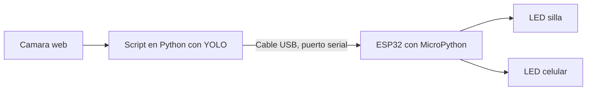
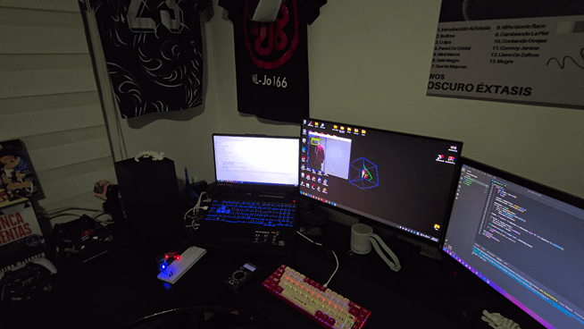
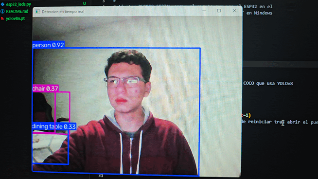
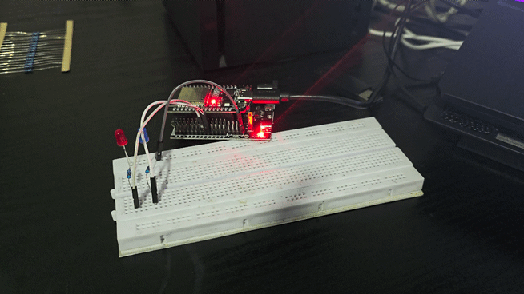
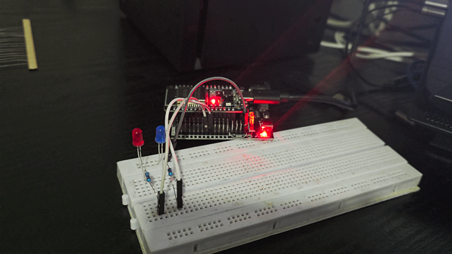

# Detección de objetos

## Qué es YOLO

YOLO, cuyas siglas vienen de You Only Look Once, es una familia de modelos de red neuronal pensada para detectar objetos dentro de una imagen o un video en tiempo real. La idea que lo hizo diferente cuando apareció en 2015, de la mano de Joseph Redmon y Ali Farhadi, fue tratar la detección como un solo problema de regresión, es decir el modelo mira la imagen completa una única vez y en esa misma pasada calcula al mismo tiempo dónde están los objetos y qué son, en lugar de primero buscar posibles regiones con objetos y después clasificarlas por separado, que era como funcionaban los detectores anteriores basados en dos etapas, como R-CNN. Esa diferencia es la que le da a YOLO su velocidad, siendo capaz de procesar decenas de fotogramas por segundo incluso en hardware modesto.

Internamente el proceso funciona dividiendo la imagen de entrada en una cuadrícula, donde cada celda de esa cuadrícula queda a cargo de predecir posibles objetos cuyo centro caiga dentro de ella. Para cada objeto candidato el modelo predice las coordenadas del cuadro que lo delimita, una puntuación de qué tan seguro está de que ahí realmente hay algo, y las probabilidades de a qué clase pertenece ese objeto, por ejemplo una silla o un celular. Como este proceso genera muchas predicciones superpuestas para el mismo objeto, al final se aplica una técnica llamada supresión no máxima, que se encarga de quedarse solo con la predicción más confiable de cada objeto y descartar las repetidas.

Desde esa primera versión la familia fue evolucionando mucho. Las versiones intermedias mejoraron la precisión y la capacidad de detectar objetos pequeños, y en 2020 Ultralytics lanzó YOLOv5, implementado en PyTorch, lo que lo hizo mucho más fácil de instalar y usar y terminó convirtiéndolo en el estándar de facto para la mayoría de proyectos aplicados. Las versiones más recientes, incluida la usada en este proyecto, siguen esa misma línea de facilidad de uso, empaquetadas dentro de la librería ultralytics de Python.

## Cómo está armado este proyecto

La idea central es cerrar el círculo entre visión artificial y electrónica física. La computadora corre el modelo de YOLO leyendo la cámara en vivo, y cuando reconoce alguno de los objetos que nos interesan, en este caso una silla o un celular, le avisa al ESP32 a través de un cable USB, y el ESP32 enciende el LED correspondiente. Cuando el objeto deja de estar en cuadro, el LED se apaga.



El cable USB que normalmente se usa para programar el ESP32 desde Thonny es el mismo que se aprovecha aquí, porque por dentro no es más que un puerto serial. La computadora le manda al ESP32 un texto corto cada vez que cambia lo que está viendo, y el ESP32 se queda escuchando ese puerto todo el tiempo, sin necesidad de estar conectado a internet ni de usar WiFi para nada de esto.

El protocolo de comunicación se mantuvo lo más simple posible a propósito. Cada vez que el estado de lo que ve la cámara cambia, la computadora envía dos caracteres seguidos de un salto de línea, el primero indica si la silla está presente con un uno o un cero, y el segundo hace lo mismo con el celular. Por ejemplo diez significa que se ve la silla pero no el celular, y cero uno sería lo contrario. El ESP32 lee esa línea y prende o apaga cada LED según corresponda. Además, si la computadora deja de mandar mensajes por más de dos segundos, por ejemplo porque el script se cerró o el cable se desconectó, el ESP32 apaga los dos LEDs por su cuenta, para que no se queden encendidos de forma indefinida por accidente.

## El armado físico

Se necesitan dos LEDs, dos resistencias de 220 ohmios, una protoboard y algunos cables macho a macho o macho a hembra según el tipo de protoboard que se use.

El LED que representa la detección de la silla se conecta a GPIO25, y el que representa la detección del celular se conecta a GPIO26. Ambos son pines de propósito general del ESP32 sin restricciones especiales de arranque ni de memoria flash, así que son una elección segura para esta clase de proyecto. La pata larga del LED, el ánodo, va conectada a través de la resistencia hacia el pin del ESP32, y la pata corta, el cátodo, va directamente a GND. La resistencia puede ir antes o después del LED dentro de esa misma línea, el orden no afecta el resultado porque están en serie.

El valor de 220 ohmios sale de calcular cuánta corriente puede pasar sin forzar ni al LED ni al pin del ESP32. El chip trabaja a 3.3 voltios, y un LED típico cae alrededor de 2 voltios cuando está encendido, así que quedan aproximadamente 1.3 voltios por repartir en la resistencia. Con una resistencia de 220 ohmios la corriente resultante queda cerca de los 6 miliamperios, un valor bajo y seguro tanto para el LED como para el pin, que en el ESP32 no debería superar los 20 miliamperios de forma sostenida.

## Instalación del entorno en la computadora

Todo el proyecto vive en una sola carpeta, que puede llamarse por ejemplo deteccion-objetos, la misma que contiene este README junto con los dos scripts.

Dentro de esa carpeta se crea un entorno virtual de Python, para mantener las librerías de este proyecto separadas de cualquier otra cosa instalada en el sistema. En Windows, desde PowerShell y parado dentro de la carpeta del proyecto, esto se hace con:

```
python -m venv entorno
.\entorno\Scripts\Activate
```

Con el entorno ya activado, que se nota porque el nombre del entorno aparece entre corchetes al principio de la línea de comandos, se instalan las librerías necesarias:

```
pip install ultralytics opencv-python pyserial
```

Ultralytics trae el modelo de YOLO listo para usarse, opencv-python maneja la cámara y el video, y pyserial es la que permite que el script de Python hable con el ESP32 a través del puerto serial.

## Cómo correrlo

Primero hay que dejar el ESP32 listo. En Thonny, con el ESP32 conectado, se abre el archivo esp32_leds.py de este proyecto y se guarda directamente en el ESP32 con el nombre main.py, usando la opción de guardar en el dispositivo MicroPython en vez de guardar en la computadora. Al guardarlo como main.py el ESP32 lo va a ejecutar automáticamente cada vez que se reinicie o se conecte a la energía, sin depender de que Thonny esté abierto.

Una vez guardado, hay que cerrar la conexión de Thonny con el dispositivo, para que el puerto serial quede libre y la computadora pueda usarlo desde el script de Python. En Thonny esto se hace deteniendo la conexión con el intérprete o simplemente cerrando el programa.

Después, en el script deteccion_pc.py hay que revisar el nombre del puerto serial, que en Windows suele verse como COM3, COM5 o similar, y se puede confirmar abriendo el Administrador de dispositivos y buscando en la sección de puertos. Con el puerto correcto puesto en el script, se corre con el entorno virtual activado:

```
python deteccion_pc.py
```

Se va a abrir una ventana mostrando la cámara con los cuadros de detección dibujados encima, y en cuanto aparezca una silla o un celular frente a la cámara el LED correspondiente en la protoboard debería encenderse casi al instante.

## Demostración en funcionamiento

Así se ve el montaje corriendo de principio a fin, desde la computadora reconociendo la silla haciendo que los LEDs enciednan reaccionando en la protoboard.


Así se ve el montaje corriendo de principio a fin, desde la computadora reconociendo la telefono haciendo que los LEDs enciednan reaccionando en la protoboard.



La ventana de detección marcando los objetos que YOLO reconoce frente a la cámara, junto con la puntuación de confianza de cada uno, reconociendo la silla y el "telefono":



La protoboard en reposo, reconociendo la silla con una sensibilidad muy alta:



Y la protoboard con los LEDs encendidos en el momento en que la cámara reconoce alguno de los objetos configurados:


