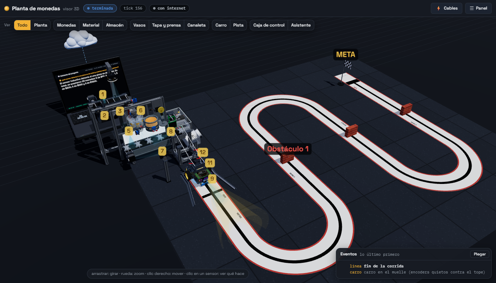
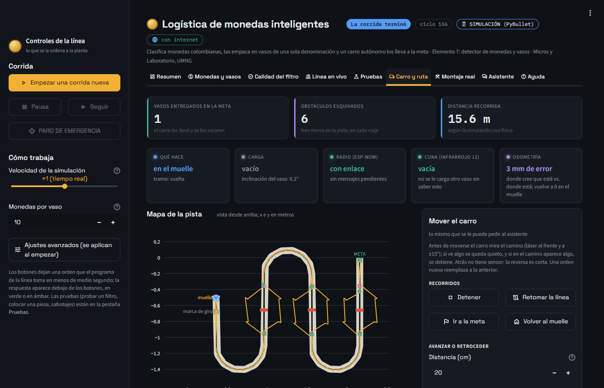
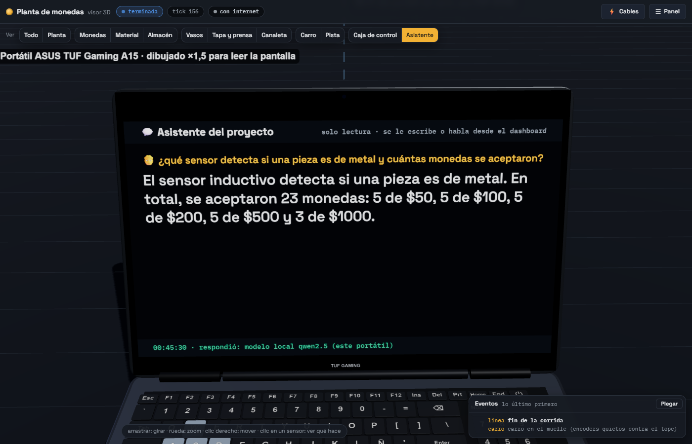
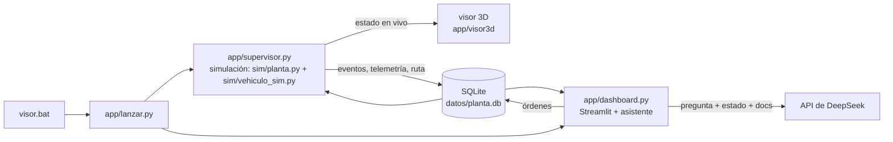

# Sistema de Logística de Monedas Inteligentes

Proyecto del segundo corte de Micros y Laboratorio, quinto semestre de Ingeniería
Mecatrónica, Universidad Militar Nueva Granada. Elemento diferencial del grupo:
**7 — detector de elementos de monedas y vasos**.

Una línea que filtra monedas colombianas (rechaza botones, arandelas, bloques y monedas
extranjeras), las guarda por denominación, las empaca en vasos tapados de una sola
denominación y las entrega a un carro que sigue una línea, esquiva tres muros, llega a la
meta y vuelve solo. Todo corre hoy en simulación (PyBullet con física real) y se ve en un
visor 3D.



| Dashboard: el carro en vivo (mapa, odometría, órdenes) | Visor: lo último que respondió el asistente |
|---|---|
|  |  |

## Cómo verlo

Doble clic en **`visor.bat`**. Si la simulación ya está corriendo, abre el visor 3D; si no,
la arranca (en una ventana minimizada: cerrarla la detiene) y lo abre.

- **Visor 3D** (Three.js): la línea completa en vivo, con el paso a paso guiado, los
  sensores y los componentes, y botones de sabotaje (retirar o cambiar un vaso, meter la
  mano, etc.). Es también el boceto de cómo se construye.
- **Dashboard** (Streamlit, <http://localhost:8501>): producción, línea en vivo, rechazos
  por causa, ruta del carro y la replicación real.
- **Asistente** (pestaña del dashboard): se le pregunta por escrito o por voz por las cifras de
  la corrida o por cualquier parte del proyecto, y se le puede pedir que mueva el carro (avanzar,
  girar, ir a un punto, ir a la meta, volver al muelle) o la línea. Usa DeepSeek (clave en `.env`,
  ver `.env.example`); sin internet, un intérprete local entiende las órdenes y lo básico.



La simulación y el dashboard son procesos separados a propósito (sección 8 de
`CLAUDE.md`): Streamlit reejecuta el script en cada click.

## Asistente sin internet (modelo local)

El asistente prueba en este orden: DeepSeek (clave en `.env`) → un modelo **local** con
[Ollama](https://ollama.com) → un intérprete de reglas. Para tener el local, una sola vez:

```
winget install Ollama.Ollama
ollama pull qwen2.5:3b
```

El modelo (~1,9 GB) queda en la carpeta del usuario (`.ollama`), **fuera del proyecto**: no se
sube a GitHub. Para darle más contexto (respuestas más completas), una vez más:
`python -m app.asistente --preparar-local` (crea `qwen2.5-proyecto`, con 8192 tokens). En una RTX 3050
de 4 GB responde en ~7 s. Mientras piensa, en el visor 3D se ilumina el teclado de la laptop (si piensa
DeepSeek, en cambio, la pregunta viaja a la nube). Las órdenes claras ("avanza 20 cm",
"gira a la derecha") las decide siempre el intérprete de reglas; el modelo chico solo responde
preguntas.

## Costo en Colombia

**$1.680.746 COP** en total (sin el portátil; precios del 2026-09-27 en Ferretrónica, Electronilab,
Didácticas Electrónicas y Mercado Libre). Detalle por componente y **dónde abaratar** en
[`docs/costos.md`](docs/costos.md) (fuente: `config/precios.yaml`).

## Hardware real (fase 8)

Firmware de los dos ESP32 en MicroPython en [`firmware/`](firmware/README.md). El control del
carro de la simulación corre tal cual en su placa. Para pasar de la simulación a las placas se
cambia UNA línea en `config/parametros.yaml`: `hardware.backend: real`. Sin placa conectada, el
supervisor usa una estación emulada con el mismo firmware (`python -m app.puente_serial` para
diagnosticar).

## Documentación

- [`docs/paso-a-paso.md`](docs/paso-a-paso.md) — los 17 puntos del funcionamiento: qué
  sensor usa cada uno, qué entra, qué decide, qué sale y su estado de revisión.
- [`docs/sensores.md`](docs/sensores.md) — los 13 sensores: qué los activa, qué entregan,
  qué mensaje mandan, cómo se replican y cómo se simulan.
- [`docs/componentes.md`](docs/componentes.md) — lista de materiales.
- [`docs/revision-final.md`](docs/revision-final.md) — revisión total: espacio, alcance de sensores,
  pines, alimentación, cables y ruido.
- [`docs/replicacion.md`](docs/replicacion.md) — qué medir para construirlo de verdad y el
  presupuesto de tiempos.
- [`docs/costos.md`](docs/costos.md) — precio de cada componente en Colombia y dónde ahorrar.
- [`docs/conexiones.md`](docs/conexiones.md) — conexionado pin a pin de las dos placas.
- [`docs/pruebas-asistente.md`](docs/pruebas-asistente.md) — 24 preguntas y órdenes reales al asistente, con
  su resultado y su tiempo (modelo local y reglas).
- [`docs/bitacora.md`](docs/bitacora.md) — las decisiones sesión a sesión.
- [`docs/enunciado/`](docs/enunciado/) — la guía del parcial (PDF) y sus figuras.

Los `.md` de `docs/` se generan con `python -m app.documentos` (no se editan a mano).

## Dónde está cada cosa

```
visor.bat              abre el visor (y arranca la simulación si hace falta)
config/                parametros.yaml (todo número del diseño) y monedas.yaml
control/               lógica pura, sin PyBullet: filtrado, cintas, almacén, carro
  hal/                 interfaces de sensores/actuadores y su versión simulada
sim/                   simulación en PyBullet
  planta.py            LA simulación de la línea: cintas, almacén, canaleta, carro
  mundo.py             escena de las dos cintas (URDF en sim/urdf/)
  sensores_sim.py      sensores emulados (incluida la cámara en modo oráculo)
  vehiculo_sim.py      el carro con física real, en su propio mundo
  pista.py             línea central de la pista
  geometria.py         la geometría que dibuja el visor
  catalogos.py         sensores y lista de materiales
  escenarios/          prueba_completa.yaml (la única prueba de la interfaz)
app/                   supervisor, visor 3D, dashboard, asistente, base de datos, documentos
tests/                 pruebas automáticas (+ escenarios de un solo filtro)
docs/                  documentación generada, bitácora y enunciado
```

## Pruebas

```
python -m venv entorno
entorno\Scripts\activate
pip install -r requirements.txt
pytest -q
```

Todas corren sin ventana (PyBullet en modo DIRECT).
