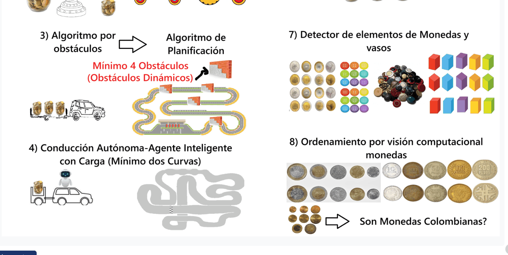
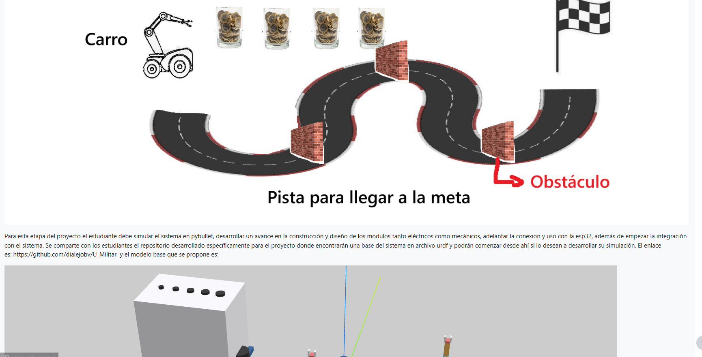
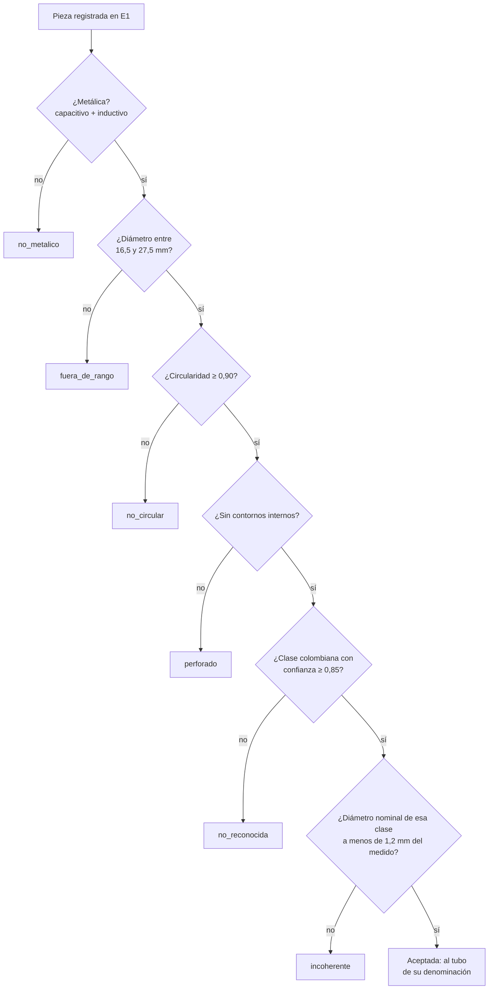
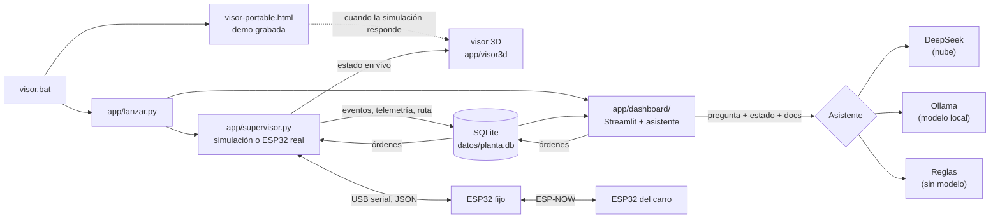
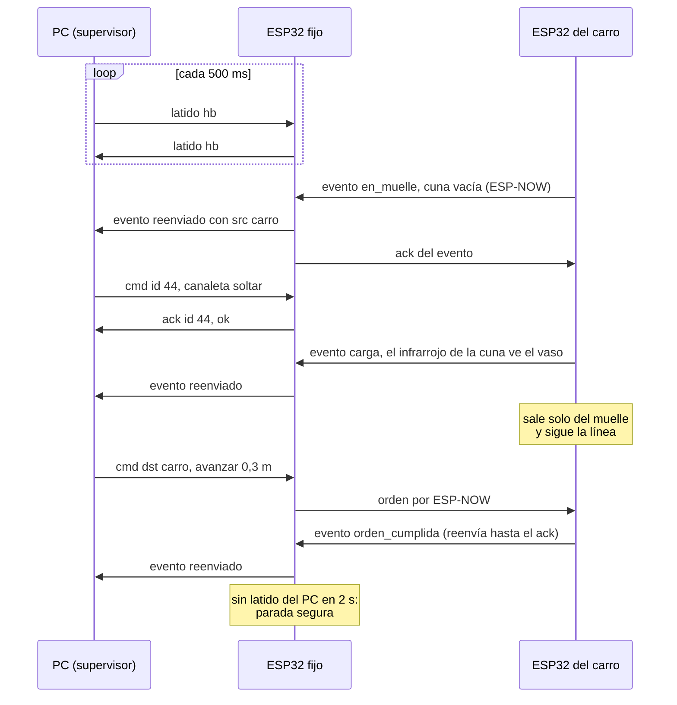

# Sistema de Logística de Monedas Inteligentes

Proyecto del segundo corte de Micros y Laboratorio, quinto semestre de Ingeniería Mecatrónica,
Universidad Militar Nueva Granada (2026-2). Somos el **grupo 7**, y el elemento diferencial que nos
tocó es el **detector de elementos de monedas y vasos**: además de todo el sistema general que pide
el enunciado, el peso técnico de nuestra sustentación está en decidir con confianza qué entra al
sistema y qué se rechaza.

En pocas palabras: una línea recibe piezas de una en una, filtra las monedas colombianas
(rechaza botones de plástico, botones metálicos, arandelas, bloques de colores y monedas de otros
países), las guarda por denominación, las empaca en vasos tapados de **una sola denominación** y se
las entrega a un carro que sigue una línea, esquiva tres muros, llega a la meta y vuelve solo al
muelle. Todo lo vemos en un visor 3D, se sigue en un dashboard de Streamlit y se le puede preguntar
(o dar órdenes) a un asistente por texto o por voz, incluso sin internet.

Hoy el sistema completo corre en **simulación con física real** (PyBullet) y el firmware de los dos
ESP32 está escrito y probado contra una estación emulada. Lo que falta es el montaje físico: eso está
explicado sin rodeos en [Estado del proyecto](#estado-del-proyecto-lo-hecho-y-lo-que-falta).


## Lo que nos tocó: el elemento 7

El enunciado repartió un elemento diferencial por grupo. El nuestro es el 7:



En la práctica eso significó tres exigencias que guiaron todo el diseño:

- **Aceptar monedas colombianas reales**, de la familia nueva y de la antigua, incluidas piezas
  gastadas, manchadas o descoloridas por el uso.
- **Rechazar todo lo demás**: botones de plástico, botones metálicos del tamaño de una moneda,
  bloques de colores y monedas extranjeras (algunas miden casi lo mismo que las nuestras). Los
  filtros se prueban **uno por uno** en la sustentación, así que cada etapa tiene que poder
  demostrarse sola y aportar algo que las otras no aportan. Y ninguna puede ser un cuello de botella:
  todo lo rechazado sale de la línea.
- **Vigilar también los vasos.** Durante la operación pueden retirar un vaso, cambiarlo por una
  figura distinta, cambiarlo por otro vaso idéntico o meter una mano. El sistema lo tiene que
  descubrir con sus sensores y reaccionar **sin parar toda la producción**.

Una condición nos simplificó la vida: las piezas se ponen de a una, a mano y en orden. No hace falta
tolva ni disco de alvéolos; el sistema no tiene que crear la fila, solo no perderla. Los elementos
de los demás grupos (1 a 6 y 8) no los implementamos.

## Cómo verlo

Doble clic en **`visor.bat`**. Hace tres cosas:

1. Abre al instante `visor-portable.html` con una corrida grabada (la demo), sin esperar a nada.
2. Arranca la simulación por detrás, en una ventana minimizada (cerrarla la detiene).
3. Apenas la simulación responde, la misma pestaña pasa sola al **visor en vivo**, sin recargar, y
   cuando el dashboard de **Streamlit** está listo se abre también en el navegador
   (<http://localhost:8501>).

`visor-portable.html` es un solo archivo de unos 2 MB (Three.js, el visor y la demo van adentro).
Abierto en otro PC, sin Python y sin internet, muestra la demo grabada; si en ese PC sí está la
simulación, pasa a vivo igual. Se rehace con `python -m app.portable` (y solo, cada vez que se abre
`visor.bat` o se graba una demo nueva con `python -m app.grabar_demo`).

Qué se ve:

- **Visor 3D** (Three.js, <http://localhost:8765>): la línea completa en vivo. Tiene un **paso a
  paso guiado** (la cámara va a cada zona y resalta sus sensores), la lista de los **13 sensores** y
  de los **componentes** (clic en uno y la cámara lo encuadra), los **cables** pin a pin, y botones
  de sabotaje: retirar un vaso, cambiarlo por una figura o por un vaso igual, poner un vaso con algo
  adentro, meter la mano en la carga, en el llenado o en la tapa y prensa, y cortar la radio del
  carro. Es también el boceto de cómo se construye: todo lo que existe en el diseño está modelado con
  su soporte.
- **Dashboard** (Streamlit, <http://localhost:8501>): pestañas Resumen, Monedas y vasos, Calidad del
  filtro, Línea en vivo, Carro y ruta, Montaje real, Asistente y Ayuda. Está pensado para alguien que
  no conoce el sistema: frases simples de "qué está pasando", una matriz de lo que era cada pieza
  contra lo que decidió la línea, el mapa del carro y los mismos sabotajes del visor.
- **Asistente** (pestaña del dashboard; en el visor se ve en la pantalla del portátil): se le
  pregunta por escrito o por voz por las cifras de la corrida o por cualquier parte del proyecto, y
  se le puede pedir que mueva el carro o la línea.


**Los filtros, uno por uno.** El enunciado dice que en la sustentación cada filtro se prueba por
separado. Además de la corrida normal, el dashboard (barra lateral, "Probar un filtro") y el visor
(panel En vivo) corren **la prueba de un solo filtro**: material, diámetro fuera de rango, no
circular, perforado, no reconocida o incoherente, cada una con piezas que SOLO ese filtro debe
rechazar (son los mismos escenarios de las pruebas automáticas, así que lo que se muestra es lo que
está probado). Arriba sale qué se espera y cuántas piezas ya rechazó por esa causa. En el visor,
pestaña **Sensores**, cada sensor tiene su botón **"Ver la prueba de este sensor"**: manda la prueba
que hace trabajar solo a ese sensor (un filtro, un sabotaje, una orden al carro) y la cámara se queda
mirándolo. Y con **"Colocar una pieza"** se pone a mano en la próxima carga la que uno quiera: una
moneda de cada denominación y familia, una de 1 euro, un botón de plástico o metálico, un bloque, un
disco de 10 mm o una cara de $500 con otro diámetro.

**Nunca se confunde una demo con lo real.** El visor muestra arriba "DEMO GRABADA" o "SIN CONEXIÓN
CON LA SIMULACIÓN" cuando no está en vivo, y al lado de los ticks un chip "con internet" / "SIN
INTERNET" (sin red, la nube de DeepSeek se pone gris). El dashboard dice de dónde salen los datos
(simulación, ESP32 real o emulado), si hay internet, y pone un aviso grande "NO ES EN VIVO" cuando la
simulación no está corriendo. Sin internet sigue funcionando todo lo de la planta: el ESP32 fijo
habla con el PC por USB, el carro con el ESP32 fijo por ESP-NOW (radio directa, sin router) y los
datos viajan por SQLite dentro del mismo PC.

## La idea general

La planta tiene cuatro subsistemas en fila: la **cinta de monedas** (filtrado y conteo), el
**almacén revólver**, la **cinta de vasos** (embalaje) y la **canaleta de entrega**, que le pasa los
vasos al **carro**.

```mermaid
flowchart LR
    OP["Operador<br/>pone una pieza"] --> CM
    subgraph CM["Cinta de monedas (4 casillas)"]
        E1["E1 presencia<br/>infrarrojo"] --> E2["E2 material<br/>capacitivo + inductivo"] --> E3["E3 visión<br/>cámara cenital, 2 fotos"] --> E4["E4 descarga<br/>compuerta de desvío"]
    end
    E4 -- "rechazo, con su causa" --> RM["Bandeja de rechazo<br/>de monedas"]
    E4 -- "moneda aceptada" --> AL["Almacén revólver<br/>6 tubos"]
    AL -- "lote de una denominación" --> CV
    subgraph CV["Cinta de vasos"]
        V1["Verificación<br/>cámara + interior"] --> V2["Llenado"] --> V3["Tapa"] --> V4["Prensa"] --> V5["Descarga"]
    end
    V5 -- "inválido o vacío" --> RV["Bandeja de rechazo<br/>de vasos"]
    V5 -- "vaso tapado" --> CA["Canaleta a 15°<br/>rieles con PTFE"]
    CA -- "un vaso a la vez" --> CR["Carro en el muelle"]
    CR --> PI["Pista con 3 muros"] --> ME["Meta"]
    ME -- "vuelve solo" --> CR
```



### El recorrido de una moneda

La cinta de monedas es negra mate, con separadores cada 40 mm que forman casillas. Un motor paso a
paso la avanza exactamente una casilla (600 ms) y la detiene 1000 ms: en esa pausa cada estación lee
y decide. Pusimos tiempos lentos a propósito, porque el montaje real tiene que verificar con calma:
el ciclo es de 1,6 s, unas 37 piezas por minuto.

1. **Carga.** Durante una pausa ponemos una pieza en la casilla de carga. La cinta solo avanza si
   lleva algo registrado o si el infrarrojo de la carga vio algo; vacía, espera quieta.
2. **E1, presencia.** Un infrarrojo FC-51 mira hacia abajo. Como la cinta casi no refleja, solo
   "ve" algo si hay una pieza. Ocupada: se crea el registro de esa casilla, con un número propio que
   la acompaña todo el camino. Vacía: ninguna otra estación gasta tiempo en ella.
3. **E2, material.** Un sensor capacitivo y uno inductivo, **debajo de la cinta** mirando hacia
   arriba a través de la banda. Capacitivo sí e inductivo no: no metálico, rechazo `no_metalico`,
   y ni siquiera gasta la cámara.
4. **E3, visión.** La casilla queda quieta bajo una cámara cenital con anillo de luz difusa (la
   cinta negra es el fondo). Se toman **dos fotos**: el PC mide el diámetro en milímetros, la
   circularidad, busca agujeros y clasifica la cara de la moneda. Si algo falla, el primer filtro
   que falla decide la causa y nadie lo revierte. La misma imagen mide si la cinta quedó bien en su
   casilla; si se corrió, se corrige con micropasos en la misma pausa.
5. **E4, descarga.** La pieza cae por el extremo de la cinta a un embudo. Una compuerta de desvío
   la manda al almacén o a la **única bandeja de rechazo**. En reposo apunta al rechazo: solo se
   mueve hacia el almacén para una moneda registrada y aceptada.
6. **Almacén.** El carrusel ya tiene bajo el punto de carga el tubo de su denominación ($50, $100,
   $200, $500, $1.000 u "otras"); la moneda cae casi vertical al tubo. Si ese tubo está lleno, la
   moneda espera en la descarga y la cinta de monedas se detiene: **ninguna moneda colombiana
   aceptada se bota**.

### El recorrido de un vaso

Los vasos son opacos, personalizados, y llevan una cinta de papel alrededor con el mismo marcador
ArUco impreso seis veces (siempre hay uno de frente a la cámara, gire como gire el vaso).

1. **Verificación.** Una webcam al costado de la cinta, con un panel de luz detrás, ve cada vaso
   como una silueta oscura. En la imagen miramos dos franjas, como dos "barreras virtuales": una a
   media altura (tiene que estar ocupada) y otra justo encima del borde (tiene que estar libre). La
   cámara anota el número del marcador, y un VL53L0X que mira desde arriba **hacia el interior del
   vaso** comprueba que llegó vacío: un vaso con algo adentro no entra.
2. **Llenado.** Cuando un tubo junta un lote completo (10 monedas por defecto, se cambia en caliente
   desde el dashboard), el carrusel lleva ese tubo sobre el único agujero de la placa, se abre el
   obturador y el lote entero cae al vaso. Justo antes, la cámara re-verifica: si ahí hay una figura,
   no hay nada o el marcador cambió, no se suelta nada y la cinta de vasos salta a la siguiente
   casilla válida. Sin paro de línea. Después, la cámara confirma que las monedas llegaron.
3. **Tapa.** Se verifica otra vez **en ese instante** (no confiamos en lo registrado antes). Si el
   vaso está lleno y sigue siendo el mismo, un escape de servo suelta una tapa que cae unos 13 mm y
   se centra sola por su borde cónico. La cámara confirma que quedó puesta; si no, se suelta otra una
   vez, y si tampoco, el vaso queda inválido. Un vaso vacío no se tapa: se desecha.
4. **Prensa.** Con la cinta quieta, un servo MG996R gira una leva excéntrica 0 → 180 → 0 grados y
   asienta la tapa a presión. Antes, la cámara revisa vaso, marcador y tapa.
5. **Descarga.** Si el vaso llegó tapado y válido, un empujador con manivela lo pasa de lado a la
   canaleta. Si no, no se empuja: en el siguiente avance cae por el extremo de la cinta a la bandeja
   de rechazo de vasos. Si la canaleta está llena, el vaso tapado espera y la cinta de vasos se
   detiene; la de monedas sigue guardando en los tubos.
6. **Cortina de seguridad**, todo el tiempo sobre la zona de tapa y prensa. Si ve una mano, la prensa
   **sube** y se detiene arriba, tapa y empujador se congelan y la cinta de vasos se detiene; la de
   monedas sigue. Al despejarse, la cámara revisa todos los vasos antes de seguir.

Al final del turno, lo que quedó en los tubos se puede empacar en vasos incompletos (cada uno sigue
siendo de una sola denominación, botón "Embalar lo guardado") o dejarse guardado: el turno siguiente
arranca con esas monedas.

### El carro y la ruta



El carro tiene dos ruedas motrices con motorreductores TT, encoders de 20 ranuras, una rueda loca de
bola, un arreglo de cinco infrarrojos de línea, un láser VL53L0X al frente (con un HC-SR04 de
respaldo) y un infrarrojo que mira la cuna de carga.

- **Carga en el muelle.** El carro entra de reversa a un muelle, como un camión. Dos guías en V
  empujan dos **rodillos guía** en sus esquinas traseras y lo centran, y dos topes con espuma lo paran
  con la cuna justo bajo el final de la canaleta. Sabe que llegó porque sus encoders dejan de contar
  contra el tope (entra con PWM bajo para que la llanta no patine). Avisa por ESP-NOW; la estación
  comprueba que la cuna esté vacía, suelta **un** vaso y el infrarrojo de la cuna confirma la carga.
- **Ida.** Sigue la línea con control proporcional-derivativo, a 0,40 m/s en las rectas. Con algo a
  menos de 50 cm baja a velocidad de maniobra; si el láser ve el muro a menos de 200 mm en tres
  mediciones seguidas, frena, mira a ±30° y esquiva hacia el lado con más espacio: sale a 45°, pasa
  derecho y vuelve a 60° hasta **ver** la línea con el infrarrojo del centro (no vuelve contando
  pulsos).
- **Meta.** En la franja negra de la meta espera a que le saquen el vaso (lo nota el infrarrojo de
  la cuna), da media vuelta y **vuelve solo**, esquivando los mismos muros. En la marca de giro da
  media vuelta otra vez, se endereza siguiendo la línea 15 cm y entra de reversa al muelle.
- **Órdenes.** Además del recorrido automático, obedece órdenes del asistente o de los botones del
  dashboard (detener, avanzar, retroceder, girar, ir a un punto, ir a la meta, volver al muelle,
  retomar la línea). Sabe dónde está por odometría, que se pone en cero cada vez que entra al muelle;
  antes de moverse mira el camino al frente y a ±15°, y en marcha se detiene si algo aparece adelante
  o si una rueda cuenta mucho más que la otra (algo lo tiene agarrado). Como sus sensores van a 6-7
  cm del piso y no ven lo bajo (las guías del muelle miden 2 cm), además lleva un **mapa fijo** de
  por dónde puede andar: rechaza, sin moverse, un destino o un camino recto que toque la planta, la
  canaleta o el muelle. Esto lo aprendimos a la mala: le pedimos al asistente que el carro
  "atravesara el filtro de monedas", el modelo local lo prometió y el carro se atoró contra el muelle.
  Ahora el asistente contesta que eso no se puede.

En la simulación, ida y vuelta toma unos 2,5 minutos. Lo probamos con los errores de la
configuración y con el **doble** de esos errores: esquiva los seis muros (tres de ida, tres de vuelta)
sin tocarlos y vuelve al muelle con menos de 3 mm de error.

## Conceptos que usamos

**Sensor capacitivo e inductivo.** Los dos detectan sin tocar. El capacitivo reacciona a cualquier
material cerca de su cara (plástico, metal, una mano), porque cambia la capacitancia de su campo. El
inductivo genera un campo magnético alterno y solo reacciona a metal, por las corrientes que se
inducen en él. Juntos dan una respuesta que ninguno da solo: capacitivo sí e inductivo no es un objeto
**no metálico**. Los dos son NPN de 6-36 V, así que llegan al ESP32 por optoacopladores, nunca
directo.

**VL53L0X (tiempo de vuelo).** Un sensor láser que mide distancia cronometrando cuánto tarda la luz
en ir y volver. No mide en un rayo sino en un cono de unos 25°, y eso lo tuvimos en cuenta al
ubicarlo. Usamos el mismo modelo tres veces: cortina de seguridad, interior del vaso y frente del
carro.

**Marcador ArUco.** Un cuadrado blanco y negro, como un código QR muy simple, que OpenCV encuentra en
una imagen y del que lee un número. Nos sirve para saber si un vaso es **el mismo** que se verificó
antes: un vaso idéntico por fuera trae otro número.

**ESP-NOW.** Protocolo de radio de Espressif para que dos ESP32 hablen directo, sin router ni
Wi-Fi. Lo usamos entre el ESP32 fijo y el del carro: no depende de la red del salón y deja libre el
Wi-Fi del PC para la API del asistente.

**Capa de abstracción de hardware (HAL).** Una lista de "enchufes" (avanza la cinta, lee este
sensor, mueve este servo) que el control usa sin saber qué hay del otro lado. Tenemos dos
implementaciones: una que responde con la simulación de PyBullet y otra que manda mensajes por serial
al ESP32. El control no se entera de cuál está conectada.

**Modelo de lenguaje local.** Un modelo como el de DeepSeek pero pequeño (3 mil millones de
parámetros), que corre en la tarjeta gráfica del propio portátil con Ollama. Responde peor que uno
grande, pero funciona sin internet.

## Decisiones de diseño y por qué

Casi nada de lo que se ve hoy fue la primera versión. Cada punto del funcionamiento lo revisamos en
grupo, uno a la vez, y muchas veces la simulación o el 3D nos mostraron que algo no iba a funcionar
en el montaje real. Estas son las decisiones que más pesan:

- **Filtro total con una sola bandeja de rechazo.** Al principio la cinta de monedas tenía siete
  estaciones, dos expulsores laterales con sus servos, sensores que confirmaban cada expulsión y
  tres cubetas. Lo cambiamos por un filtro total: todo sigue hasta la descarga y una sola compuerta
  manda lo que no pasó a una sola bandeja. La cinta bajó a cuatro estaciones (de 28 a 16 cm), se
  fueron dos servos y dos sensores, y cada filtro se sigue demostrando por separado porque **cada
  rechazo queda registrado con su causa**.
- **Compuerta a prueba de fallas.** En reposo apunta al rechazo. Si se corta la comunicación o el
  ESP32 se reinicia, nada desconocido entra al almacén; lo que ningún sensor registró también va al
  rechazo.
- **Visión en vez de barreras infrarrojas.** Para verificar los vasos teníamos seis barreras IR,
  dos sensores de presencia y dos sensores de ranura para la posición de las cintas. Una cámara de
  vasos con un panel de luz detrás los reemplazó: sus "franjas" hacen de barreras virtuales, lee el
  marcador, confirma la tapa y vigila en **cada** avance que no falte ningún vaso en sus cuatro
  casillas (una mano puede sacar un vaso por encima sin cruzar la cortina). Las cámaras de cada cinta
  miden además dónde quedaron los separadores. Quedaron físicos, a propósito, solo los sensores que
  la cámara no puede reemplazar: material (una cámara no distingue plástico pintado de metal),
  cortina (la seguridad no puede depender del PC), interior del vaso (la cámara no ve dentro de un
  vaso opaco), el Hall del carrusel y los del carro (que no lleva cámara). Terminamos con **13
  sensores** en total.
- **Sin celdas de carga; peso estimado por conteo.** Las celdas de carga dan problemas de
  acondicionamiento y ruido, y las descartamos del todo. El peso que muestra el dashboard es la suma
  de las masas nominales de las monedas identificadas, y así está rotulado: **estimado**. Para saber
  si un vaso llega vacío usamos el VL53L0X que mira hacia adentro.
- **Almacén tipo revólver de 6 tubos.** Primero había un selector giratorio con un pico corto que
  desviaba la moneda hacia uno de cinco tubos con compuerta. No era creíble: la moneda llega con
  velocidad y un pico de 3 cm no la desvía con seguridad. Ahora giran los tubos: un 28BYJ-48 pone el
  tubo correcto bajo el punto de carga y la moneda cae casi vertical. Una placa fija con **un solo
  agujero** y un obturador suelta los lotes. Carga y agujero están a 210° entre sí, así que nunca se
  guarda y se suelta a la vez. De siete actuadores pasamos a dos, y un sensor Hall le da al motor
  su referencia al encender.
- **Una denominación por vaso.** Cada vaso lleva una sola denominación, y los vasos son genéricos:
  la denominación la decide el tubo que se abre sobre él. Si un tubo se llena y no hay vaso, la
  moneda espera y la cinta de monedas se detiene con la alarma `tubo_lleno` / `faltan_vasos`.
- **Canaleta a 15° con PTFE.** El vaso cuelga de la pestaña de su reborde (8 mm) entre dos rieles:
  el centro de masa queda por debajo del apoyo y no se puede volcar. Con la altura de las mesas, a
  25° solo cabían dos vasos; elegimos 15° y forramos los rieles con cinta adhesiva de teflón para
  que deslicen parejo (un tubo de PTFE dejaba solo 0,5 mm de holgura). La entrada es un embudo y un
  escape de dos dedos con un solo servo suelta un vaso a la vez.
- **Prensa de leva.** Con 6,5 mm de excentricidad, un MG996R empuja con al menos 150 N y una tapa a
  presión pide del orden de 30 a 50 N (valor provisional hasta medirlo). El servo sabe su ángulo:
  no hace falta sensor de posición ni puente H. Un resorte limita la fuerza, así que un objeto
  extraño no rompe nada.
- **Cortina de un solo sensor.** Llegamos a tener tres VL53L0X a distintas alturas. Nos quedamos
  con uno a media altura, 65 mm sobre la cinta, con el eje a 85 mm del de la cinta para que su cono
  real no toque vasos, tapa ni prensa. No es un equipo certificado de seguridad: lo que buscamos es
  que el sistema se detenga si ve una mano. La zona por donde cae el lote al vaso la vigila la
  cámara de vasos.
- **Carro de 2 ruedas y rueda loca.** Tres apoyos siempre tocan el piso y gira sobre su eje sin
  patinar; con cuatro ruedas rígidas, en un piso desparejo una queda en el aire y su encoder cuenta
  de más. El vaso va sujeto en cuatro puntos (espuma adelante, lengüeta con resorte atrás, guías a los
  costados), así que no cabecea y el carro puede ir más rápido.
- **Láser al frente y ultrasónico de respaldo.** El HC-SR04 ve lejos pero mide cada 60 ms; el
  VL53L0X mide cada 33 ms. Con la zona de frenado, el carro va rápido en las rectas y llega despacio
  a cada muro. El ultrasónico queda de respaldo porque no le afectan las superficies negras ni el sol.
- **Protocolo con confirmación y latido.** Entre el PC y el ESP32 fijo van líneas JSON numeradas.
  Cada comando espera su `ack` (300 ms, un reintento y después `fallo_comunicacion`), un comando
  repetido no se ejecuta dos veces y un hueco en la numeración es un mensaje perdido que queda
  registrado. Hay latido en los dos sentidos: si el ESP32 no oye al PC en 2 s hace una **parada
  segura** (cintas quietas, prensa arriba, desvío al rechazo, escapes cerrados). El carro guarda sus
  eventos y los reenvía hasta que le confirman; si pierde la radio, termina la vuelta y se queda en
  el muelle.
- **La lógica se escribe una sola vez.** Toda la inteligencia vive en `control/`, en Python puro,
  sin PyBullet ni pyserial. `control/vehiculo.py` (el control completo del carro) y
  `control/protocolo.py` corren tal cual en el PC, en la simulación y dentro del ESP32 del carro
  compilados para MicroPython. Lo que probamos en simulación es literalmente lo que corre en la placa.
- **Simulación o placas con una línea.** `hardware.backend: sim` o `real` en
  `config/parametros.yaml`. Todo número del diseño (umbrales, tiempos, medidas, errores de sensores)
  vive en esa configuración, y lo que todavía no está medido está marcado como PROVISIONAL.

## Filtros que se complementan

La decisión sobre cada pieza se construye acumulando evidencia de etapas independientes. Cada etapa
escribe en el registro de la casilla y **ninguna puede revertir un rechazo anterior**.



| Causa | Etapa | Qué atrapa |
|---|---|---|
| `no_metalico` | Material (E2) | Botones de plástico, bloques, una mano que se puso y se quitó en la carga |
| `fuera_de_rango` | Geometría (E3) | Piezas más chicas o más grandes que cualquier moneda con tubo |
| `no_circular` | Geometría (E3) | Bloques y fichas irregulares |
| `perforado` | Geometría (E3) | Arandelas y botones metálicos con ojales |
| `no_reconocida` | Clasificación (E3) | Monedas extranjeras, botones metálicos lisos, fotos que no convencen |
| `incoherente` | Coherencia (E3) | Una clase que no cuadra con el diámetro que se midió |

**La regla de coherencia** es la que más nos gusta mostrar, porque cruza dos mediciones
independientes. Con monedas extranjeras en juego el diámetro solo no sirve: un euro mide 23,25 mm y
cae entre las de $500; una de veinte céntimos mide 22,25 mm y cae junto a la de $200 nueva. Por eso la
decisión final es por la cara de la moneda, y la coherencia verifica que lo que dice el clasificador
cuadre con lo que midió la geometría. El sistema garantiza rechazar lo que no reconoce con confianza
suficiente; no pretende reconocer cualquier moneda del mundo.

Las monedas de referencia (la tabla completa, con cuatro generaciones, vive en
`config/monedas.yaml`; estas nueve son las verificadas):

| Denominación | Familia | Diámetro (mm) | Masa (g) | Ferromagnética | Bimetálica |
|---|---|---:|---:|---|---|
| $50 | nueva | 17,0 | 2,0 | sí | no |
| $100 | nueva | 20,3 | 3,3 | sí | no |
| $50 | antigua | 21,5 | 4,5 | no | no |
| $200 | nueva | 22,4 | 4,6 | no | no |
| $100 | antigua | 23,0 | 5,3 | no | no |
| $500 | antigua | 23,5 | 7,4 | no | sí |
| $500 | nueva | 23,7 | 7,1 | no | sí |
| $200 | antigua | 24,4 | 7,1 | no | no |
| $1.000 | nueva | 26,7 | 10,0 | no | sí |

Las generaciones más viejas ("muy antigua" e "histórica") están en la tabla "por si acaso", con
medidas PROVISIONALES; hasta que tengamos las piezas para fotografiarlas y entrenar, salen como
`no_reconocida`.

### Errores simulados, a propósito

Un sensor real se equivoca, así que en la simulación también: cada sensor tiene su probabilidad de
falso negativo y de falso positivo por lectura, la cámara tiene ruido de medida y a veces confunde
clases, los servos a veces fallan y la cinta a veces se corre. Todo sale de `errores_sensores` y
`errores_actuadores` en la configuración (valores de hoja de datos, PROVISIONALES), con semilla fija
para que una corrida se pueda repetir. Eso nos obligó a diseñar para el error:

- **Voto de mayoría.** Cada estación lee su sensor tres veces durante la pausa y decide por
  mayoría. En 20 corridas de producción (520 monedas), con una sola lectura se rechazaron por error
  13 monedas colombianas; con el voto de tres, 5. Ninguna moneda perdida ni aceptada por error en
  ningún caso.
- **Respaldos cruzados.** Si el infrarrojo de E1 no ve una pieza pero el capacitivo o el inductivo
  sí, la casilla se registra en E2 ("presencia recuperada"). Si el inductivo ve metal, es metal
  aunque el capacitivo falle.
- **Dos fotos por moneda.** La primera regla que propusimos ("si las dos fotos coinciden, se
  acepta") casi duplicaba el rechazo de monedas buenas. La medimos en 30 corridas con errores (720
  monedas reconocibles): con una foto, 20 monedas buenas rechazadas y 1 en el vaso equivocado; con
  "deben coincidir", 39 y 0; con la regla que quedó (si las fotos que reconocen dicen la misma clase,
  esa es; si dicen clases distintas, `no_reconocida`), **7 y 0**.
- **Conteo contra la verdad.** Cada pieza de la simulación sabe qué es de verdad, así que el
  dashboard y el visor muestran falsos rechazos, falsas aceptaciones y monedas en el vaso equivocado.
  Es la matriz de la pestaña "Calidad del filtro".

### Replicación real

Una regla que nos pusimos desde el principio: todo tiene que poder replicarse en el montaje real con
sus tiempos, medidas y el error individual de cada sensor, y todo eso queda anotado.
[`docs/replicacion.md`](docs/replicacion.md) lista cada medida por confirmar (con dónde se cambia y
cómo medirla), las monedas por medir, la **prueba de banco de 200 pasadas** para el error de cada
sensor y el **presupuesto de tiempos**: comprueba que cada acción cabe en su hueco. Por ejemplo, la
visión necesita 820 de los 1000 ms de pausa (dos fotos de 400 ms más el serial), y la cortina
reacciona en 119 ms contra un máximo de 200. [`docs/revision-final.md`](docs/revision-final.md)
recoge la auditoría de espacio, el alcance real de cada sensor con su error de montaje, los pines,
la alimentación, el largo de los cables y el ruido.

## El software por dentro



- **Supervisor** (`app/supervisor.py`). El único proceso que toca la simulación (o las placas, con
  el backend real). Corre la línea tick a tick, consume la tabla de órdenes, escribe eventos,
  elementos, vasos y ruta en SQLite y sirve el visor 3D por HTTP en `127.0.0.1:8765`.
- **Simulación** (`sim/`). `sim/planta.py` es la línea completa en PyBullet: las dos cintas, el
  almacén, la canaleta y el carro. Los sensores se emulan con `rayTest` (el cono de la cortina son 19
  rayos repartidos en sus 25°), el material con la bandera de cada cuerpo y la cámara en **modo
  oráculo** (lee la clase real y le aplica ruido) hasta tener el modelo entrenado. El carro tiene su
  propio mundo con física real: ruedas con torque limitado, muros y muelle sólidos, vaso que puede
  cabecear.
- **SQLite** (`app/db.py`). Tablas de eventos, elementos, vasos, ruta, órdenes, la conversación del
  asistente y lo que quedó en los tubos entre turnos. En modo WAL, para que el dashboard lea mientras
  el supervisor escribe.
- **Dashboard** (`app/dashboard/`, un módulo por pestaña y un sistema de diseño común con el visor). Solo lee
  de SQLite y escribe órdenes; se refresca con `st.fragment` sin bucles (solo la pestaña abierta). Supervisor y dashboard son **procesos separados a propósito**:
  Streamlit reejecuta el script en cada clic, y mezclar ahí la simulación, la cámara o el puerto
  serial lo volvería inestable.
- **Visor 3D** (`app/visor3d/`). Three.js en local (sin CDN, para no depender del internet del
  salón). La geometría sale de las mismas fuentes que la simulación, así que no puede dibujar un
  sensor donde la simulación no lo consulta. Muestra cada sensor con dos conos (el nominal y el de
  error probable de montaje), el conexionado pin a pin generado desde `sim/conexiones.py` (46
  dispositivos, 45 cables, 150 hilos), la caja de control armada como un tablero y el portátil del
  grupo con sus medidas reales. Pasamos una **auditoría automática de espacio** sobre el modelo
  (cajas orientadas que se atraviesan) y un revisor de cables que muestrea cada uno cada 3 mm: así
  encontramos patas que atravesaban el carrusel, servos "posados" sin sujeción y cables cruzados, y
  los corregimos.
- **Asistente** (`app/asistente.py`). Sigue la lógica del tema 4 del repositorio: la frase va a un
  modelo, que responde solo con un JSON `{"respuesta", "acciones"}`; el programa lo valida y las
  órdenes permitidas van a la misma tabla que los botones. Detalles abajo.
- **Firmware y puente serial** (`firmware/`, `app/puente_serial.py`). Detalles abajo.

### El asistente

Prueba en este orden: **DeepSeek** (clave en `.env`, ver `.env.example`) → un **modelo local** con
Ollama → un **intérprete de reglas**. En cada pregunta recibe el estado en vivo de la corrida y las
secciones de la documentación que más se parecen a la pregunta (lee todo el proyecto por búsqueda).
Nunca inventa cifras: si un dato no está, lo dice. Y hay candados que valen para cualquier
proveedor:

- las órdenes pasan por una **lista blanca** con rangos (avanzar hasta 1,5 m, retroceder hasta 30 cm
  porque atrás no hay sensor, girar ±180°), y va una sola orden al carro por mensaje;
- **una pregunta nunca mueve nada**;
- las órdenes claras ("avanza 20 cm", "gira a la derecha") las decide siempre el intérprete de
  reglas, y el signo del giro lo manda la frase: el modelo chico, al probarlo, inventó una secuencia
  de cuatro órdenes para "gira a la derecha";
- las medidas que ningún sensor toma (temperatura, voltaje, corriente) se responden sin inventar.

Lo evaluamos con una batería de 24 casos reales (cifras, preguntas técnicas, costos, preguntas sin
dato, órdenes con errores de ortografía, intentos de saltarse las reglas y una pregunta en inglés):
**24 de 24** con el modelo local (mediana de 7,5 s por respuesta) y 24 de 24 con las reglas. El
informe completo, con cada respuesta, está en
[`docs/pruebas-asistente.md`](docs/pruebas-asistente.md).


**Modelo local (sin internet).** Una sola vez:

```
winget install Ollama.Ollama
ollama pull qwen2.5:3b
python -m app.asistente --preparar-local
```

El modelo (~1,9 GB) queda en la carpeta del usuario (`.ollama`), **fuera del proyecto**: no se sube
a GitHub. `--preparar-local` crea `qwen2.5-proyecto`, con 8192 tokens de contexto: con el contexto por
defecto de Ollama (~4000 tokens) un prompt largo se cortaba por el principio y el modelo perdía las
instrucciones. En una RTX 3050 de 4 GB responde en unos 7 s. Mientras piensa, en el visor se ilumina
el teclado del portátil; si piensa DeepSeek, en cambio, se anima la nube.

**Voz sin internet.** Con internet, el micrófono lo transcribe Google y la respuesta la lee gTTS
(como en el tema 4). Sin internet: **Whisper** (`faster-whisper`, modelo `small`) oye en el mismo PC
y responde una **voz de Windows** en español. El modelo de Whisper (~480 MB) se descarga una vez,
también fuera del proyecto: `python -m app.asistente --preparar-voz`. Probado: "avanza 20
centímetros y después vuelve al muelle" se transcribe exacto en unos 2,5 s.

### Firmware de los dos ESP32

Escrito en **MicroPython**, el mismo del curso con Thonny. Así el control del carro y el protocolo
no se reescriben en C++: se compilan con `mpy-cross` y corren tal cual.

- **ESP32 fijo** (DevKit de 38 pines, por USB al PC): mueve las dos cintas (NEMA 17 con A4988), el
  carrusel (28BYJ-48 con ULN2003) y los seis servos por un PCA9685 en I2C; lee presencia,
  capacitivo, inductivo, Hall, cortina e interior del vaso, y hace de puente ESP-NOW con el carro.
  **No decide qué es cada pieza**: la visión corre en el PC. Pero la parada segura y la reacción a
  la cortina sí las decide en la placa, sin esperar al PC.
- **ESP32 del carro** (DevKit de 30 pines, batería 2S de 18650): corre el mismo `ControlCarro` de la
  simulación a 50 Hz, con el TB6612, los encoders, los infrarrojos, el láser y el ultrasónico.



Los pines se generan desde `sim/conexiones.py` (el mismo conexionado que dibuja los cables del
visor) y los valores desde la sección `firmware:` de `config/parametros.yaml`, con
`firmware/preparar.py`; no hay números copiados a mano. Se sube con `python -m firmware.subir fijo`
(y `carro`). Sin placa conectada, el supervisor usa una **estación emulada** con el mismo firmware y
hardware falso, y `python -m app.puente_serial` sirve para diagnosticar: muestra la telemetría, los
mensajes perdidos y la última línea cruda recibida (si no cambia, el ESP32 no manda nada; si cambia
pero no se entiende, es formato, no cables). Todo el detalle, con la tabla de pines, en
[`firmware/README.md`](firmware/README.md).

### Pruebas automáticas

Tenemos **más de 650 pruebas** en `tests/` (ordenadas por capa: `control/`, `sim/`, `visor/`,
`app/` y `firmware/`), y todas corren sin ventana (PyBullet en modo DIRECT):
reglas de decisión, registro de casillas, máquinas de estado de las dos cintas, almacén, protocolo,
control del carro (incluida la ida y vuelta con 20 semillas de error sin tocar muros), la planta
completa con cada sabotaje, un escenario por cada filtro por separado más uno mixto, el supervisor,
el dashboard (con el AppTest de Streamlit), el conexionado (pines que existen, sin repetidos), el
presupuesto de tiempos, los costos, el visor portable, la voz y el firmware (compilado con
`mpy-cross` y probado de punta a punta contra la estación emulada).

```
python -m venv entorno
entorno\Scripts\activate
pip install -r requirements.txt
pytest -q
```

## Lo que nos enseñó la simulación

Buena parte del valor de simular antes de construir fue encontrar problemas que en el montaje real
habrían aparecido igual, pero más caros:

- **Las cintas estaban al ras del piso.** Al verlo en 3D, la moneda aceptada habría tenido que
  *subir* al embudo, y el vaso colgado de la canaleta terminaba bajo el suelo. La mesa de monedas
  quedó a 43 cm (para que todo baje por gravedad hasta el vaso) y la de vasos a 10 cm.
- **Los vasos se encimaban**: la cinta de vasos usaba la separación de 40 mm de la de monedas, y el
  vaso mide 62. Ahora tiene casillas de 80 mm.
- **Los rieles de la canaleta** estaban a 56 mm y el cuerpo del vaso (62 mm) no cabía entre ellos;
  quedaron a 69 mm.
- **PyBullet reutiliza los identificadores de los cuerpos borrados.** Al retirar un vaso, una pieza
  nueva heredaba el registro de una vieja y salía con el veredicto equivocado, sin ningún error.
  Ahora cada elemento tiene un contador propio.
- **Una mano de 8 cm "tapaba" el origen del rayo de presencia**, y PyBullet no reporta choques que
  nacen dentro de un cuerpo: el sensor no la veía.
- **El carro se saltaba la meta** cuando un muro estaba a 30 cm de ella: la maniobra ocupa unos 80
  cm. Las rectas con muro quedaron de 90 cm y la última de 1,1 m.
- **Las guías del muelle empujaban las llantas** y el carro se trababa torcido; de ahí los rodillos
  guía en las esquinas traseras. Y contra el tope la llanta patinaba y el encoder seguía contando;
  de ahí la entrada con PWM bajo.
- **Una lectura mala de un infrarrojo** hacía "encontrar" la línea donde no estaba: cada infrarrojo
  vota tres lecturas y hacen falta cuatro seguidas para volver a la línea.
- **La evasión del tercer muro lo rozaba** al volver en diagonal, en 1 de 11 semillas de error. Ahora
  el carro pasa un poco más el muro antes de volver (margen de 70 mm, PROVISIONAL): 20 semillas sin
  tocar muros.
- **El visor decía "sin internet" con internet**: probaba una sola vez al arrancar, mientras armaba
  la escena 3D, y el intento se pasaba del tiempo. En vivo ahora le pregunta al supervisor, que usa
  el mismo chequeo que Streamlit.

La historia completa, sesión por sesión, está en la [bitácora](docs/bitacora.md).

## Costo en Colombia

**$1.680.746 COP** en total, sin el portátil (que es del grupo), con precios consultados el
2026-09-27 en Ferretrónica, Electronilab, Didácticas Electrónicas y Mercado Libre. De eso, el 28 %
son estimados (banda de las cintas, tornillería, cables, tubos: no hay un producto igual publicado).

| Subsistema | Costo | % |
|---|---:|---:|
| Cinta de monedas | $244.346 | 15 % |
| Cinta de vasos | $274.000 | 16 % |
| Canaleta y muelle | $36.000 | 2 % |
| Carro | $245.300 | 15 % |
| Control y potencia | $312.600 | 19 % |
| Estructura | $568.500 | 34 % |

El detalle por componente y siete propuestas para **abaratarlo** (con su riesgo, ninguna aplicada
sin aprobarla) están en [`docs/costos.md`](docs/costos.md), generado desde `config/precios.yaml`.

## Estado del proyecto: lo hecho y lo que falta

**Hecho, en simulación y software:**

- La secuencia completa de 17 puntos, revisada con el grupo punto por punto: del 1 al 15 aprobados;
  el 16 (asistente y órdenes al carro) y el 17 (firmware y hardware real) en pausa porque necesitan el
  montaje real para probarse.
- La planta completa con física real, los 13 sensores emulados con su error, todos los sabotajes y el
  carro que va y vuelve solo.
- Supervisor, base de datos, dashboard, visor 3D portable, asistente con respaldo sin internet y voz
  sin internet.
- Firmware de los dos ESP32, protocolo, puente serial y backend real de la HAL, probados contra una
  estación emulada.
- Conexionado pin a pin, lista de materiales, costos y presupuesto de tiempos.

**Falta, en físico:**

- **Construir el montaje**: cintas, almacén, canaleta, muelle, pista y carro.
- **Medir los valores PROVISIONALES**: medidas del vaso y de las tapas, capacidad de los tubos,
  fuerza real para asentar una tapa, alturas de las mesas, trazado real de la pista, tiempos de cada
  acción y el error real de cada sensor (prueba de banco de 200 pasadas). Todos están listados en
  [`docs/replicacion.md`](docs/replicacion.md) y en la sección `firmware:` de la configuración.
- **El procesamiento de imagen de la cámara** (fase 5): segmentar la pieza sobre la cinta negra,
  medir su diámetro en milímetros con la calibración, la circularidad, los agujeros y la bandera
  bimetálica con OpenCV. Hoy esas medidas las da la simulación directamente; no depende de tener
  las fotos, así que es lo siguiente que conviene hacer.
- **Entrenar el modelo de visión con fotos reales** (fase 5): Keras con MobileNetV2, entre 80 y 150
  fotos por clase del propio montaje, anverso, reverso y piezas gastadas. Hasta entonces la cámara
  funciona en modo oráculo, y la línea automática con hardware real espera este paso.
- **Probar el firmware en las placas** y calibrar ángulos de servos, umbral de la cortina y la
  velocidad real de las ruedas.
- **Probar el asistente con una clave válida de DeepSeek**: la del tema 4 fue rechazada (401). El
  modelo local y las reglas sí están probados.
- Las fotos y el video del montaje físico se agregan cuando exista.

**Falta, en documentación y software** (de la revisión final del 2026-09-27):

- **Entregable 1:** un documento de arquitectura con los requerimientos funcionales y no funcionales
  y un diagrama de bloques por módulo (hoy está repartido en este README, `CLAUDE.md` y
  `docs/revision-final.md`).
- **Entregable 2:** planos acotados (vistas del modelo 3D con medidas) y un esquema eléctrico
  dibujado; hoy el conexionado está pin a pin en [`docs/conexiones.md`](docs/conexiones.md) y en el
  visor, pero no como esquema.
- **Pestaña de Inspección** del dashboard con la última foto y el contorno detectado: llega con el
  procesamiento de imagen.
- Con el backend real, la línea automática espera la visión real (hoy en real hay monitoreo, prueba
  de actuadores y órdenes al carro).

**Para el día de la sustentación:** correr `python -m app.chequeo` antes de empezar; presentar en el
mismo portátil (las versiones exactas están en `requirements-lock.txt`); hacerle una pregunta de
calentamiento al modelo local; empezar una corrida nueva. Y llevar preparado el argumento de lo
inalámbrico: el PC habla con el ESP32 fijo por USB y lo inalámbrico es ESP-NOW entre las dos placas
(ver [`CLAUDE.md`](CLAUDE.md), sección 15), que no depende del router del salón.

## Instalar en otro PC

Doble clic en **`instalar.bat`** (una vez, con internet): crea el entorno `entorno` con las versiones
exactas con las que se probó (`requirements-lock.txt`, Python 3.14), arma el firmware una vez (baja
el driver del VL53L0X), prepara el modelo local si está Ollama, descarga Whisper para la voz sin
internet y corre el chequeo. Después, `visor.bat`.

`python -m app.chequeo` revisa sin cambiar nada todo lo que puede fallar (versiones, puertos, Ollama,
Whisper, voz de Windows, internet, clave de DeepSeek, ESP32 conectados, driver del firmware, base de
datos, visor portable) y dice cómo arreglar cada cosa. Para la visión real están listos
[`vision/capturar_dataset.py` y `vision/entrenar.py`](vision/README.md) (fotos del montaje y
entrenamiento con matriz de confusión y curva de confianza).

## Documentación

- [`docs/paso-a-paso.md`](docs/paso-a-paso.md): los 17 puntos del funcionamiento, con qué sensor usa
  cada uno, qué entra, qué decide, qué sale, cómo está hoy y su estado de revisión.
- [`docs/sensores.md`](docs/sensores.md): los 13 sensores, con qué los activa, qué entregan, qué
  mensaje mandan, su error típico, cómo se replican y cómo se simulan.
- [`docs/componentes.md`](docs/componentes.md): la lista de materiales, con el estado de cada pieza en
  la simulación.
- [`docs/conexiones.md`](docs/conexiones.md): el conexionado pin a pin de las dos placas y la caja de
  control.
- [`docs/revision-final.md`](docs/revision-final.md): revisión total de espacio, alcance de sensores,
  pines, alimentación, cables y ruido.
- [`docs/replicacion.md`](docs/replicacion.md): qué medir para construirlo de verdad y el presupuesto
  de tiempos.
- [`docs/costos.md`](docs/costos.md): el precio de cada componente en Colombia y dónde ahorrar.
- [`docs/pruebas-asistente.md`](docs/pruebas-asistente.md): las 24 preguntas y órdenes reales al
  asistente, con su resultado y su tiempo.
- [`docs/bitacora.md`](docs/bitacora.md): las decisiones sesión a sesión.
- [`firmware/README.md`](firmware/README.md): el firmware, los pines y cómo subirlo.
- [`docs/enunciado/`](docs/enunciado/): la guía del parcial (PDF) y sus figuras.

Los `.md` de `docs/` (salvo la bitácora) se generan con `python -m app.documentos` desde sus
fuentes: no se editan a mano.

## Dónde está cada cosa

```
visor.bat              abre el visor y el dashboard (y arranca la simulación si hace falta)
instalar.bat           deja todo listo en un PC nuevo (entorno, firmware, Ollama, Whisper, chequeo)
requirements.txt       dependencias; requirements-lock.txt: versiones exactas con las que se probó
pytest.ini             configuración de las pruebas (carpeta tests/, raíz importable)
visor-portable.html    el visor en un solo archivo, con la demo (generado: python -m app.portable)
datos/                 la base SQLite local de la corrida (fuera de git)
config/                parametros.yaml (todo número del diseño), monedas.yaml, precios.yaml
control/               lógica pura, sin PyBullet ni pyserial: línea, embalaje, registro, reglas,
                       almacén, monedas, carro, protocolo, tiempos
  hal/                 interfaces de sensores y actuadores, backend sim y backend real
sim/                   simulación en PyBullet
  planta.py            LA simulación de la línea: cintas, almacén, canaleta, carro
  mundo.py             escena de las dos cintas (URDF en sim/urdf/)
  sensores_sim.py      sensores emulados (incluida la cámara en modo oráculo)
  vehiculo_sim.py      el carro con física real, en su propio mundo
  pista.py             línea central de la pista
  geometria.py         la geometría que dibuja el visor (y las zonas prohibidas del carro)
  catalogos.py         los 13 sensores y la lista de materiales
  conexiones.py        conexionado pin a pin (fuente única del visor, los docs y el firmware)
  carga_escenarios.py  lectura de escenarios, pruebas de un filtro y piezas sueltas
  escenarios/          prueba_completa.yaml (la corrida de la interfaz)
    pruebas_aisladas/  un escenario por filtro y el mixto de 20 (pytest y "probar un filtro")
app/
  lanzar.py            supervisor + dashboard (lo usa visor.bat)
  supervisor.py        corre la simulación y escribe SQLite; servidor.py: HTTP del visor y /api
  dashboard/           el Streamlit (python -m app.dashboard): inicio.py, estilo.py, datos.py,
                       textos.py, cabecera.py, controles.py, dibujos.py y pestanas/ (una por módulo)
  visor3d/             visor 3D en Three.js: index.html, visor.js (escena y render),
                       interfaz.js y estilo.css (panel), piezas/ (una por módulo), demo/, vendor/
  asistente.py         asistente (DeepSeek u Ollama local) con voz
  db.py, configuracion.py, costos.py, documentos.py, portable.py, grabar_demo.py
  chequeo.py           revisión previa a la sustentación (python -m app.chequeo)
  evaluar_asistente.py batería real del asistente (docs/pruebas-asistente.md)
  puente_serial.py     PC <-> ESP32 fijo (o estación emulada si no hay placa)
firmware/              MicroPython de los dos ESP32 (fijo/, carro/, comun/), preparar.py y subir.py
vision/                captura del dataset y entrenamiento del clasificador de monedas (fase 5)
tests/                 pruebas automáticas, por capa (python -m pytest -q)
  control/             reglas, línea, embalaje, registro, almacén, monedas, tiempos, protocolo, carro
  sim/                 planta completa, sensores emulados, escenarios, conexionado
  visor/               geometría del visor, servidor HTTP, documentos generados, visor portable
  app/                 supervisor, base de datos, dashboard, asistente, voz, costos, chequeo,
                       prueba de un filtro
  firmware/            la lógica de las dos placas probada en el PC
docs/                  documentación (índice en docs/README.md): generada, bitácora, inventarios
                       de la interfaz, capturas y enunciado
```
