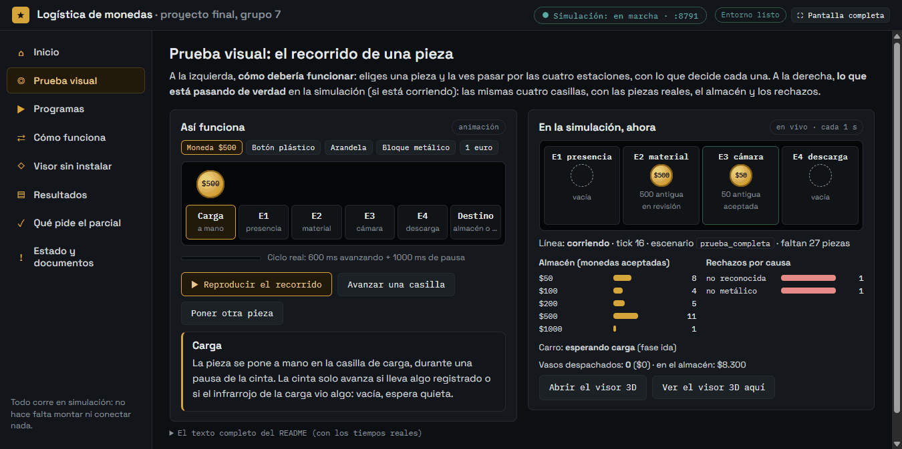
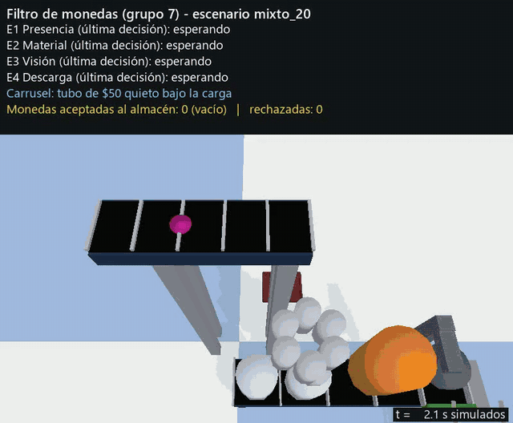
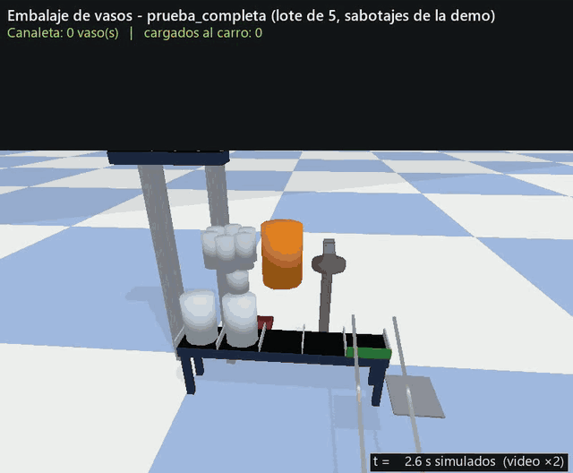
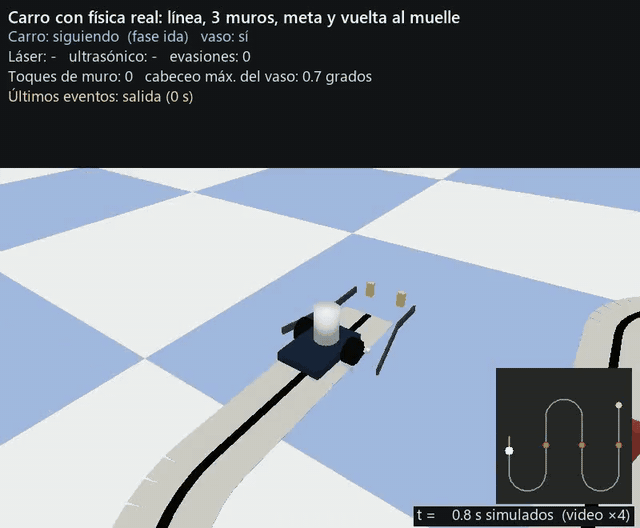
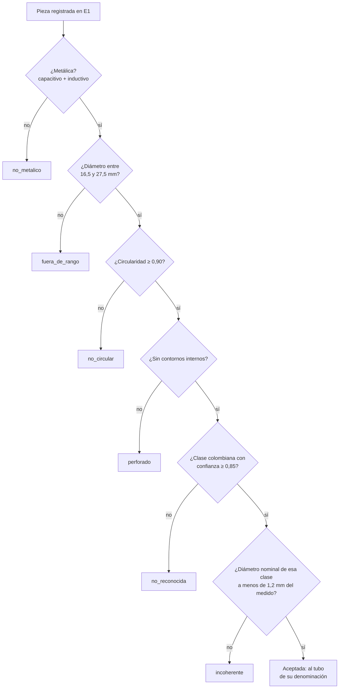
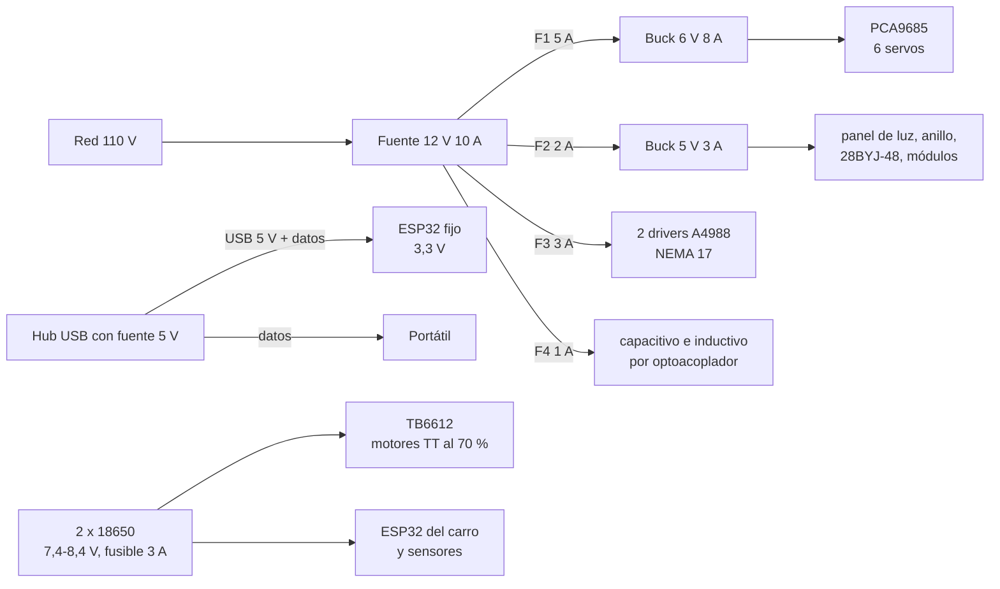
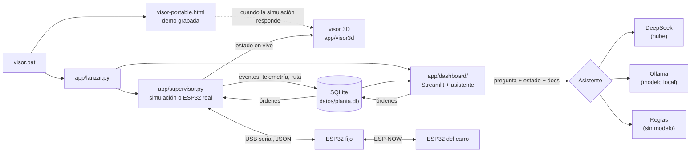
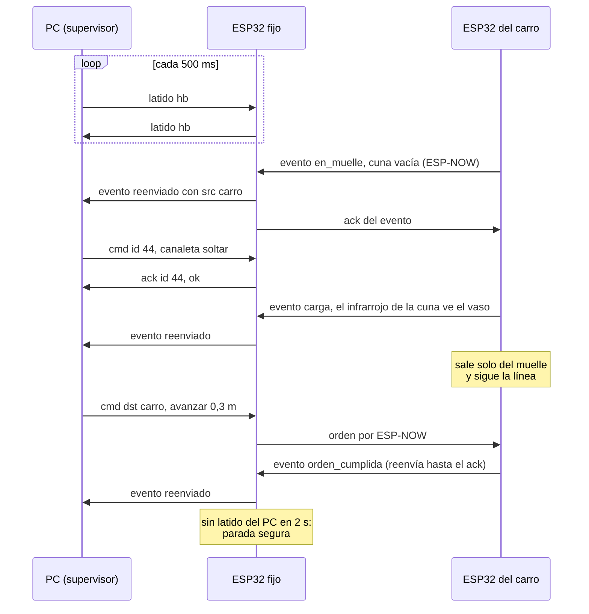

# Sistema de Logística de Monedas Inteligentes

## ¿Quiere probarlo? → aquí está

Doble clic en **[`ABRIR.bat`](ABRIR.bat)** (en Linux o Mac, `abrir.sh`). Se abre la **app del proyecto** en
una ventana tipo programa, con todo lo que pide el parcial en un solo lugar y explicado paso a paso:

- **Prueba visual**: una pieza (moneda, botón, arandela, bloque o moneda extranjera) recorre las 4
  estaciones del filtro, animada y explicada, y al lado se ve **lo que pasa de verdad** en la simulación:
  las piezas reales en cada estación, el almacén y los rechazos por causa, actualizados cada segundo.
- **Programas** (como en Docker Desktop: cada fila con su estado y cuánto tarda): la línea en vivo
  (visor 3D + dashboard de Streamlit; el visor tarda ~8-10 s en responder), las 4 escenas de PyBullet,
  el asistente, las 937 pruebas automáticas (~4-5 min) y el chequeo del PC.
- **Cómo funciona**, el **visor 3D sin instalar nada**, los **resultados** (videos y capturas), **qué pide
  el parcial** con qué se prueba cada punto, y el **estado honesto** del proyecto.

Solo hace falta Python 3.9 o más nuevo. La primera vez que se inicia algo de Python, la app prepara
sola la instalación mínima (~0,7 GB; unos **3 min** con las descargas en caché, más en un PC nuevo
porque PyBullet se compila ~10 min con las Microsoft C++ Build Tools) y lo muestra con una barra de
progreso. Sin la app, lo mismo se abre con `visor.bat` y `simulaciones.bat`: ver [Cómo verlo](#cómo-verlo).
Qué hay en cada sección de la app y qué pasa con cada botón, y qué hacer si algo falla:
[Paso a paso → con la app](#2-cómo-probarlo-con-la-app-sección-por-sección).



## ¿Quiere saber cómo funciona? → aquí está todo

Todo lo técnico sigue abajo, completo, en este orden:

0. [Paso a paso](#paso-a-paso): [cómo se hizo](#1-cómo-se-hizo-paso-a-paso) (con enlaces a la bitácora),
   cómo probarlo [con la app](#2-cómo-probarlo-con-la-app-sección-por-sección) y
   [sin la app](#3-cómo-probarlo-sin-la-app-desde-la-consola), y [qué falta para el montaje real](#4-con-el-montaje-real-paso-a-paso-lo-que-falta).
1. [Lo que nos tocó: el elemento 7](#lo-que-nos-tocó-el-elemento-7): qué exige el detector de monedas y vasos.
2. [Cómo verlo](#cómo-verlo): instalación mínima o completa, `visor.bat`, puertos, visor portable y
   [las simulaciones de PyBullet](#las-simulaciones-de-pybullet-para-quien-evalúa).
3. [La idea general](#la-idea-general): arquitectura, y el recorrido de
   [una moneda](#el-recorrido-de-una-moneda), [un vaso](#el-recorrido-de-un-vaso) y
   [el carro](#el-carro-y-la-ruta).
4. [Conceptos que usamos](#conceptos-que-usamos) y [decisiones de diseño y por qué](#decisiones-de-diseño-y-por-qué).
5. [Filtros que se complementan](#filtros-que-se-complementan), con los
   [errores simulados a propósito](#errores-simulados-a-propósito) y la [replicación real](#replicación-real).
6. [Conexiones y parte eléctrica](#conexiones-y-parte-eléctrica).
7. [El software por dentro](#el-software-por-dentro): [el asistente](#el-asistente),
   [el firmware de los dos ESP32](#firmware-de-los-dos-esp32) y [las pruebas automáticas](#pruebas-automáticas).
8. [Lo que nos enseñó la simulación](#lo-que-nos-enseñó-la-simulación) y [costo y peso](#costo-y-peso).
9. [Estado del proyecto: lo hecho y lo que falta](#estado-del-proyecto-lo-hecho-y-lo-que-falta).
10. [Instalar en otro PC](#instalar-en-otro-pc), [documentación](#documentación) (los `docs/` a fondo) y
    [qué hace cada archivo](#qué-hace-cada-archivo).

---

Proyecto del segundo corte de Micros y Laboratorio, quinto semestre de Ingeniería Mecatrónica,
Universidad Militar Nueva Granada (2026-2). Somos el **grupo 7**, y el elemento diferencial que nos
tocó es el **detector de elementos de monedas y vasos**: además de todo el sistema general que pide
el enunciado, el peso técnico de nuestra sustentación está en decidir con confianza qué entra al
sistema y qué se rechaza.

En pocas palabras: una línea recibe piezas de una en una, filtra las monedas colombianas
(rechaza botones de plástico, botones metálicos, arandelas, bloques de colores y monedas de otros
países), las guarda por denominación, las empaca en vasos tapados de **una sola denominación** y se
las entrega a un carro que sigue una línea, esquiva tres muros, llega a la meta y vuelve solo al
muelle. Todo lo vemos en un visor 3D, se sigue en un dashboard de Streamlit y se le puede preguntar
(o dar órdenes) a un asistente por texto o por voz, incluso sin internet.

Hoy el sistema completo corre en **simulación con física real** (PyBullet) y el firmware de los dos
ESP32 está escrito y probado contra una estación emulada. Lo que falta es el montaje físico: eso está
explicado sin rodeos en [Estado del proyecto](#estado-del-proyecto-lo-hecho-y-lo-que-falta).


## Paso a paso

Cuatro recorridos, cada uno completo por sí solo: [cómo se hizo](#1-cómo-se-hizo-paso-a-paso),
[cómo probarlo con la app](#2-cómo-probarlo-con-la-app-sección-por-sección),
[cómo probarlo sin la app](#3-cómo-probarlo-sin-la-app-desde-la-consola) y
[qué hace falta para el montaje real](#4-con-el-montaje-real-paso-a-paso-lo-que-falta).

### 1. Cómo se hizo, paso a paso

La historia completa, sesión por sesión y con lo que falló, está en la [bitácora](docs/bitacora.md). Otro
documento parecido de nombre, [`docs/paso-a-paso.md`](docs/paso-a-paso.md), es otra cosa: los **17 puntos del
funcionamiento** (qué hace la máquina en cada estación), y cada uno con el estado de su revisión con el grupo. En
resumen, este fue el orden:

1. **Andamiaje y control puro** (fases 0 y 1, [bitácora](docs/bitacora.md#2026-09-22--fase-0-y-fase-1)):
   configuración, tabla de monedas, esquema de SQLite y la lógica de `control/` (registro de casillas, reglas de
   rechazo, máquinas de estado) probada **sin PyBullet**, contra un hardware falso en memoria.
2. **Mundo simulado y sensores** (fases 2 y 3, [fase 2](docs/bitacora.md#2026-09-22--fase-2) y
   [cierre de la fase 3](docs/bitacora.md#2026-09-22--cierre-de-la-fase-3)): las cintas en URDF y PyBullet, los
   sensores emulados con rayos y la HAL de simulación. Aquí apareció el primer fallo serio: PyBullet reutiliza los
   identificadores de cuerpos borrados y una pieza heredaba el veredicto de otra.
3. **Persistencia, dashboard y visor 3D** (fase 4,
   [bitácora](docs/bitacora.md#2026-09-22--fase-4-persistencia-y-dashboard) y
   [visor](docs/bitacora.md#2026-09-22--visualización-3d-paso-a-paso-y-sensores)): supervisor, SQLite en modo WAL,
   Streamlit y el visor de Three.js con el paso a paso guiado.
4. **Revisión con el grupo, punto por punto** (del
   [punto 1](docs/bitacora.md#2026-09-22--revisión-del-punto-1-y-almacén-por-denominación) en adelante): cada uno
   de los 17 puntos se discutió y se aprobó por separado. De ahí salieron los cambios grandes: el
   [filtro total y el almacén revólver](docs/bitacora.md#2026-09-25-3--filtro-total-almacén-revólver-vasos-opacos-con-celda-de-carga)
   (de 7 estaciones a 4) y, un día después, [fuera la celda de carga](docs/bitacora.md#2026-09-25-4--corrección-fuera-la-celda-de-carga)
   (el peso pasó a ser estimado por conteo).
5. **El carro** (fase 6, [bitácora](docs/bitacora.md#2026-09-26-4--puntos-12-y-13-aprobados-punto-14-el-carro-va-y-vuelve-solo)):
   muelle de carga, seguimiento de línea, evasión de los tres muros y la vuelta solo, con física real.
6. **Conexionado y parte eléctrica** ([bitácora](docs/bitacora.md#2026-09-26-9--conexionado-pin-a-pin-caja-como-tablero-y-carro-con-nombres)):
   cada pin en `sim/conexiones.py`, de donde salen los cables del visor, `docs/conexiones.md` y los pines del firmware.
7. **Asistente** (fase 7, [bitácora](docs/bitacora.md#2026-09-27-2--fase-7-asistente-deepseek-y-órdenes-al-carro)):
   DeepSeek, después el modelo local con Ollama y las reglas, y la voz sin internet.
8. **Firmware de los dos ESP32** (fase 8, [bitácora](docs/bitacora.md#2026-09-27-3--fase-8-firmware-de-los-dos-esp32-y-hardware-real)):
   MicroPython, protocolo con ack y latido, y una estación emulada para probarlo sin placas.
9. **Visor remodelado y simulaciones en ventana** ([visor](docs/bitacora.md#2026-09-28--visor-3d-remodelado-a-fondo-con-piezas-reutilizables-13-agentes),
   [escenas de PyBullet y física contra 3D](docs/bitacora.md#2026-09-28--simulaciones-de-pybullet-en-ventana-videos-y-física-vs-3d-puntos-f-y-g)).
10. **Tiempos reales y revisiones lógicas**: el [carrusel con su tiempo real](docs/bitacora.md#2026-09-28--el-carrusel-con-su-tiempo-real-la-moneda-espera-a-que-su-tubo-llegue-pedido-14),
    las revisiones que encontraron [7 bugs de órdenes, serial y vasos](docs/bitacora.md#2026-09-28--revisión-lógica-7-bugs-de-órdenes-serial-y-vasos-depurador)
    y la medición cuadro a cuadro que mostró monedas cayendo a tubos en movimiento
    ([arreglo](docs/bitacora.md#2026-09-29--la-caída-ocupa-el-carrusel-el-giro-siguiente-espera-a-que-la-moneda-llegue-pedido-14-depurador)).
11. **Para quien lo prueba por primera vez** ([bitácora](docs/bitacora.md#2026-10-05--arreglos-para-quien-lo-prueba-por-primera-vez--app-de-la-práctica-plan-plan-apps-practicas-p9)
    y [la noche siguiente](docs/bitacora.md#2026-10-05-noche--menos-peso-readme-probarlo--cómo-funciona-y-app-tipo-docker-desktop-plan-plan-organizar-apps-agente-p)):
    puerto libre automático, instalación mínima, la app del proyecto y menos peso en el repositorio.

Lo que aprendimos de cada fallo está resumido en [Lo que nos enseñó la simulación](#lo-que-nos-enseñó-la-simulación).

### 2. Cómo probarlo con la app, sección por sección

Doble clic en **`ABRIR.bat`** (Linux o Mac: `sh abrir.sh`). Se abre una ventana tipo programa con una barra
lateral; la consola que queda minimizada es la que mantiene viva la app (si se cierra, la app ya no puede arrancar
nada). Arriba siempre están el chip **Simulación** (en marcha / corrida terminada / apagada, con su puerto; un clic
lleva a la prueba visual), el estado del entorno y **Pantalla completa**.

| Sección | Qué hay | Qué pulsar y qué debería pasar |
|---|---|---|
| **Inicio** | Qué hace el proyecto, el video del filtro y cuatro atajos | Cada atajo lleva a su sección (y en Programas deja elegido el programa). El aviso amarillo explica la primera instalación. |
| **Prueba visual** | Izquierda: el recorrido animado de una pieza. Derecha: lo que pasa de verdad en la simulación | Elegir la pieza (moneda de $500, botón de plástico, arandela, bloque metálico o 1 euro) → **Reproducir el recorrido** (un paso cada 1,6 s, el ciclo real) o **Avanzar una casilla** de a una; **Poner otra pieza** vuelve a empezar. Abajo se explica qué decide cada estación y, si la rechaza, con qué causa. A la derecha, si la línea en vivo corre: las 4 casillas reales, el almacén y los rechazos por causa, cada segundo; **Abrir el visor 3D** o **Ver el visor 3D aquí**. Si no corre: **Arrancar la línea en vivo**. |
| **Programas** | La lista de lo que se puede arrancar, con su estado, y el detalle del elegido | Elegir una fila → **Iniciar** (arriba a la derecha o el botón grande) → se ve "Preparando el entorno…" (solo la primera vez, con barra por pasos de pip) y luego "Se está ejecutando…" con lo que dice el programa. **Detener** lo cierra. Las filas: línea en vivo (visor + dashboard, ~10 s en responder), asistente (se le escribe en la caja de abajo o con las sugerencias), las 4 escenas de PyBullet (abren su propia ventana), las pruebas automáticas (~4-5 min, barra con el avance real) y el chequeo del PC (~15 s). |
| **Cómo funciona** | Los 4 bloques de la línea y la arquitectura (esta misma sección del README, con sus diagramas) | Solo lectura. |
| **Visor sin instalar** | El visor 3D portable con una corrida grabada | **Mostrar aquí el visor** (carga ~2,5 MB) o **Abrirlo en una pestaña**. Arriba dice DEMO GRABADA. |
| **Resultados** | Los 4 videos de PyBullet, capturas y las pruebas | Reproducir cada video; el enlace lleva a Programas → Pruebas automáticas. |
| **Qué pide el parcial** | Los 9 puntos del enunciado y con qué programa se prueba cada uno | Cada casilla se marca sola cuando termina bien un programa que la cubre (o a mano). |
| **Estado y documentos** | Lo hecho y lo que falta (la sección [Estado del proyecto](#estado-del-proyecto-lo-hecho-y-lo-que-falta)) y botones a los documentos | README, especificación, paso a paso, conexiones, firmware y el enunciado en PDF. |

**Si algo falla:**

| Qué se ve | Qué hacer |
|---|---|
| La consola del `ABRIR.bat` dice "No encontre Python 3.9 o mas nuevo" | Instalar Python 3.13 (python.org, marcando "Add python.exe to PATH") y volver a abrir; la ventana dice los pasos. Para el entorno del proyecto sirve 3.13 o 3.14. |
| La preparación del entorno se detiene al compilar PyBullet | Faltan las **Microsoft C++ Build Tools** ("Desarrollo para el escritorio con C++"); el panel muestra el comando para instalarlas. Ver [Instalar en otro PC](#instalar-en-otro-pc). |
| El chequeo dice "falló" | Termina con error si encontró al menos una ✗: leer cada línea. Ollama, la voz sin internet o el firmware **no hacen falta** para verlo en simulación. |
| La prueba visual dice "La simulación en vivo no está respondiendo" | Es normal hasta arrancar la línea en vivo; si ya se arrancó, esperar ~10 s (el chip de arriba cambia solo). |
| El puerto 8765 u 8501 está ocupado | No pasa nada: se usa el siguiente libre y la app muestra los enlaces con el puerto real ([Cómo verlo](#cómo-verlo)). |
| Una escena de PyBullet "no aparece" | Abre una ventana aparte: buscarla en la barra de tareas. Se cierra con `q` o con Detener. |

### 3. Cómo probarlo sin la app (desde la consola)

En la carpeta `proyecto-final/`, con el entorno instalado (`instalar.bat`, ver [Cómo verlo](#cómo-verlo)); todos los
comandos con `entorno\Scripts\python`:

1. `instalar.bat` (una vez): opción 1, mínima, o 2, completa.
2. `entorno\Scripts\python -m app.chequeo --rapido`: qué está listo y qué falta, con cómo arreglarlo.
3. `visor.bat` (o `entorno\Scripts\python -m app.lanzar --auto prueba_completa --abrir --abrir-dashboard`): la línea
   en vivo, visor 3D y dashboard. `entorno\Scripts\python -m app.puertos` dice qué puertos va a usar.
4. `simulaciones.bat`, o cada escena: `entorno\Scripts\python -m sim.ver.filtro_monedas` (también
   `embalaje_vasos`, `carro_pista`, `todo_junto`). Con `--sin-ventana --velocidad 50` corre la misma escena sin abrir
   nada y al final imprime el resultado; la del filtro, por ejemplo:
   `FIN: 7 al almacen, 11 a rechazo, falsos rechazos 1, falsas aceptaciones 0`.
5. `entorno\Scripts\python -m app.charla`: el asistente por consola (reglas, sin clave ni internet), sobre una copia
   de la base. Con la línea en vivo, la pestaña Asistente del dashboard sí ejecuta las órdenes.
6. `entorno\Scripts\python -m pytest -q`: las [pruebas automáticas](#pruebas-automáticas) (~4 min); una sola capa:
   `... -m pytest -q tests/control`.
7. `entorno\Scripts\python -m app.puente_serial`: el puente con el ESP32 fijo o, sin placa, con la estación emulada
   (telemetría, mensajes perdidos y la última línea cruda).
8. Sin Python: abrir `visor-portable.html` (demo grabada) o ver los [videos](#las-simulaciones-de-pybullet-para-quien-evalúa).

### 4. Con el montaje real, paso a paso (lo que falta)

**Hoy el proyecto se entrega en simulación**: el montaje físico no está construido. El software para las placas sí
está, así que el camino es este, y cada paso dice si ya está hecho:

1. **Comprar y construir** (falta): la lista de materiales con precios está en [`docs/componentes.md`](docs/componentes.md)
   y [`docs/costos.md`](docs/costos.md); las medidas, en el visor 3D (todo lo del diseño está modelado con su soporte).
2. **Cablear** (falta): pin a pin según [`docs/conexiones.md`](docs/conexiones.md) y la parte eléctrica de
   [`docs/electrica.md`](docs/electrica.md) (fusibles, convertidores, Vref de los A4988). El circuito se puede ver
   antes funcionando en [Wokwi](wokwi/README.md).
3. **Subir el firmware** (listo en software, sin probar en placas): grabar MicroPython en cada ESP32 y
   `python -m firmware.subir fijo` / `python -m firmware.subir carro` (detalle en [`firmware/README.md`](firmware/README.md)).
4. **Comprobar la comunicación** (listo contra la estación emulada): `python -m app.puente_serial` con el ESP32 fijo
   conectado; si la última línea cruda no cambia, la placa no manda nada; si cambia pero no se entiende, es formato.
5. **Pasar a real**: en `config/parametros.yaml`, `hardware.backend: sim` → `real`, y `visor.bat`. Con eso ya
   funcionan el monitoreo de los sensores, la prueba de actuadores y las órdenes al carro.
6. **Medir y calibrar** (falta): cada valor marcado PROVISIONAL (medidas del vaso y la tapa, ángulos de los servos,
   umbral de la cortina, mm por vuelta del rodillo, velocidad de las ruedas) y la **prueba de banco de 200 pasadas**
   del error de cada sensor; qué medir y dónde se cambia, en [`docs/replicacion.md`](docs/replicacion.md).
7. **Visión real** (falta, fase 5): fotos con `vision/capturar_dataset.py`, entrenamiento con `vision/entrenar.py`
   y el procesamiento de imagen con OpenCV. **La línea automática con hardware real espera este paso**: hasta
   entonces la cámara de la simulación funciona en modo oráculo.
8. **Asistente con DeepSeek** (falta una clave válida): la que tenemos fue rechazada (401); el modelo local y las
   reglas sí están probados.

## Lo que nos tocó: el elemento 7

El enunciado repartió un elemento diferencial por grupo. El nuestro es el 7:


En la práctica eso significó tres exigencias que guiaron todo el diseño:

- **Aceptar monedas colombianas reales**, de la familia nueva y de la antigua, incluidas piezas
  gastadas, manchadas o descoloridas por el uso.
- **Rechazar todo lo demás**: botones de plástico, botones metálicos del tamaño de una moneda,
  bloques de colores y monedas extranjeras (algunas miden casi lo mismo que las nuestras). Los
  filtros se prueban **uno por uno** en la sustentación, así que cada etapa tiene que poder
  demostrarse sola y aportar algo que las otras no aportan. Y ninguna puede ser un cuello de botella:
  todo lo rechazado sale de la línea.
- **Vigilar también los vasos.** Durante la operación pueden retirar un vaso, cambiarlo por una
  figura distinta, cambiarlo por otro vaso idéntico o meter una mano. El sistema lo tiene que
  descubrir con sus sensores y reaccionar **sin parar toda la producción**.

Una condición nos simplificó la vida: las piezas se ponen de a una, a mano y en orden. No hace falta
tolva ni disco de alvéolos; el sistema no tiene que crear la fila, solo no perderla. Los elementos
de los demás grupos (1 a 6 y 8) no los implementamos.

## Cómo verlo

**Primero, instalar (una sola vez, con internet).** Sin eso, `visor.bat` solo puede abrir la demo
grabada (lo avisa en su ventana): ni simulación en vivo, ni dashboard, ni asistente. Doble clic en
**`instalar.bat`** y elegir:

| Opción | Qué instala | Para qué alcanza | Cuánto |
|---|---|---|---|
| **1, mínima** | `entorno\` con 13 paquetes ([`requirements-minimo.txt`](requirements-minimo.txt): PyBullet, Streamlit, OpenCV, pandas, plotly, pytest…) | visor 3D en vivo, dashboard, las 4 escenas de PyBullet, el asistente por escrito y las pruebas | ~0,7 GB; unos 3-4 min con las descargas en caché, más en un PC nuevo según la red |
| **2, completa** | todo [`requirements-lock.txt`](requirements-lock.txt) (además voz con Whisper, torch/keras para la visión, herramientas del firmware), arma el firmware, prepara el modelo local si está Ollama y corre el chequeo | lo anterior + voz sin internet, entrenar la visión y subir el firmware a los ESP32 | ~1,8 GB; 20-40 min |

Las dos necesitan Python 3.14 (o 3.13) y, en Windows, las **Microsoft C++ Build Tools**: PyBullet
3.2.7 no trae instalador listo y pip lo compila (unos 10 minutos la primera vez). Detalle en
[Instalar en otro PC](#instalar-en-otro-pc).

Después, doble clic en **`visor.bat`**. Hace tres cosas:

1. Abre al instante `visor-portable.html` con una corrida grabada (la demo), sin esperar a nada.
2. Arranca la simulación por detrás, en una ventana minimizada (cerrarla la detiene).
3. Apenas la simulación responde, la misma pestaña pasa sola al **visor en vivo**, sin recargar, y
   cuando el dashboard de **Streamlit** está listo se abre también en el navegador
   (<http://localhost:8501>).

**Puertos.** El visor en vivo usa el **8765** y el dashboard el **8501**. Si otro programa del PC ya
tiene uno de ellos, `visor.bat` usa el siguiente libre (8766, 8502…) y lo dice en su ventana; el
visor portable encuentra solo la simulación y el dashboard se abre en el puerto que de verdad quedó.
Para fijar otro: `entorno\Scripts\python -m app.lanzar --auto prueba_completa --puerto-visor 9000` o la
variable de entorno `PLANTA_PUERTO_VISOR` (lo resuelve [`app/puertos.py`](app/puertos.py)).

`visor-portable.html` es un solo archivo de unos 2,5 MB (Three.js, el visor y la demo van adentro).
Abierto en otro PC, sin Python y sin internet, muestra la demo grabada; si en ese PC sí está la
simulación, pasa a vivo igual. Se rehace con `python -m app.portable` (y solo, cada vez que se abre
`visor.bat` o se graba una demo nueva con `python -m app.grabar_demo`).

Qué se ve:

- **Visor 3D** (Three.js, <http://localhost:8765>, o el puerto que diga `visor.bat`): la línea completa en vivo. Tiene un **paso a
  paso guiado** (la cámara va a cada zona y resalta sus sensores), la lista de los **13 sensores** y
  de los **componentes** (clic en uno y la cámara lo encuadra), los **cables** pin a pin, y botones
  de sabotaje: retirar un vaso, cambiarlo por una figura o por un vaso igual, poner un vaso con algo
  adentro, meter la mano en la carga, en el llenado o en la tapa y prensa, y cortar la radio del
  carro. Es también el boceto de cómo se construye: todo lo que existe en el diseño está modelado con
  su soporte.
- **Dashboard** (Streamlit, <http://localhost:8501>): pestañas Resumen, Monedas y vasos, Calidad del
  filtro, Línea en vivo, Pruebas, Carro y ruta, Montaje real, Asistente y Ayuda. Está pensado para alguien que
  no conoce el sistema: frases simples de "qué está pasando", una matriz de lo que era cada pieza
  contra lo que decidió la línea, el mapa del carro y los mismos sabotajes del visor.
- **Asistente** (pestaña del dashboard; en el visor se ve en la pantalla del portátil): se le
  pregunta por escrito o por voz por las cifras de la corrida o por cualquier parte del proyecto, y
  se le puede pedir que mueva el carro o la línea.


**Los filtros, uno por uno.** El enunciado dice que en la sustentación cada filtro se prueba por
separado. Además de la corrida normal, el dashboard y el visor (los dos en su pestaña **Pruebas**, "Probar un
filtro") corren **la prueba de un solo filtro**: material, diámetro fuera de rango, no
circular, perforado, no reconocida o incoherente, cada una con piezas que SOLO ese filtro debe
rechazar (son los mismos escenarios de las pruebas automáticas, así que lo que se muestra es lo que
está probado). Arriba sale qué se espera y cuántas piezas ya rechazó por esa causa. En el visor,
pestaña **Sensores**, cada sensor tiene su botón **"Ver la prueba de este sensor"**: manda la prueba
que hace trabajar solo a ese sensor (un filtro, un sabotaje, una orden al carro) y la cámara se queda
mirándolo. Y con **"Colocar una pieza"** (también en la pestaña Pruebas) se pone a mano en la próxima carga la que uno quiera: una
moneda de cada denominación y familia, una de 1 euro, un botón de plástico o metálico, un bloque, un
disco de 10 mm o una cara de $500 con otro diámetro.

**Nunca se confunde una demo con lo real.** El visor muestra arriba "DEMO GRABADA" o "SIN CONEXIÓN
CON LA SIMULACIÓN" cuando no está en vivo, y al lado de los ticks un chip "con internet" / "SIN
INTERNET" (sin red, la nube de DeepSeek se pone gris). El dashboard dice de dónde salen los datos
(simulación, ESP32 real o emulado), si hay internet, y pone un aviso grande "NO ES EN VIVO" cuando la
simulación no está corriendo. Sin internet sigue funcionando todo lo de la planta: el ESP32 fijo
habla con el PC por USB, el carro con el ESP32 fijo por ESP-NOW (radio directa, sin router) y los
datos viajan por SQLite dentro del mismo PC.

### Las simulaciones de PyBullet, para quien evalúa

El visor 3D es para mirar, pero la física está en PyBullet. Para verla en su ventana real hay un
menú: doble clic en **`simulaciones.bat`** y se elige una de cuatro escenas (o abrir la carpeta de
videos). También se puede abrir cada una directo desde la carpeta `simulaciones/`. Todas usan la misma
simulación y la misma lógica que la corrida normal, a tiempo real (espacio pausa, `r` reinicia, `q`
sale):

| Escena | Qué muestra | Comando |
|---|---|---|
| **1. Filtro de monedas** | Nuestra parte. 18 piezas mezcladas (y 2 casillas vacías) (monedas, botones, arandelas, bloques, extranjeras), cada una con un rótulo que la sigue con su material y, si la rechazan, su causa; cada tubo del almacén con su cuenta. Resultado: 7 al almacén y 11 a rechazo, sin ninguna falsa aceptación; una moneda buena ($50 antigua) sale rechazada como `no_reconocida` por el error de la cámara que simulamos a propósito (las dos fotos dieron clases distintas), que es justo lo que el sistema prefiere: ante la duda, rechaza. | `python -m sim.ver.filtro_monedas` |
| 2. Embalaje de vasos | Verificación, llenado por lotes, tapa, prensa, canaleta, y los sabotajes (vaso retirado, cambiado, mano en la cortina). | `python -m sim.ver.embalaje_vasos` |
| 3. Carro en la pista | El carro con motores y ruedas de verdad: sigue la línea, esquiva los tres muros, llega a la meta y vuelve de reversa al muelle. | `python -m sim.ver.carro_pista` |
| 4. Todo junto | La corrida completa: la planta en la ventana de PyBullet y el carro en una segunda ventana (PyBullet permite una sola ventana por proceso y el carro vive en su propio mundo). | `python -m sim.ver.todo_junto` |



Videos completos: [filtro de monedas](docs/videos/filtro_monedas.mp4) ·
[embalaje de vasos](docs/videos/embalaje_vasos.mp4) · [carro en la pista](docs/videos/carro_pista.mp4) ·
[todo junto](docs/videos/todo_junto.mp4). Se regraban con `python -m sim.ver.grabar`.

<table><tr>
<td></td>
<td></td>
</tr></table>

**¿La física es la misma que el 3D?** Lo revisamos medida por medida con una prueba automática
(`tests/sim/test_fisica_vs_3d.py`): anchos de las cintas, paso de las casillas, posición de cada
estación, las 9 monedas (masa y diámetro), el carro, el muelle, la pista y los muros. Y con física:
cada moneda soltada sobre su tubo cae adentro, el vaso cuelga de su pestaña en los rieles y no se cae,
y en el viaje completo el vaso se inclina menos de 1°. El informe, fila por fila y con lo que se
corrigió, está en [`docs/fisica-vs-3d.md`](docs/fisica-vs-3d.md).

## La idea general

La planta tiene cuatro subsistemas en fila: la **cinta de monedas** (filtrado y conteo), el
**almacén revólver**, la **cinta de vasos** (embalaje) y la **canaleta de entrega**, que le pasa los
vasos al **carro**.

```mermaid
flowchart LR
    OP["Operador<br/>pone una pieza"] --> CM
    subgraph CM["Cinta de monedas (4 casillas)"]
        E1["E1 presencia<br/>infrarrojo"] --> E2["E2 material<br/>inductivo; capacitivo bajo E1"] --> E3["E3 visión<br/>cámara cenital, 2 fotos"] --> E4["E4 descarga<br/>compuerta de desvío"]
    end
    E4 -- "rechazo, con su causa" --> RM["Bandeja de rechazo<br/>de monedas"]
    E4 -- "moneda aceptada" --> AL["Almacén revólver<br/>6 tubos"]
    AL -- "lote de una denominación" --> CV
    subgraph CV["Cinta de vasos"]
        V1["Verificación<br/>cámara + interior"] --> V2["Llenado"] --> V3["Tapa"] --> V4["Prensa"] --> V5["Descarga"]
    end
    V5 -- "inválido o vacío" --> RV["Bandeja de rechazo<br/>de vasos"]
    V5 -- "vaso tapado" --> CA["Canaleta a 15°<br/>rieles con PTFE"]
    CA -- "un vaso a la vez" --> CR["Carro en el muelle"]
    CR --> PI["Pista con 3 muros"] --> ME["Meta"]
    ME -- "vuelve solo" --> CR
```



### El recorrido de una moneda

La cinta de monedas es negra mate, con separadores cada 40 mm que forman casillas. Un motor paso a
paso la avanza exactamente una casilla (600 ms) y la detiene 1000 ms: en esa pausa cada estación lee
y decide. Pusimos tiempos lentos a propósito, porque el montaje real tiene que verificar con calma:
el ciclo es de 1,6 s, unas 37,5 piezas por minuto si el carrusel del almacén ya tiene el tubo
listo. Cuando la moneda va a un tubo lejano, la cinta la espera (ver el almacén, más abajo): en la
corrida completa el ritmo real queda en unas 19,5 piezas por minuto (el carrusel tampoco gira mientras una moneda todavía está cayendo a su tubo: 0,4 s).

1. **Carga.** Durante una pausa ponemos una pieza en la casilla de carga. La cinta solo avanza si
   lleva algo registrado o si el infrarrojo de la carga vio algo; vacía, espera quieta.
2. **E1, presencia.** Un infrarrojo FC-51 mira hacia abajo. Como la cinta casi no refleja, solo
   "ve" algo si hay una pieza. Ocupada: se crea el registro de esa casilla, con un número propio que
   la acompaña todo el camino. Vacía: ninguna otra estación gasta tiempo en ella.
3. **E2, material.** Un sensor capacitivo y uno inductivo, **debajo de la cinta** mirando hacia
   arriba a través de la banda (el capacitivo va bajo la casilla de E1 y su lectura viaja con la
   pieza; el inductivo, bajo E2). Capacitivo sí e inductivo no: no metálico, rechazo `no_metalico`,
   y ni siquiera gasta la cámara.
4. **E3, visión.** La casilla queda quieta bajo una cámara cenital con anillo de luz difusa (la
   cinta negra es el fondo). Se toman **dos fotos**: el PC mide el diámetro en milímetros, la
   circularidad, busca agujeros y clasifica la cara de la moneda. Si algo falla, el primer filtro
   que falla decide la causa y nadie lo revierte. La misma imagen mide si la cinta quedó bien en su
   casilla; si se corrió, se corrige con micropasos en la misma pausa.
5. **E4, descarga.** La pieza cae por el extremo de la cinta a un embudo. Una compuerta de desvío
   la manda al almacén o a la **única bandeja de rechazo**. En reposo apunta al rechazo: solo se
   mueve hacia el almacén para una moneda registrada y aceptada.
6. **Almacén.** El carrusel ya tiene bajo el punto de carga el tubo de su denominación ($50, $100,
   $200, $500, $1.000 u "otras"); la moneda cae casi vertical al tubo. Si ese tubo está lleno, la
   moneda espera en la descarga y la cinta de monedas se detiene: **ninguna moneda colombiana
   aceptada se bota**.

Cómo decide cada estación, con el código real, los umbrales de la configuración, el voto de tres
lecturas y por qué un rechazo nunca se revierte: [`docs/logica-interna.md`](docs/logica-interna.md).

### El recorrido de un vaso

Los vasos son opacos, personalizados, y llevan una cinta de papel alrededor con el mismo marcador
ArUco impreso seis veces (siempre hay uno de frente a la cámara, gire como gire el vaso).

1. **Verificación.** Una webcam al costado de la cinta, con un panel de luz detrás, ve cada vaso
   como una silueta oscura. En la imagen miramos dos franjas, como dos "barreras virtuales": una a
   media altura (tiene que estar ocupada) y otra justo encima del borde (tiene que estar libre). La
   cámara anota el número del marcador, y un VL53L0X que mira desde arriba **hacia el interior del
   vaso** comprueba que llegó vacío: un vaso con algo adentro no entra.
2. **Llenado.** Cuando un tubo junta un lote completo (10 monedas por defecto, se cambia en caliente
   desde el dashboard), el carrusel lleva ese tubo sobre el único agujero de la placa, se abre el
   obturador y el lote entero cae al vaso. Justo antes, la cámara re-verifica: si ahí hay una figura,
   no hay nada o el marcador cambió, no se suelta nada y la cinta de vasos salta a la siguiente
   casilla válida. Sin paro de línea. Después, la cámara confirma que las monedas llegaron.
3. **Tapa.** Se verifica otra vez **en ese instante** (no confiamos en lo registrado antes). Si el
   vaso está lleno y sigue siendo el mismo, un escape de servo suelta una tapa que cae unos 13 mm y
   se centra sola por su borde cónico. La cámara confirma que quedó puesta; si no, se suelta otra una
   vez, y si tampoco, el vaso queda inválido. Un vaso vacío no se tapa: se desecha.
4. **Prensa.** Con la cinta quieta, un servo MG996R gira una leva excéntrica 0 → 180 → 0 grados y
   asienta la tapa a presión. Antes, la cámara revisa vaso, marcador y tapa.
5. **Descarga.** Si el vaso llegó tapado y válido, un empujador con manivela lo pasa de lado a la
   canaleta. Si no, no se empuja: en el siguiente avance cae por el extremo de la cinta a la bandeja
   de rechazo de vasos. Si la canaleta está llena, el vaso tapado espera y la cinta de vasos se
   detiene; la de monedas sigue guardando en los tubos.
6. **Cortina de seguridad**, todo el tiempo sobre la zona de tapa y prensa. Si ve una mano, la prensa
   **sube** y se detiene arriba, tapa y empujador se congelan y la cinta de vasos se detiene; la de
   monedas sigue. Al despejarse, la cámara revisa todos los vasos antes de seguir.

Al final del turno, lo que quedó en los tubos se puede empacar en vasos incompletos (cada uno sigue
siendo de una sola denominación, botón "Embalar lo guardado") o dejarse guardado: el turno siguiente
arranca con esas monedas.

### El carro y la ruta


El carro tiene dos ruedas motrices con motorreductores TT, encoders de 20 ranuras, una rueda loca de
bola, un arreglo de cinco infrarrojos de línea, un láser VL53L0X al frente (con un HC-SR04 de
respaldo) y un infrarrojo que mira la cuna de carga.

- **Carga en el muelle.** El carro entra de reversa a un muelle, como un camión. Dos guías en V
  empujan dos **rodillos guía** en sus esquinas traseras y lo centran, y dos topes con espuma lo paran
  con la cuna justo bajo el final de la canaleta. Sabe que llegó porque sus encoders dejan de contar
  contra el tope (entra con PWM bajo para que la llanta no patine). Avisa por ESP-NOW; la estación
  comprueba que la cuna esté vacía, suelta **un** vaso y el infrarrojo de la cuna confirma la carga.
- **Ida.** Sigue la línea con control proporcional-derivativo, a 0,40 m/s en las rectas. Con algo a
  menos de 50 cm baja a velocidad de maniobra; si el láser ve el muro a menos de 200 mm en tres
  mediciones seguidas, frena, mira a ±30° y esquiva hacia el lado con más espacio: sale a 45°, pasa
  derecho y vuelve a 60° hasta **ver** la línea con el infrarrojo del centro (no vuelve contando
  pulsos).
- **Meta.** En la franja negra de la meta espera a que le saquen el vaso (lo nota el infrarrojo de
  la cuna), da media vuelta y **vuelve solo**, esquivando los mismos muros. En la marca de giro da
  media vuelta otra vez, se endereza siguiendo la línea 15 cm y entra de reversa al muelle.
- **Órdenes.** Además del recorrido automático, obedece órdenes del asistente o de los botones del
  dashboard (detener, avanzar, retroceder, girar, ir a un punto, ir a la meta, volver al muelle,
  retomar la línea). Sabe dónde está por odometría, que se pone en cero cada vez que entra al muelle;
  antes de moverse mira el camino al frente y a ±15°, y en marcha se detiene si algo aparece adelante
  o si una rueda cuenta mucho más que la otra (algo lo tiene agarrado). Como sus sensores van a 6-7
  cm del piso y no ven lo bajo (las guías del muelle miden 2 cm), además lleva un **mapa fijo** de
  por dónde puede andar: rechaza, sin moverse, un destino o un camino recto que toque la planta, la
  canaleta o el muelle. Esto lo aprendimos a la mala: le pedimos al asistente que el carro
  "atravesara el filtro de monedas", el modelo local lo prometió y el carro se atoró contra el muelle.
  Ahora el asistente contesta que eso no se puede.

En la simulación, ida y vuelta toma unos 2,5 minutos. Lo probamos con los errores de la
configuración y con el **doble** de esos errores: esquiva los seis muros (tres de ida, tres de vuelta)
sin tocarlos y vuelve al muelle con menos de 3 mm de error.

## Conceptos que usamos

**Sensor capacitivo e inductivo.** Los dos detectan sin tocar. El capacitivo reacciona a cualquier
material cerca de su cara (plástico, metal, una mano), porque cambia la capacitancia de su campo. El
inductivo genera un campo magnético alterno y solo reacciona a metal, por las corrientes que se
inducen en él. Juntos dan una respuesta que ninguno da solo: capacitivo sí e inductivo no es un objeto
**no metálico**. Los dos son NPN de 6-36 V, así que llegan al ESP32 por optoacopladores, nunca
directo.

**VL53L0X (tiempo de vuelo).** Un sensor láser que mide distancia cronometrando cuánto tarda la luz
en ir y volver. No mide en un rayo sino en un cono de unos 25°, y eso lo tuvimos en cuenta al
ubicarlo. Usamos el mismo modelo tres veces: cortina de seguridad, interior del vaso y frente del
carro.

**Marcador ArUco.** Un cuadrado blanco y negro, como un código QR muy simple, que OpenCV encuentra en
una imagen y del que lee un número. Nos sirve para saber si un vaso es **el mismo** que se verificó
antes: un vaso idéntico por fuera trae otro número.

**ESP-NOW.** Protocolo de radio de Espressif para que dos ESP32 hablen directo, sin router ni
Wi-Fi. Lo usamos entre el ESP32 fijo y el del carro: no depende de la red del salón y deja libre el
Wi-Fi del PC para la API del asistente.

**Capa de abstracción de hardware (HAL).** Una lista de "enchufes" (avanza la cinta, lee este
sensor, mueve este servo) que el control usa sin saber qué hay del otro lado. Tenemos dos
implementaciones: una que responde con la simulación de PyBullet y otra que manda mensajes por serial
al ESP32. El control no se entera de cuál está conectada.

**Modelo de lenguaje local.** Un modelo como el de DeepSeek pero pequeño (3 mil millones de
parámetros), que corre en la tarjeta gráfica del propio portátil con Ollama. Responde peor que uno
grande, pero funciona sin internet.

## Decisiones de diseño y por qué

Casi nada de lo que se ve hoy fue la primera versión. Cada punto del funcionamiento lo revisamos en
grupo, uno a la vez, y muchas veces la simulación o el 3D nos mostraron que algo no iba a funcionar
en el montaje real. Estas son las decisiones que más pesan:

- **Filtro total con una sola bandeja de rechazo.** Al principio la cinta de monedas tenía siete
  estaciones, dos expulsores laterales con sus servos, sensores que confirmaban cada expulsión y
  tres cubetas. Lo cambiamos por un filtro total: todo sigue hasta la descarga y una sola compuerta
  manda lo que no pasó a una sola bandeja. La cinta bajó a cuatro estaciones (de 28 a 16 cm), se
  fueron dos servos y dos sensores, y cada filtro se sigue demostrando por separado porque **cada
  rechazo queda registrado con su causa**.
- **Compuerta a prueba de fallas.** En reposo apunta al rechazo. Si se corta la comunicación o el
  ESP32 se reinicia, nada desconocido entra al almacén; lo que ningún sensor registró también va al
  rechazo.
- **Visión en vez de barreras infrarrojas.** Para verificar los vasos teníamos seis barreras IR,
  dos sensores de presencia y dos sensores de ranura para la posición de las cintas. Una cámara de
  vasos con un panel de luz detrás los reemplazó: sus "franjas" hacen de barreras virtuales, lee el
  marcador, confirma la tapa y vigila en **cada** avance que no falte ningún vaso en sus cuatro
  casillas (una mano puede sacar un vaso por encima sin cruzar la cortina). Las cámaras de cada cinta
  miden además dónde quedaron los separadores. Quedaron físicos, a propósito, solo los sensores que
  la cámara no puede reemplazar: material (una cámara no distingue plástico pintado de metal),
  cortina (la seguridad no puede depender del PC), interior del vaso (la cámara no ve dentro de un
  vaso opaco), el Hall del carrusel y los del carro (que no lleva cámara). Terminamos con **13
  sensores** en total.
- **Sin celdas de carga; peso estimado por conteo.** Las celdas de carga dan problemas de
  acondicionamiento y ruido, y las descartamos del todo. El peso que muestra el dashboard es la suma
  de las masas nominales de las monedas identificadas, y así está rotulado: **estimado**. Para saber
  si un vaso llega vacío usamos el VL53L0X que mira hacia adentro.
- **Almacén tipo revólver de 6 tubos.** Primero había un selector giratorio con un pico corto que
  desviaba la moneda hacia uno de cinco tubos con compuerta. No era creíble: la moneda llega con
  velocidad y un pico de 3 cm no la desvía con seguridad. Ahora giran los tubos: un 28BYJ-48 pone el
  tubo correcto bajo el punto de carga y la moneda cae casi vertical. Una placa fija con **un solo
  agujero** y un obturador suelta los lotes. Carga y agujero están a 210° entre sí, así que nunca se
  guarda y se suelta a la vez. De siete actuadores pasamos a dos, y un sensor Hall le da al motor
  su referencia al encender.
- **Una denominación por vaso.** Cada vaso lleva una sola denominación, y los vasos son genéricos:
  la denominación la decide el tubo que se abre sobre él. Si un tubo se llena y no hay vaso, la
  moneda espera y la cinta de monedas se detiene con la alarma `tubo_lleno` / `faltan_vasos`.
- **Canaleta a 15° con PTFE.** El vaso cuelga de la pestaña de su reborde (8 mm) entre dos rieles:
  el centro de masa queda por debajo del apoyo y no se puede volcar. Con la altura de las mesas, a
  25° solo cabían dos vasos; elegimos 15° y forramos los rieles con cinta adhesiva de teflón para
  que deslicen parejo (un tubo de PTFE dejaba solo 0,5 mm de holgura). La entrada es un embudo y un
  escape de dos dedos con un solo servo suelta un vaso a la vez.
- **Prensa de leva.** La tapa sella a presión: su reborde salta sobre el labio del vaso, y eso pide
  del orden de 30 a 50 N (valor provisional hasta medirlo); apretar más solo deforma el vaso. Por eso
  la leva (6,5 mm de excentricidad, movida por un MG996R) apunta a **60 N** (la tapa más dura × 1,2),
  que el servo da con margen de ×2,8. El servo sabe su ángulo:
  no hace falta sensor de posición ni puente H. Un resorte limita la fuerza, así que un objeto
  extraño no rompe nada.
- **Cortina de un solo sensor.** Llegamos a tener tres VL53L0X a distintas alturas. Nos quedamos
  con uno a media altura, 65 mm sobre la cinta, con el eje a 85 mm del de la cinta para que su cono
  real no toque vasos, tapa ni prensa. No es un equipo certificado de seguridad: lo que buscamos es
  que el sistema se detenga si ve una mano. La zona por donde cae el lote al vaso la vigila la
  cámara de vasos.
- **Carro de 2 ruedas y rueda loca.** Tres apoyos siempre tocan el piso y gira sobre su eje sin
  patinar; con cuatro ruedas rígidas, en un piso desparejo una queda en el aire y su encoder cuenta
  de más. El vaso va sujeto en cuatro puntos (espuma adelante, lengüeta con resorte atrás, guías a los
  costados), así que no cabecea y el carro puede ir más rápido.
- **Láser al frente y ultrasónico de respaldo.** El HC-SR04 ve lejos pero mide cada 60 ms; el
  VL53L0X mide cada 33 ms. Con la zona de frenado, el carro va rápido en las rectas y llega despacio
  a cada muro. El ultrasónico queda de respaldo porque no le afectan las superficies negras ni el sol.
- **Protocolo con confirmación y latido.** Entre el PC y el ESP32 fijo van líneas JSON numeradas.
  Cada comando espera su `ack` (300 ms, un reintento y después `fallo_comunicacion`), un comando
  repetido no se ejecuta dos veces y un hueco en la numeración es un mensaje perdido que queda
  registrado. Hay latido en los dos sentidos: si el ESP32 no oye al PC en 2 s hace una **parada
  segura** (cintas quietas, prensa arriba, desvío al rechazo, escapes cerrados). El carro guarda sus
  eventos y los reenvía hasta que le confirman; si pierde la radio, termina la vuelta y se queda en
  el muelle.
- **La lógica se escribe una sola vez.** Toda la inteligencia vive en `control/`, en Python puro,
  sin PyBullet ni pyserial. `control/vehiculo.py` (el control completo del carro) y
  `control/protocolo.py` corren tal cual en el PC, en la simulación y dentro del ESP32 del carro
  compilados para MicroPython. Lo que probamos en simulación es literalmente lo que corre en la placa.
- **Simulación o placas con una línea.** `hardware.backend: sim` o `real` en
  `config/parametros.yaml`. Todo número del diseño (umbrales, tiempos, medidas, errores de sensores)
  vive en esa configuración, y lo que todavía no está medido está marcado como PROVISIONAL.

## Filtros que se complementan

La decisión sobre cada pieza se construye acumulando evidencia de etapas independientes. Cada etapa
escribe en el registro de la casilla y **ninguna puede revertir un rechazo anterior**.



| Causa | Etapa | Qué atrapa |
|---|---|---|
| `no_metalico` | Material (E2) | Botones de plástico, bloques, una mano que se puso y se quitó en la carga |
| `fuera_de_rango` | Geometría (E3) | Piezas más chicas o más grandes que cualquier moneda con tubo |
| `no_circular` | Geometría (E3) | Bloques y fichas irregulares |
| `perforado` | Geometría (E3) | Arandelas y botones metálicos con ojales |
| `no_reconocida` | Clasificación (E3) | Monedas extranjeras, botones metálicos lisos, fotos que no convencen |
| `incoherente` | Coherencia (E3) | Una clase que no cuadra con el diámetro que se midió |

**La regla de coherencia** es la que más nos gusta mostrar, porque cruza dos mediciones
independientes. Con monedas extranjeras en juego el diámetro solo no sirve: un euro mide 23,25 mm y
cae entre las de $500; una de veinte céntimos mide 22,25 mm y cae junto a la de $200 nueva. Por eso la
decisión final es por la cara de la moneda, y la coherencia verifica que lo que dice el clasificador
cuadre con lo que midió la geometría. El sistema garantiza rechazar lo que no reconoce con confianza
suficiente; no pretende reconocer cualquier moneda del mundo.

Las monedas de referencia (la tabla completa, con cuatro generaciones, vive en
`config/monedas.yaml`; estas nueve son las verificadas):

| Denominación | Familia | Diámetro (mm) | Masa (g) | Ferromagnética | Bimetálica |
|---|---|---:|---:|---|---|
| $50 | nueva | 17,0 | 2,0 | sí | no |
| $100 | nueva | 20,3 | 3,3 | sí | no |
| $50 | antigua | 21,5 | 4,5 | no | no |
| $200 | nueva | 22,4 | 4,6 | no | no |
| $100 | antigua | 23,0 | 5,3 | no | no |
| $500 | antigua | 23,5 | 7,4 | no | sí |
| $500 | nueva | 23,7 | 7,1 | no | sí |
| $200 | antigua | 24,4 | 7,1 | no | no |
| $1.000 | nueva | 26,7 | 10,0 | no | sí |

Las generaciones más viejas ("muy antigua" e "histórica") están en la tabla "por si acaso", con
medidas PROVISIONALES; hasta que tengamos las piezas para fotografiarlas y entrenar, salen como
`no_reconocida`.

### Errores simulados, a propósito

Un sensor real se equivoca, así que en la simulación también: cada sensor tiene su probabilidad de
falso negativo y de falso positivo por lectura, la cámara tiene ruido de medida y a veces confunde
clases, los servos a veces fallan y la cinta a veces se corre. Todo sale de `errores_sensores` y
`errores_actuadores` en la configuración (valores de hoja de datos, PROVISIONALES), con semilla fija
para que una corrida se pueda repetir. Eso nos obligó a diseñar para el error:

- **Voto de mayoría.** Cada estación lee su sensor tres veces durante la pausa y decide por
  mayoría. En 20 corridas de producción (520 monedas), con una sola lectura se rechazaron por error
  13 monedas colombianas; con el voto de tres, 5. Ninguna moneda perdida ni aceptada por error en
  ningún caso.
- **Respaldos cruzados.** Si el infrarrojo de E1 no ve una pieza pero el capacitivo o el inductivo
  sí, la casilla se registra en E2 ("presencia recuperada"). Si el inductivo ve metal, es metal
  aunque el capacitivo falle.
- **Dos fotos por moneda.** La primera regla que propusimos ("si las dos fotos coinciden, se
  acepta") casi duplicaba el rechazo de monedas buenas. La medimos en 30 corridas con errores (720
  monedas reconocibles): con una foto, 20 monedas buenas rechazadas y 1 en el vaso equivocado; con
  "deben coincidir", 39 y 0; con la regla que quedó (si las fotos que reconocen dicen la misma clase,
  esa es; si dicen clases distintas, `no_reconocida`), **7 y 0**.
- **Conteo contra la verdad.** Cada pieza de la simulación sabe qué es de verdad, así que el
  dashboard y el visor muestran falsos rechazos, falsas aceptaciones y monedas en el vaso equivocado.
  Es la matriz de la pestaña "Calidad del filtro".

### Replicación real

Una regla que nos pusimos desde el principio: todo tiene que poder replicarse en el montaje real con
sus tiempos, medidas y el error individual de cada sensor, y todo eso queda anotado.
[`docs/replicacion.md`](docs/replicacion.md) lista cada medida por confirmar (con dónde se cambia y
cómo medirla), las monedas por medir, la **prueba de banco de 200 pasadas** para el error de cada
sensor y el **presupuesto de tiempos**: comprueba que cada acción cabe en su hueco (salvo el
carrusel, que a propósito NO cabe: media vuelta tarda 4,1 s y la cinta de monedas lo espera; decisión
del grupo, ver [Firmware](#firmware-de-los-dos-esp32)). Por ejemplo, la
visión necesita 820 de los 1000 ms de pausa (dos fotos de 400 ms más el serial), y la cortina
reacciona en 119 ms contra un máximo de 200. [`docs/revision-final.md`](docs/revision-final.md)
recoge la auditoría de espacio, el alcance real de cada sensor con su error de montaje, los pines,
la alimentación, el largo de los cables y el ruido.

## Conexiones y parte eléctrica

La estación se alimenta de una fuente de **12 V 10 A**. De ahí salen, cada uno con su fusible, un
convertidor de **6 V** solo para los servos (para que sus arranques no metan ruido en lo demás), uno
de **5 V** para el panel de luz, el anillo de la cámara y el motor del carrusel, y los **12 V** directos
a los drivers de los NEMA 17 y a los sensores capacitivo e inductivo. El ESP32 fijo y las dos
webcams van por USB a un **hub con fuente propia de 5 V** (así no le piden corriente al portátil), y
el hub va al portátil por un solo cable. El carro tiene su propia batería de dos 18650, con un
regulador de 5 V para su ESP32 y sus sensores.



Hicimos una **simulación eléctrica** (`sim/electrica.py`): recorre un ciclo real de la planta y un
viaje del carro cada 10 ms (qué motor o servo se mueve en cada instante) y calcula la corriente de
cada riel, la caída de tensión en cada cable, el margen de cada fusible y el calor de cada regulador.
Ningún riel pasa de algo más de la mitad de su límite:

| Riel | Promedio | Pico | Límite |
|---|---:|---:|---:|
| 12 V de la fuente | 1,57 A | 3,30 A | 10 A |
| 6 V de los servos | 0,70 A | 3,92 A | 8 A |
| 5 V de la caja | 1,36 A | 1,40 A | 3 A |
| 3,3 V del ESP32 fijo | 0,18 A | 0,32 A | 0,6 A |
| 5 V del hub USB (ESP32 fijo y webcams) | 0,69 A | 0,82 A | 2 A |
| Batería del carro | 0,34 A | 0,70 A | 3 A |
| 5 V del carro | 0,24 A | 0,37 A | 1 A |

Desde la red consume unos **23 W** de promedio, y la batería del carro dura unas **6 horas andando**.


Los valores de los componentes pasivos salen calculados, no copiados:

| Qué | Valor | Por qué |
|---|---|---|
| Vref del A4988 | 0,54 V | ~1 A por fase en los NEMA 17 (con la resistencia de medida de 0,068 Ω del módulo) |
| Divisor del ECHO del HC-SR04 | 1 kΩ / 2 kΩ | baja los 5 V del sensor a 3,33 V para el GPIO del ESP32 |
| Pull-ups del I2C largo | 2,2 kΩ, a 100 kHz | con ~170 pF de cable la subida tarda 317 ns: cumple a 100 kHz, no a 400 |
| Pull-up del Hall | 10 kΩ a 3,3 V | el A3144 es de colector abierto y el GPIO 39 no tiene pull-up interno |
| Optoacopladores PC817 | en la salida de 12 V del capacitivo y del inductivo | el ESP32 no aguanta 12 V; el PC817 queda saturado con 6 veces de margen |
| Condensadores | 1000 µF en el PCA9685, 100 µF en cada driver, 100 nF en los motores TT | picos de arranque de los servos, picos al enchufar, ruido de escobillas |

**Pines del ESP32 fijo** (los mismos en el firmware, el visor y Wokwi: todos salen de `sim/conexiones.py`):

| Función | GPIO |
|---|---|
| I2C corto: PCA9685 de los 6 servos | SDA 21, SCL 22 (400 kHz) |
| I2C largo: VL53L0X del interior del vaso y de la cortina | SDA 16, SCL 17 (100 kHz), XSHUT 18 y 19 |
| NEMA 17 cinta de monedas / de vasos (STEP, DIR) y ENABLE común | 25, 26 / 27, 14 / 13 |
| Carrusel 28BYJ-48 por ULN2003 | 32, 33, 23, 4 |
| Presencia, capacitivo, inductivo, Hall | 34, 35, 36, 39 (solo entrada) |

**Pines del ESP32 del carro:** TB6612 (PWMA 25, AIN 26/27, PWMB 33, BIN 32/13, STBY 4), encoders 18 y
19, cinco infrarrojos de línea 34, 35, 36, 39 y 16, HC-SR04 (TRIG 17, ECHO 23 por el divisor), láser
VL53L0X por I2C (21/22) e infrarrojo de la cuna 14.

No se usan los pines de arranque (0, 2, 5, 12, 15) ni los de la memoria (6-11). El detalle completo:

- [`docs/electrica.md`](docs/electrica.md): cada uno de los 152 hilos con su voltaje, corriente
  nominal y pico, calibre, largo, caída y protección; los peores casos y las fórmulas de los pasivos.
- [`docs/conexiones.md`](docs/conexiones.md): el conexionado pin a pin de las dos placas y la caja.
- [`wokwi/`](wokwi/README.md): el circuito de cada ESP32 listo para abrir en wokwi.com y verlo
  funcionar simulado (y con qué se reemplazó lo que Wokwi no tiene).

## El software por dentro



- **Supervisor** (`app/supervisor.py`). El único proceso que toca la simulación (o las placas, con
  el backend real). Corre la línea tick a tick, consume la tabla de órdenes, escribe eventos,
  elementos, vasos y ruta en SQLite y sirve el visor 3D por HTTP en `127.0.0.1:8765`.
- **Simulación** (`sim/`). `sim/planta.py` es la línea completa en PyBullet: las dos cintas, el
  almacén, la canaleta y el carro. Los sensores se emulan con `rayTest` (el cono de la cortina son 19
  rayos repartidos en sus 25°), el material con la bandera de cada cuerpo y la cámara en **modo
  oráculo** (lee la clase real y le aplica ruido) hasta tener el modelo entrenado. El carro tiene su
  propio mundo con física real: ruedas con torque limitado, muros y muelle sólidos, vaso que puede
  cabecear.
- **SQLite** (`app/db.py`). Tablas de eventos, elementos, vasos, ruta, órdenes, la conversación del
  asistente y lo que quedó en los tubos entre turnos. En modo WAL, para que el dashboard lea mientras
  el supervisor escribe.
- **Dashboard** (`app/dashboard/`, un módulo por pestaña y un sistema de diseño común con el visor). Solo lee
  de SQLite y escribe órdenes; se refresca con `st.fragment` sin bucles (solo la pestaña abierta). Supervisor y dashboard son **procesos separados a propósito**:
  Streamlit reejecuta el script en cada clic, y mezclar ahí la simulación, la cámara o el puerto
  serial lo volvería inestable.
- **Visor 3D** (`app/visor3d/`). Three.js en local (sin CDN, para no depender del internet del
  salón). La geometría sale de las mismas fuentes que la simulación, así que no puede dibujar un
  sensor donde la simulación no lo consulta. Muestra cada sensor con dos conos (el nominal y el de
  error probable de montaje), el conexionado pin a pin generado desde `sim/conexiones.py` (46
  dispositivos, 46 cables, 152 hilos), la caja de control armada como un tablero y el portátil del
  grupo con sus medidas reales. Pasamos una **auditoría automática de espacio** sobre el modelo
  (cajas orientadas que se atraviesan) y un revisor de cables que muestrea cada uno cada 3 mm: así
  encontramos patas que atravesaban el carrusel, servos "posados" sin sujeción y cables cruzados, y
  los corregimos.
- **Asistente** (`app/asistente.py`). Sigue la lógica del tema 4 del repositorio: la frase va a un
  modelo, que responde solo con un JSON `{"respuesta", "acciones"}`; el programa lo valida y las
  órdenes permitidas van a la misma tabla que los botones. Detalles abajo.
- **Firmware y puente serial** (`firmware/`, `app/puente_serial.py`). Detalles abajo.

### El asistente

Prueba en este orden: **DeepSeek** (clave en `.env`, ver `.env.example`) → un **modelo local** con
Ollama → un **intérprete de reglas**. En cada pregunta recibe el estado en vivo de la corrida y las
secciones de la documentación que más se parecen a la pregunta (lee todo el proyecto por búsqueda).
Nunca inventa cifras: si un dato no está, lo dice. Y hay candados que valen para cualquier
proveedor:

- las órdenes pasan por una **lista blanca** con rangos (avanzar hasta 1,5 m, retroceder hasta 30 cm
  porque atrás no hay sensor, girar ±180°), y va una sola orden al carro por mensaje;
- **una pregunta nunca mueve nada**;
- las órdenes claras ("avanza 20 cm", "gira a la derecha") las decide siempre el intérprete de
  reglas, y el signo del giro lo manda la frase: el modelo chico, al probarlo, inventó una secuencia
  de cuatro órdenes para "gira a la derecha";
- las medidas que ningún sensor toma (temperatura, voltaje, corriente) se responden sin inventar.

**Enfocado en lo nuestro.** Responde de todo, pero su especialidad es el filtrado de monedas (qué
rechazó y por qué, en qué estación, cuánto hay de cada denominación, qué vio la cámara) y el
movimiento del carro (dónde está, qué está haciendo, órdenes). Por eso el estado en vivo que recibe
pone primero las monedas y el carro, y en la búsqueda en la documentación esas secciones pesan más.

Lo evaluamos con una batería de **60 casos reales** (monedas, carro, cifras, preguntas técnicas, costos,
peso, consumo, preguntas sin dato, órdenes con errores de ortografía, intentos de saltarse las reglas,
frases trampa que piden información pero suenan a orden, y una pregunta en inglés): **60 de 60** con
el modelo local (mediana de 4,9 s por respuesta, máximo 7,9 s) y 60 de 60 con las reglas (fuente:
[`docs/pruebas-asistente.md`](docs/pruebas-asistente.md), generado por `python -m app.evaluar_asistente`
el 2026-10-02). Antes del enfoque, sobre 37
de esas preguntas, el modelo local pasaba 33 y las reglas 30 (en las de monedas, 4 de 7 y 2 de 7).

Dos candados más, después de una revisión: pedir información ("explícame el paro de emergencia",
"dime cuántos vasos llegaron a la meta") nunca da una orden, aunque no lleve signos de pregunta (Whisper
no los pone); y "detén la línea" es una **pausa**, no un paro: el paro, del que solo se sale empezando
una corrida nueva, sale únicamente con "paro" o con urgencia explícita ("para todo ya"). Si no mandó
ninguna orden, tampoco promete que algo se va a mover. El informe completo, con cada respuesta, está en
[`docs/pruebas-asistente.md`](docs/pruebas-asistente.md).

**El modelo local por dentro.** Es Qwen2.5 de 3 mil millones de parámetros: un transformer de 36
capas, con atención de 16 cabezas que comparten 2 de clave/valor, un vocabulario de 151.936 tokens,
comprimido a 4 bits (1,9 GB), de modo que cabe entero en la tarjeta de video de 4 GB del portátil.
Qué es un LLM, la arquitectura en diagrama, cómo lo usamos, por qué local y por qué ese tamaño, y lo
que no le dejamos hacer: [`docs/modelo-local.md`](docs/modelo-local.md).


**Modelo local (sin internet).** Una sola vez:

```
winget install Ollama.Ollama
ollama pull qwen2.5:3b
python -m app.asistente --preparar-local
```

El modelo (~1,9 GB) queda en la carpeta del usuario (`.ollama`), **fuera del proyecto**: no se sube
a GitHub. `--preparar-local` crea `qwen2.5-proyecto`, con 8192 tokens de contexto: con el contexto por
defecto de Ollama (~4000 tokens) un prompt largo se cortaba por el principio y el modelo perdía las
instrucciones. En una RTX 3050 de 4 GB responde en unos 5,5 s. Mientras piensa, en el visor se ilumina
el teclado del portátil; si piensa DeepSeek, en cambio, se anima la nube.

**Voz sin internet.** Con internet, el micrófono lo transcribe Google y la respuesta la lee gTTS
(como en el tema 4). Sin internet: **Whisper** (`faster-whisper`, modelo `small`) oye en el mismo PC
y responde una **voz de Windows** en español. El modelo de Whisper (~480 MB) se descarga una vez,
también fuera del proyecto: `python -m app.asistente --preparar-voz`. Probado: "avanza 20
centímetros y después vuelve al muelle" se transcribe exacto en unos 2,5 s.

### Firmware de los dos ESP32

Escrito en **MicroPython**, el mismo del curso con Thonny. Así el control del carro y el protocolo
no se reescriben en C++: se compilan con `mpy-cross` y corren tal cual.

- **ESP32 fijo** (DevKit de 38 pines, por USB al PC): mueve las dos cintas (NEMA 17 con A4988), el
  carrusel (28BYJ-48 con ULN2003) y los seis servos por un PCA9685 en I2C; lee presencia,
  capacitivo, inductivo, Hall, cortina e interior del vaso, y hace de puente ESP-NOW con el carro.
  **No decide qué es cada pieza**: la visión corre en el PC. Pero la parada segura y la reacción a
  la cortina sí las decide en la placa, sin esperar al PC.
- **ESP32 del carro** (DevKit de 30 pines, batería 2S de 18650): corre el mismo `ControlCarro` de la
  simulación a 50 Hz, con el TB6612, los encoders, los infrarrojos, el láser y el ultrasónico.



Los pines se generan desde `sim/conexiones.py` (el mismo conexionado que dibuja los cables del
visor) y los valores desde la sección `firmware:` de `config/parametros.yaml`, con
`firmware/preparar.py`; no hay números copiados a mano. Se sube con `python -m firmware.subir fijo`
(y `carro`). Sin placa conectada, el supervisor usa una **estación emulada** con el mismo firmware y
hardware falso, y `python -m app.puente_serial` sirve para diagnosticar: muestra la telemetría, los
mensajes perdidos y la última línea cruda recibida (si no cambia, el ESP32 no manda nada; si cambia
pero no se entiende, es formato, no cables). Todo el detalle, con la tabla de pines, en
[`firmware/README.md`](firmware/README.md).

Reglas que cuidan el hardware y que viven **en la placa**, no solo en el PC:

- **Prensa y empujador nunca se mueven a la vez** (`EXCLUYENTES` en `firmware/fijo/estacion.py`): si
  llega la orden de uno mientras el otro está en su ciclo, se confirma y espera a que termine (evento
  `en_espera` → `arranca`). Así los dos MG996R nunca piden su pico juntos. La cortina y la parada
  segura cancelan lo que estaba esperando.
- **Motores del carro al 70 % como máximo** (`firmware.carro_pwm_max`): son motores TT de 6 V con una
  batería que llega a 8,4 V; así reciben ~5,9 V y trabados piden 1,07 A en vez de 1,53 A.
- **Bus I2C largo a 100 kHz** (el de los dos VL53L0X, ~1,7 m de cable): con 2,2 kΩ y ~170 pF la señal
  sube en 317 ns, que a 400 kHz no cumple.
- **Drivers A4988 en reposo**: si las dos cintas llevan 3 s quietas, el ENABLE se apaga (dejan de gastar
  ~0,2 A cada una); se vuelve a encender 5 ms antes del primer paso. Con la línea andando las pausas
  son de 1 s, así que nunca se sueltan.
- **Carrusel por temporizador**: un medio paso cada 2 ms (500 Hz, bajo el límite de arranque del
  28BYJ-48). Media vuelta tarda 4,1 s y no cabe en el ciclo de 1,6 s: la cinta de monedas espera al
  carrusel cuando la moneda va a un tubo lejano (decisión del grupo: se acepta esa espera). La placa
  avisa `carrusel/llego` y el PC no suelta la moneda hasta ese aviso; en la simulación el mismo modelo
  (`control/carrusel.py`) hace esperar la moneda en la descarga hasta que su tubo esté quieto bajo la
  carga, y el lote hasta que su tubo esté sobre el agujero. Así ninguna moneda cae a un tubo que se
  está moviendo.
- **Paro enclavado**: la parada segura guarda su motivo. Si fue por perder al PC, se levanta sola
  cuando vuelve el latido; si fue el paro del dashboard o un error del programa, queda enclavada hasta
  que el PC mande reanudar. La parada segura también frena el carrusel donde esté.
- **Cortina que falla del lado seguro**: vota varias lecturas (una lectura suelta no la dispara) y, si
  pasan 150 ms sin una medición nueva (un cable suelto), se da por activa.
- **La canaleta revisa antes de soltar**: la placa guarda el último estado del carro y solo suelta un
  vaso si se cumplen las cuatro condiciones del protocolo (enlace vivo, estado fresco, carro en el
  muelle, cuna vacía); si no, responde con el motivo.
- **Programas que no se cuelgan**: en las dos placas cada vuelta del bucle va protegida (si algo falla,
  motores a 0 y parada segura) y un perro guardián reinicia la placa si se queda trabada. Un paquete
  de radio de otro grupo que no se entienda se descarta.
- **Sesión**: cada placa y el PC sortean un número de sesión al arrancar; si uno se reinicia, el otro
  olvida los ids viejos y vuelve a ejecutar las órdenes (antes confirmaba el id 1 sin ejecutarlo).

### Pruebas automáticas

Tenemos **937 pruebas** en `tests/` (todas pasan: `entorno\Scripts\python -m pytest -q`, 2026-10-06, unos 4-5
minutos) (ordenadas por capa: `control/`, `sim/`, `visor/`,
`app/` y `firmware/`), y todas corren sin ventana (PyBullet en modo DIRECT):
reglas de decisión, registro de casillas, máquinas de estado de las dos cintas, almacén, protocolo,
control del carro (incluida la ida y vuelta con 20 semillas de error sin tocar muros), la planta
completa con cada sabotaje, un escenario por cada filtro por separado más uno mixto, el supervisor,
el dashboard (con el AppTest de Streamlit), el conexionado (pines que existen, sin repetidos), el
presupuesto de tiempos, los costos, el visor portable, la voz y el firmware (compilado con
`mpy-cross` y probado de punta a punta contra la estación emulada).

```
py -3.14 -m venv entorno
entorno\Scripts\python -m pip install -r requirements-lock.txt
entorno\Scripts\python -m pytest -q
```

(o directamente `instalar.bat`, que hace eso y más). Todos los comandos `python -m ...` de este README
se corren con el Python del entorno: `entorno\Scripts\python -m ...`.

## Lo que nos enseñó la simulación

Buena parte del valor de simular antes de construir fue encontrar problemas que en el montaje real
habrían aparecido igual, pero más caros:

- **Las cintas estaban al ras del piso.** Al verlo en 3D, la moneda aceptada habría tenido que
  *subir* al embudo, y el vaso colgado de la canaleta terminaba bajo el suelo. La mesa de monedas
  quedó a 43 cm (para que todo baje por gravedad hasta el vaso) y la de vasos a 10 cm.
- **Los vasos se encimaban**: la cinta de vasos usaba la separación de 40 mm de la de monedas, y el
  vaso mide 62. Ahora tiene casillas de 80 mm.
- **Los rieles de la canaleta** estaban a 56 mm y el cuerpo del vaso (62 mm) no cabía entre ellos;
  quedaron a 69 mm.
- **PyBullet reutiliza los identificadores de los cuerpos borrados.** Al retirar un vaso, una pieza
  nueva heredaba el registro de una vieja y salía con el veredicto equivocado, sin ningún error.
  Ahora cada elemento tiene un contador propio.
- **Una mano de 8 cm "tapaba" el origen del rayo de presencia**, y PyBullet no reporta choques que
  nacen dentro de un cuerpo: el sensor no la veía.
- **El carro se saltaba la meta** cuando un muro estaba a 30 cm de ella: la maniobra ocupa unos 80
  cm. Las rectas con muro quedaron de 90 cm y la última de 1,1 m.
- **Las guías del muelle empujaban las llantas** y el carro se trababa torcido; de ahí los rodillos
  guía en las esquinas traseras. Y contra el tope la llanta patinaba y el encoder seguía contando;
  de ahí la entrada con PWM bajo.
- **Una lectura mala de un infrarrojo** hacía "encontrar" la línea donde no estaba: cada infrarrojo
  vota tres lecturas y hacen falta cuatro seguidas para volver a la línea.
- **La evasión del tercer muro lo rozaba** al volver en diagonal, en 1 de 11 semillas de error. Ahora
  el carro pasa un poco más el muro antes de volver (margen de 70 mm, PROVISIONAL): 20 semillas sin
  tocar muros.
- **El visor decía "sin internet" con internet**: probaba una sola vez al arrancar, mientras armaba
  la escena 3D, y el intento se pasaba del tiempo. En vivo ahora le pregunta al supervisor, que usa
  el mismo chequeo que Streamlit.

La historia completa, sesión por sesión, está en la [bitácora](docs/bitacora.md).

## Costo y peso

**Costo: $1.998.921 COP** en total, sin el portátil (que es del grupo), con precios consultados el
2026-09-27 en Ferretrónica, Electronilab, Didácticas Electrónicas y Mercado Libre. El 38 % son
estimados: banda de las cintas, tubos y piezas impresas no tienen un producto igual publicado.

| Subsistema | Costo | % |
|---|---:|---:|
| Cinta de monedas | $276.058 | 14 % |
| Cinta de vasos | $312.373 | 16 % |
| Canaleta y muelle | $56.422 | 3 % |
| Carro | $253.036 | 13 % |
| Control y potencia | $313.452 | 16 % |
| Estructura | $787.580 | 39 % |

La **estructura 3D** está contada pieza por pieza sobre el modelo del visor: **$716.675** en total.

| Parte | Qué lleva | Costo |
|---|---|---:|
| Piezas impresas | 73 piezas, 957 g de PLA y unas 96 h de impresora (filamento + energía) | $99.095 |
| Perfil 2020 | 6,10 m medidos en el modelo (patas y pórtico): 7 barras de 1 m | $398.300 |
| Tornillería | 24 escuadras, 71 tuercas en T, 15 pies y sus tornillos, más 10 % de repuesto | $219.280 |

**Peso: 13,38 kg** todo el montaje, sin el portátil (el 69 % es estimado por material × volumen:
hay que pesarlo cuando esté armado).

| Subsistema | Peso |
|---|---:|
| Cinta de monedas | 2,96 kg |
| Almacén | 0,23 kg |
| Cinta de vasos | 2,59 kg |
| Pórtico | 1,35 kg |
| Canaleta y muelle | 1,08 kg |
| Carro | 0,51 kg (0,64 kg con un vaso lleno) |
| Caja de control | 2,18 kg |
| Pista y base | 2,47 kg |

Con esas masas revisamos que cada motor dé al menos el doble de lo que se le pide:

| Motor | Margen |
|---|---:|
| NEMA 17 de la cinta de monedas | ×9,3 |
| NEMA 17 de la cinta de vasos (5 vasos llenos) | ×2,2 |
| MG996R de la prensa (60 N para asentar una tapa a presión) | ×2,8 |
| MG996R del empujador | ×38 |
| Motores TT del carro (arranque con el vaso lleno) | ×5,9 |

El vaso lleno pesa, en el peor caso, 133 g (vaso 25 g + tapa 8 g + 10 monedas de 10 g). La tapa sella
a presión, con su reborde saltando sobre el labio del vaso: eso pide entre 30 y 50 N, y por eso la
prensa apunta a 60 N con un resorte que no deja pasar de ahí. No hay celda de carga: el peso que
muestra el dashboard es la suma de las masas nominales de las monedas reconocidas.

Todo el detalle, con las fórmulas: [`docs/costos.md`](docs/costos.md) (con siete propuestas para
abaratar, ninguna aplicada sin aprobarla) y [`docs/peso.md`](docs/peso.md).

## Estado del proyecto: lo hecho y lo que falta

**Hecho, en simulación y software:**

- La secuencia completa de 17 puntos, revisada con el grupo punto por punto: del 1 al 15 aprobados;
  el 16 (asistente y órdenes al carro) y el 17 (firmware y hardware real) en pausa porque necesitan el
  montaje real para probarse.
- La planta completa con física real, los 13 sensores emulados con su error, todos los sabotajes y el
  carro que va y vuelve solo.
- Supervisor, base de datos, dashboard, visor 3D portable, asistente con respaldo sin internet y voz
  sin internet.
- Firmware de los dos ESP32, protocolo, puente serial y backend real de la HAL, probados contra una
  estación emulada.
- Conexionado pin a pin, lista de materiales, costos y presupuesto de tiempos.

**Falta, en físico:**

- **Construir el montaje**: cintas, almacén, canaleta, muelle, pista y carro.
- **Medir los valores PROVISIONALES**: medidas del vaso y de las tapas, capacidad de los tubos,
  fuerza real para asentar una tapa, alturas de las mesas, trazado real de la pista, tiempos de cada
  acción y el error real de cada sensor (prueba de banco de 200 pasadas). Todos están listados en
  [`docs/replicacion.md`](docs/replicacion.md) y en la sección `firmware:` de la configuración.
- **El procesamiento de imagen de la cámara** (fase 5): segmentar la pieza sobre la cinta negra,
  medir su diámetro en milímetros con la calibración, la circularidad, los agujeros y la bandera
  bimetálica con OpenCV. Hoy esas medidas las da la simulación directamente; no depende de tener
  las fotos, así que es lo siguiente que conviene hacer.
- **Entrenar el modelo de visión con fotos reales** (fase 5): Keras con MobileNetV2, entre 80 y 150
  fotos por clase del propio montaje, anverso, reverso y piezas gastadas. Hasta entonces la cámara
  funciona en modo oráculo, y la línea automática con hardware real espera este paso.
- **Probar el firmware en las placas** y calibrar ángulos de servos, umbral de la cortina y la
  velocidad real de las ruedas.
- **Probar el asistente con una clave válida de DeepSeek**: la del tema 4 fue rechazada (401). El
  modelo local y las reglas sí están probados.
- Las fotos y el video del montaje físico se agregan cuando exista.

**Falta, en documentación y software** (de la revisión final del 2026-09-27):

- **Entregable 1:** un documento de arquitectura con los requerimientos funcionales y no funcionales
  y un diagrama de bloques por módulo (hoy está repartido en este README, `docs/especificacion.md` y
  `docs/revision-final.md`).
- **Entregable 2:** planos acotados (vistas del modelo 3D con medidas). La parte eléctrica ya está
  punto por punto y simulada ([`docs/electrica.md`](docs/electrica.md)), pin a pin
  ([`docs/conexiones.md`](docs/conexiones.md)), en el visor y en Wokwi ([`wokwi/`](wokwi/README.md)).
- **Pestaña de Inspección** del dashboard con la última foto y el contorno detectado: llega con el
  procesamiento de imagen.
- Con el backend real, la línea automática espera la visión real (hoy en real hay monitoreo, prueba
  de actuadores y órdenes al carro).

**Para el día de la sustentación:** correr `python -m app.chequeo` antes de empezar; presentar en el
mismo portátil (las versiones exactas están en `requirements-lock.txt`); hacerle una pregunta de
calentamiento al modelo local; empezar una corrida nueva. Y llevar preparado el argumento de lo
inalámbrico: el PC habla con el ESP32 fijo por USB y lo inalámbrico es ESP-NOW entre las dos placas
(ver [`docs/especificacion.md`](docs/especificacion.md), sección 15), que no depende del router del salón.

## Instalar en otro PC

Doble clic en **`instalar.bat`** (una vez, con internet) y elegir la opción (o sin preguntar:
`instalar.bat minima` / `instalar.bat completa`):

- **1, mínima** ([`requirements-minimo.txt`](requirements-minimo.txt), los mismos 13 paquetes que usa
  la app del proyecto, `ABRIR.bat`): visor 3D en vivo, dashboard, escenas de PyBullet,
  asistente por escrito y pruebas. Medido en este PC: 3 min 21 s y 0,7 GB con los paquetes ya en la
  caché de pip; en un PC nuevo se suman las descargas y la compilación de PyBullet.
- **2, completa**: crea el entorno `entorno` con las versiones exactas con las que se probó
  (`requirements-lock.txt`, Python 3.14), arma el firmware una vez (baja el driver del VL53L0X),
  prepara el modelo local si está Ollama, descarga Whisper para la voz sin internet y corre el
  chequeo. Ocupa ~1,8 GB.

PyBullet 3.2.7 no publica instalador listo para Windows: pip lo compila (~10 min) y necesita las
**Microsoft C++ Build Tools** con "Desarrollo para el escritorio con C++". Si pip dice que no
encuentra Visual Studio aunque estén instaladas, el lanzador de las apps (`_lanzador/lanzador.py` en la raíz del repo, el que usa `ABRIR.bat`) lo resuelve solo
(llama a `vcvars64.bat` antes de compilar). Después, `visor.bat`. Se puede pasar de la mínima a la
completa en cualquier momento (`instalar.bat completa` reutiliza el mismo `entorno\`).

`python -m app.chequeo` revisa sin cambiar nada todo lo que puede fallar (versiones, puertos, Ollama,
Whisper, voz de Windows, internet, clave de DeepSeek, ESP32 conectados, driver del firmware, base de
datos, visor portable) y dice cómo arreglar cada cosa. Para la visión real están listos
[`vision/capturar_dataset.py` y `vision/entrenar.py`](vision/README.md) (fotos del montaje y
entrenamiento con matriz de confusión y curva de confianza).

## Documentación

- [`docs/paso-a-paso.md`](docs/paso-a-paso.md): los 17 puntos del funcionamiento, con qué sensor usa
  cada uno, qué entra, qué decide, qué sale, cómo está hoy y su estado de revisión.
- [`docs/sensores.md`](docs/sensores.md): los 13 sensores, con qué los activa, qué entregan, qué
  mensaje mandan, su error típico, cómo se replican y cómo se simulan.
- [`docs/componentes.md`](docs/componentes.md): la lista de materiales, con el estado de cada pieza en
  la simulación.
- [`docs/conexiones.md`](docs/conexiones.md): el conexionado pin a pin de las dos placas y la caja de
  control.
- [`docs/revision-final.md`](docs/revision-final.md): revisión total de espacio, alcance de sensores,
  pines, alimentación, cables y ruido.
- [`docs/replicacion.md`](docs/replicacion.md): qué medir para construirlo de verdad y el presupuesto
  de tiempos.
- [`docs/logica-interna.md`](docs/logica-interna.md): cómo decide el sistema, con el código real;
  primero y más a fondo el filtrado de monedas.
- [`docs/electrica.md`](docs/electrica.md): la parte eléctrica simulada, cada conexión con su voltaje
  y corriente, y los valores de los pasivos. [`wokwi/`](wokwi/README.md): el circuito en Wokwi.
- [`docs/costos.md`](docs/costos.md): el precio de cada componente y de cada pieza impresa en
  Colombia, y dónde ahorrar.
- [`docs/peso.md`](docs/peso.md): el peso de todo el montaje y si cada motor alcanza.
- [`docs/modelo-local.md`](docs/modelo-local.md): el modelo de lenguaje local (Qwen2.5-3B) por
  dentro y por qué lo usamos.
- [`docs/fisica-vs-3d.md`](docs/fisica-vs-3d.md): la física de PyBullet comparada con el 3D, medida
  por medida.
- [`docs/pruebas-asistente.md`](docs/pruebas-asistente.md): los 60 casos (preguntas y órdenes) reales
  al asistente, con su resultado y su tiempo, con el modelo local y con las reglas.
- [`docs/bitacora.md`](docs/bitacora.md): las decisiones sesión a sesión.
- [`firmware/README.md`](firmware/README.md): el firmware, los pines y cómo subirlo.
- [`docs/enunciado/`](docs/enunciado/): la guía del parcial (PDF) y sus figuras.

Varios `.md` de `docs/` son **generados** desde su fuente (`python -m app.documentos`, o el comando
que dice cada uno) y no se editan a mano; otros, como la bitácora, la lógica interna o el del modelo
local, son escritos a mano. Cuál es cuál está en [`docs/README.md`](docs/README.md).

## Qué hace cada archivo

El proyecto está separado en capas (ver [La idea general](#la-idea-general) y
[`docs/logica-interna.md`](docs/logica-interna.md)): `control/` decide, `sim/` simula el mundo,
`app/` muestra y guarda, `firmware/` corre en las placas. Todo número del diseño vive en `config/`.
Aquí está cada archivo, qué hace y cuándo se usa.

### En la raíz

| Archivo | Qué hace |
|---|---|
| `visor.bat` | Doble clic para ver todo: abre `visor-portable.html` al instante, arranca la simulación por detrás y abre el dashboard cuando está listo. Sin instalar, avisa y abre solo la demo grabada; si un puerto está ocupado, dice cuál usa. |
| `simulaciones.bat` y `simulaciones/` | Menú para abrir las simulaciones de PyBullet en su ventana real (filtro de monedas, vasos, carro, todo junto) o la carpeta de videos. Un `.bat` por escena. |
| `instalar.bat` | Deja todo listo en un PC nuevo. Opción 1, mínima (`requirements-minimo.txt`): para verlo en vivo. Opción 2, completa: entorno con las versiones exactas, firmware, modelo local de Ollama, Whisper y el chequeo. |
| `ABRIR.bat` / `abrir.sh` | Doble clic: abre la app del proyecto (`app-practica/`) con el lanzador de la raíz del repo (`_lanzador/`). |
| `app-practica/` | La app amigable del proyecto (se abre con `ABRIR.bat`; por dentro `python _lanzador/lanzador.py --practica proyecto-final`), organizada como Docker Desktop (barra lateral, lista de programas con su estado y su detalle al lado): qué hace, la prueba visual (el recorrido animado de una pieza por las 4 estaciones junto al estado real de la simulación, leído de `/api/estado` del visor), y el visor en vivo, las escenas, el asistente, las pruebas y el chequeo con su barra y el tiempo que tardan. Va aparte porque `app/` es el paquete de Python. |
| `requirements-minimo.txt` | Los 13 paquetes de la instalación mínima (`instalar.bat`, opción 1). |
| `visor-portable.html` | El visor 3D en un solo archivo (Three.js + demo grabada). Funciona sin Python ni internet y pasa solo al vivo si la simulación responde. Se genera con `python -m app.portable`. |
| `requirements.txt` / `requirements-lock.txt` | Dependencias, y las versiones exactas con las que se probó todo. |
| `pytest.ini` | Configura las pruebas: carpeta `tests/` y la raíz importable sin instalar nada. |
| `.env.example` | Cómo poner la clave de DeepSeek (el `.env` real no se sube). |
| `docs/especificacion.md` | El documento maestro de diseño: requisitos, secuencia de operación, contratos de datos, reglas. |
| `CLAUDE.md` | Instrucciones para Claude Code (reglas del agente, sección 17). |
| `CONTEXTO-SESION.md` | Reglas del grupo y en qué va el trabajo, sesión a sesión. |

### `config/`: todos los números del diseño

| Archivo | Qué hace |
|---|---|
| `parametros.yaml` | Umbrales del filtro, medidas de cintas, vasos, canaleta, pista y carro, tiempos de cada acción, error de cada sensor, protocolo y firmware. Lo que dice PROVISIONAL hay que medirlo en el montaje. |
| `monedas.yaml` | La tabla de monedas colombianas (4 generaciones): diámetro, masa, si es ferromagnética o bimetálica. |
| `precios.yaml` | Precio en Colombia de cada componente y de cada pieza impresa, y las propuestas para abaratar. |
| `masas.yaml` | Masa de cada componente y pieza, para el peso total del montaje. |

### `control/`: la lógica que decide (Python puro)

No importa PyBullet ni pyserial: por eso corre igual en la simulación, en las pruebas y contra el
hardware real, y el carro la lleva compilada en su ESP32.

| Archivo | Qué hace |
|---|---|
| `reglas.py` | Las 6 causas de rechazo de monedas (material, rango, circularidad, perforado, reconocida, coherencia) y cómo se combinan las dos fotos. |
| `linea.py` | La cinta de monedas: qué hace cada estación (E1 presencia, E2 material, E3 visión) con su lectura y a dónde va cada casilla en la descarga. |
| `registro.py` | El registro de cada casilla (lo que cada estación descubre) y la regla de que un rechazo nunca se revierte. Estados del vaso. |
| `almacen.py` | Los 6 tubos del almacén revólver: guardar por denominación, avisar tubo lleno, sacar un lote. |
| `embalaje.py` | La cinta de vasos como máquina de estados: verificar, llenar, tapar, prensar, descargar; cortina que congela todo. |
| `monedas.py` | Lee `monedas.yaml` y responde diámetro, masa y denominación de cada clase. |
| `vehiculo.py` | El carro: seguir la línea (PD), frenar y detectar muros, esquivar por el lado libre, meta, vuelta, muelle, órdenes y odometría. |
| `protocolo.py` | Mensajes JSON numerados con ack, latido y la regla para soltar un vaso al carro. Corre también en las dos placas. |
| `tiempos.py` | Comprueba que cada acción del montaje real cabe en el tiempo que le da la cinta y calcula la producción por minuto. |
| `hal/interfaces.py` | Qué es un sensor, un servo, una cinta o una cámara para la lógica (clases abstractas). |
| `hal/backend_sim.py` | Esas interfaces sobre PyBullet. |
| `hal/backend_real.py` | Esas interfaces sobre el ESP32 fijo (telemetría y comandos por el puente serial). |

### `sim/`: el mundo simulado (PyBullet)

| Archivo | Qué hace |
|---|---|
| `planta.py` | LA simulación de la línea, tick a tick: las dos cintas, el almacén, la canaleta, el carro, los sabotajes y las alarmas. Llama a `control/` con lo que leen los sensores. |
| `mundo.py` | La escena de PyBullet de las dos cintas (URDF de `urdf/`), los cuerpos de monedas, botones, bloques y vasos, y cómo se mueven. |
| `sensores_sim.py` | Los sensores emulados: rayos (`rayTest`) para infrarrojos y franjas de cámara, cono de la cortina, material por bandera, cámara en modo oráculo con ruido. |
| `vehiculo_sim.py` | El carro con física real en su propio mundo: ruedas con torque limitado, muros, muelle, vaso que cabecea. |
| `pista.py` | La línea central de la pista a partir de sus tramos. |
| `urdf/` | Las dos cintas en URDF (bancada, separadores, estaciones, bandejas). |
| `geometria.py` | La geometría que dibuja el visor 3D, sacada de las mismas fuentes que la simulación. |
| `catalogos.py` | Los 13 sensores y la lista de materiales. |
| `conexiones.py` | El conexionado pin a pin (fuente única de los cables del visor, `docs/conexiones.md` y los pines del firmware). |
| `electrica.py` | La parte eléctrica simulada: corriente de cada riel en un ciclo real, caídas en cables, fusibles, pasivos y batería → `docs/electrica.md`. |
| `carga_escenarios.py` | Lee los escenarios YAML, las pruebas de un filtro y las piezas sueltas. |
| `escenarios/` | `prueba_completa.yaml` (la corrida de la interfaz) y `pruebas_aisladas/` (un escenario por filtro y el mixto de 20). |
| `ver/` | Las simulaciones para quien evalúa, en ventana de PyBullet, y el grabador de los videos. |

### `app/`: lo que se ve y se guarda

| Archivo | Qué hace |
|---|---|
| `lanzar.py` | Arranca el supervisor y el dashboard en procesos separados (lo usa `visor.bat`). |
| `puertos.py` | Qué puerto usa el visor en vivo: 8765, `PLANTA_PUERTO_VISOR` o `--puerto-visor`; si otro programa lo tiene, el siguiente libre (y lo dice). `python -m app.puertos` lo muestra. |
| `supervisor.py` | El único proceso que toca la simulación (o las placas): corre la línea, consume órdenes, escribe en SQLite. |
| `servidor.py` | HTTP del supervisor: sirve el visor 3D y `/api/estado`, `/api/geometria`, `/api/asistente`, `/api/internet`. |
| `db.py` | Esquema de SQLite (eventos, elementos, vasos, ruta, órdenes, asistente, almacén entre turnos). |
| `configuracion.py` | Carga `parametros.yaml`. |
| `asistente.py` | El asistente: DeepSeek → modelo local (Ollama) → reglas; búsqueda en la documentación, estado en vivo, lista blanca de órdenes, voz con y sin internet. |
| `evaluar_asistente.py` | La batería real de preguntas y órdenes al asistente → `docs/pruebas-asistente.md`. |
| `puente_serial.py` | PC ↔ ESP32 fijo por USB (y una estación emulada si no hay placa); sirve también para diagnosticar. |
| `costos.py`, `masas.py` | Totales de costo y de peso por subsistema. |
| `documentos.py` | Genera los `.md` de `docs/` desde sus fuentes (no se editan a mano). |
| `chequeo.py` | Revisión antes de la sustentación: versiones, puertos, Ollama, Whisper, internet, placas. |
| `grabar_demo.py`, `portable.py` | Graban una corrida para la demo y arman `visor-portable.html`. |
| `dashboard/` | El Streamlit: `inicio.py` (entrada), `estilo.py` (diseño común con el visor), `datos.py` (lee SQLite y manda órdenes), `textos.py` (frases simples), `cabecera.py` (avisos grandes), `controles.py` (barra lateral), `dibujos.py` (cintas y almacén) y `pestanas/` (una por pestaña: resumen, monedas, calidad, línea, carro, pruebas, montaje, asistente, ayuda). |
| `visor3d/` | El visor en Three.js: `visor.js` (escena, cámara, animación), `interfaz.js` y `estilo.css` (panel), `piezas/` (un módulo por grupo de piezas, reutilizables), `vendor/` (Three.js local, sin CDN), `demo/`. |

### `firmware/`: MicroPython de los dos ESP32

| Archivo | Qué hace |
|---|---|
| `fijo/estacion.py` | Lógica del ESP32 fijo: comandos numerados con ack, eventos, latido y parada segura, cortina, puente ESP-NOW con el carro. No toca pines. |
| `fijo/hw.py` | Hardware del fijo: pasos de los NEMA 17 por PWM, carrusel, servos por PCA9685, sensores. |
| `carro/logica.py` | Lógica del carro: el mismo `ControlCarro` de la simulación conectado a la radio. |
| `carro/hw.py` | Hardware del carro: TB6612, encoders por interrupción, HC-SR04 sin bloquear, láser. |
| `*/main.py` | Bucle principal de cada placa, sin esperas largas. |
| `comun/enlaces.py`, `comun/distancia.py` | USB sin bloquear, ESP-NOW, y varios VL53L0X en el mismo bus sin esperar. |
| `preparar.py`, `subir.py` | Arman lo que va a cada placa (pines generados desde `sim/conexiones.py`, `.mpy`) y lo suben con `mpremote`. |

### Lo demás

| Carpeta | Qué hay |
|---|---|
| `wokwi/` | El circuito del ESP32 fijo y del carro para abrir en wokwi.com (`diagram.json` + `main.py`). |
| `vision/` | `capturar_dataset.py` (fotos del montaje) y `entrenar.py` (Keras + MobileNetV2, matriz de confusión). |
| `tests/` | Las pruebas automáticas por capa: `control/`, `sim/`, `visor/`, `app/`, `firmware/`. |
| `docs/` | La documentación (índice en [`docs/README.md`](docs/README.md)), capturas, videos y la guía del parcial. |
| `datos/` | La base SQLite de la corrida (no se sube). |
| `.streamlit/config.toml` | El tema del dashboard. |
| `firmware/README.md`, `vision/README.md`, `wokwi/README.md` | Cómo se usa cada una de esas carpetas. |
| `firmware/salida/` | Lo que se sube a cada placa, generado por `firmware/preparar.py` (no se edita a mano). |
