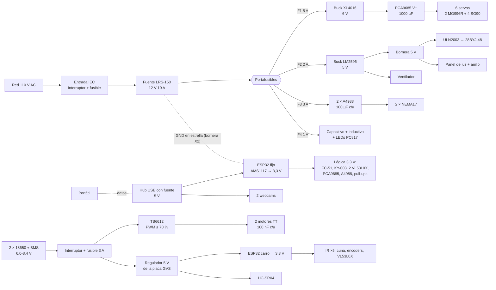
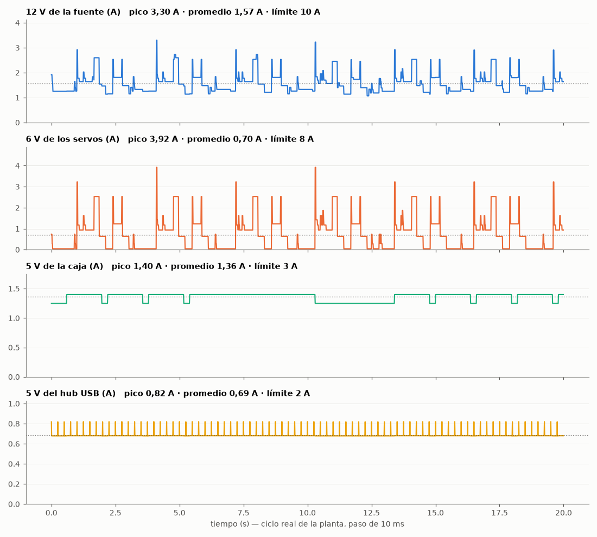
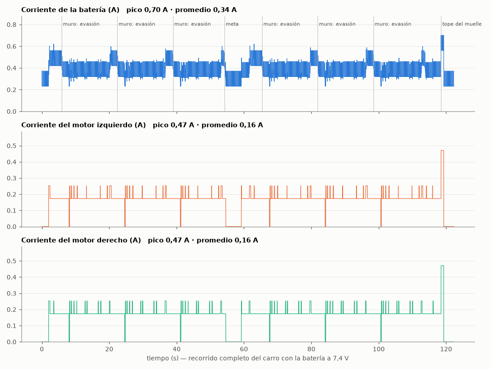

# Parte eléctrica, punto por punto (simulada)

> Generado por `python -m sim.electrica` desde `sim/electrica.py`, que lee el conexionado de `sim/conexiones.py` (la fuente única de cada hilo) y los tiempos de `config/parametros.yaml`. No editar a mano. Las corrientes son de hoja de datos (**PROVISIONALES** hasta medirlas con el multímetro en el montaje); la lista de lo que hay que medir está al final.

Esta página responde, para cada fuente, regulador, fusible y cable: **¿aguanta lo que le piden en el peor momento real del ciclo?** Para eso se recorre en el tiempo, con paso de 10 ms, un ciclo real de la planta y un recorrido completo del carro, sumando la corriente de cada carga en su riel. El circuito también se puede ver y mover en el simulador Wokwi: [wokwi/](../wokwi/README.md).

## 1. Qué es un riel de alimentación y cuáles hay

Un **riel** es una línea de voltaje fijo de la que se alimentan varias cargas (como una regleta). No se usa un solo voltaje para todo porque cada pieza pide el suyo: los servos se queman o se vuelven erráticos por encima de 6-7,2 V, el ESP32 trabaja a 3,3 V (sus pines no aguantan más de 3,6 V), los sensores industriales M18 piden 6-36 V y los paso a paso rinden mejor con 12 V (la corriente sube más rápido en la bobina). Separar rieles además aísla el ruido: el golpe de corriente de un servo que arranca no llega al ESP32.

| Riel | Lo genera | Para qué | Límite |
|---|---|---|---|
| **12 V de la fuente** | Fuente conmutada LRS-150-12 (110 V AC → 12 V DC) | Drivers A4988 (VMOT), sensores capacitivo e inductivo y la entrada de los dos buck. | 10 A de la fuente (150 W) |
| **6 V de los servos** | Buck XL4016 desde F1 | Solo los 6 servos, por la bornera V+ del PCA9685 (con 1000 µF). | 8 A del XL4016 (≈5 A continuos sin ventilación extra) |
| **5 V de la caja** | Buck LM2596 desde F2 | 28BYJ-48 del carrusel por el ULN2003, panel de luz, anillo de la cámara, ventilador. | 3 A del LM2596 (≈2 A continuos sin disipador) |
| **3,3 V del ESP32 fijo** | Regulador lineal AMS1117-3.3 del DevKit, desde el USB | El ESP32 y toda la lógica de 3,3 V: sensores de 3 hilos, VL53L0X, lógica del PCA9685 y de los A4988, pull-ups. | ≈0,6 A (1 A del AMS1117, limitado por temperatura: 1,7 V de caída) |
| **5 V del hub USB** | Hub USB 2.0 con fuente propia (adaptador 5 V 2 A, PROVISIONAL) | ESP32 fijo (datos y alimentación) y las dos webcams. | 2 A del adaptador del hub; 0,5 A por puerto (USB 2.0) |
| **Batería 2S del carro** | 2 × 18650 2500 mAh con BMS 2S (6,0-8,4 V) | Motores TT por el TB6612 y el regulador de 5 V de la placa. | 3 A del fusible del carro (el BMS 2S típico corta en 3-5 A) |
| **5 V del carro** | Regulador de la placa GVS (lineal tipo AMS1117-5.0) desde la batería | ESP32 del carro (VIN) y el HC-SR04; del 3,3 V del ESP32 salen los demás sensores. | 1 A del AMS1117; por CALOR ≈0,3 A continuos con 8,4 V (disipa 3,4 V × I; ~1 W en SOT-223) |

Un **buck** (XL4016, LM2596) es un regulador conmutado: prende y apaga un transistor miles de veces por segundo y filtra con una bobina, así que baja el voltaje perdiendo solo ~10-20 % en calor. Un regulador **lineal** (el AMS1117 del ESP32) quema como calor TODA la diferencia de voltaje por la corriente: sirve para corrientes chicas o diferencias chicas.

## 2. Diagrama de bloques de potencia

## 3. Cómo se simuló

- **Paso de 10 ms.** Un fusible necesita cientos de ms de sobrecorriente para abrir; un regulador reacciona en ~0,1 ms (eso lo cubren los condensadores, sección 7). 10 ms basta para ver cada arranque de servo.
- **Planta**: las dos cintas a la vez, con los tiempos de `tiempos_ms`: cinta de monedas cada 600 + 1000 ms (desvío en una de cada dos piezas, carrusel un tubo en cada pausa); cinta de vasos: avance, tapa y prensa 0→180→0 (la leva aprieta la tapa 0,2 s contra el resorte: el servo casi trabado), y **después** el empujador (la regla de diseño: prensa y empujador nunca a la vez). En la ventana se suelta además un lote (carrusel media vuelta + obturador) y la canaleta le suelta un vaso al carro.
- **Servos**: al arrancar piden su corriente de trabado ~30 ms (el motor parte de cero y nada limita la corriente), después la de movimiento y al llegar la de reposo.
- **Paso a paso**: el A4988 es un *chopper*: saca de 12 V solo la POTENCIA (cobre I²·R = 1,50 W, driver 0,75 W, más el trabajo mecánico), no 1 A por fase. Quieto sigue a corriente plena (el A4988 no la reduce solo).
- **Carro**: modelo de motor DC (V = I·R + Ke·ω, par = Kt·I·η de la caja) con los datos típicos del TT 1:48 (R ≈ 5,0 Ω, 0,15 A sin carga, Ke ≈ 0,251 V·s/rad en la rueda); PWM necesario D = (I·R + Ke·ω)/V_batería y corriente de batería = D·I. Perfil del recorrido a partir de la pista y de las velocidades del control (arranque con rampa de 1 m/s², rectas a 0,40 m/s, curvas, 3 evasiones con giros sobre su eje, meta, media vuelta, vuelta y entrada de reversa contra el tope con PWM 35 %).

Cargas usadas (corriente en su propio riel):

| Carga | Riel | Reposo | Nominal | Pico | Dato |
|---|---|---|---|---|---|
| SG90 | 6 V de los servos | 6 mA | 250 mA | 700 mA | SG90: ~6 mA quieto, ~0,25 A moviéndose, ~0,7 A trabado (arranque) |
| MG996R | 6 V de los servos | 10 mA | 900 mA | 2,50 A | MG996R: ~10 mA quieto, 0,5-0,9 A moviéndose, 2,5 A trabado (hoja: 2,5 A a 6 V) |
| nema17 | 12 V de la fuente | 190 mA | 300 mA | 450 mA | 17HS4401 (1,5 Ω/fase) a 1 A/fase con A4988: ver modelo del paso a paso |
| sensor_m18 | 12 V de la fuente | 8 mA | 8 mA | 15 mA | LJC18A3 / LJ18A3-8: consumo sin carga ≤ 10-15 mA |
| opto_led | 12 V de la fuente | 0 | 4 mA | 5 mA | LED del PC817 con 2,2 kΩ desde 12 V (cálculo en pasivos) |
| byj48 | 5 V de la caja | 0 | 150 mA | 240 mA | 28BYJ-48 5 V: 50 Ω/bobina → 0,1 A por bobina; medio paso = 1 o 2 bobinas; + LEDs del ULN2003 |
| panel | 5 V de la caja | 800 mA | 800 mA | 850 mA | Panel LED difuso ~33 × 11 cm: 2 tiras 2835 de 20 LED a ~20 mA (PROVISIONAL) |
| anillo | 5 V de la caja | 350 mA | 350 mA | 400 mA | Anillo de luz difusa 5 V para webcam (PROVISIONAL) |
| ventilador | 5 V de la caja | 100 mA | 100 mA | 150 mA | Ventilador 4010 5 V: 0,1 A (conexiones.py) |
| esp32 | 3,3 V del ESP32 fijo | 100 mA | 110 mA | 240 mA | ESP32 con la radio encendida (ESP-NOW escuchando ~100 mA; transmitiendo ~240 mA) |
| vl53 | 3,3 V del ESP32 fijo | 19 mA | 19 mA | 40 mA | VL53L0X: 19 mA midiendo (promedio); pulsos del láser ~40 mA |
| fc51 | 3,3 V del ESP32 fijo | 12 mA | 12 mA | 15 mA | FC-51 a 3,3 V: LED IR ~10 mA + LM393 + LEDs del módulo |
| ky003 | 3,3 V del ESP32 fijo | 5 mA | 5 mA | 10 mA | KY-003: A3144 ~4,4 mA (máx 9 mA) + LED del módulo |
| pca_logica | 3,3 V del ESP32 fijo | 6 mA | 6 mA | 10 mA | PCA9685: lógica ~6 mA (VCC) |
| a4988_logica | 3,3 V del ESP32 fijo | 5 mA | 5 mA | 8 mA | A4988: VDD de lógica ≤ 8 mA cada uno |
| pullups | 3,3 V del ESP32 fijo | 2 mA | 3 mA | 4 mA | Pull-ups: I2C 2,2 kΩ (1,5 mA con la línea en bajo), 10 kΩ del Hall y del opto (0,33 mA) |
| uln_entradas | 3,3 V del ESP32 fijo | 0 | 1 mA | 3 mA | Entradas del ULN2003 (2,7 kΩ internas): ~0,7 mA por entrada encendida |
| cam_1080 | 5 V del hub USB | 250 mA | 250 mA | 350 mA | Webcam 1080p con autoenfoque en MJPEG: 0,25-0,35 A |
| cam_720 | 5 V del hub USB | 200 mA | 200 mA | 250 mA | Webcam 720p en MJPEG: ~0,2 A |
| hub | 5 V del hub USB | 50 mA | 50 mA | 50 mA | Controlador del hub USB |
| esp32_carro | 5 V del carro | 100 mA | 110 mA | 240 mA | ESP32 con ESP-NOW (igual que el fijo) |
| ir5 | 5 V del carro | 50 mA | 50 mA | 60 mA | 5 TCRT5000 a 3,3 V: ~10 mA por LED IR |
| tcrt_cuna | 5 V del carro | 12 mA | 12 mA | 15 mA | Módulo TCRT5000 de la cuna a 3,3 V |
| h206 | 5 V del carro | 12 mA | 12 mA | 15 mA | Encoder H206 a 3,3 V: LED IR + LM393 |
| tb6612_logica | 5 V del carro | 2 mA | 2 mA | 2 mA | TB6612: VCC de lógica ~2 mA |
| hcsr04 | 5 V del carro | 15 mA | 15 mA | 15 mA | HC-SR04 a 5 V: 15 mA |

## 4. Ciclo de la planta: corriente de cada riel

Los picos del riel de 6 V son los arranques de los servos y la prensa apretando la tapa; la base del de 12 V son los dos NEMA17 sosteniendo su posición. Presupuesto por riel:

| Riel | Promedio | Pico | Límite | Uso en el pico | Margen |
|---|---|---|---|---|---|
| 12 V de la fuente | 1,57 A | 3,30 A | 10,00 A | 33 % | 67 % |
| 6 V de los servos | 704 mA | 3,92 A | 8,00 A | 49 % | 51 % |
| 5 V de la caja | 1,36 A | 1,40 A | 3,00 A | 47 % | 53 % |
| 3,3 V del ESP32 fijo | 181 mA | 315 mA | 0,60 A | 53 % | 47 % |
| 5 V del hub USB | 686 mA | 820 mA | 2,00 A | 41 % | 59 % |
| Batería 2S del carro | 336 mA | 702 mA | 3,00 A | 23 % | 77 % |
| 5 V del carro | 238 mA | 372 mA | 1,00 A | 37 % | 63 % |

**Consumo desde la red**: 23,1 W promedio y 47,9 W de pico (fuente al 84 % de rendimiento a esta carga baja, más 0,75 W en vacío) → 0,38 A promedio a 110 V (factor de potencia ~0,55: la LRS-150 no tiene PFC). Sin contar el portátil ni el adaptador del hub.

### Fusibles

Un fusible de cuchilla aguanta su corriente nominal indefinidamente y abre con ~2 veces en segundos: los picos de 30 ms de un servo no lo abren; lo que protege es un corto o un motor trabado de forma sostenida.

| Fusible | Protege | Promedio | Pico en el ciclo | Margen en el pico |
|---|---|---|---|---|
| F1 (5 A) | rama de 12 V del buck de 6 V (servos) | 399 mA | 2,19 A | 56 % |
| F2 (2 A) | rama de 12 V del buck de 5 V | 699 mA | 719 mA | 64 % |
| F3 (3 A) | VMOT de los dos A4988 | 449 mA | 835 mA | 72 % |
| F4 (1 A) | sensores de 12 V y LEDs de los optoacopladores | 20 mA | 20 mA | 98 % |
| F carro (3 A) | todo el carro (después del interruptor) | 336 mA | 702 mA | 77 % |

### Reguladores: rendimiento y calor

| Regulador | Potencia que entrega (prom. / pico) | Rendimiento | Calor (prom. / pico) |
|---|---|---|---|
| XL4016 (6 V) | 4,22 / 23,53 W | 90 % | 0,47 / 2,61 W |
| LM2596 (5 V) | 6,80 / 7,00 W | 82 % | 1,49 / 1,54 W |
| AMS1117-3.3 (ESP32 fijo) | 0,60 / 1,04 W | 66 % | 0,31 / 0,54 W |
| 5 V lineal del carro (8,4 V, batería llena) | 1,19 / 1,86 W | 60 % | 0,81 / 1,26 W |
| 5 V lineal del carro (7,4 V) | 1,19 / 1,86 W | 68 % | 0,57 / 0,89 W |

### Peores casos (no ocurren en el ciclo normal; calculados)

| Caso | Riel | Corriente | Límite | Fusible |
|---|---|---|---|---|
| Los 6 servos trabados a la vez (sin la regla prensa/empujador) | 6 V | 7,80 A ✔ | 8,00 A | F1: 4,34 A de 5 A |
| Prensa trabada + los 4 SG90 trabados (respetando la regla) | 6 V | 5,30 A ✔ | 8,00 A | F1: 2,95 A de 5 A |
| Un motor TT trabado con PWM 100 % y batería llena (8,4 V) | TB6612 (por canal) | 1,53 A ✘ | 1,20 A | 2 motores: 3,45 A de 3 A |
| Un motor TT trabado con PWM limitado a 70 % | TB6612 (por canal) | 1,07 A ✔ | 1,20 A | 2 motores: 1,90 A de 3 A (batería) |

## 5. Recorrido del carro

- Recorrido completo (salida, 3 evasiones, meta, vuelta, muelle): **122 s**, 336 mA promedio de la batería, 702 mA de pico.
- Motor: hasta 471 mA (arranques y el tope del muelle); el PWM más alto pedido con la batería a 7,4 V fue 70 %.
- Voltaje de la batería en el pico: 7,27 V (resistencia interna + BMS + fusible + interruptor ≈ 180 mΩ).
- **Autonomía** con 2500 mAh útiles al 85 % (2125 mAh): **6,3 h andando** (≈ 186 recorridos) o **9,2 h esperando** en el muelle con la radio encendida (232 mA). La sustentación dura mucho menos: una carga alcanza sobrada.

## 6. Cada conexión, punto por punto

Una fila por hilo de `sim/conexiones.py` (la misma lista que dibuja el visor 3D y `docs/conexiones.md`). Corriente nominal = promedio en la simulación (o el consumo típico si la carga no cambia); pico = el máximo. Caída = corriente pico × resistencia de ESE hilo (la del circuito es ida + vuelta: sección 6.1). Calibre: 18 AWG potencia de la caja, 22 AWG servos/motores/M18, 24 AWG señales e I2C de campo, 26 AWG Dupont, 28 AWG los hilos de alimentación de un cable USB.

| # | Cable | De → A | Señal | Voltaje | I nom / pico | Cable | Largo | Caída | Protección |
|---|---|---|---|---|---|---|---|---|---|
| 1 | p_red | `iec.L` → `fuente.L` | fase | 110 V AC | 383 mA / 792 mA | 18 AWG (0,021 Ω/m) | 0,40 m | 7 mV | fusible de la entrada IEC |
| 2 | p_red | `iec.N` → `fuente.N` | neutro | neutro (≈0 V) | 383 mA / 792 mA | 18 AWG (0,021 Ω/m) | 0,40 m | 7 mV | fusible de la entrada IEC |
| 3 | p_red | `iec.PE` → `fuente.PE` | tierra | tierra de protección (PE) | 0 / 0 | 18 AWG (0,021 Ω/m) | 0,40 m | 0 mV | — |
| 4 | p_12 | `fuente.+V1` → `fusibles.IN` | +12 V | +12 V DC | 1,57 A / 3,30 A | 18 AWG (0,021 Ω/m) | 0,40 m | 28 mV | límite de la fuente (10 A) |
| 5 | p_12 | `fuente.-V1` → `x2.7` | GND (estrella) | 0 V (retorno) | 784 mA / 1,65 A | 18 AWG (0,021 Ω/m) | 0,40 m | 14 mV | límite de la fuente (10 A) |
| 6 | p_12 | `fuente.-V2` → `x2.8` | GND (estrella) | 0 V (retorno) | 784 mA / 1,65 A | 18 AWG (0,021 Ω/m) | 0,40 m | 14 mV | límite de la fuente (10 A) |
| 7 | p_buck6 | `fusibles.F1` → `buck6.IN+` | +12 V | +12 V DC | 399 mA / 2,19 A | 18 AWG (0,021 Ω/m) | 0,40 m | 18 mV | F1 5 A |
| 8 | p_buck6 | `buck6.IN-` → `x2.7` | GND | 0 V (retorno) | 399 mA / 2,19 A | 18 AWG (0,021 Ω/m) | 0,40 m | 18 mV | F1 5 A |
| 9 | p_buck6 | `buck6.OUT+` → `x2.4` | +6 V servos | +6 V DC | 704 mA / 3,92 A | 18 AWG (0,021 Ω/m) | 0,40 m | 33 mV | F1 5 A (del lado de 12 V) |
| 10 | p_buck6 | `buck6.OUT-` → `x2.9` | GND | 0 V (retorno) | 704 mA / 3,92 A | 18 AWG (0,021 Ω/m) | 0,40 m | 33 mV | F1 5 A (del lado de 12 V) |
| 11 | p_buck5 | `fusibles.F2` → `buck5.IN+` | +12 V | +12 V DC | 699 mA / 719 mA | 18 AWG (0,021 Ω/m) | 0,40 m | 6 mV | F2 2 A |
| 12 | p_buck5 | `buck5.IN-` → `x2.8` | GND | 0 V (retorno) | 699 mA / 719 mA | 18 AWG (0,021 Ω/m) | 0,40 m | 6 mV | F2 2 A |
| 13 | p_buck5 | `buck5.OUT+` → `x2.5` | +5 V | +5 V DC | 1,26 A / 1,30 A | 18 AWG (0,021 Ω/m) | 0,40 m | 11 mV | F2 2 A (del lado de 12 V) |
| 14 | p_buck5 | `buck5.OUT-` → `x2.10` | GND | 0 V (retorno) | 1,26 A / 1,30 A | 18 AWG (0,021 Ω/m) | 0,40 m | 11 mV | F2 2 A (del lado de 12 V) |
| 15 | p_f3f4 | `fusibles.F3` → `x2.1` | +12 V drivers | +12 V DC | 449 mA / 835 mA | 18 AWG (0,021 Ω/m) | 0,40 m | 7 mV | F3 3 A |
| 16 | p_f3f4 | `fusibles.F4` → `x2.2` | +12 V sensores | +12 V DC | 20 mA / 20 mA | 18 AWG (0,021 Ω/m) | 0,40 m | 0 mV | F4 1 A |
| 17 | p_pca | `x2.4` → `pca9685.T.V+` | +6 V (18 AWG) | +6 V DC | 704 mA / 3,92 A | 18 AWG (0,021 Ω/m) | 0,40 m | 33 mV | F1 5 A |
| 18 | p_pca | `x2.9` → `pca9685.T.GND` | GND (18 AWG) | 0 V (retorno) | 704 mA / 3,92 A | 18 AWG (0,021 Ω/m) | 0,40 m | 33 mV | F1 5 A |
| 19 | p_drv | `x2.1` → `drivers.VMOT` | +12 V | +12 V DC | 449 mA / 835 mA | 18 AWG (0,021 Ω/m) | 0,40 m | 7 mV | F3 3 A |
| 20 | p_drv | `x2.11` → `drivers.GNDP` | GND | 0 V (retorno) | 449 mA / 835 mA | 18 AWG (0,021 Ω/m) | 0,40 m | 7 mV | F3 3 A |
| 21 | p_uln | `x2.5` → `uln2003.+` | +5 V | +5 V DC | 110 mA / 150 mA | 18 AWG (0,021 Ω/m) | 0,40 m | 1 mV | F2 2 A |
| 22 | p_uln | `x2.10` → `uln2003.−` | GND | 0 V (retorno) | 110 mA / 150 mA | 18 AWG (0,021 Ω/m) | 0,40 m | 1 mV | F2 2 A |
| 23 | p_opto | `x2.2` → `opto.+12` | +12 V | +12 V DC | 4 mA / 9 mA | 18 AWG (0,021 Ω/m) | 0,40 m | 0 mV | F4 1 A |
| 24 | p_vent | `buck5.OUT+` → `ventilador.+5V` | +5 V ventilador | +5 V DC | 100 mA / 100 mA | 18 AWG (0,021 Ω/m) | 0,40 m | 1 mV | F2 2 A |
| 25 | p_vent | `buck5.OUT-` → `ventilador.GND` | GND ventilador | 0 V (retorno) | 100 mA / 100 mA | 18 AWG (0,021 Ω/m) | 0,40 m | 1 mV | F2 2 A |
| 26 | p_gnd | `esp32_fijo.GND.1` → `x2.11` | GND común | 0 V (une el GND del USB con el de la fuente) | 5 mA / 20 mA | 18 AWG (0,021 Ω/m) | 0,40 m | 0 mV | — (solo retornos de señal) |
| 27 | l_i2c0 | `esp32_fijo.I2C.SDA` → `pca9685.IN.SDA` | SDA (G21) | I2C 0/3,3 V, 400 kHz (colector abierto) | 300 µA / 2 mA | 26 AWG (0,134 Ω/m) | 0,20 m | 0 mV | — |
| 28 | l_i2c0 | `esp32_fijo.I2C.SCL` → `pca9685.IN.SCL` | SCL (G22) | I2C 0/3,3 V, 400 kHz (colector abierto) | 300 µA / 2 mA | 26 AWG (0,134 Ω/m) | 0,20 m | 0 mV | — |
| 29 | l_i2c0 | `esp32_fijo.I2C.VCC` → `pca9685.IN.VCC` | 3,3 V lógica | +3,3 V | 6 mA / 10 mA | 26 AWG (0,134 Ω/m) | 0,20 m | 0 mV | regulador del ESP32 |
| 30 | l_i2c0 | `esp32_fijo.I2C.GND` → `pca9685.IN.GND` | GND | 0 V | 6 mA / 10 mA | 26 AWG (0,134 Ω/m) | 0,20 m | 0 mV | regulador del ESP32 |
| 31 | l_drv | `esp32_fijo.G25.S` → `drivers.M.STEP` | STEP monedas | lógica 0/3,3 V (STEP: pulsos ~1,3 kHz) | 10 µA / 20 µA | 26 AWG (0,134 Ω/m) | 0,20 m | 0 mV | — |
| 32 | l_drv | `esp32_fijo.G26.S` → `drivers.M.DIR` | DIR monedas | lógica 0/3,3 V | 10 µA / 20 µA | 26 AWG (0,134 Ω/m) | 0,20 m | 0 mV | — |
| 33 | l_drv | `esp32_fijo.G27.S` → `drivers.V.STEP` | STEP vasos | lógica 0/3,3 V (STEP: pulsos ~1,3 kHz) | 10 µA / 20 µA | 26 AWG (0,134 Ω/m) | 0,20 m | 0 mV | — |
| 34 | l_drv | `esp32_fijo.G14.S` → `drivers.V.DIR` | DIR vasos | lógica 0/3,3 V | 10 µA / 20 µA | 26 AWG (0,134 Ω/m) | 0,20 m | 0 mV | — |
| 35 | l_drv | `esp32_fijo.G13.S` → `drivers.EN` | ENABLE común | lógica 0/3,3 V | 10 µA / 20 µA | 26 AWG (0,134 Ω/m) | 0,20 m | 0 mV | — |
| 36 | l_drv | `esp32_fijo.G13.V` → `drivers.VDD` | 3,3 V lógica | +3,3 V | 10 mA / 16 mA | 26 AWG (0,134 Ω/m) | 0,20 m | 0 mV | regulador del ESP32 |
| 37 | l_drv | `esp32_fijo.G13.G` → `drivers.GND` | GND lógica | 0 V (retorno) | 10 mA / 16 mA | 26 AWG (0,134 Ω/m) | 0,20 m | 0 mV | regulador del ESP32 |
| 38 | l_uln | `esp32_fijo.G32.S` → `uln2003.IN1` | bobina 1 | lógica 0/3,3 V → base del Darlington | 700 µA / 700 µA | 26 AWG (0,134 Ω/m) | 0,20 m | 0 mV | — |
| 39 | l_uln | `esp32_fijo.G33.S` → `uln2003.IN2` | bobina 2 | lógica 0/3,3 V → base del Darlington | 700 µA / 700 µA | 26 AWG (0,134 Ω/m) | 0,20 m | 0 mV | — |
| 40 | l_uln | `esp32_fijo.G23.S` → `uln2003.IN3` | bobina 3 | lógica 0/3,3 V → base del Darlington | 700 µA / 700 µA | 26 AWG (0,134 Ω/m) | 0,20 m | 0 mV | — |
| 41 | l_uln | `esp32_fijo.G4.S` → `uln2003.IN4` | bobina 4 | lógica 0/3,3 V → base del Darlington | 700 µA / 700 µA | 26 AWG (0,134 Ω/m) | 0,20 m | 0 mV | — |
| 42 | l_opto | `opto.GND` → `esp32_fijo.G35.G` | GND | 0 V (retorno) | 660 µA / 660 µA | 26 AWG (0,134 Ω/m) | 0,20 m | 0 mV | regulador del ESP32 |
| 43 | l_opto | `opto.3V3` → `esp32_fijo.G35.V` | 3,3 V pull-up | +3,3 V (pull-ups) | 660 µA / 660 µA | 26 AWG (0,134 Ω/m) | 0,20 m | 0 mV | regulador del ESP32 |
| 44 | l_opto | `opto.OUT1` → `esp32_fijo.G35.S` | capacitivo | 0/3,3 V (activo en bajo) | 330 µA / 330 µA | 26 AWG (0,134 Ω/m) | 0,20 m | 0 mV | — |
| 45 | l_opto | `opto.OUT2` → `esp32_fijo.G36.S` | inductivo | 0/3,3 V (activo en bajo) | 330 µA / 330 µA | 26 AWG (0,134 Ω/m) | 0,20 m | 0 mV | — |
| 46 | l_i2c1 | `esp32_fijo.G16.S` → `hub_i2c.SDA` | SDA (G16) | I2C 0/3,3 V, 100 kHz (pull-ups 2,2 kΩ) | 500 µA / 2 mA | 26 AWG (0,134 Ω/m) | 0,20 m | 0 mV | — |
| 47 | l_i2c1 | `esp32_fijo.G17.S` → `hub_i2c.SCL` | SCL (G17) | I2C 0/3,3 V, 100 kHz (pull-ups 2,2 kΩ) | 500 µA / 2 mA | 26 AWG (0,134 Ω/m) | 0,20 m | 0 mV | — |
| 48 | l_i2c1 | `esp32_fijo.G16.V` → `hub_i2c.3V3` | 3,3 V | +3,3 V | 38 mA / 80 mA | 26 AWG (0,134 Ω/m) | 0,20 m | 2 mV | regulador del ESP32 |
| 49 | l_i2c1 | `esp32_fijo.G16.G` → `hub_i2c.GND` | GND | 0 V (retorno) | 38 mA / 80 mA | 26 AWG (0,134 Ω/m) | 0,20 m | 2 mV | regulador del ESP32 |
| 50 | presencia | `presencia.OUT` → `esp32_fijo.G34.S` | señal | 0/3,3 V (activo en bajo) | 10 µA / 330 µA | 24 AWG (0,084 Ω/m) | 1,18 m | 0 mV | — |
| 51 | presencia | `presencia.GND` → `esp32_fijo.G34.G` | GND | 0 V (retorno) | 12 mA / 15 mA | 24 AWG (0,084 Ω/m) | 1,18 m | 1 mV | regulador del ESP32 |
| 52 | presencia | `presencia.VCC` → `esp32_fijo.G34.V` | 3,3 V | +3,3 V | 12 mA / 15 mA | 24 AWG (0,084 Ω/m) | 1,18 m | 1 mV | regulador del ESP32 |
| 53 | capacitivo | `capacitivo.NEGRO` → `opto.IN1` | salida NPN | salida NPN: ~11 V libre / <1,5 V al detectar | 4 mA / 5 mA | 22 AWG (0,053 Ω/m) | 1,18 m | 0 mV | F4 1 A |
| 54 | capacitivo | `capacitivo.CAFE` → `x2.3` | +12 V | +12 V DC | 8 mA / 15 mA | 22 AWG (0,053 Ω/m) | 1,18 m | 1 mV | F4 1 A |
| 55 | capacitivo | `capacitivo.AZUL` → `x2.12` | 0 V | 0 V | 12 mA / 20 mA | 22 AWG (0,053 Ω/m) | 1,18 m | 1 mV | F4 1 A |
| 56 | inductivo | `inductivo.NEGRO` → `opto.IN2` | salida NPN | salida NPN: ~11 V libre / <1,5 V al detectar | 4 mA / 5 mA | 22 AWG (0,053 Ω/m) | 1,14 m | 0 mV | F4 1 A |
| 57 | inductivo | `inductivo.CAFE` → `x2.3` | +12 V | +12 V DC | 8 mA / 15 mA | 22 AWG (0,053 Ω/m) | 1,14 m | 1 mV | F4 1 A |
| 58 | inductivo | `inductivo.AZUL` → `x2.12` | 0 V | 0 V | 12 mA / 20 mA | 22 AWG (0,053 Ω/m) | 1,14 m | 1 mV | F4 1 A |
| 59 | hall | `hall.S` → `esp32_fijo.G39.S` | señal (pull-up del módulo) | 0/3,3 V (colector abierto, pull-up 10 kΩ) | 330 µA / 330 µA | 24 AWG (0,084 Ω/m) | 0,88 m | 0 mV | — |
| 60 | hall | `hall.+` → `esp32_fijo.G39.V` | 3,3 V | +3,3 V | 5 mA / 10 mA | 24 AWG (0,084 Ω/m) | 0,88 m | 1 mV | regulador del ESP32 |
| 61 | hall | `hall.−` → `esp32_fijo.G39.G` | GND | 0 V (retorno) | 5 mA / 10 mA | 24 AWG (0,084 Ω/m) | 0,88 m | 1 mV | regulador del ESP32 |
| 62 | vl53_interior | `vl53_interior.VIN` → `hub_i2c.A.3V3` | 3,3 V | +3,3 V | 19 mA / 40 mA | 24 AWG (0,084 Ω/m) | 1,20 m | 4 mV | regulador del ESP32 |
| 63 | vl53_interior | `vl53_interior.GND` → `hub_i2c.A.GND` | GND | 0 V (retorno) | 19 mA / 40 mA | 24 AWG (0,084 Ω/m) | 1,20 m | 4 mV | regulador del ESP32 |
| 64 | vl53_interior | `vl53_interior.SCL` → `hub_i2c.A.SCL` | SCL | I2C 0/3,3 V, 100 kHz | 500 µA / 2 mA | 24 AWG (0,084 Ω/m) | 1,20 m | 0 mV | — |
| 65 | vl53_interior | `vl53_interior.SDA` → `hub_i2c.A.SDA` | SDA | I2C 0/3,3 V, 100 kHz | 500 µA / 2 mA | 24 AWG (0,084 Ω/m) | 1,20 m | 0 mV | — |
| 66 | vl53_interior | `vl53_interior.XSHUT` → `esp32_fijo.G18.S` | XSHUT (dirección 0x30) | lógica 0/3,3 V | 10 µA / 330 µA | 24 AWG (0,084 Ω/m) | 1,20 m | 0 mV | — |
| 67 | vl53_cortina | `vl53_cortina.VIN` → `hub_i2c.B.3V3` | 3,3 V | +3,3 V | 19 mA / 40 mA | 24 AWG (0,084 Ω/m) | 0,50 m | 2 mV | regulador del ESP32 |
| 68 | vl53_cortina | `vl53_cortina.GND` → `hub_i2c.B.GND` | GND | 0 V (retorno) | 19 mA / 40 mA | 24 AWG (0,084 Ω/m) | 0,50 m | 2 mV | regulador del ESP32 |
| 69 | vl53_cortina | `vl53_cortina.SCL` → `hub_i2c.B.SCL` | SCL | I2C 0/3,3 V, 100 kHz | 500 µA / 2 mA | 24 AWG (0,084 Ω/m) | 0,50 m | 0 mV | — |
| 70 | vl53_cortina | `vl53_cortina.SDA` → `hub_i2c.B.SDA` | SDA | I2C 0/3,3 V, 100 kHz | 500 µA / 2 mA | 24 AWG (0,084 Ω/m) | 0,50 m | 0 mV | — |
| 71 | vl53_cortina | `vl53_cortina.XSHUT` → `esp32_fijo.G19.S` | XSHUT (dirección 0x31) | lógica 0/3,3 V | 10 µA / 330 µA | 24 AWG (0,084 Ω/m) | 0,50 m | 0 mV | — |
| 72 | motor_monedas | `motor_monedas.JST` → `drivers.M.1A` | A+ | bobina: 12 V troceado por el A4988 (±12 V, ~1,5 V medio) | 707 mA / 1,00 A | 22 AWG (0,053 Ω/m) | 1,38 m | 73 mV | F3 3 A (VMOT) |
| 73 | motor_monedas | `motor_monedas.JST` → `drivers.M.1B` | A− | bobina: 12 V troceado por el A4988 (±12 V, ~1,5 V medio) | 707 mA / 1,00 A | 22 AWG (0,053 Ω/m) | 1,38 m | 73 mV | F3 3 A (VMOT) |
| 74 | motor_monedas | `motor_monedas.JST` → `drivers.M.2A` | B+ | bobina: 12 V troceado por el A4988 (±12 V, ~1,5 V medio) | 707 mA / 1,00 A | 22 AWG (0,053 Ω/m) | 1,38 m | 73 mV | F3 3 A (VMOT) |
| 75 | motor_monedas | `motor_monedas.JST` → `drivers.M.2B` | B− | bobina: 12 V troceado por el A4988 (±12 V, ~1,5 V medio) | 707 mA / 1,00 A | 22 AWG (0,053 Ω/m) | 1,38 m | 73 mV | F3 3 A (VMOT) |
| 76 | motor_vasos | `motor_vasos.JST` → `drivers.V.1A` | A+ | bobina: 12 V troceado por el A4988 (±12 V, ~1,5 V medio) | 707 mA / 1,00 A | 22 AWG (0,053 Ω/m) | 0,76 m | 40 mV | F3 3 A (VMOT) |
| 77 | motor_vasos | `motor_vasos.JST` → `drivers.V.1B` | A− | bobina: 12 V troceado por el A4988 (±12 V, ~1,5 V medio) | 707 mA / 1,00 A | 22 AWG (0,053 Ω/m) | 0,76 m | 40 mV | F3 3 A (VMOT) |
| 78 | motor_vasos | `motor_vasos.JST` → `drivers.V.2A` | B+ | bobina: 12 V troceado por el A4988 (±12 V, ~1,5 V medio) | 707 mA / 1,00 A | 22 AWG (0,053 Ω/m) | 0,76 m | 40 mV | F3 3 A (VMOT) |
| 79 | motor_vasos | `motor_vasos.JST` → `drivers.V.2B` | B− | bobina: 12 V troceado por el A4988 (±12 V, ~1,5 V medio) | 707 mA / 1,00 A | 22 AWG (0,053 Ω/m) | 0,76 m | 40 mV | F3 3 A (VMOT) |
| 80 | motor_carrusel | `motor_carrusel.CABLE` → `uln2003.MOTOR` | bobina 1 | 5 V / 0 V (el ULN2003 la lleva a GND) | 50 mA / 100 mA | 26 AWG (0,134 Ω/m) | 0,94 m | 13 mV | F2 2 A |
| 81 | motor_carrusel | `motor_carrusel.CABLE` → `uln2003.MOTOR` | bobina 2 | 5 V / 0 V (el ULN2003 la lleva a GND) | 50 mA / 100 mA | 26 AWG (0,134 Ω/m) | 0,94 m | 13 mV | F2 2 A |
| 82 | motor_carrusel | `motor_carrusel.CABLE` → `uln2003.MOTOR` | bobina 3 | 5 V / 0 V (el ULN2003 la lleva a GND) | 50 mA / 100 mA | 26 AWG (0,134 Ω/m) | 0,94 m | 13 mV | F2 2 A |
| 83 | motor_carrusel | `motor_carrusel.CABLE` → `uln2003.MOTOR` | bobina 4 | 5 V / 0 V (el ULN2003 la lleva a GND) | 50 mA / 100 mA | 26 AWG (0,134 Ω/m) | 0,94 m | 13 mV | F2 2 A |
| 84 | motor_carrusel | `motor_carrusel.CABLE` → `uln2003.MOTOR` | +5 V común | +5 V común de las bobinas | 150 mA / 240 mA | 26 AWG (0,134 Ω/m) | 0,94 m | 30 mV | F2 2 A |
| 85 | servo_0 | `servo_desvio.CABLE` → `pca9685.PWM0` | señal PWM | PWM 50 Hz, 0,5-2,5 ms, 0/3,3 V (del PCA9685) | 50 µA / 100 µA | 22 AWG (0,053 Ω/m) | 0,63 m | 0 mV | — |
| 86 | servo_0 | `servo_desvio.CABLE` → `pca9685.V+0` | 6 V | +6 V DC | 23 mA / 700 mA | 22 AWG (0,053 Ω/m) | 0,63 m | 23 mV | F1 5 A |
| 87 | servo_0 | `servo_desvio.CABLE` → `pca9685.GND0` | GND | 0 V (retorno) | 23 mA / 700 mA | 22 AWG (0,053 Ω/m) | 0,63 m | 23 mV | F1 5 A |
| 88 | servo_1 | `servo_obturador.CABLE` → `pca9685.PWM1` | señal PWM | PWM 50 Hz, 0,5-2,5 ms, 0/3,3 V (del PCA9685) | 50 µA / 100 µA | 22 AWG (0,053 Ω/m) | 1,19 m | 0 mV | — |
| 89 | servo_1 | `servo_obturador.CABLE` → `pca9685.V+1` | 6 V | +6 V DC | 11 mA / 700 mA | 22 AWG (0,053 Ω/m) | 1,19 m | 44 mV | F1 5 A |
| 90 | servo_1 | `servo_obturador.CABLE` → `pca9685.GND1` | GND | 0 V (retorno) | 11 mA / 700 mA | 22 AWG (0,053 Ω/m) | 1,19 m | 44 mV | F1 5 A |
| 91 | servo_2 | `servo_tapas.CABLE` → `pca9685.PWM2` | señal PWM | PWM 50 Hz, 0,5-2,5 ms, 0/3,3 V (del PCA9685) | 50 µA / 100 µA | 22 AWG (0,053 Ω/m) | 1,11 m | 0 mV | — |
| 92 | servo_2 | `servo_tapas.CABLE` → `pca9685.V+2` | 6 V | +6 V DC | 31 mA / 700 mA | 22 AWG (0,053 Ω/m) | 1,11 m | 41 mV | F1 5 A |
| 93 | servo_2 | `servo_tapas.CABLE` → `pca9685.GND2` | GND | 0 V (retorno) | 31 mA / 700 mA | 22 AWG (0,053 Ω/m) | 1,11 m | 41 mV | F1 5 A |
| 94 | servo_3 | `servo_prensa.CABLE` → `pca9685.PWM3` | señal PWM | PWM 50 Hz, 0,5-2,5 ms, 0/3,3 V (del PCA9685) | 50 µA / 100 µA | 22 AWG (0,053 Ω/m) | 0,59 m | 0 mV | — |
| 95 | servo_3 | `servo_prensa.CABLE` → `pca9685.V+3` | 6 V | +6 V DC | 417 mA / 2,50 A | 22 AWG (0,053 Ω/m) | 0,59 m | 78 mV | F1 5 A |
| 96 | servo_3 | `servo_prensa.CABLE` → `pca9685.GND3` | GND | 0 V (retorno) | 417 mA / 2,50 A | 22 AWG (0,053 Ω/m) | 0,59 m | 78 mV | F1 5 A |
| 97 | servo_4 | `servo_empujador.CABLE` → `pca9685.PWM4` | señal PWM | PWM 50 Hz, 0,5-2,5 ms, 0/3,3 V (del PCA9685) | 50 µA / 100 µA | 22 AWG (0,053 Ω/m) | 0,26 m | 0 mV | — |
| 98 | servo_4 | `servo_empujador.CABLE` → `pca9685.V+4` | 6 V | +6 V DC | 213 mA / 2,50 A | 22 AWG (0,053 Ω/m) | 0,26 m | 34 mV | F1 5 A |
| 99 | servo_4 | `servo_empujador.CABLE` → `pca9685.GND4` | GND | 0 V (retorno) | 213 mA / 2,50 A | 22 AWG (0,053 Ω/m) | 0,26 m | 34 mV | F1 5 A |
| 100 | servo_5 | `servo_canaleta.CABLE` → `pca9685.PWM5` | señal PWM | PWM 50 Hz, 0,5-2,5 ms, 0/3,3 V (del PCA9685) | 50 µA / 100 µA | 22 AWG (0,053 Ω/m) | 0,70 m | 0 mV | — |
| 101 | servo_5 | `servo_canaleta.CABLE` → `pca9685.V+5` | 6 V | +6 V DC | 9 mA / 700 mA | 22 AWG (0,053 Ω/m) | 0,70 m | 26 mV | F1 5 A |
| 102 | servo_5 | `servo_canaleta.CABLE` → `pca9685.GND5` | GND | 0 V (retorno) | 9 mA / 700 mA | 22 AWG (0,053 Ω/m) | 0,70 m | 26 mV | F1 5 A |
| 103 | panel_luz | `panel_luz.+5V` → `x2.6` | +5 V | +5 V DC | 800 mA / 800 mA | 22 AWG (0,053 Ω/m) | 0,29 m | 12 mV | F2 2 A |
| 104 | panel_luz | `panel_luz.GND` → `x2.13` | GND | 0 V (retorno) | 800 mA / 800 mA | 22 AWG (0,053 Ω/m) | 0,29 m | 12 mV | F2 2 A |
| 105 | anillo | `anillo.+5V` → `x2.6` | +5 V | +5 V DC | 350 mA / 350 mA | 22 AWG (0,053 Ω/m) | 1,03 m | 19 mV | F2 2 A |
| 106 | anillo | `anillo.GND` → `x2.13` | GND | 0 V (retorno) | 350 mA / 350 mA | 22 AWG (0,053 Ω/m) | 1,03 m | 19 mV | F2 2 A |
| 107 | usb_cenital | `cam_cenital.USB` → `hub_usb.P2` | USB | USB 2.0: VBUS 5 V + datos diferenciales | 250 mA / 350 mA | 28 AWG (0,213 Ω/m) | 1,30 m | 97 mV | limitador del puerto del hub (0,5 A) |
| 108 | usb_vasos | `cam_vasos.USB` → `hub_usb.P1` | USB | USB 2.0: VBUS 5 V + datos diferenciales | 200 mA / 250 mA | 28 AWG (0,213 Ω/m) | 1,23 m | 65 mV | limitador del puerto del hub (0,5 A) |
| 109 | usb_esp | `esp32_fijo.USB` → `hub_usb.P3` | USB | USB 2.0: VBUS 5 V + datos diferenciales | 186 mA / 320 mA | 28 AWG (0,213 Ω/m) | 0,38 m | 26 mV | limitador del puerto del hub (0,5 A) |
| 110 | usb_pc | `hub_usb.UP` → `pc.USB1` | USB | USB 2.0: VBUS 5 V + datos diferenciales | 0 / 50 mA | 28 AWG (0,213 Ω/m) | 0,07 m | 1 mV | limitador del puerto del hub (0,5 A) |
| 111 | c_bat | `bateria.B+` → `interruptor.1` | +7,4 V | +7,4 V (6,0-8,4 V) | 336 mA / 702 mA | 22 AWG (0,053 Ω/m) | 0,15 m | 6 mV | fusible del carro 3 A |
| 112 | c_bat | `interruptor.2` → `tb6612.VM` | +7,4 V motores | +7,4 V (6,0-8,4 V) | 98 mA / 330 mA | 22 AWG (0,053 Ω/m) | 0,15 m | 3 mV | fusible del carro 3 A |
| 113 | c_bat | `interruptor.2` → `esp32_carro.JACK` | +7,4 V al jack (regulador de la placa) | +7,4 V (6,0-8,4 V) | 238 mA / 372 mA | 22 AWG (0,053 Ω/m) | 0,15 m | 3 mV | fusible del carro 3 A |
| 114 | c_bat | `bateria.B-` → `tb6612.GND_P` | GND potencia | 0 V (retorno) | 98 mA / 330 mA | 22 AWG (0,053 Ω/m) | 0,15 m | 3 mV | fusible del carro 3 A |
| 115 | c_bat | `bateria.B-` → `esp32_carro.JACK` | GND al jack | 0 V (retorno) | 238 mA / 372 mA | 22 AWG (0,053 Ω/m) | 0,15 m | 3 mV | fusible del carro 3 A |
| 116 | c_tb | `esp32_carro.G25.S` → `tb6612.PWMA` | PWM A | PWM 1 kHz 0/3,3 V | 10 µA / 20 µA | 26 AWG (0,134 Ω/m) | 0,15 m | 0 mV | — |
| 117 | c_tb | `esp32_carro.G26.S` → `tb6612.AIN1` | AIN1 | lógica 0/3,3 V | 10 µA / 20 µA | 26 AWG (0,134 Ω/m) | 0,15 m | 0 mV | — |
| 118 | c_tb | `esp32_carro.G27.S` → `tb6612.AIN2` | AIN2 | lógica 0/3,3 V | 10 µA / 20 µA | 26 AWG (0,134 Ω/m) | 0,15 m | 0 mV | — |
| 119 | c_tb | `esp32_carro.G33.S` → `tb6612.PWMB` | PWM B | PWM 1 kHz 0/3,3 V | 10 µA / 20 µA | 26 AWG (0,134 Ω/m) | 0,15 m | 0 mV | — |
| 120 | c_tb | `esp32_carro.G32.S` → `tb6612.BIN1` | BIN1 | lógica 0/3,3 V | 10 µA / 20 µA | 26 AWG (0,134 Ω/m) | 0,15 m | 0 mV | — |
| 121 | c_tb | `esp32_carro.G13.S` → `tb6612.BIN2` | BIN2 | lógica 0/3,3 V | 10 µA / 20 µA | 26 AWG (0,134 Ω/m) | 0,15 m | 0 mV | — |
| 122 | c_tb | `esp32_carro.G4.S` → `tb6612.STBY` | STBY | lógica 0/3,3 V | 10 µA / 20 µA | 26 AWG (0,134 Ω/m) | 0,15 m | 0 mV | — |
| 123 | c_tb | `esp32_carro.G4.V` → `tb6612.VCC` | 3,3 V lógica | +3,3 V | 2 mA / 2 mA | 26 AWG (0,134 Ω/m) | 0,15 m | 0 mV | regulador del ESP32 |
| 124 | c_tb | `esp32_carro.G4.G` → `tb6612.GND_L` | GND | 0 V (retorno) | 2 mA / 2 mA | 26 AWG (0,134 Ω/m) | 0,15 m | 0 mV | regulador del ESP32 |
| 125 | c_mot | `tb6612.AO1` → `motor_izq.M+` | motor A + | PWM 1 kHz de 0 a V_batería (medio ≤ ~6 V) | 164 mA / 471 mA | 22 AWG (0,053 Ω/m) | 0,15 m | 4 mV | TB6612 (1,2 A por canal) + fusible 3 A |
| 126 | c_mot | `tb6612.AO2` → `motor_izq.M-` | motor A − | PWM 1 kHz de 0 a V_batería (medio ≤ ~6 V) | 164 mA / 471 mA | 22 AWG (0,053 Ω/m) | 0,15 m | 4 mV | TB6612 (1,2 A por canal) + fusible 3 A |
| 127 | c_mot | `tb6612.BO1` → `motor_der.M+` | motor B + | PWM 1 kHz de 0 a V_batería (medio ≤ ~6 V) | 165 mA / 471 mA | 22 AWG (0,053 Ω/m) | 0,15 m | 4 mV | TB6612 (1,2 A por canal) + fusible 3 A |
| 128 | c_mot | `tb6612.BO2` → `motor_der.M-` | motor B − | PWM 1 kHz de 0 a V_batería (medio ≤ ~6 V) | 165 mA / 471 mA | 22 AWG (0,053 Ω/m) | 0,15 m | 4 mV | TB6612 (1,2 A por canal) + fusible 3 A |
| 129 | c_enc | `enc_izq.D0` → `esp32_carro.G18.S` | pulsos izq. | pulsos 0/3,3 V (hasta ~120 por s) | 10 µA / 330 µA | 26 AWG (0,134 Ω/m) | 0,15 m | 0 mV | — |
| 130 | c_enc | `enc_izq.VCC` → `esp32_carro.G18.V` | 3,3 V | +3,3 V | 12 mA / 15 mA | 26 AWG (0,134 Ω/m) | 0,15 m | 0 mV | regulador del ESP32 |
| 131 | c_enc | `enc_izq.GND` → `esp32_carro.G18.G` | GND | 0 V (retorno) | 12 mA / 15 mA | 26 AWG (0,134 Ω/m) | 0,15 m | 0 mV | regulador del ESP32 |
| 132 | c_enc | `enc_der.D0` → `esp32_carro.G19.S` | pulsos der. | pulsos 0/3,3 V (hasta ~120 por s) | 10 µA / 330 µA | 26 AWG (0,134 Ω/m) | 0,15 m | 0 mV | — |
| 133 | c_enc | `enc_der.VCC` → `esp32_carro.G19.V` | 3,3 V | +3,3 V | 12 mA / 15 mA | 26 AWG (0,134 Ω/m) | 0,15 m | 0 mV | regulador del ESP32 |
| 134 | c_enc | `enc_der.GND` → `esp32_carro.G19.G` | GND | 0 V (retorno) | 12 mA / 15 mA | 26 AWG (0,134 Ω/m) | 0,15 m | 0 mV | regulador del ESP32 |
| 135 | c_ir | `ir_linea.OUT1` → `esp32_carro.G34.S` | IR 1 | 0/3,3 V (1 = negro) | 10 µA / 330 µA | 26 AWG (0,134 Ω/m) | 0,15 m | 0 mV | — |
| 136 | c_ir | `ir_linea.OUT2` → `esp32_carro.G35.S` | IR 2 | 0/3,3 V (1 = negro) | 10 µA / 330 µA | 26 AWG (0,134 Ω/m) | 0,15 m | 0 mV | — |
| 137 | c_ir | `ir_linea.OUT3` → `esp32_carro.G36.S` | IR 3 (centro) | 0/3,3 V (1 = negro) | 10 µA / 330 µA | 26 AWG (0,134 Ω/m) | 0,15 m | 0 mV | — |
| 138 | c_ir | `ir_linea.OUT4` → `esp32_carro.G39.S` | IR 4 | 0/3,3 V (1 = negro) | 10 µA / 330 µA | 26 AWG (0,134 Ω/m) | 0,15 m | 0 mV | — |
| 139 | c_ir | `ir_linea.OUT5` → `esp32_carro.G16.S` | IR 5 | 0/3,3 V (1 = negro) | 10 µA / 330 µA | 26 AWG (0,134 Ω/m) | 0,15 m | 0 mV | — |
| 140 | c_ir | `ir_linea.VCC` → `esp32_carro.G34.V` | 3,3 V | +3,3 V | 50 mA / 60 mA | 26 AWG (0,134 Ω/m) | 0,15 m | 1 mV | regulador del ESP32 |
| 141 | c_ir | `ir_linea.GND` → `esp32_carro.G34.G` | GND | 0 V (retorno) | 50 mA / 60 mA | 26 AWG (0,134 Ω/m) | 0,15 m | 1 mV | regulador del ESP32 |
| 142 | c_us | `hcsr04.VCC` → `esp32_carro.5V.1` | 5 V | +5 V | 15 mA / 15 mA | 26 AWG (0,134 Ω/m) | 0,15 m | 0 mV | regulador 5 V del carro |
| 143 | c_us | `hcsr04.GND` → `esp32_carro.GND.1` | GND | 0 V (retorno) | 15 mA / 15 mA | 26 AWG (0,134 Ω/m) | 0,15 m | 0 mV | regulador 5 V del carro |
| 144 | c_us | `hcsr04.TRIG` → `esp32_carro.G17.S` | TRIG | pulso de 10 µs a 3,3 V (el HC-SR04 lo lee como 1) | 10 µA / 50 µA | 26 AWG (0,134 Ω/m) | 0,15 m | 0 mV | — |
| 145 | c_us | `hcsr04.ECHO` → `esp32_carro.G23.S` | ECHO (divisor en termorretráctil) | 5 V en el sensor → 3,33 V en el GPIO (divisor) | 0 / 2 mA | 26 AWG (0,134 Ω/m) | 0,15 m | 0 mV | divisor 1 kΩ / 2 kΩ |
| 146 | c_tof | `vl53_frontal.VIN` → `esp32_carro.I2C.VCC` | 3,3 V | +3,3 V | 19 mA / 40 mA | 26 AWG (0,134 Ω/m) | 0,15 m | 1 mV | regulador del ESP32 |
| 147 | c_tof | `vl53_frontal.GND` → `esp32_carro.I2C.GND` | GND | 0 V (retorno) | 19 mA / 40 mA | 26 AWG (0,134 Ω/m) | 0,15 m | 1 mV | regulador del ESP32 |
| 148 | c_tof | `vl53_frontal.SCL` → `esp32_carro.I2C.SCL` | SCL (G22) | I2C 0/3,3 V, 400 kHz (bus corto) | 300 µA / 2 mA | 26 AWG (0,134 Ω/m) | 0,15 m | 0 mV | — |
| 149 | c_tof | `vl53_frontal.SDA` → `esp32_carro.I2C.SDA` | SDA (G21) | I2C 0/3,3 V, 400 kHz (bus corto) | 300 µA / 2 mA | 26 AWG (0,134 Ω/m) | 0,15 m | 0 mV | — |
| 150 | c_cuna | `ir_cuna.DO` → `esp32_carro.G14.S` | vaso en la cuna | 0/3,3 V (activo en bajo) | 10 µA / 330 µA | 26 AWG (0,134 Ω/m) | 0,15 m | 0 mV | — |
| 151 | c_cuna | `ir_cuna.VCC` → `esp32_carro.G14.V` | 3,3 V | +3,3 V | 12 mA / 15 mA | 26 AWG (0,134 Ω/m) | 0,15 m | 0 mV | regulador del ESP32 |
| 152 | c_cuna | `ir_cuna.GND` → `esp32_carro.G14.G` | GND | 0 V (retorno) | 12 mA / 15 mA | 26 AWG (0,134 Ω/m) | 0,15 m | 0 mV | regulador del ESP32 |

### 6.1 Caída de ida y vuelta en las cargas que importan

| Carga | Nominal | Caída total en el pico | Le llega | Mínimo que acepta |
|---|---|---|---|---|
| Servo prensa (MG996R) → PCA9685 canal 3 | 6,0 V | 222 mV | 5,78 V ✔ | 4,80 V |
| Servo empujador (MG996R) → PCA9685 canal 4 | 6,0 V | 135 mV | 5,87 V ✔ | 4,80 V |
| Servo obturador → PCA9685 canal 1 | 6,0 V | 154 mV | 5,85 V ✔ | 4,80 V |
| Panel de luz → bornera 5 V | 5,0 V | 25 mV | 4,98 V ✔ | 4,50 V |
| Anillo de luz → bornera 5 V | 5,0 V | 38 mV | 4,96 V ✔ | 4,50 V |
| Capacitivo → optoacoplador IN1 | 12,0 V | 2 mV | 12,00 V ✔ | 10,00 V |
| Hall KY-003 → ESP32 G39 | 3,3 V | 1 mV | 3,30 V ✔ | 3,00 V |
| VL53L0X interior → reparto I2C (A) y XSHUT G18 | 3,3 V | 8 mV | 3,29 V ✔ | 2,60 V |
| FC-51 presencia → ESP32 G34 | 3,3 V | 3 mV | 3,30 V ✔ | 3,00 V |
| Webcam cenital (cable USB) | 5,0 V | 194 mV | 4,81 V ✔ | 4,75 V |
| Webcam de vasos (cable USB) | 5,0 V | 131 mV | 4,87 V ✔ | 4,75 V |

## 7. Valores de los pasivos, con su cálculo

**Vref del A4988 (1 A por fase).** El driver corta la corriente cuando la caída en su resistencia de sensado Rs llega a Vref/8: I_trip = Vref / (8·Rs) → Vref = 8·Rs·I. Rs está impresa en el módulo (R050, R068 o R100):

| Rs del módulo | Vref para 1 A |
|---|---|
| 0,050 Ω | **0,400 V** |
| 0,068 Ω | **0,544 V** |
| 0,100 Ω | **0,800 V** |

Se mide con el multímetro entre el potenciómetro del módulo y GND, con el driver alimentado y sin pasos. 1 A (el motor admite 1,7 A) deja el motor tibio (1,5 W de cobre) y al A4988 sin disipador forzado.

**Divisor del ECHO del HC-SR04 (1 kΩ arriba, 2 kΩ abajo).** V_GPIO = 5 V · 2k/(1k+2k) = **3,33 V** (< 3,6 V máximo del pin y > 2,47 V que el ESP32 lee como 1). Si el ECHO de un clon sale con 4,5 V: 3,00 V, sigue siendo 1. Consume 1,67 mA solo mientras ECHO está alto; la resistencia vista es 667 Ω y con ~20 pF el retardo es 13 ns (despreciable: 1 mm de distancia son 5,8 µs).

**Pull-ups del bus I2C 1 (largo, 1,7 m): 2,2 kΩ con ~170 pF.** t_r = 0,8473·R·C = **317 ns** (máximo 1000 ns a 100 kHz, 300 ns a 400 kHz). R mínima = (3,3 − 0,4 V)/3 mA = 967 Ω: cumple; con la línea en bajo circula 1,50 mA.

**Pull-ups del bus I2C 0 (corto, al PCA9685, 10 kΩ del módulo): 10,0 kΩ con ~35 pF.** t_r = 0,8473·R·C = **297 ns** (máximo 1000 ns a 100 kHz, 300 ns a 400 kHz). R mínima = (3,3 − 0,4 V)/3 mA = 967 Ω: cumple; con la línea en bajo circula 0,33 mA.

**Pull-up de 10 kΩ del Hall en el GPIO 39** (el 39 no tiene pull-up interno). Con el A3144 conduciendo pasan 0,33 mA y el pin queda en ~0,15 V (< 0,82 V = 0 seguro); suelto, 3,3 V.

**Optoacoplador PC817 a 12 V (2,2 kΩ).** I_F = (12 − 1,2 V del LED − ~1 V del NPN del sensor)/2,2 kΩ = **4,45 mA** (peor caso, fuente 5 % baja y NPN con 1,5 V: 3,95 mA). Con el CTR mínimo del PC817 (50 %) el transistor puede llevar 1,98 mA y el pull-up de 10 kΩ solo pide 0,33 mA: queda **saturado** (salida < 0,2 V) con 6× de margen, aunque el LED envejezca. La resistencia disipa 44 mW (una de 1/4 W sobra).

**1000 µF en la bornera V+ del PCA9685.** Cuando la prensa arranca pide 2,5 A de golpe; el buck tarda ~100 µs en reaccionar y mientras tanto la corriente sale del condensador: ΔV = I·Δt/C = 2,5 A · 100 µs / 1000 µF = **0,25 V** (sin él, el pico viaja por el cable y el voltaje se hunde lo suficiente para reiniciar un servo). Voltaje nominal ≥ 10 V (16 V recomendado).

**100 µF en VMOT de cada A4988.** El chopper toma pulsos de hasta 1 A durante ~20 µs: ΔV = 1 A · 20 µs / 100 µF = **0,20 V** de rizado; además absorbe el pico LC al enchufar los 12 V (sin él puede subir a ~2× y pasar los 35 V del A4988). Voltaje nominal ≥ 25 V.

**100 nF en los bornes de cada motor TT.** Las escobillas generan chispas de MHz: a 1 MHz el condensador es 1,6 Ω (las cortocircuita), a la frecuencia del PWM (1 kHz) es 1592 Ω (casi no carga al TB6612). En cada flanco del PWM se carga y descarga: C·V²·f = 7,1 mW a 1 kHz (141 mW si el PWM fuera de 20 kHz): por eso el PWM se deja en 1 kHz.

**PWM de los motores TT (de 3-6 V) con la batería 2S.** El voltaje medio en el motor es D·V_batería, así que el PWM máximo para no pasar de 6 V depende de la carga de la batería:

| Batería | PWM máximo para 6 V medios |
|---|---|
| 8,4 V | 71 % |
| 7,4 V | 81 % |
| 6,4 V | 94 % |

Con el límite fijo de ~70 % el motor nunca pasa de 5,9 V (batería llena) y, trabado, pide 1,07 A: dentro de los 1,2 A continuos del TB6612.

## 8. Conclusiones (honestas)

- En el ciclo simulado **7 de 7 rieles** quedan bajo su límite en el pico.
- La fuente de 12 V 10 A está sobrada en el ciclo normal (33 % en el pico): se eligió por el peor caso (6 servos trabados + lo demás ≈ 5,9 A). Una de 5 A alcanzaría para el ciclo normal pero no para ese peor caso.
- El riel de 6 V llega a 3,92 A por la prensa apretando la tapa. Sin la regla prensa/empujador, los 6 servos trabados a la vez pedirían 7,8 A: justo bajo los 8 A del XL4016 y 4,4 A en F1 (5 A): queda **justo**. Por eso la regla vive en la placa (2026-09-28): `firmware/fijo/estacion.py` (`EXCLUYENTES`) no deja mover prensa y empujador a la vez aunque el PC los pida juntos: el segundo espera a que el primero vuelva a reposo.
- Los NEMA17 consumen casi lo mismo quietos que andando (~0,2 A cada uno de 12 V): el A4988 mantiene la corriente plena mientras ENABLE esté activo (no tiene corriente de reposo reducida propia). El firmware suelta ENABLE (G13 en 1) cuando las dos cintas llevan 3000 ms quietas: más que las pausas normales, así que con la línea andando nunca se sueltan (este ciclo no cambia); ahorra en las esperas largas. La cinta indexada no tiene carga que la arrastre y la cámara re-sincroniza igual.
- El LM2596 disipa 1,54 W en el pico con el panel y el anillo prendidos: tibio-caliente sin disipador; queda en el flujo del ventilador de la caja, que es donde debe ir.
- El regulador del ESP32 fijo carga con toda la lógica de 3,3 V (315 mA de pico, 0,31 W de calor): bien, pero no conviene colgarle más sensores de 3,3 V.
- **Carro, regulador de 5 V: queda justo.** `sim/conexiones.py` lleva la batería al jack de la placa GVS (regulador lineal), mientras `docs/revision-final.md` §4 habla de un buck de 5 V. Con el lineal y la batería llena disipa 0,81 W promedio y 1,26 W en los picos de la radio: cerca del límite de un SOT-223. Recomendado: el mini-buck (MP1584 o similar) que dice la revisión, o comprobar la temperatura en el montaje.
- **Límite de PWM de los motores TT:** `firmware/carro/hw.py` recorta el PWM a 0,70 (`firmware.carro_pwm_max`) también después de la corrección integral (antes podía llegar a 1,0: trabado, 1,53 A por motor, más que los 1,2 A continuos del TB6612). Con el tope quedan 1,07 A por motor. En el recorrido normal el control pide 70 % con 7,4 V: con la batería a medio cargar el carro va apenas más lento que `velocidad_linea_m_s`.
- **Bus I2C largo:** `firmware/fijo/hw.py` crea el `SoftI2C` del bus largo (I2C 1) a 100 kHz (`firmware.i2c_bus_largo_hz`), como dice la revisión final. Con 2,2 kΩ y 170 pF la subida es de 317 ns: cumple a 100 kHz (1000 ns); a 400 kHz (300 ns) no cumpliría.
- **Tiempo del carrusel:** el firmware da un medio paso cada 2 ms con un Timer (500 Hz, bajo los 600 Hz de arranque de la hoja de datos) → un tubo (60°) tarda 1,37 s y media vuelta 4,10 s; `tiempos_ms.carrusel_giro` ya dice eso (4096 ms). Eléctricamente no cambia nada (0,24 A). En `control/tiempos.py` los dos chequeos del carrusel quedan en NO CABE a propósito: la cinta de monedas espera al carrusel en esos ciclos (~2,5 s de más al girar al tubo opuesto y ~7 s una vez por lote).
- Caídas en los cables: la peor es Servo prensa (MG996R) → PCA9685 canal 3 con 222 mV en su pico; todas las cargas reciben más de su mínimo. Las webcams con su cable USB de 28 AWG quedan cerca de los 4,75 V del estándar: por eso van a un hub con fuente propia y no al portátil.
- Carro: con 2 × 18650 de 2500 mAh hay 6,3 h de marcha; la batería no es un problema para la sustentación.
- Todo esto está calculado con corrientes de hoja de datos: son cotas razonables, no mediciones. Los números que más pueden moverse son el panel de luz, el anillo y la corriente real de los servos con su carga.

## 9. Qué medir en el montaje para reemplazar lo provisional

- Corriente de cada servo moviéndose y trabado (multímetro en serie en el V+ del canal, o pinza DC).
- Rs de los A4988 (mirar la serigrafía) y su Vref ya ajustado.
- Consumo real del panel de luz y del anillo (el dato más incierto de la tabla).
- Qué regulador trae la placa GVS del carro (lineal o conmutado) y su temperatura tras 10 min.
- Corriente de la batería con el carro andando (pinza o multímetro en serie en el fusible).
- Voltaje que le llega a cada webcam (5 V en el conector del hub y en la cámara).
