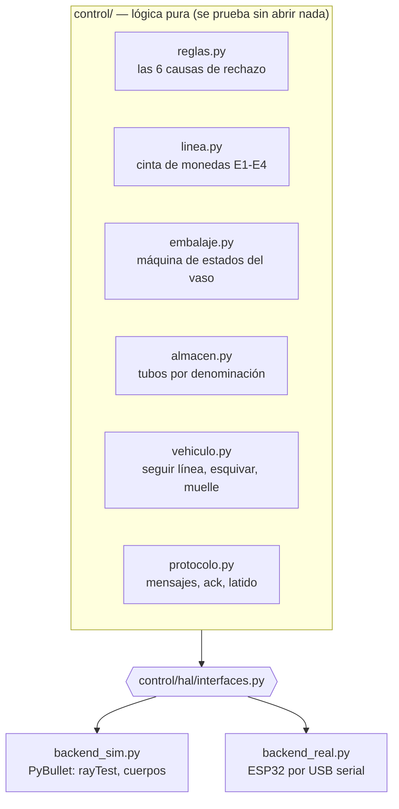
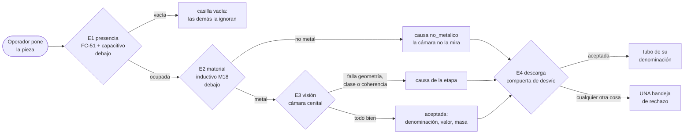
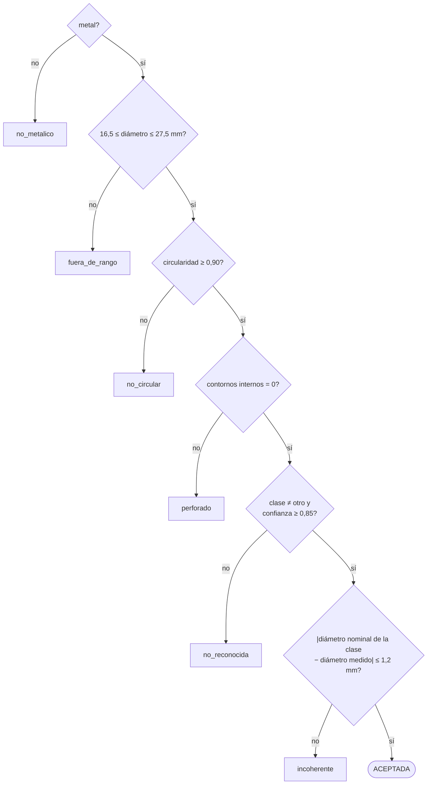
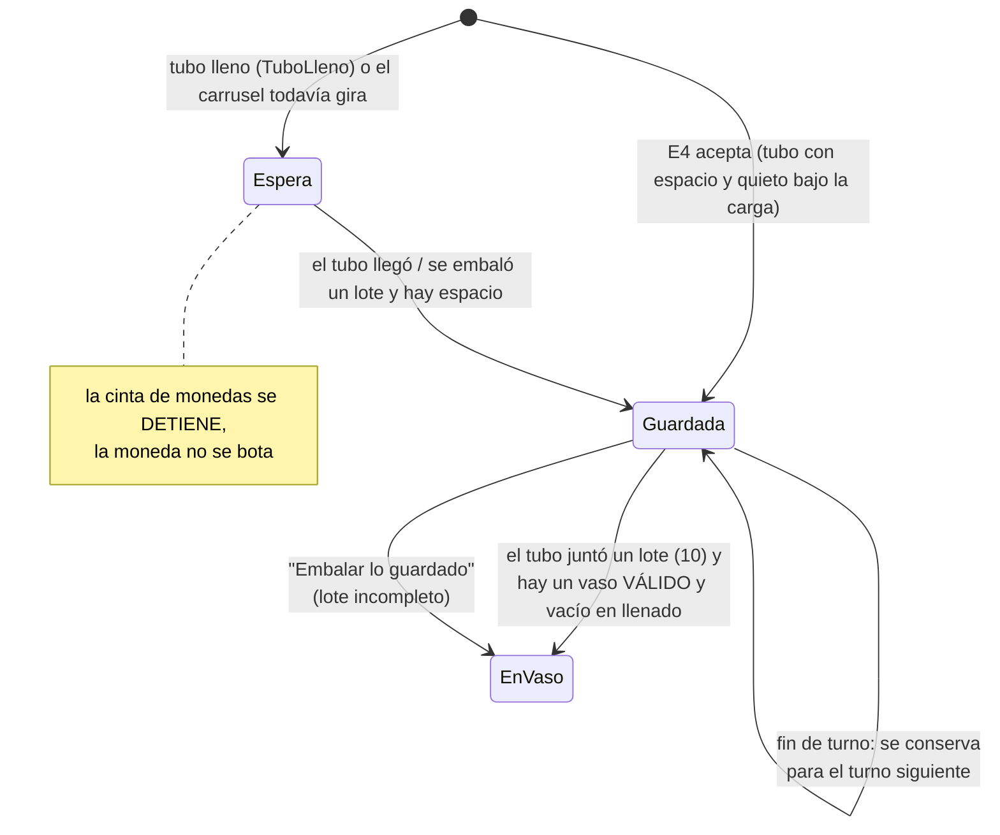
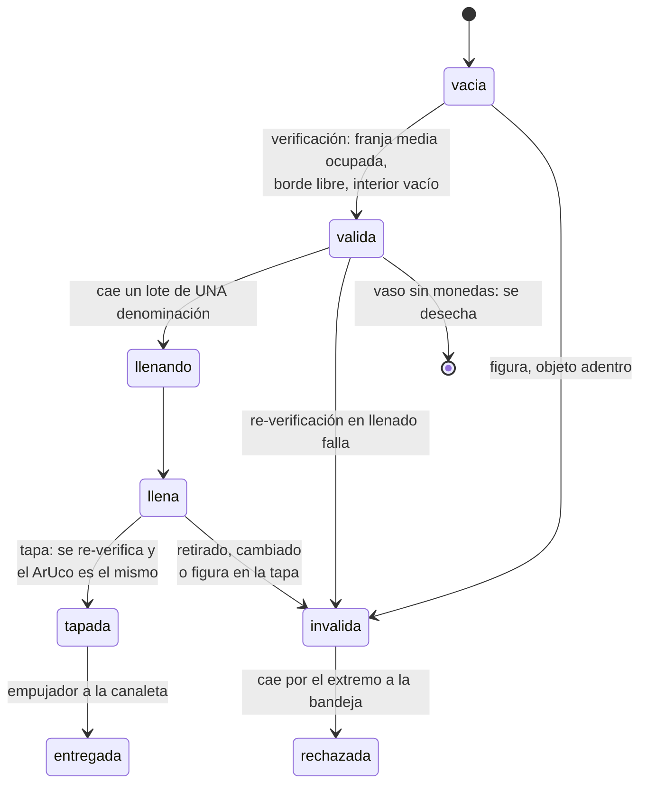
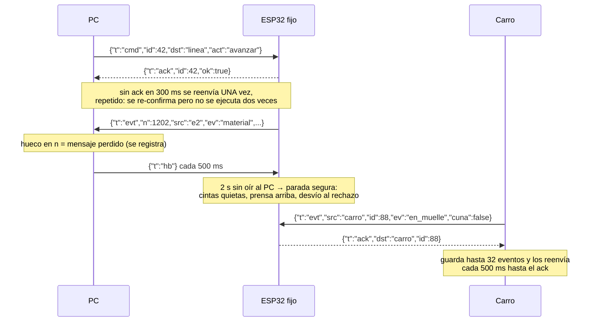
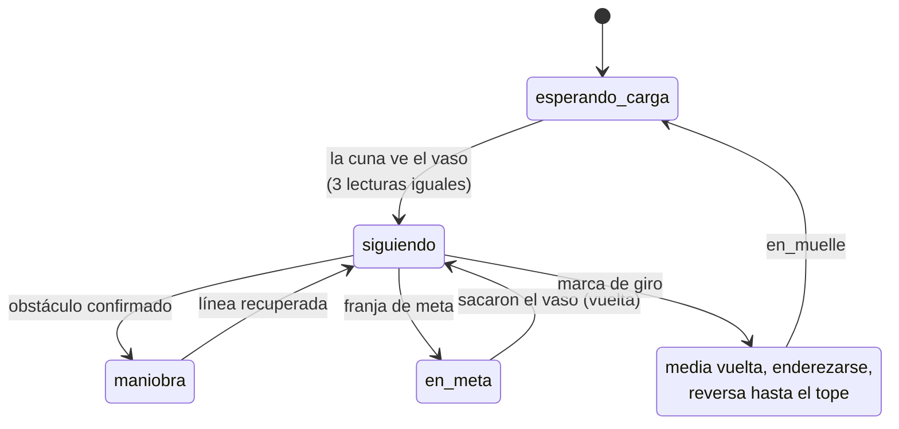

# Lógica interna del sistema

Este documento explica **cómo decide el sistema**, paso a paso y con el código real. Empieza por el
filtrado de monedas, porque es la parte del grupo (elemento 7: detector de elementos de monedas y
vasos) y lo que se va a probar filtro por filtro en la sustentación. Después vienen el embalaje de
los vasos, la cortina de seguridad, la comunicación y, al final y más corto, el carro.

Todos los umbrales que aparecen aquí salen de `config/parametros.yaml`, no están escritos en el
código. Si se cambian ahí, cambia el comportamiento sin tocar una línea de Python.

## Dónde vive la lógica y por qué está separada

La lógica de decisión es **Python puro** en `control/`: no importa PyBullet, ni pyserial, ni OpenCV.
Recibe lecturas ("el inductivo vio metal", "la cámara midió 23,68 mm") y devuelve decisiones ("esta
casilla va al rechazo por `incoherente`"). Quién produce esas lecturas lo decide la capa de abajo, la
HAL (capa de abstracción de hardware):



Por eso la misma lógica corre en la simulación, en las 936 pruebas automáticas (2026-10-05) y (fase 8) contra el
hardware real cambiando una sola línea de configuración (`hardware.backend: real`). Lo que se ve en
el visor no es una animación aparte: es esta lógica decidiendo sobre sensores simulados.

---

## 1. El filtrado de monedas (nuestra parte)

### 1.1 La casilla: la unidad de todo

La cinta de monedas está dividida en **casillas de 40 mm** (separadores sobre una banda negra mate).
Se mueve de a una casilla: avanza 600 ms, se queda quieta 1000 ms, y todo lo que se mide se mide
**con la cinta quieta**. Un ciclo dura 1,6 s, o sea unos 37 elementos por minuto (lento a propósito:
el montaje real verifica con calma).

Cada elemento que entra recibe un **registro** (`CasillaMoneda` en `control/registro.py`) que lo
acompaña de estación en estación. Cada estación escribe lo que descubre y nadie borra lo que escribió
otra:

| Campo | Lo escribe | Ejemplo |
|---|---|---|
| `ocupada` | E1 presencia | `True` |
| `metal` | E2 material | `True` |
| `diametro_mm`, `circularidad`, `contornos_internos` | E3 visión | 23,68 · 0,981 · 0 |
| `clase`, `confianza` | E3 visión (clasificador) | `500_nueva` · 0,94 |
| `aceptada`, `causa` | la primera etapa que rechaza, o E3 al aceptar | `False` · `incoherente` |
| `denominacion`, `valor`, `masa_estimada_g` | E3 al aceptar | 500 · 500 · 7,1 |

La identidad del registro es un **contador propio** (`id_registro`), no el número de cuerpo de
PyBullet: PyBullet reutiliza los números de cuerpos borrados y se mezclarían los registros.

La regla más importante está en `CasillaMoneda.rechazar()`:

```python
def rechazar(self, causa: str) -> None:
    if self.rechazada:
        return          # un rechazo anterior no se revierte ni se sobrescribe
    self.aceptada = False
    self.causa = causa
```

Así la causa que queda es siempre **la primera** que detectó el problema, y el conteo por causa del
dashboard demuestra qué filtro atrapó cada pieza.

### 1.2 Recorrido de un elemento, estación por estación



**E1 — Presencia** (`LineaMonedas.estacion_1_presencia`). Un infrarrojo FC-51 mira la casilla de
carga. Si no ve nada, la casilla queda `ocupada = False` y ninguna estación la vuelve a tocar. En esa
misma casilla, **debajo** de la banda, el sensor capacitivo lee el elemento; su lectura viaja con el
registro hasta E2.

Si el infrarrojo falló (no vio una pieza oscura, por ejemplo) pero en E2 el capacitivo o el inductivo
sí la ven, la planta la registra ahí (`presencia_recuperada`) y sigue normal. Un sensor respalda al
otro.

**E2 — Material** (`estacion_2_material`). El inductivo LJ18A3 (M18, 8 mm) está debajo de la banda.
La tabla de decisión es esta, y el porqué está en el código:

| Capacitivo | Inductivo | Se decide | Por qué |
|:-:|:-:|---|---|
| 1 | 0 | **no metálico** → `no_metalico` | hay algo y no es metal: plástico, bloque de color |
| 1 | 1 | metal | los dos lo ven |
| 0 | 1 | metal | el inductivo **solo** reacciona a metal: si él lo ve, es metal aunque el capacitivo haya fallado |
| 0 | 0 | no metálico | nada, o algo no metálico que el capacitivo no vio |

Es decir, `metal = inductivo`. Lo no metálico queda rechazado aquí y **no gasta un ciclo de cámara**,
pero sigue en la cinta hasta E4 (filtro total, abajo).

**E3 — Visión** (`estacion_5_vision`, el nombre viene de cuando había 7 estaciones). Solo corre si la
casilla sigue viva. La cámara cenital, con anillo de luz y la banda negra de fondo, toma **dos fotos**
por moneda y de ahí salen la geometría y la clase. Luego se aplican tres etapas en orden (sección 1.3).

**E4 — Descarga** (`LineaMonedas.destino`). La pieza cae por el extremo de la cinta a un embudo con
una compuerta de desvío (servo SG90):

- `vacia` → nada que hacer;
- `rechazo` (cualquier causa) → bandeja de rechazo;
- `vaso` (aceptada) → canal al tubo del carrusel de su denominación.

Si una pieza llega a E4 **sin registro** (fallaron E1 y E2 a la vez), la planta no sabe qué es y la
manda al rechazo con motivo `sin_registro`: nunca se guarda algo que ningún sensor reconoció.

### 1.3 Las reglas de decisión (`control/reglas.py`)

Son cuatro etapas independientes. Cada una devuelve una causa o `None` (deja pasar). En cuanto una
rechaza, las siguientes no se evalúan.



| Etapa | Función | Umbral (`filtrado:` en parametros.yaml) | Qué atrapa |
|---|---|---|---|
| Material | `evaluar_material` | — | botones de plástico, bloques |
| Geometría: rango | `evaluar_geometria` | `diametro_min_mm: 16.5`, `diametro_max_mm: 27.5` | fichas muy chicas o muy grandes |
| Geometría: forma | `evaluar_geometria` | `circularidad_minima: 0.90` | bloques y piezas irregulares |
| Geometría: agujeros | `evaluar_geometria` | contornos internos > 0 | arandelas, botones con ojales |
| Clasificación | `evaluar_clasificacion` | `confianza_minima: 0.85` | monedas extranjeras, botones metálicos lisos, caras que no reconoce |
| Coherencia | `evaluar_coherencia` | `tolerancia_coherencia_mm: 1.2` | clase y medida que no cuadran |

**La circularidad** es `4π·área / perímetro²`: da 1,0 para un círculo perfecto y baja con las
esquinas. Un cuadrado da 0,785, así que un bloque cae aunque mida lo mismo que una moneda.

**La coherencia es la regla que muestra que los filtros se complementan.** Cruza dos mediciones
independientes: la clase (que sale de la *cara* de la moneda) contra el diámetro (que sale del
*contorno*). Si el clasificador dice "500 nueva" (nominal 23,7 mm) pero el contorno mide 20,0 mm,
alguna de las dos está equivocada y la pieza se rechaza, aunque el clasificador solo la hubiera
aceptado (escenario `sim/escenarios/pruebas_aisladas/incoherente.yaml`). Una clase mal reconocida en
una sola foto la ataja esta regla.

**Por qué el diámetro no decide solo:** con monedas extranjeras en juego deja de discriminar. Un euro
mide 23,25 mm y cae en medio de las de 500 (23,5 y 23,7); 20 céntimos de euro miden 22,25 mm, junto a
la de 200 nueva (22,4). Por eso la decisión final es por **la cara** (clasificador), y la geometría
hace de compuerta previa y de verificación cruzada. El sistema garantiza rechazar lo que no reconoce
con confianza suficiente; no promete reconocer cualquier moneda del mundo.

### 1.4 Dos fotos por moneda (`reglas.combinar_fotos`)

Una sola foto con un reflejo o una sombra puede no reconocer una moneda buena. Con dos:

| Lo que dicen las fotos | Resultado | Por qué |
|---|---|---|
| Las que reconocen dicen la **misma** clase (aunque la otra no reconozca) | esa clase | un reflejo en una foto no tumba una moneda buena: **baja** los rechazos falsos |
| Reconocen clases **distintas** | `otro` → `no_reconocida` | conflicto: la coherencia no alcanza a desempatar |
| Ninguna reconoce | la de mayor confianza (saldrá `no_reconocida`) | — |

La geometría usa el **promedio** de las dos fotos (baja el ruido de medición) y los contornos
internos, el **máximo** (basta con que una foto vea el agujero).

### 1.5 Filtro total: una sola salida de rechazo

Decisión del grupo (2026-09-25). Antes había un expulsor lateral por estación; ahora **nada sale de
la cinta a mitad de camino**. Todo llega a E4 y una sola compuerta decide. Ventajas:

- menos servos y sensores (se quitaron 2 expulsores y 2 sensores de confirmación), cinta más corta;
- ningún filtro es un cuello de botella donde un rechazo se atasque;
- cada filtro se sigue demostrando por separado, porque la **causa** queda en el registro, en la base
  de datos y en el conteo por causa del dashboard.

La compuerta es **a prueba de fallas**: en reposo apunta al rechazo. Solo se mueve hacia el almacén
para una moneda registrada y aceptada. Si el servo se queda sin energía, o el ESP32 deja de oír al PC,
todo cae al rechazo y nunca una pieza dudosa al almacén.

### 1.6 Voto por mayoría: diseñado para el error

Cada sensor discreto tiene probabilidades reales de falso positivo y falso negativo
(`errores_sensores` en la configuración, sacadas de hoja de datos: presencia 0,5 %, inductivo 1 %,
etc.), y la simulación las aplica. Para que un error aislado no decida, cada estación lee su sensor
`planta.lecturas_por_decision = 3` veces y gana la mayoría (`PlantaSimulada._votar`):

```python
def _votar(self, leer) -> bool:
    n = self.lecturas_por_decision
    return sum(bool(leer()) for _ in range(n)) * 2 > n
```

Con un error por lectura de `p` independiente, fallar la decisión exige 2 de 3 lecturas malas:
`3p² − 2p³`. Para el inductivo (`p = 0,01`) eso es ~0,03 %, unas 30 veces menos que una sola lectura.
`control/tiempos.py` comprueba que esas 3 lecturas, más la ida y vuelta por serial, caben en la pausa
de 1000 ms.

### 1.7 El almacén revólver y los lotes (`control/almacen.py`)

Reglas del grupo: **ninguna moneda colombiana aceptada se descarta** y **cada vaso lleva una sola
denominación**. Por eso las aceptadas no van directo a un vaso: van al tubo de su denominación en un
carrusel de 6 tubos (50, 100, 200, 500, 1000 y "otras" para las series viejas que ya no circulan). El
carrusel lo gira un 28BYJ-48 con un sensor Hall como referencia de posición.



- `lote_listo(tamano)`: devuelve la denominación con un lote completo; si hay varias, la que tiene más
  monedas (la más cerca de llenar su tubo). El tamaño del lote (`monedas_por_vaso: 10`) se cambia en
  caliente desde el dashboard o el asistente.
- Capacidad de cada tubo: 25 (`capacidad_tubo`); "otras": 40.
- Si el tubo está lleno, `guardar` lanza `TuboLleno`: la moneda espera en la descarga y la cinta de
  monedas se detiene, con la alarma `tubo_lleno`. Nunca se bota.
- **El carrusel tiene su tiempo real y la moneda lo espera** (`control/carrusel.py`, 2026-09-28). El
  giro se pide apenas la visión acepta la moneda; en E4 solo cae si su tubo ya está QUIETO bajo la
  carga, si no espera en la descarga (`e4 espera motivo=carrusel_girando`, sin alarma) y la cinta de
  monedas se detiene. Un lote cae con el tubo quieto sobre el agujero y la cinta de vasos no se mueve
  hasta cerrar el obturador. Hueco "gratis": 780 ms; espera por tubo vecino 585 ms, peor caso (tubo
  opuesto) 3316 ms → el ritmo baja de 37,5 a 27,5 (vecino) o 12,2 elem/min (peor). Medido en
  `prueba_completa`: 44 → 63 ciclos (70,4 s → 100,8 s, 31,5 → 22,0 elem/min), 0 monedas a destiempo.
- **La caída ocupa el carrusel** (revisión visual 2026-09-29: en vivo 8 de 15 monedas caían 15-37 mm
  fuera de la boca con el disco girando 22-40°, porque el giro a la siguiente salía en el mismo instante en
  que caía la anterior). Una moneda guardada ocupa el disco hasta llegar al fondo de su tubo
  (`tiempos_ms.caida_moneda_tubo`, 400 ms: 180 mm de caída por embudo, compuerta y canal + rebote) y un
  lote desde que abre el obturador hasta que cierra: `Carrusel.ocupar()` y ningún `pedir` arranca antes.
  La placa hace lo mismo sola (desvío al almacén + avance de la cinta → `carrusel` espera a `moneda`).
  `prueba_completa` (lote 10): 63 → 71 ciclos (113,6 s, 19,5 elem/min); `mixto_20` no cambia (35).

### 1.8 La cinta solo se mueve si tiene algo que hacer

En cada tick (`PlantaSimulada.paso`), la cinta de monedas avanza solo si lleva algo registrado o si
el infrarrojo vio algo en la carga. Vacía y sin carga, se queda quieta esperando
(`cinta_vacia_sin_carga`). Y si una moneda aceptada espera por un tubo lleno, nada más avanza en esa
cinta hasta resolverlo.

### 1.9 Qué se puede demostrar filtro por filtro

Cada causa tiene su escenario aislado en `sim/escenarios/pruebas_aisladas/` (lo usan las pruebas
automáticas y el botón "probar un filtro" de la interfaz):

| Escenario | Qué entra | Causa que debe salir |
|---|---|---|
| `no_metalico.yaml` | botones de plástico, bloques | `no_metalico` |
| `fuera_de_rango.yaml` | piezas metálicas muy chicas o grandes | `fuera_de_rango` |
| `no_circular.yaml` | fichas metálicas irregulares | `no_circular` |
| `perforado.yaml` | botones metálicos con agujero | `perforado` |
| `no_reconocida.yaml` | monedas extranjeras | `no_reconocida` |
| `incoherente.yaml` | clase válida con un diámetro que no le corresponde | `incoherente` |
| `mixto_20.yaml` | 20 elementos mezclados | cada uno a su destino esperado |

---

## 2. Embalaje de los vasos (`control/embalaje.py`)

La segunda cinta lleva vasos opacos en 5 casillas: verificación, llenado, tapa, prensa y descarga. La
idea central: **ninguna estación confía en lo que dijo la anterior**; cada una vuelve a mirar antes de
actuar y puede degradar el vaso a `invalida` en cualquier momento.



- **Verificación** (`verificar_antes_de_llenado`): la cámara de vasos, con un panel de luz detrás, ve
  la silueta y mira dos franjas de la imagen como "barreras virtuales": una a media altura (debe
  estar ocupada) y otra justo encima del borde (debe estar libre). Las dos bien = vaso válido. Un
  VL53L0X mira desde arriba al interior: un vaso con algo adentro no entra. Se guarda el número del
  marcador ArUco (una cinta alrededor del vaso con el mismo ArUco 6 veces).
- **Llenado** (`PlantaSimulada._intentar_embalar` + `llenar_lote`): justo antes de abrir el obturador
  se vuelve a mirar. Si ahí no hay un vaso válido (retirado, una figura, otro vaso), `salto_casilla`:
  la cinta de vasos avanza buscando el siguiente y **las monedas siguen guardadas**. No hay paro de
  línea.
- **Tapa** (`tapar`): se repite la verificación y se compara el ArUco. `es_el_mismo_vaso` solo dice
  "cambiado" si hay dos lecturas y no coinciden; si una no se pudo leer, decide la silueta. Si todo
  está bien, un servo suelta una tapa que cae ~13 mm por gravedad; la cámara confirma que quedó puesta
  (si no, se suelta otra una vez).
- **Prensa** (`prensar`): una leva excéntrica con un MG996R (0 → 180 → 0°) asienta la tapa. La tapa
  sella a presión (30-50 N); la prensa apunta a 60 N y un resorte limita la fuerza, así que un objeto
  extraño no rompe nada. La placa nunca mueve la prensa y el empujador a la vez (`EXCLUYENTES` en
  `firmware/fijo/estacion.py`): si llega la orden de uno mientras el otro se mueve, espera.
- **Descarga** (`descargar`): `entrega` si llegó tapado (el empujador lo pasa a la canaleta), `vacio`
  si nunca recibió monedas, `rechazo` en cualquier otro caso. Los dos últimos **no se empujan**: la
  cinta los deja caer por su extremo a la bandeja de vasos.
- **Vigilancia continua** (`_vigilar_vasos`): en **cada tick** la cámara revisa que ninguna de sus 4
  casillas haya quedado sin su vaso, porque una mano puede sacar uno por arriba sin cruzar la cortina.

## 3. Cortina de seguridad

Un VL53L0X a 65 mm de altura mira a lo largo de la zona de tapa y prensa, del lado del operador, con
su cono real de ~25° modelado con varios rayos. Si ve algo más cerca de lo normal
(140 mm: el alcance del cono simulado, `sim/sensores_sim.ventana_cortina_mm()`, el mismo umbral que
`firmware/preparar.py` le pasa a la placa) en `planta.lecturas_por_decision` lecturas seguidas; y si
pasan más de 150 ms sin una medición nueva (cable flojo), la cortina se da por ACTIVA
(`cortina_sin_lectura`): falla del lado seguro.

1. `EmbalajeVasos.activar_cortina()`: tapa, prensa y empujador quedan **congelados** (sus métodos
   devuelven `False` o lanzan error si se intentan);
2. la prensa **sube** y se detiene arriba, la cinta de vasos se para;
3. la cinta de monedas **sigue** (no hay paro total);
4. al despejarse, la cámara revisa los vasos antes de seguir (`retirado_con_mano`) y la línea retoma
   donde iba, sin reiniciar estados.

La lectura de la cortina no se hace lenta: 33 ms por medición, votada, y `control/tiempos.py`
comprueba que reacciona antes de que baje la prensa. La decisión la toma el ESP32, no el PC: la
seguridad no puede depender del portátil.

## 4. Comunicación (`control/protocolo.py`)

Líneas de JSON a 115200 baudios entre el PC y el ESP32 fijo; ESP-NOW entre el ESP32 fijo y el carro.
El mismo archivo corre en el PC y en los dos ESP32 (compilado con `mpy-cross`), por eso no usa
`dataclasses` ni nada que MicroPython no tenga.



- `parsear_linea` tolera líneas cortadas o con basura: devuelve `None`, se cuenta y se sigue; nunca
  se cae.
- **Regla para soltar un vaso al carro** (`puede_soltar_vaso`): enlace vivo, un estado del carro
  recibido después de la última reconexión, carro en el muelle y cuna vacía. Las cuatro. Si la cuna
  está ocupada: alarma `cuna_ocupada`.

## 5. El carro (`control/vehiculo.py`)

Cada `ControlCarro.paso(lectura, dt)` recibe los 5 infrarrojos, el láser, el ultrasónico y los pulsos
de los encoders, y devuelve la velocidad de cada rueda.



- **Seguir la línea**: la posición de la línea es el promedio de los infrarrojos activos (±30 mm con
  15 mm entre sensores). Control PD: `w = 28·e + 1,2·de/dt`, y la velocidad baja en las curvas
  (`v · max(0,4; 1 − |e| / 30 mm)`). Todo cambio de velocidad pasa por una rampa para que el vaso
  colgado no se balancee.
- **Frenar y detectar**: con algo a menos de 500 mm baja a velocidad de maniobra; a menos de 200 mm
  en **3 lecturas seguidas del láser** (o 2 del ultrasónico, que es el respaldo) cuenta como obstáculo.
- **Esquivar** (`_planear_evasion`): gira sobre su eje ±30° midiendo a cada lado y va por el lado con
  más espacio (empate: izquierda, siempre igual). Sale a 45°, pasa derecho una distancia calculada
  con la geometría del muro y del carro, vuelve a 60° **hasta que el infrarrojo del centro VE la
  línea** y se endereza. No vuelve contando pulsos: con encoders de 10 mm por pulso y ruedas que
  patinan un poco, contar no es confiable; ver la línea sí.
- **Meta y vuelta**: la franja de meta (4 o 5 infrarrojos a la vez, dos lecturas) lo detiene; cuando
  le sacan el vaso vuelve; en la marca de giro da media vuelta, se endereza 15 cm y entra de reversa
  al muelle hasta que los encoders dejan de contar contra el tope.
- **Odometría con corrección**: la posición sale de integrar los encoders y acumula error. Por eso se
  vuelve a poner en su valor conocido en tres puntos fijos: el muelle, la meta y la marca de giro (sin
  esto, tras tres evasiones creía estar a ~30 cm de donde estaba).
- **Órdenes** (asistente o botones): `detener`, `avanzar` (≤ 1,5 m), `retroceder` (≤ 0,3 m: atrás no
  hay sensor), `girar`, `ir_a`, `ir_meta`, `volver_muelle`, `seguir_linea`. `ControlCarro.ordenar`
  las valida otra vez: rechaza destinos dentro de la planta u obstáculos (`motivo_destino`), revisa el
  camino con el láser antes de moverse (`camino_bloqueado`) y en marcha se detiene con `bloqueado` o
  `atascado`. En modo de órdenes no esquiva por su cuenta: se detiene y avisa.

## 6. Resumen: qué hace confiable al sistema

| Idea | Dónde | Qué evita |
|---|---|---|
| Un rechazo nunca se revierte | `CasillaMoneda.rechazar` | que una etapa posterior "salve" una pieza mala |
| Filtros independientes y cruzados | `reglas.py` (coherencia) | que un solo error de visión acepte una pieza |
| Dos fotos por moneda | `combinar_fotos` | rechazos falsos por un reflejo |
| Voto de 3 lecturas | `_votar` | que un error aislado de un sensor decida |
| Compuerta a prueba de fallas | E4 en reposo = rechazo | que un fallo mande basura al almacén |
| Nunca se bota una moneda buena | `TuboLleno`, lotes guardados | pérdidas de monedas aceptadas |
| Re-verificar antes de actuar | `embalaje.py` | llenar o tapar algo que ya no es el vaso |
| Seguridad en el ESP32 | cortina + latido | depender del PC para detener la prensa |
| Volver a la línea viéndola | `_planear_evasion` | acumular error de encoders |
