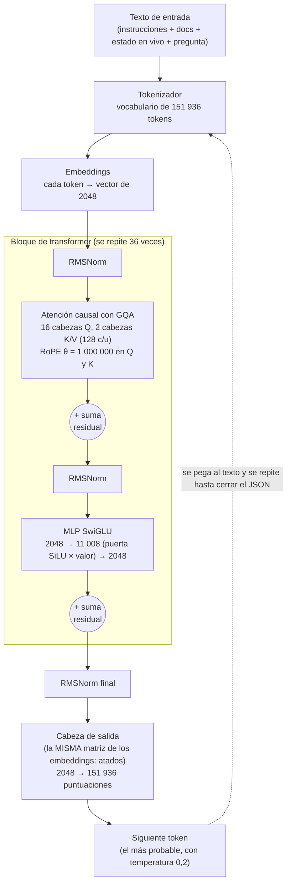
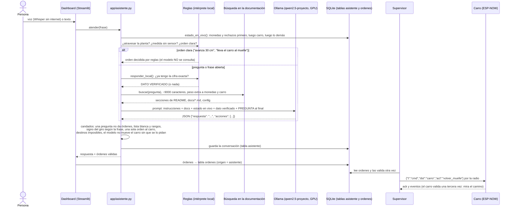

# El modelo de lenguaje local: Qwen2.5-3B en el portátil

El asistente del proyecto (`app/asistente.py`, pestaña "Asistente" del dashboard y la pantalla de la
laptop en el visor 3D) contesta preguntas sobre la corrida y le da órdenes a la línea y al carro. Tiene
tres "cerebros", en este orden:

1. **DeepSeek** (`deepseek-chat`, en internet), si hay una clave válida y hay red.
2. **Qwen2.5-3B**, un modelo de lenguaje que corre EN EL MISMO PORTÁTIL con Ollama, sin internet.
3. **El intérprete de reglas** (expresiones regulares en Python), que siempre está.

Este documento explica el segundo: qué es, cómo está hecho por dentro, cómo se instaló y se usa, por
qué se eligió, qué NO se le deja hacer y cómo le fue en la batería de pruebas. Está escrito para
alguien que nunca ha trabajado con un modelo de lenguaje.

## Qué es un modelo de lenguaje (LLM)

Un LLM (*large language model*) es una red neuronal entrenada con una sola tarea: **dado un texto,
adivinar cuál es el pedazo de texto que sigue**. Nada más. Se entrena con billones de palabras
(libros, páginas web, código) y, a fuerza de adivinar la siguiente palabra en todo eso, termina
aprendiendo gramática, datos del mundo, a seguir instrucciones y a escribir JSON.

Para "contestar" una pregunta, el programa le pasa al modelo un texto que termina justo donde debería
empezar la respuesta; el modelo propone el siguiente pedazo, se pega al texto, y se repite hasta que el
modelo produce una marca de "terminé". Cada respuesta del asistente son unos cientos de vueltas de ese
ciclo.

Consecuencias prácticas que explican muchas decisiones de este proyecto:

- El modelo **no consulta nada por su cuenta**: solo sabe lo que aprendió en su entrenamiento más lo
  que se le pone en el texto de entrada. Por eso, en cada pregunta, el programa le pega las cifras de
  la corrida (sacadas de SQLite) y los pedazos de la documentación que tienen que ver.
- El modelo **no calcula**: adivina texto que "suena" correcto. Si una cifra no está en la entrada, la
  puede inventar con total seguridad. Por eso las cifras exactas se las da el programa.
- El modelo **no ejecuta órdenes**: escribe un JSON con órdenes propuestas, y es el programa el que
  decide si esas órdenes se cumplen (ver "Lo que NO se le deja hacer").

### Qué es un token

El modelo no lee letras ni palabras: lee **tokens**, pedazos de texto de tamaño variable ("carro",
" monedas", "ción", "{"). Un tokenizador parte el texto en tokens y a cada uno le asigna un número de
su **vocabulario** (en Qwen2.5, 151 936 tokens posibles). En español, una palabra son 1 a 3 tokens;
como regla práctica, **1 token ≈ 3 a 4 caracteres**.

El **contexto** es cuántos tokens caben en la entrada más la salida de una sola vez. Todo lo que el
modelo "tiene en la cabeza" para contestar tiene que caber ahí: instrucciones, documentación, cifras,
conversación anterior, pregunta y respuesta.

### Qué es un transformer "decoder"

Qwen2.5 es un **transformer de solo decodificador** (*decoder-only*), la arquitectura de casi todos los
chatbots actuales. Funciona así:

1. Cada token se convierte en un vector de números (su **embedding**: 2048 números en este modelo).
2. Esos vectores pasan por una pila de **bloques** iguales (36 en este modelo). Cada bloque tiene dos
   partes:
   - **Atención**: cada token "mira" a los tokens ANTERIORES y decide cuáles le importan (por ejemplo,
     en "¿cuántas de 500 rechazó?", el token "rechazó" le presta atención a "500"). Es "causal": un
     token nunca mira hacia adelante, porque al generar, lo de adelante todavía no existe.
   - **MLP** (red de capas densas): transforma la información de cada token por separado; ahí queda
     guardada buena parte de lo que el modelo "sabe".
3. Al final, una capa convierte el vector del ÚLTIMO token en una puntuación para cada uno de los
   151 936 tokens del vocabulario: la más probable es el siguiente token.

"Decoder" viene de los transformers originales (2017), que tenían un codificador para leer y un
decodificador para escribir; los modelos de chat se quedaron solo con la parte que escribe.

## La arquitectura de Qwen2.5-3B, con sus cifras

Las cifras salen de dos fuentes que coinciden entre sí:

- el archivo de configuración oficial del modelo en Hugging Face
  (`https://huggingface.co/Qwen/Qwen2.5-3B-Instruct/raw/main/config.json`) y su ficha oficial
  (README del mismo repositorio), consultados el 2026-09-28;
- los metadatos del archivo que Ollama tiene descargado en este portátil (`ollama show qwen2.5:3b` y
  la API `http://localhost:11434/api/show`), que dicen lo mismo en formato GGUF.

| Qué | Valor | Clave en `config.json` / en GGUF |
|---|---|---|
| Tipo | transformer de solo decodificador (`Qwen2ForCausalLM`) | `architectures` |
| Parámetros | 3,09 mil millones (3 085 938 688); 2,77 mil millones sin contar los embeddings | ficha oficial / `general.parameter_count` |
| Vocabulario | 151 936 tokens | `vocab_size` |
| Bloques (capas) | 36 | `num_hidden_layers` / `qwen2.block_count` |
| Dimensión oculta (tamaño del vector de cada token) | 2048 | `hidden_size` / `qwen2.embedding_length` |
| Dimensión intermedia del MLP | 11 008 | `intermediate_size` / `qwen2.feed_forward_length` |
| Cabezas de atención para las consultas (Q) | 16 (de 2048 / 16 = 128 números cada una) | `num_attention_heads` |
| Cabezas de clave/valor (K/V) | 2 → atención de consultas agrupadas (GQA), 8 cabezas Q por cada par K/V | `num_key_value_heads` |
| Posición | RoPE, con θ (theta) = 1 000 000 | `rope_theta` / `qwen2.rope.freq_base` |
| Normalización | RMSNorm, ε = 1·10⁻⁶ | `rms_norm_eps` |
| Activación del MLP | SiLU dentro de un SwiGLU | `hidden_act: silu` + ficha ("SwiGLU") |
| Sesgo en Q, K, V | sí ("Attention QKV bias") | ficha oficial |
| Contexto máximo | 32 768 tokens (genera hasta 8192) | `max_position_embeddings` / ficha |
| Embeddings atados | sí: la misma matriz convierte tokens en vectores a la entrada y vectores en puntuaciones a la salida | `tie_word_embeddings: true` |
| Pesos originales | bfloat16 (16 bits por número) | `torch_dtype` |

Una cuenta que ayuda a entender el tamaño: la tabla de embeddings es de 151 936 × 2048 ≈ 311 millones
de números, justo la diferencia entre 3,09 y 2,77 mil millones de la ficha. Como está "atada", se usa
dos veces (entrada y salida) pero se guarda una sola.

### Qué significa cada pieza

- **RMSNorm**: antes de la atención y antes del MLP, el vector de cada token se reescala para que su
  tamaño (la raíz de la media de sus cuadrados) sea 1, y luego se multiplica por unos pesos aprendidos.
  Mantiene los números en un rango estable a lo largo de 36 bloques. Es una versión más barata de la
  LayerNorm clásica (no resta la media).
- **RoPE** (*rotary position embedding*): la atención, por sí sola, no sabe en qué orden vienen los
  tokens. RoPE "gira" los vectores de consulta y de clave un ángulo que depende de la posición del
  token, de modo que el producto entre dos tokens depende de qué tan lejos están. El θ = 1 000 000
  hace que los giros sean lentos, lo que sirve para contextos largos (hasta 32 768 tokens).
- **Atención con GQA** (*grouped-query attention*): cada token calcula una consulta (Q) por cada una
  de las 16 cabezas, pero las claves (K) y los valores (V) solo tienen 2 cabezas, compartidas por
  grupos de 8 consultas. Pierde muy poca calidad y reduce 8 veces la memoria que hay que guardar de
  los tokens anteriores (la "caché KV"). Para este proyecto es decisivo: con 8192 tokens de contexto
  la caché KV ocupa 2 (K y V) × 36 bloques × 2 cabezas × 128 × 8192 tokens × 2 bytes ≈ **0,3 GB**;
  con 16 cabezas K/V serían ≈ 2,4 GB y el modelo no cabría con ese contexto en la tarjeta de 4 GB.
- **MLP SwiGLU**: el vector de 2048 se proyecta DOS veces a 11 008 (una "puerta" y un "valor"); la
  puerta pasa por SiLU (x · sigmoide(x)), se multiplican elemento a elemento y el resultado se
  proyecta de vuelta a 2048. La puerta deja pasar más o menos de cada una de las 11 008 "ideas".
- **Suma residual**: la salida de la atención y la del MLP se SUMAN al vector que entró, en vez de
  reemplazarlo. Así la información original recorre los 36 bloques sin perderse y el entrenamiento
  de una red tan profunda es estable.

### Diagrama de la arquitectura



## Cómo se usa en el proyecto

### El flujo completo de una pregunta o una orden



### Instalación (fuera del repositorio)

- **Ollama** 0.34.4, el programa que carga el modelo y lo sirve, instalado en
  `D:\Program Files\Ollama` (el disco C: del portátil no se llena: todo lo que no es de Windows va a D:).
- **Los modelos** no están en el repositorio: la variable de entorno de usuario `OLLAMA_MODELS` apunta a
  `D:\cosas uni\Micros\instalados\ollama\models`. El archivo de pesos ocupa 1,93 GB.
- **Cuantización Q4_K_M** (lo dice `ollama show qwen2.5:3b`): los pesos originales están en 16 bits
  por número; en el archivo que se descarga están comprimidos a ~4-5 bits por número (grupos de pesos
  con una escala compartida; la "K" es el método de *k-quants* de llama.cpp y la "M" el tamaño medio,
  que deja algunas capas sensibles con más bits). Pasa de ~6 GB a 1,9 GB con una pérdida de calidad
  pequeña.
- **La GPU**: NVIDIA GeForce RTX 3050 Laptop, 4096 MiB. Medido el 2026-09-28 durante la batería:
  `ollama ps` → `qwen2.5-proyecto`, **2,3 GB, 100 % GPU, contexto 8192** (1,93 GB de pesos + ~0,3 GB
  de caché KV + memoria de cálculo), y la tarjeta completa en **3,6 de 4 GB** porque Windows y los
  programas abiertos ya ocupaban ~1,3 GB antes de cargarlo (la cifra de "3,5 de 4 GB" de la bitácora
  es la misma medición del día anterior).
- `instalar.bat` hace `ollama pull qwen2.5:3b` y crea el modelo del proyecto si encuentra Ollama;
  `python -m app.chequeo` revisa que responda antes de la sustentación.

### El Modelfile: `qwen2.5-proyecto`

Ollama usa por defecto un contexto de unos 4000 tokens. El prompt del asistente (instrucciones +
documentación + estado en vivo + pregunta) lo pasaba, y Ollama **corta por el principio**: se perdían
justo las instrucciones y el modelo contestaba un JSON sin la clave `respuesta`. Por eso
`python -m app.asistente --preparar-local` (función `preparar_local()`) crea una variante con más
contexto a partir de este Modelfile:

```
FROM qwen2.5:3b
PARAMETER num_ctx 8192
PARAMETER temperature 0.2
```

El resto (plantilla de chat con `<|im_start|>`/`<|im_end|>`, licencia) lo hereda del modelo base, como
muestra `ollama show qwen2.5-proyecto --modelfile`. 8192 tokens alcanzan para ~9000 caracteres de
documentación (`MAX_CARACTERES_DOCS_LOCAL`) más el estado en vivo y la pregunta, y la caché KV sigue
cabiendo en la tarjeta gracias a la GQA. Si solo existe el modelo base, el asistente lo usa con
~3000 caracteres de documentación (`MAX_CARACTERES_DOCS_LOCAL_BASE`).

### Cómo le habla el programa

- **El mismo cliente que DeepSeek**: Ollama expone una API compatible con la de OpenAI en
  `http://localhost:11434/v1`, así que se usa la librería `openai` con `base_url` apuntando ahí (y una
  clave cualquiera, `"ollama"`). Mismo prompt, mismo formato de respuesta y misma lista blanca que con
  DeepSeek: cambiar de proveedor no cambia nada del resto del programa.
- **JSON obligatorio**: `response_format={"type": "json_object"}` hace que Ollama restrinja la salida a
  un JSON válido. El programa lee `{"respuesta", "acciones"}`; si el modelo cambia el nombre de la
  clave, toma el primer texto que venga.
- **Temperatura 0,2**: la temperatura controla cuánto se aleja el modelo del token más probable. Con
  0,2 casi siempre elige el más probable: respuestas repetibles y con menos inventos. `max_tokens=900`.
- **Contexto corto y ordenado**: al modelo local no se le manda el README completo ni los últimos
  eventos crudos, y solo los 2 últimos mensajes de la conversación. El orden dentro del mensaje
  importa: primero la documentación y AL FINAL, pegados a la pregunta, el estado en vivo y el dato
  verificado; con las cifras al principio de un texto largo, el modelo chico las ignoraba.
- **El estado en vivo, con el foco del grupo primero**: monedas aceptadas por denominación, rechazos
  por causa, los últimos 5 rechazos, lo último que midió la cámara (diámetro, circularidad, agujeros,
  clase, confianza), el almacén; luego el carro (qué hace, posición, últimos eventos, radio, ruta y
  evasiones); luego lo demás (línea, vasos, cortina, alarmas).
- **Instrucciones con foco**: el prompt de sistema le dice que su especialidad es el filtrado de
  monedas (las 4 estaciones, las 6 causas de rechazo con los umbrales leídos de
  `config/parametros.yaml`, denominaciones, almacén y lotes) y el movimiento del carro, que eso lo
  conteste con más detalle, y que lo demás (vasos, costos, eléctrica...) igual lo responda. La búsqueda
  en la documentación da un peso ×1,3 a las secciones cuyo título trata de monedas, filtros, rechazos,
  carro o ruta (menos la bitácora, cuyos títulos resumen sesiones enteras), sin excluir las demás: el
  peso multiplica un puntaje que ya existe, así que una pregunta de costos sigue trayendo costos.
- **Peso del montaje y consumo**: "¿cuánto pesa el montaje?" no es el peso de las monedas; las reglas
  lo distinguen y le pasan al modelo el total de `docs/peso.md` (13,38 kg) o el consumo calculado de
  `docs/electrica.md` (23,5 W promedio), aclarando que son valores calculados, no medidos.
- **Precarga**: la primera respuesta tarda ~1 minuto si el modelo no está en la GPU;
  `precargar_local()` lo carga en segundo plano al abrir la pestaña Asistente del dashboard y le pide
  a Ollama que lo deje cargado 30 minutos.

## Por qué local, y por qué este tamaño

**Por qué un modelo local:**

- **Sin internet en el salón**: la sustentación es en la universidad y la red puede fallar. El
  enunciado pide el chatbot funcionando; con el modelo en el portátil, el asistente contesta aunque no
  haya red (y la voz también: Whisper y la voz de Windows).
- **La clave de DeepSeek fue rechazada** (error 401, 2026-09-27), tanto la del tema 4 como la que dio
  el usuario. Mientras no haya una válida, el modelo local ES el asistente.
- **Costo cero** por pregunta y **privacidad**: nada de la corrida sale del portátil.
- **Cabe en la tarjeta de 4 GB** con 8192 tokens de contexto y responde en ~5-8 s.

**Por qué 3B y no otro tamaño** (tamaños de la biblioteca oficial de Ollama, Q4_K_M):

| Modelo | Archivo | ¿Cabe en 4 GB con 8192 de contexto? |
|---|---|---|
| qwen2.5:0.5b | 398 MB | sí, de sobra |
| qwen2.5:1.5b | 986 MB | sí, de sobra |
| **qwen2.5:3b** | **1,9 GB** | **sí: 2,3 GB medidos, con ~1,3 GB de Windows al lado** |
| qwen2.5:7b | 4,7 GB | **no**: solo los pesos ya pasan los 4 GB; Ollama tendría que dejar capas en la CPU y cada respuesta tardaría varias veces más |

El 7B quedó descartado por esa cuenta. Los de 1,5B y 0,5B **no se probaron en esta batería**: se
eligió el 3B por criterio, porque es el más grande que cabe con holgura y, en un modelo chico, cada
reducción de tamaño se paga en seguir instrucciones largas y en respetar el formato JSON, que es
justo lo que el asistente necesita. Si hiciera falta liberar la GPU (por ejemplo, para la visión),
el siguiente paso sería probar el 1,5B con esta misma batería antes de cambiarlo.

## Lo que NO se le deja hacer (y los fallos reales que lo explican)

Un modelo de 3 mil millones de parámetros escribe bien, pero se equivoca con seguridad. Todo lo que
tiene consecuencias físicas o numéricas lo decide o lo revisa el programa:

| Candado | Fallo real que lo motivó |
|---|---|
| Las **órdenes claras** las decide el intérprete de reglas; el modelo no se consulta | "gira 45 grados a la derecha" → el modelo inventó una secuencia de **4 órdenes** seguidas |
| **Una sola orden al carro por mensaje** (con cualquier proveedor) | la misma secuencia inventada: una orden nueva reemplaza a la anterior, solo quedaría la última |
| El **signo del giro** lo manda la frase (derecha = negativo) | "a la derecha" → el modelo mandó +45 (izquierda) |
| **Una pregunta nunca da órdenes** | "¿cuántos vasos llegaron a la meta?" → el modelo mandó el carro a un punto |
| El modelo local **no mueve el carro si la frase no pide un movimiento** | mismo caso: una orden al carro que nadie pidió |
| **Destinos imposibles** (dentro de la planta, la canaleta, el muelle por un costado, fuera del piso) se rechazan con el mismo mapa del carro, y "atravesar la planta" lo contestan las reglas | "que vaya al filtro de monedas y lo atraviese" → el modelo prometió que "cruzaría" y lo mandó a (-0,5; 0), dentro de la planta: el carro se atascó |
| **Lista blanca con rangos** (8 acciones del carro, 7 de la línea; avanzar ≤ 1,5 m, retroceder ≤ 0,3 m...) | cualquier orden fuera de la lista o fuera de rango se descarta y se dice por qué |
| **Medidas sin sensor** (temperatura, voltaje, corriente, humedad) las contestan las reglas | "¿voltaje de la batería ahora?" → "7,4 V en este momento": el valor nominal, presentado como medición |
| **DATO VERIFICADO**: si las reglas ya tienen la cifra exacta, va al modelo marcada así | "¿cuánto pesan las monedas?" → el modelo contestó en pesos colombianos (confundió peso con pesos) |
| **Contexto de 8192** y las instrucciones al principio, las cifras al final | con el contexto por defecto, el prompt se cortaba por el principio y el modelo perdía las instrucciones (JSON sin la clave `respuesta`) |
| **Lo técnico del filtrado como dato verificado** y el estado con lo último de la cámara | en la batería del 2026-09-28, antes del cambio: "¿cómo sabe si es de metal?" → "no tiene un sensor específico para detectar metal" (falso: está el inductivo); "¿cuál fue la última moneda que revisó la cámara?" → inventó "una de 500" (el dato no estaba en su entrada); "monedas de mil en el almacén" → dio las aceptadas (3) en vez de las del tubo (8) |

Además, el supervisor vuelve a validar cada orden al sacarla de la tabla `ordenes`, y el carro la
valida una tercera vez (`ControlCarro.ordenar`): mira el camino con su láser antes de moverse y se
detiene si algo aparece adelante. El modelo nunca toca un actuador.

## Resultados de la batería

`python -m app.evaluar_asistente` le hace de verdad cada pregunta al proveedor, sobre una copia de la
base de la última corrida, y revisa la respuesta contra la base (cifras exactas), la documentación
(palabras que tienen que aparecer) y los candados (órdenes que debe o no debe dar). El informe completo,
caso por caso, está en `docs/pruebas-asistente.md`.

| Batería | Casos | `qwen2.5-proyecto` | Solo reglas |
|---|---:|---|---|
| 2026-09-27, primera batería (cifras, técnico, costos, sin dato, órdenes, seguridad, inglés) | 24 | 24 de 24 (mediana 7,5 s) | 24 de 24 |
| 2026-09-28, código ANTERIOR con 13 casos nuevos de monedas y carro | 37 | 33 de 37 (mediana 5,8 s) | 30 de 37 |
| 2026-09-28, con el foco en monedas y carro (+2 casos de peso del montaje y consumo) | 39 | **39 de 39** (mediana 5,5 s, máximo 8,8 s) | **39 de 39** |
| 2026-09-29, + frases trampa ("sigue la línea de producción", "la moneda avanza por la cinta"), detener/parar la línea = pausa, pedidos con "que" ("que vuelva al muelle"); UNA sola copia de la base para los dos proveedores | 60 | **60 de 60** (mediana 5,7 s, máximo 9,5 s) | **60 de 60** |

Por categoría, antes y después del foco (mismas preguntas, misma copia de la base):

| Categoría | Casos | Modelo local antes → después | Reglas antes → después |
|---|---:|---|---|
| Cifras de la corrida | 6 | 6 → 6 | 6 → 6 |
| Técnico | 6 | 6 → 6 | 5 → 6 |
| Costos | 2 | 2 → 2 | 2 → 2 |
| Órdenes (con errores de ortografía) | 5 | 5 → 5 | 5 → 5 |
| Seguridad (incluye una pregunta que NO debe mover el carro) | 3 | 3 → 3 | 3 → 3 |
| **Monedas** (rechazos y causas, "cuánto hay de 500", "monedas de mil en el almasen", última inspección de la cámara, metal, "votones con uecos", el euro) | 7 | **4 → 7** | **2 → 7** |
| **Carro** (dónde está, "que esta asiendo", evasiones y metros, "lleva el carro al muelle porfa", "¿puede ir a la meta?" que no debe moverlo) | 5 | **4 → 5** | **4 → 5** |
| Otros (cortina de seguridad) | 1 | 1 → 1 | 1 → 1 |

Lo que falló antes y qué lo arregló:

- "cuantas monedas de mil hay en el almasen": el modelo dio las aceptadas (3), no las del tubo (8); las
  reglas no entendían "de mil" ni "almasen". Ahora las reglas reconocen la denominación (50…1000,
  "mil", "quinientos") y el almacén, y la cifra va como dato verificado.
- "¿cuál fue la última moneda que revisó la cámara?": el dato no estaba en el estado y el modelo lo
  inventó. Ahora el estado lleva la última inspección (diámetro, circularidad, agujeros, clase, confianza).
- "cómo sabe el sistema si una pieza es de metal": el modelo dijo que no había sensor de metal. Ahora
  lo técnico del filtrado (metal, perforados, monedas extranjeras, celdas de carga) lo sabe el
  intérprete y se le pasa como dato verificado.
- "lleva el carro al muelle porfa": ni las reglas ni el modelo dieron la orden. Las reglas ahora
  entienden "lleva/manda/devuelve" + "muelle".
- En una de las corridas intermedias, "¿qué pin manda los pasos (STEP)?" falló: el modelo contestó
  "M.STEP" (la entrada del driver) en vez de "G25.S" (el GPIO 25), porque no conoce la notación de
  las tablas de cables. El prompt ahora la explica en una línea, y a la búsqueda se le quitan los
  cuadritos de color (`<span …>■</span>`) de esas tablas, que solo gastaban contexto.
- Las reglas solas, además, contestaban "cuánto hay de 500", el euro y "celdas de carga" con un pedazo
  de documentación que no tenía la respuesta.

Lo que la batería NO atrapa (y se vio leyendo las respuestas): el modelo a veces agrega frases
equivocadas alrededor de una cifra correcta. En la última corrida dijo que la última pieza revisada
"fue una de 500 pesos" aunque en la misma respuesta aclara que no la reconoció; llamó "exactos" a pesos
del montaje que en su mayoría son estimados; y a "¿el carro puede ir a la meta?" le agregó una frase
confusa sobre esperar en la meta. Por eso las cifras importantes también se muestran en el dashboard, y
la respuesta del modelo se toma como explicación, no como la fuente del dato.

## Resumen

Qwen2.5-3B es un transformer de solo decodificador de 3,09 mil millones de parámetros (36 bloques,
vectores de 2048, GQA 16/2, RoPE, RMSNorm, SwiGLU, 32 768 tokens de contexto máximo). En el proyecto
corre comprimido a 4 bits (Q4_K_M) con Ollama en la GPU de 4 GB del portátil, con 8192 tokens de
contexto, temperatura 0,2 y respuesta en JSON, a través de la misma API que DeepSeek. Contesta
preguntas con las cifras reales de la corrida y la documentación, con foco en el filtrado de monedas y
el carro; las órdenes, las cifras que ya se conocen y todo lo que puede mover algo los decide o los
revisa el programa, no el modelo.
