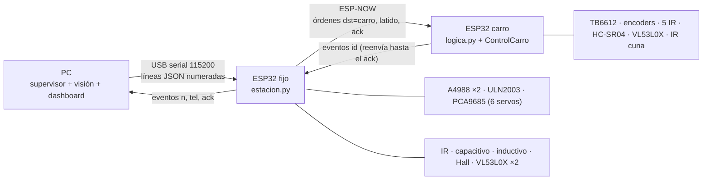

# Firmware de los dos ESP32 (fase 8)

MicroPython, igual que en clase con Thonny. La lógica que ya se probó en la simulación **no se
reescribe**: `control/protocolo.py` y `control/vehiculo.py` (el control completo del carro) se
compilan con `mpy-cross` y corren tal cual en las placas.

## Qué hace cada placa

| Placa | Conectada a | Hace | No hace |
|---|---|---|---|
| **ESP32 fijo** (DevKit 38 pines) | PC por USB | Mueve las dos cintas (A4988), el carrusel (28BYJ-48), los 6 servos (PCA9685); lee presencia, capacitivo, inductivo, Hall, cortina e interior del vaso (VL53L0X); puente ESP-NOW con el carro | Decidir qué es cada pieza: eso es del PC (visión) |
| **ESP32 del carro** (DevKit 30 pines) | Batería 2S, radio ESP-NOW | Corre `ControlCarro`: sigue la línea, esquiva, meta, vuelta, muelle y órdenes del asistente | Esperar al PC para frenar: decide solo a 50 Hz |



Reglas que se cumplen en la placa, sin esperar al PC:

- **Parada segura**: arranca parada y, si deja de oír el latido del PC 2 s, cintas quietas,
  prensa arriba, desvío al rechazo y escapes cerrados.
- **Cortina**: con una mano en la zona sube la prensa y detiene la cinta de vasos en el mismo
  ciclo; la cinta de monedas sigue.
- **Comandos repetidos** (ack perdido): se vuelven a confirmar pero no se ejecutan dos veces.
- **Carro sin radio**: termina la vuelta solo y guarda sus eventos hasta que vuelva el enlace.

## Archivos

```
firmware/
  fijo/estacion.py     lógica de la estación (sin pines: se prueba en el PC)
  fijo/hw.py           pines reales: A4988 por PWM, 28BYJ, PCA9685, VL53L0X con XSHUT
  fijo/main.py         bucle sin bloqueos: USB, radio, estación
  carro/logica.py      radio + ControlCarro (sin pines: se prueba en el PC)
  carro/hw.py          TB6612 con corrección por encoders, IR, HC-SR04 por interrupción, láser
  carro/main.py        ciclo de control a 50 Hz
  comun/enlaces.py     serial USB sin bloquear y ESP-NOW (difusión, sin copiar MACs)
  comun/distancia.py   VL53L0X sin bloquear y varios en el mismo bus (XSHUT + 0x8A)
  preparar.py          arma firmware/salida/<placa>/ (no se versiona)
  subir.py             lo copia a la placa con mpremote
```

`preparar.py` genera `pines.py` desde `sim/conexiones.py` (el mismo conexionado que dibuja los
cables en el visor 3D) y `config_placa.py` desde `config/parametros.yaml` (sección `firmware`):
no hay números copiados a mano. El driver del VL53L0X se descarga al armar (su repositorio no
tiene licencia, por eso no está aquí).

## Pines (generados de `sim/conexiones.py`)

**ESP32 fijo**

| Señal | GPIO |
|---|---|
| `DRIVERS_EN` | 13 |
| `DRIVERS_M_DIR` | 26 |
| `DRIVERS_M_STEP` | 25 |
| `DRIVERS_V_DIR` | 14 |
| `DRIVERS_V_STEP` | 27 |
| `HALL_S` | 39 |
| `HUB_I2C_SCL` | 17 |
| `HUB_I2C_SDA` | 16 |
| `OPTO_OUT1` | 35 |
| `OPTO_OUT2` | 36 |
| `PRESENCIA_OUT` | 34 |
| `ULN2003_IN1` | 32 |
| `ULN2003_IN2` | 33 |
| `ULN2003_IN3` | 23 |
| `ULN2003_IN4` | 4 |
| `VL53_CORTINA_XSHUT` | 19 |
| `VL53_INTERIOR_XSHUT` | 18 |

**ESP32 carro**

| Señal | GPIO |
|---|---|
| `ENC_DER_D0` | 19 |
| `ENC_IZQ_D0` | 18 |
| `HCSR04_ECHO` | 23 |
| `HCSR04_TRIG` | 17 |
| `IR_CUNA_DO` | 14 |
| `IR_LINEA_OUT1` | 34 |
| `IR_LINEA_OUT2` | 35 |
| `IR_LINEA_OUT3` | 36 |
| `IR_LINEA_OUT4` | 39 |
| `IR_LINEA_OUT5` | 16 |
| `TB6612_AIN1` | 26 |
| `TB6612_AIN2` | 27 |
| `TB6612_BIN1` | 32 |
| `TB6612_BIN2` | 13 |
| `TB6612_PWMA` | 25 |
| `TB6612_PWMB` | 33 |
| `TB6612_STBY` | 4 |

Los dos buses I2C: G21/G22 (PCA9685 en el fijo, láser frontal en el carro) y G16/G17 en el fijo
(los dos VL53L0X, direcciones 0x30 y 0x31 puestas con sus XSHUT al arrancar).

## Cómo subirlo

1. Una vez por placa, grabar MicroPython 1.29 (el `.bin` de micropython.org/download/ESP32_GENERIC):
   ```
   python -m esptool --chip esp32 erase_flash
   python -m esptool --chip esp32 write_flash -z 0x1000 ESP32_GENERIC-v1.29.bin
   ```
2. Con Thonny **cerrado** (si no, el puerto queda ocupado):
   ```
   python -m firmware.subir fijo            # busca el ESP32 solo (CP2102/CH340)
   python -m firmware.subir carro --puerto COM7
   ```
3. En `config/parametros.yaml` cambiar `hardware.backend: sim` por `real` y abrir `visor.bat`.

## Probar sin las placas

- `python -m app.puente_serial`: se conecta al ESP32 fijo o, si no hay, a una **estación
  emulada** (el mismo `estacion.py` con hardware falso). Muestra la telemetría, los mensajes
  perdidos y la **última línea cruda**: si no cambia, el ESP32 no está mandando nada; si cambia
  pero no se entiende, es formato, no cables.
- `pytest tests/firmware/test_firmware.py`: compila todo con mpy-cross y prueba la estación, el carro
  (con el `ControlCarro` real) y el puente de punta a punta.

## Valores provisionales

Todo lo de `firmware:` en `config/parametros.yaml` es PROVISIONAL hasta medirlo en el montaje:
mm por vuelta del rodillo (40), ángulos de cada servo, umbral de la cortina (150 mm), polaridad
de cada módulo y la velocidad máxima de las ruedas del carro (0,55 m/s).
